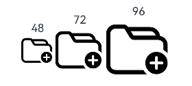
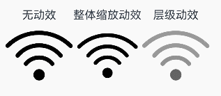
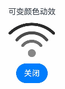
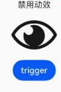
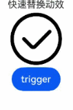
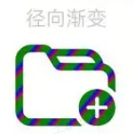
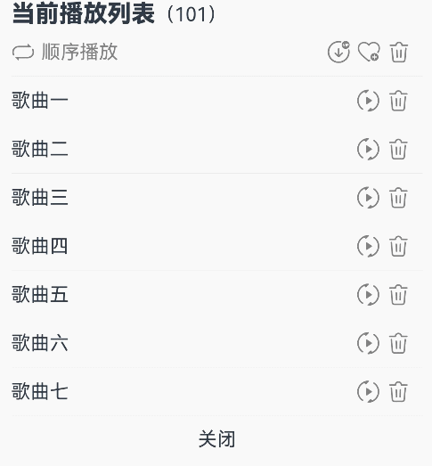

# 图标小符号 (SymbolGlyph/SymbolSpan)
<!--Kit: ArkUI-->
<!--Subsystem: ArkUI-->
<!--Owner: @hddgzw-->
<!--SE: @pssea-->
<!--TSE: @jiaoaozihao-->

SymbolGlyph是图标小符号组件，便于使用精美的图标，如渲染多色图标和使用动效图标。SymbolSpan作为Text组件的子组件，可在文本中穿插显示图标小符号。具体用法请参考[SymbolGlyph](../reference/apis-arkui/arkui-ts/ts-basic-components-symbolGlyph.md)和[SymbolSpan](../reference/apis-arkui/arkui-ts/ts-basic-components-symbolSpan.md)组件的文档。


## 创建图标

SymbolGlyph通过$r引用Resource资源来创建，目前仅支持系统预置的Symbol资源名。<!--RP1--><!--RP1End-->

  ```ts
  SymbolGlyph($r('sys.symbol.ohos_folder_badge_plus'))
    .fontSize(96)
    .renderingStrategy(SymbolRenderingStrategy.SINGLE)
    .fontColor([Color.Black, Color.Green, Color.White])
  ```
  


## 添加到文本中

[SymbolSpan](../reference/apis-arkui/arkui-ts/ts-basic-components-symbolSpan.md)可作为[Text](../reference/apis-arkui/arkui-ts/ts-basic-components-text.md)的子组件用于显示图标小符号。可以在一个Text组件内添加多个SymbolSpan，从而展示一串连续的图标。  

- 创建SymbolSpan。

  SymbolSpan组件需嵌入在Text组件中才能显示，单独使用不会呈现任何内容。


  ```ts
  Text() {
    SymbolSpan($r('sys.symbol.ohos_trash'))
      .fontWeight(FontWeight.Normal)
      .fontSize(96)
  }
  ```
  


- 通过[fontSize](../reference/apis-arkui/arkui-ts/ts-basic-components-symbolSpan.md#fontsize)属性设置SymbolSpan的大小。


  ```ts
  Row() {
    Column() {
      Text("48")
      Text() {
        SymbolSpan($r('sys.symbol.ohos_folder_badge_plus'))
          .fontSize(48)
          .renderingStrategy(SymbolRenderingStrategy.SINGLE)
          .fontColor([Color.Black, Color.Green, Color.White])
      }
    }

    Column() {
      Text("72")
      Text() {
        SymbolSpan($r('sys.symbol.ohos_folder_badge_plus'))
          .fontSize(72)
          .renderingStrategy(SymbolRenderingStrategy.SINGLE)
          .fontColor([Color.Black, Color.Green, Color.White])
      }
    }

    Column() {
      Text("96")
      Text() {
        SymbolSpan($r('sys.symbol.ohos_folder_badge_plus'))
          .fontSize(96)
          .renderingStrategy(SymbolRenderingStrategy.SINGLE)
          .fontColor([Color.Black, Color.Green, Color.White])
      }
    }
  }
  ```
  

- 通过[fontWeight](../reference/apis-arkui/arkui-ts/ts-basic-components-symbolSpan.md#fontweight)属性设置SymbolSpan组件的粗细。

  ```ts
  Row() {
    Column() {
      Text("Light")
      Text() {
        SymbolSpan($r('sys.symbol.ohos_trash'))
          .fontWeight(FontWeight.Lighter)
          .fontSize(96)
      }
    }

    Column() {
      Text("Normal")
      Text() {
        SymbolSpan($r('sys.symbol.ohos_trash'))
          .fontWeight(FontWeight.Normal)
          .fontSize(96)
      }
    }

    Column() {
      Text("Bold")
      Text() {
        SymbolSpan($r('sys.symbol.ohos_trash'))
          .fontWeight(FontWeight.Bold)
          .fontSize(96)
      }
    }
  }
  ```
  

- 通过[fontColor](../reference/apis-arkui/arkui-ts/ts-basic-components-symbolSpan.md#fontcolor)属性设置SymbolSpan的颜色。

  ```ts
  Row() {
    Column() {
      Text("Black")
      Text() {
          SymbolSpan($r('sys.symbol.ohos_folder_badge_plus'))
            .fontSize(96)
            .fontColor([Color.Black])
      }
    }

    Column() {
      Text("Green")
      Text() {
        SymbolSpan($r('sys.symbol.ohos_folder_badge_plus'))
          .fontSize(96)
          .fontColor([Color.Green])
      }
    }

    Column() {
      Text("Pink")
      Text() {
        SymbolSpan($r('sys.symbol.ohos_folder_badge_plus'))
          .fontSize(96)
          .fontColor([Color.Pink])
      }
    }
  }
  ```
  

- 通过[renderingStrategy](../reference/apis-arkui/arkui-ts/ts-basic-components-symbolSpan.md#renderingstrategy)属性设置SymbolSpan的渲染策略。

  ```ts
  Row() {
    Column() {
      Text("单色")
      Text() {
        SymbolSpan($r('sys.symbol.ohos_folder_badge_plus'))
          .fontSize(96)
          .renderingStrategy(SymbolRenderingStrategy.SINGLE)
          .fontColor([Color.Black, Color.Green, Color.White])
      }
    }

    Column() {
      Text("多色")
      Text() {
        SymbolSpan($r('sys.symbol.ohos_folder_badge_plus'))
          .fontSize(96)
          .renderingStrategy(SymbolRenderingStrategy.MULTIPLE_COLOR)
          .fontColor([Color.Black, Color.Green, Color.White])
      }
    }

    Column() {
      Text("分层")
      Text() {
        SymbolSpan($r('sys.symbol.ohos_folder_badge_plus'))
          .fontSize(96)
          .renderingStrategy(SymbolRenderingStrategy.MULTIPLE_OPACITY)
          .fontColor([Color.Black, Color.Green, Color.White])
      }
    }
  }
  ```
  

- 通过[effectStrategy](../reference/apis-arkui/arkui-ts/ts-basic-components-symbolSpan.md#effectstrategy)属性设置SymbolSpan的动效策略。

  ```ts
  Row() {
    Column() {
      Text("无动效")
      Text() {
        SymbolSpan($r('sys.symbol.ohos_wifi'))
          .fontSize(96)
          .effectStrategy(SymbolEffectStrategy.NONE)
      }
    }

    Column() {
      Text("整体缩放动效")
      Text() {
        SymbolSpan($r('sys.symbol.ohos_wifi'))
          .fontSize(96)
          .effectStrategy(SymbolEffectStrategy.SCALE)
      }
    }

    Column() {
      Text("层级动效")
      Text() {
        SymbolSpan($r('sys.symbol.ohos_wifi'))
          .fontSize(96)
          .effectStrategy(SymbolEffectStrategy.HIERARCHICAL)
      }
    }
  }
  ```
  

- SymbolSpan不支持通用事件。

## 自定义图标动效

相较于effectStrategy属性在启动时即触发动效，可以通过以下两种方式来控制动效的播放状态，以及选择更多样化的动效策略。

关于effectStrategy属性与symbolEffect属性的多种动态属性使用及生效原则，详情请参阅[SymbolGlyph.symbolEffect](../reference/apis-arkui/arkui-ts/ts-basic-components-symbolGlyph.md#symboleffect12-1)属性的说明。  

- 通过设置SymbolEffect属性，可以同时配置SymbolGlyph的动效策略和播放状态。

  ```ts
  @State isActive: boolean = true;
  Column() {
    Text("可变颜色动效")
    SymbolGlyph($r('sys.symbol.ohos_wifi'))
      .fontSize(96)
      .symbolEffect(new HierarchicalSymbolEffect(EffectFillStyle.ITERATIVE), this.isActive)
    Button(this.isActive ? '关闭' : '播放').onClick(() => {
      this.isActive = !this.isActive;
    })
  }
  ```
  

- 通过设置SymbolEffect属性，可以同时指定SymbolGlyph的动画效果策略及其播放触发条件。 

  ```ts
  @State triggerValueReplace: number = 0;
  Column() {
    Text("弹跳动效")
    SymbolGlyph($r('sys.symbol.ellipsis_message_1'))
      .fontSize(96)
      .fontColor([Color.Gray])
      .symbolEffect(new BounceSymbolEffect(EffectScope.WHOLE, EffectDirection.UP), this.triggerValueReplace)
    Button('trigger').onClick(() => {
      this.triggerValueReplace = this.triggerValueReplace + 1;
    })
  }
  ```
  

- 从API version 20开始，支持通过设置SymbolEffect属性为[DisableSymbolEffect](../reference/apis-arkui/arkui-ts/ts-basic-components-symbolGlyph.md#disablesymboleffect20)，可以指定SymbolGlyph的禁用动画效果及其播放触发条件。

  ```ts
  @State triggerValueReplace: number = 0;
  @State renderMode: number = 1;
  replaceFlag: boolean = true;

  Column() {
    Text("禁用动效")
    SymbolGlyph(this.replaceFlag ? $r('sys.symbol.eye_slash') : $r('sys.symbol.eye'))
      .fontSize(96)
      .renderingStrategy(this.renderMode)
      .symbolEffect(new DisableSymbolEffect(EffectScope.LAYER), this.triggerValueReplace)
    Button('trigger').onClick(() => {
      this.replaceFlag = !this.replaceFlag;
      this.triggerValueReplace = this.triggerValueReplace + 1;
    })
  }
  ```
  

- 从API version 20开始，支持通过设置SymbolEffect属性为[QuickReplaceSymbolEffect](../reference/apis-arkui/arkui-ts/ts-basic-components-symbolGlyph.md#quickreplacesymboleffect20)，可以指定SymbolGlyph的快速替换动画效果及其播放触发条件。

  ```ts
  @State triggerValueReplace: number = 0;
  replaceFlag: boolean = true;

  Column() {
    Text("快速替换动效")
    SymbolGlyph(this.replaceFlag ? $r('sys.symbol.checkmark_circle') : $r('sys.symbol.repeat_1'))
      .fontSize(96)
      .symbolEffect(new QuickReplaceSymbolEffect(EffectScope.WHOLE), this.triggerValueReplace)
    Button('trigger').onClick(() => {
      this.replaceFlag = !this.replaceFlag;
      this.triggerValueReplace = this.triggerValueReplace + 1;
    })
  }
  ```
  

## 设置阴影和渐变色

- 从API version 20开始，支持通过[symbolShadow](../reference/apis-arkui/arkui-ts/ts-basic-components-symbolGlyph.md#symbolshadow20)接口实现了symbolGlyph组件显示阴影效果。

  ```ts
  @State isActive: boolean = true;

  options: ShadowOptions = {
    radius: 10.0,
    color: Color.Blue,
    offsetX: 10,
    offsetY: 10,
  };

  Column() {
    Text("阴影能力")
    SymbolGlyph($r('sys.symbol.ohos_wifi'))
      .fontSize(96)
      .symbolEffect(new HierarchicalSymbolEffect(EffectFillStyle.ITERATIVE), !this.isActive)
      .symbolShadow(this.options)
    Button(!this.isActive ? '关闭' : '播放').onClick(() => {
      this.isActive = !this.isActive;
    })
  }
  ```
  

- 从API version 20开始，支持通过[shaderStyle](../reference/apis-arkui/arkui-ts/ts-basic-components-symbolGlyph.md#shaderstyle20)接口实现了symbolGlyph组件显示渐变色效果。 

  ```ts
  radialGradientOptions: RadialGradientOptions = {
    center: ["50%", "50%"],
    radius: "20%",
    colors: [[Color.Red, 0.0], [Color.Blue, 0.3], [Color.Green, 0.5]],
    repeating: true,
  };

  Column() {
    Text('径向渐变')
      .fontSize(18)
      .fontColor(0xCCCCCC)
      .textAlign(TextAlign.Center)
    SymbolGlyph($r('sys.symbol.ohos_folder_badge_plus'))
      .fontSize(96)
      .shaderStyle([new RadialGradientStyle(this.radialGradientOptions)])
  }
  ```
  

## 添加事件

SymbolGlyph组件可以添加通用事件，例如绑定[onClick](../reference/apis-arkui/arkui-ts/ts-universal-events-click.md#onclick)、[onTouch](../reference/apis-arkui/arkui-ts/ts-universal-events-touch.md#ontouch)等事件来响应操作。

```ts
@State wifiColor: ResourceColor = Color.Black;
SymbolGlyph($r('sys.symbol.ohos_wifi'))
  .fontSize(96)
  .fontColor([this.wifiColor])
  .onClick(() => {
    this.wifiColor = Color.Gray;
  })
```


## 场景示例

该示例通过symbolEffect、fontSize、fontColor属性展示了播放列表的效果。

```ts
// xxx.ets
@Entry
@Component
struct Index {
  @State triggerValueReplace: number = 0;
  @State symbolSources: Resource[] =
    [$r('sys.symbol.repeat'), $r('sys.symbol.repeat_1'), $r('sys.symbol.arrow_left_arrow_right')];
  @State symbolSourcesIndex: number = 0;
  @State symbolText: string[] = ['顺序播放', '单曲循环', '随机播放'];
  @State symbolTextIndex: number = 0;
  @State fontColorValue: ResourceColor = Color.Grey;
  @State fontColorValue1: ResourceColor = '#E8E8E8';

  build() {
    Column({ space: 10 }) {
      Row() {
        Text() {
          Span('当前播放列表')
            .fontSize(20)
            .fontWeight(FontWeight.Bolder)
          Span('（101）')
        }
      }

      Row() {
        Row({ space: 5 }) {
          SymbolGlyph(this.symbolSources[this.symbolSourcesIndex])
            .symbolEffect(new ReplaceSymbolEffect(EffectScope.WHOLE), this.triggerValueReplace)
            .fontSize(20)
            .fontColor([this.fontColorValue])
          Text(this.symbolText[this.symbolTextIndex])
            .fontColor(this.fontColorValue)
        }
        .onClick(() => {
          this.symbolTextIndex++;
          this.symbolSourcesIndex++;
          this.triggerValueReplace++;
          if (this.symbolSourcesIndex > (this.symbolSources.length - 1)) {
            this.symbolSourcesIndex = 0;
            this.triggerValueReplace = 0;
          }
          if (this.symbolTextIndex > (this.symbolText.length - 1)) {
            this.symbolTextIndex = 0;
          }
        })
        .width('75%')

        Row({ space: 5 }) {
          Text() {
            SymbolSpan($r('sys.symbol.arrow_down_circle_badge_vip_circle_filled'))
              .fontColor([this.fontColorValue])
              .fontSize(20)
          }

          Text() {
            SymbolSpan($r('sys.symbol.heart_badge_plus'))
              .fontColor([this.fontColorValue])
              .fontSize(20)
          }

          Text() {
            SymbolSpan($r('sys.symbol.ohos_trash'))
              .fontColor([this.fontColorValue])
              .fontSize(20)
          }
        }
        .width('25%')
      }

      Divider().width(5).color(this.fontColorValue1).width('98%')
      Row() {
        Row() {
          Text("歌曲一")
        }.width('82%')

        Row({ space: 5 }) {
          SymbolGlyph($r('sys.symbol.play_arrow_triangle_2_circlepath'))
            .fontColor([this.fontColorValue])
            .fontSize(20)
          SymbolGlyph($r('sys.symbol.trash'))
            .fontColor([this.fontColorValue])
            .fontSize(20)
        }
      }

      Divider().width(5).color(this.fontColorValue1).width('98%')
      Row() {
        Row() {
          Text("歌曲二")
        }.width('82%')

        Row({ space: 5 }) {
          SymbolGlyph($r('sys.symbol.play_arrow_triangle_2_circlepath'))
            .fontColor([this.fontColorValue])
            .fontSize(20)
          SymbolGlyph($r('sys.symbol.trash'))
            .fontColor([this.fontColorValue])
            .fontSize(20)
        }
      }

      Divider().width(5).color(this.fontColorValue1).width('98%')
      Row() {
        Row() {
          Text("歌曲三")
        }.width('82%')

        Row({ space: 5 }) {
          SymbolGlyph($r('sys.symbol.play_arrow_triangle_2_circlepath'))
            .fontColor([this.fontColorValue])
            .fontSize(20)
          SymbolGlyph($r('sys.symbol.trash'))
            .fontColor([this.fontColorValue])
            .fontSize(20)
        }
      }

      Divider().width(5).color(this.fontColorValue1).width('98%')
      Row() {
        Row() {
          Text("歌曲四")
        }.width('82%')

        Row({ space: 5 }) {
          SymbolGlyph($r('sys.symbol.play_arrow_triangle_2_circlepath'))
            .fontColor([this.fontColorValue])
            .fontSize(20)
          SymbolGlyph($r('sys.symbol.trash'))
            .fontColor([this.fontColorValue])
            .fontSize(20)
        }
      }

      Divider().width(5).color(this.fontColorValue1).width('98%')
      Row() {
        Row() {
          Text("歌曲五")
        }.width('82%')

        Row({ space: 5 }) {
          SymbolGlyph($r('sys.symbol.play_arrow_triangle_2_circlepath'))
            .fontColor([this.fontColorValue])
            .fontSize(20)
          SymbolGlyph($r('sys.symbol.trash'))
            .fontColor([this.fontColorValue])
            .fontSize(20)
        }
      }

      Divider().width(5).color(this.fontColorValue1).width('98%')
      Row() {
        Row() {
          Text("歌曲六")
        }.width('82%')

        Row({ space: 5 }) {
          SymbolGlyph($r('sys.symbol.play_arrow_triangle_2_circlepath'))
            .fontColor([this.fontColorValue])
            .fontSize(20)
          SymbolGlyph($r('sys.symbol.trash'))
            .fontColor([this.fontColorValue])
            .fontSize(20)
        }
      }

      Divider().width(5).color(this.fontColorValue1).width('98%')
      Row() {
        Row() {
          Text("歌曲七")
        }.width('82%')

        Row({ space: 5 }) {
          SymbolGlyph($r('sys.symbol.play_arrow_triangle_2_circlepath'))
            .fontColor([this.fontColorValue])
            .fontSize(20)
          SymbolGlyph($r('sys.symbol.trash'))
            .fontColor([this.fontColorValue])
            .fontSize(20)
        }
      }

      Divider().width(5).color(this.fontColorValue1).width('98%')
      Column() {
        Text("关闭")
      }
      .alignItems(HorizontalAlign.Center)
      .width('98%')
    }
    .alignItems(HorizontalAlign.Start)
    .width('100%')
    .height(400)
    .padding({
      left: 10,
      top: 10
    })
  }
}
```

