# 文本显示 (Text/Span)


Text是文本组件，用于展示用户视图，如显示文章的文字内容。该组件支持绑定自定义文本选择菜单，用户可根据需要选择不同功能。此外，还可以扩展自定义菜单，丰富可用选项，进一步提升用户体验。Span则用于展示行内文本。  

具体用法请参考[Text](../reference/apis-arkui/arkui-ts/ts-basic-components-text.md)和[Span](../reference/apis-arkui/arkui-ts/ts-basic-components-span.md)组件的使用说明。


## 创建文本

Text可通过以下两种方式来创建：


- string字符串。

  ```ts
  Text('我是一段文本')
  ```


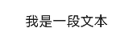


- 引用Resource资源。

  资源引用类型可以通过$r创建Resource类型对象，文件位置为/resources/base/element/string.json，具体内容如下：

  ```json
  {
    "string": [
      {
        "name": "module_desc",
        "value": "模块描述"
      }
    ]
  }
  ```

  ```ts
  Text($r('app.string.module_desc'))
    .baselineOffset(0)
    .fontSize(30)
    .border({ width: 1 })
    .padding(10)
    .width(300)
  ```

  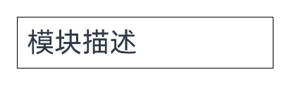


## 添加子组件

[Span](../reference/apis-arkui/arkui-ts/ts-basic-components-span.md)只能作为[Text](../reference/apis-arkui/arkui-ts/ts-basic-components-text.md)和[RichEditor](../reference/apis-arkui/arkui-ts/ts-basic-components-richeditor.md)组件的子组件显示文本内容。可以在一个Text内添加多个Span来显示一段信息，例如产品说明书、承诺书等。

- 创建Span。

  Span组件需嵌入在Text组件中才能显示，单独使用时不会显示任何内容。Text与Span同时配置文本内容时，Span内容将覆盖Text内容。


  ```ts
  Text('我是Text') {
    Span('我是Span')
  }
  .padding(10)
  .borderWidth(1)
  ```

  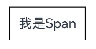

- 设置文本装饰线及颜色。

  通过[decoration](../reference/apis-arkui/arkui-ts/ts-basic-components-span.md#decoration)设置文本装饰线及颜色。


  ```ts
  Text() {
    Span('我是Span1，').fontSize(16).fontColor(Color.Grey)
      .decoration({ type: TextDecorationType.LineThrough, color: Color.Red })
    Span('我是Span2').fontColor(Color.Blue).fontSize(16)
      .fontStyle(FontStyle.Italic)
      .decoration({ type: TextDecorationType.Underline, color: Color.Black })
    Span('，我是Span3').fontSize(16).fontColor(Color.Grey)
      .decoration({ type: TextDecorationType.Overline, color: Color.Green })
  }
  .borderWidth(1)
  .padding(10)
  ```

  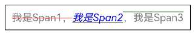

- 通过[textCase](../reference/apis-arkui/arkui-ts/ts-basic-components-span.md#textcase)设置文字一直保持大写或者小写状态。

  ```ts
  Text() {
    Span('I am Upper-span').fontSize(12)
      .textCase(TextCase.UpperCase)
  }
  .borderWidth(1)
  .padding(10)
  ```

  

- 添加事件。

  由于Span组件无尺寸信息，仅支持添加点击事件[onClick](../reference/apis-arkui/arkui-ts/ts-universal-events-click.md#onclick)、悬浮事件[onHover](../reference/apis-arkui/arkui-ts/ts-universal-events-hover.md#onhover)。


  ```ts
  // xxx.ets
  @Entry
  @Component
  struct Index {
    @State textStr1: string = '';
    @State textStr2: string = '';

    build() {
      Row() {
        Column() {
          Text() {
            Span('I am Upper-span')
              .fontSize(12)
              .textCase(TextCase.UpperCase)
              .fontSize(30)
              .onClick(() => {
                console.info('Span onClick is triggering');
                this.textStr1 = 'Span onClick is triggering';
              })
              .onHover(() => {
                console.info('Span onHover is triggering');
                this.textStr2 = 'Span onHover is triggering';
              })
          }

          Text('onClick：' + this.textStr1)
            .fontSize(20)
          Text('onHover：' + this.textStr2)
            .fontSize(20)
        }.width('100%')
      }
      .height('100%')
    }
  }
  ```

  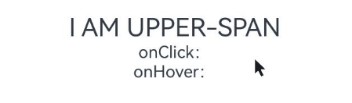

## 创建自定义文本样式

- 通过[textAlign](../reference/apis-arkui/arkui-ts/ts-basic-components-text.md#textalign)属性设置文本对齐样式。

  ```ts
  Text('左对齐')
    .width(300)
    .textAlign(TextAlign.Start)
    .border({ width: 1 })
    .padding(10)
  Text('中间对齐')
    .width(300)
    .textAlign(TextAlign.Center)
    .border({ width: 1 })
    .padding(10)
  Text('右对齐')
    .width(300)
    .textAlign(TextAlign.End)
    .border({ width: 1 })
    .padding(10)
  ```

  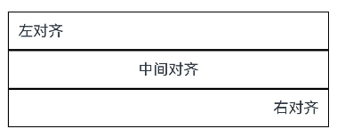

- 通过[textOverflow](../reference/apis-arkui/arkui-ts/ts-basic-components-text.md#textoverflow)属性控制文本超长处理，textOverflow需配合[maxLines](../reference/apis-arkui/arkui-ts/ts-basic-components-text.md#maxlines)一起使用（默认情况下文本自动折行）。从API version 18开始，文本超长时设置跑马灯的方式展示时，支持设置跑马灯的配置项，比如开关、步长、循环次数、方向等。

  ```ts
  Text('This is the setting of textOverflow to Clip text content This is the setting of textOverflow to None text content. This is the setting of textOverflow to Clip text content This is the setting of textOverflow to None text content.')
    .width(250)
    .textOverflow({ overflow: TextOverflow.None })
    .maxLines(1)
    .fontSize(12)
    .border({ width: 1 })
    .padding(10)
  Text('我是超长文本，超出的部分显示省略号。I am an extra long text, with ellipses displayed for any excess.')
    .width(250)
    .textOverflow({ overflow: TextOverflow.Ellipsis })
    .maxLines(1)
    .fontSize(12)
    .border({ width: 1 })
    .padding(10)
  Text('当文本溢出其尺寸时，文本将滚动显示。When the text overflows its dimensions, the text will scroll for displaying.')
    .width(250)
    .textOverflow({ overflow: TextOverflow.MARQUEE })
    .maxLines(1)
    .fontSize(12)
    .border({ width: 1 })
    .padding(10)
  Text('当文本溢出其尺寸时，文本将滚动显示，支持设置跑马灯配置项。When the text overflows its dimensions, the text will scroll for displaying.')
    .width(250)
    .textOverflow({ overflow: TextOverflow.MARQUEE })
    .maxLines(1)
    .fontSize(12)
    .border({ width: 1 })
    .padding(10)
    .marqueeOptions({
      start: true,
      fromStart: true,
      step: 6,
      loop: -1,
      delay: 0,
      fadeout: false,
      marqueeStartPolicy: MarqueeStartPolicy.DEFAULT
    })                      
  ```

  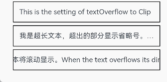

- 通过[lineHeight](../reference/apis-arkui/arkui-ts/ts-basic-components-text.md#lineheight)属性设置文本行高。

  ```ts
  Text('This is the text with the line height set. This is the text with the line height set.')
    .width(300).fontSize(12).border({ width: 1 }).padding(10)
  Text('This is the text with the line height set. This is the text with the line height set.')
    .width(300).fontSize(12).border({ width: 1 }).padding(10)
    .lineHeight(20)
  ```

  

- 通过[decoration](../reference/apis-arkui/arkui-ts/ts-basic-components-text.md#decoration)属性设置文本装饰线样式、颜色及其粗细。

  ```ts
  Text('This is the text')
    .decoration({
      type: TextDecorationType.LineThrough,
      color: Color.Red
    })
    .borderWidth(1).padding(15).margin(5)
  Text('This is the text')
    .decoration({
      type: TextDecorationType.Overline,
      color: Color.Red
    })
    .borderWidth(1).padding(15).margin(5)
  Text('This is the text')
    .decoration({
      type: TextDecorationType.Underline,
      color: Color.Red
    })
    .borderWidth(1).padding(15).margin(5)
  Text('This is the text')
    .decoration({
      type: TextDecorationType.Underline,
      color: Color.Blue,
      style: TextDecorationStyle.DASHED
    })
    .borderWidth(1).padding(15).margin(5)
  Text('This is the text')
    .decoration({
      type: TextDecorationType.Underline,
      color: Color.Blue,
      style: TextDecorationStyle.DOTTED
    })
    .borderWidth(1).padding(15).margin(5)
  Text('This is the text')
    .decoration({
      type: TextDecorationType.Underline,
      color: Color.Blue,
      style: TextDecorationStyle.DOUBLE
    })
    .borderWidth(1).padding(15).margin(5)
  Text('This is the text')
    .decoration({
      type: TextDecorationType.Underline,
      color: Color.Blue,
      style: TextDecorationStyle.WAVY,
      thicknessScale: 4
    })
    .borderWidth(1).padding(15).margin(5)
  ```

  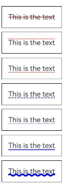

- 通过[baselineOffset](../reference/apis-arkui/arkui-ts/ts-basic-components-text.md#baselineoffset)属性设置文本基线的偏移量。

  ```ts
  Text('This is the text content with baselineOffset 0.')
    .baselineOffset(0)
    .fontSize(12)
    .border({ width: 1 })
    .padding(10)
    .width('100%')
    .margin(5)
  Text('This is the text content with baselineOffset 30.')
    .baselineOffset(30)
    .fontSize(12)
    .border({ width: 1 })
    .padding(10)
    .width('100%')
    .margin(5)
  Text('This is the text content with baselineOffset -20.')
    .baselineOffset(-20)
    .fontSize(12)
    .border({ width: 1 })
    .padding(10)
    .width('100%')
    .margin(5)
  ```

  

- 通过[letterSpacing](../reference/apis-arkui/arkui-ts/ts-basic-components-text.md#letterspacing)属性设置文本字符间距。

  ```ts
  Text('This is the text content with letterSpacing 0.')
    .letterSpacing(0)
    .fontSize(12)
    .border({ width: 1 })
    .padding(10)
    .width('100%')
    .margin(5)
  Text('This is the text content with letterSpacing 3.')
    .letterSpacing(3)
    .fontSize(12)
    .border({ width: 1 })
    .padding(10)
    .width('100%')
    .margin(5)
  Text('This is the text content with letterSpacing -1.')
    .letterSpacing(-1)
    .fontSize(12)
    .border({ width: 1 })
    .padding(10)
    .width('100%')
    .margin(5)
  ```

  

- 通过[minFontSize](../reference/apis-arkui/arkui-ts/ts-basic-components-text.md#minfontsize)与[maxFontSize](../reference/apis-arkui/arkui-ts/ts-basic-components-text.md#maxfontsize)自适应字体大小。

  minFontSize用于设置文本的最小显示字号，maxFontSize用于设置文本的最大显示字号。这两个属性必须同时设置才能生效，并且需要与[maxLines](../reference/apis-arkui/arkui-ts/ts-basic-components-text.md#maxlines)属性或布局大小限制配合使用，单独设置任一属性将不会产生效果。

  ```ts
  Text('我的最大字号为30，最小字号为5，宽度为250，maxLines为1')
    .width(250)
    .maxLines(1)
    .maxFontSize(30)
    .minFontSize(5)
    .border({ width: 1 })
    .padding(10)
    .margin(5)
  Text('我的最大字号为30，最小字号为5，宽度为250，maxLines为2')
    .width(250)
    .maxLines(2)
    .maxFontSize(30)
    .minFontSize(5)
    .border({ width: 1 })
    .padding(10)
    .margin(5)
  Text('我的最大字号为30，最小字号为15，宽度为250,高度为50')
    .width(250)
    .height(50)
    .maxFontSize(30)
    .minFontSize(15)
    .border({ width: 1 })
    .padding(10)
    .margin(5)
  Text('我的最大字号为30，最小字号为15，宽度为250,高度为100')
    .width(250)
    .height(100)
    .maxFontSize(30)
    .minFontSize(15)
    .border({ width: 1 })
    .padding(10)
    .margin(5)
  ```

  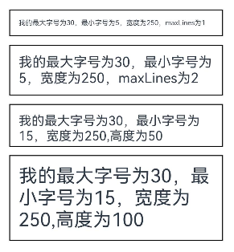

- 通过[textCase](../reference/apis-arkui/arkui-ts/ts-basic-components-text.md#textcase)属性设置文本大小写。

  ```ts
  Text('This is the text content with textCase set to Normal.')
    .textCase(TextCase.Normal)
    .padding(10)
    .border({ width: 1 })
    .padding(10)
    .margin(5)
  // 文本全小写展示
  Text('This is the text content with textCase set to LowerCase.')
    .textCase(TextCase.LowerCase)
    .border({ width: 1 })
    .padding(10)
    .margin(5)
  // 文本全大写展示
  Text('This is the text content with textCase set to UpperCase.')
    .textCase(TextCase.UpperCase)
    .border({ width: 1 })
    .padding(10)
    .margin(5)
  ```

  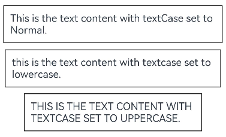

- 通过[copyOption](../reference/apis-arkui/arkui-ts/ts-basic-components-text.md#copyoption9)属性设置文本是否可复制粘贴。

  ```ts
  Text("这是一段可复制文本")
    .fontSize(30)
    .copyOption(CopyOptions.InApp)
  ```

  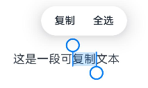

- 通过[fontFamily](../reference/apis-arkui/arkui-ts/ts-basic-components-text.md#fontfamily)属性设置字体列表。应用当前支持'HarmonyOS Sans'字体和[注册自定义字体](../reference/apis-arkui/js-apis-font.md)。

  ```ts
  Text("This is the text content with fontFamily")
    .fontSize(30)
    .fontFamily('HarmonyOS Sans')
  ```

  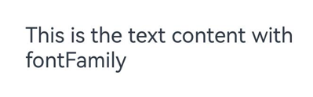

- 从API version 20开始，支持通过[contentTransition](../reference/apis-arkui/arkui-ts/ts-basic-components-text.md#contenttransition20)属性设置数字翻牌效果。

  ```ts
  @State number: number = 98;
  @State numberTransition: NumericTextTransition = { flipDirection: FlipDirection.DOWN, enableBlur: false };

  Column() {
    Text(this.number + "")
      .borderWidth(1)
      .fontSize(40)
      .contentTransition(this.numberTransition)
    Button("chang number")
      .onClick(() => {
        this.number++
      })
      .margin(10)
  }
  ```
  

- 从API version 20开始，支持通过[optimizeTrailingSpace](../reference/apis-arkui/arkui-ts/ts-basic-components-text.md#optimizetrailingspace20)设置是否在文本布局过程中优化每行末尾的空格，可解决行尾空格影响对齐显示效果问题。

  ```ts
  Column() {
    //启用优化行尾空格功能
    Text("Trimmed space enabled     ")
      .fontSize(30)
      .fontWeight(FontWeight.Bold)
      .margin({ top: 20 })
      .optimizeTrailingSpace(true)
      .textAlign(TextAlign.Center)
    //不启用优化行尾空格功能
    Text("Trimmed space disabled     ")
      .fontSize(30)
      .fontWeight(FontWeight.Bold)
      .margin({ top: 20 })
      .optimizeTrailingSpace(false)
      .textAlign(TextAlign.Center)
  }
  ```
  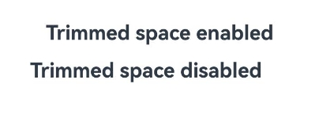

- 从API version 20开始，支持通过[lineSpacing](../reference/apis-arkui/arkui-ts/ts-basic-components-text.md#linespacing20)设置文本的行间距。当不配置[LineSpacingOptions](../reference/apis-arkui/arkui-ts/ts-text-common.md#linespacingoptions20对象说明)时，首行上方和尾行下方默认会有行间距，当onlyBetweenLines设置为true时，行间距仅适用于行与行之间，首行上方无额外的行间距。

  ```ts
  function style() {
  .width(250)
  .height(100)
  .maxFontSize(30)
  .minFontSize(15)
  .border({ width: 1 })
  }

  Text('The line spacing of this context is set to 20_px, and the spacing is effective only between the lines.')
   .lineSpacing(LengthMetrics.px(20), { onlyBetweenLines: true })
   .style()
  ```
  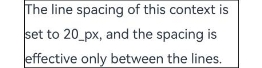

- 从API version 20开始，支持通过[enableAutoSpacing](../reference/apis-arkui/arkui-ts/ts-basic-components-text.md#enableautospacing20)设置是否开启中文与西文的自动间距。

  ```ts
  @Entry
  @Component
  struct TextExample {
    @State enableSpacing: boolean = false;
  
    build() {
      Column() {
        Row({ space: 20 }) {
          Button("开启自动间距")
            .onClick(() => this.enableSpacing = true)
            .backgroundColor(this.enableSpacing ? '#4CAF50' : '#E0E0E0')
            .fontColor(this.enableSpacing ? Color.White : Color.Black)
  
          Button("关闭自动间距")
            .onClick(() => this.enableSpacing = false)
            .backgroundColor(!this.enableSpacing ? '#F44336' : '#E0E0E0')
            .fontColor(!this.enableSpacing ? Color.White : Color.Black)
        }
        .width('100%')
        .justifyContent(FlexAlign.Center)
        .margin({ top: 30, bottom: 20 })
  
        Text(this.enableSpacing ? "当前状态：已开启自动间距" : "当前状态：已关闭自动间距")
          .fontSize(16)
          .fontColor(this.enableSpacing ? '#4CAF50' : '#F44336')
          .margin({ bottom: 20 })
  
        // 设置是否应用中西文自动间距
        Text('中西文Auto Spacing自动间距')
          .fontSize(24)
          .padding(15)
          .backgroundColor('#F5F5F5')
          .width('90%')
          .enableAutoSpacing(this.enableSpacing)
      }
      .width('100%')
      .height('100%')
      .padding(20)
    }
  }
  ```
  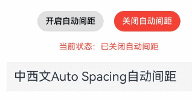

- 从API version 20开始，支持通过[ShaderStyle](../reference/apis-arkui/arkui-ts/ts-basic-components-text.md#shaderstyle20)设置渐变色。

  ```ts
  @State message: string = 'Hello World';
  @State linearGradientOptions: LinearGradientOptions =
    {
      direction: GradientDirection.LeftTop,
      colors: [[Color.Red, 0.0], [Color.Blue, 0.3], [Color.Green, 0.5]],
      repeating: true,
    };

  Column({ space: 5 }) {
    Text('direction为LeftTop的线性渐变').fontSize(18).width('90%').fontColor(0xCCCCCC)
      .margin({ top: 40, left: 40 })
    Text(this.message)
      .fontSize(50)
      .width('80%')
      .height(50)
      .shaderStyle(this.linearGradientOptions)
  }
  ```
  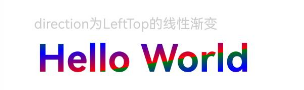

## 添加事件

Text组件可以添加通用事件，可以绑定[onClick](../reference/apis-arkui/arkui-ts/ts-universal-events-click.md#onclick)、[onTouch](../reference/apis-arkui/arkui-ts/ts-universal-events-touch.md#ontouch)等事件来响应操作。

```ts
// xxx.ets
@Entry
@Component
struct Index {
  @State textStr1: string = '';
  @State textStr2: string = '';

  build() {
    Row() {
      Column() {
        Text('This is a text component.')
          .fontSize(30)
          .onClick(() => {
            console.info('Text onClick is triggering');
            this.textStr1 = 'Text onClick is triggering';
          })
          .onTouch(() => {
            console.info('Text onTouch is triggering');
            this.textStr2 = 'Text onTouch is triggering';
          })
        Text('onClick：' + this.textStr1)
          .fontSize(20)
        Text('onTouch：' + this.textStr2)
          .fontSize(20)
      }.width('100%')
    }
    .height('100%')
  }
}
```

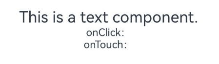

## 设置垂直居中

从API version 20开始，Text组件支持通过[textVerticalAlign](../reference/apis-arkui/arkui-ts/ts-basic-components-text.md#textverticalalign20)属性实现文本段落在垂直方向的对齐。

  - 以下示例展示了如何通过textVerticalAlign属性设置文本垂直居中对齐效果。

    ```ts
    Text() {
      Span("Hello")
        .fontSize(50)
      ImageSpan($r('app.media.startIcon'))
        .width(30).height(30)
        .verticalAlign(ImageSpanAlignment.FOLLOW_PARAGRAPH)
      Span("World")
    }
    .textVerticalAlign(TextVerticalAlign.CENTER)
    ```

    

## 设置选中菜单

### 弹出选中菜单

  - 设置Text被选中时，会弹出包含复制、翻译、搜索的菜单。

    Text组件需要设置[copyOption](../reference/apis-arkui/arkui-ts/ts-basic-components-text.md#copyoption9)属性才可以被选中。

    ```ts
    Text("这是一段文本，用来展示选中菜单")
      .fontSize(30)
      .copyOption(CopyOptions.InApp)
    ```
    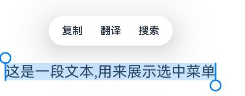

  - Text组件通过设置[bindSelectionMenu](../reference/apis-arkui/arkui-ts/ts-basic-components-text.md#bindselectionmenu11)属性绑定自定义选择菜单。

    ```ts
    Text("这是一段文本，用来展示选中菜单", this.options)
      .fontSize(30)
      .copyOption(CopyOptions.InApp)
      .bindSelectionMenu(TextSpanType.TEXT, this.RightClickTextCustomMenu, TextResponseType.RIGHT_CLICK, {
        onAppear: () => {
          console.info('自定义选择菜单弹出时触发该回调');
        },
        onDisappear: () => {
          console.info('自定义选择菜单关闭时触发该回调');
        }
      })
    ```

    ```ts
    // 定义菜单项
    @Builder
    RightClickTextCustomMenu() {
      Column() {
        Menu() {
          MenuItemGroup() {
            MenuItem({ startIcon: $r('app.media.app_icon'), content: "CustomMenu One", labelInfo: "" })
              .onClick(() => {
                // 使用closeSelectionMenu接口关闭菜单
                this.controller.closeSelectionMenu();
              })
            MenuItem({ startIcon: $r('app.media.app_icon'), content: "CustomMenu Two", labelInfo: "" })
            MenuItem({ startIcon: $r('app.media.app_icon'), content: "CustomMenu Three", labelInfo: "" })
          }
        }.backgroundColor('#F0F0F0')
      }
    }
    ```
    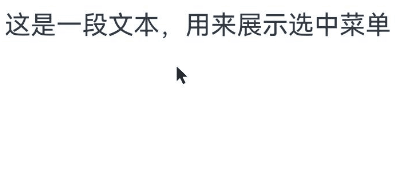

  - Text组件通过设置[editMenuOptions](../reference/apis-arkui/arkui-ts/ts-basic-components-text.md#editmenuoptions12)属性扩展自定义选择菜单，可以设置扩展项的文本内容、图标以及回调方法。

    ```ts
    Text('这是一段文本，用来展示选中菜单')
      .fontSize(20)
      .copyOption(CopyOptions.LocalDevice)
      .editMenuOptions({
        onCreateMenu: this.onCreateMenu, onMenuItemClick: this.onMenuItemClick
      })
    ```

    ```ts
    // 定义onCreateMenu，onMenuItemClick
    onCreateMenu = (menuItems: Array<TextMenuItem>) => {
      let item1: TextMenuItem = {
        content: 'customMenu1',
        icon: $r('app.media.app_icon'),
        id: TextMenuItemId.of('customMenu1'),
      };
      let item2: TextMenuItem = {
        content: 'customMenu2',
        id: TextMenuItemId.of('customMenu2'),
        icon: $r('app.media.app_icon'),
      };
      menuItems.push(item1);
      menuItems.unshift(item2);
      return menuItems;
    }
    
    onMenuItemClick = (menuItem: TextMenuItem, textRange: TextRange) => {
      if (menuItem.id.equals(TextMenuItemId.of("customMenu2"))) {
        console.log("拦截 id: customMenu2 start:" + textRange.start + "; end:" + textRange.end);
        return true;
      }
      if (menuItem.id.equals(TextMenuItemId.COPY)) {
        console.log("拦截 COPY start:" + textRange.start + "; end:" + textRange.end);
        return true;
      }
      if (menuItem.id.equals(TextMenuItemId.SELECT_ALL)) {
        console.log("不拦截 SELECT_ALL start:" + textRange.start + "; end:" + textRange.end);
        return false;
      }
      return false;
    };
    ```
    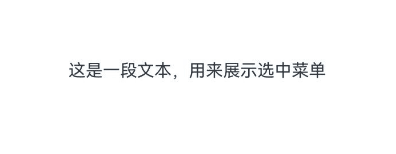

### 关闭选中菜单

  使用Text组件时，若需要实现点击空白处关闭选中的场景，分为以下两种情况：

  - 在Text组件区域内点击空白处，会正常关闭选中态和菜单；
  - 在Text组件区域外点击空白处，前提是Text组件设置[selection](../reference/apis-arkui/arkui-ts/ts-basic-components-text.md#selection11)属性，具体示例如下：

    ```ts
    // xxx.ets
    @Entry
    @Component
    struct Index {
      @State text: string =
        'This is set selection to Selection text content This is set selection to Selection text content.';
      @State start: number = 0;
      @State end: number = 20;

      build() {
        Flex({ direction: FlexDirection.Column, alignItems: ItemAlign.Start, justifyContent: FlexAlign.Start }) {
          Text(this.text)
            .fontSize(12)
            .border({ width: 1 })
            .lineHeight(20)
            .margin(30)
            .copyOption(CopyOptions.InApp)
            .selection(this.start, this.end)
            .onTextSelectionChange((selectionStart, selectionEnd) => {
              // 更新选中态位置
              this.start = selectionStart;
              this.end = selectionEnd;
            })
        }
        .height(600)
        .width(335)
        .borderWidth(1)
        .onClick(() => {
          // 监听父组件的点击事件，将选中首尾位置均设置为-1，即可清除选中
          this.start = -1;
          this.end = -1;
        })
      }
    }
    ```
 
### 屏蔽系统服务类菜单

- 从API version 20开始，支持通过[disableSystemServiceMenuItems](../reference/apis-arkui/js-apis-arkui-UIContext.md#disablesystemservicemenuitems20)屏蔽文本选择菜单内所有系统服务菜单项。

  ```ts
  import { TextMenuController } from '@kit.ArkUI';
  // xxx.ets
  @Entry
  @Component
  struct Index {
    aboutToAppear(): void {
      // 禁用所有系统服务菜单
      TextMenuController.disableSystemServiceMenuItems(true);
    }

    aboutToDisappear(): void {
      // 页面消失恢复系统服务菜单
      TextMenuController.disableSystemServiceMenuItems(false);
    }

    build() {
      Row() {
        Column() {
          Text("这是一段文本，长按弹出文本选择菜单")
            .height(60)
            .fontStyle(FontStyle.Italic)
            .fontWeight(FontWeight.Bold)
            .textAlign(TextAlign.Center)
            .copyOption(CopyOptions.InApp)
            .editMenuOptions({
              onCreateMenu: (menuItems: Array<TextMenuItem>) => {
                  // menuItems不包含被屏蔽的系统菜单项
                  return menuItems;
              },
              onMenuItemClick: (menuItem: TextMenuItem, textRange: TextRange) => {
                  return false;
              }
            })
        }.width('100%')
      }
      .height('100%')
    }
  }
  ```

  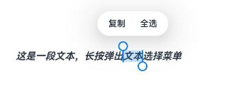

- 从API version 20开始，支持通过[disableMenuItems](../reference/apis-arkui/js-apis-arkui-UIContext.md#disablemenuitems20)屏蔽文本选择菜单内指定的系统服务菜单项。

  ```ts
  import { TextMenuController } from '@kit.ArkUI';
  // xxx.ets
  @Entry
  @Component
  struct Index {
    aboutToAppear(): void {
      // 禁用搜索菜单
      TextMenuController.disableMenuItems([TextMenuItemId.SEARCH])
    }

    aboutToDisappear(): void {
      // 恢复系统服务菜单
      TextMenuController.disableMenuItems([])
    }

    build() {
      Row() {
        Column() {
          Text("这是一段文本，长按弹出文本选择菜单")
            .height(60)
            .fontStyle(FontStyle.Italic)
            .fontWeight(FontWeight.Bold)
            .textAlign(TextAlign.Center)
            .copyOption(CopyOptions.InApp)
            .editMenuOptions({
              onCreateMenu: (menuItems: Array<TextMenuItem>) => {
                  // menuItems不包含搜索
                  return menuItems;
              },
              onMenuItemClick: (menuItem: TextMenuItem, textRange: TextRange) => {
                  return false
              }
            })
        }.width('100%')
      }
      .height('100%')
    }
  }
  ```

  

### 默认菜单支持自定义刷新能力

从API version 20开始，当文本选择区域变化后显示菜单之前触发[onPrepareMenu](../reference/apis-arkui/arkui-ts/ts-text-common.md#onpreparemenu20)回调，可在该回调中进行菜单数据设置。

```ts
// xxx.ets
@Entry
@Component
struct TextExample12 {
  @State text: string = 'Text editMenuOptions';
  @State endIndex: number = 0;
  onCreateMenu = (menuItems: Array<TextMenuItem>) => {
    let item1: TextMenuItem = {
      content: 'create1',
      icon: $r('app.media.startIcon'),
      id: TextMenuItemId.of('create1'),
    };
    let item2: TextMenuItem = {
      content: 'create2',
      id: TextMenuItemId.of('create2'),
      icon: $r('app.media.startIcon'),
    };
    menuItems.push(item1);
    menuItems.unshift(item2);
    return menuItems;
  }
  onMenuItemClick = (menuItem: TextMenuItem, textRange: TextRange) => {
    if (menuItem.id.equals(TextMenuItemId.of("create2"))) {
      console.log("拦截 id: create2 start:" + textRange.start + "; end:" + textRange.end);
      return true;
    }
    if (menuItem.id.equals(TextMenuItemId.of("prepare1"))) {
      console.log("拦截 id: prepare1 start:" + textRange.start + "; end:" + textRange.end);
      return true;
    }
    if (menuItem.id.equals(TextMenuItemId.COPY)) {
      console.log("拦截 COPY start:" + textRange.start + "; end:" + textRange.end);
      return true;
    }
    if (menuItem.id.equals(TextMenuItemId.SELECT_ALL)) {
      console.log("不拦截 SELECT_ALL start:" + textRange.start + "; end:" + textRange.end);
      return false;
    }
    return false;
  }
  onPrepareMenu = (menuItems: Array<TextMenuItem>) => {
    let item1: TextMenuItem = {
      content: 'prepare1_' + this.endIndex,
      icon: $r('app.media.startIcon'),
      id: TextMenuItemId.of('prepare1'),
    };
    menuItems.unshift(item1);
    return menuItems;
  }
  @State editMenuOptions: EditMenuOptions = {
    onCreateMenu: this.onCreateMenu,
    onMenuItemClick: this.onMenuItemClick,
    onPrepareMenu: this.onPrepareMenu
  };

  build() {
    Column() {
      Text(this.text)
        .fontSize(20)
        .copyOption(CopyOptions.LocalDevice)
        .editMenuOptions(this.editMenuOptions)
        .margin({ top: 100 })
        .onTextSelectionChange((selectionStart: number, selectionEnd: number) => {
          this.endIndex = selectionEnd;
        })
    }
    .width("90%")
    .margin("5%")
  }
}
```


## 设置AI菜单

Text组件通过[enableDataDetector](../reference/apis-arkui/arkui-ts/ts-basic-components-text.md#enabledatadetector11)和[dataDetectorConfig](../reference/apis-arkui/arkui-ts/ts-basic-components-text.md#datadetectorconfig11)属性实现AI菜单的显示。AI菜单的表现形式包括：单击AI实体（指可被识别的内容，包括地址、邮箱等）弹出菜单的实体识别选项，选中文本后，文本选择菜单与鼠标右键菜单中显示的实体识别选项。

>  **说明：**
>
>  从API version 20开始，支持在文本选择菜单与鼠标右键菜单中显示实体识别选项。当[enableDataDetector](../reference/apis-arkui/arkui-ts/ts-basic-components-text.md#enabledatadetector11)设置为true，且[copyOption](../reference/apis-arkui/arkui-ts/ts-basic-components-text.md#copyoption9)设置为CopyOptions.LocalDevice时，该功能生效。菜单选项包括[TextMenuItemId](../reference/apis-arkui/arkui-ts/ts-text-common.md#textmenuitemid12)中的url(打开链接)、email(新建邮件)、phoneNumber(呼叫)、address(导航至该位置)、dateTime(新建日程提醒)。
>
>  该功能生效时，需选中范围内，包括一个完整的AI实体，才能展示对应的选项。

- 如果需要单击AI实体弹出菜单的实体识别选项，可以配置[enableDataDetector](../reference/apis-arkui/arkui-ts/ts-basic-components-text.md#enabledatadetector11)为true。
- 如果在单击的交互方式之外，还需要文本选择菜单与鼠标右键菜单中显示的实体识别选项，可以配置[enableDataDetector](../reference/apis-arkui/arkui-ts/ts-basic-components-text.md#enabledatadetector11)为true，且[copyOption](../reference/apis-arkui/arkui-ts/ts-basic-components-text.md#copyoption9)设置为CopyOptions.LocalDevice，具体示例如下所示：
  ```ts
  Text(
    '电话号码：' + '(86) (755) ********' + '\n' +
      '链接：' + 'www.********.com' + '\n' +
      '邮箱：' + '***@example.com' + '\n' +
      '地址：' + 'XX省XX市XX区XXXX' + '\n' +
      '时间：' + 'XX年XX月XX日XXXX'
  )
    .fontSize(16)
    .copyOption(CopyOptions.LocalDevice)
    .enableDataDetector(true)// 使能实体识别
    .dataDetectorConfig({
      // 配置识别样式
      // types可支持PHONE_NUMBER电话号码、URL链接、EMAIL邮箱、ADDRESS地址、DATE_TIME时间
      // types设置为null或者[]时，识别所有类型的实体
      types: [], onDetectResultUpdate: (result: string) => {
      }
    })
  ```
- 如果需要调整识别出的样式，可以通过[dataDetectorConfig](../reference/apis-arkui/arkui-ts/ts-basic-components-text.md#datadetectorconfig11)实现，具体可以参考[TextDataDetectorConfig](../reference/apis-arkui/arkui-ts/ts-text-common.md#textdatadetectorconfig11对象说明)配置项。
- 如果需要调整菜单的位置，可以通过[editMenuOptions](../reference/apis-arkui/arkui-ts/ts-basic-components-text.md#editmenuoptions12)实现，具体可以参考示例[文本扩展自定义菜单](../reference/apis-arkui/arkui-ts/ts-basic-components-text.md#示例12文本扩展自定义菜单)。 
<!--RP2--><!--RP2End-->

## 场景示例

该示例通过maxLines、textOverflow、textAlign、constraintSize属性展示了热搜榜的效果。

```ts
// xxx.ets
@Entry
@Component
struct TextExample {
  build() {
    Column() {
      Row() {
        Text("1").fontSize(14).fontColor(Color.Red).margin({ left: 10, right: 10 })
        Text("我是热搜词条1")
          .fontSize(12)
          .fontColor(Color.Blue)
          .maxLines(1)
          .textOverflow({ overflow: TextOverflow.Ellipsis })
          .fontWeight(300)
        Text("爆")
          .margin({ left: 6 })
          .textAlign(TextAlign.Center)
          .fontSize(10)
          .fontColor(Color.White)
          .fontWeight(600)
          .backgroundColor(0x770100)
          .borderRadius(5)
          .width(15)
          .height(14)
      }.width('100%').margin(5)

      Row() {
        Text("2").fontSize(14).fontColor(Color.Red).margin({ left: 10, right: 10 })
        Text("我是热搜词条2 我是热搜词条2 我是热搜词条2 我是热搜词条2 我是热搜词条2")
          .fontSize(12)
          .fontColor(Color.Blue)
          .fontWeight(300)
          .constraintSize({ maxWidth: 200 })
          .maxLines(1)
          .textOverflow({ overflow: TextOverflow.Ellipsis })
        Text("热")
          .margin({ left: 6 })
          .textAlign(TextAlign.Center)
          .fontSize(10)
          .fontColor(Color.White)
          .fontWeight(600)
          .backgroundColor(0xCC5500)
          .borderRadius(5)
          .width(15)
          .height(14)
      }.width('100%').margin(5)

      Row() {
        Text("3").fontSize(14).fontColor(Color.Orange).margin({ left: 10, right: 10 })
        Text("我是热搜词条3")
          .fontSize(12)
          .fontColor(Color.Blue)
          .fontWeight(300)
          .maxLines(1)
          .constraintSize({ maxWidth: 200 })
          .textOverflow({ overflow: TextOverflow.Ellipsis })
        Text("热")
          .margin({ left: 6 })
          .textAlign(TextAlign.Center)
          .fontSize(10)
          .fontColor(Color.White)
          .fontWeight(600)
          .backgroundColor(0xCC5500)
          .borderRadius(5)
          .width(15)
          .height(14)
      }.width('100%').margin(5)

      Row() {
        Text("4").fontSize(14).fontColor(Color.Grey).margin({ left: 10, right: 10 })
        Text("我是热搜词条4 我是热搜词条4 我是热搜词条4 我是热搜词条4 我是热搜词条4")
          .fontSize(12)
          .fontColor(Color.Blue)
          .fontWeight(300)
          .constraintSize({ maxWidth: 200 })
          .maxLines(1)
          .textOverflow({ overflow: TextOverflow.Ellipsis })
      }.width('100%').margin(5)
    }.width('100%')
  }
}

```

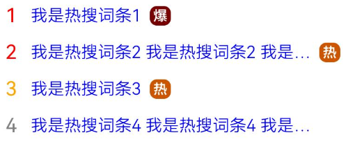
<!--RP1--><!--RP1End-->
