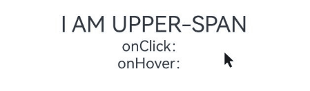
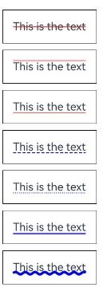
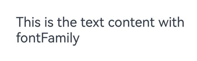
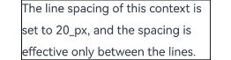
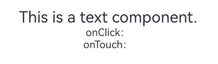
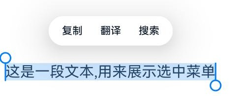
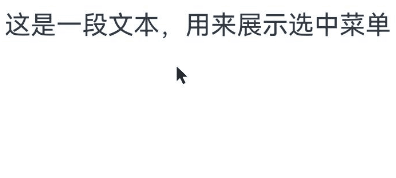
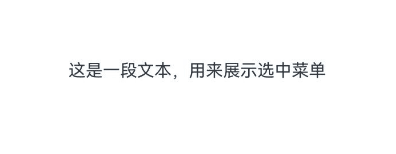

# 文本显示 (Text/Span)
<!--Kit: ArkUI-->
<!--Subsystem: ArkUI-->
<!--Owner: @xiangyuan6-->
<!--Designer: @xiangyuan6-->
<!--Tester: @jiaoaozihao-->
<!--Adviser: @Brilliantry_Rui-->


Text是文本组件，用于展示用户视图，如显示文章的文字内容。该组件支持绑定自定义文本选择菜单，用户可根据需要选择不同功能。此外，还可以扩展自定义菜单，丰富可用选项，进一步提升用户体验。Span则用于展示行内文本。  

具体用法请参考[Text](../reference/apis-arkui/arkui-ts/ts-basic-components-text.md)和[Span](../reference/apis-arkui/arkui-ts/ts-basic-components-span.md)组件的API文档。

常见问题请参考[文本显示（Text/Span）常见问题](./arkts-text-faq.md#文本显示textspan常见问题)。

## 创建文本

Text可通过以下两种方式来创建：


- string字符串。

  <!-- @[create_a_text_in_one_way](https://gitcode.com/openharmony/applications_app_samples/blob/master/code/DocsSample/ArkUISample/TextComponent/entry/src/main/ets/pages/text/CreateText.ets) -->
  
  ``` TypeScript
  Text('我是一段文本')
  ```


- 引用Resource资源。

  资源引用类型可以通过$r创建Resource类型对象，文件位置为/resources/base/element/string.json，具体内容如下：

  ```json
  {
    "string": [
      {
        "name": "module_desc",
        "value": "模块描述"
      }
    ]
  }
  ```

  <!-- @[create_a_text_in_another_way](https://gitcode.com/openharmony/applications_app_samples/blob/master/code/DocsSample/ArkUISample/TextComponent/entry/src/main/ets/pages/text/CreateText.ets) -->
  
  ``` TypeScript
  // 请将$r('app.string.module_desc')替换为实际资源文件，在本示例中该资源文件的value值为"模块描述"
  Text($r('app.string.module_desc'))
    .baselineOffset(0)
    .fontSize(30)
    .border({ width: 1 })
    .padding(10)
    .width(300)
  ```

  


## 添加子组件

[Span](../reference/apis-arkui/arkui-ts/ts-basic-components-span.md)只能作为[Text](../reference/apis-arkui/arkui-ts/ts-basic-components-text.md)和[RichEditor](../reference/apis-arkui/arkui-ts/ts-basic-components-richeditor.md)组件的子组件显示文本内容。可以在一个Text内添加多个Span来显示一段信息，例如产品说明书、承诺书等。

- 创建Span。

  Span组件需嵌入在Text组件中才能显示，单独使用时不会显示任何内容。Text与Span同时配置文本内容时，Span内容将覆盖Text内容。


  <!-- @[create_span](https://gitcode.com/openharmony/applications_app_samples/blob/master/code/DocsSample/ArkUISample/TextComponent/entry/src/main/ets/pages/text/TextSpan.ets) -->
  
  ``` TypeScript
  // 请将$r('app.string.TextSpan_textContent_text')替换为实际资源文件，在本示例中该资源文件的value值为"我是Text"
  Text($r('app.string.TextSpan_textContent_text')) {
    // 请将$r('app.string.TextSpan_textContent_span')替换为实际资源文件，在本示例中该资源文件的value值为"我是Span"
    Span($r('app.string.TextSpan_textContent_span'))
  }
  .padding(10)
  .borderWidth(1)
  ```

  

- 设置文本装饰线及颜色。

  通过[decoration](../reference/apis-arkui/arkui-ts/ts-basic-components-span.md#decoration)设置文本装饰线及颜色。


  <!-- @[create_span_with_lines](https://gitcode.com/openharmony/applications_app_samples/blob/master/code/DocsSample/ArkUISample/TextComponent/entry/src/main/ets/pages/text/TextSpan.ets) -->
  
  ``` TypeScript
  Text() {
    // 请将$r('app.string.TextSpan_textContent_span_one')替换为实际资源文件，在本示例中该资源文件的value值为"我是Span1，"
    Span($r('app.string.TextSpan_textContent_span_one'))
      .fontSize(16)
      .fontColor(Color.Grey)
      .decoration({ type: TextDecorationType.LineThrough, color: Color.Red })
    // 请将$r('app.string.TextSpan_textContent_span_two')替换为实际资源文件，在本示例中该资源文件的value值为"我是Span2"
    Span($r('app.string.TextSpan_textContent_span_two'))
      .fontColor(Color.Blue)
      .fontSize(16)
      .fontStyle(FontStyle.Italic)
      .decoration({ type: TextDecorationType.Underline, color: Color.Black })
    // 请将$r('app.string.TextSpan_textContent_span_three')替换为实际资源文件，在本示例中该资源文件的value值为"，我是Span3"
    Span($r('app.string.TextSpan_textContent_span_three'))
      .fontSize(16)
      .fontColor(Color.Grey)
      .decoration({ type: TextDecorationType.Overline, color: Color.Green })
  }
  .borderWidth(1)
  .padding(10)
  ```

  

- 通过[textCase](../reference/apis-arkui/arkui-ts/ts-basic-components-span.md#textcase)设置文字一直保持大写或者小写状态。

  <!-- @[create_span_with_upper_case](https://gitcode.com/openharmony/applications_app_samples/blob/master/code/DocsSample/ArkUISample/TextComponent/entry/src/main/ets/pages/text/TextSpan.ets) -->
  
  ``` TypeScript
  Text() {
    Span('I am Upper-span').fontSize(12)
      .textCase(TextCase.UpperCase)
  }
  .borderWidth(1)
  .padding(10)
  ```

  

- 添加事件。

  由于Span组件无尺寸信息，仅支持添加点击事件[onClick](../reference/apis-arkui/arkui-ts/ts-universal-events-click.md#onclick)、悬浮事件[onHover](../reference/apis-arkui/arkui-ts/ts-universal-events-hover.md#onhover)。


  <!-- @[textspan_onhover](https://gitcode.com/openharmony/applications_app_samples/blob/master/code/DocsSample/ArkUISample/TextComponent/entry/src/main/ets/pages/text/TextSpanOnHover.ets) -->
  
  ``` TypeScript
  // xxx.ets
  import { hilog } from '@kit.PerformanceAnalysisKit';
  
  @Entry
  @Component
  struct TextSpanOnHover {
    @State textStr1: string = '';
    @State textStr2: string = '';
  
    build() {
      NavDestination() {
        Row() {
          Column() {
            Text() {
              Span('I am Upper-span')
                .textCase(TextCase.UpperCase)
                .fontSize(30)
                .onClick(() => {
                  hilog.info(0x0000, 'Sample_TextComponent', 'Span onClick is triggering');
                  this.textStr1 = 'Span onClick is triggering';
                })
                .onHover(() => {
                  hilog.info(0x0000, 'Sample_TextComponent', 'Span onHover is triggering');
                  this.textStr2 = 'Span onHover is triggering';
                })
            }
  
            Text('onClick：' + this.textStr1)
              .fontSize(20)
            Text('onHover：' + this.textStr2)
              .fontSize(20)
          }.width('100%')
        }
        .height('100%')
      }
      // ···
    }
  }
  ```

  

## 创建自定义文本样式

Text组件支持创建自定义文本样式，以下为修改文本样式的主要属性。

| 属性名称 | 功能描述 |
|---------|----------|
| baselineOffset | 设置文本基线的偏移量。 |
| contentTransition | 设置数字翻牌效果。 |
| copyOption | 设置文本是否可复制粘贴。 |
| decoration | 设置文本装饰线样式，如类型、颜色及其粗细。 |
| enableAutoSpacing | 设置是否开启中文与西文的自动间距。 |
| enableDataDetector | 设置是否进行文本特殊实体识别。 |
| font | 设置文本字体相关属性。 |
| fontColor | 设置文本字体颜色。 |
| fontFamily | 设置文本字体族。 |
| fontFeature | 设置文字特性效果，比如数字等宽的特性。 |
| fontSize | 设置文本字体大小。 |
| fontStyle | 设置文本字体风格。 |
| fontWeight | 设置文本字体粗细。 |
| halfLeading | 设置文本是否将行间距平分至行的顶部与底部。 |
| heightAdaptivePolicy | 设置文本自适应布局调整字号的方式。 |
| letterSpacing | 设置文本字符间距。 |
| lineHeight | 设置文本行高。 |
| lineSpacing | 设置文本的行间距。 |
| marqueeOptions | 设置跑马灯配置项，如开关、步长、循环次数、方向等。 |
| maxFontSize | 设置自适应字体最大尺寸。 |
| maxLines | 设置文本最大显示行数。 |
| minFontSize | 设置自适应字体最小尺寸。 |
| optimizeTrailingSpace | 控制每行末尾空格的优化。 |
| privacySensitive | 设置是否支持卡片敏感隐私信息。 |
| shaderStyle | 设置文本渐变色样式。 |
| textCase | 设置文本大小写转换。 |
| textAlign | 设置文本段落在水平方向的对齐方式。 |
| textIndent | 设置首行文本缩进。 |
| textOverflow | 控制文本超长处理方式。 |
| textSelectable | 设置文本是否可选择。 |
| textVerticalAlign | 设置文本段落在垂直方向的对齐方式。 |
| wordBreak | 设置断行规则。 |

下面对常用的接口进行举例说明。

- 通过[textAlign](../reference/apis-arkui/arkui-ts/ts-basic-components-text.md#textalign)属性设置文本对齐样式。

  <!-- @[custom_text_align](https://gitcode.com/openharmony/applications_app_samples/blob/master/code/DocsSample/ArkUISample/TextComponent/entry/src/main/ets/pages/text/CustomTextStyle.ets) -->
  
  ``` TypeScript
  // 请将$r('app.string.TextAlign_Start')替换为实际资源文件，在本示例中该资源文件的value值为"左对齐"
  Text($r('app.string.TextAlign_Start'))
    .width(300)
    .textAlign(TextAlign.Start)
    .border({ width: 1 })
    .padding(10)
  // 请将$r('app.string.TextAlign_Center')替换为实际资源文件，在本示例中该资源文件的value值为"中间对齐"
  Text($r('app.string.TextAlign_Center'))
    .width(300)
    .textAlign(TextAlign.Center)
    .border({ width: 1 })
    .padding(10)
  // 请将$r('app.string.TextAlign_End')替换为实际资源文件，在本示例中该资源文件的value值为"右对齐"
  Text($r('app.string.TextAlign_End'))
    .width(300)
    .textAlign(TextAlign.End)
    .border({ width: 1 })
    .padding(10)
  ```

  

- 通过[textOverflow](../reference/apis-arkui/arkui-ts/ts-basic-components-text.md#textoverflow)属性控制文本超长处理，textOverflow需配合[maxLines](../reference/apis-arkui/arkui-ts/ts-basic-components-text.md#maxlines)一起使用（默认情况下文本自动折行）。从API version 18开始，文本超长时设置跑马灯的方式展示时，支持设置跑马灯的配置项，比如开关、步长、循环次数、方向等。

  <!-- @[custom_text_overflow](https://gitcode.com/openharmony/applications_app_samples/blob/master/code/DocsSample/ArkUISample/TextComponent/entry/src/main/ets/pages/text/CustomTextStyle.ets) -->
  
  ``` TypeScript
  Text('This is the setting of textOverflow to Clip text content This is the setting of textOverflow ' +
    'to None text content. This is the setting of textOverflow to Clip text content This is the setting ' +
    'of textOverflow to None text content.')
    .width(250)
    .textOverflow({ overflow: TextOverflow.None })
    .maxLines(1)
    .fontSize(12)
    .border({ width: 1 })
    .padding(10)
  // 'app.string.CustomTextStyle_textContent_epsis'资源文件中的value值为
  // '我是超长文本，超出的部分显示省略号 I am an extra long text, with ellipses displayed for any excess。'
  Text($r('app.string.CustomTextStyle_textContent_epsis'))
    .width(250)
    .textOverflow({ overflow: TextOverflow.Ellipsis })
    .maxLines(1)
    .fontSize(12)
    .border({ width: 1 })
    .padding(10)
  // 'app.string.CustomTextStyle_textContent_marq'资源文件中的value值为
  // '当文本溢出其尺寸时，文本将滚动显示
  // When the text overflows its dimensions,the text will scroll for displaying.'
  Text($r('app.string.CustomTextStyle_textContent_marq'))
    .width(250)
    .textOverflow({ overflow: TextOverflow.MARQUEE })
    .maxLines(1)
    .fontSize(12)
    .border({ width: 1 })
    .padding(10)
  // 'app.string.CustomTextStyle_textContent_marq_def'资源文件中的value值为
  // '当文本溢出其尺寸时，文本将滚动显示，支持设置跑马灯配置项
  // When the text overflows its dimensions, the text will scroll for displaying.'
  Text($r('app.string.CustomTextStyle_textContent_marq_def'))
    .width(250)
    .textOverflow({ overflow: TextOverflow.MARQUEE })
    .maxLines(1)
    .fontSize(12)
    .border({ width: 1 })
    .padding(10)
    .marqueeOptions({
      start: true,
      fromStart: true,
      step: 6,
      loop: -1,
      delay: 0,
      fadeout: false,
      marqueeStartPolicy: MarqueeStartPolicy.DEFAULT
    })
  ```

  

- 通过[lineHeight](../reference/apis-arkui/arkui-ts/ts-basic-components-text.md#lineheight)属性设置文本行高。

  <!-- @[custom_line_height](https://gitcode.com/openharmony/applications_app_samples/blob/master/code/DocsSample/ArkUISample/TextComponent/entry/src/main/ets/pages/text/CustomTextStyle.ets) -->
  
  ``` TypeScript
  Text('This is the text with the line height set. This is the text with the line height set.')
    .width(300).fontSize(12).border({ width: 1 }).padding(10)
  Text('This is the text with the line height set. This is the text with the line height set.')
    .width(300)
    .fontSize(12)
    .border({ width: 1 })
    .padding(10)
    .lineHeight(20)
  ```

  

- 通过[decoration](../reference/apis-arkui/arkui-ts/ts-basic-components-text.md#decoration)属性设置文本装饰线样式、颜色及其粗细。

  <!-- @[custom_text_line_and_color](https://gitcode.com/openharmony/applications_app_samples/blob/master/code/DocsSample/ArkUISample/TextComponent/entry/src/main/ets/pages/text/CustomTextStyle.ets) -->
  
  ``` TypeScript
  Text('This is the text')
    .decoration({
      type: TextDecorationType.LineThrough,
      color: Color.Red
    })
    .borderWidth(1).padding(15).margin(5)
  Text('This is the text')
    .decoration({
      type: TextDecorationType.Overline,
      color: Color.Red
    })
    .borderWidth(1).padding(15).margin(5)
  Text('This is the text')
    .decoration({
      type: TextDecorationType.Underline,
      color: Color.Red
    })
    .borderWidth(1).padding(15).margin(5)
  Text('This is the text')
    .decoration({
      type: TextDecorationType.Underline,
      color: Color.Blue,
      style: TextDecorationStyle.DASHED
    })
    .borderWidth(1).padding(15).margin(5)
  Text('This is the text')
    .decoration({
      type: TextDecorationType.Underline,
      color: Color.Blue,
      style: TextDecorationStyle.DOTTED
    })
    .borderWidth(1).padding(15).margin(5)
  Text('This is the text')
    .decoration({
      type: TextDecorationType.Underline,
      color: Color.Blue,
      style: TextDecorationStyle.DOUBLE
    })
    .borderWidth(1).padding(15).margin(5)
  Text('This is the text')
    .decoration({
      type: TextDecorationType.Underline,
      color: Color.Blue,
      style: TextDecorationStyle.WAVY,
      thicknessScale: 4
    })
    .borderWidth(1).padding(15).margin(5)
  ```

  

- 通过[baselineOffset](../reference/apis-arkui/arkui-ts/ts-basic-components-text.md#baselineoffset)属性设置文本基线的偏移量。

  <!-- @[custom_text_baseline_offset](https://gitcode.com/openharmony/applications_app_samples/blob/master/code/DocsSample/ArkUISample/TextComponent/entry/src/main/ets/pages/text/CustomTextStyle.ets) -->
  
  ``` TypeScript
  Text('This is the text content with baselineOffset 0.')
    .baselineOffset(0)
    .fontSize(12)
    .border({ width: 1 })
    .padding(10)
    .width('100%')
    .margin(5)
  Text('This is the text content with baselineOffset 30.')
    .baselineOffset(30)
    .fontSize(12)
    .border({ width: 1 })
    .padding(10)
    .width('100%')
    .margin(5)
  Text('This is the text content with baselineOffset -20.')
    .baselineOffset(-20)
    .fontSize(12)
    .border({ width: 1 })
    .padding(10)
    .width('100%')
    .margin(5)
  ```

  

- 通过[letterSpacing](../reference/apis-arkui/arkui-ts/ts-basic-components-text.md#letterspacing)属性设置文本字符间距。

  <!-- @[custom_text_letter_space](https://gitcode.com/openharmony/applications_app_samples/blob/master/code/DocsSample/ArkUISample/TextComponent/entry/src/main/ets/pages/text/CustomTextStyle.ets) -->
  
  ``` TypeScript
  Text('This is the text content with letterSpacing 0.')
    .letterSpacing(0)
    .fontSize(12)
    .border({ width: 1 })
    .padding(10)
    .width('100%')
    .margin(5)
  Text('This is the text content with letterSpacing 3.')
    .letterSpacing(3)
    .fontSize(12)
    .border({ width: 1 })
    .padding(10)
    .width('100%')
    .margin(5)
  Text('This is the text content with letterSpacing -1.')
    .letterSpacing(-1)
    .fontSize(12)
    .border({ width: 1 })
    .padding(10)
    .width('100%')
    .margin(5)
  ```

  

- 通过[minFontSize](../reference/apis-arkui/arkui-ts/ts-basic-components-text.md#minfontsize)与[maxFontSize](../reference/apis-arkui/arkui-ts/ts-basic-components-text.md#maxfontsize)自适应字体大小。

  minFontSize用于设置文本的最小显示字号，maxFontSize用于设置文本的最大显示字号。这两个属性必须同时设置才能生效，并且需要与[maxLines](../reference/apis-arkui/arkui-ts/ts-basic-components-text.md#maxlines)属性或布局大小限制配合使用，单独设置任一属性将不会产生效果。

  <!-- @[custom_the_size_of_text](https://gitcode.com/openharmony/applications_app_samples/blob/master/code/DocsSample/ArkUISample/TextComponent/entry/src/main/ets/pages/text/CustomTextStyle.ets) -->
  
  ``` TypeScript
  /* 请将$r('app.string.CustomTextStyle_textContent_one_style')替换为实际资源文件，
   * 在本示例中该资源文件的value值为"我的最大字号为30，最小字号为5，宽度为250，maxLines为1"
   */
  Text($r('app.string.CustomTextStyle_textContent_one_style'))
    .width(250)
    .maxLines(1)
    .maxFontSize(30)
    .minFontSize(5)
    .border({ width: 1 })
    .padding(10)
    .margin(5)
  /* 请将$r('app.string.CustomTextStyle_textContent_two_style')替换为实际资源文件，
   * 在本示例中该资源文件的value值为"我的最大字号为30，最小字号为5，宽度为250，maxLines为2"
   */
  Text($r('app.string.CustomTextStyle_textContent_two_style'))
    .width(250)
    .maxLines(2)
    .maxFontSize(30)
    .minFontSize(5)
    .border({ width: 1 })
    .padding(10)
    .margin(5)
  /* 请将$r('app.string.CustomTextStyle_textContent_no_max')替换为实际资源文件，
   * 在本示例中该资源文件的value值为"我的最大字号为30，最小字号为15，宽度为250,高度为50"
   */
  Text($r('app.string.CustomTextStyle_textContent_no_max'))
    .width(250)
    .height(50)
    .maxFontSize(30)
    .minFontSize(15)
    .border({ width: 1 })
    .padding(10)
    .margin(5)
  /* 请将$r('app.string.CustomTextStyle_textContent_high')替换为实际资源文件，
   * 在本示例中该资源文件的value值为"我的最大字号为30，最小字号为15，宽度为250,高度为100"
   */
  Text($r('app.string.CustomTextStyle_textContent_high'))
    .width(250)
    .height(100)
    .maxFontSize(30)
    .minFontSize(15)
    .border({ width: 1 })
    .padding(10)
    .margin(5)
  ```

  

- 通过[textCase](../reference/apis-arkui/arkui-ts/ts-basic-components-text.md#textcase)属性设置文本大小写。

  <!-- @[custom_the_text_by_text_case](https://gitcode.com/openharmony/applications_app_samples/blob/master/code/DocsSample/ArkUISample/TextComponent/entry/src/main/ets/pages/text/CustomTextStyle.ets) -->
  
  ``` TypeScript
  Text('This is the text content with textCase set to Normal.')
    .textCase(TextCase.Normal)
    .border({ width: 1 })
    .padding(10)
    .margin(5)
  
  // 文本全小写展示
  Text('This is the text content with textCase set to LowerCase.')
    .textCase(TextCase.LowerCase)
    .border({ width: 1 })
    .padding(10)
    .margin(5)
  
  // 文本全大写展示
  Text('This is the text content with textCase set to UpperCase.')
    .textCase(TextCase.UpperCase)
    .border({ width: 1 })
    .padding(10)
    .margin(5)
  ```
  
  

- 通过[copyOption](../reference/apis-arkui/arkui-ts/ts-basic-components-text.md#copyoption9)属性设置文本是否可复制粘贴。

  <!-- @[custom_the_text_by_copy_option](https://gitcode.com/openharmony/applications_app_samples/blob/master/code/DocsSample/ArkUISample/TextComponent/entry/src/main/ets/pages/text/CustomTextStyle.ets) -->
  
  ``` TypeScript
  // 请将$r('app.string.CustomTextStyle_textContent_incopy')替换为实际资源文件，在本示例中该资源文件的value值为"这是一段可复制文本。"
  Text($r('app.string.CustomTextStyle_textContent_incopy'))
    .fontSize(30)
    .copyOption(CopyOptions.InApp)
  ```

  

- 通过[fontFamily](../reference/apis-arkui/arkui-ts/ts-basic-components-text.md#fontfamily)属性设置文本字体族。应用当前支持'HarmonyOS Sans'字体和[注册自定义字体](../reference/apis-arkui/js-apis-font.md)。

  <!-- @[custom_the_text_fontFamily](https://gitcode.com/openharmony/applications_app_samples/blob/master/code/DocsSample/ArkUISample/TextComponent/entry/src/main/ets/pages/text/CustomTextStyle.ets) -->
  
  ``` TypeScript
  Text('This is the text content with fontFamily')
    .fontSize(30)
    .fontFamily('HarmonyOS Sans')
  ```

  

- 从API version 20开始，支持通过[contentTransition](../reference/apis-arkui/arkui-ts/ts-basic-components-text.md#contenttransition20)属性设置数字翻牌效果。

  <!-- @[Content_Transition](https://gitcode.com/openharmony/applications_app_samples/blob/master/code/DocsSample/ArkUISample/TextComponent/entry/src/main/ets/pages/text/ContentTransition.ets) -->
  
  ``` TypeScript
  
  @Entry
  @Component
  struct ContentTransitionDemo {
    private static readonly INITIAL_SCORE: number = 98;
    @State number: number = ContentTransitionDemo.INITIAL_SCORE;
    @State numberTransition: NumericTextTransition =
      new NumericTextTransition({ flipDirection: FlipDirection.DOWN, enableBlur: false });
    build() {
      NavDestination() {
        Column() {
          Text(this.number + '')
            .borderWidth(1)
            .fontSize(40)
            .contentTransition(this.numberTransition)
          Button('chang number')
            .onClick(() => {
              this.number++
            })
            .margin(10)
        }
        .width('100%')
        .height('100%')
      }
      // ···
    }
  }
  ```
  

- 从API version 20开始，支持通过[optimizeTrailingSpace](../reference/apis-arkui/arkui-ts/ts-basic-components-text.md#optimizetrailingspace20)设置是否在文本布局过程中优化每行末尾的空格，可解决行尾空格影响对齐显示效果问题。

  <!-- @[Last_space](https://gitcode.com/openharmony/applications_app_samples/blob/master/code/DocsSample/ArkUISample/TextComponent/entry/src/main/ets/pages/text/TextLayout.ets) -->
  
  ``` TypeScript
  Column() {
    // 启用优化行尾空格功能
    Text('Trimmed space enabled     ')
      .fontSize(30)
      .fontWeight(FontWeight.Bold)
      .margin({ top: 20 })
      .optimizeTrailingSpace(true)
      .textAlign(TextAlign.Center)
    // 不启用优化行尾空格功能
    Text('Trimmed space disabled     ')
      .fontSize(30)
      .fontWeight(FontWeight.Bold)
      .margin({ top: 20 })
      .optimizeTrailingSpace(false)
      .textAlign(TextAlign.Center)
  }
  ```

  

- 从API version 20开始，支持通过[lineSpacing](../reference/apis-arkui/arkui-ts/ts-basic-components-text.md#linespacing20)设置文本的行间距。当不配置[LineSpacingOptions](../reference/apis-arkui/arkui-ts/ts-text-common.md#linespacingoptions20对象说明)时，首行上方和尾行下方默认会有行间距，当onlyBetweenLines设置为true时，行间距仅适用于行与行之间，首行上方无额外的行间距。

  <!-- @[Line_Spacing](https://gitcode.com/openharmony/applications_app_samples/blob/master/code/DocsSample/ArkUISample/TextComponent/entry/src/main/ets/pages/text/LineSpacing.ets) -->
  
  ``` TypeScript
  import { LengthMetrics } from '@kit.ArkUI';
  
  @Extend(Text)
  function style() {
    .width(250)
    .height(100)
    .maxFontSize(30)
    .minFontSize(15)
    .border({ width: 1 })
  }
  
  @Entry
  @Component
  struct LineSpacing {
    build() {
      NavDestination() {
        Column() {
          Text('The line spacing of this context is set to 20_px, and the spacing is effective only between the lines.')
            .lineSpacing(LengthMetrics.px(20), { onlyBetweenLines: true })
            .style()
        }
      }
      // ···
    }
  }
  ```

  

- 从API version 20开始，支持通过[enableAutoSpacing](../reference/apis-arkui/arkui-ts/ts-basic-components-text.md#enableautospacing20)设置是否开启中文与西文的自动间距。

  <!-- @[Enable_AutoSpacing](https://gitcode.com/openharmony/applications_app_samples/blob/master/code/DocsSample/ArkUISample/TextComponent/entry/src/main/ets/pages/text/EnableAutoSpacing.ets) -->
  
  ``` TypeScript
  @Entry
  @Component
  struct EnableAutoSpacing {
    @State enableSpacing: boolean = false;
  
    build() {
      NavDestination() {
      Column() {
        Row({ space: 20 }) {
          // 请将$r('app.string.Enable_automatic_spacing')替换为实际资源文件，在本示例中该资源文件的value值为"开启自动间距"
          Button($r('app.string.Enable_automatic_spacing'))
            .onClick(() => this.enableSpacing = true)
            .backgroundColor(this.enableSpacing ? '#4CAF50' : '#E0E0E0')
            .fontColor(this.enableSpacing ? Color.White : Color.Black)
          // 请将$r('app.string.off_automatic_spacing')替换为实际资源文件，在本示例中该资源文件的value值为"关闭自动间距"
          Button($r('app.string.off_automatic_spacing'))
            .onClick(() => this.enableSpacing = false)
            .backgroundColor(!this.enableSpacing ? '#F44336' : '#E0E0E0')
            .fontColor(!this.enableSpacing ? Color.White : Color.Black)
        }
        .width('100%')
        .justifyContent(FlexAlign.Center)
        .margin({ top: 30, bottom: 20 })
        // 请将$r('app.string.Automatic_spacing_has_been_enabled')替换为实际资源文件，在本示例中该资源文件的value值为"当前状态:已开启自动间距"
        // 请将$r('app.string.Automatic_spacing_has_been_turned_off')替换为实际资源文件，在本示例中该资源文件的value值为"当前状态:已关闭自动间距"
        Text(this.enableSpacing ? $r('app.string.Automatic_spacing_has_been_enabled') : $r('app.string.Automatic_spacing_has_been_turned_off'))
          .fontSize(16)
          .fontColor(this.enableSpacing ? '#4CAF50' : '#F44336')
          .margin({ bottom: 20 })
  
        // 设置是否应用中西文自动间距
        /* 请将$r('app.string.Chinese_and_Western_Auto_Spacing_automatic_spacing')替换为实际资源文件，
         * 在本示例中该资源文件的value值为"中西文Auto Spacing自动间距"
         */
        Text($r('app.string.Chinese_and_Western_Auto_Spacing_automatic_spacing'))
          .fontSize(24)
          .padding(15)
          .backgroundColor('#F5F5F5')
          .width('90%')
          .enableAutoSpacing(this.enableSpacing)
      }
      .width('100%')
      .height('100%')
      .padding(20)
      }
      // ...
    }
  }
  ```

  

- 从API version 20开始，支持通过[shaderStyle](../reference/apis-arkui/arkui-ts/ts-basic-components-text.md#shaderstyle20)设置渐变色。

  <!-- @[Shader_Style](https://gitcode.com/openharmony/applications_app_samples/blob/master/code/DocsSample/ArkUISample/TextComponent/entry/src/main/ets/pages/text/ShaderStyle.ets) -->
  
  ``` TypeScript
  @Entry
  @Component
  struct ShaderStyleDemo {
    @State message: string = 'Hello World';
    @State linearGradientOptions: LinearGradientOptions =
      {
        direction: GradientDirection.LeftTop,
        colors: [[Color.Red, 0.0], [Color.Blue, 0.3], [Color.Green, 0.5]],
        repeating: true,
      };
  
    build() {
      NavDestination() {
        Column({ space: 5 }) {
          // 请将$r('app.string.direction_LeftTop')替换为实际资源文件，在本示例中该资源文件的value值为"direction为LeftTop的线性渐变"
          Text($r('app.string.direction_LeftTop')).fontSize(18).width('90%').fontColor(0xCCCCCC)
            .margin({ top: 40, left: 40 })
          Text(this.message)
            .fontSize(50)
            .width('80%')
            .height(50)
            .shaderStyle(this.linearGradientOptions)
        }
        .height('100%')
        .width('100%')
      }
      // ...
    }
  }
  ```

  

## 添加事件

Text组件可以添加通用事件，可以绑定[onClick](../reference/apis-arkui/arkui-ts/ts-universal-events-click.md#onclick)、[onTouch](../reference/apis-arkui/arkui-ts/ts-universal-events-touch.md#ontouch)等事件来响应操作。

  <!-- @[General_Events](https://gitcode.com/openharmony/applications_app_samples/blob/master/code/DocsSample/ArkUISample/TextComponent/entry/src/main/ets/pages/text/GeneralEvents.ets) -->
  
  ``` TypeScript
  // xxx.ets
  import { hilog } from '@kit.PerformanceAnalysisKit';
  @Entry
  @Component
  struct GeneralEvents {
    @State textStr1: string = '';
    @State textStr2: string = '';
  
    build() {
      NavDestination() {
        Row() {
          Column() {
            Text('This is a text component.')
              .fontSize(30)
              .onClick(() => {
                hilog.info(0x0000, 'Sample_TextComponent', 'Text onClick is triggering');
                this.textStr1 = 'Text onClick is triggering';
              })
              .onTouch(() => {
                hilog.info(0x0000, 'Sample_TextComponent', 'Text onTouch is triggering');
                this.textStr2 = 'Text onTouch is triggering';
              })
            Text('onClick：' + this.textStr1)
              .fontSize(20)
            Text('onTouch：' + this.textStr2)
              .fontSize(20)
          }.width('100%')
        }
        .height('100%')
      }
      // ···
    }
  }
  ```



## 设置垂直居中

从API version 20开始，Text组件支持通过[textVerticalAlign](../reference/apis-arkui/arkui-ts/ts-basic-components-text.md#textverticalalign20)属性实现文本段落在垂直方向的对齐。

  - 以下示例展示了如何通过textVerticalAlign属性设置文本垂直居中对齐效果。

    <!-- @[text_VerticalAlign](https://gitcode.com/openharmony/applications_app_samples/blob/master/code/DocsSample/ArkUISample/TextComponent/entry/src/main/ets/pages/text/TextLayout.ets) -->
    
    ``` TypeScript
    // 请将$r('app.media.startIcon')替换为实际资源文件
    Text() {
      Span('Hello')
        .fontSize(50)
      ImageSpan($r('app.media.startIcon'))
        .width(30).height(30)
        .verticalAlign(ImageSpanAlignment.FOLLOW_PARAGRAPH)
      Span('World')
    }
    .textVerticalAlign(TextVerticalAlign.CENTER)
    ```

    

## 设置选中菜单

### 弹出选中菜单

  - 设置Text被选中时，会弹出包含复制、翻译、搜索的菜单。

    Text组件需要设置[copyOption](../reference/apis-arkui/arkui-ts/ts-basic-components-text.md#copyoption9)属性才可以被选中。

    <!-- @[copy_Option](https://gitcode.com/openharmony/applications_app_samples/blob/master/code/DocsSample/ArkUISample/TextComponent/entry/src/main/ets/pages/text/TextLayout.ets) -->
    
    ``` TypeScript
    // 请将$r('app.string.selected_menu')替换为实际资源文件，在本示例中该资源文件的value值为"这是一段文本，用来展示选中菜单"
    Text($r('app.string.selected_menu'))
      .fontSize(30)
      .copyOption(CopyOptions.InApp)
    ```

    

  - Text组件通过设置[bindSelectionMenu](../reference/apis-arkui/arkui-ts/ts-basic-components-text.md#bindselectionmenu11)属性绑定自定义选择菜单。

    <!-- @[set_selection_menu_with_bindselectionmenu](https://gitcode.com/openharmony/applications_app_samples/blob/master/code/DocsSample/ArkUISample/TextComponent/entry/src/main/ets/pages/text/SelectMenu.ets) -->
    
    ``` TypeScript
    controller: TextController = new TextController();
    options: TextOptions = { controller: this.controller };
    ```

    <!-- @[set_selection_menu_with_bindselectionmenu_sec](https://gitcode.com/openharmony/applications_app_samples/blob/master/code/DocsSample/ArkUISample/TextComponent/entry/src/main/ets/pages/text/SelectMenu.ets) -->
    
    ``` TypeScript
    // 请将$r('app.string.show_selected_menu')替换为实际资源文件，在本示例中该资源文件的value值为"这是一段文本，用来展示选中菜单"
    Text($r('app.string.show_selected_menu'), this.options)
      .fontSize(30)
      .copyOption(CopyOptions.InApp)
      .bindSelectionMenu(TextSpanType.TEXT, this.RightClickTextCustomMenu, TextResponseType.RIGHT_CLICK, {
        onAppear: () => {
          // 请将$r('app.string.SelectMenu_Text_Ejected')替换为实际资源文件，在本示例中该资源文件的value值为"自定义选择菜单弹出时触发该回调"
          hilog.info(0x0000, 'Sample_TextComponent',
            this.getUIContext()
              .getHostContext()!.resourceManager.getStringSync($r('app.string.SelectMenu_Text_Ejected').id));
        },
        onDisappear: () => {
          // 'SelectMenu_Text_Close'资源文件中的value值为'自定义选择菜单关闭时触发该回调'
          hilog.info(0x0000, 'Sample_TextComponent',
            this.getUIContext()
              .getHostContext()!.resourceManager.getStringSync($r('app.string.SelectMenu_Text_Close').id));
        }
      })
    ```

    <!-- @[Right_Click_Text_CustomMenu](https://gitcode.com/openharmony/applications_app_samples/blob/master/code/DocsSample/ArkUISample/TextComponent/entry/src/main/ets/pages/text/SelectMenu.ets) -->
    
    ``` TypeScript
    // 定义菜单项
    @Builder
    RightClickTextCustomMenu() {
      Column() {
        Menu() {
          MenuItemGroup() {
            // 请将$r('app.media.app_icon')替换为实际资源文件
            MenuItem({ startIcon: $r('app.media.app_icon'), content: 'CustomMenu One', labelInfo: '' })
              .onClick(() => {
                // 使用closeSelectionMenu接口关闭菜单
                this.controller.closeSelectionMenu();
              })
            MenuItem({ startIcon: $r('app.media.app_icon'), content: 'CustomMenu Two', labelInfo: '' })
            MenuItem({ startIcon: $r('app.media.app_icon'), content: 'CustomMenu Three', labelInfo: '' })
          }
        }.backgroundColor('#F0F0F0')
      }
    }
    ```

    

  - Text组件通过设置[editMenuOptions](../reference/apis-arkui/arkui-ts/ts-basic-components-text.md#editmenuoptions12)属性扩展自定义选择菜单，可以设置扩展项的文本内容、图标以及回调方法。

    <!-- @[set_selection_menu_with_editmenuoptions](https://gitcode.com/openharmony/applications_app_samples/blob/master/code/DocsSample/ArkUISample/TextComponent/entry/src/main/ets/pages/text/SelectMenu.ets) -->
    
    ``` TypeScript
    // 请将$r('app.string.show_selected_menu')替换为实际资源文件，在本示例中该资源文件的value值为"这是一段文本，用来展示选中菜单"
    Text($r('app.string.show_selected_menu'))
      .fontSize(20)
      .copyOption(CopyOptions.LocalDevice)
      .editMenuOptions({
        onCreateMenu: this.onCreateMenu, onMenuItemClick: this.onMenuItemClick
      })
    ```

    <!-- @[onCreate_Menu](https://gitcode.com/openharmony/applications_app_samples/blob/master/code/DocsSample/ArkUISample/TextComponent/entry/src/main/ets/pages/text/SelectMenu.ets) -->
    
    ``` TypeScript
    // 定义onCreateMenu，onMenuItemClick
    // 请将$r('app.media.app_icon')替换为实际资源文件
    onCreateMenu = (menuItems: Array<TextMenuItem>) => {
      let item1: TextMenuItem = {
        content: 'customMenu1',
        icon: $r('app.media.app_icon'),
        id: TextMenuItemId.of('customMenu1'),
      };
      let item2: TextMenuItem = {
        content: 'customMenu2',
        id: TextMenuItemId.of('customMenu2'),
        icon: $r('app.media.app_icon'),
      };
      menuItems.push(item1);
      menuItems.unshift(item2);
      return menuItems;
    }
    onMenuItemClick = (menuItem: TextMenuItem, textRange: TextRange) => {
      if (menuItem.id.equals(TextMenuItemId.of('customMenu2'))) {
        // 请将$r('app.string.SelectMenu_Text_customMenu')替换为实际资源文件，在本示例中该资源文件的value值为"拦截 id: customMenu2 start:"
        hilog.info(0x0000, 'Sample_TextComponent',
          this.getUIContext().getHostContext()!.resourceManager.getStringSync($r('app.string.SelectMenu_Text_customMenu')
            .id) + textRange.start + '; end:' +
          textRange.end);
        return true;
      }
      if (menuItem.id.equals(TextMenuItemId.COPY)) {
        // 请将$r('app.string.SelectMenu_Text_copy')替换为实际资源文件，在本示例中该资源文件的value值为"拦截 COPY start:"
        hilog.info(0x0000, 'Sample_TextComponent',
          this.getUIContext().getHostContext()!.resourceManager.getStringSync($r('app.string.SelectMenu_Text_copy').id) +
          textRange.start + '; end:' + textRange.end);
        return true;
      }
      if (menuItem.id.equals(TextMenuItemId.SELECT_ALL)) {
        // 请将$r('app.string.SelectMenu_Text_SelectionAll')替换为实际资源文件，在本示例中该资源文件的value值为"不拦截 SELECT_ALL start:"
        hilog.info(0x0000, 'Sample_TextComponent',
          this.getUIContext()
            .getHostContext()!.resourceManager.getStringSync($r('app.string.SelectMenu_Text_SelectionAll').id) +
          textRange.start + '; end:' +
          textRange.end);
        return false;
      }
      return false;
    };
    ```

    

### 关闭选中菜单

  使用Text组件时，若需要实现点击空白处关闭选中的场景，分为以下两种情况：

  - 在Text组件区域内点击空白处，会正常关闭选中态和菜单；
  - 在Text组件区域外点击空白处，前提是Text组件设置[selection](../reference/apis-arkui/arkui-ts/ts-basic-components-text.md#selection11)属性，具体示例如下：

    <!-- @[Selection_Change](https://gitcode.com/openharmony/applications_app_samples/blob/master/code/DocsSample/ArkUISample/TextComponent/entry/src/main/ets/pages/text/SelectionChange.ets) -->
    
    ``` TypeScript
    // xxx.ets
    @Entry
    @Component
    struct SelectionChange {
      @State text: string =
        'This is set selection to Selection text content This is set selection to Selection text content.';
      @State start: number = 0;
      @State end: number = 20;
    
      build() {
        NavDestination() {
          Flex({ direction: FlexDirection.Column, alignItems: ItemAlign.Start, justifyContent: FlexAlign.Start }) {
            Text(this.text)
              .fontSize(12)
              .border({ width: 1 })
              .lineHeight(20)
              .margin(30)
              .copyOption(CopyOptions.InApp)
              .selection(this.start, this.end)
              .onTextSelectionChange((selectionStart, selectionEnd) => {
                // 更新选中态位置
                this.start = selectionStart;
                this.end = selectionEnd;
              })
          }
          .height(600)
          .width(335)
          .borderWidth(1)
          .onClick(() => {
            // 监听父组件的点击事件，将选中首尾位置均设置为-1，即可清除选中
            this.start = -1;
            this.end = -1;
          })
        }
        // ···
      }
    }
    ```


### 屏蔽系统菜单回调和自定义扩展菜单

从API version 12开始，支持通过[editMenuOptions](../reference/apis-arkui/arkui-ts/ts-basic-components-text.md#editmenuoptions12)屏蔽系统菜单回调和自定义扩展菜单项。 

  <!-- @[Custom_Block_Menus](https://gitcode.com/openharmony/applications_app_samples/blob/master/code/DocsSample/ArkUISample/TextComponent/entry/src/main/ets/pages/text/CustomAndBlockMenus.ets) -->
  
  ``` TypeScript
  // xxx.ets
  @Entry
  @Component
  struct CustomAndBlockMenus {
    private static readonly CREATE_MENU_ITEM_ID_1: string = 'create1';
    private static readonly CREATE_MENU_ITEM_ID_2: string = 'create2';
    private static readonly PREPARE_MENU_ITEM_ID: string = 'prepare1';
    private controller: TextController = new TextController();
    @State private text: string = 'Text editMenuOptions';
    @State private endIndex: number = 0;
    @State blockCallbackText: string = '';
  
    // 创建菜单项辅助方法
    private createMenuItem(id: string, content: string): TextMenuItem {
      // $r('app.media.startIcon')需要替换为开发者所需的图像资源文件
      return {
        content: content,
        icon: $r('app.media.startIcon'),
        id: TextMenuItemId.of(id)
      };
    }
  
    // 查找菜单项索引
    private findMenuItemIndex(menuItems: Array<TextMenuItem>, menuItemId: TextMenuItemId): number {
      return menuItems.findIndex((item: TextMenuItem) => item.id.equals(menuItemId));
    }
  
    // 创建菜单回调
    private onCreateMenu = (menuItems: Array<TextMenuItem>): Array<TextMenuItem> => {
      const createItem1: TextMenuItem = this.createMenuItem(
        CustomAndBlockMenus.CREATE_MENU_ITEM_ID_1,
        'create1'
      );
  
      const createItem2: TextMenuItem = this.createMenuItem(
        CustomAndBlockMenus.CREATE_MENU_ITEM_ID_2,
        'create2'
      );
  
      // 添加自定义菜单项
      menuItems.push(createItem1);
      menuItems.unshift(createItem2);
  
      // 移除不需要的系统菜单项
      this.removeMenuItemById(menuItems, TextMenuItemId.AI_WRITER);
      this.removeMenuItemById(menuItems, TextMenuItemId.TRANSLATE);
  
      return menuItems;
    }
  
    // 移除指定菜单项
    private removeMenuItemById(menuItems: Array<TextMenuItem>, menuItemId: TextMenuItemId): void {
      const targetIndex: number = this.findMenuItemIndex(menuItems, menuItemId);
      if (targetIndex !== -1) {
        menuItems.splice(targetIndex, 1);
      }
    }
  
    // 菜单项点击回调
    private onMenuItemClick = (menuItem: TextMenuItem, textRange: TextRange): boolean => {
      const menuItemId: TextMenuItemId = menuItem.id;
  
      // 处理自定义菜单项，return false，点击自定义菜单项后菜单会关闭
      if (menuItemId.equals(TextMenuItemId.of(CustomAndBlockMenus.CREATE_MENU_ITEM_ID_2))) {
        let msg = '拦截 id: create2 start:' + textRange.start + '; end:' + textRange.end;
        this.blockCallbackText = msg;
        return false;
      }
      // 处理自定义菜单项，return true，点击自定义菜单项后菜单不会关闭
      if (menuItemId.equals(TextMenuItemId.of(CustomAndBlockMenus.PREPARE_MENU_ITEM_ID))) {
        let msg = '拦截 id: prepare1 start:' + textRange.start + '; end:+' + textRange.end;
        this.blockCallbackText = msg;
        return true;
      }
  
      // 处理系统菜单项，return true，拦截系统默认逻辑，此时点击复制菜单不会关闭
      if (menuItemId.equals(TextMenuItemId.COPY)) {
        let msg = '拦截 COPY start:' + textRange.start + '; end:' + textRange.end;
        this.blockCallbackText = msg;
        // 可以通过文本控制器关闭菜单，手柄也会消失，仅保持选中区域，点击可消失
        this.controller.closeSelectionMenu();
        return true;
      }
      // 处理系统菜单项，return false，不拦截系统默认逻辑，自定义逻辑亦会被执行
      if (menuItemId.equals(TextMenuItemId.SELECT_ALL)) {
        let msg = '不拦截 SELECT_ALL start:' + textRange.start + '; end:' + textRange.end;
        this.blockCallbackText = msg;
        return false;
      }
  
      return false;
    }
    // 准备菜单回调
    private onPrepareMenu = (menuItems: Array<TextMenuItem>): Array<TextMenuItem> => {
      const prepareItem: TextMenuItem = this.createMenuItem(
        CustomAndBlockMenus.PREPARE_MENU_ITEM_ID,
        `prepare1_${this.endIndex}`
      );
  
      menuItems.unshift(prepareItem);
      return menuItems;
    }
    // 编辑菜单选项
    @State private editMenuOptions: EditMenuOptions = {
      onCreateMenu: this.onCreateMenu,
      onMenuItemClick: this.onMenuItemClick,
      onPrepareMenu: this.onPrepareMenu
    };
    // 文本选择变化回调
    private onTextSelectionChange = (selectionStart: number, selectionEnd: number): void => {
      this.endIndex = selectionEnd;
    }
  
    build() {
      NavDestination() {
        Column() {
          Text(this.text, { controller: this.controller })
            .fontSize(20)
            .copyOption(CopyOptions.LocalDevice)
            .editMenuOptions(this.editMenuOptions)
            .margin({ top: 100 })
            .onTextSelectionChange(this.onTextSelectionChange)
          Text(this.blockCallbackText).borderWidth(1)
        }
        .width('90%')
        .margin('5%')
      }
    }
  }
  ```

  

### 屏蔽系统服务类菜单

- 从API version 20开始，支持通过[disableSystemServiceMenuItems](../reference/apis-arkui/arkts-apis-uicontext-textmenucontroller.md#disablesystemservicemenuitems20)屏蔽文本选择菜单内所有系统服务菜单项。更多详见[disableSystemServiceMenuItems](../reference/apis-arkui/arkts-apis-uicontext-textmenucontroller.md#disablesystemservicemenuitems20)的API文档接口说明。以下示例只是完整示例工程中的一个示例，为了不影响工程其他页面示例效果，仅在页面的出现和消失生命周期中进行系统服务菜单的禁用和恢复，实际场景可自行选择其他时机，比如[UIAbility](../reference/apis-ability-kit/js-apis-app-ability-uiAbility.md)的[onCreate](../reference/apis-ability-kit/js-apis-app-ability-uiAbility.md#oncreate)和[onDestroy](../reference/apis-ability-kit/js-apis-app-ability-uiAbility.md#ondestroy)。

  <!-- @[Service_MenuItems](https://gitcode.com/openharmony/applications_app_samples/blob/master/code/DocsSample/ArkUISample/TextComponent/entry/src/main/ets/pages/text/ServiceMenuItems.ets) -->
  
  ``` TypeScript
  import { TextMenuController } from '@kit.ArkUI';
  // xxx.ets
  @Entry
  @Component
  struct ServiceMenuItems {
    aboutToAppear(): void {
      // 禁用所有系统服务菜单
      TextMenuController.disableSystemServiceMenuItems(true);
    }
  
    aboutToDisappear(): void {
      // 页面消失恢复系统服务菜单
      TextMenuController.disableSystemServiceMenuItems(false);
    }
    build() {
      NavDestination() {
        Row() {
          Column() {
            // 请将$r('app.string.Service_MenuItems_Text')替换为实际资源文件，在本示例中该资源文件的value值为"这是一段文本，长按弹出文本选择菜单。"
            Text($r('app.string.Service_MenuItems_Text'))
              .height(60)
              .fontStyle(FontStyle.Italic)
              .fontWeight(FontWeight.Bold)
              .textAlign(TextAlign.Center)
              .copyOption(CopyOptions.InApp)
              .editMenuOptions({
                onCreateMenu: (menuItems: Array<TextMenuItem>) => {
                  // menuItems不包含被屏蔽的系统菜单项
                  return menuItems;
                },
                onMenuItemClick: (menuItem: TextMenuItem, textRange: TextRange) => {
                  return false;
                }
              })
          }.width('100%')
        }
        .height('100%')
      }
      // ...
    }
  }
  ```

  

- 从API version 20开始，支持通过[disableMenuItems](../reference/apis-arkui/arkts-apis-uicontext-textmenucontroller.md#disablemenuitems20)屏蔽文本选择菜单内指定的系统服务菜单项。更多详见[disableMenuItems](../reference/apis-arkui/arkts-apis-uicontext-textmenucontroller.md#disablemenuitems20)的API文档接口说明。以下示例只是完整示例工程中的一个示例，为了不影响工程其他页面示例效果，仅在页面的出现和消失生命周期中进行系统服务菜单的禁用和恢复，实际场景可自行选择其他时机，比如[UIAbility](../reference/apis-ability-kit/js-apis-app-ability-uiAbility.md)的[onCreate](../reference/apis-ability-kit/js-apis-app-ability-uiAbility.md#oncreate)和[onDestroy](../reference/apis-ability-kit/js-apis-app-ability-uiAbility.md#ondestroy)。

  <!-- @[Disable_MenuItems](https://gitcode.com/openharmony/applications_app_samples/blob/master/code/DocsSample/ArkUISample/TextComponent/entry/src/main/ets/pages/text/DisableMenuItems.ets) -->
  
  ``` TypeScript
  import { TextMenuController } from '@kit.ArkUI';
  
  // xxx.ets
  @Entry
  @Component
  struct DisableMenuItems {
    aboutToAppear(): void {
      // 禁用搜索菜单
      TextMenuController.disableMenuItems([TextMenuItemId.SEARCH])
    }
  
    aboutToDisappear(): void {
      // 恢复系统服务菜单
      TextMenuController.disableMenuItems([])
    }
  
    build() {
      NavDestination() {
        Row() {
          Column() {
            // 请将$r('app.string.Service_MenuItems_Text')替换为实际资源文件，在本示例中该资源文件的value值为"这是一段文本，长按弹出文本选择菜单。"
            Text($r('app.string.Service_MenuItems_Text'))
              .height(60)
              .fontStyle(FontStyle.Italic)
              .fontWeight(FontWeight.Bold)
              .textAlign(TextAlign.Center)
              .copyOption(CopyOptions.InApp)
              .editMenuOptions({
                onCreateMenu: (menuItems: Array<TextMenuItem>) => {
                  // menuItems不包含搜索
                  return menuItems;
                },
                onMenuItemClick: (menuItem: TextMenuItem, textRange: TextRange) => {
                  return false
                }
              })
          }.width('100%')
        }
        .height('100%')
      }
      // ...
    }
  }
  ```
  

  

### 默认菜单支持自定义刷新能力

从API version 20开始，当文本选择区域变化后显示菜单之前触发[onPrepareMenu](../reference/apis-arkui/arkui-ts/ts-text-common.md#属性-1)回调，可在该回调中进行菜单数据设置。

  <!-- @[Prepare_Menu](https://gitcode.com/openharmony/applications_app_samples/blob/master/code/DocsSample/ArkUISample/TextComponent/entry/src/main/ets/pages/text/PrepareMenu.ets) -->
  
  ``` TypeScript
  // 请将$r('app.media.xxx')替换为实际资源文件
  // xxx.ets
  import { hilog } from '@kit.PerformanceAnalysisKit';
  const DOMAIN = 0x0000;
  @Entry
  @Component
  struct PrepareMenu {
    @State text: string = 'Text editMenuOptions';
    @State endIndex: number = 0;
    onCreateMenu = (menuItems: Array<TextMenuItem>) => {
      let item1: TextMenuItem = {
        content: 'create1',
        icon: $r('app.media.startIcon'),
        id: TextMenuItemId.of('create1'),
      };
      let item2: TextMenuItem = {
        content: 'create2',
        id: TextMenuItemId.of('create2'),
        icon: $r('app.media.startIcon'),
      };
      menuItems.push(item1);
      menuItems.unshift(item2);
      return menuItems;
    }
    onMenuItemClick = (menuItem: TextMenuItem, textRange: TextRange) => {
      if (menuItem.id.equals(TextMenuItemId.of('create2'))) {
        hilog.info(DOMAIN, 'testTag', '%{public}s', 'intercept id: create2 start:' + textRange.start + '; end:' + textRange.end);
        return true;
      }
      if (menuItem.id.equals(TextMenuItemId.of('prepare1'))) {
        hilog.info(DOMAIN, 'testTag', '%{public}s', 'intercept id: prepare1 start:' + textRange.start + '; end:' + textRange.end);
        return true;
      }
      if (menuItem.id.equals(TextMenuItemId.COPY)) {
        hilog.info(DOMAIN, 'testTag', '%{public}s', 'intercept COPY start:' + textRange.start + '; end:' + textRange.end);
        return true;
      }
      if (menuItem.id.equals(TextMenuItemId.SELECT_ALL)) {
        hilog.info(DOMAIN, 'testTag', '%{public}s', 'No interception SELECT_ALL start:' + textRange.start + '; end:' + textRange.end);
        return false;
      }
      return false;
    }
    onPrepareMenu = (menuItems: Array<TextMenuItem>) => {
      let item1: TextMenuItem = {
        content: 'prepare1_' + this.endIndex,
        icon: $r('app.media.startIcon'),
        id: TextMenuItemId.of('prepare1'),
      };
      menuItems.unshift(item1);
      return menuItems;
    }
    @State editMenuOptions: EditMenuOptions = {
      onCreateMenu: this.onCreateMenu,
      onMenuItemClick: this.onMenuItemClick,
      onPrepareMenu: this.onPrepareMenu
    };
  
    build() {
      NavDestination() {
      Column() {
        Text(this.text)
          .fontSize(20)
          .copyOption(CopyOptions.LocalDevice)
          .editMenuOptions(this.editMenuOptions)
          .margin({ top: 100 })
          .onTextSelectionChange((selectionStart: number, selectionEnd: number) => {
            this.endIndex = selectionEnd;
          })
      }
      .width('90%')
      .margin('5%')
      }
      // ...
    }
  }
  ```
  


## 设置AI菜单

Text组件通过[enableDataDetector](../reference/apis-arkui/arkui-ts/ts-basic-components-text.md#enabledatadetector11)和[dataDetectorConfig](../reference/apis-arkui/arkui-ts/ts-basic-components-text.md#datadetectorconfig11)属性实现AI菜单的显示。AI菜单的表现形式包括：单击AI实体（指可被识别的内容，包括地址、邮箱等）弹出菜单的实体识别选项，选中文本后，文本选择菜单与鼠标右键菜单中显示的实体识别选项。

>  **说明：**
>
>  从API version 20开始，支持在文本选择菜单与鼠标右键菜单中显示实体识别选项。当[enableDataDetector](../reference/apis-arkui/arkui-ts/ts-basic-components-text.md#enabledatadetector11)设置为true，且[copyOption](../reference/apis-arkui/arkui-ts/ts-basic-components-text.md#copyoption9)设置为CopyOptions.LocalDevice时，该功能生效。菜单选项包括[TextMenuItemId](../reference/apis-arkui/arkui-ts/ts-text-common.md#textmenuitemid12)中的url(打开链接)、email(新建邮件)、phoneNumber(呼叫)、address(导航至该位置)、dateTime(新建日程提醒)。
>
>  该功能生效时，需选中范围内，包括一个完整的AI实体，才能展示对应的选项。

- 如果需要单击AI实体弹出菜单的实体识别选项，可以配置[enableDataDetector](../reference/apis-arkui/arkui-ts/ts-basic-components-text.md#enabledatadetector11)为true。具体示例如下所示：
  <!-- @[set_ai_menu](https://gitcode.com/openharmony/applications_app_samples/blob/master/code/DocsSample/ArkUISample/TextComponent/entry/src/main/ets/pages/text/AIMenu.ets) -->
  
  ``` TypeScript
  // 'app.string.AIMenu_Text_One'资源文件中的value值为'电话号码：(86) (755) ********  \n \n 链接：www.********.com
  // \n \n 邮箱：***@example.com\n \n 地址：XX省XX市XX区XXXX \n \n 时间：XX年XX月XX日XXXX'
  Text($r('app.string.AIMenu_Text_One'))
    .fontSize(16)
    .copyOption(CopyOptions.LocalDevice)
    .enableDataDetector(true)// 使能实体识别
    .dataDetectorConfig({
      // 配置识别样式
      // types可支持PHONE_NUMBER电话号码、URL链接、EMAIL邮箱、ADDRESS地址、DATE_TIME时间
      // types设置为null或者[]时，识别所有类型的实体
      types: [], onDetectResultUpdate: (result: string) => {
      }
    })
  ```
  

- 如果需要调整识别出的样式，可以通过[dataDetectorConfig](../reference/apis-arkui/arkui-ts/ts-basic-components-text.md#datadetectorconfig11)实现，具体可以参考[TextDataDetectorConfig](../reference/apis-arkui/arkui-ts/ts-text-common.md#textdatadetectorconfig11对象说明)配置项。
- 如果需要调整菜单的位置，可以通过[editMenuOptions](../reference/apis-arkui/arkui-ts/ts-basic-components-text.md#editmenuoptions12)实现，具体可以参考示例[文本扩展自定义菜单](../reference/apis-arkui/arkui-ts/ts-basic-components-text.md#示例12文本扩展自定义菜单)。 
<!--RP2--><!--RP2End-->

## 实现热搜榜

该示例通过[maxLines](../reference/apis-arkui/arkui-ts/ts-basic-components-text.md#maxlines)、[textOverflow](../reference/apis-arkui/arkui-ts/ts-basic-components-text.md#textoverflow)、[textAlign](../reference/apis-arkui/arkui-ts/ts-basic-components-text.md#textalign)、[constraintSize](../reference/apis-arkui/arkui-ts/ts-universal-attributes-size.md#constraintsize)属性展示了热搜榜的效果。

  <!-- @[the_text_fact_example](https://gitcode.com/openharmony/applications_app_samples/blob/master/code/DocsSample/ArkUISample/TextComponent/entry/src/main/ets/pages/text/TextHotSearch.ets) -->
  
  ``` TypeScript
  @Entry
  @Component
  struct TextHotSearch {
    build() {
      NavDestination() {
        Column({ space: 12 }) {
          // ...
            Column() {
              Row() {
                Text('1').fontSize(14).fontColor(Color.Red).margin({ left: 10, right: 10 })
                // 请将$r('app.string.TextHotSearch_textContent_one')替换为实际资源文件，在本示例中该资源文件的value值为"我是热搜词条1"
                Text($r('app.string.TextHotSearch_textContent_one'))
                  .fontSize(12)
                  .fontColor(Color.Blue)
                  .maxLines(1)
                  .textOverflow({ overflow: TextOverflow.Ellipsis })
                  .fontWeight(300)
                // 请将$r('app.string.TextHotSearch_textContent_two')替换为实际资源文件，在本示例中该资源文件的value值为"爆"
                Text($r('app.string.TextHotSearch_textContent_two'))
                  .margin({ left: 6 })
                  .textAlign(TextAlign.Center)
                  .fontSize(10)
                  .fontColor(Color.White)
                  .fontWeight(600)
                  .backgroundColor(0x770100)
                  .borderRadius(5)
                  .width(15)
                  .height(14)
              }.width('100%').margin(5)
  
              Row() {
                Text('2').fontSize(14).fontColor(Color.Red).margin({ left: 10, right: 10 })
                /* 请将$r('app.string.TextHotSearch_textContent_three')替换为实际资源文件，
                 * 在本示例中该资源文件的value值为"我是热搜词条2 我是热搜词条2 我是热搜词条2 我是热搜词条2 我是热搜词条2"
                 */
                Text($r('app.string.TextHotSearch_textContent_three'))
                  .fontSize(12)
                  .fontColor(Color.Blue)
                  .fontWeight(300)
                  .constraintSize({ maxWidth: 200 })
                  .maxLines(1)
                  .textOverflow({ overflow: TextOverflow.Ellipsis })
                // 请将$r('app.string.TextHotSearch_textContent_four')替换为实际资源文件，在本示例中该资源文件的value值为"热"
                Text($r('app.string.TextHotSearch_textContent_four'))
                  .margin({ left: 6 })
                  .textAlign(TextAlign.Center)
                  .fontSize(10)
                  .fontColor(Color.White)
                  .fontWeight(600)
                  .backgroundColor(0xCC5500)
                  .borderRadius(5)
                  .width(15)
                  .height(14)
              }.width('100%').margin(5)
  
              Row() {
                Text('3').fontSize(14).fontColor(Color.Orange).margin({ left: 10, right: 10 })
                // 请将$r('app.string.TextHotSearch_textContent_five')替换为实际资源文件，在本示例中该资源文件的value值为"我是热搜词条3"
                Text($r('app.string.TextHotSearch_textContent_five'))
                  .fontSize(12)
                  .fontColor(Color.Blue)
                  .fontWeight(300)
                  .maxLines(1)
                  .constraintSize({ maxWidth: 200 })
                  .textOverflow({ overflow: TextOverflow.Ellipsis })
                // 请将$r('app.string.TextHotSearch_textContent_four')替换为实际资源文件，在本示例中该资源文件的value值为"热"
                Text($r('app.string.TextHotSearch_textContent_four'))
                  .margin({ left: 6 })
                  .textAlign(TextAlign.Center)
                  .fontSize(10)
                  .fontColor(Color.White)
                  .fontWeight(600)
                  .backgroundColor(0xCC5500)
                  .borderRadius(5)
                  .width(15)
                  .height(14)
              }.width('100%').margin(5)
  
              Row() {
                Text('4').fontSize(14).fontColor(Color.Grey).margin({ left: 10, right: 10 })
                /* 请将$r('app.string.TextHotSearch_textContent_six')替换为实际资源文件，
                 * 在本示例中该资源文件的value值为"我是热搜词条4 我是热搜词条4 我是热搜词条4 我是热搜词条4 我是热搜词条4"
                 */
                Text($r('app.string.TextHotSearch_textContent_six'))
                  .fontSize(12)
                  .fontColor(Color.Blue)
                  .fontWeight(300)
                  .constraintSize({ maxWidth: 200 })
                  .maxLines(1)
                  .textOverflow({ overflow: TextOverflow.Ellipsis })
              }.width('100%').margin(5)
            }.width('100%')
          // ...
        }
        .width('100%')
        .height('100%')
        .padding({ left: 12, right: 12 })
      }
      // ...
    }
  }
  ```
  


<!--RP1--><!--RP1End-->
