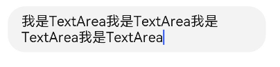
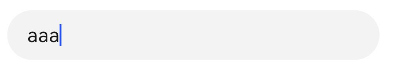
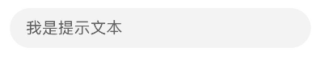
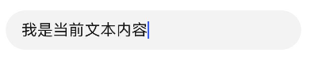
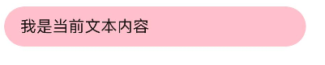
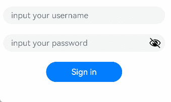
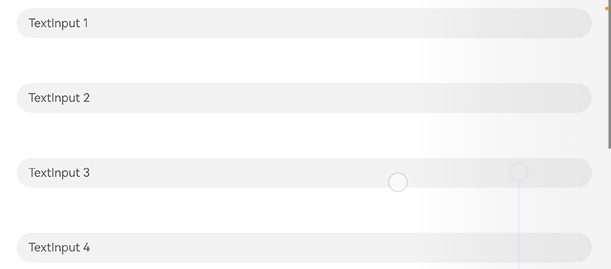
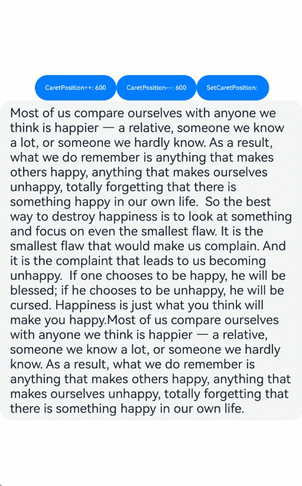

# 文本输入 (TextInput/TextArea)


TextInput、TextArea是输入框组件，通常用于响应用户的输入操作，比如评论区的输入、聊天框的输入、表格的输入等，也可以结合其它组件构建功能页面，例如登录注册页面。具体用法请参考[TextInput](../reference/apis-arkui/arkui-ts/ts-basic-components-textinput.md)、[TextArea](../reference/apis-arkui/arkui-ts/ts-basic-components-textarea.md)。


## 创建输入框

TextInput为单行输入框、TextArea为多行输入框。通过以下接口来创建。

```ts
TextInput(value?:{placeholder?: ResourceStr, text?: ResourceStr, controller?: TextInputController})
```

```ts
TextArea(value?:{placeholder?: ResourceStr, text?: ResourceStr, controller?: TextAreaController})
```

- 单行输入框

  ```ts
  TextInput()
  ```

  


- 多行输入框

  ```ts
  TextArea()
  ```

  

  多行输入框文字超出一行时会自动折行。


  ```ts
  TextArea({ text: "我是TextArea我是TextArea我是TextArea我是TextArea" }).width(300)
  ```

  


## 设置输入框类型

TextInput有9种可选类型，分别为Normal基本输入模式、Password密码输入模式、Email邮箱地址输入模式、Number纯数字输入模式、PhoneNumber电话号码输入模式、USER_NAME用户名输入模式、NEW_PASSWORD新密码输入模式、NUMBER_PASSWORD纯数字密码输入模式、<!--Del-->SCREEN_LOCK_PASSWORD锁屏应用密码输入模式、<!--DelEnd-->NUMBER_DECIMAL带小数点的数字输入模式。通过type属性进行设置：


- 基本输入模式（默认类型）

  ```ts
  TextInput()
    .type(InputType.Normal)
  ```

  

- 密码输入模式

  ```ts
  TextInput()
    .type(InputType.Password)
  ```

  


## 自定义样式

- 设置无输入时的提示文本。


  ```ts
  TextInput({ placeholder: '我是提示文本' })
  ```

  


- 设置输入框当前的文本内容。

  ```ts
  TextInput({ placeholder: '我是提示文本', text: '我是当前文本内容' })
  ```

  

- 添加backgroundColor改变输入框的背景颜色。

  ```ts
  TextInput({ placeholder: '我是提示文本', text: '我是当前文本内容' })
    .backgroundColor(Color.Pink)
  ```

  

  更丰富的样式可以结合[通用属性](../reference/apis-arkui/arkui-ts/ts-universal-attributes-size.md)实现。


## 添加事件

文本框主要用于获取用户输入的信息，把信息处理成数据进行上传，绑定onChange事件可以获取输入框内改变的内容。用户也可以使用通用事件来进行相应的交互操作。

```ts
TextInput()
  .onChange((value: string) => {
    console.info(value);
  })
  .onFocus(() => {
    console.info('获取焦点');
  })
```

## 场景示例

在登录/注册页面，用户进行登录或注册。

```ts
@Entry
@Component
struct TextInputSample {
  build() {
    Column() {
      TextInput({ placeholder: 'input your username' }).margin({ top: 20 })
        .onSubmit((EnterKeyType) => {
          console.info(EnterKeyType + '输入法回车键的类型值');
        })
      TextInput({ placeholder: 'input your password' }).type(InputType.Password).margin({ top: 20 })
        .onSubmit((EnterKeyType) => {
          console.info(EnterKeyType + '输入法回车键的类型值');
        })
      Button('Sign in').width(150).margin({ top: 20 })
    }.padding(20)
  }
}
```



## 键盘避让

键盘抬起后，具有滚动能力的容器组件在横竖屏切换时，才会生效键盘避让，若希望无滚动能力的容器组件也生效键盘避让，建议在组件外嵌套一层具有滚动能力的容器组件，比如[Scroll](../reference/apis-arkui/arkui-ts/ts-container-scroll.md)、[List](../reference/apis-arkui/arkui-ts/ts-container-list.md)、[Grid](../reference/apis-arkui/arkui-ts/ts-container-grid.md)。

```ts
// xxx.ets
@Entry
@Component
struct Index {
  placeHolderArr: string[] = ['1', '2', '3', '4', '5', '6', '7'];

  build() {
    Scroll() {
      Column() {
        ForEach(this.placeHolderArr, (placeholder: string) => {
          TextInput({ placeholder: 'TextInput ' + placeholder })
            .margin(30)
        })
      }
    }
    .height('100%')
    .width('100%')
  }
}
```



## 光标避让

[keyBoardAvoidMode](../reference/apis-arkui/js-apis-arkui-UIContext.md#keyboardavoidmode11)默认的OFFSET和RESIZE在键盘抬起后，不支持二次避让，如果想要支持光标位置在点击或者通过接口设置变化后发生二次避让，可以考虑使用OFFSET_WITH_CARET和RESIZE_CARET替换原有的OFFSET和RESIZE模式。<br>
对于滚动容器更推荐使用RESIZE_WITH_CARET，非滚动容器应该使用OFFSET_WITH_CARET。

```ts
// EntryAbility.ets
import { KeyboardAvoidMode } from '@kit.ArkUI';

// Used in UIAbility
onWindowStageCreate(windowStage: window.WindowStage) {
  // Main window is created, set main page for this ability
  hilog.info(0x0000, 'testTag', '%{public}s', 'Ability onWindowStageCreate');

  windowStage.loadContent('pages/Index', (err, data) => {
    let keyboardAvoidMode = windowStage.getMainWindowSync().getUIContext().getKeyboardAvoidMode();
  windowStage.getMainWindowSync().getUIContext().setKeyboardAvoidMode(KeyboardAvoidMode.OFFSET_WITH_CARET);
    if (err.code) {
      hilog.error(0x0000, 'testTag', 'Failed to load the content. Cause: %{public}s', JSON.stringify(err) ?? '');
      return;
    }
    hilog.info(0x0000, 'testTag', 'Succeeded in loading the content. Data: %{public}s', JSON.stringify(data) ?? '');
  });
}
```

```ts
// xxx.ets
@Entry
@Component
struct Index {
  @State caretPosition: number = 600;
  areaController: TextAreaController = new TextAreaController();
  text = "Most of us compare ourselves with anyone we think is happier — a relative, someone we know a lot, or someone we hardly know. As a result, what we do remember is anything that makes others happy, anything that makes ourselves unhappy, totally forgetting that there is something happy in our own life.\
  So the best way to destroy happiness is to look at something and focus on even the smallest flaw. It is the smallest flaw that would make us complain. And it is the complaint that leads to us becoming unhappy.\
  If one chooses to be happy, he will be blessed; if he chooses to be unhappy, he will be cursed. Happiness is just what you think will make you happy.Most of us compare ourselves with anyone we think is happier — a relative, someone we know a lot, or someone we hardly know. As a result, what we do remember is anything that makes others happy, anything that makes ourselves unhappy, totally forgetting that there is something happy in our own life.\
  So the best way to destroy happiness is to look at something and focus on even the smallest flaw. It is the smallest flaw that would make us complain. And it is the complaint that leads to us becoming unhappy.\
  If one chooses to be happy, he will be blessed; if he chooses to be unhappy, he will be cursed. Happiness is just what you think will make you happy.Most of us compare ourselves with anyone we think is happier — a relative, someone we know a lot, or someone we hardly know. As a result, what we do remember is anything that makes others happy, anything that makes ourselves unhappy, totally forgetting that there is something happy in our own life.\
  So the best way to destroy happiness is to look at something and focus on even the smallest flaw. It is the smallest flaw that would make us complain. And it is the complaint that leads to us becoming unhappy.\
  If one chooses to be happy, he will be blessed; if he chooses to be unhappy, he will be cursed. Happiness is just what you think will make you happy.Most of us compare ourselves with anyone we think is happier — a relative, someone we know a lot, or someone we hardly know. As a result, what we do remember is anything that makes others happy, anything that makes ourselves unhappy, totally forgetting that there is something happy in our own life.\
  So the best way to destroy happiness is to look at something and focus on even the smallest flaw. It is the smallest flaw that would make us complain. And it is the complaint that leads to us becoming unhappy.\
  If one chooses to be happy, he will be blessed; if he chooses to be unhappy, he will be cursed. Happiness is just what you think will make you happy.Most of us compare ourselves with anyone we think is happier — a relative, someone we know a lot, or someone we hardly know. As a result, what we do remember is anything that makes others happy, anything that makes ourselves unhappy, totally forgetting that there is something happy in our own life.\
  ";

  build() {
    Scroll() {
      Column() {
        Row() {
          Button('CaretPostiion++: ' + this.caretPosition).onClick(() => {
            this.caretPosition += 1;
          }).fontSize(10)
          Button('CaretPostiion--: ' + this.caretPosition).onClick(() => {
            this.caretPosition -= 1;
          }).fontSize(10)
          Button('SetCaretPostion: ').onClick(() => {
            this.areaController.caretPosition(this.caretPosition);
          }).fontSize(10)
        }

        TextArea({ text: this.text, controller: this.areaController })
          .width('100%')
          .fontSize('20fp')
      }
    }.width('100%').height('100%')
  }
}
```



## 相关实例

针对文本输入开发，有以下相关实例可供参考：

- [简易计算器（ArkTS）（API9）](https://gitee.com/openharmony/codelabs/tree/master/ETSUI/SimpleCalculator)