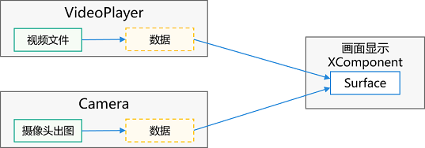

# XComponent


[XComponent](../reference/arkui-ts/ts-basic-components-xcomponent.md)组件作为一种绘制组件，通常用于满足开发者较为复杂的自定义绘制需求，例如相机预览流的显示和游戏画面的绘制。


其可通过指定其type字段来实现不同的功能，主要有两个“surface”和“component”字段可供选择。


对于“surface”类型，开发者可将相关数据传入XComponent单独拥有的“surface”来渲染画面。


对于“component”类型则主要用于实现动态加载显示内容的目的。


## surface类型

XComponent设置为surface类型时通常用于EGL/OpenGLES和媒体数据写入，并将其显示在XComponent组件上。

设置为“surface“类型时XComponent组件可以和其他组件一起进行布局和渲染。

同时XComponent又拥有单独的“surface“，可以为开发者在native侧提供native window用来创建EGL/OpenGLES环境，进而使用标准的OpenGL ES开发。

除此之外，媒体相关应用（视频、相机等）也可以将相关数据写入XComponent所提供的surface，从而实现呈现相应画面。


## 使用EGL/OpenGLES渲染


### native侧代码开发要点

OpenHarmony的应用如果要通过js来桥接native，一般需要使用napi接口来处理js交互，XComponent同样不例外，具体使用请参考[Native API在应用工程中的使用指导](../napi/napi-guidelines.md)。

Native侧处理js逻辑的文件类型为so：

- 每个模块对应一个so

- so的命名规则为 lib{模块名}.so


对于使用XComponent进行标准OpenGL ES开发的场景，CMAKELists.txt文件内容大致如下：


```
cmake_minimum_required(VERSION 3.4.1)
project(XComponent) # 项目名称

set(NATIVERENDER_ROOT_PATH ${CMAKE_CURRENT_SOURCE_DIR})
# 头文件查找路径
include_directories(${NATIVERENDER_ROOT_PATH}
                    ${NATIVERENDER_ROOT_PATH}/include
                    )

# 编译目标so，SHARED表示动态库
add_library(nativerender SHARED
            xxx.cpp
            )

# 查找相关库 (包括OpenGL ES相关库和XComponent提供的ndk接口)
find_library( EGL-lib
              EGL )

find_library( GLES-lib
              GLESv3 )

find_library( libace-lib
              ace_ndk.z )

# 编译so所需要的依赖
target_link_libraries(nativerender PUBLIC ${EGL-lib} ${GLES-lib} ${libace-lib} libace_napi.z.so libc++.a)
```


### Napi模块注册


```c++
static napi_value Init(napi_env env, napi_value exports)
{
	// 定义暴露在模块上的方法
    napi_property_descriptor desc[] ={
        DECLARE_NAPI_FUNCTION("changeColor", PluginRender::NapiChangeColor),
    };
    // 通过此接口开发者可在exports上挂载native方法（即上面的PluginRender::NapiChangeColor），exports会通过js引擎绑定到js层的一个js对象
    NAPI_CALL(env, napi_define_properties(env, exports, sizeof(desc) / sizeof(desc[0]), desc));
    return exports;
}

static napi_module nativerenderModule = {
    .nm_version = 1,
    .nm_flags = 0,
    .nm_filename = nullptr,
    .nm_register_func = Init, // 指定加载对应模块时的回调函数
    .nm_modname = "nativerender", // 指定模块名称，对于XComponent相关开发，这个名称必须和ArkTS侧XComponent中libraryname的值保持一致
    .nm_priv = ((void*)0),
    .reserved = { 0 },
};

extern "C" __attribute__((constructor)) void RegisterModule(void)
{
    // 注册so模块
    napi_module_register(&nativerenderModule);c
}
```


### 解析XComponent组件的NativeXComponent实例

NativeXComponent为XComponent提供了在native层的实例，可作为js层和native层XComponent绑定的桥梁。XComponent所提供的的NDK接口都依赖于该实例。具体NDK接口可参考[Native XComponent](../reference/native-apis/_o_h___native_x_component.md)。


可以在模块被加载时的回调内（即[Napi模块注册](#napi模块注册)中的Init函数）解析获得NativeXComponent实例


```c++
{
    // ...
    napi_status status;
    napi_value exportInstance = nullptr;
    OH_NativeXComponent *nativeXComponent = nullptr;
    // 用来解析出被wrap了NativeXComponent指针的属性
    status = napi_get_named_property(env, exports, OH_NATIVE_XCOMPONENT_OBJ, &exportInstance);
    if (status != napi_ok) {
        return false;
    }
    // 通过napi_unwrap接口，解析出NativeXComponent的实例指针
    status = napi_unwrap(env, exportInstance, reinterpret_cast<void**>(&nativeXComponent));
    // ...
}
```


### 注册XComponent事件回调

依赖[解析XComponent组件的NativeXComponent实例](#解析xcomponent组件的nativexcomponent实例)拿到的NativeXComponent指针，通过OH_NativeXComponent_RegisterCallback接口进行回调注册


```c++
{
    ...
    OH_NativeXComponent *nativeXComponent = nullptr;
    // 解析出NativeXComponent实例

    OH_NativeXComponent_Callback callback;
    callback->OnSurfaceCreated = OnSurfaceCreatedCB; // surface创建成功后触发，开发者可以从中获取native window的句柄
    callback->OnSurfaceChanged = OnSurfaceChangedCB; // surface发生变化后触发，开发者可以从中获取native window的句柄以及XComponent的变更信息
    callback->OnSurfaceDestroyed = OnSurfaceDestroyedCB; // surface销毁时触发，开发者可以在此释放资源
    callback->DispatchTouchEvent = DispatchTouchEventCB; // XComponent的touch事件回调接口，开发者可以从中获得此次touch事件的信息

    OH_NativeXComponent_RegisterCallback(nativeXComponent, callback);
    ...
}
```


### 创建EGL/OpenGLES环境

在注册的OnSurfaceCreated回调中开发者能拿到native window的句柄（其本质就是XComponent所单独拥有的surface），因此可以在这里创建应用自己的EGL/OpenGLES开发环境，由此开始具体渲染逻辑的开发。


```c++
EGLCore* eglCore_; // EGLCore为封装了OpenGL相关接口的类
uint64_t width_;
uint64_t height_;
void OnSurfaceCreatedCB(OH_NativeXComponent* component, void* window)
{
    int32_t ret = OH_NativeXComponent_GetXComponentSize(component, window, &width_, &height_);
    if (ret === OH_NATIVEXCOMPONENT_RESULT_SUCCESS) {
        eglCore_->GLContextInit(window, width_, height_); // 初始化OpenGL环境
    }
}
```


### ArkTS侧语法介绍

开发者在ArkTS侧使用如下代码即可用XComponent组件进行利用EGL/OpenGLES渲染的开发。


```ts
XComponent({ id: 'xcomponentId1', type: 'surface', libraryname: 'nativerender' })
  .onLoad((context) => {})
  .onDestroy(() => {})
```

- id : 与XComponent组件为一一对应关系，不可重复。通常开发者可以在native侧通过OH_NativeXComponent_GetXComponentId接口来获取对应的id从而绑定对应的XComponent。

- libraryname：加载模块的名称，必须与在native侧Napi模块注册时nm_modname的名字一致。

  >**说明：**
  >
  >   应用加载模块实现跨语言调用有两种方式：
  >
  > 1. 使用NAPI的import方式加载：
  >
  >    ```ts
  >    import nativerender from "libnativerender.so"
  >    ```
  >
  > 2. 使用XComponent组件加载，本质也是使用了NAPI机制来加载。
  >    该加载方式和import加载方式的区别在于，在加载动态库是会将XComponent的NativeXComponent实例暴露到应用的native层中，从而让开发者可以使用XComponent的NDK接口。

- onLoad事件
  - 触发时刻：XComponent准备好surface后触发。
  - 参数context：其上面挂载了暴露在模块上的native方法，使用方法类似于利用 import context2 from "libnativerender.so" 直接加载模块后获得的context2实例。
  - 时序：onLoad事件的触发和Surface相关，其和native侧的OnSurfaceCreated的时序如下图：

     

- onDestroy事件

  触发时刻：XComponent组件被销毁时触发与一般ArkUI的组件销毁时机一致，其和native侧的OnSurfaceDestroyed的时序如下图：

  


### 媒体数据写入

XComponent所持有的Surface符合“生产者-消费者”模型

OpenHarmony上Camera、VideoPlayer等符合生产者设计的部件都可以将数据写入XComponent持有的surface并通过XComponent显示。



开发者可通过绑定XComponentController获得对应XComponent的surfaceId（该id可以唯一确定一个surface），从而传给相应的部件接口。


```ts
@State surfaceId:string = "";
mXComponentController: XComponentController = new XComponentController();
XComponent({ id: '', type: 'surface', controller: this.mXComponentController })
  .onLoad(() => {
    this.surfaceId = this.mXComponentController.getXComponentSurfaceId()
  })
```

具体部件接口可参考：[AVPlayer](../reference/apis/js-apis-media.md#avplayer9)、[Camera](../reference/apis/js-apis-camera.md) 等。


### component类型

XComponent设置为component类型时通常用于在XComponent内部执行非UI逻辑以实现动态加载显示内容的目的。


>**说明：**
>
> type为"component"时，XComponent作为容器，子组件沿垂直方向布局：
>
> - 垂直方向上对齐格式：[FlexAlign](../reference/arkui-ts/ts-appendix-enums.md#flexalign).Start
>
> - 水平方向上对齐格式：[FlexAlign](../reference/arkui-ts/ts-appendix-enums.md#flexalign).Center
>
> 不支持所有的事件响应。
>
> 布局方式更改和事件响应均可通过挂载子组件来设置。
>
> 内部所写的非UI逻辑需要封装在一个或多个函数内。


### 场景示例


```ts
@Builder
function addText(label: string): void {
  Text(label)
    .fontSize(40)
}

@Entry
@Component
struct Index {
  @State message: string = 'Hello XComponent'
  @State messageCommon: string = 'Hello World'
  build() {
    Row() {
      Column() {
        XComponent({ id: 'xcomponentId-container', type: 'component' }) {
          addText(this.message)
          Divider()
            .margin(4)
            .strokeWidth(2)
            .color('#F1F3F5')
            .width("80%")
          Column() {
            Text(this.messageCommon)
              .fontSize(30)
          }
        }
      }
      .width('100%')
    }
    .height('100%')
  }
}
```


