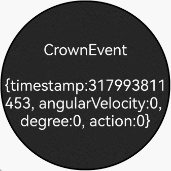

# 表冠事件（圆形屏幕推荐使用）

表冠事件从API version 16开始支持，是指通过旋转表冠触发的事件，通过硬件采样频率上报旋转角度的变化。

表冠事件的分发依赖于应用焦点，只有拥有焦点的组件才能接收该事件，因此，接收此事件的组件必须管理好其焦点状态。开发者可以自定义处理焦点事件。目前，系统中一些默认组件支持与表冠的交互，例如，旋转手表表冠后，滚动条会根据表冠的旋转方向滚动。此外，应用也可以通过特定接口感知表冠事件的上报。当前，默认支持表冠事件的组件包括： [Slider](../reference/apis-arkui/arkui-ts/ts-basic-components-slider.md)、[DatePicker](../reference/apis-arkui/arkui-ts/ts-basic-components-datepicker.md)、[TextPicker](../reference/apis-arkui/arkui-ts/ts-basic-components-textpicker.md)、 [TimePicker](../reference/apis-arkui/arkui-ts/ts-basic-components-timepicker.md)、[Scroll](../reference/apis-arkui/arkui-ts/ts-container-scroll.md)、[List](../reference/apis-arkui/arkui-ts/ts-container-list.md)、[Grid](../reference/apis-arkui/arkui-ts/ts-container-grid.md)、[WaterFlow](../reference/apis-arkui/arkui-ts/ts-container-waterflow.md)、[ArcList](../reference/apis-arkui/arkui-ts/ts-container-arclist.md)、[Refresh](../reference/apis-arkui/arkui-ts/ts-container-refresh.md)和[Swiper](../reference/apis-arkui/arkui-ts/ts-container-swiper.md)。

>  **说明：**
>
>  - 仅圆形屏幕支持表冠事件。

表冠事件发生时，会触发onDigitalCrown回调函数。

```ts
onDigitalCrown(event: (event?: CrownEvent) => void)
```

其中，event参数提供表冠事件的时间戳，旋转角速度，旋转角度和[表冠动作](../reference/apis-arkui/arkui-ts/ts-appendix-enums.md#crownaction18)。

当组件需要获取旋转角度等信息时，可以通过onDigitalCrown接收表冠事件来获得上报信息。以下以Text组件为例，介绍表冠事件开发的基本步骤及开发过程中需要注意的事项。

1. 组件获焦

    确保接收事件的组件获得焦点，可以通过使用[focusable](../reference/apis-arkui/arkui-ts/ts-universal-attributes-focus.md#focusable)、[defaultFocus](../reference/apis-arkui/arkui-ts/ts-universal-attributes-focus.md#defaultfocus9)、[focusOnTouch](../reference/apis-arkui/arkui-ts/ts-universal-attributes-focus.md#focusontouch9)等方法来实现。如需更详细的焦点控制信息，请参考[焦点事件](../reference/apis-arkui/arkui-ts/ts-universal-attributes-focus.md)文档。
    
    ```ts
    Text(this.message)
      .fontSize(20)
      .fontColor(Color.White)
      .backgroundColor("#262626")
      .textAlign(TextAlign.Center)
      .focusable(true)
      .focusOnTouch(true)
      .defaultFocus(true)
    ```
2. 注册事件回调

    接收表冠事件需要注册表冠事件回调，当触发表冠事件时会执行回调函数。

    ```ts
    .onDigitalCrown((event: CrownEvent) => {})
    ```
3. 事件字段的含义

    表冠事件提供了时间戳，旋转角速度，旋转角度和表冠动作。此外表冠事件会触发事件冒泡，可通过[stopPropagation](../reference/apis-arkui/arkui-ts/ts-universal-events-crown.md#crownevent对象说明)阻止事件冒泡。

    ```ts
    event.stopPropagation();
    this.message = "CrownEvent\n\n" + JSON.stringify(event);
    console.debug("action:%d, angularVelocity:%f, degree:%f, timestamp:%f",
    event.action, event.angularVelocity, event.degree, event.timestamp);
    ```

**完整示例：**

```ts
// xxx.ets
@Entry
@Component
struct CityList {
  @State message: string = "onDigitalCrown";

  build() {
    Column() {
      Row(){
        Stack() {
          Text(this.message)
            .fontSize(20)
            .fontColor(Color.White)
            .backgroundColor("#262626")
            .textAlign(TextAlign.Center)
            .focusable(true)
            .focusOnTouch(true)
            .defaultFocus(true)
            .borderWidth(2)
            .width(223).height(223)
            .borderRadius(110)
            .onDigitalCrown((event: CrownEvent) => {
              event.stopPropagation();
              this.message = "CrownEvent\n\n" + JSON.stringify(event);
              console.debug("action:%d, angularVelocity:%f, degree:%f, timestamp:%f",
                event.action, event.angularVelocity, event.degree, event.timestamp);
            })
        }.width("100%").height("100%")
      }.width("100%").height("100%")
    }
  }
}
```

