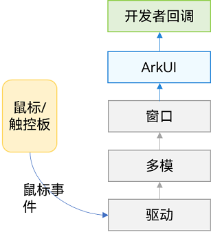
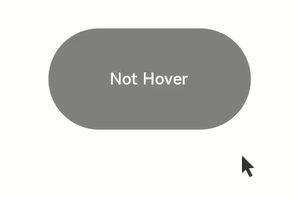
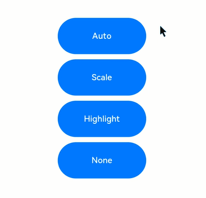

# 键鼠事件


键鼠事件指键盘，鼠标外接设备的输入事件。


## 鼠标事件

支持的鼠标事件包含通过外设鼠标、触控板触发的事件。

鼠标事件可触发以下回调：

| 名称                                       | 描述                                       |
| ---------------------------------------- | ---------------------------------------- |
| onHover(event:&nbsp;(isHover:&nbsp;boolean)&nbsp;=&gt;&nbsp;void) | 鼠标进入或退出组件时触发该回调。<br/>isHover：表示鼠标是否悬浮在组件上，鼠标进入时为true,&nbsp;退出时为false。 |
| onMouse(event:&nbsp;(event?:&nbsp;MouseEvent)&nbsp;=&gt;&nbsp;void) | 当前组件被鼠标按键点击时或者鼠标在组件上悬浮移动时，触发该回调，event返回值包含触发事件时的时间戳、鼠标按键、动作、鼠标位置在整个屏幕上的坐标和相对于当前组件的坐标。 |

当组件绑定onHover回调时，可以通过[hoverEffect](../reference/apis-arkui/arkui-ts/ts-universal-attributes-hover-effect.md#hovereffect)属性设置该组件的鼠标悬浮态显示效果。


  **图1** 鼠标事件数据流  





鼠标事件传递到ArkUI之后，会先判断鼠标事件是否是左键的按下/抬起/移动，然后做出不同响应：


- 是：鼠标事件先转换成相同位置的触摸事件，执行触摸事件的碰撞测试、手势判断和回调响应。接着去执行鼠标事件的碰撞测试和回调响应。

- 否：事件仅用于执行鼠标事件的碰撞测试和回调响应。


>**说明：**
>
>所有单指可响应的触摸事件/手势事件，均可通过鼠标左键来操作和响应。例如当我们需要开发单击Button跳转页面的功能、且需要支持手指点击和鼠标左键点击，那么只绑定一个点击事件（onClick）就可以实现该效果。若需要针对手指和鼠标左键的点击实现不一样的效果，可以在onClick回调中，使用回调参数中的source字段即可判断出当前触发事件的来源是手指还是鼠标。


### onHover


```ts
onHover(event: (isHover: boolean) => void)
```


鼠标悬浮事件回调。参数isHover类型为boolean，表示鼠标进入组件或离开组件。该事件不支持自定义冒泡设置，默认父子冒泡。


若组件绑定了该接口，当鼠标指针从组件外部进入到该组件的瞬间会触发事件回调，参数isHover等于true；鼠标指针离开组件的瞬间也会触发该事件回调，参数isHover等于false。


>**说明：**
>
>事件冒泡：在一个树形结构中，当子节点处理完一个事件后，再将该事件交给它的父节点处理。


```ts
// xxx.ets
@Entry
@Component
struct MouseExample {
  @State hoverText: string = 'Not Hover';
  @State Color: Color = Color.Gray;

  build() {
    Column() {
      Button(this.hoverText)
        .width(200).height(100)
        .backgroundColor(this.Color)
        .onHover((isHover?: boolean) => { // 使用onHover接口监听鼠标是否悬浮在Button组件上
          if (isHover) {
            this.hoverText = 'Hovered!';
            this.Color = Color.Green;
          }
          else {
            this.hoverText = 'Not Hover';
            this.Color = Color.Gray;
          }
        })
    }.width('100%').height('100%').justifyContent(FlexAlign.Center)
  }
}
```


该示例创建了一个Button组件，初始背景色为灰色，内容为“Not Hover”。示例中的Button组件绑定了onHover回调，在该回调中将this.isHovered变量置为回调参数：isHover。


当鼠标从Button外移动到Button内的瞬间，回调响应，isHover值等于true，isHovered的值变为true，将组件的背景色改成Color.Green，内容变为“Hovered!”。


当鼠标从Button内移动到Button外的瞬间，回调响应，isHover值等于false，又将组件变成了初始的样式。





### onMouse


```ts
onMouse(event: (event?: MouseEvent) => void)
```


鼠标事件回调。绑定该API的组件每当鼠标指针在该组件内产生行为（MouseAction）时，触发事件回调，参数为[MouseEvent](../reference/apis-arkui/arkui-ts/ts-universal-mouse-key.md#mouseevent对象说明)对象，表示触发此次的鼠标事件。该事件支持自定义冒泡设置，默认父子冒泡。常用于开发者自定义的鼠标行为逻辑处理。


开发者可以通过回调中的MouseEvent对象获取触发事件的坐标（displayX/displayY/windowX/windowY/x/y）、按键（[MouseButton](../reference/apis-arkui/arkui-ts/ts-appendix-enums.md#mousebutton8)）、行为（[MouseAction](../reference/apis-arkui/arkui-ts/ts-appendix-enums.md#mouseaction8)）、时间戳（timestamp）、交互组件的区域（[EventTarget](../reference/apis-arkui/arkui-ts/ts-universal-events-click.md#eventtarget8对象说明)）、事件来源（[SourceType](../reference/apis-arkui/arkui-ts/ts-gesture-settings.md#sourcetype枚举说明)）等。MouseEvent的回调函数stopPropagation用于设置当前事件是否阻止冒泡。


>**说明：**
>
>按键（MouseButton）的值：Left/Right/Middle/Back/Forward 均对应鼠标上的实体按键，当这些按键被按下或松开时触发这些按键的事件。None表示无按键，会出现在鼠标没有按键按下或松开的状态下，移动鼠标所触发的事件中。


```ts
// xxx.ets
@Entry
@Component
struct MouseExample {
  @State buttonText: string = '';
  @State columnText: string = '';
  @State hoverText: string = 'Not Hover';
  @State Color: Color = Color.Gray;

  build() {
    Column() {
      Button(this.hoverText)
        .width(200)
        .height(100)
        .backgroundColor(this.Color)
        .onHover((isHover?: boolean) => {
          if (isHover) {
            this.hoverText = 'Hovered!';
            this.Color = Color.Green;
          }
          else {
            this.hoverText = 'Not Hover';
            this.Color = Color.Gray;
          }
        })
        .onMouse((event?: MouseEvent) => { // 设置Button的onMouse回调
          if (event) {
            this.buttonText = 'Button onMouse:\n' + '' +
              'button = ' + event.button + '\n' +
              'action = ' + event.action + '\n' +
              'x,y = (' + event.x + ',' + event.y + ')' + '\n' +
              'windowXY=(' + event.windowX + ',' + event.windowY + ')';
          }
        })
      Divider()
      Text(this.buttonText).fontColor(Color.Green)
      Divider()
      Text(this.columnText).fontColor(Color.Red)
    }
    .width('100%')
    .height('100%')
    .justifyContent(FlexAlign.Center)
    .borderWidth(2)
    .borderColor(Color.Red)
    .onMouse((event?: MouseEvent) => { // Set the onMouse callback for the column.
      if (event) {
        this.columnText = 'Column onMouse:\n' + '' +
          'button = ' + event.button + '\n' +
          'action = ' + event.action + '\n' +
          'x,y = (' + event.x + ',' + event.y + ')' + '\n' +
          'windowXY=(' + event.windowX + ',' + event.windowY + ')';
      }
    })
  }
}
```


在onHover示例的基础上，给Button绑定onMouse接口。在回调中，打印出鼠标事件的button/action等回调参数值。同时，在外层的Column容器上，也做相同的设置。整个过程可以分为以下两个动作：


1. 移动鼠标：当鼠标从Button外部移入Button的过程中，仅触发了Column的onMouse回调；当鼠标移入到Button内部后，由于onMouse事件默认是冒泡的，所以此时会同时响应Column的onMouse回调和Button的onMouse回调。此过程中，由于鼠标仅有移动动作没有点击动作，因此打印信息中的button均为0（MouseButton.None的枚举值）、action均为3（MouseAction.Move的枚举值）。

2. 点击鼠标：鼠标进入Button后进行了2次点击，分别是左键点击和右键点击。
   左键点击时：button = 1（MouseButton.Left的枚举值），按下时：action = 1（MouseAction.Press的枚举值），抬起时：action = 2（MouseAction.Release的枚举值）。

   右键点击时：button = 2（MouseButton.Right的枚举值），按下时：action = 1（MouseAction.Press的枚举值），抬起时：action = 2（MouseAction.Release的枚举值）。


如果需要阻止鼠标事件冒泡，可以通过调用stopPropagation()方法进行设置。


```ts
class ish{
  isHovered:boolean = false
  set(val:boolean){
    this.isHovered = val;
  }
}
class butf{
  buttonText:string = ''
  set(val:string){
    this.buttonText = val
  }
}
@Entry
@Component
struct MouseExample {
  @State isHovered:ish = new ish()
  build(){
    Column(){
      Button(this.isHovered ? 'Hovered!' : 'Not Hover')
        .width(200)
        .height(100)
        .backgroundColor(this.isHovered ? Color.Green : Color.Gray)
        .onHover((isHover?: boolean) => {
          if(isHover) {
            let ishset = new ish()
            ishset.set(isHover)
          }
        })
        .onMouse((event?: MouseEvent) => {
          if (event) {
            if (event.stopPropagation) {
              event.stopPropagation(); // 在Button的onMouse事件中设置阻止冒泡
            }
            let butset = new butf()
            butset.set('Button onMouse:\n' + '' +
              'button = ' + event.button + '\n' +
              'action = ' + event.action + '\n' +
              'x,y = (' + event.x + ',' + event.y + ')' + '\n' +
              'windowXY=(' + event.windowX + ',' + event.windowY + ')');
          }
        })
    }
  }
}
```


在子组件（Button）的onMouse中，通过回调参数event调用stopPropagation回调方法（如下）即可阻止Button子组件的鼠标事件冒泡到父组件Column上。


```ts
event.stopPropagation()
```


效果是：当鼠标在Button组件上操作时，仅Button的onMouse回调会响应，Column的onMouse回调不会响应。


### hoverEffect


```ts
hoverEffect(value: HoverEffect)
```


鼠标悬浮态效果设置的通用属性。参数类型为HoverEffect，HoverEffect提供的Auto、Scale、Highlight效果均为固定效果，开发者无法自定义设置效果参数。


  **表1** HoverEffect说明

| HoverEffect枚举值 | 效果说明                                     |
| -------------- | ---------------------------------------- |
| Auto           | 组件默认提供的悬浮态效果，由各组件定义。                     |
| Scale          | 动画播放方式，鼠标悬浮时：组件大小从100%放大至105%，鼠标离开时：组件大小从105%缩小至100%。 |
| Highlight      | 动画播放方式，鼠标悬浮时：组件背景色叠加一个5%透明度的白色，视觉效果是组件的原有背景色变暗，鼠标离开时：组件背景色恢复至原有样式。 |
| None           | 禁用悬浮态效果。                                  |


```ts
// xxx.ets
@Entry
@Component
struct HoverExample {
  build() {
    Column({ space: 10 }) {
      Button('Auto')
        .width(170).height(70)
      Button('Scale')
        .width(170).height(70)
        .hoverEffect(HoverEffect.Scale)
      Button('Highlight')
        .width(170).height(70)
        .hoverEffect(HoverEffect.Highlight)
      Button('None')
        .width(170).height(70)
        .hoverEffect(HoverEffect.None)
    }.width('100%').height('100%').justifyContent(FlexAlign.Center)
  }
}
```





Button默认的悬浮态效果就是Highlight效果，因此Auto和Highlight的效果一样，Highlight会使背板颜色变暗，Scale会让组件缩放，None会禁用悬浮态效果。


## 按键事件

### 按键事件数据流


按键事件由外设键盘等设备触发，经驱动和多模处理转换后发送给当前获焦的窗口，窗口获取到事件后，会尝试分发三次事件。三次分发的优先顺序如下，一旦事件被消费，则跳过后续分发流程。

1. 首先分发给ArkUI框架用于触发获焦组件绑定的onKeyPreIme回调和页面快捷键。
2. 再向输入法分发，输入法会消费按键用作输入。
3. 再次将事件发给ArkUI框架，用于响应系统默认Key事件（例如走焦），以及获焦组件绑定的onKeyEvent回调。

因此，当某输入框组件获焦，且打开了输入法，此时大部分按键事件均会被输入法消费。例如字母键会被输入法用来往输入框中输入对应字母字符、方向键会被输入法用来切换选中备选词。如果在此基础上给输入框组件绑定了快捷键，那么快捷键会优先响应事件，事件也不再会被输入法消费。

按键事件到ArkUI框架之后，会先找到完整的父子节点获焦链。从叶子节点到根节点，逐一发送按键事件。 

Web组件的KeyEvent流程与上述过程有所不同。对于Web组件，不会在onKeyPreIme返回false时候，去匹配快捷。而是第三次按键派发中，Web对于未消费的KeyEvent会通过ReDispatch重新派发回ArkUI。在ReDispatch中再执行匹配快捷键等操作。

### onKeyEvent & onKeyPreIme


```ts
onKeyEvent(event: (event: KeyEvent) => void): T
onKeyEvent(event: Callback<KeyEvent, boolean>): T
onKeyPreIme(event: Callback<KeyEvent, boolean>): T
onKeyEventDispatch(event: Callback<KeyEvent, boolean>): T
```


上述两种方法的区别仅在于触发的时机（见 [按键事件数据流](#按键事件数据流)）。其中onKeyPreIme的返回值决定了该按键事件后续是否会被继续分发给页面快捷键、输入法和onKeyEvent。


当绑定方法的组件处于获焦状态下，外设键盘的按键事件会触发该方法，回调参数为[KeyEvent](../reference/apis-arkui/arkui-ts/ts-universal-events-key.md#keyevent对象说明)，可由该参数获得当前按键事件的按键行为（[KeyType](../reference/apis-arkui/arkui-ts/ts-appendix-enums.md#keytype)）、键码（[keyCode](../reference/apis-input-kit/js-apis-keycode.md#keycode)）、按键英文名称（keyText）、事件来源设备类型（[KeySource](../reference/apis-arkui/arkui-ts/ts-appendix-enums.md#keysource)）、事件来源设备id（deviceId）、元键按压状态（metaKey）、时间戳（timestamp）、阻止冒泡设置（stopPropagation）。


```ts
// xxx.ets
@Entry
@Component
struct KeyEventExample {
  @State buttonText: string = '';
  @State buttonType: string = '';
  @State columnText: string = '';
  @State columnType: string = '';

  build() {
    Column() {
      Button('onKeyEvent')
        .defaultFocus(true)
        .width(140).height(70)
        .onKeyEvent((event?: KeyEvent) => { // 给Button设置onKeyEvent事件
          if(event){
            if (event.type === KeyType.Down) {
              this.buttonType = 'Down';
            }
            if (event.type === KeyType.Up) {
              this.buttonType = 'Up';
            }
            this.buttonText = 'Button: \n' +
            'KeyType:' + this.buttonType + '\n' +
            'KeyCode:' + event.keyCode + '\n' +
            'KeyText:' + event.keyText;
          }
        })

      Divider()
      Text(this.buttonText).fontColor(Color.Green)

      Divider()
      Text(this.columnText).fontColor(Color.Red)
    }.width('100%').height('100%').justifyContent(FlexAlign.Center)
    .onKeyEvent((event?: KeyEvent) => { // 给父组件Column设置onKeyEvent事件
      if(event){
        if (event.type === KeyType.Down) {
          this.columnType = 'Down';
        }
        if (event.type === KeyType.Up) {
          this.columnType = 'Up';
        }
        this.columnText = 'Column: \n' +
        'KeyType:' + this.buttonType + '\n' +
        'KeyCode:' + event.keyCode + '\n' +
        'KeyText:' + event.keyText;
      }
    })
  }
}
```


上述示例中给组件Button和其父容器Column绑定onKeyEvent。应用打开页面加载后，组件树上第一个可获焦的非容器组件自动获焦，设置Button为当前页面的默认焦点，由于Button是Column的子节点，Button获焦也同时意味着Column获焦。获焦机制见[焦点事件](arkts-common-events-focus-event.md)。


打开应用后，依次在键盘上按这些按键：“空格、回车、左Ctrl、左Shift、字母A、字母Z”。


1. 由于onKeyEvent事件默认是冒泡的，所以Button和Column的onKeyEvent都可以响应。

2. 每个按键都有2次回调，分别对应KeyType.Down和KeyType.Up，表示按键被按下、然后抬起。


如果要阻止冒泡，即仅Button响应键盘事件，Column不响应，在Button的onKeyEvent回调中加入event.stopPropagation()方法即可，如下：


```ts
@Entry
@Component
struct KeyEventExample {
  @State buttonText: string = '';
  @State buttonType: string = '';
  @State columnText: string = '';
  @State columnType: string = '';

  build() {
    Column() {
      Button('onKeyEvent')
        .defaultFocus(true)
        .width(140).height(70)
        .onKeyEvent((event?: KeyEvent) => {
          // 通过stopPropagation阻止事件冒泡
          if(event){
            if(event.stopPropagation){
              event.stopPropagation();
            }
            if (event.type === KeyType.Down) {
              this.buttonType = 'Down';
            }
            if (event.type === KeyType.Up) {
              this.buttonType = 'Up';
            }
            this.buttonText = 'Button: \n' +
              'KeyType:' + this.buttonType + '\n' +
              'KeyCode:' + event.keyCode + '\n' +
              'KeyText:' + event.keyText;
          }
        })

      Divider()
      Text(this.buttonText).fontColor(Color.Green)

      Divider()
      Text(this.columnText).fontColor(Color.Red)
    }.width('100%').height('100%').justifyContent(FlexAlign.Center)
    .onKeyEvent((event?: KeyEvent) => { // 给父组件Column设置onKeyEvent事件
      if(event){
        if (event.type === KeyType.Down) {
          this.columnType = 'Down';
        }
        if (event.type === KeyType.Up) {
          this.columnType = 'Up';
        }
        this.columnText = 'Column: \n' +
          'KeyType:' + this.buttonType + '\n' +
          'KeyCode:' + event.keyCode + '\n' +
          'KeyText:' + event.keyText;
      }
    })
  }
}
```


使用OnKeyPreIme屏蔽在输入框中使用方向左键。
```ts
import { KeyCode } from '@kit.InputKit';

@Entry
@Component
struct PreImeEventExample {
  @State buttonText: string = '';
  @State buttonType: string = '';
  @State columnText: string = '';
  @State columnType: string = '';

  build() {
    Column() {
      Search({
        placeholder: "Search..."
      })
        .width("80%")
        .height("40vp")
        .border({ radius:"20vp" })
        .onKeyPreIme((event:KeyEvent) => {
          if (event.keyCode == KeyCode.KEYCODE_DPAD_LEFT) {
            return true;
          }
          return false;
        })
    }
  }
}
```

使用onKeyEventDispatch分发按键事件到子组件，子组件使用onKeyEvent。

```ts
@Entry
@Component
struct Index {
  build() {
    Row() {
      Row() {
        Button('button1').id('button1').onKeyEvent((event) => {
          console.log("button1");
          return true
        })
        Button('button1').id('button2').onKeyEvent((event) => {
          console.log("button2");
          return true
        })
      }
      .width('100%')
      .height('100%')
      .id('Row1')
      .onKeyEventDispatch((event) => {
        let context = this.getUIContext();
        context.getFocusController().requestFocus('button1');
        return context.dispatchKeyEvent('button1', event);
      })

    }
    .height('100%')
    .width('100%')
    .onKeyEventDispatch((event) => {
      if (event.type == KeyType.Down) {
        let context = this.getUIContext();
        context.getFocusController().requestFocus('Row1');
        return context.dispatchKeyEvent('Row1', event);
      }
      return true;
    })
  }
}
```
