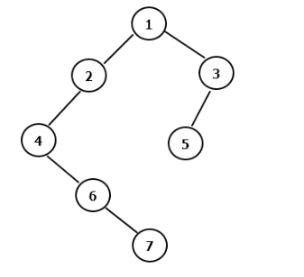
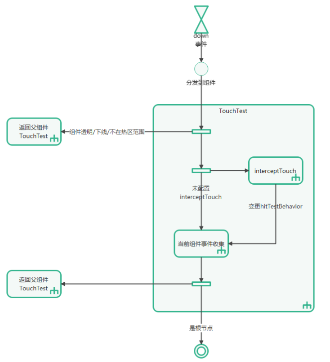
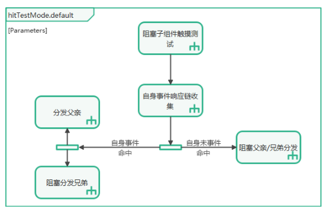
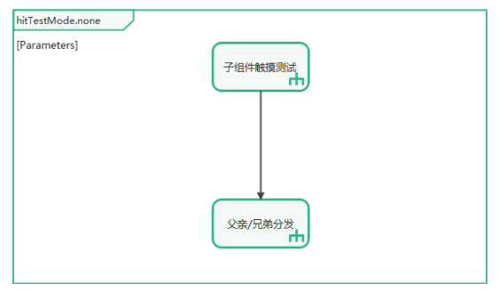
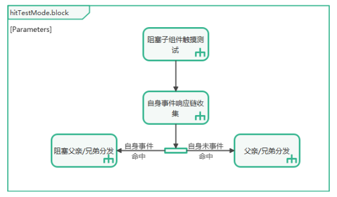
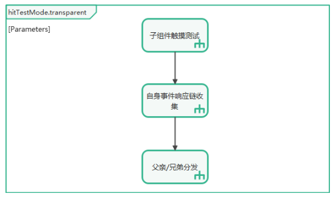

# 事件分发

## 概述

事件分发是指ArkUI收到用户操作生成的触控事件，通过触摸测试，将触控事件分发至各个组件形成事件的过程。

触控事件按照输入设备类型可以划分为finger（手指在屏幕滑动）、mouse（鼠标操作）、touchpad（触控板操作）、pen（手写笔在屏幕滑动）、joystick（手柄操作）等；按照事件类型可以划分为按下、移动、滚动等；系统会根据触控事件的坐标、类型等信息，结合UI布局，将事件发送给对应UI组件。多个事件可以组合触发手势或其他功能（长按、点击、拖拽）。

## 事件交互流程

事件交互流程是指当ArkUI接收到上游发送的Touch类触控事件或Mouse类触控事件后，根据开发者设定的各类参数，收集事件响应链并分发至各组件以触发回调的整个过程。该流程可以概括为以下三个步骤：

1. 事件产生

   硬件输入设备通过驱动、多模等模块，将事件上报至目标的ArkUI实例。ArkUI在渲染管线中进行统一处理。

2. 收集[事件响应链](#事件响应链)并分发事件

   事件响应链是事件交互流程的核心，管线在接收事件后，将通过触摸测试建立事件响应链，通过响应链决策事件分发以及手势合成。

   （1）[触摸测试](#触摸测试)

   当管线接收到起始触控事件后，将根据起始触控事件的坐标和组件位置进行触摸测试，最终建立事件响应链。开发者可以通过设置属性影响事件响应链的形成。

   （2）[分发事件至Touch事件响应链](#分发事件至touch事件响应链)

   构建事件响应链后，触控事件将根据Touch事件响应链分发至目标组件。

   （3）[分发事件至手势响应链并进行手势识别](#分发事件至手势响应链并进行手势识别)

   各组件上设置的手势在通过触摸测试后，还会形成手势响应链。触控事件送入手势响应链后会与其它事件组合产生手势，手势之间再经过竞争，最终触发符合条件的手势回调。

   （4）[事件拦截](#事件拦截)

   事件响应链建立前，开发者可以配置触摸测试属性从而影响到事件响应链的形成。当事件响应链建立后，开发者可以通过设置接口实现事件拦截，从而改变事件分发的流程。

   当分发事件至Touch事件响应链时，开发者可以通过设置触摸事件拦截，防止触摸事件继续传递给响应链的后续节点。

   当分发事件至手势响应链时，开发者可以通过设置手势拦截阻止手势响应。

3. 触发回调

   在收集事件响应链时，开发者绑定的回调函数将被同步收集。完成事件响应链的收集及事件分发后，符合触发条件的事件和手势对应的回调函数将被触发。

## 事件响应链

ArkUI事件响应链通过触摸测试进行收集，遵循右子树（按组件布局的先后层级）优先的后序遍历。伪代码实现为：

```
foreach((item, node.rbegin(),node.rend())=> {
    item.TouchTest();
})
node.collectEvent()
```

事件响应链收集举例：按下图的组件树，hitTestBehavior属性均为默认，用户点按的动作如果发生在组件5上，则最终收集到的响应链，以及先后关系是5，3，1。

因为组件3的hitTestBehavior属性为Default，收集到事件后会阻塞兄弟节点，所以没有收集组件1的左子树。

  

## 触摸测试

触摸测试是指当ArkUI收到了Touch类触控事件或者Mouse类触控事件的起始事件（如手指或者鼠标光标按下时生成的事件），基于所收到的事件的坐标，进行组件响应区域的测试判定并收集事件响应链的过程。

开发者可以通过设置以下属性影响触摸测试流程：

- hitTestBehavior：[触摸测试控制](#触摸测试控制)

- interceptTouch：[自定义事件拦截](#自定义事件拦截)

- responseRegion：[触摸热区设置](#触摸热区设置)

- enabled：[禁用控制](#禁用控制)

- [安全组件](#安全组件)

- 其他属性设置：透明度/组件下线

触摸测试的基本流程如下：接收到起始事件后，系统将自上而下、自右向左遍历组件树，收集每个组件上绑定的手势和事件，然后将这些信息逐级向上冒泡至父组件进行整合，最终构建完整的事件响应链。

  

如图所示，当起始事件被分发至组件时，组件会收集自身绑定的手势与事件，随后将收集结果传递给父组件，直至达到根节点。若组件透明、已从组件树中移除，或事件坐标不在组件响应热区范围内，将不会触发收集过程，父组件接收的反馈为空。除此之外，所有组件均会执行手势与事件的收集，并将结果反馈给父组件。

### 触摸测试控制

在组件上绑定[触摸测试控制](../reference/apis-arkui/arkui-ts/ts-universal-attributes-hit-test-behavior.md)时，可能会影响到兄弟节点以及父子节点的触摸测试。子组件对父组件的触摸测试影响程度，取决于最后一个未被阻塞触摸测试的子组件状态。

开发者可以通过配置触摸测试控制，来实现阻塞组件自身或其他组件的触摸测试。

- HitTestMode.Default：默认不配hitTestBehavior属性的效果，自身如果命中会阻塞兄弟组件，但是不阻塞子组件。

  

- HitTestMode.None：自身不接收事件，但不会阻塞兄弟组件/子组件继续做触摸测试。

  

- HitTestMode.Block：阻塞子组件的触摸测试，如果自身触摸测试命中，会阻塞兄弟组件及父组件的触摸测试。

  

- HitTestMode.Transparent：自身进行触摸测试，同时不阻塞兄弟组件及父组件。

  

### 自定义事件拦截

当用户执行按下操作时，将触发组件上绑定的[自定义事件拦截](../reference/apis-arkui/arkui-ts/ts-universal-attributes-on-touch-intercept.md)的回调。开发者可根据应用状态，动态调整组件的hitTestBehavior属性，进而影响触控测试的流程。

### 触摸热区设置

[触摸热区设置](../reference/apis-arkui/arkui-ts/ts-universal-attributes-touch-target.md)会影响触屏/鼠标类的触摸测试。根据[触摸测试的基本流程](#触摸测试基本流程)，仅当事件的坐标命中组件的触摸热区时，该组件绑定的手势和事件才会被收集并进入事件响应链。开发者可以通过调整组件的触摸热区来控制触摸测试流程。若触摸热区被设置为0，或定义为不可触控区域，事件将直接回传给父节点，以进行后续的触摸测试。

### 禁用控制

设置了[禁用控制](../reference/apis-arkui/arkui-ts/ts-universal-attributes-enable.md)的组件，组件自身和其子组件不会发起触摸测试过程，会直接返回组件的父组件继续触摸测试。

### 安全组件

ArkUI包含的安全组件有：[使用粘贴组件](../security/AccessToken/pastebutton.md)、[使用保存组件](../security/AccessToken/savebutton.md)等。

安全组件当前对触摸测试影响：如果有组件的[z序](../reference/apis-arkui/arkui-ts/ts-universal-attributes-z-order.md)比安全组件的z序靠前，且遮盖安全组件，则安全组件事件直接返回到父节点继续触摸测试。

## 分发事件至Touch事件响应链

各个组件上所绑定的触摸事件经过触摸测试后将形成Touch事件响应链。Touch事件响应链以数组的形式进行事件的分发。

由于收集事件响应链时子组件将先于父组件进行触摸测试，子组件所绑定的Touch事件将先于父组件被收集。因此，事件分发时子组件所绑定的触摸事件将先于父组件响应。在子组件的触摸事件中调用触摸事件拦截可以阻止触发父组件的触摸事件回调。

## 分发事件至手势响应链并进行手势识别

各个组件上所绑定的手势和事件经过触摸测试后将形成手势响应链。手势响应链以树的形式进行事件的分发，树的每一个节点对应一种手势。

在收集手势响应链的过程中，特定的事件和特定组件默认绑定的手势也将被收集。如组件绑定的拖拽事件将被翻译为由长按手势和滑动手势组成的顺序手势组被收集，List组件默认绑定的滑动手势也将被收集。

手势响应链形成的手势树与组件树存在一定的对应关系，同一个组件上绑定的所有手势将形成一棵子手势树，作为父组件形成的手势树的一个节点。

事件下发至手势响应链后，各个手势将进行手势识别，最终满足条件且未被手势拦截的手势将触发对应的回调。

## 事件拦截

[触摸测试控制](#触摸测试控制)和[自定义事件拦截](#自定义事件拦截)能够通过影响触摸测试的流程来影响到生成事件响应链。一旦事件响应链生成后，可以通过事件拦截技术来影响事件的分发过程。

通过在触摸事件的回调中使用[阻塞事件冒泡](../reference/apis-arkui/arkui-ts/ts-universal-events-touch.md#touchevent对象说明)，可以实现触摸事件的拦截。

Touch事件响应链以数组形式分配事件，其中子组件绑定的触摸事件优先于父组件绑定的触摸事件。当子组件绑定的触摸事件中启用阻塞事件冒泡时，可以阻止父组件绑定的触摸事件的触发。

通过在组件上绑定[自定义手势判定](../reference/apis-arkui/arkui-ts/ts-gesture-customize-judge.md)可以实现手势拦截。

当绑定于组件上的自定义手势即将识别成功时，会触发相应的回调函数，通过设置返回值可以决定手势是否成功触发，以此实现手势的拦截。
