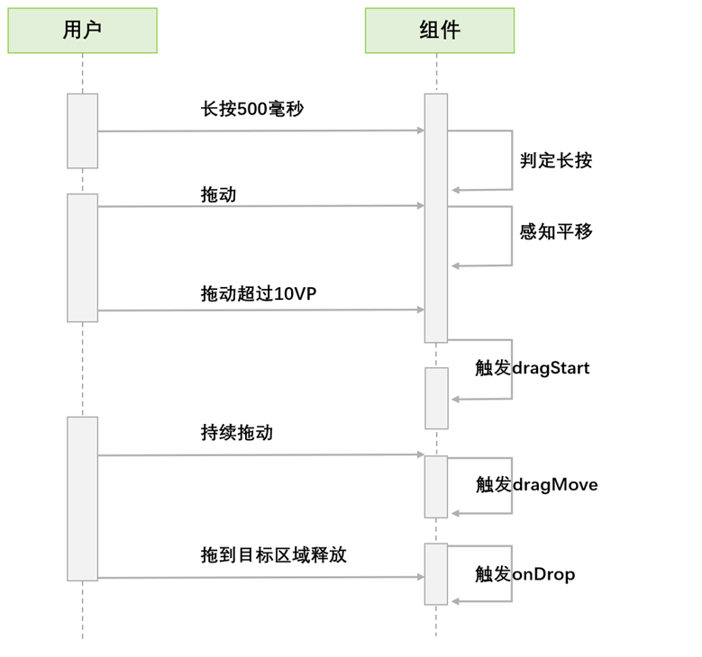
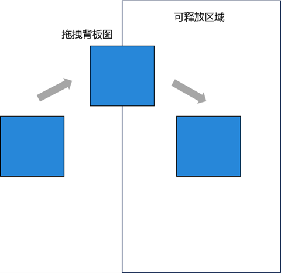
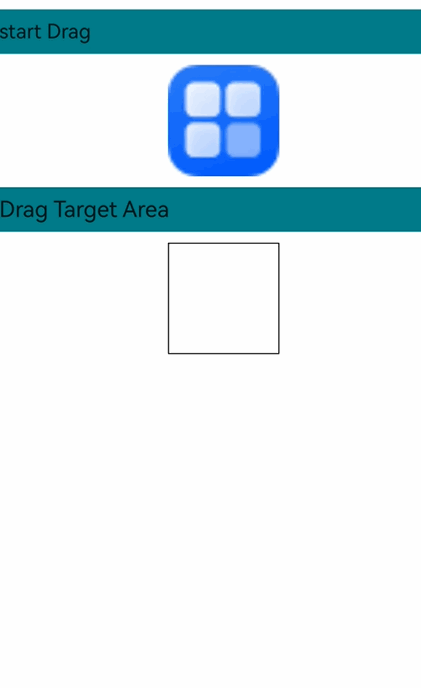
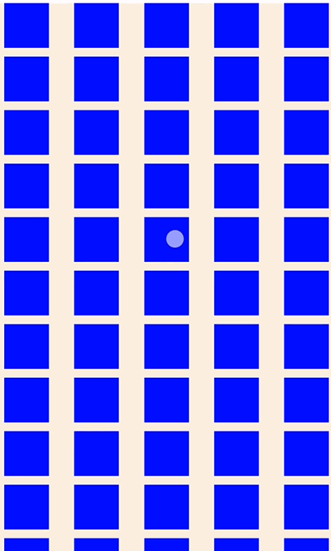
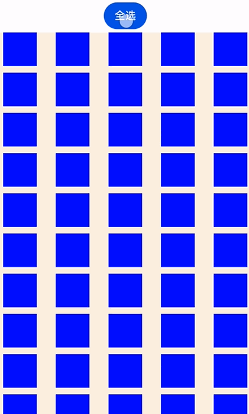

# 拖拽事件

拖拽事件提供了一种通过鼠标或手势触屏传递数据的机制，即从一个组件位置拖出（drag）数据并将其拖入（drop）到另一个组件位置，以触发响应。在这一过程中，拖出方提供数据，而拖入方负责接收和处理数据。这一操作使用户能够便捷地移动、复制或删除指定内容。

## 基本概念

* 拖拽操作：在可响应拖出的组件上长按并滑动以触发拖拽行为，当用户释放手指或鼠标时，拖拽操作即告结束。
* 拖拽背景（背板）：用户拖动数据时的形象化表示。开发者可以通过[onDragStart](../reference/apis-arkui/arkui-ts/ts-universal-events-drag-drop.md#ondragstart)的[CustomerBuilder](../reference/apis-arkui/arkui-ts/ts-types.md#custombuilder8)或[DragItemInfo](../reference/apis-arkui/arkui-ts/ts-universal-events-drag-drop.md#dragiteminfo说明)进行设置，也可以通过[dragPreview](../reference/apis-arkui/arkui-ts/ts-universal-attributes-drag-drop.md#dragpreview11)通用属性进行自定义。
* 拖拽内容：被拖动的数据，使用UDMF统一API [UnifiedData](../reference/apis-arkdata/js-apis-data-unifiedDataChannel.md#unifieddata) 进行封装，确保数据的一致性和安全性。
* 拖出对象：触发拖拽操作并提供数据的组件，通常具有响应拖拽的特性。
* 拖入目标：可接收并处理拖动数据的组件，能够根据拖入的数据执行相应的操作。
* 拖拽点：鼠标或手指与屏幕的接触位置，用于判断是否进入组件范围。判定依据是接触点是否位于组件的范围内。

## 拖拽流程

拖拽流程包含手势拖拽流程和鼠标拖拽流程，有助于开发者理解回调事件触发的时机。

### ​手势拖拽流程

对于手势长按触发拖拽的场景，ArkUI在发起拖拽前会校验当前组件是否具备拖拽功能。对于默认可拖出的组件（[Search](../reference/apis-arkui/arkui-ts/ts-basic-components-search.md)、[TextInput](../reference/apis-arkui/arkui-ts/ts-basic-components-textinput.md)、[TextArea](../reference/apis-arkui/arkui-ts/ts-basic-components-textarea.md)、[RichEditor](../reference/apis-arkui/arkui-ts/ts-basic-components-richeditor.md)、[Text](../reference/apis-arkui/arkui-ts/ts-basic-components-text.md)、[Image](../reference/apis-arkui/arkui-ts/ts-basic-components-image.md)、<!--Del-->[FormComponent](../reference/apis-arkui/arkui-ts/ts-basic-components-formcomponent-sys.md)、<!--DelEnd-->[Hyperlink](../reference/apis-arkui/arkui-ts/ts-container-hyperlink.md)）需要判断是否设置了[draggable](../reference/apis-arkui/arkui-ts/ts-universal-attributes-drag-drop.md#draggable)，需检查是否已设置draggable属性为true（若系统使能分层参数，draggable属性默认为true）。其他组件则需额外确认是否已设置onDragStart回调函数。在满足上述条件后，长按时间达到或超过500ms即可触发拖拽，而长按800ms时，系统开始执行预览图的浮起动效。若与Menu功能结合使用，并通过isShow控制其显示与隐藏，建议避免在用户操作800ms后才控制菜单显示，此举可能引发非预期的行为。

手势拖拽（手指/手写笔）触发拖拽流程：



### ​鼠标拖拽流程

鼠标拖拽操作遵循即拖即走的模式，当鼠标左键在可拖拽的组件上按下并移动超过1vp时，即可触发拖拽功能。

当前不仅支持应用内部的拖拽，还支持跨应用的拖拽操作。为了帮助开发者更好地感知拖拽状态并调整系统默认的拖拽行为，ArkUI提供了多个回调事件，具体详情如下：

| **回调事件** | **说明**|
| ---------------- | ------------------------|
| [onDragStart](../reference/apis-arkui/arkui-ts/ts-universal-events-drag-drop.md#ondragstart) | 拖出的组件产生拖出动作时，该回调触发。<br>该回调可以感知拖拽行为的发起，开发者可以在onDragStart方法中设置拖拽过程中传递的数据，并自定义拖拽的背板图像。建议开发者采用pixelmap的方式来返回背板图像，避免使用customBuilder，因为后者可能会带来额外的性能开销。|
| [onDragEnter](../reference/apis-arkui/arkui-ts/ts-universal-events-drag-drop.md#ondragenter) | 当拖拽操作的拖拽点进入组件的范围时，如果该组件监听了[onDrop](../reference/apis-arkui/arkui-ts/ts-universal-events-drag-drop.md#ondrop)事件，此回调将会被触发。|
| [onDragMove](../reference/apis-arkui/arkui-ts/ts-universal-events-drag-drop.md#ondragmove) | 当拖拽点在组件范围内移动时，如果该组件监听了onDrop事件，此回调将会被触发。<br>在这一过程中，可以通过调用[DragEvent](../reference/apis-arkui/arkui-ts/ts-universal-events-drag-drop.md#dragevent)中的setResult方法来影响系统在部分场景下的外观表现：<br>1. 设置DragResult.DROP\_ENABLED。<br>2. 设置DragResult.DROP\_DISABLED。|
| [onDragLeave](../reference/apis-arkui/arkui-ts/ts-universal-events-drag-drop.md#ondragleave) | 当拖拽点移出组件范围时，如果该组件监听了onDrop事件，此回调将会被触发。<br>在以下两种情况下，系统默认不会触发onDragLeave事件：<br>1. 父组件移动到子组件。<br>2. 目标组件与当前组件布局有重叠。<br>API version 12开始可通过[UIContext](../reference/apis-arkui/js-apis-arkui-UIContext.md)中的[setDragEventStrictReportingEnabled](../reference/apis-arkui/js-apis-arkui-UIContext.md#setdrageventstrictreportingenabled12)方法严格触发onDragLeave事件。|
| [onDrop](../reference/apis-arkui/arkui-ts/ts-universal-events-drag-drop.md#ondrop) | 当用户在组件范围内释放拖拽操作时，此回调会被触发。开发者需在此回调中通过DragEvent的setResult方法来设置拖拽结果，否则在拖出方组件的onDragEnd方法中，通过getResult方法获取的将只是默认的处理结果DragResult.DRAG\_FAILED。<br>此回调是开发者干预系统默认拖入处理行为的关键点，系统会优先执行开发者定义的onDrop回调。通过在onDrop回调中调用setResult方法，开发者可以告知系统如何处理被拖拽的数据。<br>1. 设置 DragResult.DRAG\_SUCCESSFUL，数据完全由开发者自己处理，系统不进行处理。<br>2. 设置DragResult.DRAG\_FAILED，数据不再由系统继续处理。<br>3. 设置DragResult.DRAG\_CANCELED，系统也不需要进行数据处理。<br>4. 设置DragResult.DROP\_ENABLED或DragResult.DROP\_DISABLED会被忽略，等同于设置DragResult.DRAG\_FAILED。|
| [onDragEnd](../reference/apis-arkui/arkui-ts/ts-universal-events-drag-drop.md#ondragend) | 当用户释放拖拽时，拖拽活动终止，发起拖出动作的组件将触发该回调函数。|
| [onPreDrag](../reference/apis-arkui/arkui-ts/ts-universal-events-drag-drop.md#onpredrag12) | 当触发拖拽事件的不同阶段时，绑定此事件的组件会触发该回调函数。<br>开发者可利用此方法，在拖拽开始前的不同阶段，根据[PreDragStatus](../reference/apis-arkui/arkui-ts/ts-universal-events-drag-drop.md#predragstatus12枚举说明)枚举准备相应数据。<br>1. ACTION\_DETECTING\_STATUS：拖拽手势启动阶段。按下50ms时触发。<br>2. READY\_TO\_TRIGGER\_DRAG\_ACTION：拖拽准备完成，可发起拖拽阶段。按下500ms时触发。<br>3. PREVIEW\_LIFT\_STARTED：拖拽浮起动效发起阶段。按下800ms时触发。<br>4. PREVIEW\_LIFT\_FINISHED：拖拽浮起动效结束阶段。浮起动效完全结束时触发。<br>5. PREVIEW\_LANDING\_STARTED：拖拽落回动效发起阶段。落回动效发起时触发。<br>6. PREVIEW\_LANDING\_FINISHED：拖拽落回动效结束阶段。落回动效结束时触发。<br>7. ACTION\_CANCELED\_BEFORE\_DRAG：拖拽浮起落位动效中断。已满足READY_TO_TRIGGER_DRAG_ACTION状态后，未达到动效阶段，手指抬起时触发。|

[DragEvent](../reference/apis-arkui/arkui-ts/ts-universal-events-drag-drop.md#dragevent)支持的get方法可用于获取拖拽行为的详细信息，下表展示了在相应的拖拽回调中，这些get方法是否能够返回有效数据。
| 回调事件 | onDragStart | onDragEnter | onDragMove | onDragLeave | onDrop | onDragEnd |
| - | - | - | - | - | - | - |
| getData         |—|—|—|—| 支持 |—|
| getSummary      |—| 支持 | 支持 | 支持 | 支持 |—|
| getResult       |—|—|—|—|—| 支持 |
| getPreviewRect  |—|—|—|—| 支持 |—|
| getVelocity/X/Y |—| 支持 | 支持 | 支持 | 支持 |—|
| getWindowX/Y    | 支持 | 支持 | 支持 | 支持 | 支持 |—|
| getDisplayX/Y   | 支持 | 支持 | 支持 | 支持 | 支持 |—|
| getX/Y          | 支持 | 支持 | 支持 | 支持 | 支持 |—|
| behavior        |—|—|—|—|—| 支持 |

[DragEvent](../reference/apis-arkui/arkui-ts/ts-universal-events-drag-drop.md#dragevent)支持相关set方法向系统传递信息，这些信息部分会影响系统对UI或数据的处理方式。下表列出了set方法应该在回调的哪个阶段执行才会被系统接受并处理。
| 回调事件 | onDragStart | onDragEnter | onDragMove | onDragLeave | onDrop |
| - | - | - | - | - | - |
| useCustomDropAnimation |—|—|—|—| 支持 |
| setData                | 支持 |—|—|—|—|
| setResult              | 支持，可通过set failed或cancel来阻止拖拽发起 | 支持，不作为最终结果传递给onDragEnd | 支持，不作为最终结果传递给onDragEnd | 支持，不作为最终结果传递给onDragEnd  | 支持，作为最终结果传递给onDragEnd |
| behavior               |—| 支持 | 支持 | 支持 | 支持 |

## 拖拽背板图

在拖拽移动过程中显示的背板图并非组件本身，而是表示用户拖动的数据，开发者可将其设定为任意可显示的图像。具体而言，onDragStart回调中返回的customBuilder或pixelmap可以用于设置拖拽移动过程中的背板图，而浮起图则默认采用组件本身的截图。dragpreview属性中设定的customBuilder或pixelmap可以用于配置浮起和拖拽过程的背板图。若开发者未配置背板图，系统将自动采用组件本身的截图作为拖拽和浮起时的背板图。

拖拽背板图当前支持设置透明度、圆角、阴影和模糊，具体用法见[拖拽控制](../reference/apis-arkui/arkui-ts/ts-universal-attributes-drag-drop.md)。



**约束限制：**

* 对于容器组件，如果内部内容通过position、offset等接口使得绘制区域超出了容器组件范围，则系统截图无法截取到范围之外的内容。此种情况下，如果一定要浮起，即拖拽背板能够包含范围之外的内容，则可考虑通过扩大容器范围或自定义方式实现。
* 不论是使用自定义builder或是系统默认截图方式，截图都暂时无法应用[scale](../reference/apis-arkui/arkui-ts/ts-universal-attributes-transformation.md#scale)、[rotate](../reference/apis-arkui/arkui-ts/ts-universal-attributes-transformation.md#rotate)等图形变换效果。

## 使用拖拽能力

### 通用拖拽适配

如下以[Image](../reference/apis-arkui/arkui-ts/ts-basic-components-image.md)组件为例，介绍组件拖拽开发的基本步骤，以及开发中需要注意的事项。

1. 组件使能拖拽。

   设置draggable属性为true，并配置onDragStart回调函数。在回调函数中，可通过UDMF（用户数据管理框架）设置拖拽的数据，并返回自定义的拖拽背景图像。

    ```ts
    import { unifiedDataChannel, uniformTypeDescriptor } from '@kit.ArkData';

    Image($r('app.media.app_icon'))
        .width(100)
        .height(100)
        .draggable(true)
        .onDragStart((event) => {
            let data: unifiedDataChannel.Image = new unifiedDataChannel.Image();
            data.imageUri = 'common/pic/img.png';
            let unifiedData = new unifiedDataChannel.UnifiedData(data);
            event.setData(unifiedData);

            let dragItemInfo: DragItemInfo = {
            pixelMap: this.pixmap,
            extraInfo: "this is extraInfo",
            };
            // onDragStart回调函数中返回自定义拖拽背板图
            return dragItemInfo;
        })
    ```

   手势场景触发的拖拽功能依赖于底层绑定的长按手势。如果开发者在可拖拽组件上也绑定了长按手势，这将与底层的长按手势产生冲突，进而导致拖拽操作失败。为解决此类问题，可以采用并行手势的方案，具体如下。

    ```ts
    .parallelGesture(LongPressGesture().onAction(() => {
       this.getUIContext().getPromptAction().showToast({ duration: 100, message: 'Long press gesture trigger' });
    }))
    ```

2. 自定义拖拽背板图。
   
   可以通过在长按50ms时触发的回调中设置[onPreDrag](../reference/apis-arkui/arkui-ts/ts-universal-events-drag-drop.md#onpredrag12)回调函数，来提前准备自定义拖拽背板图的pixmap。
   
    ```ts
    .onPreDrag((status: PreDragStatus) => {
        if (preDragStatus == PreDragStatus.ACTION_DETECTING_STATUS) {
            this.getComponentSnapshot();
        }
    })
    ```
   
   pixmap的生成可以调用[componentSnapshot.createFromBuilder](../reference/apis-arkui/js-apis-arkui-componentSnapshot.md#componentsnapshotcreatefrombuilder)函数来实现。

      ```ts
      @Builder
      pixelMapBuilder() {
          Column() {
            Image($r('app.media.startIcon'))
              .width(120)
              .height(120)
              .backgroundColor(Color.Yellow)
          }
        }
        private getComponentSnapshot(): void {
        this.getUIContext().getComponentSnapshot().createFromBuilder(()=>{this.pixelMapBuilder()},
        (error: Error, pixmap: image.PixelMap) => {
            if(error){
              console.log("error: " + JSON.stringify(error))
              return;
            }
            this.pixmap = pixmap;
        })
      }
      ```

3. 若开发者需确保触发[onDragLeave](../reference/apis-arkui/arkui-ts/ts-universal-events-drag-drop.md#ondragleave)事件，应通过调用[setDragEventStrictReportingEnabled](../reference/apis-arkui/js-apis-arkui-UIContext.md#setdrageventstrictreportingenabled12)方法进行设置。

    ```ts
    import { UIAbility } from '@kit.AbilityKit';
    import { window, UIContext } from '@kit.ArkUI';

    export default class EntryAbility extends UIAbility {
      onWindowStageCreate(windowStage: window.WindowStage): void {
        windowStage.loadContent('pages/Index', (err, data) => {
          if (err.code) {
            return;
          }
          windowStage.getMainWindow((err, data) => {
            if (err.code) {
              return;
            }
            let windowClass: window.Window = data;
            let uiContext: UIContext = windowClass.getUIContext();
            uiContext.getDragController().setDragEventStrictReportingEnabled(true);
          });
        });
      }
    }
    ```

4. 拖拽过程显示角标样式。

   通过设置[allowDrop](../reference/apis-arkui/arkui-ts/ts-universal-attributes-drag-drop.md#allowdrop)来定义接收的数据类型，这将影响角标显示。当拖拽的数据符合定义的允许落入的数据类型时，显示“COPY”角标。当拖拽的数据类型不在允许范围内时，显示“FORBIDDEN”角标。若未设置allowDrop，则显示“MOVE”角标。以下代码示例表示仅接收UnifiedData中定义的HYPERLINK和PLAIN\_TEXT类型数据，其他类型数据将被禁止落入。

    ```ts
    .allowDrop([uniformTypeDescriptor.UniformDataType.HYPERLINK, uniformTypeDescriptor.UniformDataType.PLAIN_TEXT])
    ```

   在实现onDrop回调的情况下，还可以通过在onDragMove中设置[DragResult](../reference/apis-arkui/arkui-ts/ts-universal-events-drag-drop.md#dragresult10枚举说明)为DROP_ENABLED，并将[DragBehavior](../reference/apis-arkui/arkui-ts/ts-universal-events-drag-drop.md#dragbehavior10)设置为COPY或MOVE，以此来控制角标显示。如下代码将移动时的角标强制设置为“MOVE”。

    ```ts
    .onDragMove((event) => {
        event.setResult(DragResult.DROP_ENABLED);
        event.dragBehavior = DragBehavior.MOVE;
    })
    ```

5. 拖拽数据的接收。

   需要设置onDrop回调函数，并在回调函数中处理拖拽数据，显示设置拖拽结果。

    ```ts
    .onDrop((dragEvent?: DragEvent) => {
        // 获取拖拽数据
        this.getDataFromUdmf((dragEvent as DragEvent), (event: DragEvent) => {
        let records: Array<unifiedDataChannel.UnifiedRecord> = event.getData().getRecords();
        let rect: Rectangle = event.getPreviewRect();
        this.imageWidth = Number(rect.width);
        this.imageHeight = Number(rect.height);
        this.targetImage = (records[0] as unifiedDataChannel.Image).imageUri;
        this.imgState = Visibility.None；
        // 显式设置result为successful，则将该值传递给拖出方的onDragEnd
        event.setResult(DragResult.DRAG_SUCCESSFUL);
    })
    ```

   数据的传递是通过UDMF实现的，在数据较大时可能存在时延，因此在首次获取数据失败时建议加1500ms的延迟重试机制。

    ```ts
    getDataFromUdmfRetry(event: DragEvent, callback: (data: DragEvent) => void) {
       try {
         let data: UnifiedData = event.getData();
         if (!data) {
           return false;
         }
         let records: Array<unifiedDataChannel.UnifiedRecord> = data.getRecords();
         if (!records || records.length <= 0) {
           return false;
         }
         callback(event);
         return true;
       } catch (e) {
         console.log("getData failed, code: " + (e as BusinessError).code + ", message: " + (e as BusinessError).message);
         return false;
       }
    }

    getDataFromUdmf(event: DragEvent, callback: (data: DragEvent) => void) {
      if (this.getDataFromUdmfRetry(event, callback)) {
        return;
      }
      setTimeout(() => {
        this.getDataFromUdmfRetry(event, callback);
      }, 1500);
    }
    ```

6. 拖拽发起方可以通过设置onDragEnd回调感知拖拽结果。

    ```ts
    import { promptAction } from '@kit.ArkUI';

    .onDragEnd((event) => {
        // onDragEnd里取到的result值在接收方onDrop设置
      if (event.getResult() === DragResult.DRAG_SUCCESSFUL) {
        this.getUIContext().getPromptAction().showToast({ duration: 100, message: 'Drag Success' });
      } else if (event.getResult() === DragResult.DRAG_FAILED) {
        this.getUIContext().getPromptAction().showToast({ duration: 100, message: 'Drag failed' });
      }
    })
    ```

**完整示例：**

```ts
import { unifiedDataChannel, uniformTypeDescriptor } from '@kit.ArkData';
import { promptAction } from '@kit.ArkUI';
import { BusinessError } from '@kit.BasicServicesKit';
import { image } from '@kit.ImageKit';

@Entry
@Component
struct Index {
  @State targetImage: string = '';
  @State imageWidth: number = 100;
  @State imageHeight: number = 100;
  @State imgState: Visibility = Visibility.Visible;
  @State pixmap: image.PixelMap|undefined = undefined

  @Builder
  pixelMapBuilder() {
    Column() {
      Image($r('app.media.startIcon'))
        .width(120)
        .height(120)
        .backgroundColor(Color.Yellow)
    }
  }

  getDataFromUdmfRetry(event: DragEvent, callback: (data: DragEvent) => void) {
    try {
      let data: UnifiedData = event.getData();
      if (!data) {
        return false;
      }
      let records: Array<unifiedDataChannel.UnifiedRecord> = data.getRecords();
      if (!records || records.length <= 0) {
        return false;
      }
      callback(event);
      return true;
    } catch (e) {
      console.log("getData failed, code: " + (e as BusinessError).code + ", message: " + (e as BusinessError).message);
      return false;
    }
  }
  // 获取UDMF数据，首次获取失败后添加1500ms延迟重试机制
  getDataFromUdmf(event: DragEvent, callback: (data: DragEvent) => void) {
    if (this.getDataFromUdmfRetry(event, callback)) {
      return;
    }
    setTimeout(() => {
      this.getDataFromUdmfRetry(event, callback);
    }, 1500);
  }
  // 调用componentSnapshot中的createFromBuilder接口截取自定义builder的截图
  private getComponentSnapshot(): void {
    this.getUIContext().getComponentSnapshot().createFromBuilder(()=>{this.pixelMapBuilder()},
      (error: Error, pixmap: image.PixelMap) => {
        if(error){
          console.log("error: " + JSON.stringify(error))
          return;
        }
        this.pixmap = pixmap;
      })
  }
  // 长按50ms时提前准备自定义截图的pixmap
  private PreDragChange(preDragStatus: PreDragStatus): void {
    if (preDragStatus == PreDragStatus.ACTION_DETECTING_STATUS) {
      this.getComponentSnapshot();
    }
  }

  build() {
    Row() {
      Column() {
        Text('start Drag')
          .fontSize(18)
          .width('100%')
          .height(40)
          .margin(10)
          .backgroundColor('#008888')
        Row() {
          Image($r('app.media.app_icon'))
            .width(100)
            .height(100)
            .draggable(true)
            .margin({ left: 15 })
            .visibility(this.imgState)
            // 绑定平行手势，可同时触发应用自定义长按手势
            .parallelGesture(LongPressGesture().onAction(() => {
              this.getUIContext().getPromptAction().showToast({ duration: 100, message: 'Long press gesture trigger' });
            }))
            .onDragStart((event) => {
              let data: unifiedDataChannel.Image = new unifiedDataChannel.Image();
              data.imageUri = 'common/pic/img.png';
              let unifiedData = new unifiedDataChannel.UnifiedData(data);
              event.setData(unifiedData);

              let dragItemInfo: DragItemInfo = {
                pixelMap: this.pixmap,
                extraInfo: "this is extraInfo",
              };
              return dragItemInfo;
            })
              // 提前准备拖拽自定义背板图
            .onPreDrag((status: PreDragStatus) => {
              this.PreDragChange(status);
            })
            .onDragEnd((event) => {
              // onDragEnd里取到的result值在接收方onDrop设置
              if (event.getResult() === DragResult.DRAG_SUCCESSFUL) {
                this.getUIContext().getPromptAction().showToast({ duration: 100, message: 'Drag Success' });
              } else if (event.getResult() === DragResult.DRAG_FAILED) {
                this.getUIContext().getPromptAction().showToast({ duration: 100, message: 'Drag failed' });
              }
            })
        }

        Text('Drag Target Area')
          .fontSize(20)
          .width('100%')
          .height(40)
          .margin(10)
          .backgroundColor('#008888')
        Row() {
          Image(this.targetImage)
            .width(this.imageWidth)
            .height(this.imageHeight)
            .draggable(true)
            .margin({ left: 15 })
            .border({ color: Color.Black, width: 1 })
            // 控制角标显示类型为MOVE，即不显示角标
            .onDragMove((event) => {
              event.setResult(DragResult.DROP_ENABLED)
              event.dragBehavior = DragBehavior.MOVE
            })
            .allowDrop([uniformTypeDescriptor.UniformDataType.IMAGE])
            .onDrop((dragEvent?: DragEvent) => {
              // 获取拖拽数据
              this.getDataFromUdmf((dragEvent as DragEvent), (event: DragEvent) => {
                let records: Array<unifiedDataChannel.UnifiedRecord> = event.getData().getRecords();
                let rect: Rectangle = event.getPreviewRect();
                this.imageWidth = Number(rect.width);
                this.imageHeight = Number(rect.height);
                this.targetImage = (records[0] as unifiedDataChannel.Image).imageUri;
                this.imgState = Visibility.None;
                // 显式设置result为successful，则将该值传递给拖出方的onDragEnd
                event.setResult(DragResult.DRAG_SUCCESSFUL);
              })
            })
        }
      }
      .width('100%')
      .height('100%')
    }
    .height('100%')
  }
}

```


### 多选拖拽适配

从API version 12开始，[Grid](../reference/apis-arkui/arkui-ts/ts-container-grid.md)组件和[List](../reference/apis-arkui/arkui-ts/ts-container-list.md)组件中的GridItem和ListItem组件支持多选与拖拽功能。目前，仅支持onDragStart的触发方式。

以下以Grid为例，详细介绍实现多选拖拽的基本步骤，以及在开发过程中需要注意的事项。

1. 组件多选拖拽使能。

   创建GridItem子组件并绑定onDragStart回调函数。同时设置GridItem组件的状态为可选中。

    ```ts
    Grid() {
      ForEach(this.numbers, (idx: number) => {
        GridItem() {
          Column()
            .backgroundColor(Color.Blue)
            .width(50)
            .height(50)
            .opacity(1.0)
            .id('grid'+idx)
        }
        .onDragStart(()=>{})
        .selectable(true)
      }, (idx: string) => idx)
    }
    ```

   多选拖拽功能默认处于关闭状态。若要启用此功能，需在[dragPreviewOptions](../reference/apis-arkui/arkui-ts/ts-universal-attributes-drag-drop.md#dragpreviewoptions11)接口的DragInteractionOptions参数中，将isMultiSelectionEnabled设置为true，以表明当前组件支持多选。此外，DragInteractionOptions还包含defaultAnimationBeforeLifting参数，用于控制组件浮起前的默认效果。将该参数设置为true，组件在浮起前将展示一个默认的缩小动画效果。

    ```ts
    .dragPreviewOptions({isMultiSelectionEnabled:true,defaultAnimationBeforeLifting:true})
    ```

   为了确保选中状态，应将GridItem子组件的selected属性设置为true。例如，可以通过调用[onClick](../reference/apis-arkui/arkui-ts/ts-universal-events-click.md#onclick)来设置特定组件为选中状态。

    ```ts
    .selected(this.isSelectedGrid[idx])
    .onClick(()=>{
        this.isSelectedGrid[idx] = !this.isSelectedGrid[idx]
    })
    ```

2. 优化多选拖拽性能。

   在多选拖拽操作中，当多选触发聚拢动画效果时，系统会截取当前屏幕内显示的选中组件图像。如果选中组件数量过多，可能会造成较高的性能消耗。为了优化性能，多选拖拽功能支持从dragPreview中获取截图，用以实现聚拢动画效果，从而有效节省系统资源。

    ```ts
    .dragPreview({
        pixelMap:this.pixmap
    })
    ```

   截图的获取可以在选中组件时通过调用componentSnapshot中的[get](../reference/apis-arkui/js-apis-arkui-componentSnapshot.md#componentsnapshotget-1)方法获取。以下示例通过获取组件对应id的方法进行截图。

    ```ts
    @State previewData: DragItemInfo[] = []
    @State isSelectedGrid: boolean[] = []
    .onClick(()=>{
        this.isSelectedGrid[idx] = !this.isSelectedGrid[idx]
        if (this.isSelectedGrid[idx]) {
            let gridItemName = 'grid' + idx
            this.getUIContext().getComponentSnapshot().get(gridItemName, (error: Error, pixmap: image.PixelMap)=>{
                this.pixmap = pixmap
                this.previewData[idx] = {
                    pixelMap:this.pixmap
                }
            })
        }
    })
    ```

3. 多选显示效果。

    通过[stateStyles](../reference/apis-arkui/arkui-ts/ts-universal-attributes-polymorphic-style.md#statestyles)可以设置选中态和非选中态的显示效果，方便区分。

    ```ts
    @Styles
    normalStyles(): void{
      .opacity(1.0)
    }

    @Styles
    selectStyles(): void{
      .opacity(0.4)
    }

    .stateStyles({
      normal : this.normalStyles,
      selected: this.selectStyles
    })
    ```

4. 适配数量角标。

    多选拖拽的数量角标当前需要应用使用dragPreviewOptions中的numberBadge参数设置，开发者需要根据当前选中的节点数量来设置数量角标。

    ```ts
    @State numberBadge: number = 0;

    .onClick(()=>{
        this.isSelectedGrid[idx] = !this.isSelectedGrid[idx]
        if (this.isSelectedGrid[idx]) {
          this.numberBadge++;
        } else {
          this.numberBadge--;
      }
    })
    // 多选场景右上角数量角标需要应用设置numberBadge参数
    .dragPreviewOptions({numberBadge: this.numberBadge})
    ```

**完整示例：**

```ts
import { image } from '@kit.ImageKit';

@Entry
@Component
struct GridEts {
  @State pixmap: image.PixelMap|undefined = undefined
  @State numbers: number[] = []
  @State isSelectedGrid: boolean[] = []
  @State previewData: DragItemInfo[] = []
  @State numberBadge: number = 0;

  @Styles
  normalStyles(): void{
    .opacity(1.0)
  }

  @Styles
  selectStyles(): void{
    .opacity(0.4)
  }

  onPageShow(): void {
    let i: number = 0
    for(i=0;i<100;i++){
      this.numbers.push(i)
      this.isSelectedGrid.push(false)
      this.previewData.push({})
    }
  }

  @Builder
  RandomBuilder(idx: number) {
    Column()
      .backgroundColor(Color.Blue)
      .width(50)
      .height(50)
      .opacity(1.0)
  }

  build() {
    Column({ space: 5 }) {
      Grid() {
        ForEach(this.numbers, (idx: number) => {
          GridItem() {
            Column()
              .backgroundColor(Color.Blue)
              .width(50)
              .height(50)
              .opacity(1.0)
              .id('grid'+idx)
          }
          .dragPreview(this.previewData[idx])
          .selectable(true)
          .selected(this.isSelectedGrid[idx])
          // 设置多选显示效果
          .stateStyles({
            normal : this.normalStyles,
            selected: this.selectStyles
          })
          .onClick(()=>{
            this.isSelectedGrid[idx] = !this.isSelectedGrid[idx]
            if (this.isSelectedGrid[idx]) {
              this.numberBadge++;
              let gridItemName = 'grid' + idx
              // 选中状态下提前调用componentSnapshot中的get接口获取pixmap
              this.getUIContext().getComponentSnapshot().get(gridItemName, (error: Error, pixmap: image.PixelMap)=>{
                this.pixmap = pixmap
                this.previewData[idx] = {
                  pixelMap:this.pixmap
                }
              })
            } else {
              this.numberBadge--;
            }
          })
          // 使能多选拖拽，右上角数量角标需要应用设置numberBadge参数
          .dragPreviewOptions({numberBadge: this.numberBadge},{isMultiSelectionEnabled:true,defaultAnimationBeforeLifting:true})
          .onDragStart(()=>{
          })
        }, (idx: string) => idx)
      }
      .columnsTemplate('1fr 1fr 1fr 1fr 1fr')
      .columnsGap(5)
      .rowsGap(10)
      .backgroundColor(0xFAEEE0)
    }.width('100%').margin({ top: 5 })
  }
}
```


### 适配自定义落位动效

当开发者需要实现自定义落位动效时，可以禁用系统的默认动效。从API version 18开始，ArkUI提供了[executeDropAnimation](../reference/apis-arkui/arkui-ts/ts-universal-events-drag-drop.md#executedropanimation18)接口，用于自定义落位动效。以下以Image组件为例，详细介绍使用[executeDropAnimation](../reference/apis-arkui/arkui-ts/ts-universal-events-drag-drop.md#executedropanimation18)接口的基本步骤，以及开发过程中需要注意的事项。

1. 组件拖拽设置。
   设置draggable为true，并配置onDragStart，onDragEnd等回调函数。
    ```ts
    Image($r('app.media.app_icon'))
      .width(100)
      .height(100)
      .draggable(true)
      .margin({ left: 15 ,top: 40})
      .visibility(this.imgState)
      .onDragStart((event) => {})
      .onDragEnd((event) => {})
    ```
2. 设置自定义动效。

   自定义落位动效通过[animateTo](../reference/apis-arkui/js-apis-arkui-UIContext.md#animateto)接口设置动画相关的参数来实现。例如，可以改变组件的大小。

    ```ts
      customDropAnimation = () => {
        this.getUIContext().animateTo({ duration: 1000, curve: Curve.EaseOut, playMode: PlayMode.Normal }, () => {
          this.imageWidth = 200;
          this.imageHeight = 200;
          this.imgState = Visibility.None;
        })
      }
    ```

3. 拖拽落位适配动效。

   设置onDrop回调函数，接收拖拽数据。拖拽落位动效通过[executeDropAnimation](../reference/apis-arkui/arkui-ts/ts-universal-events-drag-drop.md#executedropanimation18)函数执行，设置[useCustomDropAnimation](../reference/apis-arkui/arkui-ts/ts-universal-events-drag-drop.md#dragevent7)为true禁用系统默认动效。

    ```ts
      Column() {
        Image(this.targetImage)
          .width(this.imageWidth)
          .height(this.imageHeight)
      }
      .draggable(true)
      .margin({ left: 15 })
      .border({ color: Color.Black, width: 1 })
      .allowDrop([udmfType.UniformDataType.IMAGE])
      .onDrop((dragEvent: DragEvent) => {
        let records: Array<unifiedDataChannel.UnifiedRecord> = dragEvent.getData().getRecords();
        let rect: Rectangle = dragEvent.getPreviewRect();
        this.imageWidth = Number(rect.width);
        this.imageHeight = Number(rect.height);
        this.targetImage = (records[0] as udmf.Image).imageUri;
        dragEvent.useCustomDropAnimation = true;
        dragEvent.executeDropAnimation(this.customDropAnimation)
      })
    ```

**完整示例：**

```ts
import { unifiedDataChannel, uniformTypeDescriptor } from '@kit.ArkData';
import { promptAction } from '@kit.ArkUI';


@Entry
@Component
struct DropAnimationExample {
  @State targetImage: string = '';
  @State imageWidth: number = 100;
  @State imageHeight: number = 100;
  @State imgState: Visibility = Visibility.Visible;

  customDropAnimation =
    () => {
      this.getUIContext().animateTo({ duration: 1000, curve: Curve.EaseOut, playMode: PlayMode.Normal }, () => {
        this.imageWidth = 200;
        this.imageHeight = 200;
        this.imgState = Visibility.None;
      })
    }

  build() {
    Row() {
      Column() {
        Image($r('app.media.app_icon'))
          .width(100)
          .height(100)
          .draggable(true)
          .margin({ left: 15 ,top: 40})
          .visibility(this.imgState)
          .onDragStart((event) => {
          })
          .onDragEnd((event) => {
            if (event.getResult() === DragResult.DRAG_SUCCESSFUL) {
              console.log('Drag Success');
            } else if (event.getResult() === DragResult.DRAG_FAILED) {
              console.log('Drag failed');
            }
          })
      }.width('45%')
      .height('100%')
      Column() {
        Text('Drag Target Area')
          .fontSize(20)
          .width(180)
          .height(40)
          .textAlign(TextAlign.Center)
          .margin(10)
          .backgroundColor('rgb(240,250,255)')
        Column() {
          Image(this.targetImage)
            .width(this.imageWidth)
            .height(this.imageHeight)
        }
        .draggable(true)
        .margin({ left: 15 })
        .border({ color: Color.Black, width: 1 })
        .allowDrop([uniformTypeDescriptor.UniformDataType.IMAGE])
        .onDrop((dragEvent: DragEvent) => {
          let records: Array<unifiedDataChannel.UnifiedRecord> = dragEvent.getData().getRecords();
          let rect: Rectangle = dragEvent.getPreviewRect();
          this.imageWidth = Number(rect.width);
          this.imageHeight = Number(rect.height);
          this.targetImage = (records[0] as unifiedDataChannel.Image).imageUri;
          dragEvent.useCustomDropAnimation = true;
          dragEvent.executeDropAnimation(this.customDropAnimation)
        })
        .width(this.imageWidth)
        .height(this.imageHeight)
      }.width('45%')
      .height('100%')
      .margin({ left: '5%' })
    }
    .height('100%')
  }
}
```


### 处理大批量数据

当多选拖拽的数量较多或者拖拽数据量较大时，在拖拽过程中统一处理数据可能会影响拖拽功能的体验。以下以Grid组件为例，详细介绍在大批量数据拖拽过程中数据的推荐处理方式，以及在开发中需要注意的事项。

1. 组件多选拖拽设置。

   创建GridItem子组件，并设置其状态为可选中。再设置多选拖拽功能isMultiSelectionEnabled为true，最后设置选中状态用作区分是否选中。

    ```ts
    Grid() {
      ForEach(this.numbers, (idx: number) => {
        GridItem() {
          Column()
            .backgroundColor(Color.Blue)
            .width(50)
            .height(50)
            .opacity(1.0)
            .id('grid'+idx)
        }
        .dragPreview(this.previewData[idx])
        .dragPreviewOptions({numberBadge: this.numberBadge},{isMultiSelectionEnabled:true,defaultAnimationBeforeLifting:true})
        .selectable(true)
        .selected(this.isSelectedGrid[idx])
        .stateStyles({
          normal : this.normalStyles,
          selected: this.selectStyles
        })
        .onClick(() => {
          this.isSelectedGrid[idx] = !this.isSelectedGrid[idx];
        })
      }, (idx: string) => idx)
    }
    ```

   多选拖拽的数据数量过多可能影响拖拽的体验，推荐多选拖拽最大多选数量为500。

    ```ts
    onPageShow(): void {
      let i: number = 0
      for(i=0;i<500;i++){
        this.numbers.push(i)
        this.isSelectedGrid.push(false)
        this.previewData.push({})
      }
    }
    ```
2. 多选拖拽选中时添加数据。

   当数据量较大时，建议在选择数据时通过[addRecord](../reference/apis-arkdata/js-apis-data-unifiedDataChannel.md#addrecord)添加数据记录，以避免在拖拽过程中集中添加数据而导致显著的性能消耗。

    ```ts
    .onClick(()=>{
      this.isSelectedGrid[idx] = !this.isSelectedGrid[idx];
      if (this.isSelectedGrid[idx]) {
        let data: UDC.Image = new UDC.Image();
        data.uri = '/resource/image.jpeg';
        if (!this.unifiedData) {
          this.unifiedData = new UDC.UnifiedData(data);
        }
        this.unifiedData.addRecord(data);
        this.numberBadge++;
        let gridItemName = 'grid' + idx;
        // 选中状态下提前调用componentSnapshot中的get接口获取pixmap
        this.getUIContext().getComponentSnapshot().get(gridItemName, (error: Error, pixmap: image.PixelMap)=>{
          this.pixmap = pixmap;
          this.previewData[idx] = {
            pixelMap:this.pixmap
          }
        })
      } else {
        this.numberBadge--;
        for (let i=0; i<this.isSelectedGrid.length; i++) {
          if (this.isSelectedGrid[i] === true) {
            this.isSelectedGrid[i] = true;
            let data: UDC.Image = new UDC.Image();
            data.uri = '/resource/image.jpeg';
            if (!this.unifiedData) {
              this.unifiedData = new UDC.UnifiedData(data);
            }
            this.unifiedData.addRecord(data);
          }
        }
      }
    })
    ```

3. 拖拽数据提前准备。

   在onPreDrag中可以提前接收到准备发起拖拽的信号，若数据量较大，此时可以事先准备数据。

    ```ts
    .onPreDrag((status: PreDragStatus) => {
      if (status == PreDragStatus.PREPARING_FOR_DRAG_DETECTION) {
        this.loadData()
      }
    })
    ```

4. 数据准备未完成时设置主动阻塞拖拽。

   在发起拖拽时，应判断数据是否已准备完成。若数据未准备完成，则需向系统发出[WAITTING](../reference/apis-arkui/js-apis-arkui-dragController.md#dragstartrequeststatus18)信号。此时，若手指做出移动手势，背板图将停留在原地，直至应用发出READY信号或超出主动阻塞的最大限制时间（5s）。若数据已准备完成，则可直接将数据设置到[dragEvent](../reference/apis-arkui/arkui-ts/ts-universal-events-drag-drop.md#dragevent7)中。此外，在使用主动阻塞功能时，需保存当前的dragEvent，并在数据准备完成时进行数据设置；在非主动阻塞场景下，不建议保存当前的dragEvent。

    ```ts
    .onDragStart((event: DragEvent) => {
      this.dragEvent = event;
      if (this.finished == false) {
        this.getUIContext().getDragController().notifyDragStartRequest(dragController.DragStartRequestStatus.WAITING);
      } else {
        event.setData(this.unifiedData);
      }
    })
    ```

**完整示例：**

```ts
import { image } from '@kit.ImageKit';
import { unifiedDataChannel as UDC } from '@kit.ArkData';
import { dragController } from '@kit.ArkUI';

@Entry
@Component
struct GridEts {
  @State pixmap: image.PixelMap|undefined = undefined
  @State numbers: number[] = []
  @State isSelectedGrid: boolean[] = []
  @State previewData: DragItemInfo[] = []
  @State numberBadge: number = 0;
  unifiedData: UnifiedData|undefined = undefined;
  timeout: number = 1
  finished: boolean = false;
  dragEvent: DragEvent|undefined;

  @Styles
  normalStyles(): void{
    .opacity(1.0)
  }

  @Styles
  selectStyles(): void{
    .opacity(0.4)
  }

  onPageShow(): void {
    let i: number = 0
    for(i=0;i<500;i++){
      this.numbers.push(i)
      this.isSelectedGrid.push(false)
      this.previewData.push({})
    }
  }

  loadData() {
    this.timeout = setTimeout(() => {
      //数据准备完成后的状态
      if (this.dragEvent) {
        this.dragEvent.setData(this.unifiedData);
      }
      this.getUIContext().getDragController().notifyDragStartRequest(dragController.DragStartRequestStatus.READY);
      this.finished = true;
    }, 4000);
  }

  @Builder
  RandomBuilder(idx: number) {
    Column()
      .backgroundColor(Color.Blue)
      .width(50)
      .height(50)
      .opacity(1.0)
  }

  build() {
    Column({ space: 5 }) {
      Button('全选')
        .onClick(() => {
          for (let i=0;i<this.isSelectedGrid.length;i++) {
            if (this.isSelectedGrid[i] === false) {
              this.numberBadge++;
              this.isSelectedGrid[i] = true;
              let data: UDC.Image = new UDC.Image();
              data.uri = '/resource/image.jpeg';
              if (!this.unifiedData) {
                this.unifiedData = new UDC.UnifiedData(data);
              }
              this.unifiedData.addRecord(data);
              let gridItemName = 'grid' + i;
              // 选中状态下提前调用componentSnapshot中的get接口获取pixmap
              this.getUIContext().getComponentSnapshot().get(gridItemName, (error: Error, pixmap: image.PixelMap)=>{
                this.pixmap = pixmap
                this.previewData[i] = {
                  pixelMap:this.pixmap
                }
              })
            }
          }
        })
      Grid() {
        ForEach(this.numbers, (idx: number) => {
          GridItem() {
            Column()
              .backgroundColor(Color.Blue)
              .width(50)
              .height(50)
              .opacity(1.0)
              .id('grid'+idx)
          }
          .dragPreview(this.previewData[idx])
          .selectable(true)
          .selected(this.isSelectedGrid[idx])
          // 设置多选显示效果
          .stateStyles({
            normal : this.normalStyles,
            selected: this.selectStyles
          })
          .onClick(()=>{
            this.isSelectedGrid[idx] = !this.isSelectedGrid[idx];
            if (this.isSelectedGrid[idx]) {
              let data: UDC.Image = new UDC.Image();
              data.uri = '/resource/image.jpeg';
              if (!this.unifiedData) {
                this.unifiedData = new UDC.UnifiedData(data);
              }
              this.unifiedData.addRecord(data);
              this.numberBadge++;
              let gridItemName = 'grid' + idx;
              // 选中状态下提前调用componentSnapshot中的get接口获取pixmap
              this.getUIContext().getComponentSnapshot().get(gridItemName, (error: Error, pixmap: image.PixelMap)=>{
                this.pixmap = pixmap;
                this.previewData[idx] = {
                  pixelMap:this.pixmap
                }
              })
            } else {
              this.numberBadge--;
              for (let i=0; i<this.isSelectedGrid.length; i++) {
                if (this.isSelectedGrid[i] === true) {
                  this.isSelectedGrid[i] = true;
                  let data: UDC.Image = new UDC.Image();
                  data.uri = '/resource/image.jpeg';
                  if (!this.unifiedData) {
                    this.unifiedData = new UDC.UnifiedData(data);
                  }
                  this.unifiedData.addRecord(data);
                }
              }
            }
          })
          .onPreDrag((status: PreDragStatus) => {
            // 1.长按时通知，350ms回调
            if (status == PreDragStatus.PREPARING_FOR_DRAG_DETECTION) {
              // 2.用户按住一段时间，还没有松手，有可能会拖拽，此时可准备数据
              this.loadData()
            } else if (status == PreDragStatus.ACTION_CANCELED_BEFORE_DRAG) {
              // 3.用户停止拖拽交互，取消数据准备(模拟方法：定时器取消)
              clearTimeout(this.timeout);
            }
          })
          // >=500ms,移动超过10vp触发
          .onDragStart((event: DragEvent) => {
            this.dragEvent = event;
            if (this.finished == false) {
              this.getUIContext().getDragController().notifyDragStartRequest(dragController.DragStartRequestStatus.WAITING);
            } else {
              event.setData(this.unifiedData);
            }
          })
          .onDragEnd(() => {
            this.finished = false;
          })
          .dragPreviewOptions({numberBadge: this.numberBadge},{isMultiSelectionEnabled:true,defaultAnimationBeforeLifting:true})
        }, (idx: string) => idx)
      }
      .columnsTemplate('1fr 1fr 1fr 1fr 1fr')
      .columnsGap(5)
      .rowsGap(10)
      .backgroundColor(0xFAEEE0)
    }.width('100%').margin({ top: 5 })
  }
}
```

<!--RP1--><!--RP1End-->
