# 支持焦点处理

## 基础概念与规范

### 基础概念

**焦点、焦点链和走焦**

- 焦点：指向当前应用界面上唯一的一个可交互元素，当用户使用键盘、电视遥控器、车机摇杆/旋钮等非指向性输入设备与应用程序进行间接交互时，基于焦点的导航和交互是重要的输入手段。
- 焦点链：在应用的组件树形结构中，当一个组件获得焦点时，从根节点到该组件节点的整条路径上的所有节点都会被视为处于焦点状态，形成一条连续的焦点链。
- 走焦：指焦点在应用内的组件之间转移的行为。这一过程对用户是透明的，但开发者可以通过监听onFocus（焦点获取）和onBlur（焦点失去）事件来捕捉这些变化。关于走焦的具体方式和规则，详见[走焦规范](#走焦规范)。


**焦点激活态**

用来指向当前获焦组件的样式。

- 显示规则：默认情况下焦点激活态不会显示，只有当应用进入激活态后，焦点激活态才会显示。因此，虽然获得焦点的组件不一定显示焦点激活态（取决于是否处于激活态），但显示焦点激活态的组件必然是获得焦点的。大部分组件内置了焦点激活态样式，开发者同样可以使用样式接口进行自定义，一旦自定义，组件将不再显示内置的焦点激活态样式。关于焦点激活态样式设置的具体方式，详见[焦点样式](#焦点样式)。在焦点链中，若多个组件同时拥有焦点激活态，系统将采用子组件优先的策略，优先显示子组件的焦点激活态，并且仅显示一个焦点激活态。
- 进入激活态：使用外接键盘按下Tab键/使用FocusController的activate(true)方法才会进入焦点的激活态，进入激活态后，才可以使用键盘Tab键/方向键进行走焦。首次用来激活焦点激活态的Tab键不会触发走焦。
- 退出激活态：当应用收到FocusController的active(false)方法/点击事件时（包括手指触屏的按下事件和鼠标左键的按下事件），焦点的激活态会退出。

```ts
@Entry
@Component
struct FocusActiveExample {
  build() {
    Column() {
      Button('Set Active').width(140).height(45).margin(5).onClick(() => {
        this.getUIContext().getFocusController().activate(true, true);
      })
      Button('Set Not Active').width(140).height(45).margin(5).onClick(() => {
        this.getUIContext().getFocusController().activate(false, true);
      })
    }.width('100%')
  }
}
```


按下Tab键，焦点激活态显示。点击鼠标退出焦点激活态。


调用[activate](../reference/apis-arkui/arkts-apis-uicontext-focuscontroller.md#activate14)接口进入和退出焦点激活态。

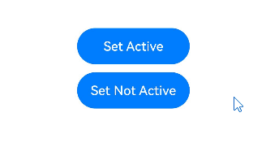

示例操作步骤：
1. 点击Set Active按钮，调用[activate](../reference/apis-arkui/arkts-apis-uicontext-focuscontroller.md#activate14)接口进入焦点激活态。
2. Tab走焦至Set Not Active按钮，Enter键触发按键事件，调用[activate](../reference/apis-arkui/arkts-apis-uicontext-focuscontroller.md#activate14)接口退出焦点激活态。

**层级页面**

层级页面是焦点框架中特定容器组件的统称，涵盖Page、Dialog、SheetPage、ModalPage、Menu、Popup、NavBar、NavDestination等。这些组件通常具有以下关键特性：

- 视觉层级独立性：从视觉呈现上看，这些组件独立于其他页面内容，并通常位于其上方，形成视觉上的层级差异。
- 焦点跟随：此类组件在首次创建并展示之后，会立即将应用内焦点抢占。
- 走焦范围限制：当焦点位于这些组件内部时，用户无法通过键盘按键将焦点转移到组件外部的其他元素上，焦点移动仅限于组件内部。

在一个应用程序中，任何时候都至少存在一个层级页面组件，并且该组件会持有当前焦点。当该层级页面关闭或不再可见时，焦点会自动转移到下一个可用的层级页面组件上，确保用户交互的连贯性和一致性。

> **说明：**
>
> Popup组件在focusable属性（组件属性，非通用属性）为false的时候，不会有第2条特性。
>
> NavBar、NavDestination没有第3条特性，对于它们的走焦范围，是与它们的首个父层级页面相同的。

**根容器**

根容器是[层级页面](#基础概念)内的概念，当某个[层级页面](#基础概念)首次创建并展示时，根据[层级页面](#基础概念)的特性，焦点会立即被该[层级页面](#基础概念)抢占。此时，该[层级页面](#基础概念)所在焦点链的末端节点将成为默认焦点，而这个默认焦点通常位于该[层级页面](#基础概念)的根容器上。

在缺省状态下，[层级页面](#基础概念)的默认焦点位于其根容器上，但开发者可以通过defaultFocus属性来自定义这一行为。

当焦点位于根容器时，首次按下Tab键不仅会使焦点进入激活状态，还会触发焦点向子组件的传递。如果子组件本身也是一个容器，则焦点会继续向下传递，直至到达叶子节点。传递规则是：优先传递给上一次获得焦点的子节点，如果不存在这样的节点，则默认传递给第一个子节点。

### 走焦规范

根据走焦的触发方式，可以分为主动走焦和被动走焦。

**主动走焦**


指开发者/用户主观行为导致的焦点移动，包括：使用外接键盘的按键走焦（Tab键/Shift+Tab键/方向键）、使用requestFocus申请焦点、clearFocus清除焦点、focusOnTouch点击申请焦点等接口导致的焦点转移。


- 按键走焦
1. 前提：当前应用需处于焦点激活态。
2. 范围限制：按键走焦仅在当前获得焦点的层级页面内进行，具体参见“层级页面”中的“走焦范围限制”部分。
3. 按键类型：
Tab键：遵循Z字型遍历逻辑，完成当前范围内所有叶子节点的遍历，到达当前范围内的最后一个组件后，继续按下Tab键，焦点将循环至范围内的第一个可获焦组件，实现循环走焦。
Shift+Tab键：与Tab键具有相反的焦点转移效果。
方向键（上、下、左、右）：遵循十字型移动策略，在单层容器中，焦点的转移由该容器的特定走焦算法决定。若算法判定下一个焦点应落在某个容器组件上，系统将采用中心点距离优先的算法来进一步确定容器内的目标子节点。
4. 走焦算法：每个可获焦的容器组件都有其特定的走焦算法，用于定义焦点转移的规则。
5. 子组件优先：当子组件处理按键走焦事件，父组件将不再介入。

- requestFocus
详见[主动获焦失焦](#主动获焦失焦)，可以主动将焦点转移到指定组件上。
不可跨窗口，不可跨ArkUI实例申请焦点，可以跨层级页面申请焦点。

- clearFocus
详见[clearFocus](../reference/apis-arkui/arkts-apis-uicontext-focuscontroller.md#clearfocus12)，会清除当前层级页面中的焦点，最终焦点停留在根容器上。

- focusOnTouch
详见[focusOnTouch](../reference/apis-arkui/arkui-ts/ts-universal-attributes-focus.md#focusontouch9)，使绑定组件具备点击后获得焦点的能力。若组件本身不可获焦，则此功能无效。若绑定的是容器组件，点击后优先将焦点转移给上一次获焦的子组件，否则转移给第一个可获焦的子组件。


**被动走焦**

被动走焦是指组件焦点因系统或其他操作而自动转移，无需开发者直接干预，这是焦点系统的默认行为。


目前会被动走焦的机制有：

- 组件删除：当处于焦点状态的组件被删除时，焦点框架首先尝试将焦点转移到相邻的兄弟组件上，遵循先向后再向前的顺序。若所有兄弟组件均不可获焦，则焦点将释放，并通知其父组件进行焦点处理。
- 属性变更：若将处于焦点状态的组件的focusable或enabled属性设置为false，或者将visibility属性设置为不可见，系统将自动转移焦点至其他可获焦组件，转移方式与1中相同。
- [层级页面](#基础概念)切换：当发生[层级页面](#基础概念)切换时，如从一个[层级页面](#基础概念)跳转到另一个[层级页面](#基础概念)，当前[层级页面](#基础概念)的焦点将自动释放，新[层级页面](#基础概念)可能会根据预设逻辑自动获得焦点。
- Web组件初始化：对于Web组件，当其被创建时，若其设计需要立即获得焦点（如某些弹出框或输入框），则可能触发焦点转移至该Web组件，其行为属于组件自身的行为逻辑，不属于焦点框架的规格范围。

### 走焦算法

在焦点管理系统中，每个可获焦的容器都配备有特定的走焦算法，这些算法定义了当使用Tab键、Shift+Tab键或方向键时，焦点如何从当前获焦的子组件转移到下一个可获焦的子组件。

容器采用何种走焦算法取决于其UX（用户体验）规格，并由容器组件进行适配。目前，焦点框架支持三种走焦算法：线性走焦、投影走焦和自定义走焦。

**线性走焦算法**


线性走焦算法是默认的走焦策略，它基于容器中子节点在节点树中的挂载顺序进行走焦，常用于单方向布局的容器，如Row、Column和Flex容器。运行规则如下：


- 顺序依赖：走焦顺序完全基于子节点在节点树中的挂载顺序，与它们在界面上的实际布局位置无关。
- Tab键走焦：使用Tab键时，焦点将按照子节点的挂载顺序依次遍历。
- 方向键走焦：当使用与容器定义方向垂直的方向键时，容器不接受该方向的走焦请求。例如，在横向的Row容器中，无法使用方向键进行上下移动。
- 边界处理：当焦点位于容器的首尾子节点时，容器将拒绝与当前焦点方向相反的方向键走焦请求。例如，焦点在一个横向的Row容器的第一个子节点上时，该容器无法处理方向键左的走焦请求。

```ts
@Entry
@Component
struct FocusLinerExample {
  build() {
    Column() {
      Column() {
        Button("Column Button1")
          .width(150)
          .height(45)
          .fontColor(Color.White)
          .margin(10)
        Button("Column Button2")
          .width(150)
          .height(45)
          .fontColor(Color.White)
          .margin(10)
      }
      .margin(10)

      Row() {
        Button("Row Button1")
          .width(150)
          .height(45)
          .fontColor(Color.White)
          .margin(10)
        Button("Row Button2")
          .width(150)
          .height(45)
          .fontColor(Color.White)
          .margin(10)
      }
    }
  }
}
```

Tab键走焦：按照子节点的挂载顺序循环走焦。

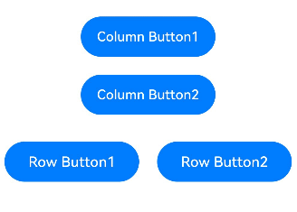

方向键上下走焦：纵向的Column容器中，可以使用上下键走焦，无法使用左右键走焦。

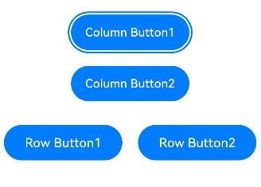

横向的Row容器中，可以使用左右键走焦，无法使用上下键走焦。

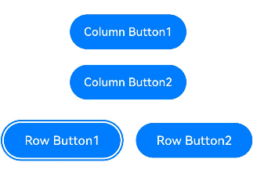


**投影走焦算法**

投影走焦算法基于当前获焦组件在走焦方向上的投影，结合子组件与投影的重叠面积和中心点距离进行胜出判定。该算法特别适用于子组件大小不一的容器，目前仅有配置了wrap属性的Flex组件。运行规则如下：


- 方向键走焦时，判断投影与子组件区域的重叠面积，在所有面积不为0的子组件中，计算它们与当前获焦组件的中心点直线距离，距离最短的胜出，若存在多个备选，则节点树上更靠前的胜出。若无任何子组件与投影有重叠，说明该容器已经无法处理该方向键的走焦请求。
- Tab键走焦时，先使用规格1，按照方向键右进行判定，若找到则成功退出，若无法找到，则将当前获焦子组件的位置模拟往下移动该获焦子组件的高度，然后再按照方向键左进行投影判定，有投影重叠且中心点直线距离最近的子组件胜出，若无投影重叠的子组件，则表示该容器无法处理本次Tab键走焦请求。
- Shift+Tab键走焦时，先使用规格1，按照方向键左进行判定，找到则成功退出。若无法找到，则将当前获焦子组件的位置模拟向上移动该获焦子组件的高度，然后再按照方向键右进行投影判定，有投影重叠且中心点直线距离最近的子组件胜出，若无投影重叠的子组件，则表示该容器无法处理本次的Shift+Tab键走焦请求。

```ts
@Entry
@Component
struct ProjectAreaFocusExample {
  build() {
    Column() {
      Column({ space: 5 }) {
        Text('Wrap').fontSize(12).width('90%')
        // 子组件多行布局
        Flex({ wrap: FlexWrap.Wrap }) {
          Button('1').width(140).height(50).margin(5)
          Button('2').width(140).height(50).margin(5)
          Button('3').width(140).height(50).margin(5)
          Button('4').width(140).height(50).margin(5)
          Button('5').width(140).height(50).margin(5)
        }
        .width('90%')
        .padding(10)
      }.width('100%').margin({ top: 5 })
    }.width('100%')
  }
}
```

> **说明：**
>
> - 这种投影聚焦算法计算的聚焦顺序与组件布局和大小密切相关，建议在组件排列非常规整的场景下使用。如果组件大小不一且存在横向或纵向的交叠关系，则可能会导致聚焦顺序与开发者预期不符。
> - 如果开发者希望有明确的走焦顺序，建议使用Column/Row等顺序走焦的容器实现。

Flex多行组件布局，组件大小一致，走焦正常。

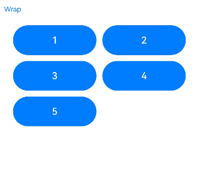

```ts
@Entry
@Component
struct ProjectAreaFocusExample2 {
  build() {
    Column() {
      Column({ space: 5 }) {
        Text('Wrap').fontSize(12).width('90%')
        // 子组件多行布局
        Flex({ wrap: FlexWrap.Wrap }) {
          Button('1').width(145).height(50).margin(5)
          Button('2').width(145).height(50).margin(5)
          Button('3').width(150).height(50).margin(5)
          Button('4').width(160).height(50).margin(5)
          Button('5').width(170).height(50).margin(5)
        }
        .width('90%')
        .padding(10)
      }.width('100%').margin({ top: 5 })
    }.width('100%')
  }
}
```

Flex多行组件布局，组件大小不一且有纵向的交叠关系，无法Tab走焦至下方3、4、5按钮组件。


**自定义走焦算法**

由组件自定义的走焦算法，规格由组件定义。

## 获焦/失焦事件

```ts
onFocus(event: () => void)
```


获焦事件回调，绑定该接口的组件获焦时，回调响应。

```ts
onBlur(event:() => void)
```

失焦事件回调，绑定该接口的组件失焦时，回调响应。

onFocus和onBlur两个接口通常成对使用，来监听组件的焦点变化。

```ts
// xxx.ets
@Entry
@Component
struct FocusEventExample {
  @State oneButtonColor: Color = Color.Gray;
  @State twoButtonColor: Color = Color.Gray;
  @State threeButtonColor: Color = Color.Gray;

  build() {
    Column({ space: 20 }) {
      // 通过外接键盘的上下键可以让焦点在三个按钮间移动，按钮获焦时颜色变化，失焦时变回原背景色
      Button('First Button')
        .width(260)
        .height(70)
        .backgroundColor(this.oneButtonColor)
        .fontColor(Color.Black)
          // 监听第一个组件的获焦事件，获焦后改变颜色
        .onFocus(() => {
          this.oneButtonColor = Color.Green;
        })
          // 监听第一个组件的失焦事件，失焦后改变颜色
        .onBlur(() => {
          this.oneButtonColor = Color.Gray;
        })

      Button('Second Button')
        .width(260)
        .height(70)
        .backgroundColor(this.twoButtonColor)
        .fontColor(Color.Black)
          // 监听第二个组件的获焦事件，获焦后改变颜色
        .onFocus(() => {
          this.twoButtonColor = Color.Green;
        })
          // 监听第二个组件的失焦事件，失焦后改变颜色
        .onBlur(() => {
          this.twoButtonColor = Color.Gray;
        })

      Button('Third Button')
        .width(260)
        .height(70)
        .backgroundColor(this.threeButtonColor)
        .fontColor(Color.Black)
          // 监听第三个组件的获焦事件，获焦后改变颜色
        .onFocus(() => {
          this.threeButtonColor = Color.Green;
        })
          // 监听第三个组件的失焦事件，失焦后改变颜色
        .onBlur(() => {
          this.threeButtonColor = Color.Gray ;
        })
    }.width('100%').margin({ top: 20 })
  }
}
```


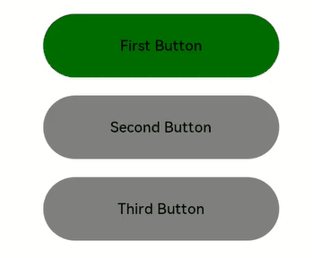


上述示例包含以下3步：

- 应用打开，按下Tab键激活走焦，“First Button”显示焦点激活态样式：组件外围有一个蓝色的闭合框，onFocus回调响应，背景色变成绿色。
- 按下Tab键，触发走焦，“Second Button”获焦，onFocus回调响应，背景色变成绿色；“First Button”失焦，onBlur回调响应，背景色变回灰色。
- 按下Tab键，触发走焦，“Third Button”获焦，onFocus回调响应，背景色变成绿色；“Second Button”失焦，onBlur回调响应，背景色变回灰色。

父子节点同时存在获焦和失焦事件时，获焦/失焦事件响应顺序为：

父节点Row1失焦 —> 子节点Button1失焦 —> 子节点Button2获焦 —> 父节点Row2获焦。

```ts
@Entry
@Component
struct FocusAndBlurExample {
  build() {
    Column() {
      Column({ space: 5 }) {
        Row() { // 父节点Row1
          Button('Button1') // 子节点Button1
            .width(140)
            .height(45)
            .margin(5)
            .onFocus(() => {
              console.info("Button1 onFocus");
            })
            .onBlur(() => {
              console.info("Button1 onBlur");
            })
        }
        .onFocus(() => {
          console.info("Row1 onFocus");
        })
        .onBlur(() => {
          console.info("Row1 onBlur");
        })

        Row() { // 父节点Row2
          Button('Button2') // 子节点Button2
            .width(140)
            .height(45)
            .margin(5)
            .onFocus(() => {
              console.info("Button2 onFocus");
            })
            .onBlur(() => {
              console.info("Button2 onBlur");
            })
        }
        .onFocus(() => {
          console.info("Row2 onFocus");
        })
        .onBlur(() => {
          console.info("Row2 onBlur");
        })
      }.width('100%').margin({ top: 5 })
    }.width('100%')
  }
}
```

Button1走焦到Button2，日志打印顺序：
```ts
Row1 onBlur
Button1 onBlur
Button2 onFocus
Row2 onFocus
```

## 设置组件是否可获焦

```ts
focusable(value: boolean)
```

设置组件是否可获焦。

按照组件的获焦能力可大致分为三类：

- 默认可获焦的组件，通常是有交互行为的组件，例如Button、Checkbox、TextInput组件，此类组件无需设置任何属性，默认即可获焦。

- 有获焦能力，但默认不可获焦的组件，典型的是Text、Image组件，此类组件缺省情况下无法获焦，若需要使其获焦，可使用通用属性focusable(true)使能。对于没有配置focusable属性，有获焦能力但默认不可获焦的组件，例如没有可获焦子组件的容器组件，为其配置onClick或是单指单击的Tap手势，该组件会隐式地成为可获焦组件。如果其focusable属性被设置为false，即使配置了上述事件，该组件依然不可获焦。

- 无获焦能力的组件，通常是无任何交互行为的展示类组件，例如Blank、Circle组件，此类组件即使使用focusable属性也无法使其可获焦。


```ts
enabled(value: boolean)
```

设置组件可交互性属性[enabled](../reference/apis-arkui/arkui-ts/ts-universal-attributes-enable.md#enabled)为`false`，则组件不可交互，无法获焦。

```ts
visibility(value: Visibility)
```

设置组件可见性属性[visibility](../reference/apis-arkui/arkui-ts/ts-universal-attributes-visibility.md#visibility)为`Visibility.None`或`Visibility.Hidden`，则组件不可见，无法获焦。

```ts
focusOnTouch(value: boolean)
```

设置当前组件是否支持点击获焦能力。

> **说明：**
>
>当某组件处于获焦状态时，将其的focusable属性或enabled属性设置为false，会自动使该组件失焦，然后焦点按照[走焦规范](#走焦规范)将焦点转移给其他组件。

```ts
// xxx.ets
@Entry
@Component
struct FocusableExample {
  @State textFocusable: boolean = true;
  @State textEnabled: boolean = true;
  @State color1: Color = Color.Yellow;
  @State color2: Color = Color.Yellow;
  @State color3: Color = Color.Yellow;

  build() {
    Column({ space: 5 }) {
      Text('Default Text')    // 第一个Text组件未设置focusable属性，默认不可获焦
        .borderColor(this.color1)
        .borderWidth(2)
        .width(300)
        .height(70)
        .onFocus(() => {
          this.color1 = Color.Blue;
        })
        .onBlur(() => {
          this.color1 = Color.Yellow;
        })
      Divider()

      Text('focusable: ' + this.textFocusable)    // 第二个Text设置了focusable初始为true，focusableOnTouch为true
        .borderColor(this.color2)
        .borderWidth(2)
        .width(300)
        .height(70)
        .focusable(this.textFocusable)
        .focusOnTouch(true)
        .onFocus(() => {
          this.color2 = Color.Blue;
        })
        .onBlur(() => {
          this.color2 = Color.Yellow;
        })

      Text('enabled: ' + this.textEnabled)    // 第三个Text设置了focusable为true，enabled初始为true
        .borderColor(this.color3)
        .borderWidth(2)
        .width(300)
        .height(70)
        .focusable(true)
        .enabled(this.textEnabled)
        .focusOnTouch(true)
        .onFocus(() => {
          this.color3 = Color.Blue;
        })
        .onBlur(() => {
          this.color3 = Color.Yellow;
        })

      Divider()

      Row() {
        Button('Button1')
          .width(140).height(70)
        Button('Button2')
          .width(160).height(70)
      }

      Divider()
      Button('Button3')
        .width(300).height(70)

      Divider()
    }.width('100%').justifyContent(FlexAlign.Center)
    .onKeyEvent((e) => {
      // 绑定onKeyEvent，在该Column组件获焦时，按下'F'键，可将第二个Text的focusable置反
      if (e.keyCode === 2022 && e.type === KeyType.Down) {
        this.textFocusable = !this.textFocusable;
      }
      // 绑定onKeyEvent，在该Column组件获焦时，按下'G'键，可将第三个Text的enabled置反
      if (e.keyCode === 2023 && e.type === KeyType.Down) {
        this.textEnabled = !this.textEnabled;
      }
    })
  }
}
```


运行效果：


上述示例包含以下3步：

- 第一个Text组件没有设置focusable(true)属性，该Text组件无法获焦。
- 点击第二个Text组件，由于设置了focusOnTouch(true)，第二个组件获焦。按下Tab键，触发走焦，仍然是第二个Text组件获焦。按键盘F键，触发onKeyEvent，focusable置为false，第二个Text组件变成不可获焦，焦点自动转移，会自动从Text组件寻找下一个可获焦组件，焦点转移到第三个Text组件上。
- 按键盘G键，触发onKeyEvent，enabled置为false，第三个Text组件变成不可获焦，焦点自动转移，使焦点转移到Row容器上，容器中使用的是默认配置，会转移到Button1上。

## 设置容器绘制焦点框

虽然容器组件本身可以获焦，但是无法绘制焦点框。可以为其配置onClick或是单指单击的Tap手势，在容器上绘制焦点框。

> **说明：**
>
> 容器绘制焦点框前提：
> - 容器内部没有可获焦子节点。
> - 容器配置有onClick或是单指单击的Tap手势。
> - 容器本身未设置focusable属性，或设置在onClick或是单指单击的Tap手势之后。

```ts
@Entry
@Component
struct ScopeFocusExample {
  @State scopeFocusState: boolean = true;

  build() {
    Column() {
      Column({ space: 5 }) {
        Text("容器获焦").textAlign(TextAlign.Center)
      }
      .justifyContent(FlexAlign.Center)
      .width('80%')
      .height(50)
      .margin({ top: 5, bottom: 5 })
      .onClick(() => {
      })
      .focusable(this.scopeFocusState)

      Button('Button1')
        .width(140)
        .height(45)
        .margin(5)
        .onClick(() => {
          this.scopeFocusState = !this.scopeFocusState;
          console.info("Button1 onFocus");
        })
      Button('Button2')
        .width(140)
        .height(45)
        .margin(5)
    }.width('100%')
  }
}
```


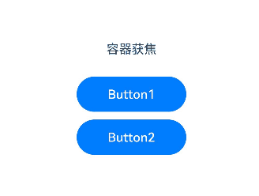

上述示例包含以下2步：

- Column配置onClick事件并设置focusable为true后，Tab键走焦，Column容器可以绘制焦点框。
- 点击Button1，将Column的focusable属性设置为false，Column容器无法获焦和绘制焦点框。

## 设置焦点停留在容器上

```ts
tabStop(isTabStop: boolean) 
```
设置当前容器组件的[tabStop](../reference/apis-arkui/arkui-ts/ts-universal-attributes-focus.md#tabstop14)属性，可决定在走焦时焦点是否会停留在当前容器。

```ts
@Entry
@Component
struct TabStopExample {
  build() {
    Column({ space: 20 }) {
      Button('Button1')
        .width(140)
        .height(45)
        .margin(5)
      Column() {
        Button('Button2')
          .width(140)
          .height(45)
          .margin(5)
        Button('Button3')
          .width(140)
          .height(45)
          .margin(5)
      }.tabStop(true)
    }.width('100%')
  }
}
```


上述示例包含以下2步：

- Column配置tabStop后，Tab键走焦，焦点在Button1和Column容器之间切换，Column容器可以绘制焦点框。
- 走焦至Column容器后，按Enter键，焦点转移到容器中的第一个可获焦节点上。Tab键走焦，走焦至容器中其他可获焦节点。

## 默认焦点

### 层级页面的默认焦点

```ts
defaultFocus(value: boolean)
```

设置当前组件是否为当前[层级页面](#基础概念)上的默认焦点。


```ts
// xxx.ets
@Entry
@Component
struct morenjiaodian {
  @State oneButtonColor: Color = Color.Gray;
  @State twoButtonColor: Color = Color.Gray;
  @State threeButtonColor: Color = Color.Gray;

  build() {
    Column({ space: 20 }) {
      // 通过外接键盘的上下键可以让焦点在三个按钮间移动，按钮获焦时颜色变化，失焦时变回原背景色
      Button('First Button')
        .width(260)
        .height(70)
        .backgroundColor(this.oneButtonColor)
        .fontColor(Color.Black)
          // 监听第一个组件的获焦事件，获焦后改变颜色
        .onFocus(() => {
          this.oneButtonColor = Color.Green;
        })
          // 监听第一个组件的失焦事件，失焦后改变颜色
        .onBlur(() => {
          this.oneButtonColor = Color.Gray;
        })

      Button('Second Button')
        .width(260)
        .height(70)
        .backgroundColor(this.twoButtonColor)
        .fontColor(Color.Black)
          // 监听第二个组件的获焦事件，获焦后改变颜色
        .onFocus(() => {
          this.twoButtonColor = Color.Green;
        })
          // 监听第二个组件的失焦事件，失焦后改变颜色
        .onBlur(() => {
          this.twoButtonColor = Color.Gray;
        })

      Button('Third Button')
        .width(260)
        .height(70)
        .backgroundColor(this.threeButtonColor)
        .fontColor(Color.Black)
          // 设置默认焦点
        .defaultFocus(true)
          // 监听第三个组件的获焦事件，获焦后改变颜色
        .onFocus(() => {
          this.threeButtonColor = Color.Green;
        })
          // 监听第三个组件的失焦事件，失焦后改变颜色
        .onBlur(() => {
          this.threeButtonColor = Color.Gray ;
        })
    }.width('100%').margin({ top: 20 })
  }
}
```


上述示例包含以下2步：

- 在第三个Button组件上设置了defaultFocus(true)，进入[层级页面](#基础概念)后第三个Button默认获焦，显示为绿色。
- 按下Tab键，触发走焦，第三个Button正处于获焦状态，会出现焦点框。

### 容器的默认焦点

容器的默认焦点受到[获焦优先级](#焦点组与获焦优先级)的影响。

**defaultFocus与FocusPriority的区别**

[defaultFocus](../reference/apis-arkui/arkui-ts/ts-universal-attributes-focus.md#defaultfocus9)是用于指定[层级页面](#基础概念)首次展示时的默认获焦节点，[FocusPriority](../reference/apis-arkui/arkui-ts/ts-universal-attributes-focus.md#focuspriority12)是用于指定某个容器首次获焦时其子节点的获焦优先级。上述两个属性在某些场景同时配置时行为未定义，例如下面的场景，[层级页面](#基础概念)首次展示无法同时满足defaultFocus获焦和高优先级组件获焦。

示例

```ts
@Entry
@Component
struct Index {
  build() {
    Row() {
      Button('Button1')
        .defaultFocus(true)
      Button('Button2')
        .focusScopePriority('RowScope', FocusPriority.PREVIOUS)
    }.focusScopeId('RowScope')
  }
}
```

### 层级页面/容器整体获焦时的焦点链

**整体获焦与非整体获焦**

- 整体获焦是[层级页面](#基础概念)/容器自身作为焦点链的叶节点获焦，获焦后再把焦点链叶节点转移到子孙组件。例如，[层级页面](#基础概念)切换、Navigation组件中的路由切换、焦点组走焦、容器组件主动调用requestFocusById等。

- 非整体获焦是某个组件作为焦点链叶节点获焦，导致其祖先节点跟着获焦。例如TextInput组件主动获取焦点、Tab键在非焦点组场景下走焦等。

**整体获焦的焦点链形成**

1.[层级页面](#基础概念)首次获焦：

- 焦点链叶节点为配置了defaultFocus的节点。

- 未配置defaultFocus时，焦点停留在[层级页面](#基础概念)的根容器上。

2.[层级页面](#基础概念)非首次获焦：由上次获焦的节点获焦。

3.获焦链上存在配置了获焦优先级的组件和容器：

- 容器内存在优先级大于PREVIOUS的组件，由优先级最高的组件获焦。

- 容器内不存在优先级大于PREVIOUS的组件，由上次获焦的节点获焦。例如，窗口失焦后重新获焦。


## 焦点样式

> **说明：**
>
> 最终绘制焦点激活态的组件的[zIndex](../reference/apis-arkui/arkui-ts/ts-universal-attributes-z-order.md#zindex)默认会被抬升至INT_MAX，如果该组件已经配置了zIndex，则不做zIndex调整。该组件不再绘制焦点激活态时，例如组件失焦或是退出走焦态，zIndex恢复为默认层级。
>

```ts
focusBox(style: FocusBoxStyle)
```

设置当前组件系统焦点框样式。

```ts
import { ColorMetrics, LengthMetrics } from '@kit.ArkUI'

@Entry
@Component
struct RequestFocusExample {
  build() {
    Column({ space: 30 }) {
      Button("small black focus box")
        .focusBox({
          margin: new LengthMetrics(0),
          strokeColor: ColorMetrics.rgba(0, 0, 0),
        })
      Button("large red focus box")
        .focusBox({
          margin: LengthMetrics.px(20),
          strokeColor: ColorMetrics.rgba(255, 0, 0),
          strokeWidth: LengthMetrics.px(10)
        })
    }
    .alignItems(HorizontalAlign.Center)
    .width('100%')
  }
}
```


上述示例包含以下2步：

- 进入[层级页面](#基础概念)，按下Tab键触发走焦，第一个Button获焦，焦点框样式为紧贴边缘的蓝色细框。
- 按下Tab键，走焦到第二个Button，焦点框样式为远离边缘的红色粗框。

## 主动获焦/失焦

- 使用FocusController中的方法

  更推荐使用FocusController中的requestFocus主动获取焦点。优势如下：
  - 当前帧生效，避免被下一帧组件树变化影响。
  - 有异常值返回，便于排查主动获取焦点失败的原因。
  - 避免多实例场景中取到错误实例。

  需先使用UIContext中的[getFocusController()](../reference/apis-arkui/arkts-apis-uicontext-uicontext.md#getfocuscontroller12)方法获取实例，再通过此实例调用对应方法。

  ```ts
  requestFocus(key: string): void
  ```
  通过组件的id将焦点转移到组件树对应的实体节点，生效时间为当帧生效。

  ```ts
  clearFocus(): void
  ```
  清除焦点，将焦点强制转移到层级页面根容器节点，焦点链路上其他节点失焦。

- 使用focusControl中的方法
  ```ts
  requestFocus(value: string): boolean
  ```

  调用此接口可以主动让焦点转移至参数指定的组件上，焦点转移生效时间为下一个帧信号。


```ts
// focusTest.ets
@Entry
@Component
struct RequestExample {
  @State btColor: string = '#ff2787d9'
  @State btColor2: string = '#ff2787d9'

  build() {
    Column({ space: 20 }) {
      Column({ space: 5 }) {
        Button('Button')
          .width(200)
          .height(70)
          .fontColor(Color.White)
          .focusOnTouch(true)
          .backgroundColor(this.btColor)
          .onFocus(() => {
            this.btColor = '#ffd5d5d5'
          })
          .onBlur(() => {
            this.btColor = '#ff2787d9'
          })
          .id("testButton")

        Button('Button')
          .width(200)
          .height(70)
          .fontColor(Color.White)
          .focusOnTouch(true)
          .backgroundColor(this.btColor2)
          .onFocus(() => {
            this.btColor2 = '#ffd5d5d5'
          })
          .onBlur(() => {
            this.btColor2 = '#ff2787d9'
          })
          .id("testButton2")

        Divider()
          .vertical(false)
          .width("80%")
          .backgroundColor('#ff707070')
          .height(10)

        Button('FocusController.requestFocus')
          .width(200).height(70).fontColor(Color.White)
          .onClick(() => {
            this.getUIContext().getFocusController().requestFocus("testButton")
          })
          .backgroundColor('#ff2787d9')

        Button("focusControl.requestFocus")
          .width(200).height(70).fontColor(Color.White)
          .onClick(() => {
            focusControl.requestFocus("testButton2")
          })
          .backgroundColor('#ff2787d9')

        Button("clearFocus")
          .width(200).height(70).fontColor(Color.White)
          .onClick(() => {
            this.getUIContext().getFocusController().clearFocus()
          })
          .backgroundColor('#ff2787d9')
      }
    }
    .width('100%')
    .height('100%')
  }
}
```


上述示例包含以下3步：

- 点击FocusController.requestFocus按钮，第一个Button获焦。
- 点击focusControl.requestFocus按钮，第二个Button获焦。
- 点击clearFocus按钮，第二个Button失焦。

## 自定义组件走焦顺序

### nextFocus自定义走焦

```ts
nextFocus(nextStep: Optional<FocusMovement>): T
```

若存在配置了nextFocus的组件，则走焦只会按照设置的nextFocus走焦顺序走焦，没有设置自定义走焦或者设置自定义走焦的组件或容器不存在时，仍进行默认走焦规则。

>  **说明：**
>
>  - 该能力从API version 18开始支持。

```ts
@Entry
@Component
struct NextFocusExample {
  build() {
    Column({space: 30}) {
      Row().height('30%')
      Row({space: 10}) {
        Button('A')
          .id('A')
          .nextFocus({forward: 'F', backward: 'C', down: 'B'})
        Button('B')
          .id('B')
          .nextFocus({ down: 'C'})
        Button('C')
          .id('C')
      }
      Column({space: 10}) {
        Button('D')
          .id('D')
        Button('E')
          .id('E')
          .nextFocus({forward: 'A', backward: 'M', up: 'E', right: 'F'})
      }
      Row({space: 10}) {
        Button('F')
          .id('F')
          .nextFocus({forward: 'B', down: 'A'});
      }
    }.width('100%')
  }
}
```
Tab键走焦：未配置nextFocus时，Tab键走焦顺序为A->B->C->D->E->F。配置nextFocus之后，Tab键走焦顺序为A->F->B->C->D->E->A。


方向键走焦（以方向下键为例）：未配置nextFocus时，按下Tab键激活焦点态之后，按方向下键走焦顺序为A->D->E->F。配置nextFocus之后，按下Tab键激活焦点态之后，按方向下键走焦顺序为A->B->C->D->E->F->A。

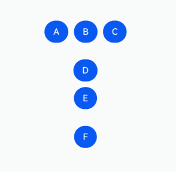

### tabIndex自定义走焦

```ts
tabIndex(index: number)
```

tabIndex自定义组件Tab键走焦顺序。

若存在配置了tabIndex大于0的组件，则Tab键走焦只会在tabIndex大于0的组件内，按照tabIndex的值从小到大并循环依次走焦。若没有配置tabIndex大于0的组件，则tabIndex等于0的组件按照组件预设的走焦规则走焦。

> **说明：**
>
> 不能同时设置tabIndex与focusScopeId属性。
> 
> 不建议在[层级页面](#基础概念)中通过单独设置组件的tabIndex属性为负数来控制获焦能力，可以使用focusable属性代替。
> 
> tabIndex只能够自定义Tab键走焦，若想同时自定义方向键等走焦能力，建议使用[nextfocus](#nextfocus自定义走焦)。

```ts
@Entry
@Component
struct TabIndexExample {
  build() {
    Column() {
      Button('Button1')
        .width(140)
        .height(45)
        .margin(5)
      Button('Focus Button1')
        .width(140)
        .height(45)
        .margin(5).tabIndex(1)
      Button('Button2')
        .width(140)
        .height(45)
        .margin(5)
      Button('Focus Button2')
        .width(140)
        .height(45)
        .margin(5).tabIndex(2)
    }.width('100%')
  }
}
```

Tab键走焦：只在配置TabIndex的节点间循环走焦。


tabIndex配置在容器上时，如果容器中的所有组件都没有获焦过，则走到第一个可获焦组件上，否则会走到上次获焦的节点。

```ts
@Entry
@Component
struct TabIndexExample2 {
  build() {
    Column() {
      Button('Button1')
        .width(140)
        .height(45)
        .margin(5).tabIndex(1)
      Column() {
        Button('Button2')
          .width(140)
          .height(45)
          .margin(5)
        Button('Button3')
          .width(140)
          .height(45)
          .margin(5)
      }.tabIndex(2)
    }.width('100%')
  }
}
```

Tab键走焦：tabIndex配置在容器上。


上述示例包含以下3步：

- 使用Tab走焦，焦点在Button1和Button2之间循环走焦（tabIndex配置在Button2和Button3的父组件上）。
- 在走焦至Button2时，使用方向下键，将焦点转移至Button3上。
- 使用Tab走焦，焦点在Button1和Button3之间循环走焦。

## 焦点组与获焦优先级

```ts
focusScopePriority(scopeId: string, priority?: FocusPriority)
```

设置当前组件在指定容器内获焦的优先级。需要配合focusScopeId一起使用。


```ts
focusScopeId(id: string, isGroup?: boolean)
```

设置当前容器组件的id标识，设置当前容器组件是否为焦点组。焦点组与tabIndex不能混用。

```ts
// focusTest.ets
@Entry
@Component
struct FocusableExample {
  @State inputValue: string = ''

  build() {
    Scroll() {
      Row({ space: 20 }) {
        Column({ space: 20 }) {  // 标记为Column1
          Column({ space: 5 }) {
            Button('Group1')
              .width(165)
              .height(40)
              .fontColor(Color.White)
            Row({ space: 5 }) {
              Button()
                .width(80)
                .height(40)
                .fontColor(Color.White)
              Button()
                .width(80)
                .height(40)
                .fontColor(Color.White)
            }
            Row({ space: 5 }) {
              Button()
                .width(80)
                .height(40)
                .fontColor(Color.White)
              Button()
                .width(80)
                .height(40)
                .fontColor(Color.White)
            }
          }.borderWidth(2).borderColor(Color.Red).borderStyle(BorderStyle.Dashed)
          Column({ space: 5 }) {
            Button('Group2')
              .width(165)
              .height(40)
              .fontColor(Color.White)
            Row({ space: 5 }) {
              Button()
                .width(80)
                .height(40)
                .fontColor(Color.White)
              Button()
                .width(80)
                .height(40)
                .fontColor(Color.White)
                .focusScopePriority('ColumnScope1', FocusPriority.PRIOR)  // Column1首次获焦时获焦
            }
            Row({ space: 5 }) {
              Button()
                .width(80)
                .height(40)
                .fontColor(Color.White)
              Button()
                .width(80)
                .height(40)
                .fontColor(Color.White)
            }
          }.borderWidth(2).borderColor(Color.Green).borderStyle(BorderStyle.Dashed)
        }
        .focusScopeId('ColumnScope1')
        Column({ space: 5 }) {  // 标记为Column2
          TextInput({placeholder: 'input', text: this.inputValue})
            .onChange((value: string) => {
              this.inputValue = value
            })
            .width(156)
          Button('Group3')
            .width(165)
            .height(40)
            .fontColor(Color.White)
          Row({ space: 5 }) {
            Button()
              .width(80)
              .height(40)
              .fontColor(Color.White)
            Button()
              .width(80)
              .height(40)
              .fontColor(Color.White)
          }
          Button()
            .width(165)
            .height(40)
            .fontColor(Color.White)
            .focusScopePriority('ColumnScope2', FocusPriority.PREVIOUS)  // Column2获焦时获焦
          Row({ space: 5 }) {
            Button()
              .width(80)
              .height(40)
              .fontColor(Color.White)
            Button()
              .width(80)
              .height(40)
              .fontColor(Color.White)
          }
          Button()
            .width(165)
            .height(40)
            .fontColor(Color.White)
          Row({ space: 5 }) {
            Button()
              .width(80)
              .height(40)
              .fontColor(Color.White)
            Button()
              .width(80)
              .height(40)
              .fontColor(Color.White)
          }
        }.borderWidth(2).borderColor(Color.Orange).borderStyle(BorderStyle.Dashed)
        .focusScopeId('ColumnScope2', true)  // Column2为焦点组
      }.alignItems(VerticalAlign.Top)
    }
  }
}
```


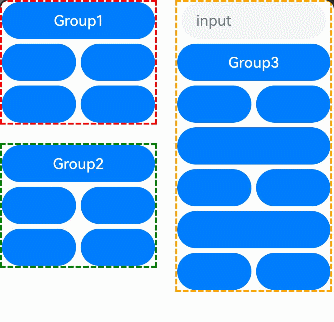


上述示例包含以下2步：

- input方框内设置了焦点组，因此按下Tab键后焦点会快速从input中走出去，而按下方向键后可以在input内走焦。
- 左上角的Column没有设置焦点组，因此只能通过Tab键一个一个地走焦。


在API version 14，焦点组新增参数arrowStepOut，用于设置能否使用方向键走焦出当前焦点组。
```ts
focusScopeId(id: string, isGroup?: boolean, arrowStepOut?: boolean)
```

```ts
@Entry
@Component
struct FocusScopeIdExample {
  build() {
    Column({ space: 20 }) {
      Column() {
        Button('Group1')
          .width(165)
          .height(40)
          .margin(5)
          .fontColor(Color.White)
        Row({ space: 5 }) {
          Button("Button1")
            .width(80)
            .height(40)
            .margin(5)
            .fontColor(Color.White)
          Button("Button2")
            .width(80)
            .height(40)
            .margin(5)
            .fontColor(Color.White)
        }
      }.focusScopeId("1", true, true)
      .borderWidth(2).borderColor(Color.Red).borderStyle(BorderStyle.Dashed)

      TextInput()
      Column() {
        Button('Group2')
          .width(165)
          .height(40)
          .margin(5)
          .fontColor(Color.White)
        Row({ space: 5 }) {
          Button("Button3")
            .width(80)
            .height(40)
            .margin(5)
            .fontColor(Color.White)
          Button("Button4")
            .width(80)
            .height(40)
            .margin(5)
            .fontColor(Color.White)
        }
      }.focusScopeId("2", true, false)
      .borderWidth(2).borderColor(Color.Green).borderStyle(BorderStyle.Dashed)

      TextInput()
    }.width('100%')
  }
}
```


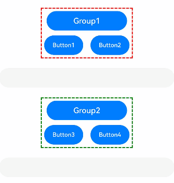

上述示例包含以下3步：
- Group1和Group2设置焦点组，因此按下Tab键后焦点会快速从Group1和Group2的方框内走出。
- Group1设置焦点组时，允许使用方向键走焦出当前焦点组。在Group1方框内走焦时，使用方向键可以走焦至input输入框。
- Group2设置焦点组时，不允许使用方向键走焦出当前焦点组。在Group2方框内走焦时，使用方向键无法走焦至input输入框。

>  **说明：** 
>
> TextInput组件本身对方向键存在独有处理，因此无法使用方向键直接走出TextInput组件。

## 焦点与按键事件

当组件获焦且存在点击事件（`onClick`）或单指单击事件（`TapGesture`）时，回车和空格会触发对应的事件回调。

>  **说明：**
>
>  1. 点击事件（`onClick`）或单指单击事件（`TapGesture`）在回车、空格触发对应事件回调时，默认不冒泡传递，即父组件对应[按键事件](../reference/apis-arkui/arkui-ts/ts-universal-events-key.md)不会被同步触发。
>  2. 按键事件（`onKeyEvent`）默认冒泡传递，即同时会触发父组件的按键事件回调。
>  3. 组件同时存在点击事件（`onClick`）和按键事件（`onKeyEvent`），在回车、空格触发时，两者都会响应。
>  4. 获焦组件响应点击事件（`onClick`），与焦点激活态无关。

```ts
@Entry
@Component
struct FocusOnclickExample {
  @State count: number = 0
  @State name: string = 'Button'

  build() {
    Column() {
      Button(this.name)
        .fontSize(30)
        .onClick(() => {
          this.count++
          if (this.count % 2 === 0) {
            this.name = "count is even number"
          } else {
            this.name = "count is odd number"
          }
        }).height(60)
    }.height('100%').width('100%').justifyContent(FlexAlign.Center)
  }
}
```
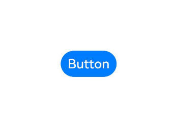

## 组件获焦能力说明


  **表1** 基础组件获焦能力

| 基础组件                                     | 是否有获焦能力 | focusable默认值 |
| ---------------------------------------- | ------- | ------------ |
| [AlphabetIndexer](../reference/apis-arkui/arkui-ts/ts-container-alphabet-indexer.md) | 是       | true         |
| [Blank](../reference/apis-arkui/arkui-ts/ts-basic-components-blank.md) | 否       | false        |
| [Button](../reference/apis-arkui/arkui-ts/ts-basic-components-button.md) | 是       | true         |
| [CalendarPicker](../reference/apis-arkui/arkui-ts/ts-basic-components-calendarpicker.md) | 是       | true         |
| [Checkbox](../reference/apis-arkui/arkui-ts/ts-basic-components-checkbox.md) | 是       | true         |
| [CheckboxGroup](../reference/apis-arkui/arkui-ts/ts-basic-components-checkboxgroup.md) | 是       | true         |
| [ContainerSpan](../reference/apis-arkui/arkui-ts/ts-basic-components-containerspan.md) | 否       | false         |
| [DataPanel](../reference/apis-arkui/arkui-ts/ts-basic-components-datapanel.md) | 是       | false        |
| [DatePicker](../reference/apis-arkui/arkui-ts/ts-basic-components-datepicker.md) | 是       | true         |
| [Divider](../reference/apis-arkui/arkui-ts/ts-basic-components-divider.md) | 是       | false        |
| [Gauge](../reference/apis-arkui/arkui-ts/ts-basic-components-gauge.md) | 是       | false        |
| [Image](../reference/apis-arkui/arkui-ts/ts-basic-components-image.md) | 是       | false        |
| [ImageAnimator](../reference/apis-arkui/arkui-ts/ts-basic-components-imageanimator.md) | 否       | false        |
| [ImageSpan](../reference/apis-arkui/arkui-ts/ts-basic-components-imagespan.md)                 | 否       | false        |
| [LoadingProgress](../reference/apis-arkui/arkui-ts/ts-basic-components-loadingprogress.md) | 是       | true        |
| [Marquee](../reference/apis-arkui/arkui-ts/ts-basic-components-marquee.md) | 否       | false        |
| [Menu](../reference/apis-arkui/arkui-ts/ts-basic-components-menu.md) | 是       | true         |
| [MenuItem](../reference/apis-arkui/arkui-ts/ts-basic-components-menuitem.md) | 是       | true         |
| [MenuItemGroup](../reference/apis-arkui/arkui-ts/ts-basic-components-menuitemgroup.md) | 否       | false         |
| [Navigation](../reference/apis-arkui/arkui-ts/ts-basic-components-navigation.md) | 是       | true       |
| [NavRouter](../reference/apis-arkui/arkui-ts/ts-basic-components-navrouter.md) | 否       | false        |
| [NavDestination](../reference/apis-arkui/arkui-ts/ts-basic-components-navdestination.md) | 是       | true        |
| [PatternLock](../reference/apis-arkui/arkui-ts/ts-basic-components-patternlock.md) | 是       | true        |
| [Progress](../reference/apis-arkui/arkui-ts/ts-basic-components-progress.md) | 是       | true        |
| [QRCode](../reference/apis-arkui/arkui-ts/ts-basic-components-qrcode.md) | 是       | true        |
| [Radio](../reference/apis-arkui/arkui-ts/ts-basic-components-radio.md) | 是       | true         |
| [Rating](../reference/apis-arkui/arkui-ts/ts-basic-components-rating.md) | 是       | true         |
| [RichEditor](../reference/apis-arkui/arkui-ts/ts-basic-components-richeditor.md) | 是       | true         |
| [RichText](../reference/apis-arkui/arkui-ts/ts-basic-components-richtext.md) | 否       | false        |
| [ScrollBar](../reference/apis-arkui/arkui-ts/ts-basic-components-scrollbar.md) | 否       | false        |
| [Search](../reference/apis-arkui/arkui-ts/ts-basic-components-search.md) | 是       | true         |
| [Select](../reference/apis-arkui/arkui-ts/ts-basic-components-select.md) | 是       | true         |
| [Slider](../reference/apis-arkui/arkui-ts/ts-basic-components-slider.md) | 是       | true         |
| [Span](../reference/apis-arkui/arkui-ts/ts-basic-components-span.md) | 否       | false        |
| [Stepper](../reference/apis-arkui/arkui-ts/ts-basic-components-stepper.md) | 是       | true         |
| [StepperItem](../reference/apis-arkui/arkui-ts/ts-basic-components-stepperitem.md) | 是       | true         |
| [SymbolSpan](../reference/apis-arkui/arkui-ts/ts-basic-components-symbolSpan.md) | 否       | false         |
| [SymbolGlyph](../reference/apis-arkui/arkui-ts/ts-basic-components-symbolGlyph.md) | 否       | false         |
| [Text](../reference/apis-arkui/arkui-ts/ts-basic-components-text.md) | 是       | false        |
| [TextArea](../reference/apis-arkui/arkui-ts/ts-basic-components-textarea.md) | 否       | false         |
| [TextClock](../reference/apis-arkui/arkui-ts/ts-basic-components-textclock.md) | 否       | false        |
| [TextInput](../reference/apis-arkui/arkui-ts/ts-basic-components-textinput.md) | 是       | true         |
| [TextPicker](../reference/apis-arkui/arkui-ts/ts-basic-components-textpicker.md) | 是       | true         |
| [TextTimer](../reference/apis-arkui/arkui-ts/ts-basic-components-texttimer.md) | 否       | false        |
| [TimePicker](../reference/apis-arkui/arkui-ts/ts-basic-components-timepicker.md) | 否       | false         |
| [Toggle](../reference/apis-arkui/arkui-ts/ts-basic-components-toggle.md) | 是       | true         |
| [XComponent](../reference/apis-arkui/arkui-ts/ts-basic-components-xcomponent.md) | 是       | false        |

  **表2** 容器组件获焦能力

| 容器组件                                     | 是否可获焦 | focusable默认值 |
| ---------------------------------------- | ----- | ------------ |
| [Badge](../reference/apis-arkui/arkui-ts/ts-container-badge.md) | 否     | false        |
| [Column](../reference/apis-arkui/arkui-ts/ts-container-column.md) | 是     | true         |
| [ColumnSplit](../reference/apis-arkui/arkui-ts/ts-container-columnsplit.md) | 是     | true         |
| [Counter](../reference/apis-arkui/arkui-ts/ts-container-counter.md) | 是     | false         |
| [EmbeddedComponent](../reference/apis-arkui/arkui-ts/ts-container-embedded-component.md)    | 否     | false         |
| [Flex](../reference/apis-arkui/arkui-ts/ts-container-flex.md) | 是     | true         |
| [FlowItem](../reference/apis-arkui/arkui-ts/ts-container-flowitem.md)             | 是     | true         |
| [FolderStack](../reference/apis-arkui/arkui-ts/ts-container-folderstack.md)             | 是     | true         |
| [FormLink](../reference/apis-arkui/arkui-ts/ts-container-formlink.md)               | 否     | false         |
| [GridCol](../reference/apis-arkui/arkui-ts/ts-container-gridcol.md) | 是     | true         |
| [GridRow](../reference/apis-arkui/arkui-ts/ts-container-gridrow.md) | 是     | true         |
| [Grid](../reference/apis-arkui/arkui-ts/ts-container-grid.md) | 是     | true         |
| [GridItem](../reference/apis-arkui/arkui-ts/ts-container-griditem.md) | 是     | true         |
| [Hyperlink](../reference/apis-arkui/arkui-ts/ts-container-hyperlink.md)         | 是     | true         |
| [List](../reference/apis-arkui/arkui-ts/ts-container-list.md) | 是     | true         |
| [ListItem](../reference/apis-arkui/arkui-ts/ts-container-listitem.md) | 是     | true         |
| [ListItemGroup](../reference/apis-arkui/arkui-ts/ts-container-listitemgroup.md) | 是     | true         |
| [Navigator](../reference/apis-arkui/arkui-ts/ts-container-navigator.md) | 是     | true         |
| [Refresh](../reference/apis-arkui/arkui-ts/ts-container-refresh.md) | 是     | true        |
| [RelativeContainer](../reference/apis-arkui/arkui-ts/ts-container-relativecontainer.md) | 否     | false         |
| [Row](../reference/apis-arkui/arkui-ts/ts-container-row.md) | 是    | true         |
| [RowSplit](../reference/apis-arkui/arkui-ts/ts-container-rowsplit.md) | 是     | true         |
| [Scroll](../reference/apis-arkui/arkui-ts/ts-container-scroll.md) | 是     | true         |
| [SideBarContainer](../reference/apis-arkui/arkui-ts/ts-container-sidebarcontainer.md) | 是     | true         |
| [Stack](../reference/apis-arkui/arkui-ts/ts-container-stack.md) | 是     | true         |
| [Swiper](../reference/apis-arkui/arkui-ts/ts-container-swiper.md) | 是     | true         |
| [Tabs](../reference/apis-arkui/arkui-ts/ts-container-tabs.md) | 是     | true         |
| [TabContent](../reference/apis-arkui/arkui-ts/ts-container-tabcontent.md) | 是     | true         |
| [WaterFlow](../reference/apis-arkui/arkui-ts/ts-container-waterflow.md)         | 否     | false         |
| [WithTheme](../reference/apis-arkui/arkui-ts/ts-container-with-theme.md)         | 是     | true         |

  **表3** 媒体组件获焦能力

| 媒体组件                                     | 是否可获焦 | focusable默认值 |
| ---------------------------------------- | ----- | ------------ |
| [Video](../reference/apis-arkui/arkui-ts/ts-media-components-video.md) | 是     | true         |