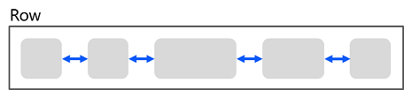
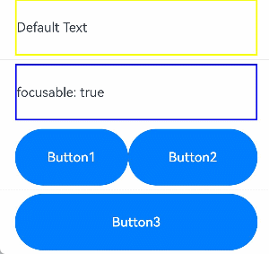
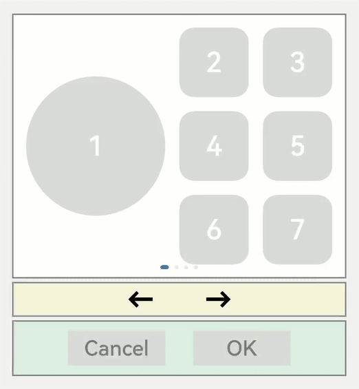
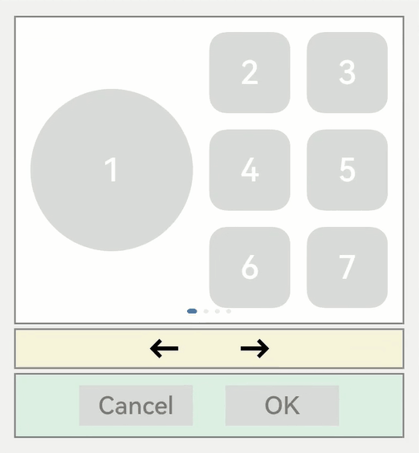

# 焦点事件


## 基本概念

- 焦点

  指向当前应用界面上唯一的一个可交互元素，当用户使用键盘、电视遥控器、车机摇杆/旋钮等非指向性输入设备与应用程序进行间接交互时，基于焦点的导航和交互是重要的输入手段。

- 默认焦点

  应用打开或切换页面后，若当前页上存在可获焦的组件，则树形结构的组件树中第一个可获焦的组件默认获得焦点。可以使用[自定义默认焦点](#自定义默认焦点)进行自定义指定。

- 获焦

  指组件获得了焦点，同一时刻，应用中最多只有1个末端组件是获焦的，且此时它的所有祖宗组件（整个组件链）均是获焦的。当期望某个组件获焦，须确保该组件及其所有的祖宗节点均是可获焦的（[focusable](#设置组件是否获焦)属性为true）。

- 失焦

  指组件从获焦状态变成了非获焦状态，失去了焦点。组件失焦时，它的所有祖宗组件（失焦组件链）与新的获焦组件链不相同的节点都会失焦。

- 走焦

  表示焦点在当前应用中转移的过程，走焦会带来原焦点组件的失焦和新焦点组件的获焦。应用中焦点发生变化的方式按行为可分为两类：

  - 主动走焦：指开发者/用户主观的行为导致焦点移动，包含：外接键盘上按下TAB/方向键、使用[requestFocus](#focuscontrolrequestfocus)主动给指定组件申请焦点、组件[focusOnTouch](#focusontouch)属性为true后点击组件。
  - 被动走焦：指组件焦点因其他操作被动的转移焦点，此特性为焦点系统默认行为，无法由开发者自由设定，例如当使用if-else语句将处于获焦的组件删除/将处于获焦的组件（或其父组件）置成不可获焦时、当页面切换时。

- 焦点态

  获焦组件的样式，不同组件的焦点态样式大同小异，默认情况下焦点态不显示，仅使用外接键盘按下TAB键/方向键时才会触发焦点态样式出现。首次触发焦点态显示的TAB键/方向键不会触发走焦。当应用接收到点击事件时（包括手指触屏的按下事件和鼠标左键的按下事件），自动隐藏焦点态样式。焦点态样式由后端组件定义，开发者无法修改。


## 走焦规则

走焦规则是指用户使用“TAB键/SHIFT+TAB键/方向键”主动进行走焦，或焦点系统在执行被动走焦时的顺序规则。组件的走焦规则默认由走焦系统定义，由焦点所在的容器决定。

- 线性走焦：常见的容器有Flex、Row、Column、List，这些都是典型的单方向容器，组件在这些容器内的排列都是线性的，那么走焦规则也是线性的。走焦的方向和方向键的方向一致。

  **图1** 线性走焦示意图  

  

  例如Row容器，使用方向键左右（←/→）即可将焦点在相邻的2个可获焦组件之间来回切换。

- 十字走焦：使用方向键上(↑)下(↓)左(←)右(→)可以使焦点在相邻的组件上切换。典型的是Grid容器，如下图：

  **图2** Grid组件十字走焦示意图  

  

  >**说明：**
  >
  > - TAB/SHIFT+TAB键在以上两种走焦规则上的功能和方向键一致。TAB键等同于“先执行方向键右，若无法走焦，再执行方向键下”，SHIFT+TAB键等同于“先执行方向键左，若无法走焦，再执行方向键上”。
  >
  > - 触发走焦的按键是按下的事件（DOWN事件）。
  >
  > - 删除组件、设置组件无法获焦后，会使用线性走焦规则，自动先往被删除/Unfocusable组件的前置兄弟组件上走焦，无法走焦的话，再忘后置兄弟组件上走焦。

- tabIndex走焦：给组件设置[tabIndex](../reference/arkui-ts/ts-universal-attributes-focus.md)通用属性，自定义组件的TAB键/SHIFT+TAB键的走焦顺序。

- 区域走焦：给容器组件设置tabIndex通用属性，再结合[groupDefaultFocus](#groupdefaultfocus)通用属性，自定义容器区域的TAB键/SHIFT+TAB键的走焦顺序和默认获焦组件。

- 走焦至容器组件规则：当焦点走焦到容器（该容器没有配置groupDefaultFocus）上时，若该容器组件为首次获焦，则会先计算目标容器组件的子组件的区域位置，得到距离目标容器中心点最近的子组件，焦点会走到目标容器上的该子组件上。若该容器非首次获焦，焦点会自动走焦到上一次目标容器中获焦的子组件。

- 焦点交互：当某组件获焦时，该组件的固有点击任务或开发者绑定的onClick回调任务，会自动挂载到空格/回车按键上，当按下按键时，任务就和手指/鼠标点击一样被执行。


>**说明：**
>
>本文涉及到的焦点均为组件焦点，另外一个焦点的概念是：窗口焦点，指向当前获焦的窗口。当窗口失焦时，该窗口应用中的所有获焦组件全部失焦。


## 监听组件的焦点变化


```ts
onFocus(event: () => void)
```


获焦事件回调，绑定该API的组件获焦时，回调响应。


```ts
onBlur(event:() => void)
```


失焦事件回调，绑定该API的组件失焦时，回调响应。


onFocus和onBlur两个接口通常成对使用，来监听组件的焦点变化。


以下示例代码展示获焦/失焦回调的使用方法：


```ts
// xxx.ets
@Entry
@Component
struct FocusEventExample {
  @State oneButtonColor: Color = Color.Gray;
  @State twoButtonColor: Color = Color.Gray;
  @State threeButtonColor: Color = Color.Gray;

  build() {
    Column({ space: 20 }) {
      // 通过外接键盘的上下键可以让焦点在三个按钮间移动，按钮获焦时颜色变化，失焦时变回原背景色
      Button('First Button')
        .width(260)
        .height(70)
        .backgroundColor(this.oneButtonColor)
        .fontColor(Color.Black)
          // 监听第一个组件的获焦事件，获焦后改变颜色
        .onFocus(() => {
          this.oneButtonColor = Color.Green;
        })
          // 监听第一个组件的失焦事件，失焦后改变颜色
        .onBlur(() => {
          this.oneButtonColor = Color.Gray;
        })

      Button('Second Button')
        .width(260)
        .height(70)
        .backgroundColor(this.twoButtonColor)
        .fontColor(Color.Black)
          // 监听第二个组件的获焦事件，获焦后改变颜色
        .onFocus(() => {
          this.twoButtonColor = Color.Green;
        })
          // 监听第二个组件的失焦事件，失焦后改变颜色
        .onBlur(() => {
          this.twoButtonColor = Color.Grey;
        })

      Button('Third Button')
        .width(260)
        .height(70)
        .backgroundColor(this.threeButtonColor)
        .fontColor(Color.Black)
          // 监听第三个组件的获焦事件，获焦后改变颜色
        .onFocus(() => {
          this.threeButtonColor = Color.Green;
        })
          // 监听第三个组件的失焦事件，失焦后改变颜色
        .onBlur(() => {
          this.threeButtonColor = Color.Gray ;
        })
    }.width('100%').margin({ top: 20 })
  }
}
```


上述示例包含以下4步：


1. 应用打开时，“First Button”默认获取焦点，onFocus回调响应，背景色变成绿色。

2. 按下TAB键（或方向键下↓），“First Button”显示焦点态样式：组件外围有一个蓝色的闭合框。不触发走焦，焦点仍然在“First Button”上。

3. 按下TAB键（或方向键下↓），触发走焦，“Second Button”获焦，onFocus回调响应，背景色变成绿色；“First Button”失焦、onBlur回调响应，背景色变回灰色。

4. 按下TAB键（或方向键下↓），触发走焦，“Third Button”获焦，onFocus回调响应，背景色变成绿色；“Second Button”失焦、onBlur回调响应，背景色变回灰色。


## 设置组件是否获焦

通过focusable接口设置组件是否可获焦：


```ts
focusable(value: boolean)
```

按照组件的获焦能力可大致分为三类：

- 默认可获焦的组件，通常是有交互行为的组件，例如Button、Checkbox，TextInput组件，此类组件无需设置任何属性，默认即可获焦。

- 有获焦能力，但默认不可获焦的组件，典型的是Text、Image组件，此类组件缺省情况下无法获焦，若需要使其获焦，可使用通用属性focusable(true)使能。

- 无获焦能力的组件，通常是无任何交互行为的展示类组件，例如Blank、Circle组件，此类组件即使使用focusable属性也无法使其可获焦。


>**说明：**
> - focusable为false表示组件不可获焦，同样可以使组件变成不可获焦的还有通用属性[enabled](../reference/arkui-ts/ts-universal-attributes-enable.md)。
>
> - 当某组件处于获焦状态时，将其的focusable属性或enabled属性设置为false，会自动使该组件失焦，然后焦点按照[走焦规则](#走焦规则)将焦点转移给其他组件。

  **表1** 基础组件获焦能力

| 基础组件                                     | 是否有获焦能力 | focusable默认值 | 走焦规则     |
| ---------------------------------------- | ------- | ------------ | -------- |
| [AlphabetIndexer](../reference/arkui-ts/ts-container-alphabet-indexer.md) | 是       | true         | 线性走焦     |
| [Blank](../reference/arkui-ts/ts-basic-components-blank.md) | 否       | false        | /        |
| [Button](../reference/arkui-ts/ts-basic-components-button.md) | 是       | true         | /        |
| [Checkbox](../reference/arkui-ts/ts-basic-components-checkbox.md) | 是       | true         | /        |
| [CheckboxGroup](../reference/arkui-ts/ts-basic-components-checkboxgroup.md) | 是       | true         | /        |
| [DataPanel](../reference/arkui-ts/ts-basic-components-datapanel.md) | 否       | false        | /        |
| [DatePicker](../reference/arkui-ts/ts-basic-components-datepicker.md) | 是       | true         | 线性走焦     |
| [Divider](../reference/arkui-ts/ts-basic-components-divider.md) | 否       | false        | /        |
| [Formcomponent](../reference/arkui-ts/ts-basic-components-formcomponent.md) | 否       | false        | /        |
| [Gauge](../reference/arkui-ts/ts-basic-components-gauge.md) | 否       | false        | /        |
| [Image](../reference/arkui-ts/ts-basic-components-image.md) | 是       | false        | /        |
| [ImageAnimator](../reference/arkui-ts/ts-basic-components-imageanimator.md) | 是       | false        | /        |
| [LoadingProgress](../reference/arkui-ts/ts-basic-components-loadingprogress.md) | 否       | false        | /        |
| [Marquee](../reference/arkui-ts/ts-basic-components-marquee.md) | 否       | false        | /        |
| [Menu](../reference/arkui-ts/ts-basic-components-menu.md) | 是       | true         | 线性走焦     |
| [MenuItem](../reference/arkui-ts/ts-basic-components-menuitem.md) | 是       | true         | /        |
| [MenuItemGroup](../reference/arkui-ts/ts-basic-components-menuitemgroup.md) | 是       | true         | 线性走焦     |
| [Navigation](../reference/arkui-ts/ts-basic-components-navigation.md) | 否       | false        | 组件自定义    |
| [NavRouter](../reference/arkui-ts/ts-basic-components-navrouter.md) | 否       | false        | 跟随子容器    |
| [NavDestination](../reference/arkui-ts/ts-basic-components-navdestination.md) | 否       | false        | 线性走焦     |
| [PatternLock](../reference/arkui-ts/ts-basic-components-patternlock.md) | 否       | false        | /        |
| [PluginComponent](../reference/arkui-ts/ts-basic-components-plugincomponent.md) | 否       | false        | /        |
| [Progress](../reference/arkui-ts/ts-basic-components-progress.md) | 否       | false        | /        |
| [QRCode](../reference/arkui-ts/ts-basic-components-qrcode.md) | 否       | false        | /        |
| [Radio](../reference/arkui-ts/ts-basic-components-radio.md) | 是       | true         | /        |
| [Rating](../reference/arkui-ts/ts-basic-components-rating.md) | 是       | true         | /        |
| [RemoteWindow](../reference/arkui-ts/ts-basic-components-remotewindow.md) | 否       | false        | /        |
| [RichText](../reference/arkui-ts/ts-basic-components-richtext.md) | 否       | false        | /        |
| [ScrollBar](../reference/arkui-ts/ts-basic-components-scrollbar.md) | 否       | false        | /        |
| [Search](../reference/arkui-ts/ts-basic-components-search.md) | 是       | true         | /        |
| [Select](../reference/arkui-ts/ts-basic-components-select.md) | 是       | true         | 线性走焦     |
| [Slider](../reference/arkui-ts/ts-basic-components-slider.md) | 是       | true         | /        |
| [Span](../reference/arkui-ts/ts-basic-components-span.md) | 否       | false        | /        |
| [Stepper](../reference/arkui-ts/ts-basic-components-stepper.md) | 是       | true         | /        |
| [StepperItem](../reference/arkui-ts/ts-basic-components-stepperitem.md) | 是       | true         | /        |
| [Text](../reference/arkui-ts/ts-basic-components-text.md) | 是       | false        | /        |
| [TextArea](../reference/arkui-ts/ts-basic-components-textarea.md) | 是       | true         | /        |
| [TextClock](../reference/arkui-ts/ts-basic-components-textclock.md) | 否       | false        | /        |
| [TextInput](../reference/arkui-ts/ts-basic-components-textinput.md) | 是       | true         | /        |
| [TextPicker](../reference/arkui-ts/ts-basic-components-textpicker.md) | 是       | true         | 线性走焦     |
| [TextTimer](../reference/arkui-ts/ts-basic-components-texttimer.md) | 否       | false        | /        |
| [TimePicker](../reference/arkui-ts/ts-basic-components-timepicker.md) | 是       | true         | 线性走焦     |
| [Toggle](../reference/arkui-ts/ts-basic-components-toggle.md) | 是       | true         | /        |
| [Web](../reference/arkui-ts/ts-basic-components-web.md) | 是       | true         | Web组件自定义 |
| [XComponent](../reference/arkui-ts/ts-basic-components-xcomponent.md) | 否       | false        | /        |

  **表2** 容器组件获焦能力

| 容器组件                                     | 是否可获焦 | focusable默认值 | 走焦规则     |
| ---------------------------------------- | ----- | ------------ | -------- |
| [AbilityComponent](../reference/arkui-ts/ts-container-ability-component.md) | 否     | false        | /        |
| [Badge](../reference/arkui-ts/ts-container-badge.md) | 否     | false        | /        |
| [Column](../reference/arkui-ts/ts-container-column.md) | 是     | true         | 线性走焦     |
| [ColumnSplit](../reference/arkui-ts/ts-container-columnsplit.md) | 是     | true         | /        |
| [Counter](../reference/arkui-ts/ts-container-counter.md) | 是     | true         | 线性走焦     |
| [Flex](../reference/arkui-ts/ts-container-flex.md) | 是     | true         | 线性走焦     |
| [GridCol](../reference/arkui-ts/ts-container-gridcol.md) | 是     | true         | 容器组件自定义  |
| [GridRow](../reference/arkui-ts/ts-container-gridrow.md) | 是     | true         | 容器组件自定义  |
| [Grid](../reference/arkui-ts/ts-container-grid.md) | 是     | true         | 容器组件自定义  |
| [GridItem](../reference/arkui-ts/ts-container-griditem.md) | 是     | true         | 跟随子组件    |
| [List](../reference/arkui-ts/ts-container-list.md) | 是     | true         | 线性走焦     |
| [ListItem](../reference/arkui-ts/ts-container-listitem.md) | 是     | true         | 跟随子组件    |
| [ListItemGroup](../reference/arkui-ts/ts-container-listitemgroup.md) | 是     | true         | 跟随List组件 |
| [Navigator](../reference/arkui-ts/ts-container-navigator.md) | 否     | true         | 容器组件自定义  |
| [Panel](../reference/arkui-ts/ts-container-panel.md) | 否     | true         | 跟随子组件    |
| [Refresh](../reference/arkui-ts/ts-container-refresh.md) | 否     | false        | /        |
| [RelativeContainer](../reference/arkui-ts/ts-container-relativecontainer.md) | 否     | true         | 容器组件自定义  |
| [Row](../reference/arkui-ts/ts-container-row.md) | 是     | true         | 线性走焦     |
| [RowSplit](../reference/arkui-ts/ts-container-rowsplit.md) | 是     | true         | /        |
| [Scroll](../reference/arkui-ts/ts-container-scroll.md) | 是     | true         | 线性走焦     |
| [SideBarContainer](../reference/arkui-ts/ts-container-sidebarcontainer.md) | 是     | true         | 线性走焦     |
| [Stack](../reference/arkui-ts/ts-container-stack.md) | 是     | true         | 线性走焦     |
| [Swiper](../reference/arkui-ts/ts-container-swiper.md) | 是     | true         | 容器组件自定义  |
| [Tabs](../reference/arkui-ts/ts-container-tabs.md) | 是     | true         | 容器组件自定义  |
| [TabContent](../reference/arkui-ts/ts-container-tabcontent.md) | 是     | true         | 跟随子组件    |

  **表3** 媒体组件获焦能力

| 媒体组件                                     | 是否可获焦 | focusable默认值 | 走焦规则 |
| ---------------------------------------- | ----- | ------------ | ---- |
| [Video](../reference/arkui-ts/ts-media-components-video.md) | 是     | true         | /    |

  **表4** 画布组件获焦能力

| 画布组件                                     | 是否可获焦 | focusable默认值 | 走焦规则 |
| ---------------------------------------- | ----- | ------------ | ---- |
| [Canvas](../reference/arkui-ts/ts-components-canvas-canvas.md) | 否     | false        | /    |


以下示例为大家展示focusable接口的使用方法：


```ts
// xxx.ets
@Entry
@Component
struct FocusableExample {
  @State textFocusable: boolean = true;
  @State color1: Color = Color.Yellow;
  @State color2: Color = Color.Yellow;

  build() {
    Column({ space: 5 }) {
      Text('Default Text')    // 第一个Text组件未设置focusable属性，默认不可获焦
        .borderColor(this.color1)
        .borderWidth(2)
        .width(300)
        .height(70)
        .onFocus(() => {
          this.color1 = Color.Blue;
        })
        .onBlur(() => {
          this.color1 = Color.Yellow;
        })
      Divider()

      Text('focusable: ' + this.textFocusable)    // 第二个Text设置了focusable属性，初始值为true
        .borderColor(this.color2)
        .borderWidth(2)
        .width(300)
        .height(70)
        .focusable(this.textFocusable)
        .onFocus(() => {
          this.color2 = Color.Blue;
        })
        .onBlur(() => {
          this.color2 = Color.Yellow;
        })

      Divider()

      Row() {
        Button('Button1')
          .width(140).height(70)
        Button('Button2')
          .width(160).height(70)
      }

      Divider()
      Button('Button3')
        .width(300).height(70)

      Divider()
    }.width('100%').justifyContent(FlexAlign.Center)
    .onKeyEvent((e) => {    // 绑定onKeyEvent，在该Column组件获焦时，按下'F'键，可将第二个Text的focusable置反
      if (e.keyCode === 2022 && e.type === KeyType.Down) {
        this.textFocusable = !this.textFocusable;
      }
    })
  }
}
```


运行效果：





上述示例包含默认获焦和主动走焦两部分：


**默认获焦：**


- 根据默认焦点的说明，该应用打开后，默认第一个可获焦元素获焦：

- 第一个Text组件没有设置focusable(true)属性，该Text组件无法获焦。

- 第二个Text组件的focusable属性显式设置为true，说明该组件可获焦，那么默认焦点将置到它身上。


**主动走焦：**


按键盘F键，触发onKeyEvent，focusable置为false，Text组件变成不可获焦，焦点自动转移，按照被动走焦中的说明项，焦点会自动从Text组件先向上寻找下一个可获焦组件，由于上一个组件是一个不可获焦的Text，所以向下寻找下一个可获焦的组件，找到并使焦点转移到Row容器上，根据[走焦至容器规则](#走焦规则)，计算Button1和Button2的位置，Button2比Button1更大，因此焦点会自动转移到Button2上。


## 自定义默认焦点


```ts
defaultFocus(value: boolean)
```

焦点系统在页面初次构建完成时，会搜索当前页下的所有组件，找到第一个绑定了defaultFocus(true)的组件，然后将该组件置为默认焦点，若无任何组件绑定defaultFocus(true)，则将第一个找到的可获焦的组件置为默认焦点。

以如下应用为例，应用布局如下：


以下是实现该应用的示例代码，且示例代码中没有设置defaultFocus：


```ts
// xxx.ets
import promptAction from '@ohos.promptAction';

class MyDataSource implements IDataSource {
  private list: number[] = [];
  private listener: DataChangeListener;

  constructor(list: number[]) {
    this.list = list;
  }

  totalCount(): number {
    return this.list.length;
  }

  getData(index: number): any {
    return this.list[index];
  }

  registerDataChangeListener(listener: DataChangeListener): void {
    this.listener = listener;
  }

  unregisterDataChangeListener() {
  }
}

@Entry
@Component
struct SwiperExample {
  private swiperController: SwiperController = new SwiperController()
  private data: MyDataSource = new MyDataSource([])

  aboutToAppear(): void {
    let list = []
    for (let i = 1; i <= 4; i++) {
      list.push(i.toString());
    }
    this.data = new MyDataSource(list);
  }

  build() {
    Column({ space: 5 }) {
      Swiper(this.swiperController) {
        LazyForEach(this.data, (item: string) => {
          Row({ space: 20 }) {
            Column() {
              Button('1').width(200).height(200)
                .fontSize(40)
                .backgroundColor('#dadbd9')
            }

            Column({ space: 20 }) {
              Row({ space: 20 }) {
                Button('2')
                  .width(100)
                  .height(100)
                  .fontSize(40)
                  .type(ButtonType.Normal)
                  .borderRadius(20)
                  .backgroundColor('#dadbd9')
                Button('3')
                  .width(100)
                  .height(100)
                  .fontSize(40)
                  .type(ButtonType.Normal)
                  .borderRadius(20)
                  .backgroundColor('#dadbd9')
              }

              Row({ space: 20 }) {
                Button('4')
                  .width(100)
                  .height(100)
                  .fontSize(40)
                  .type(ButtonType.Normal)
                  .borderRadius(20)
                  .backgroundColor('#dadbd9')
                Button('5')
                  .width(100)
                  .height(100)
                  .fontSize(40)
                  .type(ButtonType.Normal)
                  .borderRadius(20)
                  .backgroundColor('#dadbd9')
              }

              Row({ space: 20 }) {
                Button('6')
                  .width(100)
                  .height(100)
                  .fontSize(40)
                  .type(ButtonType.Normal)
                  .borderRadius(20)
                  .backgroundColor('#dadbd9')
                Button('7')
                  .width(100)
                  .height(100)
                  .fontSize(40)
                  .type(ButtonType.Normal)
                  .borderRadius(20)
                  .backgroundColor('#dadbd9')
              }
            }
          }
          .width(480)
          .height(380)
          .justifyContent(FlexAlign.Center)
          .borderWidth(2)
          .borderColor(Color.Gray)
          .backgroundColor(Color.White)
        }, item => item)
      }
      .cachedCount(2)
      .index(0)
      .interval(4000)
      .indicator(true)
      .loop(true)
      .duration(1000)
      .itemSpace(0)
      .curve(Curve.Linear)
      .onChange((index: number) => {
        console.info(index.toString());
      })
      .margin({ left: 20, top: 20, right: 20 })

      Row({ space: 40 }) {
        Button('←')
          .fontSize(40)
          .fontWeight(FontWeight.Bold)
          .fontColor(Color.Black)
          .backgroundColor(Color.Transparent)
          .onClick(() => {
            this.swiperController.showPrevious();
          })
        Button('→')
          .fontSize(40)
          .fontWeight(FontWeight.Bold)
          .fontColor(Color.Black)
          .backgroundColor(Color.Transparent)
          .onClick(() => {
            this.swiperController.showNext();
          })
      }
      .width(480)
      .height(50)
      .justifyContent(FlexAlign.Center)
      .borderWidth(2)
      .borderColor(Color.Gray)
      .backgroundColor('#f7f6dc')

      Row({ space: 40 }) {
        Button('Cancel')
          .fontSize(30)
          .fontColor('#787878')
          .type(ButtonType.Normal)
          .width(140)
          .height(50)
          .backgroundColor('#dadbd9')
        
        Button('OK')
          .fontSize(30)
          .fontColor('#787878')
          .type(ButtonType.Normal)
          .width(140)
          .height(50)
          .backgroundColor('#dadbd9')
          .onClick(() => {
            promptAction.showToast({ message: 'Button OK on clicked' });
          })
      }
      .width(480)
      .height(80)
      .justifyContent(FlexAlign.Center)
      .borderWidth(2)
      .borderColor(Color.Gray)
      .backgroundColor('#dff2e4')
      .margin({ left: 20, bottom: 20, right: 20 })
    }.backgroundColor('#f2f2f2')
    .margin({ left: 50, top: 50, right: 20 })
  }
}
```


当前应用上无任何defaultFocus设置，所以第一个可获焦的组件默认获取焦点，按下TAB键/方向键让获焦的组件显示焦点态样式：


假设开发者想让应用打开的时候，无需执行多余的切换焦点操作，直接点击按键的空格/回车键，就可以执行Button-OK的onClick回调操作，那么就可以给这个Button绑定defaultFocus(true)，让它成为该页面上的默认焦点：


```ts
Button('OK')
  .defaultFocus(true)    // 设置Button-OK为defaultFocus
  .fontSize(30)
  .fontColor('#787878')
  .type(ButtonType.Normal)
  .width(140).height(50).backgroundColor('#dadbd9')
  .onClick(() => {
    promptAction.showToast({ message: 'Button OK on clicked' });
  })
```


打开应用后按TAB键，Button-OK显示了焦点态，说明默认焦点变更到了Button-OK上。然后按下空格，响应了Button-OK的onClick事件。


## 自定义TAB键走焦顺序


```ts
tabIndex(index: number)
```

tabIndex用于设置自定义TAB键走焦顺序，默认值为0。使用“TAB/Shift+TAB键”走焦时（方向键不影响），系统会自动获取到所有配置了tabIndex大于0的组件，然后按照递增/递减排序进行走焦。


以[defaultFocus](#自定义默认焦点)提供的示例为例，默认情况下的走焦顺序如下：


默认的走焦顺序从第一个获焦组件一路走到最后一个获焦组件，会经历Button1-&gt;Button4-&gt;Button5-&gt;Button7-&gt;左箭头-&gt;右箭头-&gt;ButtonOK。这种走焦队列比较完整，遍历了大部分的组件。但缺点是从第一个走到最后一个所经历的路径较长。


如果想实现快速的从第一个走到最后一个，又不想牺牲太多的遍历完整性，就可以使用tabIndex通用属性。


比如：开发者把白色的区域当为一个整体，黄色的区域当为一个整体，绿色的区域当为一个整体，实现Button1-&gt;左箭头-&gt;ButtonOK这种队列的走焦顺序，只需要在Button1、左箭头、ButtonOK这三个组件上依次增加tabIndex(1)、tabIndex(2)、tabIndex(3)。tabIndex的参数表示TAB走焦的顺序（从大于0的数字开始，从小到大排列）。


```ts
  Button('1').width(200).height(200)
    .fontSize(40)
    .backgroundColor('#dadbd9')
    .tabIndex(1)    // Button-1设置为第一个tabIndex节点
```


```ts
  Button('←')
    .fontSize(40)
    .fontWeight(FontWeight.Bold)
    .fontColor(Color.Black)
    .backgroundColor(Color.Transparent)
    .onClick(() => {
      this.swiperController.showPrevious();
    })
    .tabIndex(2)    // Button-左箭头设置为第二个tabIndex节点
```


```ts
Button('OK')
  .fontSize(30)
  .fontColor('#787878')
  .type(ButtonType.Normal)
  .width(140).height(50).backgroundColor('#dadbd9')
  .onClick(() => {
    promptAction.showToast({ message: 'Button OK on clicked' });
  })
  .tabIndex(3)    // Button-OK设置为第三个tabIndex节点
```





>**说明：**
> - 当焦点处于tabIndex(大于0)节点上时，TAB/ShiftTAB会优先在tabIndex(大于0)的队列中寻找后置/前置的节点，存在则走焦至相应的tabIndex节点。若不存在，则使用默认的走焦逻辑继续往后/往前走焦。
>
> - 当焦点处于tabIndex(等于0)节点上时，TAB/ShiftTAB使用默认的走焦逻辑走焦，走焦的过程中会跳过tabIndex(大于0)和tabIndex(小于0）的节点。
>
> - 当焦点处于tabIndex(小于0)节点上时，TAB/ShiftTAB无法走焦。


### groupDefaultFocus


```ts
groupDefaultFocus(value: boolean)
```

[自定义TAB键走焦顺序](#自定义tab键走焦顺序)中所展示的使用tabIndex完成快速走焦的能力有如下问题：

每个区域（白色/黄色/绿色三个区域）都设置了某个组件为tabIndex节点（白色-Button1、黄色-左箭头、绿色-ButtonOK），但这样设置之后，只能在这3个组件上按TAB/ShiftTab键走焦时会有快速走焦的效果。

解决方案是给每个区域的容器设置tabIndex，但是这样设置的问题是：第一次走焦到容器上时，获焦的子组件是默认的第一个可获焦组件，并不是自己想要的组件（Button1、左箭头、ButtonOK）。

这样便引入了groupDefaultFocus通用属性，参数：boolean，默认值：false。

用法需和tabIndex组合使用，使用tabIndex给区域（容器）绑定走焦顺序，然后给Button1、左箭头、ButtonOK绑定groupDefaultFocus(true)，这样在首次走焦到目标区域（容器）上时，它的绑定了groupDefaultFocus(true)的子组件同时获得焦点。


```ts
// xxx.ets
import promptAction from '@ohos.promptAction';

class MyDataSource implements IDataSource {
  private list: number[] = [];
  private listener: DataChangeListener;

  constructor(list: number[]) {
    this.list = list;
  }

  totalCount(): number {
    return this.list.length;
  }

  getData(index: number): any {
    return this.list[index];
  }

  registerDataChangeListener(listener: DataChangeListener): void {
    this.listener = listener;
  }

  unregisterDataChangeListener() {
  }
}

@Entry
@Component
struct SwiperExample {
  private swiperController: SwiperController = new SwiperController()
  private data: MyDataSource = new MyDataSource([])

  aboutToAppear(): void {
    let list = []
    for (let i = 1; i <= 4; i++) {
      list.push(i.toString());
    }
    this.data = new MyDataSource(list);
  }

  build() {
    Column({ space: 5 }) {
      Swiper(this.swiperController) {
        LazyForEach(this.data, (item: string) => {
          Row({ space: 20 }) {    // 设置该Row组件为tabIndex的第一个节点
            Column() {
              Button('1').width(200).height(200)
                .fontSize(40)
                .backgroundColor('#dadbd9')
                .groupDefaultFocus(true)    // 设置Button-1为第一个tabIndex的默认焦点
            }

            Column({ space: 20 }) {
              Row({ space: 20 }) {
                Button('2')
                  .width(100)
                  .height(100)
                  .fontSize(40)
                  .type(ButtonType.Normal)
                  .borderRadius(20)
                  .backgroundColor('#dadbd9')
                Button('3')
                  .width(100)
                  .height(100)
                  .fontSize(40)
                  .type(ButtonType.Normal)
                  .borderRadius(20)
                  .backgroundColor('#dadbd9')
              }

              Row({ space: 20 }) {
                Button('4')
                  .width(100)
                  .height(100)
                  .fontSize(40)
                  .type(ButtonType.Normal)
                  .borderRadius(20)
                  .backgroundColor('#dadbd9')
                Button('5')
                  .width(100)
                  .height(100)
                  .fontSize(40)
                  .type(ButtonType.Normal)
                  .borderRadius(20)
                  .backgroundColor('#dadbd9')
              }

              Row({ space: 20 }) {
                Button('6')
                  .width(100)
                  .height(100)
                  .fontSize(40)
                  .type(ButtonType.Normal)
                  .borderRadius(20)
                  .backgroundColor('#dadbd9')
                Button('7')
                  .width(100)
                  .height(100)
                  .fontSize(40)
                  .type(ButtonType.Normal)
                  .borderRadius(20)
                  .backgroundColor('#dadbd9')
              }
            }
          }
          .width(480)
          .height(380)
          .justifyContent(FlexAlign.Center)
          .borderWidth(2)
          .borderColor(Color.Gray)
          .backgroundColor(Color.White)
          .tabIndex(1)
        }, item => item)
      }
      .cachedCount(2)
      .index(0)
      .interval(4000)
      .indicator(true)
      .loop(true)
      .duration(1000)
      .itemSpace(0)
      .curve(Curve.Linear)
      .onChange((index: number) => {
        console.info(index.toString());
      })
      .margin({ left: 20, top: 20, right: 20 })

      Row({ space: 40 }) {    // 设置该Row组件为第二个tabIndex节点
        Button('←')
          .fontSize(40)
          .fontWeight(FontWeight.Bold)
          .fontColor(Color.Black)
          .backgroundColor(Color.Transparent)
          .onClick(() => {
            this.swiperController.showPrevious();
          })
          .groupDefaultFocus(true)    // 设置Button-左箭头为第二个tabIndex节点的默认焦点
        Button('→')
          .fontSize(40)
          .fontWeight(FontWeight.Bold)
          .fontColor(Color.Black)
          .backgroundColor(Color.Transparent)
          .onClick(() => {
            this.swiperController.showNext();
          })
      }
      .width(480)
      .height(50)
      .justifyContent(FlexAlign.Center)
      .borderWidth(2)
      .borderColor(Color.Gray)
      .backgroundColor('#f7f6dc')
      .tabIndex(2)

      Row({ space: 40 }) {    // 设置该Row组件为第三个tabIndex节点
        Button('Cancel')
          .fontSize(30)
          .fontColor('#787878')
          .type(ButtonType.Normal)
          .width(140)
          .height(50)
          .backgroundColor('#dadbd9')

        Button('OK')
          .fontSize(30)
          .fontColor('#787878')
          .type(ButtonType.Normal)
          .width(140)
          .height(50)
          .backgroundColor('#dadbd9')
          .defaultFocus(true)
          .onClick(() => {
            promptAction.showToast({ message: 'Button OK on clicked' });
          })
          .groupDefaultFocus(true)    // 设置Button-OK为第三个tabIndex节点的默认焦点
      }
      .width(480)
      .height(80)
      .justifyContent(FlexAlign.Center)
      .borderWidth(2)
      .borderColor(Color.Gray)
      .backgroundColor('#dff2e4')
      .margin({ left: 20, bottom: 20, right: 20 })
      .tabIndex(3)
    }.backgroundColor('#f2f2f2')
    .margin({ left: 50, top: 50, right: 20 })
  }
}
```




### focusOnTouch


```ts
focusOnTouch(value: boolean)
```

点击获焦能力，参数：boolean，默认值：false（输入类组件：TextInput、TextArea、Search、Web默认值是true）。

点击是指使用触屏或鼠标左键进行单击，默认为false的组件，例如Button，不绑定该API时，点击Button不会使其获焦，当给Button绑定focusOnTouch(true)时，点击Button会使Button立即获得焦点。

给容器绑定focusOnTouch(true)时，点击容器区域，会立即使容器的第一个可获焦组件获得焦点。

示例代码：


```ts
// requestFocus.ets
import promptAction from '@ohos.promptAction';

@Entry
@Component
struct RequestFocusExample {
  @State idList: string[] = ['A', 'B', 'C', 'D', 'E', 'F', 'N']

  build() {
    Column({ space:20 }){
      Button("id: " + this.idList[0] + " focusOnTouch(true) + focusable(false)")
        .width(400).height(70).fontColor(Color.White).focusOnTouch(true)
        .focusable(false)
      Button("id: " + this.idList[1] + " default")
        .width(400).height(70).fontColor(Color.White)
      Button("id: " + this.idList[2] + " focusOnTouch(false)")
        .width(400).height(70).fontColor(Color.White).focusOnTouch(false)
      Button("id: " + this.idList[3] + " focusOnTouch(true)")
        .width(400).height(70).fontColor(Color.White).focusOnTouch(true)
    }.width('100%').margin({ top:20 })
  }
}
```


解读：


Button-A虽然设置了focusOnTouch(true)，但是同时也设置了focusable(false)，该组件无法获焦，因此点击后也无法获焦；


Button-B不设置相关属性，点击后不会获焦；


Button-C设置了focusOnTouch(false)，同Button-B，点击后也不会获焦；


Button-D设置了focusOnTouch(true)，点击即可使其获焦；


>**说明：**
>
>由于焦点态的阐述的特性，焦点态在屏幕接收点击事件后会立即清除。因此该示例代码在每次点击后，需要再次按下TAB键使焦点态再次显示，才可知道当前焦点所在的组件。


### focusControl.requestFocus


```ts
focusControl.requestFocus(id: string)
```

主动申请焦点能力的全局方法，参数：string，参数表示被申请组件的id（通用属性id设置的字符串）。


使用方法为：在任意执行语句中调用该API，指定目标组件的id为方法参数，当程序执行到该语句时，会立即给指定的目标组件申请焦点。


代码示例：


```ts
// requestFocus.ets
import promptAction from '@ohos.promptAction';

@Entry
@Component
struct RequestFocusExample {
  @State idList: string[] = ['A', 'B', 'C', 'D', 'E', 'F', 'N']
  @State requestId: number = 0

  build() {
    Column({ space:20 }){
      Row({space: 5}) {
        Button("id: " + this.idList[0] + " focusable(false)")
          .width(200).height(70).fontColor(Color.White)
          .id(this.idList[0])
          .focusable(false)
        Button("id: " + this.idList[1])
          .width(200).height(70).fontColor(Color.White)
          .id(this.idList[1])
      }
      Row({space: 5}) {
        Button("id: " + this.idList[2])
          .width(200).height(70).fontColor(Color.White)
          .id(this.idList[2])
        Button("id: " + this.idList[3])
          .width(200).height(70).fontColor(Color.White)
          .id(this.idList[3])
      }
      Row({space: 5}) {
        Button("id: " + this.idList[4])
          .width(200).height(70).fontColor(Color.White)
          .id(this.idList[4])
        Button("id: " + this.idList[5])
          .width(200).height(70).fontColor(Color.White)
          .id(this.idList[5])
      }
    }.width('100%').margin({ top:20 })
    .onKeyEvent((e) => {
      if (e.keyCode >= 2017 && e.keyCode <= 2022) {
        this.requestId = e.keyCode - 2017;
      } else if (e.keyCode === 2030) {
        this.requestId = 6;
      } else {
        return;
      }
      if (e.type !== KeyType.Down) {
        return;
      }
      let res = focusControl.requestFocus(this.idList[this.requestId]);
      if (res) {
        promptAction.showToast({message: 'Request success'});
      } else {
        promptAction.showToast({message: 'Request failed'});
      }
    })
  }
}
```


解读：页面中共6个Button组件，其中Button-A组件设置了focusable(false)，表示其不可获焦，在外部容器的onKeyEvent中，监听按键事件，当按下A ~ F按键时，分别去申请Button A ~ F 的焦点，另外按下N键，是给当前页面上不存在的id的组件去申请焦点。


1. 按下TAB键，由于第一个组件Button-A设置了无法获焦，那么默认第二个组件Button-B获焦，Button-B展示焦点态样式；

2. 键盘上按下A键，申请Button-A的焦点，气泡显示Request failed，表示无法获取到焦点，焦点位置未改变；

3. 键盘上按下B键，申请Button-B的焦点，气泡显示Request success，表示获焦到了焦点，焦点位置原本就在Button-B，位置未改变；

4. 键盘上按下C键，申请Button-C的焦点，气泡显示Request success，表示获焦到了焦点，焦点位置从Button-B变更为Button-C；

5. 键盘上按下D键，申请Button-D的焦点，气泡显示Request success，表示获焦到了焦点，焦点位置从Button-C变更为Button-D；

6. 键盘上按下E键，申请Button-E的焦点，气泡显示Request success，表示获焦到了焦点，焦点位置从Button-D变更为Button-E；

7. 键盘上按下F键，申请Button-F的焦点，气泡显示Request success，表示获焦到了焦点，焦点位置从Button-E变更为Button-F；

8. 键盘上按下N键，申请未知组件的焦点，气泡显示Request failed，表示无法获取到焦点，焦点位置不变；
