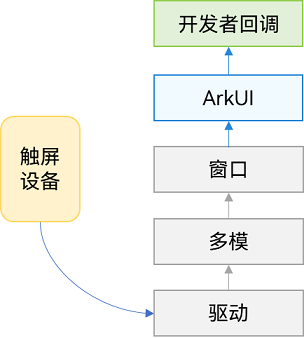

# 触屏事件


触屏事件指当手指/手写笔在组件上按下、滑动、抬起时触发的回调事件。包括[点击事件](#点击事件)、[拖拽事件](arkts-common-events-drag-event.md)和[触摸事件](#触摸事件)。


**图1**  触摸事件原理





## 点击事件

点击事件是指通过手指或手写笔做出一次完整的按下和抬起动作。当发生点击事件时，会触发以下回调函数：


```ts
onClick(event: (event?: ClickEvent) => void)
```


event参数提供点击事件相对于窗口或组件的坐标位置，以及发生点击的事件源。


  例如通过按钮的点击事件控制图片的显示和隐藏。

```ts
@Entry
@Component
struct IfElseTransition {
  @State flag: boolean = true;
  @State btnMsg: string = 'show';

  build() {
    Column() {
      Button(this.btnMsg).width(80).height(30).margin(30)
        .onClick(() => {
          if (this.flag) {
            this.btnMsg = 'hide';
          } else {
            this.btnMsg = 'show';
          }
          // 点击Button控制Image的显示和消失
          this.flag = !this.flag;
        })
      if (this.flag) {
        Image($r('app.media.icon')).width(200).height(200)
      }
    }.height('100%').width('100%')
  }
}
```
**图2**  通过按钮的点击事件控制图片的显示和隐藏


## 触摸事件

当手指或手写笔在组件上触碰时，会触发不同动作所对应的事件响应，包括按下（Down）、滑动（Move）、抬起（Up）事件：


```ts
onTouch(event: (event?: TouchEvent) => void)
```

- event.type为TouchType.Down：表示手指按下。

- event.type为TouchType.Up：表示手指抬起。

- event.type为TouchType.Move：表示手指按住移动。

- event.type为TouchType.Cancel：表示打断取消当前手指操作。

触摸事件可以同时多指触发，通过event参数可获取触发的手指位置、手指唯一标志、当前发生变化的手指和输入的设备源等信息。


```ts
// xxx.ets
@Entry
@Component
struct TouchExample {
  @State text: string = '';
  @State eventType: string = '';

  build() {
    Column() {
      Button('Touch').height(40).width(100)
        .onTouch((event?: TouchEvent) => {
          if(event){
            if (event.type === TouchType.Down) {
              this.eventType = 'Down';
            }
            if (event.type === TouchType.Up) {
              this.eventType = 'Up';
            }
            if (event.type === TouchType.Move) {
              this.eventType = 'Move';
            }
            this.text = 'TouchType:' + this.eventType + '\nDistance between touch point and touch element:\nx: '
            + event.touches[0].x + '\n' + 'y: ' + event.touches[0].y + '\nComponent globalPos:('
            + event.target.area.globalPosition.x + ',' + event.target.area.globalPosition.y + ')\nwidth:'
            + event.target.area.width + '\nheight:' + event.target.area.height
          }
        })
      Button('Touch').height(50).width(200).margin(20)
        .onTouch((event?: TouchEvent) => {
          if(event){
            if (event.type === TouchType.Down) {
              this.eventType = 'Down';
            }
            if (event.type === TouchType.Up) {
              this.eventType = 'Up';
            }
            if (event.type === TouchType.Move) {
              this.eventType = 'Move';
            }
            this.text = 'TouchType:' + this.eventType + '\nDistance between touch point and touch element:\nx: '
            + event.touches[0].x + '\n' + 'y: ' + event.touches[0].y + '\nComponent globalPos:('
            + event.target.area.globalPosition.x + ',' + event.target.area.globalPosition.y + ')\nwidth:'
            + event.target.area.width + '\nheight:' + event.target.area.height
          }
        })
      Text(this.text)
    }.width('100%').padding(30)
  }
}
```


## 相关实例

针对触屏事件开发，有以下相关实例可供参考：

- [ArkTS组件集（ArkTS）（Full SDK）（API10）](https://gitee.com/openharmony/applications_app_samples/tree/master/code/UI/ArkTsComponentCollection/ComponentCollection)

<!--RP1--><!--RP1End-->