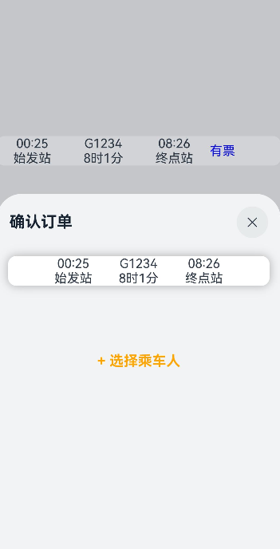

# 绑定全模态页面（bindContentCover）
<!--Kit: ArkUI-->
<!--Subsystem: ArkUI-->
<!--Owner: @CCFFWW-->
<!--Designer: @CCFFWW-->
<!--Tester: @lxl007-->
<!--Adviser: @HelloCrease-->

[全模态页面（bindContentCover）](../reference/apis-arkui/arkui-ts/ts-universal-attributes-modal-transition.md#bindcontentcover)是全屏模态形式的弹窗交互页面，完全覆盖底层父视图。适用于查看大图，全屏查看文稿等场景。

## 使用约束

全模态页面本质上是弹窗类组件，其交互层级默认为应用内顶层。

[Navigation](../reference/apis-arkui/arkui-ts/ts-basic-components-navigation.md)导航转场时，新push的页面层级无法超出全模态，其效果仍然显示在模态页面之下。针对此类场景，建议将模态页面的内容迁移至转场页面中实现。例如，在上述情况下，可以使用NavDestination来替代拉起的模态页面，新push的页面层级低于全模态。

## 生命周期

全模态页面提供了生命周期函数，用于通知应用程序该弹窗的生命周期状态。生命周期的触发顺序依次为：onWillAppear -> onAppear -> onWillDisappear -> onDisappear。

| 名称            |类型| 说明                       |
| ----------------- | ------ | ---------------------------- |
| onWillAppear    | () => void | 全模态页面显示（动画开始前）回调函数。 |
| onAppear    | () => void  | 全模态页面显示（动画结束后）回调函数。  |
| onWillDisappear | () => void | 全模态页面回退（动画开始前）回调函数。 |
| onDisappear |() => void  | 全模态页面回退（动画结束后）回调函数。     |

## 使用bindContentCover构建全屏模态内容覆盖半模态

全模态与半模态之间存在弹窗式的层级交互。后拉起的模态页面能够覆盖先前的模态页面。若开发者期望实现全屏转场，以覆盖半模态，并在全屏页面侧滑退出后，半模态页面仍保持显示，使用bindSheet结合bindContentCover将满足这一场景诉求。

详见[模态转场](arkts-modal-transition.md#使用bindcontentcover构建全屏模态转场效果)章节，了解使用bindContentCover构建全屏模态转场效果。

```ts
import { curves } from '@kit.ArkUI';

interface PersonList {
  name: string,
  cardNum: string
}

@Entry
@Component
struct BindContentCoverDemo {
  private personList: Array<PersonList> = [
    { name: '王**', cardNum: '1234***********789' },
    { name: '宋*', cardNum: '2345***********789' },
    { name: '许**', cardNum: '3456***********789' },
    { name: '唐*', cardNum: '4567***********789' }
  ];
  // 半模态转场控制变量
  @State isSheetShow: boolean = false;
  // 全模态转场控制变量
  @State isPresent: boolean = false;

  @Builder
  MyContentCoverBuilder() {
    Column() {
      Row() {
        Text('选择乘车人')
          .fontSize(20)
          .fontColor(Color.White)
          .width('100%')
          .textAlign(TextAlign.Center)
          .padding({ top: 30, bottom: 15 })
      }
      .backgroundColor(0x007dfe)

      Row() {
        Text('+ 添加乘车人')
          .fontSize(16)
          .fontColor(0x333333)
          .margin({ top: 10 })
          .padding({ top: 20, bottom: 20 })
          .width('92%')
          .borderRadius(10)
          .textAlign(TextAlign.Center)
          .backgroundColor(Color.White)
      }

      Column() {
        ForEach(this.personList, (item: PersonList, index: number) => {
          Row() {
            Column() {
              if (index % 2 == 0) {
                Column()
                  .width(20)
                  .height(20)
                  .border({ width: 1, color: 0x007dfe })
                  .backgroundColor(0x007dfe)
              } else {
                Column()
                  .width(20)
                  .height(20)
                  .border({ width: 1, color: 0x007dfe })
              }
            }
            .width('20%')

            Column() {
              Text(item.name)
                .fontColor(0x333333)
                .fontSize(18)
              Text(item.cardNum)
                .fontColor(0x666666)
                .fontSize(14)
            }
            .width('60%')
            .alignItems(HorizontalAlign.Start)

            Column() {
              Text('编辑')
                .fontColor(0x007dfe)
                .fontSize(16)
            }
            .width('20%')
          }
          .padding({ top: 10, bottom: 10 })
          .border({ width: { bottom: 1 }, color: 0xf1f1f1 })
          .width('92%')
          .backgroundColor(Color.White)
        })
      }
      .padding({ top: 20, bottom: 20 })

      Text('确认')
        .width('90%')
        .height(40)
        .textAlign(TextAlign.Center)
        .borderRadius(10)
        .fontColor(Color.White)
        .backgroundColor(0x007dfe)
        .onClick(() => {
          this.isPresent = !this.isPresent;
        })
    }
    .size({ width: '100%', height: '100%' })
    .backgroundColor(0xf5f5f5)
  }

  @Builder
  TripInfo() {
    Row() {
      Column() {
        Text('00:25')
        Text('始发站')
      }
      .width('25%')

      Column() {
        Text('G1234')
        Text('8时1分')
      }
      .width('25%')

      Column() {
        Text('08:26')
        Text('终点站')
      }
      .width('25%')
    }
  }

  // 第二步：定义半模态展示界面
  // 通过@Builder构建模态展示界面
  @Builder
  MySheetBuilder() {
    Column() {
      Column() {
        this.TripInfo()
      }
      .width('92%')
      .margin(15)
      .backgroundColor(Color.White)
      .shadow({ radius: 30, color: '#aaaaaa' })
      .borderRadius(10)

      Column() {
        Text('+ 选择乘车人')
          .fontSize(18)
          .fontColor(Color.Orange)
          .fontWeight(FontWeight.Bold)
          .padding({ top: 10, bottom: 10 })
          .width('60%')
          .textAlign(TextAlign.Center)
          .borderRadius(15)
          .onClick(() => {
            // 第三步：通过全模态接口调起全模态展示界面，新拉起的模态面板默认显示在最上层
            this.isPresent = !this.isPresent;
          })
            // 通过全模态接口，绑定模态展示界面MyContentCoverBuilder。transition属性支持自定义转场效果，此处定义了x轴横向入场
          .bindContentCover($$this.isPresent, this.MyContentCoverBuilder(), {
            transition: TransitionEffect.translate({ x: 500 }).animation({ curve: curves.springMotion(0.6, 0.8) })
          })
      }
      .padding({ top: 60 })
    }
  }

  build() {
    Column() {
      Row() {
        this.TripInfo()
        Text('有票')
          .fontColor(Color.Blue)
          .width('25%')
      }
      .width('100%')
      .margin({top: 200, bottom: 30})
      .borderRadius(10)
      .backgroundColor(Color.White)
      .onClick(()=>{
        this.isSheetShow = !this.isSheetShow;
      })
      // 第一步：定义半模态转场效果
      .bindSheet($$this.isSheetShow, this.MySheetBuilder(), {
        height: SheetSize.MEDIUM,
        title: {title: "确认订单"},
      })
    }
    .width('100%')
    .height('100%')
    .backgroundColor('#30aaaaaa')
  }
}
```

