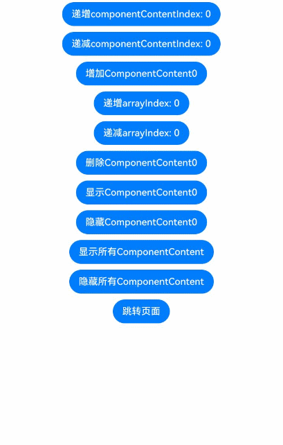
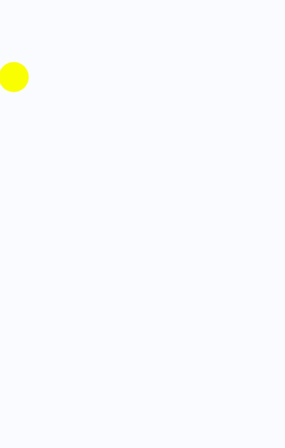
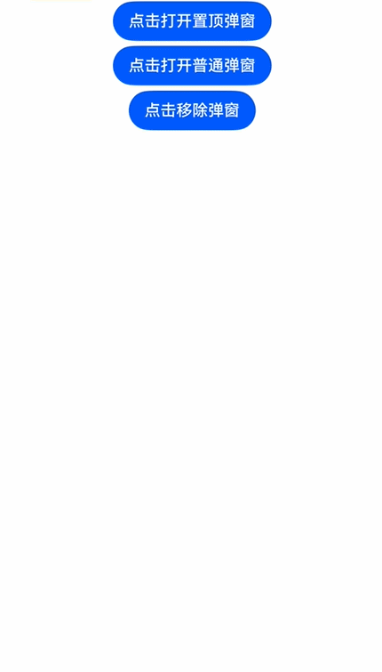

# 设置浮层（OverlayManager）
<!--Kit: ArkUI-->
<!--Subsystem: ArkUI-->
<!--Owner: @liyi0309-->
<!--Designer: @liyi0309-->
<!--Tester: @lxl007-->
<!--Adviser: @HelloCrease-->

浮层（OverlayManager）用于在页面（Page）之上展示自定义的UI内容，位于Dialog、Popup、Menu、BindSheet、BindContentCover和Toast等组件之下，展示范围为当前窗口的安全区内，适用于常驻悬浮等场景。


可以通过使用[UIContext](../reference/apis-arkui/arkts-apis-uicontext-uicontext.md)中的[getOverlayManager](../reference/apis-arkui/arkts-apis-uicontext-uicontext.md#getoverlaymanager12)方法获取当前UI上下文关联的[OverlayManager](../reference/apis-arkui/arkts-apis-uicontext-overlaymanager.md)对象，再通过该对象调用对应方法。

## 规格约束

* OverlayManager上节点的层级在Page页面层级之上，在Dialog、Popup、Menu、BindSheet、BindContentCover和Toast等组件之下。
* OverlayManager添加的节点显示和消失时没有默认动画。
* OverlayManager上节点安全区域内外的绘制方式与Page一致，键盘避让方式与Page一致。
* 推荐使用AppStorage存储与OverlayManager相关的属性，以避免页面切换时属性值变化导致业务错误。
* 当使用API version 19以下版本时，OverlayManager不支持侧滑（左滑/右滑）关闭，需在[onBackPress](../reference/apis-arkui/arkui-ts/ts-custom-component-lifecycle.md#onbackpress)中添加OverlayManager关闭的逻辑。API 19及以上版本可通过配置[OverlayManagerOptions](../reference/apis-arkui/arkts-apis-uicontext-i.md#overlaymanageroptions15)中的enableBackPressedEvent属性设置OverlayManager是否响应侧滑手势。
* OverlayManager中的事件机制优先被WrappedBuilder装饰的组件接收。若需实现浮层底部接收事件，可通过设置hitTestBehavior为HitTestMode.Transparent将事件传递至底层。

## 设置浮层

在OverlayManager上[新增指定节点（addComponentContent）](../reference/apis-arkui/arkts-apis-uicontext-overlaymanager.md#addcomponentcontent12)、[删除指定节点（removeComponentContent）](../reference/apis-arkui/arkts-apis-uicontext-overlaymanager.md#removecomponentcontent12)、[显示所有节点（showAllComponentContents）](../reference/apis-arkui/arkts-apis-uicontext-overlaymanager.md#showallcomponentcontents12)和[隐藏所有节点（hideAllComponentContents）](../reference/apis-arkui/arkts-apis-uicontext-overlaymanager.md#hideallcomponentcontents12)。

```ts
import { ComponentContent, OverlayManager } from '@kit.ArkUI';

class Params {
  text: string = "";
  offset: Position;

  constructor(text: string, offset: Position) {
    this.text = text;
    this.offset = offset;
  }
}

@Builder
function builderText(params: Params) {
  Column() {
    Text(params.text)
      .fontSize(30)
      .fontWeight(FontWeight.Bold)
  }.offset(params.offset)
}

function initOverlayNode(uiContext: UIContext): OverlayManager {
  uiContext.setOverlayManagerOptions({
    enableBackPressedEvent: true
  });
  return uiContext.getOverlayManager();
}

@Entry
@Component
struct OverlayExample {
  @State message: string = 'ComponentContent';
  private uiContext: UIContext = this.getUIContext();
  private overlayNode: OverlayManager = this.uiContext.getOverlayManager();
  @StorageLink('contentArray') contentArray: ComponentContent<Params>[] = [];
  @StorageLink('componentContentIndex') componentContentIndex: number = 0;
  @StorageLink('arrayIndex') arrayIndex: number = 0;
  @StorageLink("componentOffset") componentOffset: Position = { x: 0, y: 30 };

  build() {
    Column({ space: 10 }) {
      Button("递增componentContentIndex: " + this.componentContentIndex).onClick(() => {
        ++this.componentContentIndex;
      })
      Button("递减componentContentIndex: " + this.componentContentIndex).onClick(() => {
        --this.componentContentIndex;
      })
      Button("增加ComponentContent" + this.contentArray.length).onClick(() => {
        let componentContent = new ComponentContent(
          this.uiContext, wrapBuilder<[Params]>(builderText),
          new Params(this.message + (this.contentArray.length), this.componentOffset)
        );
        this.contentArray.push(componentContent);
        this.overlayNode.addComponentContent(componentContent, this.componentContentIndex);
      })
      Button("递增arrayIndex: " + this.arrayIndex).onClick(() => {
        ++this.arrayIndex;
      })
      Button("递减arrayIndex: " + this.arrayIndex).onClick(() => {
        --this.arrayIndex;
      })
      Button("删除ComponentContent" + this.arrayIndex).onClick(() => {
        if (this.arrayIndex >= 0 && this.arrayIndex < this.contentArray.length) {
          let componentContent = this.contentArray.splice(this.arrayIndex, 1);
          this.overlayNode.removeComponentContent(componentContent.pop());
        } else {
          console.info("arrayIndex有误");
        }
      })
      Button("显示ComponentContent" + this.arrayIndex).onClick(() => {
        if (this.arrayIndex >= 0 && this.arrayIndex < this.contentArray.length) {
          let componentContent = this.contentArray[this.arrayIndex];
          this.overlayNode.showComponentContent(componentContent);
        } else {
          console.info("arrayIndex有误");
        }
      })
      Button("隐藏ComponentContent" + this.arrayIndex).onClick(() => {
        if (this.arrayIndex >= 0 && this.arrayIndex < this.contentArray.length) {
          let componentContent = this.contentArray[this.arrayIndex];
          this.overlayNode.hideComponentContent(componentContent);
        } else {
          console.info("arrayIndex有误");
        }
      })
      Button("显示所有ComponentContent").onClick(() => {
        this.overlayNode.showAllComponentContents();
      })
      Button("隐藏所有ComponentContent").onClick(() => {
        this.overlayNode.hideAllComponentContents();
      })

      Button("跳转页面").onClick(() => {
        this.getUIContext().getRouter().pushUrl({
          url: 'pages/Second'
        })
      })
    }
    .width('100%')
    .height('100%')
  }
}
```


显示一个始终在屏幕左侧的悬浮球，点击可以弹出alertDialog弹窗。

```ts
import { ComponentContent, OverlayManager } from '@kit.ArkUI';

class Params {
  context: UIContext;
  offset: Position;
  constructor(context: UIContext, offset: Position) {
    this.context = context;
    this.offset = offset;
  }
}
@Builder
function builderOverlay(params: Params) {
  Column() {
    Stack(){
    }.width(50).height(50).backgroundColor(Color.Yellow).position(params.offset).borderRadius(50)
    .onClick(() => {
      params.context.showAlertDialog(
        {
          title: 'title',
          message: 'Text',
          autoCancel: true,
          alignment: DialogAlignment.Center,
          gridCount: 3,
          confirm: {
            value: 'Button',
            action: () => {}
          },
          cancel: () => {}
        }
      )
    })
  }.focusable(false).width('100%').height('100%').hitTestBehavior(HitTestMode.Transparent)
}

@Entry
@Component
struct OverlayExample {
  @State message: string = 'ComponentContent';
  private uiContext: UIContext = this.getUIContext();
  private overlayNode: OverlayManager = this.uiContext.getOverlayManager();
  private overlayContent:ComponentContent<Params>[] = [];
  controller: TextInputController = new TextInputController();

  aboutToAppear(): void {
    let uiContext = this.getUIContext();
    let componentContent = new ComponentContent(
      this.uiContext, wrapBuilder<[Params]>(builderOverlay),
      new Params(uiContext, {x:0, y: 100})
    );
    this.overlayNode.addComponentContent(componentContent, 0);
    this.overlayContent.push(componentContent);
  }

  aboutToDisappear(): void {
    let componentContent = this.overlayContent.pop();
    this.overlayNode.removeComponentContent(componentContent);
  }

  build() {
    Column() {

    }
    .width('100%')
    .height('100%')
  }
}

```


从API version 18开始，可以通过调用UIContext中getOverlayManager方法获取OverlayManager对象，并利用该对象在指定层级上新增指定节点（[addComponentContentWithOrder](../reference/apis-arkui/arkts-apis-uicontext-overlaymanager.md#addcomponentcontentwithorder18)），层次高的浮层会覆盖在层级低的浮层之上。

```ts
import { ComponentContent, LevelOrder, OverlayManager } from '@kit.ArkUI';

class Params {
  text: string = "";
  offset: Position;
  constructor(text: string, offset: Position) {
    this.text = text;
    this.offset = offset;
  }
}

@Builder
function builderTopText(params: Params) {
  Column() {
    Stack(){
      Text(params.text)
        .fontSize(30)
        .fontWeight(FontWeight.Bold)
    }.width(300).height(200).padding(5).backgroundColor('#F7F7F7').alignContent(Alignment.Top)
  }.offset(params.offset)
}

@Builder
function builderNormalText(params: Params) {
  Column() {
    Stack(){
      Text(params.text)
        .fontSize(30)
        .fontWeight(FontWeight.Bold)
    }.width(300).height(400).padding(5).backgroundColor('#D5D5D5').alignContent(Alignment.Top)
  }.offset(params.offset)
}

@Entry
@Component
struct Index {
  private ctx: UIContext = this.getUIContext();
  private overlayManager: OverlayManager = this.ctx.getOverlayManager();
  @StorageLink('contentArray') contentArray: ComponentContent<Params>[] = [];
  @StorageLink('componentContentIndex') componentContentIndex: number = 0;
  @StorageLink('arrayIndex') arrayIndex: number = 0;
  @StorageLink('componentOffset') componentOffset: Position = {x: 0, y: 80};

  build() {
    Row() {
      Column({ space: 5 }) {
        Button('点击打开置顶弹窗')
          .onClick(() => {
            let componentContent = new ComponentContent(
              this.ctx, wrapBuilder<[Params]>(builderTopText),
              new Params('我是置顶弹窗', this.componentOffset)
            );
            this.contentArray.push(componentContent);
            this.overlayManager.addComponentContentWithOrder(componentContent, LevelOrder.clamp(100000));
          })
        Button('点击打开普通弹窗')
          .onClick(() => {
            let componentContent = new ComponentContent(
              this.ctx, wrapBuilder<[Params]>(builderNormalText),
              new Params('我是普通弹窗', this.componentOffset)
            );
            this.contentArray.push(componentContent);
            this.overlayManager.addComponentContentWithOrder(componentContent, LevelOrder.clamp(0));
          })
        Button("点击移除弹窗").onClick(()=>{
          if (this.arrayIndex >= 0 && this.arrayIndex < this.contentArray.length) {
            let componentContent = this.contentArray.splice(this.arrayIndex, 1);
            this.overlayManager.removeComponentContent(componentContent.pop());
          } else {
            console.info("arrayIndex有误");
          }
        })
      }.width('100%')
    }
  }
}
```

