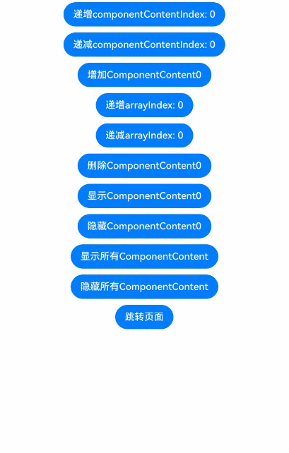
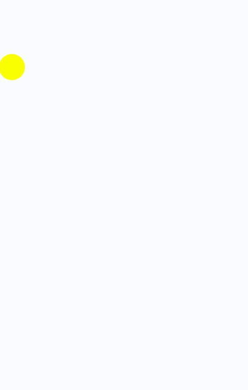
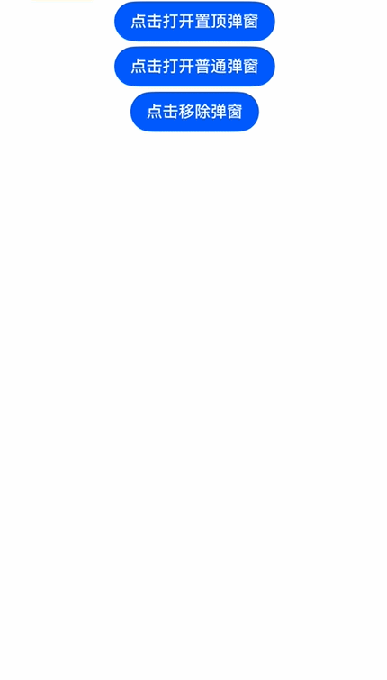
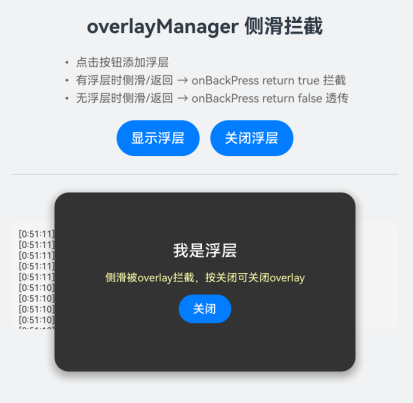

# 设置浮层（OverlayManager）
<!--Kit: ArkUI-->
<!--Subsystem: ArkUI-->
<!--Owner: @liyi0309-->
<!--Designer: @liyi0309-->
<!--Tester: @lxl007-->
<!--Adviser: @Brilliantry_Rui-->

浮层（OverlayManager）用于在页面（Page）之上展示自定义的UI内容，位于Dialog、Popup、Menu、BindSheet、BindContentCover和Toast等组件之下，展示范围为当前窗口的安全区内，适用于常驻悬浮等场景。


可以通过使用[UIContext](../reference/apis-arkui/arkts-apis-uicontext-uicontext.md)中的[getOverlayManager](../reference/apis-arkui/arkts-apis-uicontext-uicontext.md#getoverlaymanager12)方法获取当前UI上下文关联的[OverlayManager](../reference/apis-arkui/arkts-apis-uicontext-overlaymanager.md)对象，再通过该对象调用对应方法。

## 规格约束

* OverlayManager上节点的层级在Page页面层级之上，在Dialog、Popup、Menu、BindSheet、BindContentCover和Toast等组件之下。
* OverlayManager添加的节点显示和消失时没有默认动画。
* OverlayManager上节点安全区域内外的绘制方式与Page一致，键盘避让方式与Page一致。
* 推荐使用AppStorage存储与OverlayManager相关的属性，以避免页面切换时属性值变化导致业务错误。
* 当使用API version 19以下版本时，OverlayManager不支持侧滑（左滑/右滑）关闭，需在[onBackPress](../reference/apis-arkui/arkui-ts/ts-custom-component-lifecycle.md#onbackpress)中添加OverlayManager关闭的逻辑。API 19及以上版本可通过配置[OverlayManagerOptions](../reference/apis-arkui/arkts-apis-uicontext-i.md#overlaymanageroptions15)中的enableBackPressedEvent属性设置OverlayManager是否响应侧滑手势。
* OverlayManager中的事件机制优先被[WrappedBuilder](state-management/arkts-wrapBuilder.md)装饰的组件接收。若需实现浮层底部接收事件，可通过设置[hitTestBehavior](../reference/apis-arkui/arkui-ts/ts-universal-attributes-hit-test-behavior.md#hittestbehavior)为HitTestMode.Transparent将事件传递至底层。

## 设置浮层

在OverlayManager上新增指定节点（[addComponentContent](../reference/apis-arkui/arkts-apis-uicontext-overlaymanager.md#addcomponentcontent12)）、删除指定节点（[removeComponentContent](../reference/apis-arkui/arkts-apis-uicontext-overlaymanager.md#removecomponentcontent12)）、显示所有节点（[showAllComponentContents](../reference/apis-arkui/arkts-apis-uicontext-overlaymanager.md#showallcomponentcontents12)）和隐藏所有节点（[hideAllComponentContents](../reference/apis-arkui/arkts-apis-uicontext-overlaymanager.md#hideallcomponentcontents12)）。

<!-- @[OverlayManager_Demo](https://gitcode.com/openharmony/applications_app_samples/blob/master/code/DocsSample/ArkUISample/DialogProject/entry/src/main/ets/pages/OverlayManager/OverlayManagerComponent.ets) -->

``` TypeScript
import { ComponentContent, OverlayManager } from '@kit.ArkUI';
import { hilog } from '@kit.PerformanceAnalysisKit';

const TAG: string = '[Sample_dialogproject]';
const DOMAIN: number = 0xFF00;

class Params {
  public text: string = '';
  public offset: Position;

  constructor(text: string, offset: Position) {
    this.text = text;
    this.offset = offset;
  }
}

@Builder
function builderText(params: Params) {
  Column() {
    Text(params.text)
      .fontSize(30)
      .fontWeight(FontWeight.Bold)
  }.offset(params.offset)
}

@Entry
@Component
export struct OverlayManagerComponent {
  @State message: string = 'ComponentContent';
  private uiContext: UIContext = this.getUIContext();
  private overlayNode: OverlayManager = this.uiContext.getOverlayManager();
  @StorageLink('contentArray') contentArray: ComponentContent<Params>[] = [];
  @StorageLink('componentContentIndex') componentContentIndex: number = 0;
  @StorageLink('arrayIndex') arrayIndex: number = 0;
  @StorageLink('componentOffset') componentOffset: Position = { x: 0, y: 30 };

  build() {
    // ...
      Column({ space: 10 }) {
        Button('Increment componentContentIndex:' + this.componentContentIndex)
          .onClick(() => {
            ++this.componentContentIndex;
          })
        Button('Decrement componentContentIndex:' + this.componentContentIndex)
          .onClick(() => {
            --this.componentContentIndex;
          })
        Button('Add ComponentContent:' + this.contentArray.length)
          .onClick(() => {
            let componentContent = new ComponentContent(
              this.uiContext, wrapBuilder<[Params]>(builderText),
              new Params(this.message + (this.contentArray.length), this.componentOffset)
            )
            this.contentArray.push(componentContent);
            this.overlayNode.addComponentContent(componentContent, this.componentContentIndex);
          })
        Button('Increment arrayIndex:' + this.arrayIndex)
          .onClick(() => {
            ++this.arrayIndex;
          })
        Button('Decrement arrayIndex:' + this.arrayIndex)
          .onClick(() => {
            --this.arrayIndex;
          })
        Button('Delete ComponentContent:' + this.arrayIndex)
          .onClick(() => {
            if (this.arrayIndex >= 0 && this.arrayIndex < this.contentArray.length) {
              let componentContent = this.contentArray.splice(this.arrayIndex, 1);
              this.overlayNode.removeComponentContent(componentContent.pop());
            } else {
              hilog.info(DOMAIN, TAG, '%{public}s', 'arrayIndex error');
            }
          })
        Button('Show ComponentContent:' + this.arrayIndex)
          .onClick(() => {
            if (this.arrayIndex >= 0 && this.arrayIndex < this.contentArray.length) {
              let componentContent = this.contentArray[this.arrayIndex];
              this.overlayNode.showComponentContent(componentContent);
            } else {
              hilog.info(DOMAIN, TAG, '%{public}s', 'arrayIndex error');
            }
          })
        Button('Hide ComponentContent:' + this.arrayIndex)
          .onClick(() => {
            if (this.arrayIndex >= 0 && this.arrayIndex < this.contentArray.length) {
              let componentContent = this.contentArray[this.arrayIndex];
              this.overlayNode.hideComponentContent(componentContent);
            } else {
              hilog.info(DOMAIN, TAG, '%{public}s', 'arrayIndex error');
            }
          })
        Button('Show All ComponentContent')
          .onClick(() => {
            this.overlayNode.showAllComponentContents();
          })
        Button('Hide All ComponentContent')
          .onClick(() => {
            this.overlayNode.hideAllComponentContents();
          })

        Button('Go')
          .onClick(() => {
            this.getUIContext().getRouter().pushUrl({
              url: 'pages/Second'
            })
          })
      }
      .width('100%')
      .height('100%')
      // ...
  }
}
```


显示一个始终在屏幕左侧的悬浮球，点击可以弹出alertDialog弹窗。

<!-- @[OverlayManager_Demo2](https://gitcode.com/openharmony/applications_app_samples/blob/master/code/DocsSample/ArkUISample/DialogProject/entry/src/main/ets/pages/OverlayManager/OverlayManagerAlertDialog.ets) -->

``` TypeScript
import { ComponentContent, OverlayManager } from '@kit.ArkUI';

class Params {
  public context: UIContext;
  public offset: Position;
  constructor(context: UIContext, offset: Position) {
    this.context = context;
    this.offset = offset;
  }
}
@Builder
function builderOverlay(params: Params) {
  Column() {
    Stack(){
    }.width(50).height(50).backgroundColor(Color.Yellow).position(params.offset).borderRadius(50)
    .onClick(() => {
      params.context.showAlertDialog(
        {
          title: 'title',
          message: 'Text',
          autoCancel: true,
          alignment: DialogAlignment.Center,
          gridCount: 3,
          confirm: {
            value: 'Button',
            action: () => {}
          },
          cancel: () => {}
        }
      )
    })
  }.focusable(false).width('100%').height('100%').hitTestBehavior(HitTestMode.Transparent)
}

@Entry
@Component
export struct OverlayManagerAlertDialog {
  private uiContext: UIContext = this.getUIContext();
  private overlayNode: OverlayManager = this.uiContext.getOverlayManager();
  private overlayContent: ComponentContent<Params>[] = [];

  aboutToAppear(): void {
    let uiContext = this.getUIContext();
    let componentContent = new ComponentContent(
      this.uiContext, wrapBuilder<[Params]>(builderOverlay),
      new Params(uiContext, {x:0, y: 100})
    );
    this.overlayNode.addComponentContent(componentContent, 0);
    this.overlayContent.push(componentContent);
  }

  aboutToDisappear(): void {
    let componentContent = this.overlayContent.pop();
    this.overlayNode.removeComponentContent(componentContent);
  }

  build() {
    // ...
      Column() {

      }
      .width('100%')
      .height('100%')
    // ...
  }
}
```


从API version 18开始，可以利用OverlayManager对象在指定层级上新增指定节点（[addComponentContentWithOrder](../reference/apis-arkui/arkts-apis-uicontext-overlaymanager.md#addcomponentcontentwithorder18)），层次高的浮层会覆盖在层级低的浮层之上。

<!-- @[OverlayManager_Demo3](https://gitcode.com/openharmony/applications_app_samples/blob/master/code/DocsSample/ArkUISample/DialogProject/entry/src/main/ets/pages/OverlayManager/OverlayManagerWithOrder.ets) -->

``` TypeScript
import { ComponentContent, LevelOrder, OverlayManager } from '@kit.ArkUI';
import { hilog } from '@kit.PerformanceAnalysisKit';

const TAG: string = '[Sample_dialogproject]';
const DOMAIN: number = 0xFF00;

class Params {
  public text: string = '';
  public offset: Position;

  constructor(text: string, offset: Position) {
    this.text = text;
    this.offset = offset;
  }
}

@Builder
function builderTopText(params: Params) {
  Column() {
    Stack() {
      Text(params.text)
        .fontSize(30)
        .fontWeight(FontWeight.Bold)
    }
    .width(300)
    .height(200)
    .padding(5)
    .backgroundColor('#F7F7F7')
    .alignContent(Alignment.Top)
  }.offset(params.offset)
}

@Builder
function builderNormalText(params: Params) {
  Column() {
    Stack() {
      Text(params.text)
        .fontSize(30)
        .fontWeight(FontWeight.Bold)
    }
    .width(300)
    .height(400)
    .padding(5)
    .backgroundColor('#D5D5D5')
    .alignContent(Alignment.Top)
  }.offset(params.offset)
}

@Entry
@Component
export struct OverlayManagerWithOrder {
  private ctx: UIContext = this.getUIContext();
  private overlayManager: OverlayManager = this.ctx.getOverlayManager();
  @StorageLink('contentArray') contentArray: ComponentContent<Params>[] = [];
  @StorageLink('componentContentIndex') componentContentIndex: number = 0;
  @StorageLink('arrayIndex') arrayIndex: number = 0;
  @StorageLink('componentOffset') componentOffset: Position = { x: 0, y: 80 };

  build() {
    // ...
      Row() {
        Column({ space: 5 }) {
          Button('Open Top-Level Dialog Box')
            .onClick(() => {
              let componentContent = new ComponentContent(
                this.ctx, wrapBuilder<[Params]>(builderTopText),
                new Params('I am a top-level dialog box', this.componentOffset)
              );
              this.contentArray.push(componentContent);
              this.overlayManager.addComponentContentWithOrder(componentContent, LevelOrder.clamp(100000));
            })
          Button('Open Normal Dialog Box')
            .onClick(() => {
              let componentContent = new ComponentContent(
                this.ctx, wrapBuilder<[Params]>(builderNormalText),
                new Params('I am a normal dialog box', this.componentOffset)
              );
              this.contentArray.push(componentContent);
              this.overlayManager.addComponentContentWithOrder(componentContent, LevelOrder.clamp(0));
            })
          Button('Remove Dialog Box').onClick(() => {
            if (this.arrayIndex >= 0 && this.arrayIndex < this.contentArray.length) {
              let componentContent = this.contentArray.splice(this.arrayIndex, 1);
              this.overlayManager.removeComponentContent(componentContent.pop());
            } else {
              hilog.info(DOMAIN, TAG, '%{public}s', 'arrayIndex error');
            }
          })
        }.width('100%')
      }
      // ...
  }
}
```


从API版本26.0.0开始，可通过设置[OverlayManagerOptions](../reference/apis-arkui/arkts-apis-uicontext-i.md#overlaymanageroptions15)中的onBackPress回调拦截Overlay的侧滑返回事件。当enableBackPressedEvent设置为true并注册onBackPress回调时，侧滑返回事件不会自动关闭Overlay，而是调用该回调由开发者决定是否拦截：返回true表示拦截该事件（事件被消费，不会向下层传递），返回false表示事件向下层组件透传。该回调需在调用getOverlayManager之前通过[setOverlayManagerOptions](../reference/apis-arkui/arkts-apis-uicontext-uicontext.md#setoverlaymanageroptions15)设置。

<!-- @[OverlayManager_Demo4](https://gitcode.com/openharmony/applications_app_samples/blob/master/code/DocsSample/ArkUISample/DialogProject/entry/src/main/ets/pages/OverlayManager/OverlayManagerOnBackPress.ets) -->

``` TypeScript
import { ComponentContent, OverlayManagerOptions } from '@kit.ArkUI'
import { BusinessError } from '@kit.BasicServicesKit';

class FloatParams {
  public message: string = ''
  public onDismiss: () => void = () => {}

  constructor(message: string, onDismiss: () => void) {
    this.message = message
    this.onDismiss = onDismiss
  }
}

@Builder
function floatBuilder(params: FloatParams) {
  Column({ space: 12 }) {
    Text(params.message)
      .fontSize(18)
      .fontWeight(FontWeight.Medium)
      .fontColor(Color.White)

    Text('侧滑被overlay拦截，按关闭可关闭overlay')
      .fontSize(12)
      .fontColor('#FFFFFFAA')

    Button('关闭')
      .height(32)
      .fontSize(13)
      .fontColor(Color.White)
      .onClick(() => params.onDismiss())
  }
  .width('70%')
  .height(200)
  .justifyContent(FlexAlign.Center)
  .borderRadius(16)
  .backgroundColor('#333333')
  .shadow({ radius: 20, color: '#66000000', offsetX: 0, offsetY: 6 })
}

@Entry
@Component
export struct OverlayManagerOnBackPress {
  @State showStatus: string = '无浮层';
  @State logText: string = '';
  private floatContent: ComponentContent<FloatParams> | null = null;
  private optionsSet: boolean = false;

  // 追加一条日志，最新日志显示在最上方，便于观察onBackPress的拦截与透传。
  addLog(msg: string): void {
    let now = new Date();
    let ts = `${now.getHours()}:${now.getMinutes()}:${now.getSeconds()}`;
    this.logText = `[${ts}] ${msg}\n` + this.logText;
  }

  // 通过setOverlayManagerOptions设置enableBackPressedEvent为true并注册onBackPress回调，
  // 即可拦截Overlay的侧滑返回事件。返回true表示拦截（事件被消费，不会向下层传递）；
  // 返回false表示不拦截，事件向下层组件透传。
  ensureOptions(): void {
    if (this.optionsSet) {
      return;
    }
    let ctx = this.getUIContext();
    let ret = ctx.setOverlayManagerOptions({
      enableBackPressedEvent: true,
      onBackPress: (): boolean => {
        if (this.floatContent !== null) {
          this.addLog('onBackPress → 有浮层, return TRUE (拦截)');
          try {
            this.getUIContext().getPromptAction().showToast({
              message: 'backPress事件被overlay拦截',
              duration: 2000
            });
          } catch (error) {
            let message = (error as BusinessError).message;
            let code = (error as BusinessError).code;
            console.error(`showToast args error code is ${code}, message is ${message}`);
          }
          return true;
        }
        this.addLog('onBackPress → 无浮层, return FALSE (透传)');
        return false;
      }
    } as OverlayManagerOptions);
    this.optionsSet = ret;
    this.addLog(`setOverlayManagerOptions: ${ret}`);
  }

  showFloat(): void {
    if (this.floatContent !== null) {
      this.addLog('浮层已存在');
      return;
    }
    this.ensureOptions();
    let ctx = this.getUIContext();
    let om = ctx.getOverlayManager();
    let params = new FloatParams('我是浮层', () => { this.dismissFloat(); });
    this.floatContent = new ComponentContent(ctx, wrapBuilder<[FloatParams]>(floatBuilder), params);
    om.addComponentContent(this.floatContent);
    this.showStatus = '浮层显示中';
    this.addLog('打开浮层');
  }

  dismissFloat(): void {
    if (this.floatContent === null) {
      return;
    }
    let ctx = this.getUIContext();
    let om = ctx.getOverlayManager();
    om.removeComponentContent(this.floatContent!);
    this.floatContent = null;
    this.showStatus = '无浮层';
    this.addLog('关闭浮层');
  }

  aboutToDisappear(): void {
    this.dismissFloat();
  }

  build() {
    // ...
      Column({ space: 16 }) {
        Text('overlayManager 侧滑拦截')
          .fontSize(22)
          .fontWeight(FontWeight.Bold)

        Text('• 点击按钮添加浮层\n• 有浮层时侧滑/返回 → onBackPress return true 拦截\n• 无浮层时侧滑/返回 → onBackPress return false 透传')
          .fontSize(13)
          .fontColor('#666666')
          .lineHeight(20)

        Row({ space: 12 }) {
          Button('显示浮层')
            .fontSize(15)
            .height(40)
            .onClick(() => this.showFloat())

          Button('关闭浮层')
            .fontSize(15)
            .height(40)
            .onClick(() => this.dismissFloat())
        }

        Divider().margin({ top: 4, bottom: 4 })

        Text(`状态: ${this.showStatus}`)
          .fontSize(14)
          .fontWeight(FontWeight.Medium)

        Scroll() {
          Text(this.logText)
            .fontSize(10)
            .fontColor('#333333')
            .width('100%')
        }
        .height(120)
        .width('100%')
        .backgroundColor('#F5F5F5')
        .borderRadius(8)
        .padding(8)
      }
      .width('100%')
      .height('100%')
      .padding(24)
      // ...
  }
}
```

