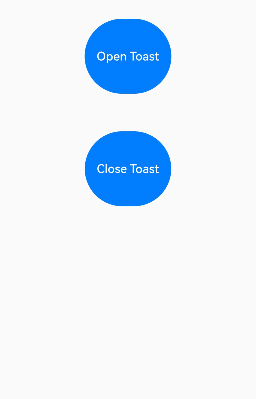

# 即时反馈（Toast）
<!--Kit: ArkUI-->
<!--Subsystem: ArkUI-->
<!--Owner: @liyi0309-->
<!--SE: @liyi0309-->
<!--TSE: @lxl007-->

即时反馈（Toast）是一种临时性的消息提示框，用于向用户显示简短的操作反馈或状态信息。​它通常在屏幕的底部或顶部短暂弹出，随后在一段时间后自动消失。即时反馈的主要目的是提供简洁、不打扰的信息反馈，避免干扰用户当前的操作流程。


可以通过使用[UIContext](../reference/apis-arkui/arkts-apis-uicontext-uicontext.md)中的[getPromptAction](../reference/apis-arkui/arkts-apis-uicontext-uicontext.md#getpromptaction)方法获取当前UI上下文关联的[PromptAction](../reference/apis-arkui/arkts-apis-uicontext-promptaction.md)对象，再通过该对象调用[showToast](../reference/apis-arkui/arkts-apis-uicontext-promptaction.md#showtoast)创建并显示文本提示框。

> **说明：** 
>
> 为了安全考虑，例如Toast恶意遮挡其他页面，Toast只能显示在当前的UI实例中，应用退出后，不会单独显示在桌面上。

## 使用建议

 - 合理使用弹出场景，避免过度提醒用户。

    可以针对以下常用场景使用即时反馈操作，例如，当用户执行某个操作时及时结果反馈，用来提示用户操作是否成功或失败；或是当应用程序的状态发生变化时提供状态更新等。

 - 注意文本的信息密度，即时反馈展示时间有限，应当避免长文本的出现。

   Toast控件的文本应该清晰可读，字体大小和颜色应该与应用程序的主题相符。除此之外，即时反馈控件本身不应该包含任何可交互的元素，如按钮或链接。

 - 杜绝强制占位和密集弹出的提示。

   即时反馈作为应用内的轻量通知，应当避免内容布局占用界面内的其他元素信息，如遮盖弹出框的展示内容，从而迷惑用户弹出的内容是否属于弹出框。再或者频繁性的弹出信息内容，且每次弹出之间无时间间隔，影响用户的正常使用。也不要在短时间内频繁弹出新的即时反馈替代上一个。即时反馈的单次显示时长不要超过 3 秒钟，避免影响用户正常的行为操作。

 - 遵从系统默认弹出位置。

   即时反馈在系统中默认从界面底部弹出，距离底部有一定的安全间距，作为系统性的应用内提示反馈，请遵守系统默认效果，避免与其他弹出类组件内容重叠。特殊场景下可对内容布局进行规避。

 - 弹框字体最大放大倍数限制。

   即时反馈中，字体的最大放大倍数为2。

## 即时反馈模式对比

即时反馈提供了两种显示模式，分别为DEFAULT（显示在应用内）、TOP\_MOST（显示在应用之上）。

在TOP_MOST类型的Toast显示前，会创建一个全屏大小的子窗（手机上子窗大小和主窗大小一致），然后在该子窗上计算Toast的布局位置，最后显示在该子窗上。具体和DEFAULT模式Toast的差异如下：

| 差异点| DEFAULT | TOP_MOST |
| --- | --- | --- |
| 是否创建子窗	 | 否 | 是 |
| 层级 | 显示在主窗内，层级和主窗一致，一般比较低 | 显示在子窗中，一般比主窗层级高，比其他弹窗类组件层级高，比软键盘和权限弹窗层级低 |
| 是否避让软键盘 | 软键盘抬起时，必定上移软键盘的高度 | 软键盘抬起时，只有toast被遮挡时，才会避让，且避让后toast底部距离软键盘高度为80vp |
| UIExtension内布局 | 以UIExtension为主窗中布局，对齐方式与UIExtension对齐 | 以宿主窗口为主窗中布局，对齐方式与宿主窗口对齐 |

```ts
import { promptAction } from '@kit.ArkUI';

@Entry
@Component
struct Index {
  build() {
    Column({ space: 10 }) {
      TextInput()
      Button() {
        Text("DEFAULT类型Toast")
          .fontSize(20)
          .fontWeight(FontWeight.Bold)

      }
      .width('100%')
      .onClick(() => {
        this.getUIContext().getPromptAction().showToast({
          message: "ok，我是DEFAULT toast",
          duration: 2000,
          showMode: promptAction.ToastShowMode.DEFAULT,
          bottom: 80
        });
      })

      Button() {
        Text("TOPMOST类型Toast")
          .fontSize(20)
          .fontWeight(FontWeight.Bold)

      }
      .width('100%')
      .onClick(() => {
        this.getUIContext().getPromptAction().showToast({
          message: "ok，我是TOP_MOST toast",
          duration: 2000,
          showMode: promptAction.ToastShowMode.TOP_MOST,
          bottom: 85
        });
      })
    }
  }
}
```

## 创建即时反馈

适用于短时间内提示框自动消失的场景。

```ts
import { PromptAction } from '@kit.ArkUI';
import { BusinessError } from '@kit.BasicServicesKit';

@Entry
@Component
struct toastExample {
  private uiContext: UIContext = this.getUIContext();
  private promptAction: PromptAction = this.uiContext.getPromptAction();

  build() {
    Column() {
      Button('Show toast').fontSize(20)
        .onClick(() => {
          try {
            this.promptAction.showToast({
              message: 'Hello World',
              duration: 2000
            })
          } catch (error) {
            let message = (error as BusinessError).message;
            let code = (error as BusinessError).code;
            console.error(`showToast args error code is ${code}, message is ${message}`);
          };
        })
    }.height('100%').width('100%').justifyContent(FlexAlign.Center)
  }
}
```


## 显示关闭即时反馈

适用于提示框提留时间较长，用户操作可以提前关闭提示框的场景。

```ts
import { LengthMetrics, PromptAction } from '@kit.ArkUI';
import { BusinessError } from '@kit.BasicServicesKit';

@Entry
@Component
struct toastExample {
  @State toastId: number = 0;
  private uiContext: UIContext = this.getUIContext();
  private promptAction: PromptAction = this.uiContext.getPromptAction();

  build() {
    Column() {
      Button('Open Toast')
        .type(ButtonType.Capsule)
        .height(100)
        .onClick(() => {
          try {
            this.promptAction.openToast({
              message: 'Toast Massage',
              duration: 10000,
            }).then((toastId: number) => {
              this.toastId = toastId;
            });
          } catch (error) {
            let message = (error as BusinessError).message;
            let code = (error as BusinessError).code;
            console.error(`OpenToast error code is ${code}, message is ${message}`);
          };
        })
      Blank().height(50);
      Button('Close Toast')
        .height(100)
        .type(ButtonType.Capsule)
        .onClick(() => {
          try {
            this.promptAction.closeToast(this.toastId);
          } catch (error) {
            let message = (error as BusinessError).message;
            let code = (error as BusinessError).code;
            console.error(`CloseToast error code is ${code}, message is ${message}`);
          };
        })
    }.height('100%').width('100%').justifyContent(FlexAlign.Center)
  }
}
```




