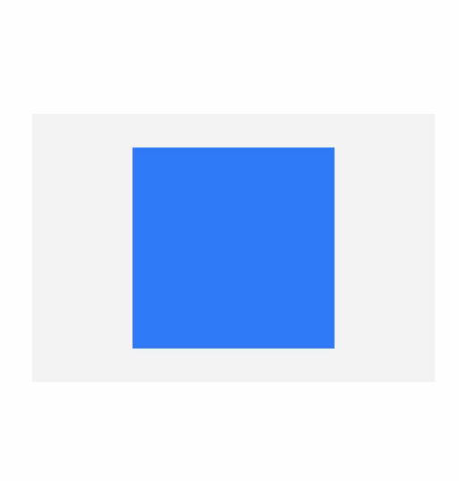

# 自定义属性动画


属性动画是可动画属性的参数值发生变化时，引起UI上产生的连续视觉效果。当参数值发生连续变化，且设置到可以引起UI发生变化的属性接口上时，就可以实现属性动画。


ArkUI提供[@AnimatableExtend装饰器](../quick-start/arkts-animatable-extend.md)，用于自定义可动画属性接口。由于参数的数据类型必须具备一定程度的连续性，自定义可动画属性接口的参数类型仅支持number类型和实现[AnimatableArithmetic\<T>接口](../quick-start/arkts-animatable-extend.md#animatablearithmetict接口说明)的自定义类型。通过自定义可动画属性接口和可动画数据类型，在使用animateTo或animation执行动画时，通过逐帧回调函数修改不可动画属性接口的值，能够让不可动画属性接口实现动画效果。也可通过逐帧回调函数每帧修改可动画属性的值，实现逐帧布局的效果。


## 使用number数据类型和\@AnimatableExtend装饰器改变Text组件宽度实现逐帧布局的效果


```ts
// 第一步：使用@AnimatableExtend装饰器，自定义可动画属性接口
@AnimatableExtend(Text)
function animatableWidth(width: number) {
  .width(width) // 调用系统属性接口，逐帧回调函数每帧修改可动画属性的值，实现逐帧布局的效果。
}

@Entry
@Component
struct AnimatablePropertyExample {
  @State textWidth: number = 80;

  build() {
    Column() {
      Text("AnimatableProperty")
        .animatableWidth(this.textWidth)// 第二步：将自定义可动画属性接口设置到组件上
        .animation({ duration: 2000, curve: Curve.Ease }) // 第三步:为自定义可动画属性接口绑定动画
      Button("Play")
        .onClick(() => {
          this.textWidth = this.textWidth == 80 ? 160 : 80; // 第四步：改变自定义可动画属性的参数，产生动画
        })
    }.width("100%")
    .padding(10)
  }
}
```


## 使用自定义数据类型和\@AnimatableExtend装饰器改变图形形状


```ts
declare type Point = number[];

// 定义可动画属性接口的参数类型，实现AnimatableArithmetic<T>接口中加法、减法、乘法和判断相等函数
class PointClass extends Array<number> {
  constructor(value: Point) {
    super(value[0], value[1])
  }

  add(rhs: PointClass): PointClass {
    let result: Point = new Array<number>() as Point;
    for (let i = 0; i < 2; i++) {
      result.push(rhs[i] + this[i])
    }
    return new PointClass(result);
  }

  subtract(rhs: PointClass): PointClass {
    let result: Point = new Array<number>() as Point;
    for (let i = 0; i < 2; i++) {
      result.push(this[i] - rhs[i]);
    }
    return new PointClass(result);
  }

  multiply(scale: number): PointClass {
    let result: Point = new Array<number>() as Point;
    for (let i = 0; i < 2; i++) {
      result.push(this[i] * scale)
    }
    return new PointClass(result);
  }
}

// 定义可动画属性接口的参数类型，实现AnimatableArithmetic<T>接口中加法、减法、乘法和判断相等函数
// 模板T支持嵌套实现AnimatableArithmetic<T>的类型
class PointVector extends Array<PointClass> implements AnimatableArithmetic<Array<Point>> {
  constructor(initialValue: Array<Point>) {
    super();
    if (initialValue.length) {
      initialValue.forEach((p: Point) => this.push(new PointClass(p)))
    }
  }

  // implement the IAnimatableArithmetic interface
  plus(rhs: PointVector): PointVector {
    let result = new PointVector([]);
    const len = Math.min(this.length, rhs.length)
    for (let i = 0; i < len; i++) {
      result.push(this[i].add(rhs[i]))
    }
    return result;
  }

  subtract(rhs: PointVector): PointVector {
    let result = new PointVector([]);
    const len = Math.min(this.length, rhs.length)
    for (let i = 0; i < len; i++) {
      result.push(this[i].subtract(rhs[i]))
    }
    return result;
  }

  multiply(scale: number): PointVector {
    let result = new PointVector([]);
    for (let i = 0; i < this.length; i++) {
      result.push(this[i].multiply(scale))
    }
    return result;
  }

  equals(rhs: PointVector): boolean {
    if (this.length !== rhs.length) {
      return false;
    }
    for (let index = 0, size = this.length; index < size; ++index) {
      if (this[index][0] !== rhs[index][0] || this[index][1] !== rhs[index][1]) {
        return false;
      }
    }
    return true;
  }
}

// 自定义可动画属性接口
@AnimatableExtend(Polyline)
function animatablePoints(points: PointVector) {
  .points(points)
}

@Entry
@Component
struct AnimatedShape {
  squareStartPointX: number = 75;
  squareStartPointY: number = 25;
  squareWidth: number = 150;
  squareEndTranslateX: number = 50;
  squareEndTranslateY: number = 50;
  @State pointVec1: PointVector = new PointVector([
    [this.squareStartPointX, this.squareStartPointY],
    [this.squareStartPointX + this.squareWidth, this.squareStartPointY],
    [this.squareStartPointX + this.squareWidth, this.squareStartPointY + this.squareWidth],
    [this.squareStartPointX, this.squareStartPointY + this.squareWidth]
  ]);
  @State pointVec2: PointVector = new PointVector([
    [this.squareStartPointX + this.squareEndTranslateX, this.squareStartPointY + this.squareStartPointY],
    [this.squareStartPointX + this.squareWidth + this.squareEndTranslateX,
      this.squareStartPointY + this.squareStartPointY],
    [this.squareStartPointX + this.squareWidth, this.squareStartPointY + this.squareWidth],
    [this.squareStartPointX, this.squareStartPointY + this.squareWidth]
  ]);
  @State color: Color = Color.Green;
  @State fontSize: number = 20.0;
  @State polyline1Vec: PointVector = this.pointVec1;
  @State polyline2Vec: PointVector = this.pointVec2;

  build() {
    Row() {
      Polyline()
        .width(300)
        .height(200)
        .backgroundColor("#0C000000")
        .fill('#317AF7')
        .animatablePoints(this.polyline1Vec)
        .animation({ duration: 2000, delay: 0, curve: Curve.Ease })
        .onClick(() => {

          if (this.polyline1Vec.equals(this.pointVec1)) {
            this.polyline1Vec = this.pointVec2;
          } else {
            this.polyline1Vec = this.pointVec1;
          }
        })
    }
    .width('100%').height('100%').justifyContent(FlexAlign.Center)
  }
}
```




## 相关实例

针对自定义属性动画开发，有以下相关实例可供参考：

- [自定义下拉刷新动画（ArkTS）（API9）](https://gitee.com/openharmony/codelabs/tree/master/ETSUI/AnimateRefresh)