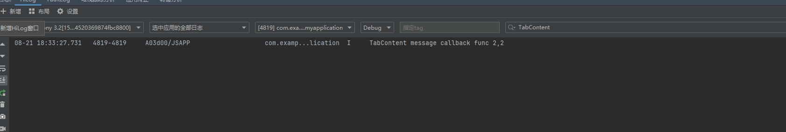

# \@CustomEnv：自定义环境变量
<!--Kit: ArkUI-->
<!--Subsystem: ArkUI-->
<!--Owner: @liwenzhen3-->
<!--Designer: @s10021109-->
<!--Tester: @songyanhong-->
<!--Adviser: @zhang_yixin13-->

[\@CustomEnv](../reference/apis-arkui/arkui-ts/ts-custom-env-property.md#customenv)可用于获取自定义环境变量。开发者可通过[WithEnv](../reference/apis-arkui/arkui-ts/ts-container-with-env.md)组件的[.customEnv](../reference/apis-arkui/arkui-ts/ts-container-with-env.md#customenv)接口设置自定义环境变量，在子组件中通过[\@CustomEnv](../reference/apis-arkui/arkui-ts/ts-custom-env-property.md#customenv)装饰器读取相同[CustomEnvKey\<S\>](../reference/apis-arkui/arkui-ts/ts-custom-env-property.md#customenvkeys)对应的变量值。该机制实现了组件树间的数据透传，使父子组件能基于环境变量进行联动，同时保持代码解耦。

>**说明：**
>
> 从API版本26.0.0开始，[\@CustomEnv](../reference/apis-arkui/arkui-ts/ts-custom-env-property.md#customenv)支持在[\@Component](./state-management/arkts-create-custom-components.md#component)和[\@ComponentV2](./state-management/arkts-create-custom-components.md#componentv2)中使用。
>
> 从API版本26.0.0开始，该装饰器支持在原子化服务中使用。

## 概述
[\@CustomEnv](../reference/apis-arkui/arkui-ts/ts-custom-env-property.md#customenv)是响应式自定义环境变量装饰器，其功能包括：
- 根据入参读取相应的自定义环境变量信息，详情见[\@CustomEnv使用方法](#customenv使用方法)。
- 自定义环境变量改变时，通知\@CustomEnv装饰的变量更新，并触发\@CustomEnv关联组件刷新，以实现界面内容的更新。
- 使用\@CustomEnv装饰的变量具有只读特性，不允许开发者在初始化后对\@CustomEnv装饰的变量做整体赋值。如需更新该变量的值，必须通过父组件的WithEnv组件配合`.customEnv()`方法进行更新。尝试对\@CustomEnv变量赋值将导致编译错误。

开发者可以使用\@CustomEnv装饰器，并传入一个自定义的key，来声明响应式环境变量。示例请参考:[支持自定义key和value](#支持自定义key和value)。
## \@CustomEnv使用方法

### 装饰器说明

| \@CustomEnv装饰器 | 说明 |
| ------------------- | ------------------------------------------------------------ |
| 装饰器参数 | [\@CustomEnv](../reference/apis-arkui/arkui-ts/ts-custom-env-property.md#customenv)装饰器的入参必须为[CustomEnvKey\<S\>](../reference/apis-arkui/arkui-ts/ts-custom-env-property.md#customenvkeys)类型。 |
| 可装饰的变量类型 | Object、class、string、number、boolean、enum等基本类型以及Array、Date、Map、Set等内置类型。支持null、undefined以及联合类型。 |
| 装饰变量的初始值 | 必须本地初始化，不允许外部传入初始化。 |

### 变量传递

| 传递规则       | 说明                                                         |
| -------------- | ------------------------------------------------------------ |
| 从父组件初始化 | \@CustomEnv装饰的变量仅允许本地初始化，无法从外部传入初始化。    |
| \@CustomEnv装饰的变量初始化 | 初始化\@CustomEnv装饰的变量时，会优先向上递归查找父组件中通过WithEnv.customEnv注入的相同key的值；若找到，则使用该注入值，否则使用本地初始化值。|

### 观察变化

当点击更新按钮导致\@Local装饰的变量值发生变化时，WithEnv组件中通过.customEnv()方法设置的值也会通知\@CustomEnv，此时子组件中\@CustomEnv装饰的变量将更新最新值并触发界面重新渲染，实现了完整的响应式更新链路。示例请参考:[响应式更新能力](#响应式更新能力)。


## \@CustomEnv和\@Env能力对比
\@CustomEnv和[\@Env](./arkts-env-system-property.md)都是环境变量相关，具体能力对比见下表。

| 能力 | \@CustomEnv | \@Env|
| ------------------ | ------------------ | ------------------ |
|起始API version|从API版本26.0.0开始支持。|从API version 22开始支持。|
|支持参数|开发者自定义的CustomEnvKey类型对象。|[SystemProperties的枚举值](./arkts-env-system-property.md#env支持参数)。<br/>API版本26.0.0之后支持[SystemProperties](./arkts-env-system-property.md#env支持参数)\|[SystemEnvKey\<T\>](./arkts-env-system-property.md#env支持参数)类型参数。|
|使用形式|\@CustomEnv为装饰器，可声明在\@Component或\@ComponentV2中，开发者通过WithEnv的customEnv接口设置的环境变量|\@Env为装饰器，可声明在\@Component或\@ComponentV2中，直接读取系统环境变量。<br/>API版本26.0.0之后，开发者可通过WithEnv的env接口设置[SystemEnvKey\<T\>](./arkts-env-system-property.md#env支持参数)类型参数的系统环境变量。|
|值的来源|初始化给定默认值或通过WithEnv组件的.customEnv()方法设置。|通过WithEnv的env接口设置的系统环境变量。|
|是否有响应式能力|有，当WithEnv设置的值变化时，会通知\@CustomEnv装饰的变量更新，并通知关联组件刷新。|有，当系统环境变量变化时，会通知\@Env装饰的变量更新，并通知关联组件刷新。|

## 限制条件
- \@CustomEnv仅支持在\@Component和\@ComponentV2中使用，否则会有编译报错。
```ts

const custom = CustomEnvKey.create<string>();
// 错误用法，编译报错
class CustomEnvKey {
  @CustomEnv(custom) customVarName: string = 'hello world'; 
}
// 正确用法
@Entry
@Component
struct Index {
  @CustomEnv(custom) customVarName: string = 'hello world'; 

  build() {
    Column() {
      Text(`this is @CustomEnv page`)
    }
  }
}
```

- \@CustomEnv的入参必须是通过[CustomEnvKey\<S\>](../reference/apis-arkui/arkui-ts/ts-custom-env-property.md#customenvkeys)的[create\<T\>](../reference/apis-arkui/arkui-ts/ts-custom-env-property.md#createt)方法创建的全局常量，且类型为开发者自定义的CustomEnvKey\<S\>，否则会编译报错，若开发者绕过编译检查，则会运行时报错。

```ts
const custom = CustomEnvKey.create<string>();
@Entry
@Component
struct Index {
  @CustomEnv(custom) customVarName: string = 'hello world'; // 正确用法
  // cus: CustomEnvKey<string> = CustomEnvKey.create<string>()
  // @CustomEnv(this.cus) customVarName: string = 'hello world';  // 错误用法，会编译报错

  build() {
    Column() {
      Text(`this is @CustomEnv page`)
    }
  }
}
```

- \@CustomEnv装饰的变量为只读属性，不允许开发者进行赋值操作，否则会有编译报错。
```ts
import { WithEnv, WithEnvAttribute } from '@kit.ArkUI';

const custom = CustomEnvKey.create<string>();

@Entry
@ComponentV2
struct Index {
  @CustomEnv(custom) customVarName: string = 'hello world';
  @Local newVarName: string = 'customMessage';

  build() {
    Column() {
      Button('update')
        .onClick(() => {
          this.customVarName = 'Change Message'; // 错误用法，编译报错
        })

      WithEnv() {
        Child()
      }.customEnv(custom, this.newVarName)

    }
  }
}
```

- \@CustomEnv装饰的变量不能通过父组件传参进行初始化；若在组件实例化时以参数形式赋值，编译阶段会进行拦截并报错。
```ts

const custom = CustomEnvKey.create<string>();

@Entry
@ComponentV2
struct PageOne {
  @CustomEnv(custom) defaultMessage: string = 'Hello';

  build() {
    Column() {
      Child({ firstValue: this.defaultMessage }) // 错误用法，编译报错
    }
  }
}

@ComponentV2
struct Child {
  @CustomEnv(custom) firstValue: string = 'world';

  build() {
    Column() {
      Text(this.firstValue)
    }
  }
}
```

- \@CustomEnv不会向上查找\@Component/\@ComponentV2中相同Key的\@CustomEnv设置的值。
```ts

const custom = CustomEnvKey.create<string>();

@Entry
@ComponentV2
struct Index {
  @CustomEnv(custom) customMessage: string = 'parent';

  build() {
    Column() {
      Child()
    }
  }
}

@ComponentV2
struct Child {
  @CustomEnv(custom) customMessage: string = 'child';

  build() {
    Column() {
      Text(`Child: ${this.customMessage}`);
    }
  }
}
```

## \@CustomEnv初始化流程

\@CustomEnv变量初始化遵循以下流程：

1. 查找WithEnv组件中是否存在对应的key：
   - 判断当前父组件是否为WithEnv组件。
   - 若不是，则继续向上查找，直至根节点。
   - 若找到对应key的WithEnv组件，则获取组件提供的环境变量值，赋值给\@CustomEnv装饰的变量。
2. 使用\@CustomEnv声明的变量初始值：
   - 若未找到对应的key的WithEnv组件，则使用\@CustomEnv装饰变量的本地初始值。

流程图如下。


## 使用场景

### 支持自定义key和value

新增的状态管理装饰器\@CustomEnv支持自定义key配置，并且可以指定变量的初始值。语法格式为：`@CustomEnv(custom) customVarName: string = 'hello world'`。其中`custom`为开发者自定义的环境变量key，类型为[CustomEnvKey\<S\>](../reference/apis-arkui/arkui-ts/ts-custom-env-property.md#customenvkeys)，`hello world`为该变量的初始值。

<!-- @[CustomValue]
(https://gitcode.com/openharmony/applications_app_samples/blob/master/code/DocsSample/ArkUISample/CustomEnvSample/entry/src/main/ets/pages/CustomValuePage.ets) -->
```ts

const customString = CustomEnvKey.create<string>();

@Entry
@ComponentV2
struct CustomValue {
  // 1. 实现了定义的key及value
  @CustomEnv(customString) customVarName: string = 'hello world';

  build() {
    Column() {
      Text(`Parent: ${this.customVarName}`)
    }
  }
}
```

运行效果图如下。


### \@CustomEnv支持多种数据类型

\@CustomEnv支持简单类型和复杂类型的变量声明。简单类型包括string、number、boolean、enum等；复杂类型包括class、Object等对象类型。

<!-- @[CustomEnvSupportClass](https://gitcode.com/openharmony/applications_app_samples/blob/master/code/DocsSample/ArkUISample/CustomEnvSample/entry/src/main/ets/pages/CustomEnvValueClassPage.ets) -->
```ts

@ObservedV2
class CustomVal {
  @Trace public id: number = 123;
  @Trace public userName: string = 'admin';
}

const customStr = CustomEnvKey.create<string>();
const customNum = CustomEnvKey.create<number>();
const customBool = CustomEnvKey.create<boolean>();
const customObj = CustomEnvKey.create<CustomVal>();

@Entry
@ComponentV2
struct ClassIndex {
  @CustomEnv(customStr) customStrVarName: string = 'hello world';
  @CustomEnv(customNum) customNumVarName: number = 1;
  @CustomEnv(customBool) customBoolVarName: boolean = true;
  @CustomEnv(customObj) customObjVarName: CustomVal = new CustomVal();

  build() {
    Column() {
      Text(`customStrVarName type is ${typeof this.customStrVarName}`)
      Text(`customNumVarName type is ${typeof this.customNumVarName}`)
      Text(`customBoolVarName type is ${typeof this.customBoolVarName}`)
      Text(`customObjVarName type is ${typeof this.customObjVarName}`)
    }
  }
}
```

运行效果图如下。


### \@CustomEnv支持默认初始值

当子组件中使用\@CustomEnv装饰的变量向上查找环境变量值但未找到匹配的WithEnv组件时，该变量将使用声明时指定的初始值作为默认值。

<!-- @[CustomEnvDefaultValue](https://gitcode.com/openharmony/applications_app_samples/blob/master/code/DocsSample/ArkUISample/CustomEnvSample/entry/src/main/ets/pages/CustomEnvDefaultValPage.ets) -->
```ts

const custom = CustomEnvKey.create<string>();

@Entry
@ComponentV2
struct DefaultValue {
  build() {
    Column() {
      DefaultChild()
    }
  }
}

@ComponentV2
struct DefaultChild {
  @CustomEnv(custom) customMessage: string = 'default content';

  build() {
    Column() {
     // 此时Text中的内容显示为: Child: default content 
      Text(`Child: ${this.customMessage}`);
    }
  }
}
```

运行效果图如下。


### 环境变量查找遵循就近原则

子组件中使用\@CustomEnv装饰的变量在获取环境变量值时，会向上遍历组件树查找对应的WithEnv组件，并优先选择距离当前子组件最近的WithEnv组件所提供的值。当最近的WithEnv组件未定义该key时，会继续向更外层查找，直至找到匹配值，如果未找到匹配值，则使用本地默认值。

以下示例中，Child组件中声明\@CustomEnv(custom)将被离它最近的内层WithEnv赋值，最终值为'the nearest WithEnv'。

<!-- @[CustomEnvNearValue]
(https://gitcode.com/openharmony/applications_app_samples/blob/master/code/DocsSample/ArkUISample/CustomEnvSample/entry/src/main/ets/pages/CustomEnvNearPage.ets) -->
```ts
import { WithEnv } from '@kit.ArkUI';

const custom = CustomEnvKey.create<string>();

@Entry
@ComponentV2
struct NearPage {
  build() {
    Column() {
      // 就近原则体现
      WithEnv() {
        // 优先查找该层WithEnv
        WithEnv() {
          // 就近原则，显示'the nearest WithEnv'
          NearChild()
        }.customEnv(custom, 'the nearest WithEnv')
      }.customEnv(custom, 'outer WithEnv')
    }
  }
}

@ComponentV2
struct NearChild {
  // @CustomEnv会向上查找父组件，优先查找WithEnv
  @CustomEnv(custom) customMessage: string = 'default content';

  build() {
    Column() {
      Text(`Child: ${this.customMessage}`);
    }
  }
}
```

运行效果图如下。


### 响应式更新能力

当点击更新按钮导致\@Local装饰的变量值发生变化时，WithEnv组件中通过.customEnv()方法设置的值也会通知\@CustomEnv，此时子组件中\@CustomEnv装饰的变量将更新最新值并触发界面重新渲染，实现了完整的响应式更新链路。

<!-- @[CustomEnvUpdateValue](https://gitcode.com/openharmony/applications_app_samples/blob/master/code/DocsSample/ArkUISample/CustomEnvSample/entry/src/main/ets/pages/CustomEnvValUpdatePage.ets) -->
```ts
import { WithEnv, WithEnvAttribute } from '@kit.ArkUI';

const customMsge = CustomEnvKey.create<string>();

@Entry
@ComponentV2
struct UpdateIndex {
  @Local customMsg: string = 'Hello';

  build() {
    Column() {
      Button('update')
        .onClick(() => {
          this.customMsg = 'Hello World';
        })

      WithEnv() {
        // 有WithEnv组件，Child的customMessage显示WithEnv提供的值'Hello'，点击Button后值更新为'Hello World'。
        UpdateChild()
      }.customEnv(customMsge, this.customMsg)

    }
  }
}

@ComponentV2
struct UpdateChild {
  @CustomEnv(customMsge) customMessage: string = 'default content';

  build() {
    Column() {
      Text(`Child: ${this.customMessage}`);
    }
  }
}
```

运行效果图如下。


### \@Watch与\@Monitor监听\@CustomEnv装饰的变量

在\@Component中，可通过[\@Watch](state-management/arkts-watch.md)监听\@CustomEnv装饰变量的变化。

<!-- @[CustomEnvSupportWatch](https://gitcode.com/openharmony/applications_app_samples/blob/master/code/DocsSample/ArkUISample/CustomEnvSample/entry/src/main/ets/pages/CustomEnvSupportWatchPage.ets) -->
```ts
import { WithEnv, WithEnvAttribute } from '@kit.ArkUI';
import { hilog } from '@kit.PerformanceAnalysisKit';

const customWatch: CustomEnvKey<number> = CustomEnvKey.create<number>();

@Entry
@Component
struct WatchIndex {
  @State message: number = 1;

  build() {
    Column() {
      Button('update').onClick(() => {
        this.message++;
      })

      WithEnv() {
        WatchChild()
      }.customEnv(customWatch, this.message)
    }
    .height('100%')
    .width('100%')
    .justifyContent(FlexAlign.Center)
  }
}

@Component
struct WatchChild {
  @CustomEnv(customWatch) @Watch('onParentValChanged') parentVal: number = 100;

  // Watch回调
  onParentValChanged() {
    hilog.info(0x0000, 'testTag','@Watch message update');
  }

  build() {
    Column() {
      Text('parentVal is: ' + this.parentVal)
        .fontSize(22);
    }
    .height('100%')
    .width('100%')
    .justifyContent(FlexAlign.Center)
  }
}
```
在上面的示例中：

点击'update'更改message的值，将会触发\@Watch装饰器的回调并输出对应日志。

运行效果图如下。


当\@CustomEnv装饰的变量其内部属性的变化时，也会触发回调。

<!-- @[CustomEnvDeepWatch]
(https://gitcode.com/openharmony/applications_app_samples/blob/master/code/DocsSample/ArkUISample/CustomEnvSample/entry/src/main/ets/pages/CustomEnvSupportDeepWatchPage.ets) -->
```ts
import { WithEnv } from '@kit.ArkUI';

const customDeepWatch = CustomEnvKey.create<number[][]>()

@Entry
@Component
struct BuildIn_Watch {
  @State message: number[][] = [[1, 2]];

  build() {
    Column() {
      Button('ss').onClick(() => {
        this.message[0][0]++
      })
      WithEnv() {
        Child()
      }.customEnv(customDeepWatch, this.message)
    }
    .height('100%')
    .width('100%')
  }
}

@Component
struct Child {
  @Watch('update') @CustomEnv(customDeepWatch) msg: number[][] = [[3, 4]]

  update() {
    console.info(`TabContent message callback func ${this.msg}`)
  }

  build() {
    Column() {
      Text(this.msg[0][0] + '')
    }
  }
}
```

在上面的示例中：

点击'ss'更改message的值，将会触发\@Watch装饰器的回调并输出对应日志。

运行效果图如下。



在\@ComponentV2中，可通过\@Monitor监听\@CustomEnv装饰变量的变化。需要注意的是，仅当\@CustomEnv装饰的变量被整体赋值时才会触发\@Monitor监听回调，其内部属性的变化不会触发回调。

<!-- @[CustomEnvSupportMonitor](https://gitcode.com/openharmony/applications_app_samples/blob/master/code/DocsSample/ArkUISample/CustomEnvSample/entry/src/main/ets/pages/CustomEnvSupportMonitorPage.ets) -->
```ts
import { WithEnv, WithEnvAttribute } from '@kit.ArkUI';
import { hilog } from '@kit.PerformanceAnalysisKit';

const customMon = CustomEnvKey.create<number>();

@Entry
@ComponentV2
struct MonitorTest {
  @Local message: number = 20;

  build() {
    Row() {
      Column() {
        Button('change message').onClick(() => {
          this.message++;
        })
        WithEnv() {
          MonitorChild()
        }.customEnv(customMon, this.message)
      }
      .width('100%')
    }
    .height('100%')
  }
}

@ComponentV2
struct MonitorChild {
  @CustomEnv(customMon) message: number = 0;

  @Monitor('message')
  onStrChange(monitor: IMonitor) {
    monitor.dirty.forEach((path: string) => {
      hilog.info(0x0000, 'testTag',
        `${path} changed from ${monitor.value(path)?.before} to ${monitor.value(path)?.now}`);
    });
  }

  build() {
    Column() {
      Text('message' + `${this.message}`)
        .fontSize(50)
        .fontWeight(FontWeight.Bold)
    }
  }
}
```

在上面的示例中：

点击'change message'更改message的值，将会触发\@Monitor装饰器的回调并输出对应日志。

运行效果图如下。


### \@CustomEnv支持组件冻结

当\@CustomEnv所在组件处于非激活状态的时候，WithEnv对应的key发生改变时，将不会通知非激活状态下\@Monitor装饰器的回调，当非激活状态的\@CustomEnv回到激活状态时，将会通知\@Monitor装饰器的回调。

需要注意的是：在首次渲染的时候，Tab只会创建当前正在显示的TabContent，当切换所有TabContent后，TabContent才会被全部创建。

<!-- @[CustomEnvSupportFreezed](https://gitcode.com/openharmony/applications_app_samples/blob/master/code/DocsSample/ArkUISample/CustomEnvSample/entry/src/main/ets/pages/CustomEnvSupportComponentFreezePage.ets) -->
```ts
import { WithEnv, WithEnvAttribute } from '@kit.ArkUI';
import { hilog } from '@kit.PerformanceAnalysisKit';

const custom = CustomEnvKey.create<number>();

@Entry
@ComponentV2
struct TabContentTest {
  @Local message: number = 20;
  @Local data: number[] = [0, 1];

  build() {
    Row() {
      Column() {
        Button('change message').onClick(() => {
          this.message++;
        })
        WithEnv() {
          Tabs() {
            ForEach(this.data, (item: number) => {
              TabContent() {
                FreezeChild()
              }.tabBar(`tab${item}`)
            }, (item: number) => item.toString())
          }
        }.customEnv(custom, this.message)
      }
      .width('100%')
    }
    .height('100%')
  }
}

@ComponentV2({ freezeWhenInactive: true })
struct FreezeChild {
  @CustomEnv(custom) message: number = 0;
  @Param index: number = 0;

  @Monitor('message')
  onStrChange(monitor: IMonitor) {
    monitor.dirty.forEach((path: string) => {
      hilog.info(0x0000, 'testTag',
        `${path} changed from ${monitor.value(path)?.before} to ${monitor.value(path)?.now}`);
    });
  }

  build() {
    Column() {
      Text('message' + `${this.message}, index: ${this.index}`)
        .fontSize(50)
        .fontWeight(FontWeight.Bold)
    }
  }
}
```

在上面的示例中：

1. 点击'change message'更改message的值，当前正在显示的TabContent组件中的\@Monitor中注册的方法onStrChange被触发。

2. 点击TabBar中的'tab1'切换到另外的TabContent，TabContent状态由inactive变为active，对应的\@Monitor中注册的方法onStrChange被触发。 

3. 再次点击'change message'更改message的值，仅当前显示的TabContent子组件中的\@Monitor中注册的方法onStrChange被触发。其他inactive的TabContent组件不会触发\@Monitor。

运行效果图如下。


### 装饰Array类型变量

当装饰的对象是Array时，可以通过调用Array的接口`push`，`pop`，`shift`，`unshift`，`splice`，`copyWithin`，`fill`，`reverse`，`sort`更新Array中的数据。

<!-- @[CustomEnvArray]
(https://gitcode.com/openharmony/applications_app_samples/blob/master/code/DocsSample/ArkUISample/CustomEnvSample/entry/src/main/ets/pages/CustomEnvSupportArrayPage.ets) -->
```ts

class Fruit {
  public name: string;

  constructor(name: string) {
    this.name = name;
  }
}

const customArray = CustomEnvKey.create<Fruit[]>();

@Entry
@ComponentV2
struct FruitPage {
  @CustomEnv(customArray) fruits: Fruit[] = [new Fruit('apple'), new Fruit('banana')]; // 使用@CustomEnv装饰Array类型变量

  build() {
    Row() {
      Column() {
        ForEach(this.fruits, (item: Fruit) => {
          Text(`${item.name}`)
            .fontSize(20)
            .margin(10)
        })
        // 新增数组元素，触发UI刷新
        Button('Push element')
          .onClick(() => {
            this.fruits.push(new Fruit('cherry'));
          })
          .width(300)
          .margin(10)
        // 翻转数组元素，触发UI刷新
        Button('Reverse array')
          .onClick(() => {
            this.fruits.reverse();
          })
          .width(300)
          .margin(10)
        // 使用同一元素填充数组，触发UI刷新
        Button('Fill array')
          .onClick(() => {
            this.fruits.fill(new Fruit('apple'));
          })
          .width(300)
          .margin(10)
      }
      .width('100%')
    }
    .height('100%')
  }
}
```

运行效果图如下。


### 装饰Date类型变量

当装饰的对象是Date时，可通过调用Date的接口`setFullYear`，`setMonth`，`setDate`，`setHours`，`setMinutes`，`setSeconds`，`setMilliseconds`，`setTime`，`setUTCFullYear`，`setUTCMonth`，`setUTCDate`，`setUTCHours`，`setUTCMinutes`，`setUTCSeconds`，`setUTCMilliseconds`更新Date的属性。

<!-- @[CustomEnvDate]
(https://gitcode.com/openharmony/applications_app_samples/blob/master/code/DocsSample/ArkUISample/CustomEnvSample/entry/src/main/ets/pages/CustomEnvSupportDatePage.ets) -->
```ts

const customDate = CustomEnvKey.create<Date>();

@Entry
@ComponentV2
struct DatePickerExample {
  @CustomEnv(customDate) selectedDate: Date = new Date('2021-08-08'); // 使用@CustomEnv装饰Date类型变量

  build() {
    Row() {
      Column() {
        // 调用Date的setFullYear接口修改年份，触发UI刷新
        Button('increase the year by 1')
          .onClick(() => {
            this.selectedDate.setFullYear(this.selectedDate.getFullYear() + 1);
          })
          .margin(10)
          .width(300)
        // 调用Date的setMonth接口修改月份，触发UI刷新
        Button('increase the month by 1')
          .onClick(() => {
            this.selectedDate.setMonth(this.selectedDate.getMonth() + 1);
          })
          .margin(10)
          .width(300)
        // 调用Date的setDate接口修改日期，触发UI刷新
        Button('increase the day by 1')
          .onClick(() => {
            this.selectedDate.setDate(this.selectedDate.getDate() + 1);
          })
          .margin(10)
          .width(300)
        DatePicker({
          start: new Date('1970-1-1'),
          end: new Date('2100-1-1'),
          selected: this.selectedDate
        }).margin(20)
      }
      .width('100%')
    }
    .height('100%')
  }
}
```

运行效果图如下。


### 装饰Map类型变量

当装饰的对象是Map时，可以通过调用Map的接口`set`，`clear`，`delete`更新Map中的数据。


<!-- @[CustomEnvMap]
(https://gitcode.com/openharmony/applications_app_samples/blob/master/code/DocsSample/ArkUISample/CustomEnvSample/entry/src/main/ets/pages/CustomEnvSupportMapPage.ets) -->
```ts

const customMap = CustomEnvKey.create<Map<string, number>>();

@Entry
@ComponentV2
struct MapSample {
  @CustomEnv(customMap) fruits: Map<string, number> = new Map([['apple', 1], ['banana', 2]]); // 使用@CustomEnv装饰Map类型变量

  build() {
    Row() {
      Column() {
        ForEach(Array.from(this.fruits.entries()), (item: [string, number]) => {
          Text(`key: ${item[0]}, value: ${item[1]}`)
            .fontSize(20)
            .margin(10)
        })
        // 新增键值对，触发UI刷新
        Button('Set entry cherry')
          .onClick(() => {
            this.fruits.set('cherry', 3);
          })
          .width(300)
          .margin(10)
        // 更新键值对，触发UI刷新
        Button('Update entry apple')
          .onClick(() => {
            this.fruits.set('apple', 4);
          })
          .width(300)
          .margin(10)
        // 删除键值对，触发UI刷新
        Button('Delete entry apple')
          .onClick(() => {
            this.fruits.delete('apple');
          })
          .width(300)
          .margin(10)
        // 清空Map，触发UI刷新
        Button('Clear map')
          .onClick(() => {
            this.fruits.clear();
          })
          .width(300)
          .margin(10)
      }
      .width('100%')
    }
    .height('100%')
  }
}
```

运行效果图如下。


### 装饰Set类型变量

当装饰的对象是Set时，可以通过调用Set的接口`add`，`clear`，`delete`更新Set中的数据。

<!-- @[CustomEnvSet]
(https://gitcode.com/openharmony/applications_app_samples/blob/master/code/DocsSample/ArkUISample/CustomEnvSample/entry/src/main/ets/pages/CustomEnvSupportSetPage.ets) -->
```ts

const customSet = CustomEnvKey.create<Set<string>>();

@Entry
@ComponentV2
struct SetSample {
  @CustomEnv(customSet) fruits: Set<string> = new Set(['apple', 'banana']); // 使用@CustomEnv装饰Set类型变量

  build() {
    Row() {
      Column() {
        ForEach(Array.from(this.fruits.entries()), (item: [string, string]) => {
          Text(`${item[0]}`)
            .fontSize(20)
            .margin(10)
        })
        // 新增元素，触发UI刷新
        Button('Add element')
          .onClick(() => {
            this.fruits.add('cherry');
          })
          .width(300)
          .margin(10)
        // 删除元素，触发UI刷新
        Button('Delete element apple')
          .onClick(() => {
            this.fruits.delete('apple');
          })
          .width(300)
          .margin(10)
        // 清空Set，触发UI刷新
        Button('Clear set')
          .onClick(() => {
            this.fruits.clear();
          })
          .width(300)
          .margin(10)
      }
      .width('100%')
    }
    .height('100%')
  }
}
```

运行效果图如下。


### \@CustomEnv的V1/V2混用

\@CustomEnv可以在\@Component和\@ComponentV2中使用，其遵循[V1V2混用的基本规则](./state-management/arkts-v1-v2-mixusage.md)。\@CustomEnv装饰的变量传递给V1时，遵循V1状态变量装饰器不能和[\@ObservedV2](./state-management/arkts-new-observedV2-and-trace.md)装饰的class的规则。\@CustomEnv装饰的变量传递给V2时，遵循V2只有[\@Param](./state-management/arkts-new-param.md)可以接收外部变量的规则。


- \@CustomEnv装饰的变量传递给V1时，遵循V1状态变量装饰器不能接收\@ObservedV2装饰的class的规则。

<!-- @[V2ToV1Mix]
(https://gitcode.com/openharmony/applications_app_samples/blob/master/code/DocsSample/ArkUISample/CustomEnvSample/entry/src/main/ets/pages/CustomEnvObservedV2MixV2ToV1Page.ets) -->
```ts
@ObservedV2
class CustomDefaultvalue {
  @Trace public defaultVal: string = 'hello';
}

const customOne = CustomEnvKey.create<string>();
const customTwo = CustomEnvKey.create<CustomDefaultvalue>();

@Entry
@ComponentV2
struct PageTwo {
  @CustomEnv(customOne) defaultMessage: string = 'parent Value';
  @CustomEnv(customTwo) defaultMessage1: CustomDefaultvalue = new CustomDefaultvalue();

  build() {
    Column() {
      Text(`Parent Value is :${this.defaultMessage}`)
      PageTwoChild({ message: this.defaultMessage }) // 正确用法
      // Child({ customMessage: this.defaultMessage1 }) // 错误用法，编译报错。
    }
    .height('100%')
    .width('100%')
  }
}

@Component
struct PageTwoChild {
  @Require @Prop message: string;
  // @Prop customMessage: CustomValue; //  错误用法，V1状态变量装饰器装饰的类型不能是ObservedV2装饰的class。

  build() {
    Column() {
      Text(`Child value is :${this.message}`)
    }
    .height('100%')
    .width('100%')
  }
}
```

运行效果图如下。


- \@CustomEnv装饰的变量传递给V2时，遵循V2只有\@Param可以接收外部变量的规则。

<!-- @[V1ToV2MixParam]
(https://gitcode.com/openharmony/applications_app_samples/blob/master/code/DocsSample/ArkUISample/CustomEnvSample/entry/src/main/ets/pages/CustomEnvMixParamV1ToV2Page.ets) -->
```ts
@ObservedV2
class CustomStrValue {
  @Trace public defaultVal: string = 'hello';
}

const customMix = CustomEnvKey.create<CustomStrValue>();

@Entry
@Component
struct PageOne {
  @CustomEnv(customMix) defaultMessage: CustomStrValue = new CustomStrValue();

  build() {
    Column() {
      Text(this.defaultMessage.defaultVal)
      Button('update')
        .onClick(() => {
          this.defaultMessage.defaultVal = 'hello world';
        })
      PageOneChild({ message: this.defaultMessage })
    }
    .height('100%')
    .width('100%')
  }
}

@ComponentV2
struct PageOneChild {
  @Require @Param message: CustomStrValue;

  build() {
    Column() {
      Text(`Child Value is : ${this.message.defaultVal}`)
    }
    .height('100%')
    .width('100%')
  }
}
```

运行效果图如下。


- \@CustomEnv提供状态管理V2的观察能力，当\@CustomEnv装饰的变量的类型被\@Observed装饰时，需要调用[enableV2Compatibility](../reference/apis-arkui/js-apis-stateManagement.md#enablev2compatibility19)使其具有观察类属性的能力，否则将无法观察类属性的变化。

<!-- @[CustomEnvWithenableV2Compatibility](https://gitcode.com/openharmony/applications_app_samples/blob/master/code/DocsSample/ArkUISample/CustomEnvSample/entry/src/main/ets/pages/CustomEnvObservedMixV2ToV1WithenableV2CompatibilityPage.ets) -->
```ts
import { UIUtils } from '@kit.ArkUI';

@Observed
class CustomValue {
  @Track public defaultVal: string = 'hello';
}

const custom = CustomEnvKey.create<CustomValue>();

@Entry
@ComponentV2
struct ComponentV2Page {
  @CustomEnv(custom) defaultMessage: CustomValue = UIUtils.enableV2Compatibility(new CustomValue());

  build() {
    Column() {
      Text(this.defaultMessage.defaultVal)
      Button('update')
        .onClick(() => {
          this.defaultMessage.defaultVal = 'hello world';
        })
      ComponentPageChild({ message: this.defaultMessage })
    }
    .height('100%')
    .width('100%')
  }
}

@Component
struct ComponentPageChild {
  @ObjectLink message: CustomValue;

  build() {
    Column() {
      Text(`Child value is : ${this.message.defaultVal}`)
    }
    .height('100%')
    .width('100%')
  }
}
```

运行效果图如下。

