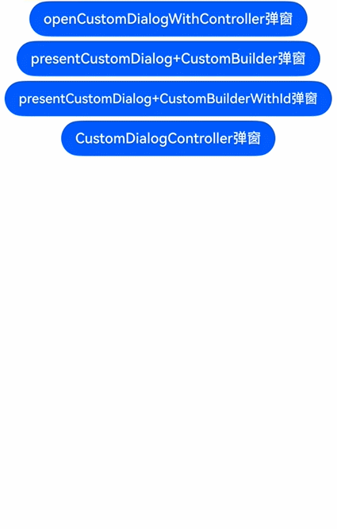

# 弹出框控制器
ArkUI的弹出框控制器在绑定弹出框后，可提供对弹出框的操作能力，当前支持关闭功能。可以将控制器传入弹出框内容区域后进行操作。

从API version 18开始，可设置[controller](../reference/apis-arkui/js-apis-promptAction.md#dialogcontroller18)参数以绑定控制器，通过控制器能够操作弹出框。

## 使用约束

目前[openCustomDialogWithController](../reference/apis-arkui/js-apis-arkui-UIContext.md#opencustomdialogwithcontroller18)和[presentCustomDialog](../reference/apis-arkui/js-apis-arkui-UIContext.md#presentcustomdialog18)支持通过controller参数来绑定弹出框进行操作，目前[getDialogController](../reference/apis-arkui/arkui-ts/ts-custom-component-api.md#getdialogcontroller18)支持获取自定义组件所在的弹出框的控制器。

> **说明：**
> 
> 一个弹出框控制器只能绑定一个弹出框，且操作只对该弹出框生效。
> 使用[getDialogController](../reference/apis-arkui/arkui-ts/ts-custom-component-api.md#getdialogcontroller18)获取弹出框控制器时，如果当前自定义组件不在弹出框中显示则获取为undefined。

## 创建自定义内容为ComponentContent的弹出框控制器

> **说明：**
> 
> 详细变量定义请参考[完整示例](#完整示例)。

1. 初始化一个自定义弹出框内容区的入参类，内部包含弹出框控制器。

   ```ts
   class Params {
     public text: string = ''
     public dialogController: promptAction.CommonController = new promptAction.DialogController()
     constructor(text: string, dialogController: promptAction.CommonController) {
       this.text = text
       this.dialogController = dialogController
     }
   }
   ```

2. 初始化一个自定义的弹出框内容区，内部包含一个按钮，该按钮通过该自定义组件自带的弹出框控制器实现关闭功能。

   ```ts
   @Component
   struct MyComponent {
     build() {
       Column({ space: 5 }) {
         Button('点我关闭弹窗：通过自定义组件自带的DialogController')
           .onClick(() => {
             let dialogController: promptAction.DialogController = this.getDialogController()
             if (dialogController !== undefined) {
               dialogController.close()
             }
           })
       }
     }
   }
   ```

3. 初始化另一自定义弹出框内容区，其中包含一个Text组件和一个按钮，该按钮通过外部传递的弹出框控制器用于关闭弹出框，并且该内容区还包含前一个自定义弹出框内容区。

   ```ts
   @Builder
   function buildText(params: Params) {
     Column({ space: 5 }) {
       Text(params.text)
         .fontSize(30)
       if (params.dialogController !== undefined) {
         Button('点我关闭弹窗：通过外部传递的DialogController')
           .onClick(() => {
             params.dialogController.close()
           })
       }
       MyComponent()
     }
     .width(300)
     .height(200)
     .backgroundColor('#FFF0F0F0')
   }
   ```

4. 初始化一个弹出框控制器，并通过设置控制器参数来初始化一个弹出框内容实体对象。最后，通过调用[UIContext](../reference/apis-arkui/js-apis-arkui-UIContext.md#uicontext)中的[getPromptAction](../reference/apis-arkui/js-apis-arkui-UIContext.md#getpromptaction)方法获取[PromptAction](../reference/apis-arkui/js-apis-arkui-UIContext.md#promptaction)对象，再通过该对象调用[openCustomDialogWithController](../reference/apis-arkui/js-apis-arkui-UIContext.md#opencustomdialogwithcontroller18)接口，并且设置初始化的内容实体对象和控制器参数以创建弹出框。

   ```ts
   let dialogController: promptAction.CommonController = new promptAction.DialogController()
   let contentNode: ComponentContent<Object> =
     new ComponentContent(this.getUIContext(), wrapBuilder(buildText), new Params(this.message, dialogController))
   this.getUIContext().getPromptAction().openCustomDialogWithController(
     contentNode, dialogController, this.baseDialogOptions).catch((err: BusinessError) => {
     console.error('openCustomDialogWithController error: ' + err.code + ' ' + err.message)
   })
   ```

## 创建自定义内容为CustomBuilder的弹出框控制器

> **说明：**
> 
> 详细变量定义请参考[完整示例](#完整示例)。

1. 初始化一个自定义弹出框内容区，内部包含一个Text组件和一个按钮，该按钮通过外部传递的弹出框控制器实现关闭功能。

   ```ts
   @Builder customDialogComponent(dialogController: promptAction.DialogController) {
     Column({ space: 5 }) {
       Text(this.message)
         .fontSize(30)
       if (dialogController !== undefined) {
         Button('点击关闭弹窗：通过外部传递的DialogController')
           .onClick(() => {
             dialogController.close()
           })
       }
     }
     .height(200)
     .padding(5)
     .justifyContent(FlexAlign.SpaceBetween)
     .backgroundColor('#FFF0F0F0')
   }
   ```

2. 初始化一个弹出框控制器，并通过调用[UIContext](../reference/apis-arkui/js-apis-arkui-UIContext.md#uicontext)中的[getPromptAction](../reference/apis-arkui/js-apis-arkui-UIContext.md#getpromptaction)方法获取[PromptAction](../reference/apis-arkui/js-apis-arkui-UIContext.md#promptaction)对象，再通过该对象调用[presentCustomDialog](../reference/apis-arkui/js-apis-arkui-UIContext.md#presentcustomdialog18)接口，设置初始化的内容实体对象和控制器参数以创建弹出框。

   ```ts
   let dialogController: promptAction.CommonController = new promptAction.DialogController()
   this.getUIContext().getPromptAction().presentCustomDialog(() => {
     this.customDialogComponent(dialogController)
   }, dialogController, this.dialogOptions).catch((err: BusinessError) => {
     console.error('presentCustomDialog error: ' + err.code + ' ' + err.message)
   })
   ```

## 创建自定义内容为CustomBuilderWithId的弹出框控制器

> **说明：**
> 
> 详细变量定义请参考[完整示例](#完整示例)。

1. 初始化一个弹出框内容区，内部包含一个Text组件、一个通过外部传递的弹出框ID用于关闭弹出框的按钮和一个通过外部传递的弹出框控制器用于关闭弹出框的按钮。

   ```ts
   @Builder customDialogComponentWithId(dialogId: number, dialogController: promptAction.DialogController) {
     Column({ space: 5 }) {
       Text(this.message)
         .fontSize(30)
       if (dialogId !== undefined) {
         Button('点击关闭弹窗：通过DialogID')
           .onClick(() => {
             this.getUIContext().getPromptAction().closeCustomDialog(dialogId)
           })
       }
       if (dialogController !== undefined) {
         Button('点击关闭弹窗：通过外部传递的DialogController')
           .onClick(() => {
             dialogController.close()
           })
       }
     }
   }
   ```

2. 初始化一个弹出框控制器，并通过调用[UIContext](../reference/apis-arkui/js-apis-arkui-UIContext.md#uicontext)中的[getPromptAction](../reference/apis-arkui/js-apis-arkui-UIContext.md#getpromptaction)方法获取[PromptAction](../reference/apis-arkui/js-apis-arkui-UIContext.md#promptaction)对象，再通过该对象调用[presentCustomDialog](../reference/apis-arkui/js-apis-arkui-UIContext.md#presentcustomdialog18)接口，设置初始化的内容实体对象和控制器参数以创建弹出框。

   ```ts
   let dialogController: promptAction.CommonController = new promptAction.DialogController()
   this.getUIContext().getPromptAction().presentCustomDialog((dialogId: number) => {
     this.customDialogComponentWithId(dialogId, dialogController)
   }, dialogController, this.dialogOptions).catch((err: BusinessError) => {
     console.error('presentCustomDialog error: ' + err.code + ' ' + err.message)
   })
   ```

## 在CustomDialogController内容区直接获取弹出框控制器

> **说明：**
> 
> 详细变量定义请参考[完整示例](#完整示例)。

1. 初始化一个自定义弹出框内容区，内部包含一个Text组件和一个按钮，该按钮通过弹出框控制器关闭弹出框。

   ```ts
   @CustomDialog
   @Component
   struct CustomDialogExample {
     controller?: CustomDialogController

     build() {
       Column({ space: 5 }) {
         Text('我是内容')
           .fontSize(30)
         Button('点我关闭弹窗：通过自定义组件自带的DialogController')
           .onClick(() => {
             let dialogController: PromptActionDialogController = this.getDialogController()
             if (dialogController !== undefined) {
               dialogController.close()
             }
           })
       }
       .height(200)
       .backgroundColor('#FFF0F0F0')
     }
   }
   ```

2. 初始化一个自定义弹出框构造器，关联自定义弹出框内容区。

   ```ts
   let customDialogController: CustomDialogController = new CustomDialogController({
     builder: CustomDialogExample(),
   })
   customDialogController.open()
   ```

## 使用控制器获取弹出框的状态

在自定义弹出框场景中，可以通过控制器调用getState接口获取弹出框状态。

> **说明：**
> 
> 详细变量定义请参考[完整示例](#完整示例)。

初始化一个自定义弹出框内容区，内部包含一个Text组件和一个按钮，该按钮通过调用getState获取当前弹出框状态。

  ```ts
  @Builder customDialogComponent(dialogController: promptAction.DialogController) {
    Column({ space: 5 }) {
      Text(this.message)
        .fontSize(30)
      if (dialogController !== undefined) {
        Button('点我查询弹窗状态')
          .onClick(() => {
            console.info('state:' + this.dialogController.getState())
          })
      }
    }
    .height(200)
    .padding(5)
    .justifyContent(FlexAlign.SpaceBetween)
    .backgroundColor('#FFF0F0F0')
  }
  ```

## 完整示例

通过外部传递的弹出框控制器和自定义组件自带的弹出框控制器，在自定义弹出框内容区域内实现关闭功能。

  ```ts
  import { ComponentContent, promptAction } from '@kit.ArkUI'
  import { BusinessError } from '@kit.BasicServicesKit'

  class Params {
    public text: string = ''
    public dialogController: promptAction.CommonController = new promptAction.DialogController()
    constructor(text: string, dialogController: promptAction.CommonController) {
      this.text = text
      this.dialogController = dialogController
    }
  }

  @Component
  struct MyComponent {
    build() {
      Column({ space: 5 }) {
        Button('点我关闭弹窗：通过自定义组件自带的DialogController')
          .onClick(() => {
            let dialogController: promptAction.DialogController = this.getDialogController()
            if (dialogController !== undefined) {
              dialogController.close()
            }
          })
      }
    }
  }

  @Builder
  function buildText(params: Params) {
    Column({ space: 5 }) {
      Text(params.text)
        .fontSize(30)
      if (params.dialogController !== undefined) {
        Button('点我关闭弹窗：通过外部传递的DialogController')
          .onClick(() => {
            params.dialogController.close()
          })
      }
      MyComponent()
    }
    .width(300)
    .height(200)
    .backgroundColor('#FFF0F0F0')
  }

  @CustomDialog
  @Component
  struct CustomDialogExample {
    controller?: CustomDialogController

    build() {
      Column({ space: 5 }) {
        Text('我是内容')
          .fontSize(30)
        Button('点我关闭弹窗：通过自定义组件自带的DialogController')
          .onClick(() => {
            let dialogController: PromptActionDialogController = this.getDialogController()
            if (dialogController !== undefined) {
              dialogController.close()
            }
          })
      }
      .height(200)
      .backgroundColor('#FFF0F0F0')
    }
  }

  @Entry
  @Component
  export struct Index {
    private message = '弹窗'
    @Builder customDialogComponent(dialogController: promptAction.DialogController) {
      Column({ space: 5 }) {
        Text(this.message)
          .fontSize(30)
        if (dialogController !== undefined) {
          Button('点击关闭弹窗：通过外部传递的DialogController')
            .onClick(() => {
              dialogController.close()
            })
        }
      }
      .height(200)
      .padding(5)
      .justifyContent(FlexAlign.SpaceBetween)
      .backgroundColor('#FFF0F0F0')
    }

    @Builder customDialogComponentWithId(dialogId: number, dialogController: promptAction.DialogController) {
      Column({ space: 5 }) {
        Text(this.message)
          .fontSize(30)
        if (dialogId !== undefined) {
          Button('点击关闭弹窗：通过DialogID')
            .onClick(() => {
              this.getUIContext().getPromptAction().closeCustomDialog(dialogId)
            })
        }
        if (dialogController !== undefined) {
          Button('点击关闭弹窗：通过外部传递的DialogController')
            .onClick(() => {
              dialogController.close()
            })
        }
      }
    }

    private baseDialogOptions: promptAction.BaseDialogOptions = {
      isModal: false,
      autoCancel: false
    }

    private dialogOptions: promptAction.DialogOptions = {
      isModal: false,
      autoCancel: false
    }

    build() {
      Column({ space: 5 }) {
        Button('openCustomDialogWithController弹窗')
          .onClick(() => {
            let dialogController: promptAction.CommonController = new promptAction.DialogController()
            let contentNode: ComponentContent<Object> =
              new ComponentContent(this.getUIContext(), wrapBuilder(buildText), new Params(this.message, dialogController))
            this.getUIContext().getPromptAction().openCustomDialogWithController(
              contentNode, dialogController, this.baseDialogOptions).catch((err: BusinessError) => {
              console.error('openCustomDialogWithController error: ' + err.code + ' ' + err.message)
            })
          })
        Button('presentCustomDialog+CustomBuilder弹窗')
          .onClick(() => {
            let dialogController: promptAction.CommonController = new promptAction.DialogController()
            this.getUIContext().getPromptAction().presentCustomDialog(() => {
              this.customDialogComponent(dialogController)
            }, dialogController, this.dialogOptions).catch((err: BusinessError) => {
              console.error('presentCustomDialog error: ' + err.code + ' ' + err.message)
            })
          })
        Button('presentCustomDialog+CustomBuilderWithId弹窗')
          .onClick(() => {
            let dialogController: promptAction.CommonController = new promptAction.DialogController()
            this.getUIContext().getPromptAction().presentCustomDialog((dialogId: number) => {
              this.customDialogComponentWithId(dialogId, dialogController)
            }, dialogController, this.dialogOptions).catch((err: BusinessError) => {
              console.error('presentCustomDialog error: ' + err.code + ' ' + err.message)
            })
          })
        Button('CustomDialogController弹窗')
          .onClick(() => {
            let customDialogController: CustomDialogController = new CustomDialogController({
              builder: CustomDialogExample(),
            })
            customDialogController.open()
          })
      }.width('100%')
    }
  }
  ```

