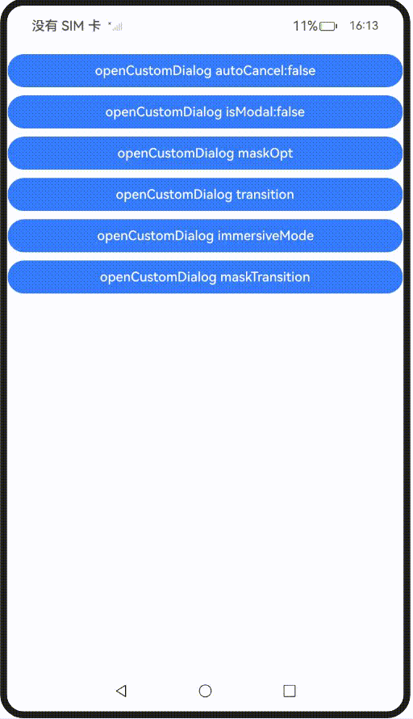
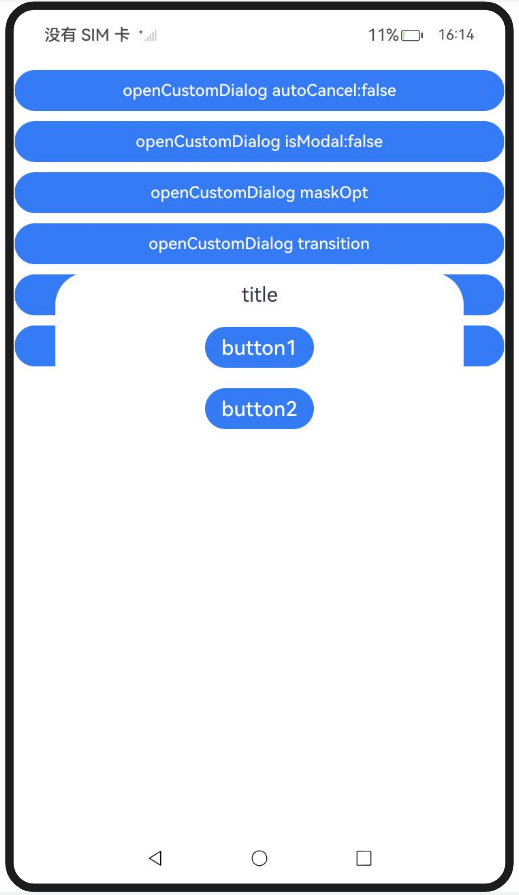
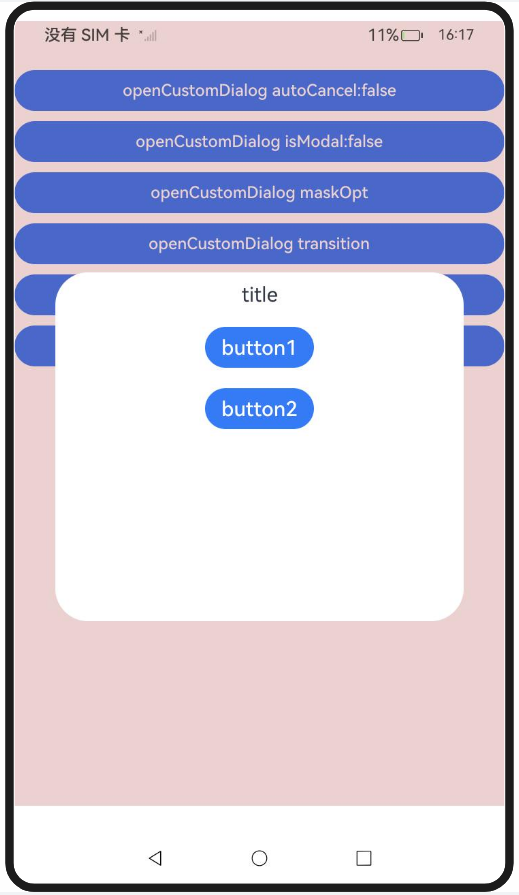
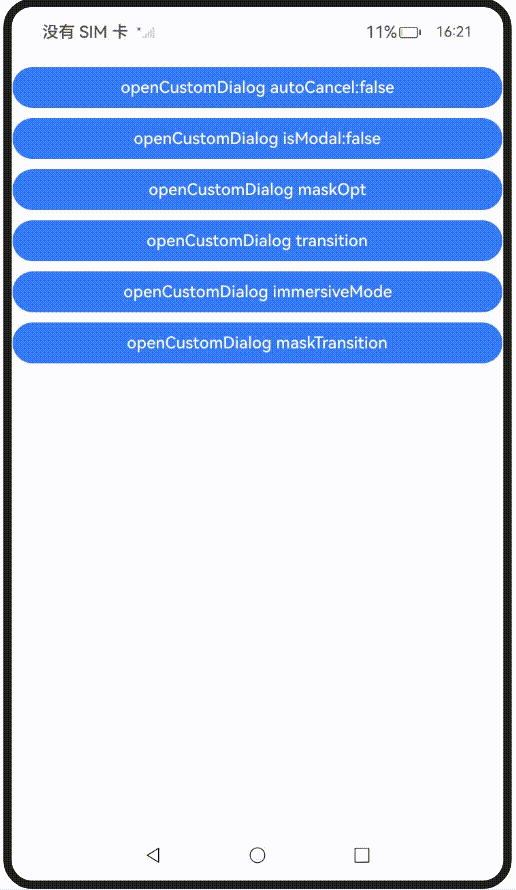
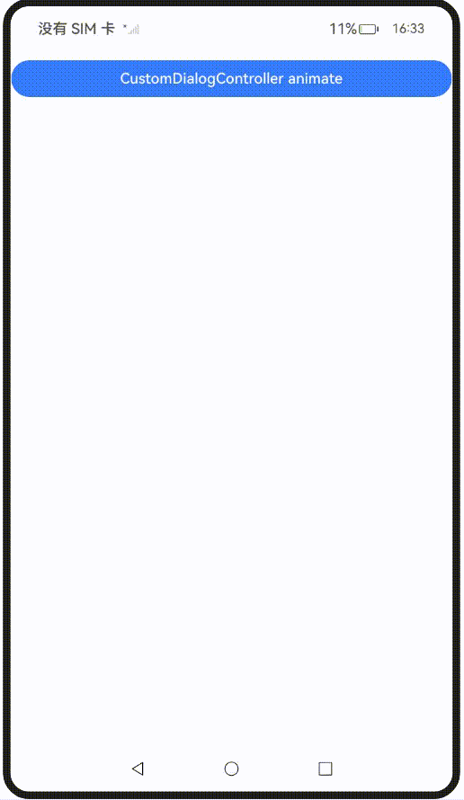
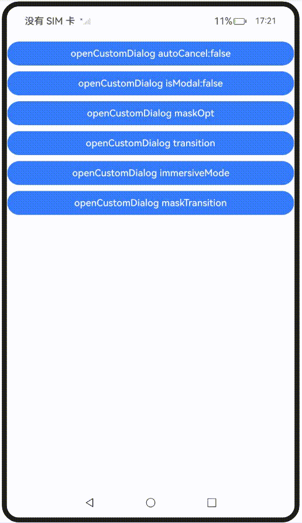

# 弹出框蒙层控制
<!--Kit: ArkUI-->
<!--Subsystem: ArkUI-->
<!--Owner: @houguobiao-->
<!--Designer: @houguobiao-->
<!--Tester: @lxl007-->
<!--Adviser: @HelloCrease-->

开发者对弹出框的定制不仅限于弹出框里的内容，对弹出框蒙层的定制需求也逐渐增加。本文介绍ArkUI弹出框的蒙层控制，包括点击蒙层时是否消失、蒙层区域、蒙层颜色和蒙层动画等特性。

## 使用约束

ArkUI提供多种弹出框，不同类型的弹出框具备不同的蒙层定制能力。详情请参阅下表：

|         接口&组件          |autoCancel|maskRect|isModal|immersiveMode|
| ----------------- | ------ |------ |------ |------ |
|[openCustomDialog](arkts-uicontext-custom-dialog.md)|支持|支持|支持|支持|
|[openCustomDialogWithController](../reference/apis-arkui/arkts-apis-uicontext-promptaction.md#opencustomdialogwithcontroller18)|支持|支持|支持|支持|
|[presentCustomDialog](../reference/apis-arkui/arkts-apis-uicontext-promptaction.md#presentcustomdialog18)|支持|支持|支持|支持|
|[updateCustomDialog](../reference/apis-arkui/arkts-apis-uicontext-promptaction.md#updatecustomdialog12)|支持|不支持|不支持|不支持|
|[CustomDialog](arkts-common-components-custom-dialog.md)|支持|支持|支持|支持|
|[showDialog](../reference/apis-arkui/arkts-apis-uicontext-promptaction.md#showdialog)|不支持|支持|支持|支持|
|[showAlertDialog](../reference/apis-arkui/arkts-apis-uicontext-uicontext.md#showalertdialog)|支持|支持|支持|支持|
|[showActionSheet](../reference/apis-arkui/arkts-apis-uicontext-uicontext.md#showactionsheet)|支持|支持|支持|支持|
|[showActionMenu](../reference/apis-arkui/arkts-apis-uicontext-promptaction.md#showactionmenu11)|不支持|不支持|支持|支持|
|[showDatePickerDialog](../reference/apis-arkui/arkts-apis-uicontext-uicontext.md#showdatepickerdialog)|不支持|支持|不支持|不支持|
|[CalendarPickerDialog](../reference/apis-arkui/arkui-ts/ts-methods-calendarpicker-dialog.md)|不支持|不支持|不支持|不支持|
|[showTimePickerDialog](../reference/apis-arkui/arkts-apis-uicontext-uicontext.md#showtimepickerdialog)|不支持|支持|不支持|不支持|
|[showTextPickerDialog](../reference/apis-arkui/arkts-apis-uicontext-uicontext.md#showtextpickerdialog)|不支持|支持|不支持|不支持|

> **说明：**
> 
> - 设置autoCancel参数，可控制弹出框蒙层被点击时是否消失。
>
> - 设置maskRect参数，可定制弹出框的蒙层的大小和位置进行定制。此外，蒙层范围内的事件无法透传，而蒙层范围外的事件可以透传。
>
> - 设置isModal参数，可定制弹出框的模态状态：非模态弹出框无蒙层，支持与周围组件交互；模态弹出框有蒙层，禁止与周围组件交互。
>
> - 当levelMode属性设置为LevelMode.EMBEDDED时，设置immersiveMode参数，可定制弹出框蒙层是否延伸至状态栏及导航栏。

| 接口&组件                                                    | maskColor | transition                                      | maskTransition |
| ------------------------------------------------------------ | --------- | ----------------------------------------------- | -------------- |
| [openCustomDialog](arkts-uicontext-custom-dialog.md)         | 支持      | 支持                                            | 支持           |
| [openCustomDialogWithController](../reference/apis-arkui/arkts-apis-uicontext-promptaction.md#opencustomdialogwithcontroller18) | 支持      | 支持                                            | 支持           |
| [presentCustomDialog](../reference/apis-arkui/arkts-apis-uicontext-promptaction.md#presentcustomdialog18) | 支持      | 支持                                            | 支持           |
| [updateCustomDialog](../reference/apis-arkui/arkts-apis-uicontext-promptaction.md#updatecustomdialog12) | 支持      | 不支持                                          | 不支持         |
| [CustomDialog](arkts-common-components-custom-dialog.md)     | 支持      | 不支持（可由openAnimation和closeAnimation替代） | 不支持         |
| [showDialog](../reference/apis-arkui/arkts-apis-uicontext-promptaction.md#showdialog) | 不支持    | 不支持                                          | 不支持         |
| [showAlertDialog](../reference/apis-arkui/arkts-apis-uicontext-uicontext.md#showalertdialog) | 不支持    | 支持                                            | 不支持         |
| [showActionSheet](../reference/apis-arkui/arkts-apis-uicontext-uicontext.md#showactionsheet) | 不支持    | 支持                                            | 不支持         |
| [showActionMenu](../reference/apis-arkui/arkts-apis-uicontext-promptaction.md#showactionmenu11) | 不支持    | 不支持                                          | 不支持         |
| [showDatePickerDialog](../reference/apis-arkui/arkts-apis-uicontext-uicontext.md#showdatepickerdialog) | 不支持    | 不支持                                          | 不支持         |
| [CalendarPickerDialog](../reference/apis-arkui/arkui-ts/ts-methods-calendarpicker-dialog.md) | 不支持    | 不支持                                          | 不支持         |
| [showTimePickerDialog](../reference/apis-arkui/arkts-apis-uicontext-uicontext.md#showtimepickerdialog) | 不支持    | 不支持                                          | 不支持         |
| [showTextPickerDialog](../reference/apis-arkui/arkts-apis-uicontext-uicontext.md#showtextpickerdialog) | 不支持    | 不支持                                          | 不支持         |

> **说明：**
>
> - 设置maskColor参数，可定制弹出框蒙层的颜色。
>
> - 设置openAnimation参数，可定制弹出框的进入动画，同时影响蒙层动画。该接口仅支持简单的动画设置，不支持复杂动画定制。
>
> - 设置closeAnimation参数，可定制弹出框的退出动画，同时影响蒙层动画。该接口仅支持简单的动画设置，不支持复杂动画定制。
>
> - 设置transition参数，可定制弹出框的进入和退出动画，同时影响蒙层动画。
>
> - 设置maskTransition参数，可定制弹出框的蒙层动画。


## 弹出框蒙层显隐控制

通过autoCancel，isModal展示弹出框在蒙层显隐控制方面的能力。

设置autoCancel为false，取消默认点击蒙层时弹窗消失。

```ts
// xxx.ets
  autoCancelOpt: promptAction.CustomDialogOptions = {
    builder: () => {
      this.myBuilder();
    },
    autoCancel: false,
  } as promptAction.CustomDialogOptions;

  Button("openCustomDialog autoCancel:false")
    .width('100%')
    .margin({ top: 10 })
    .onClick(() => {
      this.getUIContext().getPromptAction().openCustomDialog(this.autoCancelOpt)
    })
```
 

设置isModal为false，将默认的模态弹出框变为非模态弹出框。
```ts
// xxx.ets
modalOpt: promptAction.CustomDialogOptions = {
  builder: () => {
    this.myBuilder();
  },
  isModal: false,
} as promptAction.CustomDialogOptions;

Button("openCustomDialog isModal:false")
  .width('100%')
  .margin({ top: 10 })
  .onClick(() => {
    this.getUIContext().getPromptAction().openCustomDialog(this.modalOpt)
  })
```
 


## 弹出框蒙层样式控制

该示例通过maskRect、immersiveMode和maskColor展示弹出框在蒙层样式控制方面的能力。


设置maskRect和maskColor，实现蒙层区域和蒙层颜色的设置。

```ts
// xxx.ets
  maskOpt: promptAction.CustomDialogOptions = {
    builder: () => {
      this.myBuilder();
    },
    maskRect: {
      x: 0,
      y: 10,
      width: '100%',
      height: '90%'
    },
    maskColor: "#33AA0000"
  } as promptAction.CustomDialogOptions;

  Button("openCustomDialog maskOpt")
    .width('100%')
    .margin({ top: 10 })
    .onClick(() => {
      this.getUIContext().getPromptAction().openCustomDialog(this.maskOpt)
    })
```
 


在levelMode为LevelMode.EMBEDDED下，展示不同immersiveMode对蒙层在导航栏和状态栏的延伸效果。
```ts
// xxx.ets
  @State immersiveMode: ImmersiveMode = ImmersiveMode.DEFAULT;

  Button("openCustomDialog immersiveMode")
    .width('100%')
    .margin({ top: 10 })
    .onClick(() => {
      this.immersiveMode =
        this.immersiveMode == ImmersiveMode.DEFAULT ? ImmersiveMode.EXTEND : ImmersiveMode.DEFAULT;
      this.getUIContext().getPromptAction().openCustomDialog({
        builder: () => {
          this.myBuilder();
        },
        levelMode: LevelMode.EMBEDDED,
        immersiveMode: this.immersiveMode,
      })
    })
```
 

## 弹出框蒙层动画控制

该示例通过transition和maskTransition分别展示弹出框在蒙层动画方面的能力。

设置transition，实现弹出框与蒙层整体的动画。
```ts
// xxx.ets
  transitionOpt: promptAction.CustomDialogOptions = {
    builder: () => {
      this.myBuilder();
    },
    transition: TransitionEffect.OPACITY.animation({ duration: 3000 })
  } as promptAction.CustomDialogOptions;

  Button("openCustomDialog transition")
    .width('100%')
    .margin({ top: 10 })
    .onClick(() => {
      this.getUIContext().getPromptAction().openCustomDialog(this.transitionOpt);
    })
```
 

设置maskTransition，实现弹出框中蒙层单独的动画定制能力。
```ts
// xxx.ets
  Button("openCustomDialog maskTransition")
    .width('100%')
    .margin({ top: 10 })
    .onClick(() => {
      this.getUIContext().getPromptAction().openCustomDialog({
        builder: () => {
          this.myBuilder();
        },
        maskTransition: TransitionEffect.OPACITY.animation({ duration: 2000 })
          .combine(TransitionEffect.rotate({ z: 1, angle: 180 })),
      });
    })
```
 

[CustomDialog](arkts-common-components-custom-dialog.md)虽然不支持transition接口，但与之对应的openAnimation和closeAnimation接口在动画的打开和关闭时可进行定制，示例代码如下：

```ts
// xxx.ets

@CustomDialog
@Component
struct CustomDialogExample {
  controller?: CustomDialogController;

  build() {
    Column() {
      Text("title")
        .margin(10)
        .fontSize(20)
      Button("button1")
        .margin(10)
        .fontSize(20)
        .onClick(() => {
          this.controller?.close();
        })
      Button("button2")
        .margin(10)
        .fontSize(20)
        .onClick(() => {
          this.controller?.close();
        })
    }.width('100%')
    .height('50%')
  }
}

@Entry
@Component
struct Index {
  animationController: CustomDialogController | null
    = new CustomDialogController({
    builder: CustomDialogExample(),
    closeAnimation: { duration: 2000 },
    openAnimation: { duration: 2000 }
  });

  aboutToDisappear(): void {
    this.animationController = null;
  }

  build() {
    Column() {
      Button("CustomDialogController animate")
        .width('100%')
        .margin({ top: 10 })
        .onClick(() => {
          this.animationController?.open();
        })
    }
  }
}
```
 


## 完整示例

```ts
// xxx.ets
import { ImmersiveMode, LevelMode, promptAction } from '@kit.ArkUI';

@Entry
@Component
struct Index {
  @State immersiveMode: ImmersiveMode = ImmersiveMode.DEFAULT;
  autoCancelOpt: promptAction.CustomDialogOptions = {
    builder: () => {
      this.myBuilder();
    },
    autoCancel: false,
  } as promptAction.CustomDialogOptions;
  modalOpt: promptAction.CustomDialogOptions = {
    builder: () => {
      this.myBuilder();
    },
    isModal: false,
  } as promptAction.CustomDialogOptions;
  maskOpt: promptAction.CustomDialogOptions = {
    builder: () => {
      this.myBuilder();
    },
    maskRect: {
      x: 0,
      y: 10,
      width: '100%',
      height: '90%'
    },
    maskColor: "#33AA0000"
  } as promptAction.CustomDialogOptions;
  transitionOpt: promptAction.CustomDialogOptions = {
    builder: () => {
      this.myBuilder();
    },
    transition: TransitionEffect.OPACITY.animation({ duration: 3000 })
  } as promptAction.CustomDialogOptions;

  @Builder
  myBuilder() {
    Column() {
      Text("title").margin(10).fontSize(20)
      Button("button1").margin(10).fontSize(20)
      Button("button2").margin(10).fontSize(20)
    }.width('100%').height('50%')
  }

  build() {
    Column() {
      Button("openCustomDialog autoCancel:false")
        .width('100%')
        .margin({ top: 10 })
        .onClick(() => {
          this.getUIContext().getPromptAction().openCustomDialog(this.autoCancelOpt)
        })
      Button("openCustomDialog isModal:false")
        .width('100%')
        .margin({ top: 10 })
        .onClick(() => {
          this.getUIContext().getPromptAction().openCustomDialog(this.modalOpt)
        })
      Button("openCustomDialog maskOpt")
        .width('100%')
        .margin({ top: 10 })
        .onClick(() => {
          this.getUIContext().getPromptAction().openCustomDialog(this.maskOpt)
        })
      Button("openCustomDialog transition")
        .width('100%')
        .margin({ top: 10 })
        .onClick(() => {
          this.getUIContext().getPromptAction().openCustomDialog(this.transitionOpt);
        })
      Button("openCustomDialog immersiveMode")
        .width('100%')
        .margin({ top: 10 })
        .onClick(() => {
          this.immersiveMode =
            this.immersiveMode == ImmersiveMode.DEFAULT ? ImmersiveMode.EXTEND : ImmersiveMode.DEFAULT;
          this.getUIContext().getPromptAction().openCustomDialog({
            builder: () => {
              this.myBuilder();
            },
            levelMode: LevelMode.EMBEDDED,
            immersiveMode: this.immersiveMode,
          })
        })
      Button("openCustomDialog maskTransition")
        .width('100%')
        .margin({ top: 10 })
        .onClick(() => {
          this.getUIContext().getPromptAction().openCustomDialog({
            builder: () => {
              this.myBuilder();
            },
            maskTransition: TransitionEffect.OPACITY.animation({ duration: 2000 })
              .combine(TransitionEffect.rotate({ z: 1, angle: 180 })),
          });
        })
    }
    .width('100%')
    .height('100%')
  }
}
```
 
