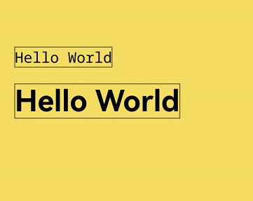
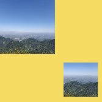
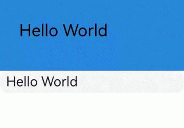
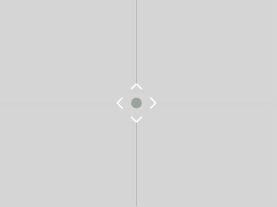

# 使用画布绘制自定义图形 (Canvas)


Canvas提供画布组件，用于自定义绘制图形，开发者使用CanvasRenderingContext2D对象和OffscreenCanvasRenderingContext2D对象在Canvas组件上进行绘制，绘制对象可以是基础形状、文本、图片等。


## 使用画布组件绘制自定义图形

可以由以下三种形式在画布绘制自定义图形：


- 使用[CanvasRenderingContext2D](../reference/apis-arkui/arkui-ts/ts-canvasrenderingcontext2d.md)对象在Canvas画布上绘制。

  ```ts
  @Entry
  @Component
  struct CanvasExample1 {
    //用来配置CanvasRenderingContext2D对象的参数，包括是否开启抗锯齿，true表明开启抗锯齿。
    private settings: RenderingContextSettings = new RenderingContextSettings(true);
    //用来创建CanvasRenderingContext2D对象，通过在canvas中调用CanvasRenderingContext2D对象来绘制。
    private context: CanvasRenderingContext2D = new CanvasRenderingContext2D(this.settings);
  
    build() {
      Flex({ direction: FlexDirection.Column, alignItems: ItemAlign.Center, justifyContent: FlexAlign.Center }) {
        //在canvas中调用CanvasRenderingContext2D对象。
        Canvas(this.context)
          .width('100%')
          .height('100%')
          .backgroundColor('#F5DC62')
          .onReady(() => {
            //可以在这里绘制内容。
            this.context.strokeRect(50, 50, 200, 150);
          })
      }
      .width('100%')
      .height('100%')
    }
  }
  ```

  .jpg)

- 离屏绘制是指将需要绘制的内容先绘制在缓存区，再将其转换成图片，一次性绘制到Canvas上，加快了绘制速度。过程为：
  1. 通过transferToImageBitmap方法将离屏画布最近渲染的图像创建为一个ImageBitmap对象。
  2. 通过CanvasRenderingContext2D对象的transferFromImageBitmap方法显示给定的ImageBitmap对象。

    具体使用参考[OffscreenCanvasRenderingContext2D](../reference/apis-arkui/arkui-ts/ts-offscreencanvasrenderingcontext2d.md)对象。

  ```ts
  @Entry
  @Component
  struct CanvasExample2 {
    //用来配置CanvasRenderingContext2D对象和OffscreenCanvasRenderingContext2D对象的参数，包括是否开启抗锯齿。true表明开启抗锯齿
    private settings: RenderingContextSettings = new RenderingContextSettings(true);
    private context: CanvasRenderingContext2D = new CanvasRenderingContext2D(this.settings);
    //用来创建OffscreenCanvas对象，width为离屏画布的宽度，height为离屏画布的高度。通过在canvas中调用OffscreenCanvasRenderingContext2D对象来绘制。
    private offCanvas: OffscreenCanvas = new OffscreenCanvas(600, 600);
   
    build() {
      Flex({ direction: FlexDirection.Column, alignItems: ItemAlign.Center, justifyContent: FlexAlign.Center }) {
        Canvas(this.context)
          .width('100%')
          .height('100%')
          .backgroundColor('#F5DC62')
          .onReady(() => {
            let offContext = this.offCanvas.getContext("2d", this.settings)
            //可以在这里绘制内容
            offContext.strokeRect(50, 50, 200, 150);
            //将离屏绘制渲染的图像在普通画布上显示
            let image = this.offCanvas.transferToImageBitmap();
            this.context.transferFromImageBitmap(image);
          })
      }
      .width('100%')
      .height('100%')
    }
  }
  ```

  .jpg)

  >**说明：**
  >
  >在画布组件中，通过CanvasRenderingContext2D对象和OffscreenCanvasRenderingContext2D对象在Canvas组件上进行绘制时调用的接口相同，另外，接口参数如无特别说明，单位均为vp。

- 在Canvas上加载Lottie动画时，需要先按照如下方式下载Lottie。

  ```ts
  import lottie from '@ohos/lottie';
  ```

  具体接口请参考[Lottie](https://gitee.com/openharmony-tpc/lottieETS)。


## 初始化画布组件

onReady(event: () =&gt; void)是Canvas组件初始化完成时的事件回调，调用该事件后，可获取Canvas组件的确定宽高，进一步使用CanvasRenderingContext2D对象和OffscreenCanvasRenderingContext2D对象调用相关API进行图形绘制。

```ts
Canvas(this.context)
  .width('100%')
  .height('100%')
  .backgroundColor('#F5DC62')
  .onReady(() => {
    this.context.fillStyle = '#0097D4';
    this.context.fillRect(50, 50, 100, 100);
  })
```

.jpg)


## 画布组件绘制方式

在Canvas组件生命周期接口onReady()调用之后，开发者可以直接使用canvas组件进行绘制。或者可以脱离Canvas组件和onReady()生命周期，单独定义Path2d对象构造理想的路径，并在onReady()调用之后使用Canvas组件进行绘制。

- 通过CanvasRenderingContext2D对象和OffscreenCanvasRenderingContext2D对象直接调用相关API进行绘制。

  ```ts
  Canvas(this.context)
    .width('100%')
    .height('100%')
    .backgroundColor('#F5DC62')
    .onReady(() => {
      this.context.beginPath();
      this.context.moveTo(50, 50);
      this.context.lineTo(280, 160);
      this.context.stroke();
     })
  ```

  .jpg)

- 先单独定义path2d对象构造理想的路径，再通过调用CanvasRenderingContext2D对象和OffscreenCanvasRenderingContext2D对象的stroke接口或者fill接口进行绘制，具体使用可以参考[Path2D](../reference/apis-arkui/arkui-ts/ts-components-canvas-path2d.md)对象。

  ```ts
  Canvas(this.context)
    .width('100%')
    .height('100%')
    .backgroundColor('#F5DC62')
    .onReady(() => {
       let region = new Path2D();
       region.arc(100, 75, 50, 0, 6.28);
       this.context.stroke(region);
    })
  ```

  .jpg)


## 画布组件常用方法

OffscreenCanvasRenderingContext2D对象和CanvasRenderingContext2D对象提供了大量的属性和方法，可以用来绘制文本、图形，处理像素等，是Canvas组件的核心。常用接口有[fill](../reference/apis-arkui/arkui-ts/ts-canvasrenderingcontext2d.md#fill)（对封闭路径进行填充）、[clip](../reference/apis-arkui/arkui-ts/ts-canvasrenderingcontext2d.md#clip)（设置当前路径为剪切路径）、[stroke](../reference/apis-arkui/arkui-ts/ts-canvasrenderingcontext2d.md#stroke)（进行边框绘制操作）等等，同时提供了[fillStyle](../reference/apis-arkui/arkui-ts/ts-canvasrenderingcontext2d.md#fillstyle)（指定绘制的填充色）、[globalAlpha](../reference/apis-arkui/arkui-ts/ts-canvasrenderingcontext2d.md#globalalpha)（设置透明度）与[strokeStyle](../reference/apis-arkui/arkui-ts/ts-canvasrenderingcontext2d.md#strokestyle)（设置描边的颜色）等属性修改绘制内容的样式。将通过以下几个方面简单介绍画布组件常见使用方法：

- 绘制基础形状。
  可以通过[arc](../reference/apis-arkui/arkui-ts/ts-canvasrenderingcontext2d.md#arc)（绘制弧线路径）、 [ellipse](../reference/apis-arkui/arkui-ts/ts-canvasrenderingcontext2d.md#ellipse)（绘制一个椭圆）、[rect](../reference/apis-arkui/arkui-ts/ts-canvasrenderingcontext2d.md#rect)（创建矩形路径）等接口绘制基础形状。

  ```ts
  Canvas(this.context)
    .width('100%')
    .height('100%')
    .backgroundColor('#F5DC62')
    .onReady(() => {
       //绘制矩形
       this.context.beginPath();
       this.context.rect(100, 50, 100, 100);
       this.context.stroke();
       //绘制圆形
       this.context.beginPath();
       this.context.arc(150, 250, 50, 0, 6.28);
       this.context.stroke();
       //绘制椭圆
       this.context.beginPath();
       this.context.ellipse(150, 450, 50, 100, Math.PI * 0.25, Math.PI * 0, Math.PI * 2);
       this.context.stroke();
    })
  ```

  .jpg)

- 绘制文本。

  可以通过[fillText](../reference/apis-arkui/arkui-ts/ts-canvasrenderingcontext2d.md#filltext)（文本填充）、[strokeText](../reference/apis-arkui/arkui-ts/ts-canvasrenderingcontext2d.md#stroketext)（文本描边）等接口进行文本绘制，示例中设置了font为50像素高加粗的"sans-serif"字体，然后调用fillText方法在(50, 100)处绘制文本"Hello World!"，设置strokeStyle为红色，lineWidth为2，font为50像素高加粗的"sans-serif"字体，然后调用strokeText方法在(50, 150)处绘制文本"Hello World!"的轮廓。

  ```ts
  Canvas(this.context)
    .width('100%')
    .height('100%')
    .backgroundColor('#F5DC62')
    .onReady(() => {
      // 文本填充
      this.context.font = '50px bolder sans-serif';
      this.context.fillText("Hello World!", 50, 100);
      // 文本描边
      this.context.strokeStyle = "#ff0000"
      this.context.lineWidth = 2
      this.context.font = '50px bolder sans-serif';
      this.context.strokeText("Hello World!", 50, 150);
    })
  ```

  .jpg)

- 绘制文本边框。

  可以通过[measureText](../reference/apis-arkui/arkui-ts/ts-canvasrenderingcontext2d.md#measuretext)（文本测量）计算绘制文本的宽度和高度，使用测量的宽度和高度作为边框的尺寸。在示例中，设置textBaseline为'top'，font为30像素的"monospace"字体，通过measureText测量出文本的宽度和高度，然后调用fillText方法在(20, 100)处绘制文本"Hello World!"，并调用strokeRect方法在同一位置使用测量的宽度和高度绘制相应尺寸的边框。接着，设置font为60像素的粗体"sans-serif"字体，再次通过measureText测量文本的宽度和高度，接着调用fillText方法在(20, 150)处绘制文本"Hello World!"，并调用strokeRect方法在同一位置使用测量的宽度和高度绘制对应尺寸的边框。

  ```ts
  // xxx.ets
  @Entry
  @Component
  struct measureTextAndRect {
    drawText: string = "Hello World"
    private settings: RenderingContextSettings = new RenderingContextSettings(true);
    private context: CanvasRenderingContext2D = new CanvasRenderingContext2D(this.settings);

    build() {
      Flex({ direction: FlexDirection.Column, alignItems: ItemAlign.Center, justifyContent: FlexAlign.Center }) {
        Canvas(this.context)
          .width('100%')
          .height('100%')
          .backgroundColor('#F5DC62')
          .onReady(() => {
            // 文本的水平对齐方式为'top'
            this.context.textBaseline = 'top'
            // 文本字号为30px，字体系列为monospace
            this.context.font = '30px monospace'
            let textWidth = this.context.measureText(this.drawText).width
            let textHeight = this.context.measureText(this.drawText).height
            this.context.fillText(this.drawText, 20, 100)
            this.context.strokeRect(20, 100, textWidth, textHeight)
            // 文本字体粗细为粗体，字号为60px，字体系列为sans-serif
            this.context.font = 'bold 60px sans-serif'
            textWidth = this.context.measureText(this.drawText).width
            textHeight = this.context.measureText(this.drawText).height
            this.context.fillText(this.drawText, 20, 150)
            this.context.strokeRect(20, 150, textWidth, textHeight)
          })
      }
      .width('100%')
      .height('100%')
    }
  }
  ```

  

- 绘制图片和图像像素信息处理。

  可以通过[drawImage](../reference/apis-arkui/arkui-ts/ts-canvasrenderingcontext2d.md#drawimage)（图像绘制）、[putImageData](../reference/apis-arkui/arkui-ts/ts-canvasrenderingcontext2d.md#putimagedata)（使用[ImageData](../reference/apis-arkui/arkui-ts/ts-components-canvas-imagedata.md)数据填充新的矩形区域）等接口绘制图片，通过[createImageData](../reference/apis-arkui/arkui-ts/ts-canvasrenderingcontext2d.md#createimagedata)（创建新的ImageData 对象）、[getPixelMap](../reference/apis-arkui/arkui-ts/ts-canvasrenderingcontext2d.md#getpixelmap)（以当前canvas指定区域内的像素创建[PixelMap](../reference/apis-image-kit/arkts-apis-image-PixelMap.md)对象）、[getImageData](../reference/apis-arkui/arkui-ts/ts-canvasrenderingcontext2d.md#getimagedata)（以当前canvas指定区域内的像素创建ImageData对象）等接口进行图像像素信息处理。

  ```ts
  @Entry
  @Component
  struct GetImageData {
    private settings: RenderingContextSettings = new RenderingContextSettings(true);
    private context: CanvasRenderingContext2D = new CanvasRenderingContext2D(this.settings);
    private offCanvas: OffscreenCanvas = new OffscreenCanvas(600, 600);
    private img: ImageBitmap = new ImageBitmap("/common/images/1234.png");

    build() {
      Flex({ direction: FlexDirection.Column, alignItems: ItemAlign.Center, justifyContent: FlexAlign.Center }) {
        Canvas(this.context)
          .width('100%')
          .height('100%')
          .backgroundColor('#F5DC62')
          .onReady(() => {
            let offContext = this.offCanvas.getContext("2d", this.settings)
            // 使用drawImage接口将图片画在（0，0）为起点，宽高130的区域
            offContext.drawImage(this.img, 0, 0, 130, 130);
            // 使用getImageData接口，获得canvas组件区域中，（50，50）为起点，宽高130范围内的绘制内容
            let imageData = offContext.getImageData(50, 50, 130, 130);
            // 使用putImageData接口将得到的ImageData画在起点为（150， 150）的区域中
            offContext.putImageData(imageData, 150, 150);
            // 将离屏绘制的内容画到canvas组件上
            let image = this.offCanvas.transferToImageBitmap();
            this.context.transferFromImageBitmap(image);
          })
      }
      .width('100%')
      .height('100%')
    }
  }
  ```

  

- 其他方法。

  Canvas中还提供其他类型的方法。渐变（[CanvasGradient](../reference/apis-arkui/arkui-ts/ts-components-canvas-canvasgradient.md)对象）相关的方法：[createLinearGradient](../reference/apis-arkui/arkui-ts/ts-canvasrenderingcontext2d.md#createlineargradient)（创建一个线性渐变色）、[createRadialGradient](../reference/apis-arkui/arkui-ts/ts-canvasrenderingcontext2d.md#createradialgradient)（创建一个径向渐变色）等。

  ```ts
  Canvas(this.context)
    .width('100%')
    .height('100%')
    .backgroundColor('#F5DC62')
    .onReady(() => {
      //创建一个径向渐变色的CanvasGradient对象
      let grad = this.context.createRadialGradient(200, 200, 50, 200, 200, 200)
      //为CanvasGradient对象设置渐变断点值，包括偏移和颜色
      grad.addColorStop(0.0, '#E87361');
      grad.addColorStop(0.5, '#FFFFF0');
      grad.addColorStop(1.0, '#BDDB69');
      //用CanvasGradient对象填充矩形
      this.context.fillStyle = grad;
      this.context.fillRect(0, 0, 400, 400);
    })
  ```

  .jpg)

## 使用状态变量驱动画布刷新

可以使用状态变量来驱动Canvas刷新，将变化的数据通过@Watch监听，并绑定自定义的draw()方法。当数据刷新时，@Watch绑定的方法会执行绘制逻辑，使Canvas刷新。

```ts
@Entry
@Component
struct CanvasContentUpdate {
  private settings: RenderingContextSettings = new RenderingContextSettings(true);
  private context: CanvasRenderingContext2D = new CanvasRenderingContext2D(this.settings);
  @State @Watch('draw')content: string = 'Hello World';

  draw() {
    this.context.clearRect(0, 0, 400, 200); // 清空Canvas的内容
    this.context.fillText(this.content, 50, 100); // 重新绘制
  }

  build() {
    Column() {
      Canvas(this.context)
        .width('100%')
        .height('25%')
        .backgroundColor('rgb(39, 135, 217)')
        .onReady(() => {
          this.context.font = '65px sans-serif';
          this.context.fillText(this.content, 50, 100);
        })
      TextInput({
        text:$$this.content // 修改文本输入框里的内容时，状态变量的更新会驱动Canvas刷新
      })
        .fontSize(35)
    }
    .width('100%')
    .height('100%')
  }
}
```



## 场景示例

- 绘制规则基础形状。

  ```ts
  @Entry
  @Component
  struct ClearRect {
    private settings: RenderingContextSettings = new RenderingContextSettings(true);
    private context: CanvasRenderingContext2D = new CanvasRenderingContext2D(this.settings);

    build() {
      Flex({ direction: FlexDirection.Column, alignItems: ItemAlign.Center, justifyContent: FlexAlign.Center }) {
        Canvas(this.context)
          .width('100%')
          .height('100%')
          .backgroundColor('#F5DC62')
          .onReady(() => {
            // 设定填充样式，填充颜色设为蓝色
            this.context.fillStyle = '#0097D4';
            // 以(50, 50)为左上顶点，画一个宽高200的矩形
            this.context.fillRect(50, 50, 200, 200);
            // 以(70, 70)为左上顶点，清除宽150高100的区域
            this.context.clearRect(70, 70, 150, 100);
          })
      }
      .width('100%')
      .height('100%')
    }
  }
  ```

  .jpg)

- 绘制不规则图形。

  ```ts
  @Entry
  @Component
  struct Path2d {
    private settings: RenderingContextSettings = new RenderingContextSettings(true);
    private context: CanvasRenderingContext2D = new CanvasRenderingContext2D(this.settings);
    
    build() {
      Row() {
        Column() {
          Canvas(this.context)
            .width('100%')
            .height('100%')
            .backgroundColor('#F5DC62')
            .onReady(() => {
              // 使用Path2D的接口构造一个五边形
              let path = new Path2D();
              path.moveTo(150, 50);
              path.lineTo(50, 150);
              path.lineTo(100, 250);
              path.lineTo(200, 250);
              path.lineTo(250, 150);
              path.closePath();
              // 设定填充色为蓝色
              this.context.fillStyle = '#0097D4';
              // 使用填充的方式，将Path2D描述的五边形绘制在canvas组件内部
              this.context.fill(path);
            })
        }
        .width('100%')
      }
      .height('100%')
    }
  }
  ```

  

- 绘制可拖动的光标。

  可以通过[beginPath](../reference/apis-arkui/arkui-ts/ts-canvasrenderingcontext2d.md#beginpath)、[moveTo](../reference/apis-arkui/arkui-ts/ts-canvasrenderingcontext2d.md#moveto)、[lineTo](../reference/apis-arkui/arkui-ts/ts-canvasrenderingcontext2d.md#lineto)和[arc](../reference/apis-arkui/arkui-ts/ts-canvasrenderingcontext2d.md#arc)方法设置光标的位置，使用[stroke](../reference/apis-arkui/arkui-ts/ts-canvasrenderingcontext2d.md#stroke)和[fill](../reference/apis-arkui/arkui-ts/ts-canvasrenderingcontext2d.md#fill)方法绘制光标，将是否按下和位置变化通过@Watch监听，并绑定自定义的drawCursor()方法。当拖动光标时，@Watch绑定的方法会执行绘制逻辑，计算并更新光标的颜色和位置。

  ```ts
  @Entry
  @Component
  struct CursorMoving {
    // 监听是否按下，刷新光标颜色
    @State @Watch('drawCursor') isTouchDown: boolean = false
    // 监听位置变化，刷新页面
    @State @Watch('drawCursor') cursorPosition: RectPosition = {
      x: 0,
      y: 0,
      width: 0,
      height: 0,
    }
    private settings: RenderingContextSettings = new RenderingContextSettings(true);
    private canvasContext: CanvasRenderingContext2D = new CanvasRenderingContext2D(this.settings);
    private sw: number = 360; // Canvas固定宽度
    private sh: number = 270; // Canvas固定高度
    private cursorWH: number = 50; // 光标区域宽高
    private dashedLineW: number = 7; // 光标宽高
    private arcRadius: number = 6; // 光标中心圆半径
    private isReadyMove: boolean = false
    private touchPosition: Position = {
      x: 0,
      y: 0,
    };
    private cursorCenterPosition: Position = {
      x: 0,
      y: 0,
    };

    build() {
      Column() {
        // 绘制光标
        Canvas(this.canvasContext)
          .width(this.sw)
          .height(this.sh)
          .backgroundColor('#D5D5D5')
          .onReady(() => {
            this.cursorPosition.x = (this.sw - this.cursorWH) / 2
            this.cursorPosition.y = (this.sh - this.cursorWH) / 2
            this.cursorPosition.width = this.cursorWH
            this.cursorPosition.height = this.cursorWH
            this.cursorCenterPosition = {
              x: this.cursorPosition.x + this.cursorPosition.width / 2,
              y: this.cursorPosition.y + this.cursorPosition.width / 2
            }
            this.drawCursor()
          })
          .onTouch(event => {
            if (event.type === TouchType.Down) {
              this.isReadyMove = this.isTouchCursorArea(event.touches[0]);
              if (this.isReadyMove) {
                this.isTouchDown = true
              }

              this.touchPosition = {
                x: event.touches[0].displayX,
                y: event.touches[0].displayY
              }
            } else if (event.type === TouchType.Move) {
              if (this.isReadyMove) {
                let moveX = event.changedTouches[0].displayX - this.touchPosition.x;
                let moveY = event.changedTouches[0].displayY - this.touchPosition.y;
                this.touchPosition = {
                  x: event.changedTouches[0].displayX,
                  y: event.changedTouches[0].displayY
                }
                this.cursorPosition.x += moveX;
                this.cursorPosition.y += moveY;

                this.cursorCenterPosition = {
                  x: this.cursorPosition.x + this.cursorPosition.width / 2,
                  y: this.cursorPosition.y + this.cursorPosition.width / 2
                }
                // 光标区域中心点位置限制
                if (this.cursorCenterPosition.x < 0) {
                  this.cursorPosition.x = -this.cursorPosition.width / 2
                }
                if (this.cursorCenterPosition.y < 0) {
                  this.cursorPosition.y = -this.cursorPosition.height / 2
                }
                if (this.cursorCenterPosition.x > this.sw) {
                  this.cursorPosition.x = this.sw - this.cursorPosition.width / 2
                }
                if (this.cursorCenterPosition.y > this.sh) {
                  this.cursorPosition.y = this.sh - this.cursorPosition.height / 2
                }
              }
            } else {
              this.isTouchDown = false
            }
          })
      }
      .height('100%')
      .width('100%')
      .justifyContent(FlexAlign.Center)
    }

    // 绘制裁剪框
    drawCursor() {
      // 算出菱形四个点
      let positionL: Position = { x: this.cursorPosition.x, y: this.cursorPosition.y + this.cursorPosition.height / 2 }
      let positionT: Position = { x: this.cursorPosition.x + this.cursorPosition.width / 2, y: this.cursorPosition.y }
      let positionR: Position = {
        x: this.cursorPosition.x + this.cursorPosition.width,
        y: this.cursorPosition.y + this.cursorPosition.height / 2
      }
      let positionB: Position = {
        x: this.cursorPosition.x + this.cursorPosition.width / 2,
        y: this.cursorPosition.y + this.cursorPosition.height
      }
      let lineWidth = 2
      this.canvasContext.clearRect(0, 0, this.sw, this.sh);
      this.canvasContext.lineWidth = lineWidth
      this.canvasContext.strokeStyle = this.isTouchDown ? '#ff1a5cae' : '#ffffffff'

      // 画出四角
      this.canvasContext.beginPath()
      this.canvasContext.moveTo(positionL.x + this.dashedLineW, positionL.y - this.dashedLineW);
      this.canvasContext.lineTo(positionL.x, positionL.y);
      this.canvasContext.lineTo(positionL.x + this.dashedLineW, positionL.y + this.dashedLineW);

      this.canvasContext.moveTo(positionT.x - this.dashedLineW, positionT.y + this.dashedLineW);
      this.canvasContext.lineTo(positionT.x, positionT.y);
      this.canvasContext.lineTo(positionT.x + this.dashedLineW, positionT.y + this.dashedLineW);

      this.canvasContext.moveTo(positionR.x - this.dashedLineW, positionR.y - this.dashedLineW);
      this.canvasContext.lineTo(positionR.x, positionR.y);
      this.canvasContext.lineTo(positionR.x - this.dashedLineW, positionR.y + this.dashedLineW);

      this.canvasContext.moveTo(positionB.x - this.dashedLineW, positionB.y - this.dashedLineW);
      this.canvasContext.lineTo(positionB.x, positionB.y);
      this.canvasContext.lineTo(positionB.x + this.dashedLineW, positionB.y - this.dashedLineW);

      this.canvasContext.stroke()

      // 画出中心圆
      this.canvasContext.beginPath()
      this.canvasContext.strokeStyle = this.isTouchDown ? '#ff1a5cae' : '#ff9ba59b'
      this.canvasContext.fillStyle = this.isTouchDown ? '#ff1a5cae' : '#ff9ba59b'
      this.canvasContext.arc(this.cursorPosition.x + this.cursorPosition.width / 2,
        this.cursorPosition.y + this.cursorPosition.width / 2, this.arcRadius, 0, 2 * Math.PI)
      this.canvasContext.fill()
      this.canvasContext.stroke()

      // 画出四条线
      this.canvasContext.beginPath();
      this.canvasContext.lineWidth = 0.7;
      this.canvasContext.moveTo(positionL.x, positionL.y);
      this.canvasContext.lineTo(0, positionL.y);

      this.canvasContext.moveTo(positionT.x, positionT.y);
      this.canvasContext.lineTo(positionT.x, 0);

      this.canvasContext.moveTo(positionR.x, positionR.y);
      this.canvasContext.lineTo(this.sw, positionR.y);

      this.canvasContext.moveTo(positionB.x, positionB.y);
      this.canvasContext.lineTo(positionB.x, this.sh);

      this.canvasContext.stroke();
    }

    // 判断点击位置是否在棱形中
    isTouchCursorArea(touch: TouchObject) {
      let tempLength = Math.sqrt((touch.x - this.cursorCenterPosition.x) * (touch.x - this.cursorCenterPosition.x) +
        (touch.y - this.cursorCenterPosition.y) * (touch.y - this.cursorCenterPosition.y))
      if (tempLength < (this.cursorWH / 2 / 1.414)) {
        return true
      }
      return false
    }
  }

  export interface RectPosition {
    x: number;
    y: number;
    height: number;
    width: number;
  }

  export interface Position {
    x: number;
    y: number;
  }
  ```

  

## 相关实例

使用画布绘制自定义图形，有以下相关实例可供参考：

- [ArkTS组件集（ArkTS）（Full SDK）（API10）](https://gitee.com/openharmony/applications_app_samples/tree/master/code/UI/ArkTsComponentCollection/ComponentCollection)

- [分布式五子棋（ArkTS）（Full SDK）（API9）](https://gitee.com/openharmony/applications_app_samples/tree/master/code/Solutions/Game/DistributedDataGobang)

- [ArkTS时钟（ArkTS）(API9)](https://gitee.com/openharmony/applications_app_samples/tree/master/code/Solutions/Tools/ArkTSClock)

- [Lottie动画](https://gitee.com/openharmony/applications_app_samples/tree/master/code/Solutions/Game/Lottie)

- [自定义抽奖转盘（ArkTS）（API9）](https://gitee.com/openharmony/codelabs/tree/master/ETSUI/CanvasComponent)
<!--RP1--><!--RP1End-->