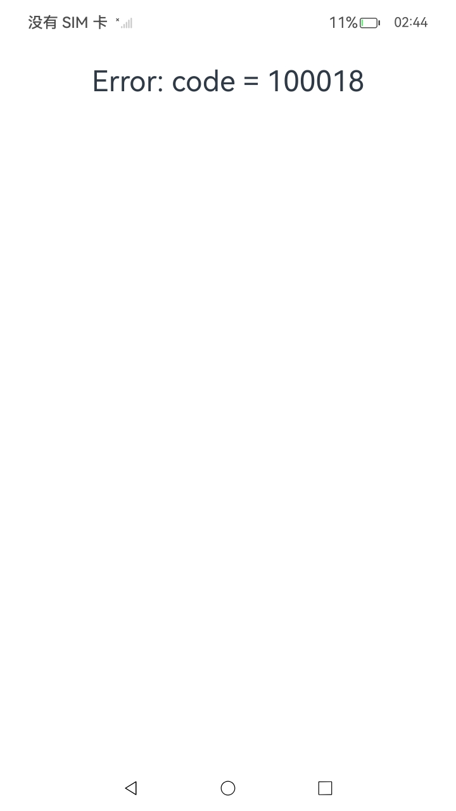
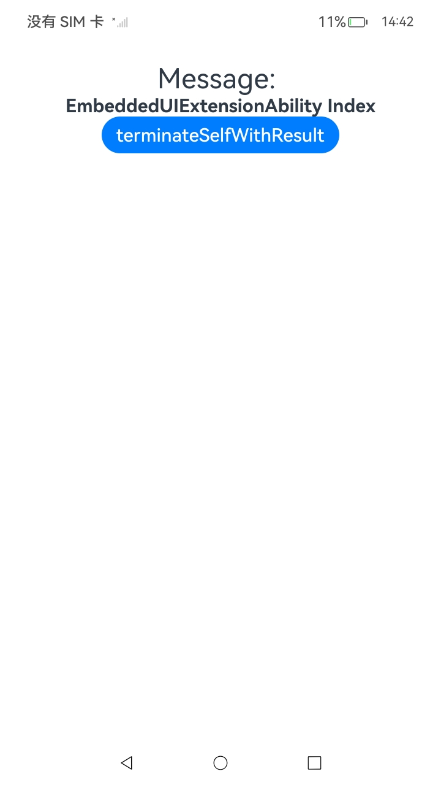

# 同应用进程嵌入式组件 (EmbeddedComponent)

EmbeddedComponent组件允许当前页面嵌入同一应用内其他EmbeddedUIExtensionAbility供给的UI内容，这些UI运行在独立进程中，提供更高的安全性和稳定性。

EmbeddedComponent组件主要用于实现跨模块、跨进程的嵌入式界面集成，其核心目标是通过模块化设计提升应用的灵活性和用户体验。

开发者在使用时需注意其使用限制和生命周期管理，合理设计应用架构以最大限度地发挥其优势。

## 基本概念

- [EmbeddedComponent](../reference/apis-arkui/arkui-ts/ts-container-embedded-component.md)组件

  EmbeddedComponent组件用于在当前页面嵌入本应用内其他EmbeddedUIExtensionAbility提供的UI。它允许开发者将应用的某些功能或界面嵌入另一个界面中，实现更灵活的用户界面设计，适用于需要进程隔离的模块化开发场景。

- [EmbeddedUIExtensionAbility](../reference/apis-ability-kit/js-apis-app-ability-embeddedUIExtensionAbility.md)组件

  提供方应用中定义使用，用于实现跨进程界面嵌入功能，仅能被同应用的UIAbility拉起，并需在多进程权限的场景下使用。

## 使用约束

- 设备要求

  EmbeddedComponent组件仅支持在拥有多进程权限的设备上使用。

- 应用范围

  EmbeddedComponent组件只能在UIAbility中使用，且被拉起的EmbeddedUIExtensionAbility需与UIAbility属于同一应用。

- 属性限制

  EmbeddedComponent组件支持[通用属性](../reference/apis-arkui/arkui-ts/ts-component-general-attributes.md)，且宽高默认值和最小值均为10vp；
  
  不支持如下与宽高相关的属性：
  "constraintSize"、"aspectRatio"、"layoutWeight"、"flexBasis"、"flexGrow"和"flexShrink"。

- 事件调用

  与屏幕坐标相关的事件信息会基于EmbeddedComponent的位置宽高进行坐标转换后传递给被拉起的EmbeddedUIExtensionAbility处理。

  EmbeddedComponent组件不支持[点击](../reference/apis-arkui/arkui-ts/ts-universal-events-click.md)等通用事件，仅支持[onTerminated](../reference/apis-arkui/arkui-ts/ts-container-embedded-component.md#onterminated)事件和[onError](../reference/apis-arkui/arkui-ts/ts-container-embedded-component.md#onerror)事件。

## 场景示例

该示例简单展示了EmbeddedComponent组件和EmbeddedUIExtensionAbility的基础使用方式。

**加载项首页**

加载项首页是EmbeddedComponent组件的宿主页面，负责加载和展示嵌入式UI扩展能力的内容。以下是一个完整的加载项首页实现示例：

```ts
import { Want } from '@kit.AbilityKit';

@Entry
@Component
struct Index {
  @State message: string = 'Message: '
  private want: Want = {
    bundleName: "com.example.embeddeddemo",
    abilityName: "ExampleEmbeddedAbility",
  }

  build() {
    Row() {
      Column() {
        Text(this.message).fontSize(30)
        EmbeddedComponent(this.want, EmbeddedType.EMBEDDED_UI_EXTENSION)
          .width('100%')
          .height('90%')
          .onTerminated((info) => {
            // 点击extension页面内的terminateSelfWithResult按钮后触发onTerminated回调，文本框显示如下信息
            this.message = 'Termination: code = ' + info.code + ', want = ' + JSON.stringify(info.want);
          })
          .onError((error) => {
            // 失败或异常触发onError回调，文本框显示如下报错内容
            this.message = 'Error: code = ' + error.code;
          })
      }
      .width('100%')
    }
    .height('100%')
  }
}
```

在ArkTS项目中，EmbeddedUIExtensionAbility的实现代码通常位于项目的ets/extensionAbility目录下。例如，ExampleEmbeddedAbility.ets文件位于./ets/extensionAbility/目录中。

在实现加载项首页时，开发者需要注意以下几点：

- 多进程模型检测

  在应用启动时，建议检测设备是否已开启多进程模型。如果未开启，应提供明确的错误提示或引导用户开启。

- 异常处理

  通过[onError](../reference/apis-arkui/arkui-ts/ts-container-embedded-component.md#onerror)事件处理加载或运行嵌入式能力时可能出现的错误，提升用户体验。

- 生命周期管理

  了解并管理好嵌入式组件的生命周期，确保资源的正确释放和回收。

- 样式配置

  合理配置EmbeddedComponent组件的大小和位置，确保嵌入式界面能够以期望的尺寸和位置显示。

**提供方应用生命周期实现**

提供方应用是指提供嵌入式UI扩展能力的应用。以下是提供方应用生命周期实现的代码示例：

```ts
import { EmbeddedUIExtensionAbility, UIExtensionContentSession, Want } from '@kit.AbilityKit';

const TAG: string = '[ExampleEmbeddedAbility]'

export default class ExampleEmbeddedAbility extends EmbeddedUIExtensionAbility {
  onCreate() {
    console.info(TAG, `onCreate`);
  }

  onForeground() {
    console.info(TAG, `onForeground`);
  }

  onBackground() {
    console.info(TAG, `onBackground`);
  }

  onDestroy() {
    console.info(TAG, `onDestroy`);
  }

  onSessionCreate(want: Want, session: UIExtensionContentSession) {
    console.info(TAG, `onSessionCreate, want: ${JSON.stringify(want)}`);
    let param: Record<string, UIExtensionContentSession> = {
      'session': session
    };
    let storage: LocalStorage = new LocalStorage(param);
    // 加载pages/extension.ets页面内容
    session.loadContent('pages/extension', storage);
  }

  onSessionDestroy(session: UIExtensionContentSession) {
    console.info(TAG, `onSessionDestroy`);
  }
}
```

关键实现说明：

- 生命周期阶段

  onCreate → onForeground：组件初始化到可见的完整流程；

  onBackground → onForeground：前后台切换时的状态迁移；

  onDestroy：组件被宿主主动销毁时的资源回收点。

- 会话管理

  onSessionCreate：创建独立存储上下文并加载UI界面；

  onSessionDestroy：处理会话结束时（如用户主动关闭）的清理操作。

- 上下文传递

  通过LocalStorage实现UIExtensionContentSession的跨组件传递；

  使用loadContent方法绑定ArkTS页面与扩展能力上下文。

**入口页面**

以下提供方应用的入口组件实现，展示了如何使用UIExtensionContentSession会话以及如何通过按钮点击事件退出嵌入式页面并返回结果，该代码文件需要在main_pages.json配置文件中声明使用。

```ts
import { UIExtensionContentSession } from '@kit.AbilityKit';

let storage = new LocalStorage();

@Entry(storage)
@Component
struct Extension {
  @State message: string = 'EmbeddedUIExtensionAbility Index';
  private session: UIExtensionContentSession | undefined = storage.get<UIExtensionContentSession>('session');

  build() {
    Column() {
      Text(this.message)
        .fontSize(20)
        .fontWeight(FontWeight.Bold)
      Button("terminateSelfWithResult").fontSize(20).onClick(() => {
        // 点击按钮后调用terminateSelfWithResult退出
        this.session?.terminateSelfWithResult({
          resultCode: 1,
          want: {
            bundleName: "com.example.embeddeddemo",
            abilityName: "ExampleEmbeddedAbility",
          }
        });
      })
    }.width('100%').height('100%')
  }
}
```

在实现入口页面时，开发者需要注意以下几点：

1. 会话管理

   正确获取并使用UIExtensionContentSession会话对象，确保与宿主应用的通信正常。

2. 结果返回

   通过terminateSelfWithResult方法向宿主应用返回结果时，需要指定：

   - resultCode：结果代码；

   - want：目标意图，指定结果的接收方。

3. 页面生命周期

   了解并管理好入口页面的生命周期，确保资源的正确释放和回收。

4. 样式配置

   合理配置页面元素的样式，确保界面显示效果符合预期。

**添加配置项**

  为了使嵌入式UI扩展能力正常工作，需要在应用的配置文件中进行相应的设置。

  在module.json5配置文件的"extensionAbilities"标签下增加ExampleEmbeddedAbility配置，以注册ExampleEmbeddedAbility嵌入式UI扩展能力。

```json
{
  "name": "ExampleEmbeddedAbility",
  "srcEntry": "./ets/extensionAbility/ExampleEmbeddedAbility.ets",
  "type": "embeddedUI"
}
```

**预期效果**

1. 启动应用，由于设备默认未开启多进程，会出现报错信息；

   

2. 设备测试开启多进程后重启设备，开启多进程的hdc命令如下：

   ```bash
   hdc shell param set persist.sys.abilityms.multi_process_model true
   ```

3. 启动应用，界面显示正常；

   

4. 点击terminateSelfWithResult按钮，提供方内容消失，页面显示onTerminated信息。
