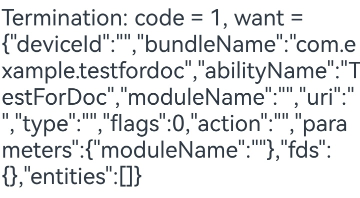

# EmbeddedComponent 组件

EmbeddedComponent的作用是在当前页面中嵌入来自本应用内其他EmbeddedUIExtensionAbility所提供的用户界面。这些EmbeddedUIExtensionAbility在独立的进程中执行，负责页面的布局和渲染工作。

这种做法通常适用于需要进程隔离的模块化开发场景。

## 导入模块

```ts
import { UIExtensionContentSession } from '@kit.AbilityKit';
```

## 场景示例

该示例简单展示了 EmbeddedComponent 组件和 EmbeddedUIExtensionAbility 的基础使用方式。

### 预期效果

1. 启动应用，出现报错信息；

2. 手机测试开启多进程后重启手机，参考命令如下：

```bash
hdc shell param set persist.sys.abilityms.multi_process_model true
```

3. 启动应用，界面显示正常；

4. 点击 terminateSelfWithResult 按钮，提供方内容小时，页面显示 onTerminated 信息。

### 加载项首页

```ts
import { Want } from '@kit.AbilityKit';

@Entry
@Component
struct Index {
  @State message: string = 'Message: '
  private want: Want = {
    bundleName: "com.example.embeddeddemo",
    abilityName: "ExampleEmbeddedAbility",
  }

  build() {
    Row() {
      Column() {
        Text(this.message).fontSize(30)
        EmbeddedComponent(this.want, EmbeddedType.EMBEDDED_UI_EXTENSION)
          .width('100%')
          .height('90%')
          .onTerminated((info) => {
            // 点击extension页面内的terminateSelfWithResult按钮后触发onTerminated回调，文本框显示如下信息
            this.message = 'Termination: code = ' + info.code + ', want = ' + JSON.stringify(info.want);
          })
          .onError((error) => {
            // 失败或异常触发onError回调，文本框显示如下报错内容
            this.message = 'Error: code = ' + error.code;
          })
      }
      .width('100%')
    }
    .height('100%')
  }
}
```

### EmbeddedComponent 拉起的 ExampleEmbeddedAbility 实现代码

```ts
import { EmbeddedUIExtensionAbility, UIExtensionContentSession, Want } from '@kit.AbilityKit';

const TAG: string = '[ExampleEmbeddedAbility]'

export default class ExampleEmbeddedAbility extends EmbeddedUIExtensionAbility {
  onCreate() {
    console.log(TAG, `onCreate`);
  }

  onForeground() {
    console.log(TAG, `onForeground`);
  }

  onBackground() {
    console.log(TAG, `onBackground`);
  }

  onDestroy() {
    console.log(TAG, `onDestroy`);
  }

  onSessionCreate(want: Want, session: UIExtensionContentSession) {
    console.log(TAG, `onSessionCreate, want: ${JSON.stringify(want)}`);
    let param: Record<string, UIExtensionContentSession> = {
      'session': session
    };
    let storage: LocalStorage = new LocalStorage(param);
    // 加载pages/extension.ets页面内容
    session.loadContent('pages/extension', storage);
  }

  onSessionDestroy(session: UIExtensionContentSession) {
    console.log(TAG, `onSessionDestroy`);
  }
}
```

### ExampleEmbeddedAbility 的入口页面文件实现代码

该代码文件需要在 main_pages.json 中配置该页面路径

```ts
import { UIExtensionContentSession } from '@kit.AbilityKit';

let storage = LocalStorage.getShared()

@Entry(storage)
@Component
struct Extension {
  @State message: string = 'EmbeddedUIExtensionAbility Index';
  private session: UIExtensionContentSession | undefined = storage.get<UIExtensionContentSession>('session');

  build() {
    Column() {
      Text(this.message)
        .fontSize(20)
        .fontWeight(FontWeight.Bold)
      Button("terminateSelfWithResult").fontSize(20).onClick(() => {
        // 点击按钮后调用terminateSelfWithResult退出
        this.session?.terminateSelfWithResult({
          resultCode: 1,
          want: {
            bundleName: "com.example.embeddeddemo",
            abilityName: "ExampleEmbeddedAbility",
          }
        });
      })
    }.width('100%').height('100%')
  }
}
```

### 添加配置项

在 module.json5 配置文件的 "extensionAbilities" 标签下增加 ExampleEmbeddedAbility 配置

```json
{
  "name": "ExampleEmbeddedAbility",
  "srcEntry": "./ets/extensionAbility/ExampleEmbeddedAbility.ets",
  "type": "embeddedUI"
}
```



<!--RP1--><!--RP1End-->