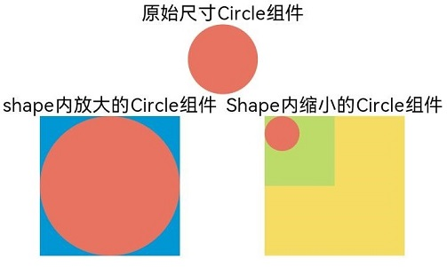
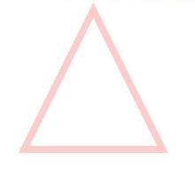
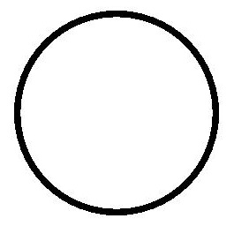
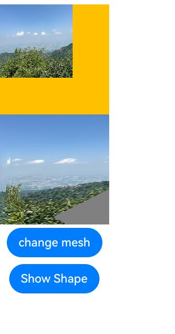

# 绘制几何图形 (Shape)
<!--Kit: ArkUI-->
<!--Subsystem: ArkUI-->
<!--Owner: @zjsxstar-->
<!--SE: @sunbees-->
<!--TSE: @liuli0427-->


绘制组件用于在页面绘制图形，Shape组件是绘制组件的父组件，父组件中会描述所有绘制组件均支持的通用属性。具体用法请参考[Shape](../reference/apis-arkui/arkui-ts/ts-drawing-components-shape.md)。


## 创建绘制组件

绘制组件可以由以下两种形式创建：

- 绘制组件使用Shape作为父组件，实现类似SVG的效果。接口调用为以下形式：

  ```ts
  Shape(value?: PixelMap)
  ```

  该接口用于创建带有父组件的绘制组件，其中value用于设置绘制目标，可将图形绘制在指定的PixelMap对象中，若未设置，则在当前绘制目标中进行绘制。

  ```ts
  Shape() {
    Rect().width(300).height(50)
  }
  ```


- 绘制组件单独使用，用于在页面上绘制指定的图形。有7种绘制类型，分别为[Circle](../reference/apis-arkui/arkui-ts/ts-drawing-components-circle.md)（圆形）、[Ellipse](../reference/apis-arkui/arkui-ts/ts-drawing-components-ellipse.md)（椭圆形）、[Line](../reference/apis-arkui/arkui-ts/ts-drawing-components-line.md)（直线）、[Polyline](../reference/apis-arkui/arkui-ts/ts-drawing-components-polyline.md)（折线）、[Polygon](../reference/apis-arkui/arkui-ts/ts-drawing-components-polygon.md)（多边形）、[Path](../reference/apis-arkui/arkui-ts/ts-drawing-components-path.md)（路径）、[Rect](../reference/apis-arkui/arkui-ts/ts-drawing-components-rect.md)（矩形）。以Circle的接口调用为例：

  ```ts
  Circle(value?: { width?: string | number, height?: string | number })
  ```

    该接口用于在页面绘制圆形，其中width用于设置圆形的宽度，height用于设置圆形的高度，圆形直径由宽高最小值确定。

  ```ts
  Circle({ width: 150, height: 150 })
  ```

  


## 形状视口viewport


```ts
viewPort(value: { x?: number | string, y?: number | string, width?: number | string, height?: number | string })
```

形状视口viewport指定用户空间中的一个矩形，该矩形映射到为关联的SVG元素建立的视区边界。viewport属性的值包含x、y、width和height四个可选参数，x和y表示视区的左上角坐标，width和height表示其尺寸。

以下三个示例说明如何使用viewport：

- 通过形状视口对图形进行放大与缩小。

  ```ts
  class tmp{
    x:number = 0
    y:number = 0
    width:number = 75
    height:number = 75
  }
  let viep:tmp = new tmp()

  class tmp1{
    x:number = 0
    y:number = 0
    width:number = 300
    height:number = 300
  }
  let viep1:tmp1 = new tmp1()

  // 画一个宽高都为75的圆
  Text('原始尺寸Circle组件')
  Circle({width: 75, height: 75}).fill('#E87361')

  Row({space:10}) {
    Column() {
      // 创建一个宽高都为150的shape组件，背景色为黄色，一个宽高都为75的viewport。用一个蓝色的矩形来填充viewport，在viewport中绘制一个直径为75的圆。
      // 绘制结束，viewport会根据组件宽高放大两倍
      Text('shape内放大的Circle组件')
      Shape() {
        Rect().width('100%').height('100%').fill('#0097D4')
        Circle({width: 75, height: 75}).fill('#E87361')
      }
      .viewPort(viep)
      .width(150)
      .height(150)
      .backgroundColor('#F5DC62')
    }
    Column() {
      // 创建一个宽高都为150的shape组件，背景色为黄色，一个宽高都为300的viewport。用一个绿色的矩形来填充viewport，在viewport中绘制一个直径为75的圆。
      // 绘制结束，viewport会根据组件宽高缩小两倍。
      Text('Shape内缩小的Circle组件')
      Shape() {
        Rect().width('100%').height('100%').fill('#BDDB69')
        Circle({width: 75, height: 75}).fill('#E87361')
      }
      .viewPort(viep1)
      .width(150)
      .height(150)
      .backgroundColor('#F5DC62')
    }
  }
  ```

  

- 创建一个宽高都为300的shape组件，背景色为黄色，创建一个宽高都为300的viewport。用一个蓝色的矩形来填充viewport，在viewport中绘制一个半径为75的圆。

  ```ts
  class tmp{
    x:number = 0
    y:number = 0
    width:number = 300
    height:number = 300
  }
  let viep:tmp = new tmp()

  Shape() {
    Rect().width("100%").height("100%").fill("#0097D4")
    Circle({ width: 150, height: 150 }).fill("#E87361")
  }
    .viewPort(viep)
    .width(300)
    .height(300)
    .backgroundColor("#F5DC62")
  ```

  

- 创建一个宽高都为300的shape组件，背景色为黄色，创建一个宽高都为300的viewport。用一个蓝色的矩形来填充viewport，在viewport中绘制一个半径为75的圆，将viewport向右方和下方各平移150。

  ```ts
  class tmp{
    x:number = -150
    y:number = -150
    width:number = 300
    height:number = 300
  }
  let viep:tmp = new tmp()

  Shape() {
    Rect().width("100%").height("100%").fill("#0097D4")
    Circle({ width: 150, height: 150 }).fill("#E87361")
  }
    .viewPort(viep)
    .width(300)
    .height(300)
    .backgroundColor("#F5DC62")
  ```

  


## 自定义样式

绘制组件支持通过各种属性更改组件样式。

- 通过[fill](../reference/apis-arkui/arkui-ts/ts-drawing-components-path.md#fill)可以设置组件填充区域颜色。

  ```ts
  Path()
    .width(100)
    .height(100)
    .commands('M150 0 L300 300 L0 300 Z')
    .fill("#E87361")
    .strokeWidth(0)
  ```

  

- 通过[stroke](../reference/apis-arkui/arkui-ts/ts-drawing-components-path.md#stroke)可以设置组件边框颜色。

  ```ts
  Path()
    .width(100)
    .height(100)
    .fillOpacity(0)
    .commands('M150 0 L300 300 L0 300 Z')
    .stroke(Color.Red)
  ```

  

- 通过[strokeOpacity](../reference/apis-arkui/arkui-ts/ts-drawing-components-path.md#strokeopacity)可以设置边框透明度。

  ```ts
  Path()
    .width(100)
    .height(100)
    .fillOpacity(0)
    .commands('M150 0 L300 300 L0 300 Z')
    .stroke(Color.Red)
    .strokeWidth(10)
    .strokeOpacity(0.2)
  ```

  

- 通过[strokeLineJoin](../reference/apis-arkui/arkui-ts/ts-drawing-components-polyline.md#strokelinejoin)可以设置线条拐角绘制样式。拐角绘制样式分为Bevel(使用斜角连接路径段)、Miter(使用尖角连接路径段)、Round(使用圆角连接路径段)。

  ```ts
  Polyline()
    .width(100)
    .height(100)
    .fillOpacity(0)
    .stroke(Color.Red)
    .strokeWidth(8)
    .points([[20, 0], [0, 100], [100, 90]])
     // 设置折线拐角处为圆弧
    .strokeLineJoin(LineJoinStyle.Round)
  ```

  

- 通过[strokeMiterLimit](../reference/apis-arkui/arkui-ts/ts-drawing-components-polyline.md#strokemiterlimit)设置斜接长度与边框宽度比值的极限值。
  斜接长度表示外边框外边交点到内边交点的距离，边框宽度即[strokeWidth](../reference/apis-arkui/arkui-ts/ts-drawing-components-polyline.md#strokewidth)属性的值。strokeMiterLimit取值需大于等于1，且在[strokeLineJoin](../reference/apis-arkui/arkui-ts/ts-drawing-components-polyline.md#strokelinejoin)属性取值LineJoinStyle.Miter时生效。

  ```ts
  Polyline()
    .width(100)
    .height(100)
    .fillOpacity(0)
    .stroke(Color.Red)
    .strokeWidth(10)
    .points([[20, 0], [20, 100], [100, 100]])
    // 设置折线拐角处为尖角
    .strokeLineJoin(LineJoinStyle.Miter)
    // 设置斜接长度与线宽的比值
    .strokeMiterLimit(1/Math.sin(45))
  Polyline()
    .width(100)
    .height(100)
    .fillOpacity(0)
    .stroke(Color.Red)
    .strokeWidth(10)
    .points([[20, 0], [20, 100], [100, 100]])
    .strokeLineJoin(LineJoinStyle.Miter)
    .strokeMiterLimit(1.42)
  ```

  

- 通过[antiAlias](../reference/apis-arkui/arkui-ts/ts-drawing-components-circle.md#antialias)设置是否开启抗锯齿，默认值为true（开启抗锯齿）。

  ```ts
  //开启抗锯齿
  Circle()
    .width(150)
    .height(200)
    .fillOpacity(0)
    .strokeWidth(5)
    .stroke(Color.Black)
  ```

  

  ```ts
  //关闭抗锯齿
  Circle()
    .width(150)
    .height(200)
    .fillOpacity(0)
    .strokeWidth(5)
    .stroke(Color.Black)
    .antiAlias(false)
  ```

  

- 通过[mesh](../reference/apis-arkui/arkui-ts/ts-drawing-components-shape.md#mesh8)设置网格效果，实现图像局部扭曲。

```ts
import { FrameNode, NodeController, RenderNode } from '@kit.ArkUI';
import { image } from '@kit.ImageKit';
import { drawing } from '@kit.ArkGraphics2D';

let offCanvas: OffscreenCanvas = new OffscreenCanvas(150, 150);
let ctx = offCanvas.getContext("2d")

class DrawingRenderNode extends RenderNode {
  verts_: Array<number> = [0, 0, 50, 0, 410, 0, 0, 180, 50, 180, 410, 180, 0, 360, 50, 360, 410, 360]

  setVerts(verts: Array<number>): void {
    this.verts_ = verts
  }

  async draw(context: DrawContext) {
    console.log("Kee draw");
    const canvas = context.canvas;
    let pixelMap = ctx.getPixelMap(0, 0, 150, 150)
    const brush = new drawing.Brush(); // 只支持brush，使用pen没有绘制效果。
    canvas.attachBrush(brush);
    let verts: Array<number> = [0, 0, 410, 0, 50, 0, 0, 180, 50, 180, 410, 180, 0, 360, 410, 360, 50, 360];
    ; // 18
    canvas.drawPixelMapMesh(pixelMap, 2, 2, verts, 0, null, 0);
    canvas.detachBrush();
  }
}

const renderNode = new DrawingRenderNode();
renderNode.frame = {
  x: 0,
  y: 0,
  width: 150,
  height: 150
};

class MyNodeController extends NodeController {
  private rootNode: FrameNode | null = null;

  makeNode(uiContext: UIContext): FrameNode | null {
    this.rootNode = new FrameNode(uiContext);

    const rootRenderNode = this.rootNode.getRenderNode();
    if (rootRenderNode !== null) {
      rootRenderNode.appendChild(renderNode);
    }
    return this.rootNode;
  }
}

@Entry
@Component
struct Index {
  private myNodeController: MyNodeController = new MyNodeController();
  @State showShape: boolean = false;
  @State pixelMap: image.PixelMap | undefined = undefined
  @State shapeWidth: number = 150
  @State strokeWidth: number = 1
  @State meshArray: Array<number> = [0, 0, 50, 0, 410, 0, 0, 180, 50, 180, 410, 180, 0, 360, 50, 360, 410, 360]

  aboutToAppear(): void {
    let img: ImageBitmap = new ImageBitmap("common/image/tree.png")
    ctx.drawImage(img, 0, 0, 100, 100)
    this.pixelMap = ctx.getPixelMap(0, 0, 150, 150)
  }

  build() {
    Column() {
      Image(this.pixelMap)
        .backgroundColor(Color.Red)
        .width(150)
        .height(150)
        .onClick(() => {
          let img: ImageBitmap = new ImageBitmap("common/image/foreground.png")
          ctx.drawImage(img, 0, 0, 100, 100)
          this.pixelMap = ctx.getPixelMap(1, 1, 150, 150)
          this.myNodeController.rebuild()
          this.strokeWidth += 1
        })

      NodeContainer(this.myNodeController)
        .width(150)
        .height(150)
        .backgroundColor(Color.Grey)
        .onClick(() => {
          this.meshArray = [0, 0, 50, 0, 410, 0, 0, 180, 50, 180, 410, 180, 0, 360, 50, 360, 410, 360, 0]
        })
      Button("change mesh")
        .margin(5)
        .onClick(() => {
          this.meshArray = [0, 0, 410, 0, 50, 0, 0, 180, 50, 180, 410, 180, 0, 360, 410, 360, 50, 360];
        })
      Button("Show Shape")
        .margin(5)
        .onClick(() => {
          this.showShape = !this.showShape
        })

      if (this.showShape) {
        Shape(this.pixelMap) {
          Path().width(150).height(60).commands('M0 0 L400 0 L400 150 Z')
        }
        .fillOpacity(0.2)
        .backgroundColor(Color.Grey)
        .width(this.shapeWidth)
        .height(150)
        .mesh(this.meshArray, 2, 2)
        .fill(0x317AF7)
        .stroke(0xEE8443)
        .strokeWidth(this.strokeWidth)
        .strokeLineJoin(LineJoinStyle.Miter)
        .strokeMiterLimit(5)

        Shape(this.pixelMap) {
          Path().width(150).height(60).commands('M0 0 L400 0 L400 150 Z')
        }
        .fillOpacity(0.2)
        .backgroundColor(Color.Grey)
        .width(this.shapeWidth)
        .height(150)
        .fill(0x317AF7)
        .stroke(0xEE8443)
        .strokeWidth(this.strokeWidth)
        .strokeLineJoin(LineJoinStyle.Miter)
        .strokeMiterLimit(5)
        .onDragStart(() => {
        })

        // mesh只对shape传入pixelMap时生效，此处不生效
        Shape() {
          Path().width(150).height(60).commands('M0 0 L400 0 L400 150 Z')
        }
        .fillOpacity(0.2)
        .backgroundColor(Color.Grey)
        .width(this.shapeWidth)
        .height(150)
        .mesh(this.meshArray, 2, 2)
        .fill(0x317AF7)
        .stroke(0xEE8443)
        .strokeWidth(this.strokeWidth)
        .strokeLineJoin(LineJoinStyle.Miter)
        .strokeMiterLimit(5)
        .onClick(() => {
          this.pixelMap = undefined;
        })
      }
    }
  }
}

```


## 场景示例

### 绘制封闭路径

  在Shape的(-80, -5)点绘制一个封闭路径，填充颜色0x317AF7，线条宽度3，边框颜色红色，拐角样式锐角（默认值）。

  ```ts
  @Entry
  @Component
  struct ShapeExample {
    build() {
      Column({ space: 10 }) {
        Shape() {
          Path().width(200).height(60).commands('M0 0 L400 0 L400 150 Z')
        }
        .viewPort({ x: -80, y: -5, width: 500, height: 300 })
        .fill(0x317AF7)
        .stroke(Color.Red)
        .strokeWidth(3)
        .strokeLineJoin(LineJoinStyle.Miter)
        .strokeMiterLimit(5)
      }.width('100%').margin({ top: 15 })
    }
  }
  ```

  

### 绘制圆和圆环

  绘制一个直径为150的圆，和一个直径为150、线条为红色虚线的圆环（宽高设置不一致时以短边为直径）。

  ```ts
  @Entry
  @Component
  struct CircleExample {
    build() {
      Column({ space: 10 }) {
        //绘制一个直径为150的圆
        Circle({ width: 150, height: 150 })
        //绘制一个直径为150、线条为红色虚线的圆环
        Circle()
          .width(150)
          .height(200)
          .fillOpacity(0)
          .strokeWidth(3)
          .stroke(Color.Red)
          .strokeDashArray([1, 2])
      }.width('100%')
    }
  }
  ```

  
