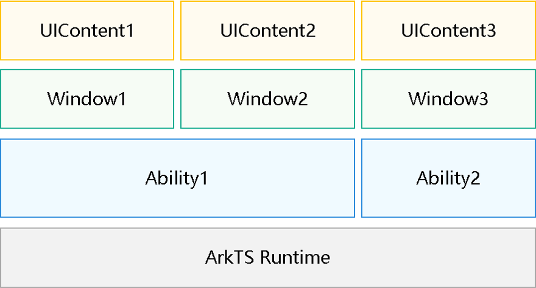

# 使用UI上下文接口操作界面（UIContext）

## 概述

OpenHarmony支持Stage模型后，存在一个ArkTS引擎里面运行多个ArkUI实例的场景。此时，一个ArkTS引擎下可能会有多个Ability，每个Ability可能有多个Window，每个Window通过loadContent加载页面，生成一个UIContent（ArkUI实例）。

**图1** 多实例关系图  


FA模型默认只支持一个ArkUI实例，没有多实例的场景。当框架切换到Stage模型后，在FA模型下开放的ArkUI全局接口，在调用时无法明确运行在哪个实例里，存在语义不明确的问题。并且，这些接口实现依赖了ArkUI实例相关的信息，如果实例不明确，会导致运行时会出现预期外的行为。

为了解决此类问题，ArkUI针对Stage模型推出了替代接口，以便满足开发者在多实例场景下的诉求。可使用window的接口方法[`getUIContext`](../reference/apis-arkui/js-apis-window.md#getuicontext10)或者使用组件内置方法[`getUIContext`](../reference/apis-arkui/arkui-ts/ts-custom-component-api.md#getuicontext)直接获取当前组件所在的UIContext，并使用[UIContext](../reference/apis-arkui/js-apis-arkui-UIContext.md#uicontext)中对应的接口获取与实例绑定的对象。

## 接口替代关系

部分多实例替代接口如下表所示，UIContext实例支持的全量接口以[UIContext](../reference/apis-arkui/js-apis-arkui-UIContext.md)中描述为准。

|               全局接口                |               替代接口                |            说明            |
| :-----------------------------------: | :-----------------------------------: | :------------------------: |
|            @ohos.animator             |            createAnimator             |      自定义动画控制器      |
|     @ohos.arkui.componentSnapshot     |         getComponentSnapshot          |          组件截图          |
|      @ohos.arkui.componentUtils       |           getComponentUtils           |         组件工具类         |
|      @ohos.arkui.dragController       |           getDragController           |         拖拽控制器         |
|         @ohos.arkui.inspector         |            getUIInspector             |        组件布局回调        |
|         @ohos.arkui.observer          |             getUIObserver             |          无感监听          |
|              @ohos.font               |                getFont                |         自定义字体         |
|             @ohos.measure             |            getMeasureUtil             |          文本计算          |
|           @ohos.mediaquery            |             getMediaQuery             |          媒体查询          |
|          @ohos.promptAction           |            getPromptAction            |            弹窗            |
|             @ohos.router              |               getRouter               |          页面路由          |
|              AlertDialog              |            showAlertDialog            |          警告弹窗          |
|              ActionSheet              |            showActionSheet            |        列表选择弹窗        |
|         CalendarPickerDialog          |                不支持                 |       日历选择器弹窗       |
|           DatePickerDialog            |         showDatePickerDialog          |      日期滑动选择弹窗      |
|           TimePickerDialog            |         showTimePickerDialog          |     时间滑动选择器弹窗     |
|           TextPickerDialog            |         showTextPickerDialog          |     文本滑动选择器弹窗     |
|              ContextMenu              |       getContextMenuController        |          菜单控制          |
| vp2px/px2vp/fp2px/px2fp/lpx2px/px2lpx | vp2px/px2vp/fp2px/px2fp/lpx2px/px2lpx |        像素单位转换        |
|             focusControl              |            getFocusControl            |          焦点控制          |
|             cursorControl             |           getCursorControl            |          光标控制          |
|              getContext               |            getHostContext             | 获取当前的Ability的Context |
|        LocalStorage.getShared         |         getSharedLocalStorage         |  获取Ability传递的Storage  |
|               animateTo               |               animateTo               |          显式动画          |
|         animateToImmediately          |                不支持                 |        显式立即动画        |

## 接口切换方法

下述示例，实现了在具体窗口内弹出Toast。ArkUI可感知到是在当前页面下调用，找到对应的UI实例。但是，如果一些复杂场景的起始调用不在页面中，经过了异步调用，作用的实例就可能出现行为不明确的问题。

```ts
@Entry
@Component
struct Index {
  build() {
    Row() {
      Button()
        .onClick(() => {
          promptAction.showToast({            
            message: 'Message Info',
            duration: 2000 
          });
        })
    }
  }
}
```
下述示例，callNative是Node-API方法，回调如果是由C侧异步触发，执行时无法感知当前页面信息，无法确定响应的UI实例。

```ts
@Entry
@Component
struct Index {
  build() {
    Row() {
      Button()
        .onClick(() => {
          bridge.callNative("xxxx", ()=> {
            promptAction.showToast({            
              message: 'Message Info',
              duration: 2000 
            });
          })
        })
    }
  }
}
```

针对上述问题，可使用组件内置方法[`getUIContext`](../reference/apis-arkui/arkui-ts/ts-custom-component-api.md#getuicontext)直接获取当前组件所在的UIContext，并使用[UIContext](../reference/apis-arkui/js-apis-arkui-UIContext.md#uicontext)中的的getPromptAction接口获取与实例绑定的对象，使得Toast绑定到具体的实例。
```ts
@Entry
@Component
struct Index {
  build() {
    Row() {
      Button()
        .onClick(() => {
          let uiContext = this.getUIContext();
          let prompt = uiContext.getPromptAction();
          bridge.callNative("xxxx", ()=> {
            prompt.showToast({            
              message: 'Message Info',
              duration: 2000 
            });
          })
        })
    }
  }
}
```

对于UIContext中没有提供替代的接口（例如，CalendarPickerDialog和animateToImmediately），或者开发者自定义实现的业务行为与多实例相关，需要和实例绑定事（例如，一个代码段），可以使用[UIContext](../reference/apis-arkui/js-apis-arkui-UIContext.md#uicontext)的runScopedTask方法将接口或一段代码段包裹起来。

| UIContext接口 | 说明                 |
| ------------- | -------------------- |
| runScopedTask | 执行绑定实例的闭包。 |

上文的示例也可以使用如下方法实现。

```ts
// 执行绑定实例的闭包
@Entry
@Component
struct Index {
  build() {
    Row() {
      Button()
        .onClick(() => {
          let uiContext = this.getUIContext();
          uiContext.runScopedTask(() => {
            promptAction.showToast({            
              message: 'Message Info',
              duration: 2000 
            });
          })
        })
    }
  }
}
```
