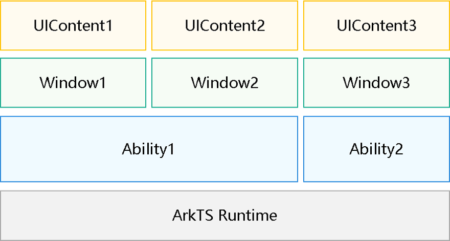

# 使用UI上下文接口操作界面（UIContext）
<!--Kit: ArkUI-->
<!--Subsystem: ArkUI-->
<!--Owner: @wangyang2022-->
<!--Designer: @wangyang2022-->
<!--Tester: @sally__-->
<!--Adviser: @Brilliantry_Rui-->

本文主要介绍了多UI实例涉及的概念，以及使用[UIContext](../reference/apis-arkui/arkts-apis-uicontext-uicontext.md)的方法替换全局接口的原因，并提供了相应的替换方案。

## 基本概念

**UI实例：** UI实例是用于管理用户界面的对象，主要负责组件、布局、动画以及交互事件等UI功能的管理。每个窗口对象都会创建并管理一个UI实例。

**UI上下文：** UI上下文是指UI实例运行环境的抽象概念，UI功能在UI上下文中运行，其效果最终反映在相应的UI实例中。

**全局接口：** ArkUI提供的一系列全局接口，这些接口在调用时无需显式指定UI实例或组件。它们会根据调用发生时所在的UI上下文，自动作用于相应的UI实例。

**调用作用域：** 调用作用域是确保UI实例在异步任务执行过程中维持正确上下文关联的核心机制。该机制通过建立明确的上下文标识体系，保证异步操作能够准确关联到其归属的UI实例。其工作机制分为下面四步：

- 标识注册：UI实例初始化时自动生成唯一标识符。

- 上下文绑定：UI实例发起的任务自动携带实例标识。

- 作用域保护：在异步边界（包括NAPI调用、Promise回调、Worker通信等）维持标识传递。

- 上下文恢复：异步任务执行时恢复其关联的UI实例标识。

下图展示了多线程下的异步任务执行场景。以Task 1为例，最初在Thread-1执行，执行途中向Thread-2抛出Task 1.2，抛出Task的同时携带了UI上下文标识，Task 1.2执行完成后又再次向Thread-3抛出Task 1.3，Task 1.3执行后重新向Thread-1抛出Task 1.4。同一Thread可能先后执行来自不同窗口的Task，执行Task时，根据Task的UI上下文标识确认当前Task属于哪一个窗口，确保异步操作能够关联到正确的UI实例。

**图1** 调用作用域原理图


## UI上下文不明确

UI上下文不明确是指调用ArkUI全局接口时，调用点无法明确识别UI实例的问题。

当前的系统支持两种[应用模型](../application-models/stage-model-development-overview.md)——FA模型和Stage模型。在FA模型中，每个UI实例拥有独立的ArkTS引擎，全局接口可以通过ArkTS引擎跟踪到对应的UI实例上，因此不存在UI上下文不明确的问题。

在Stage模型中，一个ArkTS引擎中可运行多个ArkUI实例。全局接口通过分析调用链中的上下文信息来确定当前UI上下文，异步接口和非UI接口可能导致UI上下文跟踪失败。

为了保证全局接口的相关功能正常，开发者应当使用UIContext的接口替换全局接口。

下图展示了Stage模型下ArkTS引擎和UI上下文的对应关系，一个ArkTS引擎中存在两个[Ability](../application-models/abilitykit-overview.md)，这些Ability对应了三个窗口，三个窗口各自对应一个ArkUI实例。

**图2** 多实例关系图



## UIContext接口替换全局接口的关系

部分多实例替代接口如下表所示，UIContext实例支持的全量接口以[UIContext](../reference/apis-arkui/arkts-apis-uicontext-uicontext.md)中描述为准。

示例代码使用的接口中，[isAvailable](../reference/apis-arkui/arkts-apis-uicontext-uicontext.md#isavailable20)从API version 20开始生效，其余接口从API version 18开始生效。

|               全局接口                |               替代接口                |            说明            |
| :-----------------------------------: | :-----------------------------------: | :------------------------: |
|            @ohos.animator             |            createAnimator             |      自定义动画控制器      |
|     @ohos.arkui.componentSnapshot     |         getComponentSnapshot          |          组件截图          |
|      @ohos.arkui.componentUtils       |           getComponentUtils           |         组件工具类         |
|      @ohos.arkui.dragController       |           getDragController           |         拖拽控制器         |
|         @ohos.arkui.inspector         |            getUIInspector             |        组件布局回调        |
|         @ohos.arkui.observer          |             getUIObserver             |          无感监听          |
|              @ohos.font               |                getFont                |         自定义字体         |
|             @ohos.measure             |            getMeasureUtil             |          文本计算          |
|           @ohos.mediaquery            |             getMediaQuery             |          媒体查询          |
|          @ohos.promptAction           |            getPromptAction            |            弹窗            |
|             @ohos.router              |               getRouter               |          页面路由          |
|              AlertDialog              |            showAlertDialog            |          警告弹窗          |
|              ActionSheet              |            showActionSheet            |        列表选择弹窗        |
|         CalendarPickerDialog          |                不支持                 |       日历选择器弹窗       |
|           DatePickerDialog            |         showDatePickerDialog          |      日期滑动选择弹窗      |
|           TimePickerDialog            |         showTimePickerDialog          |     时间滑动选择器弹窗     |
|           TextPickerDialog            |         showTextPickerDialog          |     文本滑动选择器弹窗     |
|              ContextMenu              |       getContextMenuController        |          菜单控制          |
| vp2px/px2vp/fp2px/px2fp/lpx2px/px2lpx | vp2px/px2vp/fp2px/px2fp/lpx2px/px2lpx |        像素单位转换        |
|             focusControl              |            getFocusControl            |          焦点控制          |
|             cursorControl             |           getCursorControl            |          光标控制          |
|              getContext               |            getHostContext             | 获取当前的Ability的Context |
|        LocalStorage.getShared         |         getSharedLocalStorage         |  获取Ability传递的Storage  |
|               animateTo               |               animateTo               |          显式动画          |
|         animateToImmediately          |                不支持                 |        显式立即动画        |

## 常见UIContext接口替换全局接口的场景

以下UIContext接口替换全局接口示例以[像素单位](../reference/apis-arkui/arkui-ts/ts-pixel-units.md)接口为例。

### 通过自定义组件获取UIContext

当全局接口在[自定义组件](./ui-js-custom-components.md)的成员方法或组件生命周期方法等其他作用域中，且this指向自定义组件时，可以通过调用自定义组件的成员方法[getUIContext](../reference/apis-arkui/arkui-ts/ts-custom-component-api.md#getuicontext)来获取UIContext对象。

>**说明：**
> 1. 在异步调用的回调方法中使用getUIContext，或者该接口的起始调用不在当前页面时，可能会在自定义组件销毁后调用接口，从而导致返回undefined。
> 2. 该方法只能通过this调用，不能通过new关键字创建的自定义组件对象调用。
> 3. 通过在[自定义声明式节点 (BuilderNode)](./arkts-user-defined-arktsNode-builderNode.md)中创建的自定义节点获取的UIContext与创建BuilderNode的UIContext指向同一个UI实例。

使用全局接口，该接口已经废弃，推荐使用下方的UIContext接口替换：
<!--deprecated_code_no_check-->

```ts
// pages/NewGlobal.ets
import { hilog } from '@kit.PerformanceAnalysisKit';

const DOMAIN = 0x0000;

@Entry
@Component
struct Index {
  build() {
    RelativeContainer() {
      Text('Calculate 20vp to px')
        .fontWeight(FontWeight.Bold)
        .alignRules({
          center: { anchor: '__container__', align: VerticalAlign.Center },
          middle: { anchor: '__container__', align: HorizontalAlign.Center }
        })
        .onClick(() => {
          let pxValue = vp2px(20);
        })
    }
    .height('100%')
    .width('100%')
  }
}
```

使用UIContext接口替换：

<!-- @[Main_NewGlobal](https://gitcode.com/openharmony/applications_app_samples/blob/master/code/DocsSample/ArkUISample/UIContext/entry/src/main/ets/pages/NewGlobal.ets) -->  

``` TypeScript
// pages/NewGlobal.ets
import { hilog } from '@kit.PerformanceAnalysisKit';

const DOMAIN = 0x0000;

@Entry
@Component
struct Index {
  build() {
    RelativeContainer() {
      Text('Calculate 20vp to px')
        .fontWeight(FontWeight.Bold)
        .alignRules({
          center: { anchor: '__container__', align: VerticalAlign.Center },
          middle: { anchor: '__container__', align: HorizontalAlign.Center }
        })
        .onClick(() => {
          let uiContext = this.getUIContext();
          let pxValue = uiContext.vp2px(20);
          hilog.info(DOMAIN, 'testTag', `20vp equals to ${pxValue}px`);
        })
    }
    .height('100%')
    .width('100%')
  }
}
```

### 通过窗口对象获取UIContext对象

开发者可以通过窗口对象的[getUIContext](../reference/apis-arkui/arkts-apis-window-Window.md#getuicontext10)方法获取UIContext对象。

>**说明：**
>
>1. 必须在UI实例创建完成后，才可以通过窗口对象的getUIContext方法获取UIContext。建议在loadContent的成功回调中调用，以确保UI实例准备就绪。
>2. vp2px/px2vp在UI实例未创建时会获取默认值进行计算，替换时可考虑获取当前默认的[Display](../reference/apis-arkui/js-apis-display.md#display)对象的逻辑像素密度进行计算结果，可参考[像素单位转换接口替换为UIContext接口](#像素单位转换接口替换为uicontext接口)。

使用全局接口：
<!--deprecated_code_no_check-->

```ts
// entryability/EntryAbility.ets
import { AbilityConstant, ConfigurationConstant, UIAbility, Want } from '@kit.AbilityKit';
import { hilog } from '@kit.PerformanceAnalysisKit';
import { window } from '@kit.ArkUI';

const DOMAIN = 0x0000;

export default class EntryAbility extends UIAbility {
  // ...

  onWindowStageCreate(windowStage: window.WindowStage): void {
    hilog.info(DOMAIN, 'testTag', '%{public}s', 'Ability onWindowStageCreate');
    // 在loadContent前调用时，vp2px会根据屏幕默认像素密度返回计算结果。
    let pxValue = vp2px(20);
    hilog.info(DOMAIN, 'testTag', `20vp equals to ${pxValue}px`);
    windowStage.loadContent('pages/Index', (err) => {
      if (err.code) {
        hilog.error(DOMAIN, 'testTag', 'Failed to load the content. Cause: %{public}s', JSON.stringify(err));
        return;
      }
      // 需要在回调中调用。
      let pxValue = vp2px(20);
      hilog.info(DOMAIN, 'testTag', `20vp equals to ${pxValue}px`);
    });
    // loadContent是异步接口，在此处调用不能保证UI实例已经创建成功。
    pxValue = vp2px(20);
    hilog.info(DOMAIN, 'testTag', `20vp equals to ${pxValue}px`);
  }

  // ...
}
```
使用UIContext接口替换：

<!-- @[Common_UIContext](https://gitcode.com/openharmony/applications_app_samples/blob/master/code/DocsSample/ArkUISample/UIContext/entry/src/main/ets/entryability/EntryAbility.ets) -->  

``` TypeScript
// entryability/EntryAbility.ets
import { AbilityConstant, UIAbility, Want } from '@kit.AbilityKit';
import { hilog } from '@kit.PerformanceAnalysisKit';
import { window } from '@kit.ArkUI';
import { ContextUtils } from '../Common/ContextUtils';
import { WindowUIContextUtils } from '../Common/WindowUtils';
import { PixelUtils } from '../Common/UIContext';
import { PixelUtil } from '../Common/Utils';

const DOMAIN = 0x0000;

export default class EntryAbility extends UIAbility {
  // ...
  onWindowStageCreate(windowStage: window.WindowStage): void {
    hilog.info(DOMAIN, 'testTag', '%{public}s', 'Ability onWindowStageCreate');
    let localStorage = new LocalStorage();
    localStorage.setOrCreate('message', 'Message from Storage')
    hilog.info(DOMAIN, 'testTag', '%{public}s', 'success localStorage');
    let window = windowStage.getMainWindowSync();
    // 注册主窗的回调。
    WindowUIContextUtils.registerWindowCallback(window);
    // 在loadContent前调用getUIContext时，UI实例未创建，存在异常。
    windowStage.loadContent('pages/Index', localStorage, (err) => {
      // 需要在loadContent完成后获取UIContext。
      if (err.code) {
        hilog.error(DOMAIN, 'testTag', 'Failed to load the content. Cause: %{public}s', JSON.stringify(err));
        return;
      }
      hilog.info(DOMAIN, 'testTag', `loadContent success.`);
      // 需要在回调中调用。
      try {
        let uiContext = window.getUIContext();
        PixelUtils.setUIContext(uiContext);
        // 主窗获焦可能早于loadContent完成，需要在成功后设置保证有效。
        WindowUIContextUtils.setActiveUIContext(uiContext)
        if (!uiContext) {
          hilog.error(DOMAIN, 'testTag', `Can't get UIContext`);
          return;
        }
        let pxValue = uiContext.vp2px(20);
        hilog.info(DOMAIN, 'testTag', `20vp equals to ${pxValue}px`);
      } catch (e) {
        hilog.error(DOMAIN, 'testTag', `Can't get UIContext, ${e}`);
      }
      // loadContent是异步接口，在此处调用不能保证UI实例已经创建成功。
    });
  }

  // ...

  onWindowStageDestroy(): void {
    hilog.info(DOMAIN, 'testTag', '%{public}s', 'Ability onWindowStageDestroy');
    // 在窗口销毁时需要移除失效的UIContext
    PixelUtil.removeUIContext();
  }

  // ...
}

```
### 通过静态方法获取UIContext对象
从API version 22开始，开发者可以通过UIContext类静态方法如[resolveUIContext](../reference/apis-arkui/arkts-apis-uicontext-uicontext.md#resolveuicontext22)获取UIContext对象。

>**说明：**
> - 优先通过自定义组件或者窗口对象获取UIContext，通过这两种方式获取不受调用作用域的影响，且获取到的是可预期的UIContext实例。
> - 使用该方案替换全局接口可以保证在同一个调用点保持与原先全局接口行为一致，但是不能保证能够作用到期望的UI实例上。

下面举例说明在不同时机使用静态方法替换全局接口的方法。

使用全局接口：

<!--deprecated_code_no_check-->
``` TypeScript
// entryability/EntryAbility.ets
import { AbilityConstant, ConfigurationConstant, UIAbility, Want } from '@kit.AbilityKit';
import { hilog } from '@kit.PerformanceAnalysisKit';
import { window } from '@kit.ArkUI';

const DOMAIN = 0x0000;

export default class EntryAbility extends UIAbility {
  // ...

  onWindowStageCreate(windowStage: window.WindowStage): void {
    hilog.info(DOMAIN, 'testTag', '%{public}s', 'Ability onWindowStageCreate');
    // 在loadContent前调用，此时无UI实例，vp2px会根据屏幕默认像素密度返回计算结果。
    let pxValue = vp2px(20);
    hilog.info(DOMAIN, 'testTag', `20vp equals to ${pxValue}px`);
    windowStage.loadContent('pages/Index', (err) => {
      if (err.code) {
        hilog.error(DOMAIN, 'testTag', 'Failed to load the content. Cause: %{public}s', JSON.stringify(err));
        return;
      }
      // 在loadContent异步回调中调用，此时有UI实例，但上下文不明确，此时会根据主窗的像素密度返回计算结果。
      let pxValue = vp2px(20);
      hilog.info(DOMAIN, 'testTag', `20vp equals to ${pxValue}px`);
    });
    // loadContent是异步接口，在此处调用不能保证UI实例已经创建成功。
    pxValue = vp2px(20);
    hilog.info(DOMAIN, 'testTag', `20vp equals to ${pxValue}px`);
  }

  // ...
}
```

<!--deprecated_code_no_check-->
``` TypeScript
// pages/Index.ets
import { hilog } from '@kit.PerformanceAnalysisKit';

const DOMAIN = 0x0000;

@Entry
@Component
struct Index {
  build() {
    RelativeContainer() {
      Text('Calculate 20vp to px')
        .fontWeight(FontWeight.Bold)
        .alignRules({
          center: { anchor: '__container__', align: VerticalAlign.Center },
          middle: { anchor: '__container__', align: HorizontalAlign.Center }
        })
        .onClick(() => {
          // 在有UI实例且上下文明确时调用，此时会根据此时UI上下文对应的实例的像素密度返回计算结果。
          let pxValue = vp2px(20);
        })
    }
    .height('100%')
    .width('100%')
  }
}
```

使用静态方法替换：

<!-- @[Common_Entry](https://gitcode.com/openharmony/applications_app_samples/blob/master/code/DocsSample/ArkUISample/ResolvedUIContext/entry/src/main/ets/entryability/EntryAbility.ets) -->  

<!--deprecated_code_no_check-->
``` TypeScript
// entryability/EntryAbility.ets
import { AbilityConstant, ConfigurationConstant, UIAbility, Want } from '@kit.AbilityKit';
import { hilog } from '@kit.PerformanceAnalysisKit';
import { window, UIContext } from '@kit.ArkUI';

const DOMAIN = 0x0000;

export default class EntryAbility extends UIAbility {
  onCreate(want: Want, launchParam: AbilityConstant.LaunchParam): void {
    try {
      this.context.getApplicationContext().setColorMode(ConfigurationConstant.ColorMode.COLOR_MODE_NOT_SET);
    } catch (err) {
      hilog.error(DOMAIN, 'testTag', 'Failed to set colorMode. Cause: %{public}s', JSON.stringify(err));
    }
    hilog.info(DOMAIN, 'testTag', '%{public}s', 'Ability onCreate');
  }

  onDestroy(): void {
    hilog.info(DOMAIN, 'testTag', '%{public}s', 'Ability onDestroy');
  }

  onWindowStageCreate(windowStage: window.WindowStage): void {
    hilog.info(DOMAIN, 'testTag', '%{public}s', 'Ability onWindowStageCreate');
    // 在loadContent前调用，此时无UI实例，vp2px会根据屏幕默认像素密度返回计算结果。
    // 此时UIContext对象的解析策略ResolveStrategy为UNDEFINED。
    let resolvedUIContext = UIContext.resolveUIContext();
    let pxValue = resolvedUIContext.vp2px(20);
    hilog.info(DOMAIN, 'testTag', `20vp equals to ${pxValue}px`);
    windowStage.loadContent('pages/Index', (err) => {
      if (err.code) {
        hilog.error(DOMAIN, 'testTag', 'Failed to load the content. Cause: %{public}s', JSON.stringify(err));
        return;
      }
      // 在loadContent异步回调中调用，此时有UI实例，但上下文不明确，此时会根据主窗的像素密度返回计算结果。
      // 此时UIContext对象的解析策略ResolveStrategy为UNIQUE。
      let resolvedUIContext = UIContext.resolveUIContext();
      let pxValue = resolvedUIContext.vp2px(20);
      hilog.info(DOMAIN, 'testTag', `20vp equals to ${pxValue}px`);
    });
    // loadContent是异步接口，在此处调用不能保证UI实例已经创建成功。
  }

  onWindowStageDestroy(): void {
    hilog.info(DOMAIN, 'testTag', '%{public}s', 'Ability onWindowStageDestroy');
  }

  onForeground(): void {
    hilog.info(DOMAIN, 'testTag', '%{public}s', 'Ability onForeground');
  }

  onBackground(): void {
    hilog.info(DOMAIN, 'testTag', '%{public}s', 'Ability onBackground');
  }
}
```

<!-- @[Common_Index](https://gitcode.com/openharmony/applications_app_samples/blob/master/code/DocsSample/ArkUISample/ResolvedUIContext/entry/src/main/ets/pages/Index.ets) -->  

``` TypeScript
// pages/Index.ets
import { hilog } from '@kit.PerformanceAnalysisKit';
import { UIContext } from '@kit.ArkUI';

const DOMAIN = 0x0000;

@Entry
@Component
struct Index {
  build() {
    RelativeContainer() {
      Text('Calculate 20vp to px')
        .fontWeight(FontWeight.Bold)
        .alignRules({
          center: { anchor: '__container__', align: VerticalAlign.Center },
          middle: { anchor: '__container__', align: HorizontalAlign.Center }
        })
        .onClick(() => {
          // 在有UI实例且上下文明确时调用，此时会根据此时UI上下文对应的实例的像素密度返回计算结果。
          // 此时UIContext对象的解析策略ResolveStrategy为CALLING_SCOPE。
          let resolvedUIContext = UIContext.resolveUIContext();
          let pxValue = resolvedUIContext.vp2px(20);
        })
    }
    .height('100%')
    .width('100%')
  }
}
```

[resolveUIContext](../reference/apis-arkui/arkts-apis-uicontext-uicontext.md#resolveuicontext22)接口获取UIContext的逻辑与下面示例通过基础查询接口组合使用的代码逻辑是等价的。

<!-- @[Common_Utils](https://gitcode.com/openharmony/applications_app_samples/blob/master/code/DocsSample/ArkUISample/ResolvedUIContext/entry/src/main/ets/common/Utils.ets) -->  

``` TypeScript
// common/Utils.ets
import { hilog } from '@kit.PerformanceAnalysisKit';
import { UIContext } from '@kit.ArkUI';

export function GetUIContextByAtomicInterface(): UIContext {
  let callingScopeUIContext = UIContext.getCallingScopeUIContext();
  if (callingScopeUIContext) {
    hilog.info(0x00, 'testTag', `Get UIContext of calling scope.`)
    return callingScopeUIContext;
  }
  let allContexts = UIContext.getAllUIContexts();
  let length = allContexts.length;
  if (length === 1) {
    hilog.info(0x00, 'testTag', `Get UIContext of unique UI instance.`)
    return allContexts[0];
  }
  let lastFocusedUIContext = UIContext.getLastFocusedUIContext();
  if (lastFocusedUIContext) {
    hilog.info(0x00, 'testTag', `Get UIContext of last focused instance.`)
    return lastFocusedUIContext;
  }
  let lastForegroundUIContext = UIContext.getLastForegroundUIContext();
  if (lastForegroundUIContext) {
    hilog.info(0x00, 'testTag', `Get UIContext of last foregrounded instance.`)
    return lastForegroundUIContext;
  }
  if (length !== 0) {
    hilog.info(0x00, 'testTag', `Get UIContext with maximum instanceId.`)
    return allContexts[length - 1];
  }
  hilog.info(0x00, 'testTag', `Get UIContext of undefined calling scope.`)
  return new UIContext();
}
```

如果开发者希望自定义UIContext的获取策略，或者需要排除上述默认规则中的某些判断条件，建议直接使用上述代码中涉及的基础查询接口进行组合替换，以实现更符合业务场景的上下文获取逻辑。

### 在封装的接口中获取UI上下文

开发者通常在封装的接口中使用全局接口。对于这类场景，应优先考虑增加UIContext类型的入参。如果应用只有一个窗口，可以使用全局存储对象来保存UIContext。

>**说明：**
>1. 创建UI实例是异步过程，需要在回调中调用窗口对象的getUIContext来获取UIContext对象。
>2. 建议增加可选的UIContext入参，方便调用者传入UIContext。
>3. vp2px/px2vp在UI实例未创建时会获取默认值进行计算，替换时可考虑获取当前默认的Display对象的逻辑像素密度进行计算，可参考[像素单位转换接口替换为UIContext接口](#像素单位转换接口替换为uicontext接口)。

使用全局接口：
<!--deprecated_code_no_check-->

```ts
// common/Utils.ets
class PixelUtils {
  static vp2px(vpValue: number) : number {
    return vp2px(vpValue);
  }

  static fp2px(fpValue: number) : number | undefined {
    return fp2px(fpValue);
  }

  static lpx2px(lpxValue: number) : number | undefined {
    return lpx2px(lpxValue);
  }
}
```

使用UIContext接口替换：

<!-- @[Common_Utils](https://gitcode.com/openharmony/applications_app_samples/blob/master/code/DocsSample/ArkUISample/UIContext/entry/src/main/ets/Common/Utils.ets) -->  

``` TypeScript
// common/Utils.ets
import { hilog } from '@kit.PerformanceAnalysisKit';
import { UIContext } from '@kit.ArkUI';

const DOMAIN = 0x0000;

export class PixelUtil {
  static uiContext: UIContext | undefined;

  static setUIContext(uiContext: UIContext): void {
    PixelUtil.uiContext = uiContext;
  }

  static removeUIContext(): void {
    PixelUtil.uiContext = undefined;
  }

  static vp2px(vpValue: number, uiContext?: UIContext): number | undefined {
    let _uiContext = uiContext ?? PixelUtil.uiContext;
    if (!_uiContext || !_uiContext.isAvailable()) {
      hilog.error(DOMAIN, 'testTag', `Can't get UIContext`);
      return undefined;
    }
    return _uiContext.vp2px(vpValue)
  }

  static fp2px(fpValue: number, uiContext?: UIContext): number | undefined {
    let _uiContext = uiContext ?? PixelUtil.uiContext;
    if (!_uiContext || !_uiContext.isAvailable()) {
      hilog.error(DOMAIN, 'testTag', `Can't get UIContext`);
      return undefined;
    }
    return _uiContext.fp2px(fpValue)
  }

  static lpx2px(lpxValue: number, uiContext?: UIContext): number | undefined {
    let _uiContext = uiContext ?? PixelUtil.uiContext;
    if (!_uiContext || !_uiContext.isAvailable()) {
      hilog.error(DOMAIN, 'testTag', `Can't get UIContext`);
      return undefined;
    }
    return _uiContext.lpx2px(lpxValue)
  }
}
```
<!-- @[Common_UIContext](https://gitcode.com/openharmony/applications_app_samples/blob/master/code/DocsSample/ArkUISample/UIContext/entry/src/main/ets/entryability/EntryAbility.ets) -->  

``` TypeScript
// entryability/EntryAbility.ets
import { AbilityConstant, UIAbility, Want } from '@kit.AbilityKit';
import { hilog } from '@kit.PerformanceAnalysisKit';
import { window } from '@kit.ArkUI';
import { ContextUtils } from '../Common/ContextUtils';
import { WindowUIContextUtils } from '../Common/WindowUtils';
import { PixelUtils } from '../Common/UIContext';
import { PixelUtil } from '../Common/Utils';

const DOMAIN = 0x0000;

export default class EntryAbility extends UIAbility {
  // ...
  onWindowStageCreate(windowStage: window.WindowStage): void {
    hilog.info(DOMAIN, 'testTag', '%{public}s', 'Ability onWindowStageCreate');
    let localStorage = new LocalStorage();
    localStorage.setOrCreate('message', 'Message from Storage')
    hilog.info(DOMAIN, 'testTag', '%{public}s', 'success localStorage');
    let window = windowStage.getMainWindowSync();
    // 注册主窗的回调。
    WindowUIContextUtils.registerWindowCallback(window);
    // 在loadContent前调用getUIContext时，UI实例未创建，存在异常。
    windowStage.loadContent('pages/Index', localStorage, (err) => {
      // 需要在loadContent完成后获取UIContext。
      if (err.code) {
        hilog.error(DOMAIN, 'testTag', 'Failed to load the content. Cause: %{public}s', JSON.stringify(err));
        return;
      }
      hilog.info(DOMAIN, 'testTag', `loadContent success.`);
      // 需要在回调中调用。
      try {
        let uiContext = window.getUIContext();
        PixelUtils.setUIContext(uiContext);
        // 主窗获焦可能早于loadContent完成，需要在成功后设置保证有效。
        WindowUIContextUtils.setActiveUIContext(uiContext)
        if (!uiContext) {
          hilog.error(DOMAIN, 'testTag', `Can't get UIContext`);
          return;
        }
        let pxValue = uiContext.vp2px(20);
        hilog.info(DOMAIN, 'testTag', `20vp equals to ${pxValue}px`);
      } catch (e) {
        hilog.error(DOMAIN, 'testTag', `Can't get UIContext, ${e}`);
      }
      // loadContent是异步接口，在此处调用不能保证UI实例已经创建成功。
    });
  }

  // ...

  onWindowStageDestroy(): void {
    hilog.info(DOMAIN, 'testTag', '%{public}s', 'Ability onWindowStageDestroy');
    // 在窗口销毁时需要移除失效的UIContext
    PixelUtil.removeUIContext();
  }

  // ...
}

```

使用替换的封装接口时，建议在能够获取UIContext的场景下传入UIContext参数。

<!-- @[Main_VpPage](https://gitcode.com/openharmony/applications_app_samples/blob/master/code/DocsSample/ArkUISample/UIContext/entry/src/main/ets/pages/VpPage.ets) -->  

``` TypeScript
// pages/VpPage.ets
import { hilog } from '@kit.PerformanceAnalysisKit';
import { PixelUtil } from '../Common/Utils';

const DOMAIN = 0x0000;

@Entry
@Component
struct Index {
  build() {
    RelativeContainer() {
      Text('Calculate 20vp to px')
        .fontWeight(FontWeight.Bold)
        .alignRules({
          center: { anchor: '__container__', align: VerticalAlign.Center },
          middle: { anchor: '__container__', align: HorizontalAlign.Center }
        })
        .onClick(() => {
          let pxValue = PixelUtil.vp2px(20, this.getUIContext());
          hilog.info(DOMAIN, 'testTag', `20vp equals to ${pxValue}px`);
        })
    }
    .height('100%')
    .width('100%')
  }
}
```

无法获取UIContext时，可考虑直接调用。

<!-- @[Common_pxValue](https://gitcode.com/openharmony/applications_app_samples/blob/master/code/DocsSample/ArkUISample/UIContext/entry/src/main/ets/entryability/EntryAbility.ets) -->  

``` TypeScript
let pxValue = PixelUtils.vp2px(20);
hilog.info(DOMAIN, 'testTag', `20vp equals to ${pxValue}px`);
```


### 应用存在多窗时，通过最近获焦窗口获取UIContext

当应用有多个窗口且无法直接获取UIContext时，可通过最近获得焦点的窗口获取其UIContext。

>**说明：**
> 1. 该方案将跟踪最近一个获得焦点的窗口，在调用具体功能时，该窗口可能处于失焦状态。
> 2. 创建窗口时需要调用registerWindowCallback注册回调。

使用UIContext接口替换：

<!-- @[Common_WindowUtils](https://gitcode.com/openharmony/applications_app_samples/blob/master/code/DocsSample/ArkUISample/UIContext/entry/src/main/ets/Common/WindowUtils.ets) -->  

``` TypeScript
// common/WindowUtils.ets
import { display, window, UIContext } from '@kit.ArkUI';
import { hilog } from '@kit.PerformanceAnalysisKit';

const DOMAIN = 0x0000;

export class WindowUIContextUtils {
  public static activeUIContext: UIContext | undefined;

  static registerWindowCallback(windowClass: window.Window): void {
    try {
      windowClass.on('windowEvent', (event: window.WindowEventType) => {
        if (event === window.WindowEventType.WINDOW_ACTIVE) {
          try {
            let uiContext = windowClass.getUIContext();
            WindowUIContextUtils.activeUIContext = uiContext;
          } catch (exception) {
            hilog.error(DOMAIN, 'testTag', `Can't get UIContext, ${exception}`);
          }
        }
      });
    } catch (exception) {
      console.error(`Failed to unregister callback. Cause: ${exception}`);
    }
  }

  static unregisterWindowCallback(windowClass: window.Window): void {
    windowClass.off('windowEvent');
  }

  static setActiveUIContext(uiContext: UIContext): void {
    WindowUIContextUtils.activeUIContext = uiContext;
  }

  static vp2px(vpValue: number, uiContext?: UIContext): number {
    let _uiContext = uiContext ?? WindowUIContextUtils.activeUIContext;
    if (!_uiContext || !_uiContext.isAvailable()) {
      let displayClass = display.getDefaultDisplaySync();
      let density = displayClass.densityPixels;
      return vpValue * density;
    }

    return _uiContext.vp2px(vpValue);
  }
}
```
<!-- @[Common_registerWindowCallback](https://gitcode.com/openharmony/applications_app_samples/blob/master/code/DocsSample/ArkUISample/UIContext/entry/src/main/ets/entryability/EntryAbility.ets) -->  

``` TypeScript
// entryability/EntryAbility.ets
import { AbilityConstant, UIAbility, Want } from '@kit.AbilityKit';
import { hilog } from '@kit.PerformanceAnalysisKit';
import { window } from '@kit.ArkUI';
import { ContextUtils } from '../Common/ContextUtils';
import { WindowUIContextUtils } from '../Common/WindowUtils';
import { PixelUtils } from '../Common/UIContext';
import { PixelUtil } from '../Common/Utils';

const DOMAIN = 0x0000;

export default class EntryAbility extends UIAbility {
  // ...
  onWindowStageCreate(windowStage: window.WindowStage): void {
    hilog.info(DOMAIN, 'testTag', '%{public}s', 'Ability onWindowStageCreate');
    let localStorage = new LocalStorage();
    localStorage.setOrCreate('message', 'Message from Storage')
    hilog.info(DOMAIN, 'testTag', '%{public}s', 'success localStorage');
    let window = windowStage.getMainWindowSync();
    // 注册主窗的回调。
    WindowUIContextUtils.registerWindowCallback(window);
    // 在loadContent前调用getUIContext时，UI实例未创建，存在异常。
    windowStage.loadContent('pages/Index', localStorage, (err) => {
      // 需要在loadContent完成后获取UIContext。
      if (err.code) {
        hilog.error(DOMAIN, 'testTag', 'Failed to load the content. Cause: %{public}s', JSON.stringify(err));
        return;
      }
      hilog.info(DOMAIN, 'testTag', `loadContent success.`);
      // 需要在回调中调用。
      try {
        let uiContext = window.getUIContext();
        PixelUtils.setUIContext(uiContext);
        // 主窗获焦可能早于loadContent完成，需要在成功后设置保证有效。
        WindowUIContextUtils.setActiveUIContext(uiContext)
        if (!uiContext) {
          hilog.error(DOMAIN, 'testTag', `Can't get UIContext`);
          return;
        }
        let pxValue = uiContext.vp2px(20);
        hilog.info(DOMAIN, 'testTag', `20vp equals to ${pxValue}px`);
      } catch (e) {
        hilog.error(DOMAIN, 'testTag', `Can't get UIContext, ${e}`);
      }
      // loadContent是异步接口，在此处调用不能保证UI实例已经创建成功。
    });
  }

  onWindowStageWillDestroy(windowStage: window.WindowStage) {
    let window = windowStage.getMainWindowSync();
    hilog.info(DOMAIN, 'testTag', '%{public}s', `The main window: ${window}`);
    // 注销主窗的回调。
    WindowUIContextUtils.unregisterWindowCallback(window);
  }

  // ...
}

```
<!-- @[Main_WindowTestPage](https://gitcode.com/openharmony/applications_app_samples/blob/master/code/DocsSample/ArkUISample/UIContext/entry/src/main/ets/pages/WindowTestPage.ets) -->  

``` TypeScript
// pages/WindowTestPage.ets
import { hilog } from '@kit.PerformanceAnalysisKit';
import { window } from '@kit.ArkUI';
import { BusinessError } from '@kit.BasicServicesKit';
import { WindowUIContextUtils } from '../Common/WindowUtils';

const DOMAIN = 0x0000;

@Entry
@Component
struct Index {
  private subWindow: window.Window | undefined;

  build() {
    Column() {
      Text('Create SubWindow')
        .onClick(() => {
          let config: window.Configuration = {
            name: 'test',
            windowType: window.WindowType.TYPE_DIALOG,
            ctx: this.getUIContext().getHostContext()
          };
          try {
            window.createWindow(config, (err: BusinessError, windowClass: window.Window) => {
              const errCode: number = err.code;
              if (errCode) {
                hilog.error(DOMAIN, 'testTag', `Failed to create the window. Cause: ${errCode}`);
                return;
              }
              // 在窗口创建后注册回调。
              this.subWindow = windowClass;
              try {
                windowClass.setUIContent('pages/Index', () => {
                  WindowUIContextUtils.registerWindowCallback(windowClass);
                  windowClass.resize(500, 1000);
                  windowClass.showWindow();
                });
              } catch (exception) {
                hilog.error(DOMAIN, 'testTag', `Failed to setUIContent. Cause : ${exception}`);
              }
            });
          } catch (exception) {
            hilog.error(DOMAIN, 'testTag', `Failed to create the window. Cause : ${exception}`);
          }
        })
      Text('Destroy SubWindow')
        .onClick(() => {
          if (this.subWindow) {
            // 在窗口销毁前注销回调。
            WindowUIContextUtils.unregisterWindowCallback(this.subWindow);
            this.subWindow.destroyWindow();
          }
        })
    }
    .height('100%')
    .width('100%')
  }
}
```

### 执行绑定UI实例的闭包

对于UIContext中没有提供替代的接口（例如CalendarPickerDialog），或者开发者自定义实现的业务行为与多实例相关，需要和实例绑定时（例如，一个代码段），可以使用UIContext对象[runScopedTask](../reference/apis-arkui/arkts-apis-uicontext-uicontext.md#runscopedtask)方法执行闭包。

使用UIContext接口替换：

<!-- @[Main_CalendarPickerDialogPage](https://gitcode.com/openharmony/applications_app_samples/blob/master/code/DocsSample/ArkUISample/UIContext/entry/src/main/ets/pages/CalendarPickerDialogPage.ets) -->  

``` TypeScript
// pages/CalendarPickerDialogPage.ets
@Entry
@Component
struct CalendarPickerDialogPage {
  private selectedDate: Date = new Date('2025-10-01');

  build() {
    RelativeContainer() {
      Button('Show CalendarPicker Dialog')
        .alignRules({
          center: { anchor: '__container__', align: VerticalAlign.Center },
          middle: { anchor: '__container__', align: HorizontalAlign.Center }
        })
        .onClick(() => {
          let uiContext = this.getUIContext();
          uiContext.runScopedTask(() => {
            CalendarPickerDialog.show({
              selected: this.selectedDate,
              backgroundColor: Color.White,
              backgroundBlurStyle: BlurStyle.NONE,
              shadow: ShadowStyle.OUTER_FLOATING_SM
            });
          });
        })
    }
    .height('100%')
    .width('100%')
  }
}
```

## 特殊全局接口替换示例

部分全局接口在替换为UIContext接口时，需要考虑一些特殊的调用场景。

### 像素单位转换接口替换为UIContext接口

因为不同的UI实例可以有不同的转换系数，[像素单位](../reference/apis-arkui/arkui-ts/ts-pixel-units.md)接口计算结果依赖UI实例。其中fp2px/px2fp/lpx2px/px2lpx接口在无有效UI上下文时会返回undefined，而vp2px/px2vp接口在无有效UI上下文时，会获取默认屏幕像素密度进行计算。

| 像素单位转换接口调用时机                                     | 接口行为                                                     | 可能与预期不一致的场景                                       |
| ------------------------------------------------------------ | ------------------------------------------------------------ | ------------------------------------------------------------ |
| 主窗口创建并调用loadContent或setUIContent前。                | 没有合适的UI实例。<br/>px2vp/vp2px使用默认屏幕的density进行换算，返回结果。<br/>fp2px/px2fp/lpx2px/px2lpx返回undefined。 | px2vp/vp2px在多屏场景下可能与预期不一致。如预期以主屏的逻辑像素密度计算结果，实际以扩展屏的像素密度计算结果。 |
| 在loadContent或setUIContent后，且在UI的回调函数中。          | 根据UI跟踪的调用域（Scope）找到具体的UI实例，使用该UI实例关联的信息进行计算。 | 无                                                           |
| 应用单Ability单窗口的场景，并在loadContent或setUIContent之后，但在非UI的其他异步回调中调用。 | 无法根据UI跟踪的调用域（Scope）找到具体的UI实例，但根据当前单例场景可以确定唯一UI实例，使用该UI实例关联的信息进行计算。 | 无                                                           |
| 多Ability或多窗口的多UI实例场景，在loadContent或setUIContent调用之后，但在其他异步回调中调用。 | 无法根据UI跟踪的调用域（Scope）找到具体的UI实例，也无法确定唯一实例。接口按照最近获焦、最近前台、最近创建的优先级依次查找匹配的UI实例，并根据UI实例关联的信息进行计算。 | 多实例场景可能存在作用实例和预期不一致。如预期以主窗所处屏幕的逻辑像素密度计算结果，实际以子窗所处屏幕的像素密度计算结果。 |
| 所有的窗口销毁，无UI实例后。                                 | 没有合适的UI实例。<br/>px2vp/vp2px使用默认屏幕的density进行换算，返回结果。<br/>fp2px/px2fp/lpx2px/px2lpx返回undefined。 | px2vp/vp2px在多屏场景下可能与预期不一致。如预期以扩展屏的逻辑像素密度计算结果，实际以主屏的像素密度计算结果。 |

在实际的开发场景中，全局接口可能在UI实例创建前被调用。此时，在替换vp2px/px2vp时，开发者可以通过[display.getDefaultDisplaySync](../reference/apis-arkui/js-apis-display.md#displaygetdefaultdisplaysync9)获取当前默认屏幕的逻辑像素密度计算结果；替换fp2px/px2fp/lpx2px/px2lpx接口时，可以直接返回undefined，以保证行为的一致性。

使用全局接口：
<!--deprecated_code_no_check-->

```ts
// Common/UIContext.ets
export class PixelUtils {
  static vp2px(vpValue: number) : number {
    return vp2px(vpValue);
  }

  static fp2px(fpValue: number) : number | undefined {
    return fp2px(fpValue);
  }

  static lpx2px(lpxValue: number) : number | undefined {
    return lpx2px(lpxValue);
  }
}
```

使用UIContext接口替换：

<!-- @[Common_PixelUtils](https://gitcode.com/openharmony/applications_app_samples/blob/master/code/DocsSample/ArkUISample/UIContext/entry/src/main/ets/Common/UIContext.ets) -->  

``` TypeScript
// Common/UIContext.ets
import { hilog } from '@kit.PerformanceAnalysisKit';
import { display, UIContext } from '@kit.ArkUI';

const DOMAIN = 0x0000;

export class PixelUtils {
  public static uiContext: UIContext | undefined;

  static setUIContext(uiContext: UIContext): void {
    PixelUtils.uiContext = uiContext;
  }

  static vp2px(vpValue: number, uiContext?: UIContext): number | undefined {
    let _uiContext = uiContext ?? PixelUtils.uiContext;
    if (!_uiContext || !_uiContext.isAvailable()) {
      let displayClass = display.getDefaultDisplaySync();
      let density = displayClass.densityPixels;
      return vpValue * density;
    }
    return _uiContext.vp2px(vpValue)
  }

  static fp2px(fpValue: number, uiContext?: UIContext): number | undefined {
    let _uiContext = uiContext ?? PixelUtils.uiContext;
    if (!_uiContext || !_uiContext.isAvailable()) {
      hilog.error(DOMAIN, 'testTag', `Can't get UIContext`);
      return undefined;
    }
    return _uiContext.fp2px(fpValue)
  }

  static lpx2px(lpxValue: number, uiContext?: UIContext): number | undefined {
    let _uiContext = uiContext ?? PixelUtils.uiContext;
    if (!_uiContext || !_uiContext.isAvailable()) {
      hilog.error(DOMAIN, 'testTag', `Can't get UIContext`);
      return undefined;
    }
    return _uiContext.lpx2px(lpxValue)
  }
}
```

### 获取Ability的Context

[getContext](../reference/apis-arkui/js-apis-getContext.md)接口用于在UI页面中获取对应UI实例所属Ability的Context，因此依赖于UI实例。

| getContext接口的调用时机                                     | 接口行为                                                     | 可能与预期不一致的场景                                     |
| ------------------------------------------------------------ | ------------------------------------------------------------ | ------------------------------------------------------------ |
| 主窗口创建并调用loadContent或setUIContent前。                | 没有合适的UI实例，返回undefined。                            | 无                                                           |
| 主窗口创建并调用loadContent或setUIContent后，且传入自定义组件对象。 | 跟踪自定义组件所属的UI实例，返回该UI实例所属Ability的Context。 | 无                                                           |
| 在loadContent或setUIContent后，且在UI的回调函数中。          | 根据UI跟踪的调用域（Scope）找到具体的UI实例，返回该UI实例所属Ability的Context。 | 无                                                           |
| 应用单Ability单窗口的场景，并在loadContent或setUIContent之后，但在非UI的其他异步回调中调用且未传入自定义组件对象。 | 无法根据UI跟踪的调用域（Scope）找到具体的UI实例，但根据当前单例场景可以确定唯一UI实例，返回该UI实例所属Ability的Context。 | 无                                                           |
| 多Ability或多窗口的多UI实例场景，在loadContent或setUIContent调用之后，但在其他异步回调中调用且未传入自定义组件对象。 | 无法根据UI跟踪的调用域（Scope）找到具体的UI实例，也无法确定唯一实例。接口按照最近获焦、最近前台、最近创建的优先级依次查找匹配的UI实例，返回该UI实例所属Ability的Context。 | 多实例场景可能与预期不一致。如存在两个Ability时，预期返回第一个创建的Ability的Context，实际返回第二个创建的Ability的Context。 |
| 所有的窗口销毁，无UI实例后。                                 | 没有合适的UI实例，返回undefined。                            | 无                                                         |

在单Ability场景中，建议直接获取Ability的context属性。

使用全局接口，该接口已经废弃，推荐使用下方的UIContext接口替换：

<!--deprecated_code_no_check-->

```ts
// Common/ContextUtils.ets
import { hilog } from '@kit.PerformanceAnalysisKit';

const DOMAIN = 0x0000;

@Entry
@Component
struct GetContextPage {
  @State message: string = 'Hello World';

  build() {
    RelativeContainer() {
      Text(this.message)
        .fontWeight(FontWeight.Bold)
        .alignRules({
          center: { anchor: '__container__', align: VerticalAlign.Center },
          middle: { anchor: '__container__', align: HorizontalAlign.Center }
        })
        .onClick(() => {
          // 需要确保传入的是自定义组件对象。
          let context = getContext(this);
          hilog.info(DOMAIN, 'testTag', `The context is ${context}`);
        })
    }
    .height('100%')
    .width('100%')
  }
}
```


使用UIContext接口替换：

<!-- @[Common_ContextUtils](https://gitcode.com/openharmony/applications_app_samples/blob/master/code/DocsSample/ArkUISample/UIContext/entry/src/main/ets/Common/ContextUtils.ets) -->  

``` TypeScript
// Common/ContextUtils.ets
export class ContextUtils {
  public static context: Context | undefined;

  static setContext(context: Context): void {
    ContextUtils.context = context;
  }

  static getContext(uiContext?: UIContext): Context | undefined {
    if (uiContext) {
      return uiContext.getHostContext();
    }

    return ContextUtils.context;
  }
}
```

接口的默认返回值设置为Ability的成员属性context。

<!-- @[Common_setContext](https://gitcode.com/openharmony/applications_app_samples/blob/master/code/DocsSample/ArkUISample/UIContext/entry/src/main/ets/entryability/EntryAbility.ets) -->  

``` TypeScript
// entryability/EntryAbility.ets
import { AbilityConstant, UIAbility, Want } from '@kit.AbilityKit';
import { hilog } from '@kit.PerformanceAnalysisKit';
import { window } from '@kit.ArkUI';
import { ContextUtils } from '../Common/ContextUtils';
import { WindowUIContextUtils } from '../Common/WindowUtils';
import { PixelUtils } from '../Common/UIContext';
import { PixelUtil } from '../Common/Utils';

const DOMAIN = 0x0000;

export default class EntryAbility extends UIAbility {
  onCreate(want: Want, launchParam: AbilityConstant.LaunchParam): void {
    // ...
    ContextUtils.setContext(this.context);
    hilog.info(DOMAIN, 'testTag', '%{public}s', 'setContext success');
    // ...
  }

  onDestroy(): void {
    hilog.info(DOMAIN, 'testTag', '%{public}s', 'Ability onDestroy');
  }
  // ...
}

```

在UI界面中，建议传入UIContext，以保证符合预期或直接调用getHostContext。

<!-- @[Main_Index](https://gitcode.com/openharmony/applications_app_samples/blob/master/code/DocsSample/ArkUISample/UIContext/entry/src/main/ets/pages/ContextPage.ets) -->  

``` TypeScript
// pages/ContextPage.ets
import { ContextUtils } from '../Common/ContextUtils';
import { hilog } from '@kit.PerformanceAnalysisKit';

const DOMAIN = 0xF811;

@Entry
@Component
struct Index {
  build() {
    Column() {
      Text('getContext')
        .onClick(() => {
          let context = ContextUtils.getContext(this.getUIContext());
          hilog.info(DOMAIN, 'testTag', `The context is ${context}`);
        })
    }
    .height('100%')
    .width('100%')
  }
}
```

无UI场景直接返回窗口创建时设置的默认返回值。

<!-- @[Common_getContext](https://gitcode.com/openharmony/applications_app_samples/blob/master/code/DocsSample/ArkUISample/UIContext/entry/src/main/ets/entryability/EntryAbility.ets) -->  

``` TypeScript
let context = ContextUtils.getContext();
hilog.info(DOMAIN, 'testTag', `The context is ${context}`);
```

### LocalStorage替换为UIContext的接口

LocalStorage是页面级的UI状态存储，通过@Entry装饰器接收的参数可以在页面内共享同一个LocalStorage实例。使用全局接口时，开发者使用[getShared](../reference/apis-arkui/arkui-ts/ts-state-management.md#getshareddeprecated)向@Entry装饰器传递LocalStorage对象。使用UIContext接口后，无法直接获取UIContext对象，可以将[EntryOptions](../reference/apis-arkui/arkui-ts/ts-universal-entry.md#entryoptions10)的useSharedStorage参数设置为true，以使用共享的LocalStorage实例对象。

使用全局接口，该接口已经废弃，推荐使用下方的UIContext接口替换：

<!--deprecated_code_no_check-->

```ts
// pages/LocalStoragePage
@Entry({storage: LocalStorage.getShared()})
@Component
struct LocalStoragePage {
  @LocalStorageLink('message') message: string = 'Hello World';

  build() {
    RelativeContainer() {
      Text(this.message)
        .id('LocalStoragePageHelloWorld')
        .fontWeight(FontWeight.Bold)
        .alignRules({
          center: { anchor: '__container__', align: VerticalAlign.Center },
          middle: { anchor: '__container__', align: HorizontalAlign.Center }
        })
        .onClick(() => {
          let storage = LocalStorage.getShared();
          if (storage) {
            storage.setOrCreate('message', 'onClick is called.')
          }
        })
    }
    .height('100%')
    .width('100%')
  }
}
```

使用UIContext接口替换：

<!-- @[Main_LocalStoragePage](https://gitcode.com/openharmony/applications_app_samples/blob/master/code/DocsSample/ArkUISample/UIContext/entry/src/main/ets/pages/LocalStoragePage.ets) -->  

``` TypeScript
// pages/LocalStoragePage
@Entry({ useSharedStorage: true })
@Component
struct LocalStoragePage {
  @LocalStorageLink('message') message: string = 'Hello World';

  build() {
    RelativeContainer() {
      Text(this.message)
        .id('LocalStoragePageHelloWorld')
        .fontWeight(FontWeight.Bold)
        .alignRules({
          center: { anchor: '__container__', align: VerticalAlign.Center },
          middle: { anchor: '__container__', align: HorizontalAlign.Center }
        })
        .onClick(() => {
          let uiContext = this.getUIContext();
          let storage = uiContext.getSharedLocalStorage();
          if (storage) {
            storage.setOrCreate('message', 'onClick is called.');
            this.message = 'LocalStoragePageHelloWorld';
          }
        })
    }
    .height('100%')
    .width('100%')
  }
}
```

使用共享的LocalStorage对象需要在loadContent时传入LocalStorage，详细可参考[LocalStorage：页面级UI状态存储](./state-management/arkts-localstorage.md)。

<!-- @[Common_LocalStorage](https://gitcode.com/openharmony/applications_app_samples/blob/master/code/DocsSample/ArkUISample/UIContext/entry/src/main/ets/entryability/EntryAbility.ets) -->  

``` TypeScript
// entryability/EntryAbility.ets
import { AbilityConstant, UIAbility, Want } from '@kit.AbilityKit';
import { hilog } from '@kit.PerformanceAnalysisKit';
import { window } from '@kit.ArkUI';
import { ContextUtils } from '../Common/ContextUtils';
import { WindowUIContextUtils } from '../Common/WindowUtils';
import { PixelUtils } from '../Common/UIContext';
import { PixelUtil } from '../Common/Utils';

const DOMAIN = 0x0000;

export default class EntryAbility extends UIAbility {
  // ...
  onWindowStageCreate(windowStage: window.WindowStage): void {
    hilog.info(DOMAIN, 'testTag', '%{public}s', 'Ability onWindowStageCreate');
    let localStorage = new LocalStorage();
    localStorage.setOrCreate('message', 'Message from Storage')
  // ...
    windowStage.loadContent('pages/Index', localStorage, (err) => {
      // 需要在loadContent完成后获取UIContext。
      if (err.code) {
        hilog.error(DOMAIN, 'testTag', 'Failed to load the content. Cause: %{public}s', JSON.stringify(err));
        return;
      }
      hilog.info(DOMAIN, 'testTag', `loadContent success.`);
      // ...
    });
  }

  // ...
}
```
