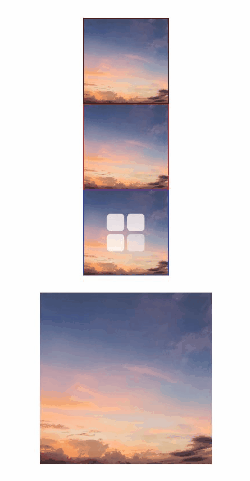
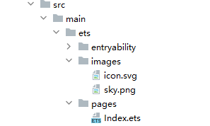
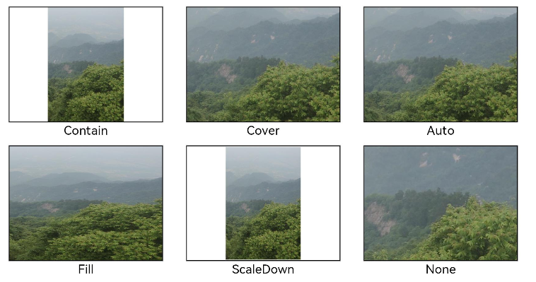
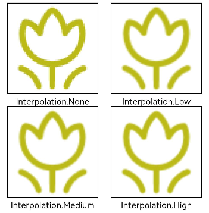
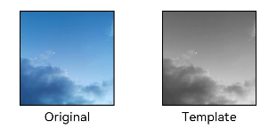
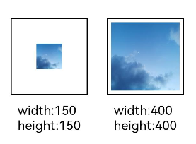

# 显示图片 (Image)


开发者经常需要在应用中显示一些图片，例如：按钮中的icon、网络图片、本地图片等。在应用中显示图片需要使用Image组件实现，Image支持多种图片格式，包括png、jpg、bmp、svg、gif和heif，不支持apng和svga格式，具体用法请参考[Image](../reference/apis-arkui/arkui-ts/ts-basic-components-image.md)组件。


Image通过调用接口来创建，接口调用形式如下：

```ts
Image(src: PixelMap | ResourceStr | DrawableDescriptor)
```


该接口通过图片数据源获取图片，支持本地图片和网络图片的渲染展示。其中，src是图片的数据源，加载方式请参考[加载图片资源](#加载图片资源)。

如果图片加载过程中出现白色块，请参考[Image白块问题解决方案](https://developer.huawei.com/consumer/cn/doc/best-practices/bpta-image-white-lump-solution)。如果图片加载时间过长，请参考[优化应用预置图片资源加载耗时问题](https://developer.huawei.com/consumer/cn/doc/best-practices/bpta-texture-compression-improve-performance)。


## 加载图片资源

Image支持加载存档图、多媒体像素图和可绘制描述符三种类型。


### 存档图类型数据源

存档图类型的数据源可以分为本地资源、网络资源、Resource资源、媒体库资源和base64。

- 本地资源

  创建文件夹，将本地图片放入ets文件夹下的任意位置。

  Image组件引入本地图片路径，即可显示图片（根目录为ets文件夹）。

  ```ts
  Image('images/view.jpg')
  .width(200)
  ```

  加载本地图片过程中，如果对图片进行修改或者替换，可能会引起应用崩溃。因此需要覆盖图片文件时，应该先删除该文件再重新创建一个同名文件。

- 网络资源

  引入网络图片需申请权限ohos.permission.INTERNET，具体申请方式请参考[声明权限](../security/AccessToken/declare-permissions.md)。此时，Image组件的src参数为网络图片的链接。

  当前Image组件仅支持加载简单网络图片。

  Image组件首次加载网络图片时，需要请求网络资源，非首次加载时，默认从缓存中直接读取图片，更多图片缓存设置请参考[setImageCacheCount](../reference/apis-arkui/js-apis-system-app.md#setimagecachecount7)、[setImageRawDataCacheSize](../reference/apis-arkui/js-apis-system-app.md#setimagerawdatacachesize7)、[setImageFileCacheSize](../reference/apis-arkui/js-apis-system-app.md#setimagefilecachesize7)。但是，这三个图片缓存接口并不灵活，且后续不继续演进，对于复杂情况，更推荐使用[ImageKnife](https://gitee.com/openharmony-tpc/ImageKnife)。

  网络图片必须支持RFC 9113标准，否则会导致加载失败。如果下载的网络图片大于10MB或一次下载的网络图片数量较多，建议使用[HTTP](../network/http-request.md)工具提前预下载，提高图片加载性能，方便应用侧管理数据。

  在显示网络图片时，Image 组件会将下载与缓存功能剥离至[缓存下载模块](../reference/apis-basic-services-kit/js-apis-request-cacheDownload.md)进行统一管理。缓存下载模块提供独立的预下载接口，允许应用开发者在创建Image组件前预下载所需图片。组件创建后，通过向缓存下载模块请求数据，从而优化了Image组件的显示流程。网络缓存的位置位于应用根目录下的cache目录中。

  ```ts
  Image('https://www.example.com/example.JPG') // 实际使用时请替换为真实地址
  ```

- Resource资源

  使用资源格式可以跨包/跨模块引入图片，resources文件夹下的图片都可以通过$r资源接口读取到并转换到Resource格式。

  **图1** resources  

  

  调用方式：

  ```
  Image($r('app.media.icon'))
  ```

  还可以将图片放在rawfile文件夹下。

  **图2** rawfile  

  

  调用方式：

  ```
  Image($rawfile('example1.png'))
  ```

- 媒体库file://data/storage

  支持file://路径前缀的字符串，用于访问通过[选择器](../reference/apis-core-file-kit/js-apis-file-picker.md)提供的图片路径。

  1. 调用接口获取图库的照片url。

      ```ts
      import { photoAccessHelper } from '@kit.MediaLibraryKit';
      import { BusinessError } from '@kit.BasicServicesKit';

      @Entry
      @Component
      struct Index {
        @State imgDatas: string[] = [];
        // 获取照片url集
        getAllImg() {
          try {
            let PhotoSelectOptions:photoAccessHelper.PhotoSelectOptions = new photoAccessHelper.PhotoSelectOptions();
            PhotoSelectOptions.MIMEType = photoAccessHelper.PhotoViewMIMETypes.IMAGE_TYPE;
            PhotoSelectOptions.maxSelectNumber = 5;
            let photoPicker:photoAccessHelper.PhotoViewPicker = new photoAccessHelper.PhotoViewPicker();
            photoPicker.select(PhotoSelectOptions).then((PhotoSelectResult:photoAccessHelper.PhotoSelectResult) => {
              this.imgDatas = PhotoSelectResult.photoUris;
              console.info('PhotoViewPicker.select successfully, PhotoSelectResult uri: ' + JSON.stringify(PhotoSelectResult));
            }).catch((err:Error) => {
              let message = (err as BusinessError).message;
              let code = (err as BusinessError).code;
              console.error(`PhotoViewPicker.select failed with. Code: ${code}, message: ${message}`);
            });
          } catch (err) {
            let message = (err as BusinessError).message;
            let code = (err as BusinessError).code;
            console.error(`PhotoViewPicker failed with. Code: ${code}, message: ${message}`);    }
        }

        // aboutToAppear中调用上述函数，获取图库的所有图片url，存在imgDatas中
        async aboutToAppear() {
          this.getAllImg();
        }
        // 使用imgDatas的url加载图片。
        build() {
          Column() {
            Grid() {
              ForEach(this.imgDatas, (item:string) => {
                GridItem() {
                  Image(item)
                    .width(200)
                }
              }, (item:string):string => JSON.stringify(item))
            }
          }.width('100%').height('100%')
        }
      }
      ```

  2. 从媒体库获取的url格式通常如下。

      ```ts
      Image('file://media/Photos/5')
      .width(200)
      ```


- base64

  路径格式为data:image/[png|jpeg|bmp|webp|heif];base64,[base64 data]，其中[base64 data]为Base64字符串数据。

  Base64格式字符串可用于存储图片的像素数据，在网页上使用较为广泛。


### 多媒体像素图

PixelMap是图片解码后的像素图，具体用法请参考[图片开发指导](../media/image/image-overview.md)。以下示例将加载的网络图片返回的数据解码成PixelMap格式，再显示在Image组件上。


   ```ts
   import { http } from '@kit.NetworkKit';
   import { image } from '@kit.ImageKit';
   import { BusinessError } from '@kit.BasicServicesKit';
   
   @Entry
   @Component
   struct HttpExample {
     outData: http.HttpResponse | undefined = undefined;
     code: http.ResponseCode | number | undefined = undefined;
     @State image: PixelMap | undefined = undefined; //创建PixelMap状态变量。
   
     aboutToAppear(): void {
       http.createHttp().request('https://www.example.com/xxx.png', //请填写一个具体的网络图片地址。
         (error: BusinessError, data: http.HttpResponse) => {
           if (error) {
             console.error('hello http request failed with. Code: ${error.code}, message: ${error.message}');
             return;
           }
           this.outData = data;
           //将网络地址成功返回的数据，编码转码成pixelMap的图片格式。
           if (http.ResponseCode.OK === this.outData.responseCode) {
             let imageData: ArrayBuffer = this.outData.result as ArrayBuffer;
             let imageSource: image.ImageSource = image.createImageSource(imageData);
             let options: image.DecodingOptions = {
               'desiredPixelFormat': image.PixelMapFormat.RGBA_8888,
             };
             imageSource.createPixelMap(options).then((pixelMap: PixelMap) => {
               this.image = pixelMap;
             });
           }
         })
     }
   
     build() {
       Column() {
         //显示图片
         Image(this.image)
           .height(100)
           .width(100)
       }
     }
   }
   ```

### 可绘制描述符

DrawableDescriptor是ArkUI提供的一种高级图片抽象机制，它通过将图片资源封装为可编程对象，实现了传统Image组件难以实现的动态组合与运行时控制功能。开发者可利用它实现图片的分层叠加（如徽章图标）、动态属性调整（如颜色滤镜）、复杂动画序列等高级效果，适用于需要灵活控制图片展现或实现复杂视觉交互的场景。详细使用方法，请参考[DrawableDescriptor说明](../../application-dev/reference/apis-arkui/js-apis-arkui-drawableDescriptor.md)。

通过DrawableDescriptor显示图片及动画的示例如下所示：

```ts
import {
  DrawableDescriptor,
  PixelMapDrawableDescriptor,
  LayeredDrawableDescriptor,
  AnimatedDrawableDescriptor,
  AnimationOptions
} from '@kit.ArkUI';
import { image } from '@kit.ImageKit';

@Entry
@Component
struct Index {
  // 声明DrawableDescriptor对象
  @State pixmapDesc: DrawableDescriptor | null = null;
  @State pixelMapDesc: PixelMapDrawableDescriptor | null = null;
  @State layeredDesc: LayeredDrawableDescriptor | null = null;
  @State animatedDesc: AnimatedDrawableDescriptor | null = null;
  // 动画配置
  private animationOptions: AnimationOptions = {
    duration: 3000,
    iterations: -1
  };

  async aboutToAppear() {
    const resManager = this.getUIContext().getHostContext()?.resourceManager;
    if (!resManager) {
      return;
    }
    // 创建普通DrawableDescriptor
    let pixmapDescResult = resManager.getDrawableDescriptor($r('app.media.landscape').id);
    if (pixmapDescResult) {
      this.pixmapDesc = pixmapDescResult as DrawableDescriptor;
    }
    // 创建PixelMapDrawableDescriptor
    const pixelMap = await this.getPixmapFromMedia($r('app.media.landscape'));
    this.pixelMapDesc = new PixelMapDrawableDescriptor(pixelMap);
    // 创建分层图标
    const foreground = await this.getDrawableDescriptor($r('app.media.foreground'));
    const background = await this.getDrawableDescriptor($r('app.media.landscape'));
    this.layeredDesc = new LayeredDrawableDescriptor(foreground, background);
    // 创建动画图片（需加载多张图片）
    const frame1 = await this.getPixmapFromMedia($r('app.media.sky'));
    const frame2 = await this.getPixmapFromMedia($r('app.media.landscape'));
    const frame3 = await this.getPixmapFromMedia($r('app.media.clouds'));
    if (frame1 && frame2 && frame3) {
      this.animatedDesc = new AnimatedDrawableDescriptor([frame1, frame2, frame3], this.animationOptions);
    }
  }

  // 辅助方法：从资源获取PixelMap
  private async getPixmapFromMedia(resource: Resource): Promise<image.PixelMap | undefined> {
    const unit8Array = await this.getUIContext().getHostContext()?.resourceManager.getMediaContent({
      bundleName: resource.bundleName,
      moduleName: resource.moduleName,
      id: resource.id
    });
    if (!unit8Array) {
      return undefined;
    }
    const imageSource = image.createImageSource(unit8Array.buffer.slice(0, unit8Array.buffer.byteLength));
    const pixelMap = await imageSource.createPixelMap({
      desiredPixelFormat: image.PixelMapFormat.RGBA_8888
    });
    await imageSource.release();
    return pixelMap;
  }

  // 辅助方法：获取DrawableDescriptor
  private async getDrawableDescriptor(resource: Resource): Promise<DrawableDescriptor | undefined> {
    const resManager = this.getUIContext().getHostContext()?.resourceManager;
    if (!resManager) {
      return undefined;
    }
    return (resManager.getDrawableDescriptor(resource.id)) as DrawableDescriptor;
  }

  build() {
    RelativeContainer() {
      Column() {

        // 显示普通图片
        Image(this.pixmapDesc)
          .width(100)
          .height(100)
          .border({ width: 1, color: Color.Black })
        // 显示PixelMap图片
        Image(this.pixelMapDesc)
          .width(100)
          .height(100)
          .border({ width: 1, color: Color.Red })
        // 显示分层图标
        if (this.layeredDesc) {
          Image(this.layeredDesc)
            .width(100)
            .height(100)
            .border({ width: 1, color: Color.Blue })
        }
        // 显示动画图片
        if (this.animatedDesc) {
          Image(this.animatedDesc)
            .width(200)
            .height(200)
            .margin({ top: 20 })
        }
      }
    }
    .height('100%')
    .width('100%')
    .margin(50)
  }
}
```




## 显示矢量图

Image组件可显示矢量图（svg格式的图片），svg标签文档请参考[svg说明](../../application-dev/reference/apis-arkui/arkui-ts/ts-basic-svg.md)。

如果SVG图片没有原始大小，需要给Image组件设置宽高，否则不显示。SVG图片不支持通过image标签引用svg格式和gif格式的本地其他图片。

svg格式的图片可以使用fillColor属性改变图片的绘制颜色。


```ts
Image($r('app.media.cloud'))
  .width(50)
  .fillColor(Color.Blue) 
```

  **图3** 原始图片  


  **图4** 设置绘制颜色后的svg图片  


### 矢量图引用位图

如果Image加载的Svg图源中包含对本地位图的引用，则Svg图源的路径应当设置为以ets为根目录的工程路径，同时，本地位图的路径应设置为与Svg图源同级的相对路径。

Image加载的Svg图源路径设置方法如下所示：

```ts
Image("images/icon.svg")
  .width(50)
  .height(50)
```
Svg图源通过`<image>`标签的`xlink:href`属性指定本地位图路径，本地位图路径设置为跟Svg图源同级的相对路径：

```
<svg width="200" height="200">
  <image width="200" height="200" xlink:href="sky.png"></image>
</svg>
```
文件工程路径示例如图：



## 添加属性

给Image组件设置属性可以使图片显示更灵活，达到一些自定义的效果。以下是几个常用属性的使用示例，完整属性信息详见[Image](../reference/apis-arkui/arkui-ts/ts-basic-components-image.md)。

### 设置图片缩放类型

通过objectFit属性使图片缩放到高度和宽度确定的框内。


```ts
@Entry
@Component
struct MyComponent {
  scroller: Scroller = new Scroller();

  build() {
    Scroll(this.scroller) {
      Column() {
        Row() {
          Image($r('app.media.img_2'))
            .width(200)
            .height(150)
            .border({ width: 1 })
              // 保持宽高比进行缩小或者放大，使得图片完全显示在显示边界内。
            .objectFit(ImageFit.Contain)
            .margin(15)
            .overlay('Contain', { align: Alignment.Bottom, offset: { x: 0, y: 20 } })
          Image($r('app.media.ic_img_2'))
            .width(200)
            .height(150)
            .border({ width: 1 })
              // 保持宽高比进行缩小或者放大，使得图片两边都大于或等于显示边界。
            .objectFit(ImageFit.Cover)
            .margin(15)
            .overlay('Cover', { align: Alignment.Bottom, offset: { x: 0, y: 20 } })
          Image($r('app.media.img_2'))
            .width(200)
            .height(150)
            .border({ width: 1 })
              // 自适应显示。
            .objectFit(ImageFit.Auto)
            .margin(15)
            .overlay('Auto', { align: Alignment.Bottom, offset: { x: 0, y: 20 } })
        }

        Row() {
          Image($r('app.media.img_2'))
            .width(200)
            .height(150)
            .border({ width: 1 })
              // 不保持宽高比进行放大缩小，使得图片充满显示边界。
            .objectFit(ImageFit.Fill)
            .margin(15)
            .overlay('Fill', { align: Alignment.Bottom, offset: { x: 0, y: 20 } })
          Image($r('app.media.img_2'))
            .width(200)
            .height(150)
            .border({ width: 1 })
              // 保持宽高比显示，图片缩小或者保持不变。
            .objectFit(ImageFit.ScaleDown)
            .margin(15)
            .overlay('ScaleDown', { align: Alignment.Bottom, offset: { x: 0, y: 20 } })
          Image($r('app.media.img_2'))
            .width(200)
            .height(150)
            .border({ width: 1 })
              // 保持原有尺寸显示。
            .objectFit(ImageFit.None)
            .margin(15)
            .overlay('None', { align: Alignment.Bottom, offset: { x: 0, y: 20 } })
        }
      }
    }
  }
}
```




### 图片插值

当原图分辨率较低并且放大显示时，图片会模糊出现锯齿。这时可以使用interpolation属性对图片进行插值，使图片显示得更清晰。


```ts
@Entry
@Component
struct Index {
  build() {
    Column() {
      Row() {
        Image($r('app.media.grass'))
          .width('40%')
          .interpolation(ImageInterpolation.None)
          .borderWidth(1)
          .overlay("Interpolation.None", { align: Alignment.Bottom, offset: { x: 0, y: 20 } })
          .margin(10)
        Image($r('app.media.grass'))
          .width('40%')
          .interpolation(ImageInterpolation.Low)
          .borderWidth(1)
          .overlay("Interpolation.Low", { align: Alignment.Bottom, offset: { x: 0, y: 20 } })
          .margin(10)
      }.width('100%')
      .justifyContent(FlexAlign.Center)

      Row() {
        Image($r('app.media.grass'))
          .width('40%')
          .interpolation(ImageInterpolation.Medium)
          .borderWidth(1)
          .overlay("Interpolation.Medium", { align: Alignment.Bottom, offset: { x: 0, y: 20 } })
          .margin(10)
        Image($r('app.media.grass'))
          .width('40%')
          .interpolation(ImageInterpolation.High)
          .borderWidth(1)
          .overlay("Interpolation.High", { align: Alignment.Bottom, offset: { x: 0, y: 20 } })
          .margin(10)
      }.width('100%')
      .justifyContent(FlexAlign.Center)
    }
    .height('100%')
  }
}
```




### 设置图片重复样式

通过objectRepeat属性设置图片的重复样式方式，重复样式请参考[ImageRepeat](../reference/apis-arkui/arkui-ts/ts-appendix-enums.md#imagerepeat)枚举说明。


```ts
@Entry
@Component
struct MyComponent {
  build() {
    Column({ space: 10 }) {
      Row({ space: 5 }) {
        Image($r('app.media.ic_public_favor_filled_1'))
          .width(110)
          .height(115)
          .border({ width: 1 })
          .objectRepeat(ImageRepeat.XY)
          .objectFit(ImageFit.ScaleDown)
          // 在水平轴和竖直轴上同时重复绘制图片
          .overlay('ImageRepeat.XY', { align: Alignment.Bottom, offset: { x: 0, y: 20 } })
        Image($r('app.media.ic_public_favor_filled_1'))
          .width(110)
          .height(115)
          .border({ width: 1 })
          .objectRepeat(ImageRepeat.Y)
          .objectFit(ImageFit.ScaleDown)
          // 只在竖直轴上重复绘制图片
          .overlay('ImageRepeat.Y', { align: Alignment.Bottom, offset: { x: 0, y: 20 } })
        Image($r('app.media.ic_public_favor_filled_1'))
          .width(110)
          .height(115)
          .border({ width: 1 })
          .objectRepeat(ImageRepeat.X)
          .objectFit(ImageFit.ScaleDown)
          // 只在水平轴上重复绘制图片
          .overlay('ImageRepeat.X', { align: Alignment.Bottom, offset: { x: 0, y: 20 } })
      }
    }.height(150).width('100%').padding(8)
  }
}
```


### 设置图片渲染模式

通过renderMode属性设置图片的渲染模式为原色或黑白。


```ts
@Entry
@Component
struct MyComponent {
  build() {
    Column({ space: 10 }) {
      Row({ space: 50 }) {
        Image($r('app.media.example'))
          // 设置图片的渲染模式为原色 
          .renderMode(ImageRenderMode.Original)
          .width(100)
          .height(100)
          .border({ width: 1 })
            // overlay是通用属性，用于在组件上显示说明文字
          .overlay('Original', { align: Alignment.Bottom, offset: { x: 0, y: 20 } })
        Image($r('app.media.example'))
          // 设置图片的渲染模式为黑白
          .renderMode(ImageRenderMode.Template)
          .width(100)
          .height(100)
          .border({ width: 1 })
          .overlay('Template', { align: Alignment.Bottom, offset: { x: 0, y: 20 } })
      }
    }.height(150).width('100%').padding({ top: 20,right: 10 })
  }
}
```




### 设置图片解码尺寸

通过sourceSize属性设置图片解码尺寸，降低图片的分辨率。

原图尺寸为1280\*960，该示例将图片解码为40\*40和90\*90。


```ts
@Entry
@Component
struct Index {
  build() {
    Column() {
      Row({ space: 50 }) {
        Image($r('app.media.example'))
          .sourceSize({
            width: 40,
            height: 40
          })
          .objectFit(ImageFit.ScaleDown)
          .aspectRatio(1)
          .width('25%')
          .border({ width: 1 })
          .overlay('width:40 height:40', { align: Alignment.Bottom, offset: { x: 0, y: 40 } })
        Image($r('app.media.example'))
          .sourceSize({
            width: 90,
            height: 90
          })
          .objectFit(ImageFit.ScaleDown)
          .width('25%')
          .aspectRatio(1)
          .border({ width: 1 })
          .overlay('width:90 height:90', { align: Alignment.Bottom, offset: { x: 0, y: 40 } })
      }.height(150).width('100%').padding(20)
    }
  }
}
```




### 为图片添加滤镜效果

通过colorFilter修改图片的像素颜色，为图片添加滤镜。


```ts
@Entry
@Component
struct Index {
  build() {
    Column() {
      Row() {
        Image($r('app.media.example'))
          .width('40%')
          .margin(10)
        Image($r('app.media.example'))
          .width('40%')
          .colorFilter(
            [1, 1, 0, 0, 0,
             0, 1, 0, 0, 0,
             0, 0, 1, 0, 0,
             0, 0, 0, 1, 0])
          .margin(10)
      }.width('100%')
      .justifyContent(FlexAlign.Center)
    }
  }
}
```


### 同步加载图片

一般情况下，图片加载流程会异步进行，以避免阻塞主线程，影响UI交互。但是特定情况下，图片刷新时会出现闪烁，这时可以使用syncLoad属性，使图片同步加载，从而避免出现闪烁。不建议图片加载较长时间时使用，会导致页面无法响应。


```ts
Image($r('app.media.icon'))
  .syncLoad(true)
```


## 事件调用

通过在Image组件上绑定onComplete事件，图片加载成功后可以获取图片的必要信息。如果图片加载失败，也可以通过绑定onError回调来获得结果。


```ts
@Entry
@Component
struct MyComponent {
  @State widthValue: number = 0;
  @State heightValue: number = 0;
  @State componentWidth: number = 0;
  @State componentHeight: number = 0;

  build() {
    Column() {
      Row() {
        Image($r('app.media.ic_img_2'))
          .width(200)
          .height(150)
          .margin(15)
          .onComplete(msg => {
            if(msg){
              this.widthValue = msg.width;
              this.heightValue = msg.height;
              this.componentWidth = msg.componentWidth;
              this.componentHeight = msg.componentHeight;
            }
          })
            // 图片获取失败，打印结果
          .onError(() => {
            console.info('load image fail')
          })
          .overlay('\nwidth: ' + String(this.widthValue) + ', height: ' + String(this.heightValue) + '\ncomponentWidth: ' + String(this.componentWidth) + '\ncomponentHeight: ' + String(this.componentHeight), {
            align: Alignment.Bottom,
            offset: { x: 0, y: 60 }
          })
      }
    }
  }
}
```


## 相关实例

针对显示图片开发，有以下相关实例可供参考：

- [显示图片](https://gitee.com/openharmony/applications_app_samples/tree/master/code/DocsSample/ArkUISample/ImageComponent)