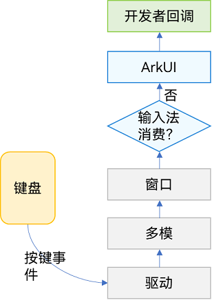
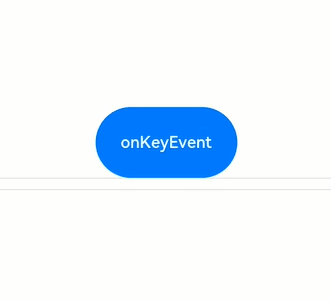

# 支持键盘输入事件

物理按键产生的按键事件为非指向性事件，与触摸等指向性事件不同，其事件并没有坐标位置信息，所以其会按照一定次序向用户操作的焦点进行派发，一些文字输入场景，按键事件都会优先派发给输入法软键盘进行处理，以便其处理文字的联想和候选词，应用可以通过`onKeyPreIme`提前感知事件。

> **说明：**
>
> 一些系统按键产生的事件并不会传递给UI组件，如电源键、音量键。

## 按键事件数据流




按键事件由外设键盘等设备触发，经驱动和多模处理转换后发送给当前获焦的窗口，窗口获取到事件后，会尝试分发三次事件。三次分发的优先顺序如下，一旦事件被消费，则跳过后续分发流程。

1. 首先分发给ArkUI框架用于触发获焦组件绑定的onKeyPreIme回调和页面快捷键。
2. 再向输入法分发，输入法会消费按键用作输入。
3. 再次将事件发给ArkUI框架，用于响应系统默认Key事件（例如走焦）以及获焦组件绑定的onKeyEvent回调。

因此，当某输入框组件获焦，且打开了输入法，此时大部分按键事件均会被输入法消费。例如字母键会被输入法用来往输入框中输入对应字母字符、方向键会被输入法用来切换选中备选词。如果在此基础上给输入框组件绑定了快捷键，那么快捷键会优先响应事件，事件也不再会被输入法消费。

按键事件到ArkUI框架之后，会先找到完整的父子节点获焦链。从叶子节点到根节点，逐一发送按键事件。 

Web组件的KeyEvent流程与上述过程有所不同。对于Web组件，不会在onKeyPreIme返回false时候，去匹配快捷键。而是第三次按键派发过程，Web对于未消费的KeyEvent通过ReDispatch重新派发回ArkUI，在ReDispatch中再执行匹配快捷键等操作。

## onKeyEvent & onKeyPreIme

```ts
onKeyEvent(event: (event: KeyEvent) => void): T
onKeyEvent(event: Callback<KeyEvent, boolean>): T
onKeyPreIme(event: Callback<KeyEvent, boolean>): T
onKeyEventDispatch(event: Callback<KeyEvent, boolean>): T
```

上述两种方法的区别仅在于触发的时机（见[按键事件数据流](#按键事件数据流)）。其中onKeyPreIme的返回值决定了该按键事件后续是否会被继续分发给页面快捷键、输入法和onKeyEvent。


当绑定方法的组件处于获焦状态下，外设键盘的按键事件会触发该方法，回调参数为[KeyEvent](../reference/apis-arkui/arkui-ts/ts-universal-events-key.md#keyevent对象说明)，可由该参数获得当前按键事件的按键行为（[KeyType](../reference/apis-arkui/arkui-ts/ts-appendix-enums.md#keytype)）、键码（[keyCode](../reference/apis-input-kit/js-apis-keycode.md#keycode)）、按键英文名称（keyText）、事件来源设备类型（[KeySource](../reference/apis-arkui/arkui-ts/ts-appendix-enums.md#keysource)）、事件来源设备id（deviceId）、元键按压状态（metaKey）、时间戳（timestamp）、阻止冒泡设置（stopPropagation）。


```ts
// xxx.ets
@Entry
@Component
struct KeyEventExample {
  @State buttonText: string = '';
  @State buttonType: string = '';
  @State columnText: string = '';
  @State columnType: string = '';

  build() {
    Column() {
      Button('onKeyEvent')
        .defaultFocus(true)
        .width(140).height(70)
        .onKeyEvent((event?: KeyEvent) => { // 给Button设置onKeyEvent事件
          if(event){
            if (event.type === KeyType.Down) {
              this.buttonType = 'Down';
            }
            if (event.type === KeyType.Up) {
              this.buttonType = 'Up';
            }
            this.buttonText = 'Button: \n' +
            'KeyType:' + this.buttonType + '\n' +
            'KeyCode:' + event.keyCode + '\n' +
            'KeyText:' + event.keyText;
          }
        })

      Divider()
      Text(this.buttonText).fontColor(Color.Green)

      Divider()
      Text(this.columnText).fontColor(Color.Red)
    }.width('100%').height('100%').justifyContent(FlexAlign.Center)
    .onKeyEvent((event?: KeyEvent) => { // 给父组件Column设置onKeyEvent事件
      if(event){
        if (event.type === KeyType.Down) {
          this.columnType = 'Down';
        }
        if (event.type === KeyType.Up) {
          this.columnType = 'Up';
        }
        this.columnText = 'Column: \n' +
        'KeyType:' + this.buttonType + '\n' +
        'KeyCode:' + event.keyCode + '\n' +
        'KeyText:' + event.keyText;
      }
    })
  }
}
```


上述示例中给组件Button和其父容器Column绑定onKeyEvent。应用打开页面加载后，组件树上第一个可获焦的非容器组件自动获焦，设置Button为当前页面的默认焦点，由于Button是Column的子节点，Button获焦也同时意味着Column获焦。获焦机制见[焦点事件](arkts-common-events-focus-event.md)。


打开应用后，依次在键盘上按这些按键：空格、回车、左Ctrl、左Shift、字母A、字母Z。


1. 由于onKeyEvent事件默认是冒泡的，所以Button和Column的onKeyEvent都可以响应。

2. 每个按键都有2次回调，分别对应KeyType.Down和KeyType.Up，表示按键被按下、然后抬起。


如果要阻止冒泡，即仅Button响应键盘事件，Column不响应，在Button的onKeyEvent回调中加入event.stopPropagation()方法即可，如下：


```ts
@Entry
@Component
struct KeyEventExample {
  @State buttonText: string = '';
  @State buttonType: string = '';
  @State columnText: string = '';
  @State columnType: string = '';

  build() {
    Column() {
      Button('onKeyEvent')
        .defaultFocus(true)
        .width(140).height(70)
        .onKeyEvent((event?: KeyEvent) => {
          // 通过stopPropagation阻止事件冒泡
          if(event){
            if(event.stopPropagation){
              event.stopPropagation();
            }
            if (event.type === KeyType.Down) {
              this.buttonType = 'Down';
            }
            if (event.type === KeyType.Up) {
              this.buttonType = 'Up';
            }
            this.buttonText = 'Button: \n' +
              'KeyType:' + this.buttonType + '\n' +
              'KeyCode:' + event.keyCode + '\n' +
              'KeyText:' + event.keyText;
          }
        })

      Divider()
      Text(this.buttonText).fontColor(Color.Green)

      Divider()
      Text(this.columnText).fontColor(Color.Red)
    }.width('100%').height('100%').justifyContent(FlexAlign.Center)
    .onKeyEvent((event?: KeyEvent) => { // 给父组件Column设置onKeyEvent事件
      if(event){
        if (event.type === KeyType.Down) {
          this.columnType = 'Down';
        }
        if (event.type === KeyType.Up) {
          this.columnType = 'Up';
        }
        this.columnText = 'Column: \n' +
          'KeyType:' + this.buttonType + '\n' +
          'KeyCode:' + event.keyCode + '\n' +
          'KeyText:' + event.keyText;
      }
    })
  }
}
```




使用OnKeyPreIme屏蔽在输入框中使用方向左键。

```ts
import { KeyCode } from '@kit.InputKit';

@Entry
@Component
struct PreImeEventExample {
  @State buttonText: string = '';
  @State buttonType: string = '';
  @State columnText: string = '';
  @State columnType: string = '';

  build() {
    Column() {
      Search({
        placeholder: "Search..."
      })
        .width("80%")
        .height("40vp")
        .border({ radius:"20vp" })
        .onKeyPreIme((event:KeyEvent) => {
          if (event.keyCode == KeyCode.KEYCODE_DPAD_LEFT) {
            return true;
          }
          return false;
        })
    }
  }
}
```

使用onKeyEventDispatch分发按键事件到子组件，子组件使用onKeyEvent。

```ts
@Entry
@Component
struct Index {
  build() {
    Row() {
      Row() {
        Button('button1').id('button1').onKeyEvent((event) => {
          console.log("button1");
          return true
        })
        Button('button1').id('button2').onKeyEvent((event) => {
          console.log("button2");
          return true
        })
      }
      .width('100%')
      .height('100%')
      .id('Row1')
      .onKeyEventDispatch((event) => {
        let context = this.getUIContext();
        context.getFocusController().requestFocus('button1');
        return context.dispatchKeyEvent('button1', event);
      })

    }
    .height('100%')
    .width('100%')
    .onKeyEventDispatch((event) => {
      if (event.type == KeyType.Down) {
        let context = this.getUIContext();
        context.getFocusController().requestFocus('Row1');
        return context.dispatchKeyEvent('Row1', event);
      }
      return true;
    })
  }
}
```

