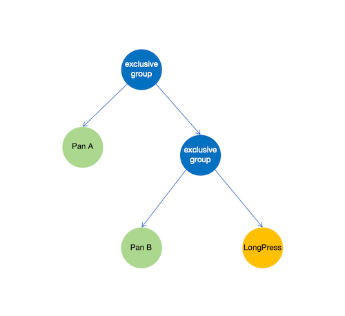
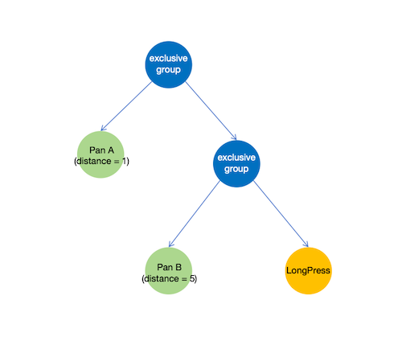
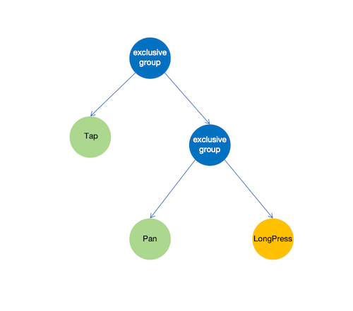

# 添加手势响应
<!--Kit: ArkUI-->
<!--Subsystem: ArkUI-->
<!--Owner: @jiangtao92-->
<!--Designer: @piggyguy-->
<!--Tester: @songyanhong-->
<!--Adviser: @HelloCrease-->

当用户的操作符合某个手势的特征时，系统会将其识别为该手势，这一过程称为手势识别。为了响应某一个手势，需在组件上添加对应的手势对象，以便系统可以收集并进行处理。

## 基本手势及特点

| 手势                                                                                                                                                     | 操作特征                                                                                      | 触发方式举例                                                                                                                     |
| ------------------------------------------------------------------------------------------------------------------------------------------------------------ | ------------------------------------------------------------------------------------------------- | ------------------------------------------------------------------------------------------------------------------------------------ |
| [TapGesture](../reference/apis-arkui/arkui-ts/ts-basic-gestures-tapgesture.md)             | 点击（按下在较短时间内抬起，默认300ms）                                                           | 手指或触控笔点击触屏；按下鼠标左键并松开、单指点击触控板。                                                                           |
| [LongPressGesture](../reference/apis-arkui/arkui-ts/ts-basic-gestures-longpressgesture.md) | 长按（按下后维持一段时间）                                                                        | 手指或触控笔长按触屏、长按鼠标左键、单指长按触控板。                                                                                 |
| [PanGesture](../reference/apis-arkui/arkui-ts/ts-basic-gestures-pangesture.md)             | 滑动（按下后开始移动）                                                                            | 手指或触控笔点击触屏后移动、按下鼠标左键后移动、单指点击触控板后移动、鼠标指针指向可滑动组件后滚动鼠标滚轮、双指并拢在触控板上滑动。 |
| [PinchGesture](../reference/apis-arkui/arkui-ts/ts-basic-gestures-pinchgesture.md)         | 捏合（双指按下后向内捏合或向外扩大）                                                              | 双指在触屏上捏合、双指在触控板上捏合、鼠标指针指向可响应捏合手势的组件时，按下物理键盘ctrl键的同时，滚动鼠标滚轮。                   |
| [RotationGesture](../reference/apis-arkui/arkui-ts/ts-basic-gestures-rotationgesture.md)   | 旋转（双指按下后旋转双指）                                                                        | 双指在触屏上旋转。                                                                                                                   |
| [SwipeGesture](../reference/apis-arkui/arkui-ts/ts-basic-gestures-swipegesture.md)         | 快滑，与Pan的区别：swipe手势是以离手时的速度为判定条件；而pan是以位移距离为判定条件，跟手触发； | 单指在触屏上快速滑动、双指在触控板上快速滑动、快速滑动鼠标滚轮。                                                                     |

## 手势响应规则

基本规则：
- 基于从点下那一刻的位置所命中的控件上收集到的手势为基础。
- 同等条件的手势子组件优先于父组件得到响应。
- 不同条件的手势，先成功（条件达成）的先响应。
- 如果不存在并行手势，则当有一个手势成功时，其他手势在本次操作过程中都不会再有成功的机会。
- 并行的手势在子组件上的同类型手势成功时，父组件上的同类型手势也会成功。
- 组件内置手势（系统默认绑定）的响应优先级高于开发者绑定的同类型手势，除非开发者使用priority绑定方式。

以下通过几个场景来说明上述规则。

**场景1:**

Pan A与Pan B为相同阈值条件的滑动手势，Pan B为子组件上的，因此优先级高于父组件上的Pan A，Pan B优先响应成功；

**场景2:**

Pan A与 Pan B为不同阈值条件的滑动手势，Pan B为子组件上的，优先级高于父组件上的Pan A，但由于Pan A的阈值小，因此在相同的报点序列情况下，Pan A会优先判定成功；但要注意的是，如果移动速度特别快，那么同一个报点的间距可能都可以使Pan A和Pan B成功，那么这时候就会是Pan B竞争成功，因为是B先处理报点。

**场景3:**

以实际操作能够响应的手势为准；
比如，如果用户在未达成Pan手势的阈值范围内抬手，则Tap成功；

## 干预手势处理

手势框架基于上述原则处理各组件绑定的手势识别，但在许多场景中，应用需要动态控制手势识别过程：即通过干预手势处理逻辑，在满足响应规则的前提下实现预期识别结果。

系统对手势的识别仍然是以[触摸测试](./arkts-interaction-basic-principles.md#触摸测试)为前提，因此对于可用于干预基础事件处理的方式，都可以应用到对手势处理的干预上，除此之外还可以使用以下方式：

| 方式               | 功能                                                             | 对应API                                                                                                                                        | 说明                                                                                                                                                                                                                                                                                                                                                                                                                                                                                                                                                                                                                                                                                                                                                                                                                                                                                                                                           |
| ------------------ | ---------------------------------------------------------------- | ---------------------------------------------------------------------------------------------------------------------------------------------- | ---------------------------------------------------------------------------------------------------------------------------------------------------------------------------------------------------------------------------------------------------------------------------------------------------------------------------------------------------------------------------------------------------------------------------------------------------------------------------------------------------------------------------------------------------------------------------------------------------------------------------------------------------------------------------------------------------------------------------------------------------------------------------------------------------------------------------------------------------------------------------------------------------------------------------------------------- |
| 自定义手势判定     | 在系统判定手势要成功时，给与应用对这个手势是否能成功的裁决机会   | [onGestureJudgeBegin](../reference/apis-arkui/arkui-ts/ts-gesture-customize-judge.md#ongesturejudgebegin)                                      | 所绑定的组件上某个手势将要被系统判定为成功时，系统会回调该方法，给与应用机会来自主决定，该手势能不能成功，如果应用通过该方法返回拒绝，那么系统将会判定该手势失败，进而可以留给其他手势成功的机会。                                                                                                                                                                                                                                                                                                                                                                                                                                                                                                                                                                                                                                                                                                                                             |
| 自定义手势判定增强 | 在系统判定手势要成功时，给与应用对这个手势是否能成功的裁决机会。 | [onGestureRecognizerJudgeBegin](../reference/apis-arkui/arkui-ts/ts-gesture-blocking-enhancement.md#ongesturerecognizerjudgebegin13)           | 1. 同onGestureJudgeBegin，都是当所绑定的组件上某个手势将要被系统判定为成功时触发。 2. 该回调的优先级高于onGestureJudgeBegin，当绑定该方法时，onGestureJudgeBegin的绑定会失效。                                                                                                                                                                                                                                                                                                                                                                                                                                                                                                                                                                                                                                                                                                                                                             |
| 手势并行动态控制   | 控制父子(祖先与子孙)组件之间的PAN手势的联动关系，实现嵌套滚动。  | [shouldBuiltInRecognizerParallelWith](../reference/apis-arkui/arkui-ts/ts-gesture-blocking-enhancement.md#shouldbuiltinrecognizerparallelwith) | 1. 当用户按下，系统开始收集当前位置下所有需要参与手势处理的手势对象时触发。 2. 回调触发时，会将当前组件上的内置系统手势（当前只支持pan手势），以及系统在当前组件之前所已经收集到的同类型的手势对象（Pan手势），这些手势是一个数组，这些手势一般来自于子组件，因此其得到响应的优先级是比当前组件上的同类型手势要高的。普通情况下，当前组件上的手势是竞争不过子组件的手势的。 3. 而这个回调方法，就是给与应用机会，让应用可以强制指定自己身上的这个低优先级的同类别手势（pan手势）与子组件上的高优先级的同类别手势进行并行，也就是子组件上的同类别高优先级手势成功的时候，自己的也能被成功，从而得到响应。 4. 返回的手势对象中提供了控制手势响应使能的接口，因此在手势产生了并行之后，应用就可以自主控制两个并行手势的响应行为，从而达成嵌套滚动的效果（一个先滑，滑到底再触发另一个继续滑）。 **说明：** 在使用时，要注意所绑定的组件是具有系统内置手势（如list，swiper），否则使用该方法并没有作用，也没有意义。 |
| 阻止手势参与识别   | 在手势未识别之前，主动禁止某个手势参与本次交互识别。  | [preventBegin](../reference/apis-arkui/arkui-ts/ts-gesture-common.md#preventbegin20) | 1. 当用户按下，系统收集完当前位置下所有能够参与本次处理的手势对象后触发组件上绑定的[onTouchTestDone](../reference/apis-arkui/arkui-ts/ts-gesture-blocking-enhancement.md#ontouchtestdone20)回调。 2. 回调触发时，会将按下时收集到的所有手势识别器对象都返回给开发者。 3. 应用可以在回调中根据每个手势识别器的信息，挑选出不希望哪些手势识别器参与本次处理，调用识别器对象上的preventBegin方法，从而避免手势冲突。 |

更详细的使用指南请参考[手势冲突处理](arkts-gesture-events-gesture-judge.md)章节。