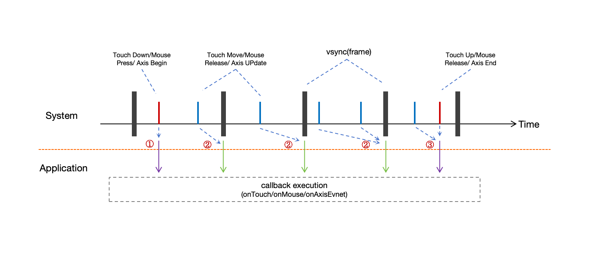
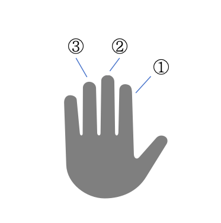

# 支持触屏输入事件
<!--Kit: ArkUI-->
<!--Subsystem: ArkUI-->
<!--Owner: @jiangtao92-->
<!--Designer: @piggyguy-->
<!--Tester: @songyanhong-->
<!--Adviser: @HelloCrease-->


触屏设备是最常见的输入设备，几乎所有手持类终端设备都支持用户通过触控操作。触摸事件也是应用开发者最常处理的事件类型之一。

需要注意的是，对于其他类型的输入设备上的类似触控行为的操作，系统为了交互一致性，也会将其转换为触摸事件派发给应用，如按下**鼠标**左键点击、滑动，既可以接收到Touch事件，也可以接收到鼠标事件。如果要将其与触屏设备产生的触摸事件进行区分，可以通过事件中的[SourceType](../reference/apis-arkui/arkui-ts/ts-gesture-settings.md#sourcetype枚举说明8)进行判断。


## 触摸事件

触摸事件可以通过通用属性onTouch在组件上接收，该回调响应遵循命中测试规则

触摸事件的上报频率会由系统降采样到与屏幕刷新率一致，详见[重采样与历史点](#重采样与历史点)章节。

对于支持多点触控的输入设备，使用多根手指同时操作可以产生多个触点，全部的触点信息可以通过touches成员得到，而changedTouches会给出当前事件上报时，是哪些触点在产生变化。

其他更多的事件信息可以从TouchEvent的基类[BaseEvent](../reference/apis-arkui/arkui-ts/ts-gesture-customize-judge.md#baseevent8)中获得。


## 阻止冒泡

参考[事件冒泡](./arkts-interaction-basic-principles.md#事件冒泡)了解冒泡机制，以下是一个简单示例，实现了只要点击在子组件区域内，就阻止父组件接收触摸事件：

```typescript
@Entry
@ComponentV2
struct Index {
  
  build() {
    RelativeContainer() {
      Column() { // 父组件
        Text("  如果点中了我，就阻止父组件收到触摸事件  ")
          .fontColor(Color.White)
          .height("40%")
          .width("80%")
          .backgroundColor(Color.Brown)
          .alignSelf(ItemAlign.Center)
          .padding(10)
          .margin(20)
          .onTouch((event:TouchEvent)=>{
            event.stopPropagation() // 子组件优先接收到触摸事件后，阻止父组件接收事件
          })
      }
      .justifyContent(FlexAlign.End)
      .backgroundColor(Color.Green)
      .height('100%')
      .width('100%')
      .onTouch((event:TouchEvent)=>{
        console.info("touch event received on parent")
      })
    }
    .height('100%')
    .width('100%')
  }
}
```

> **说明：**
>
> 对事件的冒泡进行控制不会影响手势对触摸事件的接收与处理，因此需要分别考虑这两者。


## 重采样与历史点

基础事件的上报频率与具体的输入设备类型有关，但一般频率都是非常高的，如触屏一般每5~7ms即上报一个点，而对于一些高精度鼠标，上报频率最高可达到每1ms上报一次。由于对输入事件的响应是为了UI界面的变化来产生对用户操作的响应，因此将如此之高的基础事件上报给应用，多数情况下是冗余的，为此系统会对两帧之间所收到的基础事件进行重采样，只在帧内上报一次给应用，重采样是针对每个触点单独进行的，不同触点会单独进行重采样。



- 按下时产生的事件会立即上报给应用；
- 帧内的move报点并不会立即下发，而是会在送显帧到来时重采样合并后上报；
- 抬起时产生的事件会立即上报给应用，并在上报之前先将还未处理的move事件上报；

重采样会合并同一个触点在同一帧内多次上报的move事件，并通过算法尽可能计算出一个合适的坐标上报给应用，因此经过重采样后的坐标信息，与底层设备真实上报的点会存在细微的差异，这些差异是有益的，经过重采样后的点通常具备更好的平顺性。

重采样之前的所有原始点信息也都保留下来上报给了应用，如果需要直接处理它们，则可通过`getHistoricalPoints(): Array`来获取。

以下是一个简单示例：

```typescript
@Entry
@ComponentV2
struct Index {
  build() {
    RelativeContainer() {
      Column()
        .backgroundColor(Color.Green)
        .height('100%')
        .width('100%')
        .onTouch((event: TouchEvent) => {
          // 从event中获取历史点
          let allHistoricalPoints = event.getHistoricalPoints();
          if (allHistoricalPoints.length != 0) {
            for (const point of allHistoricalPoints) {
              console.info("historical point: [" + point.touchObject.windowX + ", " + point.touchObject.windowY + "]")
            }
          }
        })
    }
    .height('100%')
    .width('100%')
  }
}
```

## 多指信息

在支持多指触控的触屏设备上，上报的事件中同时包含了窗口所有按压手指的信息，可以通过**touches**获取，如下：

```typescript
@Entry
@ComponentV2
struct Index {
  private currentFingerCount: number = 0
  private allFingerIds: number[] = []

  build() {
    RelativeContainer() {
      Column()
        .backgroundColor(Color.Green)
        .height('100%')
        .width('100%')
        .onTouch((event: TouchEvent) => {
          if (event.source != SourceType.TouchScreen) {
            return;
          }
          // clear数组
          this.allFingerIds.splice(0, this.allFingerIds.length)
          // 从event中获取所有触点信息
          let allFingers = event.touches;
          if (allFingers.length > 0 && this.currentFingerCount == 0) {
            // 第1根手指按下
            console.info("fingers start to press down")
            this.currentFingerCount = allFingers.length
          }
          if (allFingers.length != 0) {
            for (const finger of allFingers) {
              this.allFingerIds.push(finger.id)
            }
            console.info("current all fingers : " + this.allFingerIds.toString())
          }
          if (event.type == TouchType.Up && event.touches.length == 1) {
            // 所有手指都已抬起
            console.info("all fingers already up")
            this.currentFingerCount = 0
          }
        })
    }
    .height('100%')
    .width('100%')
  }
}
```

不同触点通过id区分，id按照接触屏幕的顺序依次递增，与物理上的触点（手指）并无严格顺序对应关系。并且这些触点在**touches**数组中并非按照编号大小顺序排列，请不要依赖顺序进行访问，另外，直到所有触点全部离开屏幕之前，期间抬起的触点对应的编号，会在有触点按下时自动复用。

以下是上面的示例在如下操作序列时产生的日志输出情况：



按下手指① -> 按下手指② -> 按下手指③ -> 抬起手指② -> 抬起手指③ -> 按下手指② -> 抬起手指① -> 抬起手指③

```
  fingers start to press down   // 按下手指①
  current all fingers: 0
  ... ...
  current all fingers: 0,1      // 按下手指②
  ... ...
  current all fingers: 0,1,2    // 按下手指③
  ... ...
  current all fingers: 0,2      // 抬起手指②
  ... ...
  current all fingers: 0        // 抬起手指③
  ... ...
  current all fingers: 0,1      // 按下手指③
  ... ...
  current all fingers: 1        // 抬起手指①
  ... ...
  all fingers already up        // 抬起手指③
```


## 触控笔

触控笔操作触摸屏与通过手指操作类似，都会产生触摸事件，可以通过sourceTool进行区分。而对于一些主动式电容笔，上报的触摸事件中，还会包含笔接触屏幕时的夹角信息，可参考[BaseEvent](../reference/apis-arkui/arkui-ts/ts-gesture-customize-judge.md#baseevent8)。

- tiltX：触控笔在设备平面上的投影与设备平面X轴的夹角。
- tiltY：触控笔在设备平面上的投影与设备平面Y轴的夹角。
- rollAngle：触控笔与设备平面的夹角。

