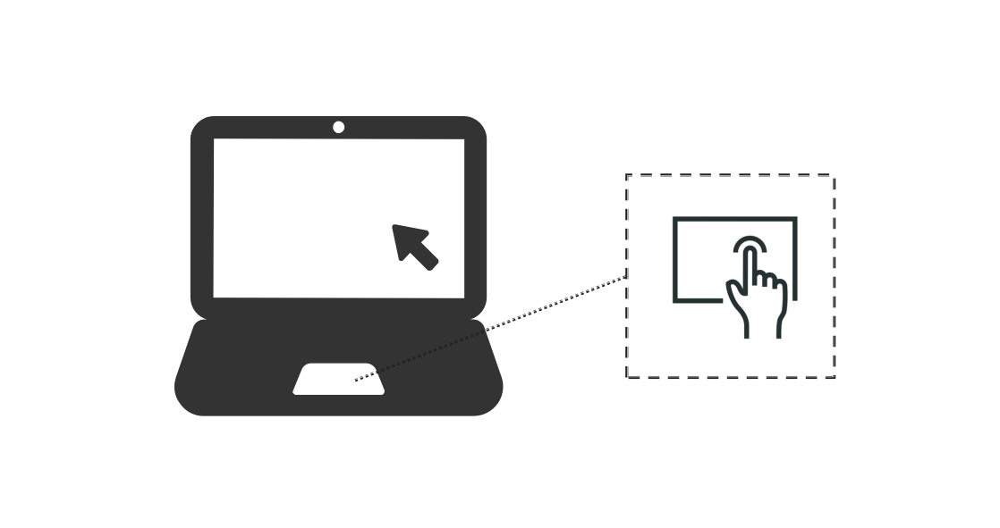
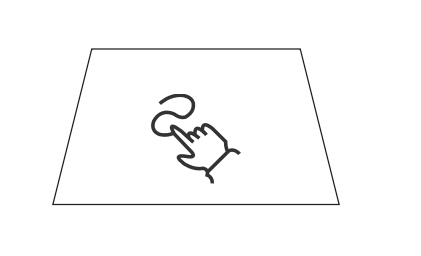
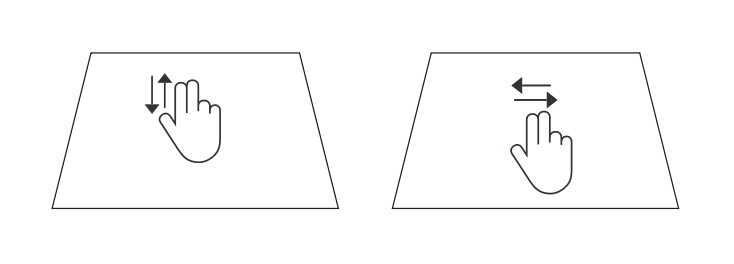
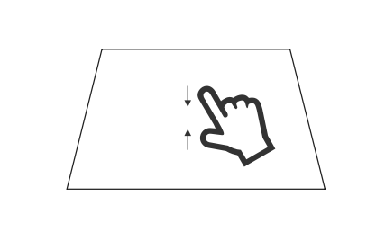

# 支持触控板输入事件
<!--Kit: ArkUI-->
<!--Subsystem: ArkUI-->
<!--Owner: @jiangtao92-->
<!--Designer: @piggyguy-->
<!--Tester: @songyanhong-->
<!--Adviser: @HelloCrease-->

当用户使用触控板时，会根据不同的操作方式生成相应的事件。单指操作会产生鼠标事件，而双指操作会产生轴事件。

> **说明：**
>
> 需要注意的是，与触屏不同，触控板上的的多指操作并不会体现在上报的事件中，系统上层无法获取手指信息。

## 单指操作

单指操作触控板与操作鼠标的方式相同。例如，轻触后滑动会产生鼠标移动事件，而重按则会产生鼠标左键按下事件。若需判断鼠标事件是来自触控板还是鼠标设备，可以通过[sourceType](../reference/apis-arkui/arkui-ts/ts-gesture-settings.md#sourcetype枚举说明8)和[sourceTool](../reference/apis-arkui/arkui-ts/ts-gesture-settings.md#sourcetool枚举说明9)信息进行区分。

对该种操作产生的事件的处理，请参考[处理鼠标移动](arkts-interaction-development-guide-mouse.md#处理鼠标移动)章节。

## 双指滑动

与鼠标滚轮不同，触控板上双指滑动产生的轴事件上报的数值单位并非角度，而是位移像素，为了区分该点，在处理轴值之前，可以通过sourceType及sourceTool来区分。

当用户使用双指横滑时，可从axisHorizontal中获取横向轴值(位移像素)，向右滑动时，上报数值为负，向左滑动时，上报数值为正。使用双指竖滑时，可从axisVertical获取到纵向轴值（位移像素），向上滑动时，上报数值为正，向下滑动时，上报数值为负。

同滚轮一样，产生的轴事件可以驱动滑动手势的触发。向右滑动时，上报offsetX数值为正，向左滑动时，上报offsetX数值为负。向上滑动时，上报offsetY数值为负，向下滑动时，上报offsetY数值为正。

> **说明：**
>
> 只有在开始滚动操作的那一刻光标所在位置下的组件上的手势会被收集。

## 双指捏合

在触控板上通过双指捏合，可以产生捏合缩放值上报。该值表示一个相对缩放比例，可用于实现UI缩放效果。系统上报的数值为一个scale比例，其以双指开始捏合的那一刻（此时为1.0）为基准参考。当双指往外扩张时，scale逐渐从1.0增大；当双指往内合并时，scale逐渐减小。

