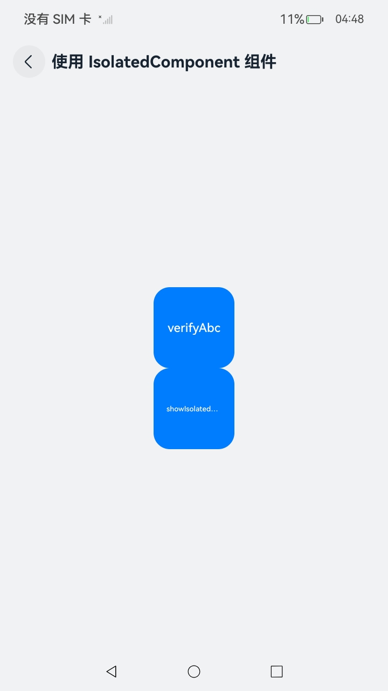
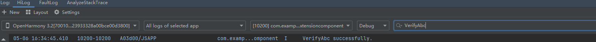

# 隔离 (IsolatedComponent)

IsolatedComponent组件是一个用于构建隔离组件的工具，它可以帮助开发者创建独立的、可重用的组件，这些组件可以在不同的应用程序中使用，而不会与其他组件发生冲突。

每个IsolatedComponent组件都是独立的，有自己的作用域和生命周期，不会与其他组件共享状态或数据；可以轻松地在不同的应用程序中重用，减少重复开发的工作量。

## 基本概念

IsolatedComponent旨在在本页面中嵌入并展示由独立Abc（即.abc文件）所提供的UI，其展示内容在受限的worker线程中执行。

该组件通常应用于那些需要Abc热更新的模块化开发场景。

## 约束与限制

1、Abc需要[VerifyAbc](../reference/apis-ability-kit/js-apis-bundleManager-sys.md#bundlemanagerverifyabc11)校验通过之后才可以使用于当前组件。

2、不支持构造参数更新，仅首次传入有效。

3、不支持IsolatedComponent组件嵌套场景。

4、创建IsolatedComponent组件时，受限worker线程加载Abc布局渲染存在一定耗时，在此等待期间显示IsolatedComponent组件的背景色。

5、主线程与受限worker线程之间布局渲染是异步处理，布局变化、旋转等导致的页面变化存在不同步现象。

6、主线程与受限worker线程之间事件传递是异步处理，不支持线程之间的事件冒泡，线程之间的UI交互存在事件冲突现象。

7、独立Abc通过IsolatedComponent组件嵌入式显示在宿主进程，即可说明其Abc内容完全向宿主开放，宿主有权操作独立Abc的内容，对此安全敏感场景禁用。

8、独立Abc运行在受限worker可保证相对安全，独立Abc内容不影响主线程。

## 场景示例

这里是一个展示IsolatedComponent组件的基础使用方式的场景，示例应用的bundleName为"com.example.isolateddemo"，并使用本应用的Abc文件和extension页面作为嵌入展示的内容。

**导入核心模块**

在使用IsolatedComponent组件时，首先需要导入@kit.AbilityKit模块，该模块提供了构建隔离组件所需的必要功能，包括bundleManager等关键API。

bundleManager作为AbilityKit的核心组件，提供了管理应用包的能力，是构建IsolatedComponent的基础。通过导入这个模块，我们能够使用其提供的API来创建和管理隔离组件，确保不同组件之间的数据和资源隔离，从而提高应用的安全性。

```ts
import { bundleManager } from '@kit.AbilityKit'
```

**权限管理**

使用IsolatedComponent组件时，合理配置[requestPermissions标签](../security/AccessToken/declare-permissions.md)是确保组件在受限环境中安全运行的关键步骤。通过这个配置，可以明确指定组件需要的权限，实现权限的精细化管理。

在受限模式下，IsolatedComponent组件默认是不具备执行动态代码的能力的。通过在module.json5配置文件中增加requestPermissions标签，可以允许组件在特定条件下执行动态下发的方舟字节码。

```json
"requestPermissions": [
  {
    "name": "ohos.permission.RUN_DYN_CODE",
    "usedScene": {
      "abilities": [
        "EntryAbility"
      ],
      "when": "inuse"
    }
  }
]
```

**受限[worker](../reference/apis-arkts/js-apis-worker.md)**

```ts
// OhCardWorker.ets
import { worker, ThreadWorkerGlobalScope, MessageEvents, ErrorEvent } from '@kit.ArkTS';
const workerPort: ThreadWorkerGlobalScope = worker.workerPort;

workerPort.onmessage = (e: MessageEvents) => {}
workerPort.onmessageerror = (e: MessageEvents) => {}
workerPort.onerror = (e: ErrorEvent) => {}
```

**设置属性**

IsolatedComponent通过want和worker属性实现动态组件加载与隔离执行，二者共同构成安全边界。合理设置这些属性是确保组件能够安全运行的关键。

```ts
IsolatedComponent({
  want: {
    "parameters": {
      // 资源路径
      "resourcePath": `${getContext(this).filesDir}/${this.fileName}.hap`,
      // abc文件校验后的沙箱路径
      "abcPath": `/abcs${getContext(this).filesDir}/${this.fileName}`,
      // 需要显示页面的入口路径
      "entryPoint": `${this.bundleName}/entry/ets/pages/extension`,
    }
  },
  worker: new worker.RestrictedWorker("entry/ets/workers/OhCardWorker.ets")
})
```

其中，在受限worker线程中运行的入口页面文件 ets/pages/extension.ets 参考内容如下：

```ts
@Entry
@Component
struct Extension {
  @State message: string = 'Hello World';

  build() {
    RelativeContainer() {
      Text(this.message)
        .id('HelloWorld')
        .fontSize(50)
        .fontWeight(FontWeight.Bold)
        .alignRules({
          center: { anchor: '__container__', align: VerticalAlign.Center },
          middle: { anchor: '__container__', align: HorizontalAlign.Center }
        })
    }
    .height('100%')
    .width('100%')
  }
}
```

**示例应用代码**

以下是示例应用中EntryAbility(UIAbility)加载首页文件ets/pages/Index.ets的内容：

```ts
import { worker } from '@kit.ArkTS';
import { bundleManager } from '@kit.AbilityKit';
import { BusinessError } from '@kit.BasicServicesKit';

// 对abc文件进行校验，并拷贝到指定沙箱路径下
function VerifyAbc(abcPaths: Array<string>, deleteOriginalFiles: boolean) {
  try {
    bundleManager.verifyAbc(abcPaths, deleteOriginalFiles, (err) => {
      if (err) {
        console.error("VerifyAbc failed, error message: " + err.message);
      } else {
        console.info("VerifyAbc successfully.");
      }
    });
  } catch (err) {
    let message = (err as BusinessError).message;
    console.error("VerifyAbc failed, error message: " + message);
  }
}

@Entry
@Component
struct Index {
  @State isShow: boolean = false;
  @State resourcePath: string = "";
  @State abcPath: string = "";
  @State entryPoint: string = "";
  // abc文件名
  private fileName: string = "modules";
  // abc文件所属应用的bundleName
  private bundleName: string = "com.example.isolateddemo";
  // 受限worker
  private worker ?: worker.RestrictedWorker = new worker.RestrictedWorker("entry/ets/workers/OhCardWorker.ets");

  build() {
    Row() {
      Column({ space: 20 }) {
        // 1.调用verifyAbc接口校验abc文件
        Button("verifyAbc").onClick(() => {
          let abcFilePath = `${getContext(this).filesDir}/${this.fileName}.abc`;
          console.log("abcFilePath: " + abcFilePath);
          VerifyAbc([abcFilePath], false);
        }).height(100).width(200)

        // 2.显示IsolatedComponent
        Button("showIsolatedComponent").onClick(() => {
          if (!this.isShow) {
            // 资源路径
            this.resourcePath = `${getContext(this).filesDir}/${this.fileName}.hap`;
            // abc文件校验后的沙箱路径
            this.abcPath = `/abcs${getContext(this).filesDir}/${this.fileName}`;
            // 需要显示页面的入口路径
            this.entryPoint = `${this.bundleName}/entry/ets/pages/extension`;
            this.isShow = true;
          }
        }).height(100).width(200)

        if (this.isShow) {
          IsolatedComponent({
            want: {
              "parameters": {
                "resourcePath": this.resourcePath,
                "abcPath": this.abcPath,
                "entryPoint": this.entryPoint
              }
            },
            worker: this.worker
          })
            .width(300)
            .height(300)
            .onError((err) => {
              console.info("onError : " + JSON.stringify(err));
            })
        }
      }
      .width('100%')
    }
    .height('100%')
  }
}
```

**预期效果**

1. 在DevEco Studio上编译构建生成hap包，并安装到设备上；

2. 将本应用构建生成的modules.abc文件通过DevEco Studio或hdc工具上传至应用沙箱路径/data/app/el2/100/base/com.example.isolateddemo/haps/entry/files下，其中，hdc工具参考命令如下：

```bash
hdc file send modules.abc /data/app/el2/100/base/com.example.isolateddemo/haps/entry/files/
```

3. 打开应用页面，点击"verifyAbc"按钮进行校验，输出"VerifyAbc successfully"日志；





4. 点击"showIsolatedComponent"按钮，显示IsolatedComponent组件，内容为"Hello World"。
