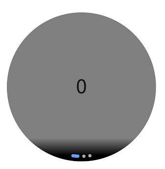
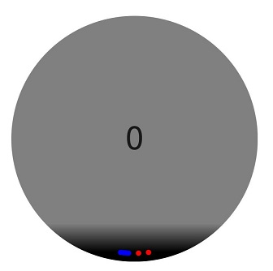
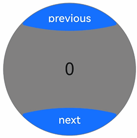

# 创建弧形轮播 (ArcSwiper)（圆形屏幕推荐使用）
<!--Kit: ArkUI-->
<!--Subsystem: ArkUI-->
<!--Owner: @Hu_ZeQi-->
<!--SE: @jiangdayuan-->
<!--TSE: @lxl007-->

ArcSwiper是弧形轮播组件，用于圆形屏幕使用，提供弧形轮播显示能力。具体用法请参考[ArcSwiper](../reference/apis-arkui/arkui-ts/ts-container-arcswiper.md)。

在使用ArcSwiper组件之前，需要在代码中先导入ArcSwiper模块。

```ts
import {
  ArcSwiper,
  ArcSwiperAttribute,
  ArcDotIndicator,
  ArcDirection,
  ArcSwiperController
} from '@kit.ArkUI';
```

## 设置导航点样式

ArcSwiper提供了默认的弧形导航点样式，导航点默认显示在ArcSwiper下方居中位置，开发者也可以通过[indicator](../reference/apis-arkui/arkui-ts/ts-container-arcswiper.md#indicator)属性自定义弧形导航点的样式。

通过indicator属性，开发者可以设置弧形导航点的方向，同时也可以设置导航点和被选中导航点的颜色。

- 导航点使用默认样式

  ```ts
  ArcSwiper() {
    Text('0')
      .width(233)
      .height(233)
      .backgroundColor(Color.Gray)
      .textAlign(TextAlign.Center)
      .fontSize(30)

    Text('1')
      .width(233)
      .height(233)
      .backgroundColor(Color.Green)
      .textAlign(TextAlign.Center)
      .fontSize(30)

    Text('2')
      .width(233)
      .height(233)
      .backgroundColor(Color.Pink)
      .textAlign(TextAlign.Center)
      .fontSize(30)
  }
  ```
  

- 自定义导航点样式

  导航点位于ArcSwiper组件6点钟方向，导航点颜色设为红色，被选中导航点颜色为蓝色。

  ```ts
  ArcSwiper() {
    // ...
  }
  .indicator(
    new ArcDotIndicator()
      .arcDirection(ArcDirection.SIX_CLOCK_DIRECTION) // 设置导航点位于6点钟方向
      .itemColor(Color.Red) // 设置导航点颜色为红色
      .selectedItemColor(Color.Blue) // 设置选中导航点颜色为蓝色
  )
  ```
  

## 控制页面切换方式

ArcSwiper支持滑动手指、点击导航点、旋转表冠和控制控制器四种方式切换页面。以下示例展示通过控制控制器和旋转表冠翻页的方法。

- 控制控制器翻页。

  ```ts
  // 导入ArcButton和ArcSwiper模块
  import {
    ArcButton,
    ArcButtonOptions,
    ArcButtonStatus,
    ArcButtonStyleMode,
    ArcButtonPosition,
    ArcSwiper,
    ArcSwiperAttribute, // ArcSwiper的属性依赖ArcSwiperAttribute对象导入，不建议删除该对象的引入。
    ArcDotIndicator,
    ArcDirection,
    ArcSwiperController
  } from '@kit.ArkUI';

  @Entry
  @Component
  struct SwiperCustomAnimationExample {
    private wearableSwiperController: ArcSwiperController = new ArcSwiperController();

    build() {
      Column() {
        Stack() {
          ArcSwiper(this.wearableSwiperController) {
            // ...
          }
          .vertical(true)
          .indicator(false)

          Column() {
            ArcButton({
              options: new ArcButtonOptions({
                label: 'previous',
                position: ArcButtonPosition.TOP_EDGE,
                styleMode: ArcButtonStyleMode.EMPHASIZED_LIGHT,
                onClick: () => {
                  this.wearableSwiperController.showPrevious(); // 通过controller切换到前一页
                }
              })
            })

            Blank()

            ArcButton({
              options: new ArcButtonOptions({
                label: 'next',
                position: ArcButtonPosition.BOTTOM_EDGE,
                styleMode: ArcButtonStyleMode.EMPHASIZED_LIGHT,
                onClick: () => {
                  this.wearableSwiperController.showNext(); // 通过controller切换到后一页
                }
              })
            })
          }.width('100%').height('100%')
        }
      }
    }
  }
  ```

  

- 旋转表冠翻页。

  ArcSwiper在获得焦点时能够响应旋转表冠的操作，用户可以通过旋转表冠来滑动ArcSwiper，从而浏览数据。

  ```ts
  ArcSwiper() {
    // ...
  }
  .focusable(true)
  .focusOnTouch(true)
  .defaultFocus(true)
  ```

  还可以通过设置[digitalCrownSensitivity](../reference/apis-arkui/arkui-ts/ts-container-arcswiper.md#digitalcrownsensitivity)属性来调整表冠对事件响应的灵敏度，以适应不同规模的数据处理。在处理大量数据时，可以提高响应事件的灵敏度；而在处理少量数据时，则可以降低灵敏度设置。

  ```ts
  ArcSwiper() {
    // ...
  }
  .digitalCrownSensitivity(CrownSensitivity.MEDIUM)
  ```

## 设置轮播方向

ArcSwiper支持水平和垂直方向上进行轮播，主要通过[vertical](../reference/apis-arkui/arkui-ts/ts-container-arcswiper.md#vertical)属性控制。

当vertical为true时，表示在垂直方向上进行轮播；为false时，表示在水平方向上进行轮播。vertical默认值为false。

- 设置水平方向上轮播。

  ```ts
  ArcSwiper() {
    // ...
  }
  .indicator(true)
  .vertical(false)
  ```
  


- 设置垂直方向轮播，导航点设为3点钟方向。

  ```ts
  ArcSwiper() {
    // ...
  }
  .indicator(new ArcDotIndicator()
      .arcDirection(ArcDirection.THREE_CLOCK_DIRECTION))
  .vertical(true)
  ```
  

## 自定义切换动画

ArcSwiper支持通过[customContentTransition](../reference/apis-arkui/arkui-ts/ts-container-arcswiper.md#customcontenttransition)设置自定义切换动画，可以在回调中对视窗内所有页面逐帧设置透明度、缩放比例、位移、渲染层级等属性，从而实现自定义切换动画效果。

```ts
import { Decimal } from '@kit.ArkTS';
import {
  ArcSwiper,
  ArcSwiperAttribute, // ArcSwiper的属性依赖ArcSwiperAttribute对象导入，不建议删除该对象的引入。
  ArcDotIndicator,
  ArcDirection,
  ArcSwiperController
} from '@kit.ArkUI';

@Entry
@Component
struct SwiperCustomAnimationExample {
  private MIN_SCALE: number = 0.1;
  @State backgroundColors: Color[] = [Color.Green, Color.Blue, Color.Yellow, Color.Pink, Color.Gray, Color.Orange];
  @State opacityList: number[] = [];
  @State scaleList: number[] = [];

  aboutToAppear(): void {
    for (let i = 0; i < this.backgroundColors.length; i++) {
      this.opacityList.push(1.0);
      this.scaleList.push(1.0);
    }
  }

  build() {
    Column() {
      ArcSwiper() {
        ForEach(this.backgroundColors, (backgroundColor: Color, index: number) => {
          Text(index.toString())
            .width(233)
            .height(233)
            .fontSize(50)
            .textAlign(TextAlign.Center)
            .backgroundColor(backgroundColor)
            .opacity(this.opacityList[index])
            .scale({ x: this.scaleList[index], y: this.scaleList[index] })
        })
      }
      .customContentTransition({
        timeout: 1000,
        transition: (proxy: SwiperContentTransitionProxy) => {
          if (proxy.position <= -1 || proxy.position >= 1) {
            // 页面完全滑出视窗外时，重置属性值
            this.opacityList[proxy.index] = 1.0;
            this.scaleList[proxy.index] = 1.0;
          } else {
            let position: number = Decimal.abs(proxy.position).toNumber();
            this.opacityList[proxy.index] = 1 - position;
            this.scaleList[proxy.index] =
              this.MIN_SCALE + (1 - this.MIN_SCALE) * (1 - position);
          }
        }
      })
    }.width('100%')
  }
}
```


## 实现侧滑返回

ArcSwiper的滑动事件会与侧滑返回冲突，可以通过[手势拦截](../reference/apis-arkui/arkui-ts/ts-gesture-blocking-enhancement.md#ongesturerecognizerjudgebegin)去判断ArcSwiper是否滑动到开头去拦截ArcSwiper的滑动手势，实现再次左滑返回上一页的功能。

```ts
import {
  ArcSwiper,
  ArcSwiperAttribute, // ArcSwiper的属性依赖ArcSwiperAttribute对象导入，不建议删除该对象的引入。
  ArcDotIndicator,
  ArcDirection,
  ArcSwiperController
} from '@kit.ArkUI';

@Entry
@Component
struct SwiperCustomAnimationExample {
  @State backgroundColors: Color[] = [Color.Green, Color.Blue, Color.Yellow, Color.Pink, Color.Gray, Color.Orange];
  innerSelectedIndex: number = 0;

  build() {
    Column() {
      ArcSwiper() {
        ForEach(this.backgroundColors, (backgroundColor: Color, index: number) => {
          Text(index.toString())
            .width(233)
            .height(233)
            .fontSize(50)
            .textAlign(TextAlign.Center)
            .backgroundColor(backgroundColor)
        })
      }
      .onAnimationStart((index: number, targetIndex: number) => {
        this.innerSelectedIndex = targetIndex;
      })
      .onGestureRecognizerJudgeBegin((event: BaseGestureEvent, current: GestureRecognizer,
        others: Array<GestureRecognizer>): GestureJudgeResult => { // 在识别器即将要成功时，根据当前组件状态，设置识别器使能状态
        if (current) {
          let target = current.getEventTargetInfo();
          if (target && current.isBuiltIn() && current.getType() == GestureControl.GestureType.PAN_GESTURE) {
            let swiperTarget = target as ScrollableTargetInfo;
            if (swiperTarget instanceof ScrollableTargetInfo &&
              (swiperTarget.isBegin() || this.innerSelectedIndex === 0)) { // 此处判断swiperTarget.isBegin()或innerSelectedIndex === 0，表明ArcSwiper滑动到开头
              let panEvent = event as PanGestureEvent;
              if (panEvent && panEvent.offsetX > 0 && (swiperTarget.isBegin() || this.innerSelectedIndex === 0)) {
                return GestureJudgeResult.REJECT;
              }
            }
          }
        }
        return GestureJudgeResult.CONTINUE;
      })
    }.width('100%')
  }
}
```
