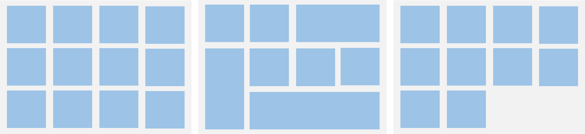
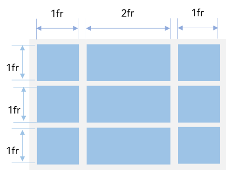
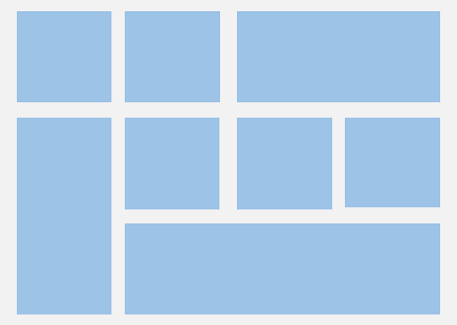
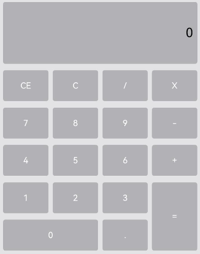
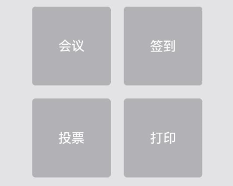
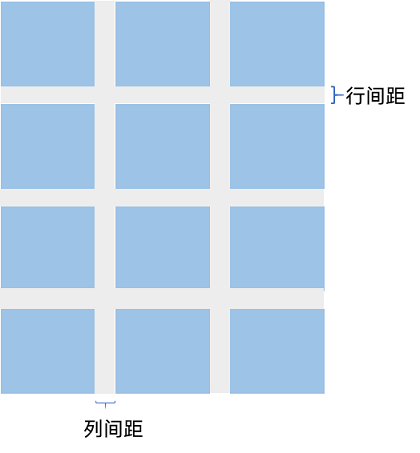
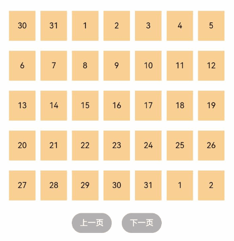
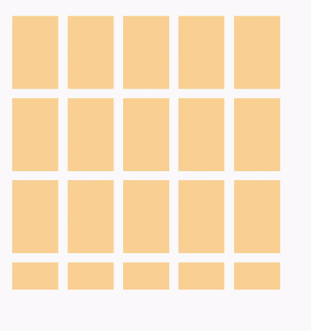

# 创建网格 (Grid/GridItem)


## 概述

网格布局是由“行”和“列”分割的单元格所组成，通过指定“项目”所在的单元格做出各种各样的布局。网格布局具有较强的页面均分能力，子组件占比控制能力，是一种重要自适应布局，其使用场景有九宫格图片展示、日历、计算器等。

ArkUI提供了[Grid](../reference/apis-arkui/arkui-ts/ts-container-grid.md)容器组件和子组件[GridItem](../reference/apis-arkui/arkui-ts/ts-container-griditem.md)，用于构建网格布局。Grid用于设置网格布局相关参数，GridItem定义子组件相关特征。Grid组件支持使用[条件渲染](../ui/state-management/arkts-rendering-control-ifelse.md)、[循环渲染](../ui/state-management/arkts-rendering-control-foreach.md)、[懒加载](../ui/state-management/arkts-rendering-control-lazyforeach.md)等方式生成子组件。


## 布局与约束

Grid组件为网格容器，其中容器内各条目对应一个GridItem组件，如下图所示。

  **图1** Grid与GridItem组件关系  


>**说明：**
>
>Grid的子组件必须是GridItem组件。

网格布局是一种二维布局。Grid组件支持自定义行列数和每行每列尺寸占比、设置子组件横跨几行或者几列，同时提供了垂直和水平布局能力。当网格容器组件尺寸发生变化时，所有子组件以及间距会等比例调整，从而实现网格布局的自适应能力。根据Grid的这些布局能力，可以构建出不同样式的网格布局，如下图所示。

  **图2** 网格布局  


如果Grid组件设置了宽高属性，则其尺寸为设置值。如果没有设置宽高属性，Grid组件的尺寸默认适应其父组件的尺寸。

Grid组件根据行列数量与占比属性的设置，可以分为三种布局情况：

- 行、列数量与占比同时设置：Grid只展示固定行列数的元素，其余元素不展示，且Grid不可滚动。（推荐使用该种布局方式）

- 只设置行、列数量与占比中的一个：元素按照设置的方向进行排布，超出的元素可通过滚动的方式展示。

- 行列数量与占比都不设置：元素在布局方向上排布，其行列数由布局方向、单个网格的宽高等多个属性共同决定。超出行列容纳范围的元素不展示，且Grid不可滚动。


## 设置排列方式


### 设置行列数量与占比

通过设置行列数量与尺寸占比可以确定网格布局的整体排列方式。Grid组件提供了rowsTemplate和columnsTemplate属性用于设置网格布局行列数量与尺寸占比。

rowsTemplate和columnsTemplate属性值是一个由多个空格和'数字+fr'间隔拼接的字符串，fr的个数即网格布局的行或列数，fr前面的数值大小，用于计算该行或列在网格布局宽度上的占比，最终决定该行或列宽度。

  **图3** 行列数量占比示例  


如上图所示，构建的是一个三行三列的网格布局，其在垂直方向上分为三等份，每行占一份；在水平方向上分为四等份，第一列占一份，第二列占两份，第三列占一份。

只要将rowsTemplate设置为'1fr 1fr 1fr'，同时将columnsTemplate设置为'1fr 2fr 1fr'，即可实现上述网格布局。


```ts
Grid() {
  // ...
}
.rowsTemplate('1fr 1fr 1fr')
.columnsTemplate('1fr 2fr 1fr')
```

>**说明：**
>
>当Grid组件设置了rowsTemplate或columnsTemplate时，Grid的layoutDirection、maxCount、minCount、cellLength属性不生效，属性说明可参考[Grid-属性](../reference/apis-arkui/arkui-ts/ts-container-grid.md#属性)。


### 设置子组件所占行列数

除了大小相同的等比例网格布局，由不同大小的网格组成不均匀分布的网格布局场景在实际应用中十分常见，如下图所示。在Grid组件中，可以通过创建Grid时传入合适的[GridLayoutOptions](../reference/apis-arkui/arkui-ts/ts-container-grid.md#gridlayoutoptions10对象说明)实现如图所示的单个网格横跨多行或多列的场景，其中，irregularIndexes和onGetIrregularSizeByIndex可对仅设置rowsTemplate或columnsTemplate的Grid使用；onGetRectByIndex可对同时设置rowsTemplate和columnsTemplate的Grid使用。

  **图4** 不均匀网格布局 



例如计算器的按键布局就是常见的不均匀网格布局场景。如下图，计算器中的按键“0”和“=”，按键“0”横跨第一、二两列，按键“=”横跨第五、六两行。使用Grid构建的网格布局，其行列标号从0开始，依次编号。

  **图5** 计算器  



在网格中，可以通过onGetRectByIndex返回的[rowStart,columnStart,rowSpan,columnSpan]来实现跨行跨列布局，其中rowStart和columnStart属性表示指定当前元素起始行号和起始列号，rowSpan和columnSpan属性表示指定当前元素的占用行数和占用列数。

所以“0”按键横跨第一列和第二列，“=”按键横跨第五行和第六行，只要将“0”对应onGetRectByIndex的rowStart和columnStart设为6和0，rowSpan和columnSpan设为1和2，将“=”对应onGetRectByIndex的rowStart和columnStart设为5和3，rowSpan和columnSpan设为2和1即可。


```ts
layoutOptions: GridLayoutOptions = {
  regularSize: [1, 1],
  onGetRectByIndex: (index: number) => {
    if (index == key1) { // key1是“0”按键对应的index
      return [6, 0, 1, 2];
    } else if (index == key2) { // key2是“=”按键对应的index
      return [5, 3, 2, 1];
    }
    // ...
    // 这里需要根据具体布局返回其他item的位置
  }
}

Grid(undefined, this.layoutOptions) {
  // ...
}
.columnsTemplate('1fr 1fr 1fr 1fr')
.rowsTemplate('1fr 1fr 1fr 1fr 1fr 1fr 1fr')
```


### 设置主轴方向

使用Grid构建网格布局时，若没有设置行列数量与占比，可以通过layoutDirection设置网格布局的主轴方向，决定子组件的排列方式。此时可以结合minCount和maxCount属性来约束主轴方向上的网格数量。

  **图6** 主轴方向示意图  


当前layoutDirection设置为Row时，先从左到右排列，排满一行再排下一行。当前layoutDirection设置为Column时，先从上到下排列，排满一列再排下一列，如上图所示。此时，将maxCount属性设为3，表示主轴方向上最大显示的网格单元数量为3。


```ts
Grid() {
  // ...
}
.maxCount(3)
.layoutDirection(GridDirection.Row)
```

>**说明：**
>
>- layoutDirection属性仅在不设置rowsTemplate和columnsTemplate时生效，此时元素在layoutDirection方向上排列。
>- 仅设置rowsTemplate时，Grid主轴为水平方向，交叉轴为垂直方向。
>- 仅设置columnsTemplate时，Grid主轴为垂直方向，交叉轴为水平方向。


## 在网格布局中显示数据

网格布局采用二维布局的方式组织其内部元素，如下图所示。

**图7** 通用办公服务  



Grid组件可以通过二维布局的方式显示一组GridItem子组件。


```ts
Grid() {
  GridItem() {
    Text('会议')
      // ...
  }

  GridItem() {
    Text('签到')
      // ...
  }

  GridItem() {
    Text('投票')
      // ...
  }

  GridItem() {
    Text('打印')
      // ...
  }
}
.rowsTemplate('1fr 1fr')
.columnsTemplate('1fr 1fr')
```

对于内容结构相似的多个GridItem，通常更推荐使用ForEach语句中嵌套GridItem的形式，来减少重复代码。


```ts
@Entry
@Component
struct OfficeService {
  @State services: Array<string> = ['会议', '投票', '签到', '打印'];

  build() {
    Column() {
      Grid() {
        ForEach(this.services, (service:string) => {
          GridItem() {
            Text(service)
          }
        }, (service:string):string => service)
      }
      .rowsTemplate(('1fr 1fr') as string)
      .columnsTemplate(('1fr 1fr') as string)
    }
  }
}
```


## 设置行列间距

在两个网格单元之间的网格横向间距称为行间距，网格纵向间距称为列间距，如下图所示。

**图8** 网格的行列间距  



通过Grid的rowsGap和columnsGap可以设置网格布局的行列间距。在图5所示的计算器中，行间距为15vp，列间距为10vp。


```ts
Grid() {
  // ...
}
.columnsGap(10)
.rowsGap(15)
```


## 构建可滚动的网格布局

可滚动的网格布局常用在文件管理、购物或视频列表等页面中，如下图所示。在设置Grid的行列数量与占比时，如果仅设置行、列数量与占比中的一个，即仅设置rowsTemplate或仅设置columnsTemplate属性，网格单元按照设置的方向排列，超出Grid显示区域后，Grid拥有可滚动能力。

**图9** 横向可滚动网格布局


如果设置的是columnsTemplate，Grid的滚动方向为垂直方向；如果设置的是rowsTemplate，Grid的滚动方向为水平方向。

如上图所示的横向可滚动网格布局，只要设置rowsTemplate属性的值且不设置columnsTemplate属性，当内容超出Grid组件宽度时，Grid可横向滚动进行内容展示。


```ts
@Entry
@Component
struct Shopping {
  @State services: Array<string> = ['直播', '进口'];

  build() {
    Column({ space: 5 }) {
      Grid() {
        ForEach(this.services, (service: string, index) => {
          GridItem() {
          }
          .width('25%')
        }, (service:string):string => service)
      }
      .rowsTemplate('1fr 1fr') // 只设置rowsTemplate属性，当内容超出Grid区域时，可水平滚动。
      .rowsGap(15)
    }
  }
}
```


## 控制滚动位置

与新闻列表的返回顶部场景类似，控制滚动位置功能在网格布局中也很常用，例如下图所示日历的翻页功能。

  **图10** 日历翻页  



Grid组件初始化时，可以绑定一个[Scroller](../reference/apis-arkui/arkui-ts/ts-container-scroll.md#scroller)对象，用于进行滚动控制，例如通过Scroller对象的[scrollPage](../reference/apis-arkui/arkui-ts/ts-container-scroll.md#scrollpage9)方法进行翻页。


```ts
private scroller: Scroller = new Scroller();
```

在日历页面中，用户在点击“下一页”按钮时，应用响应点击事件，通过指定scrollPage方法的参数next为true，滚动到下一页。


```ts
Column({ space: 5 }) {
  Grid(this.scroller) {
  }
  .columnsTemplate('1fr 1fr 1fr 1fr 1fr 1fr 1fr')

  Row({ space: 20 }) {
    Button('上一页')
      .onClick(() => {
        this.scroller.scrollPage({
          next: false
        });
      })

    Button('下一页')
      .onClick(() => {
        this.scroller.scrollPage({
          next: true
        });
      })
  }
}
```


## 添加外置滚动条

网格组件[Grid](../reference/apis-arkui/arkui-ts/ts-container-grid.md)可与[ScrollBar](../reference/apis-arkui/arkui-ts/ts-basic-components-scrollbar.md)组件配合使用，为网格添加外置滚动条。两者通过绑定同一个[Scroller](../reference/apis-arkui/arkui-ts/ts-container-scroll.md#scroller)滚动控制器对象实现联动。

1. 首先，需要创建一个[Scroller](../reference/apis-arkui/arkui-ts/ts-container-scroll.md#scroller)类型的对象gridScroller。

   ```ts
   private gridScroller: Scroller = new Scroller();
   ```

2. 然后，通过[scroller](../reference/apis-arkui/arkui-ts/ts-container-grid.md#接口)参数绑定滚动控制器。

   ```ts
   // gridScroller初始化Grid组件的scroller参数，绑定gridScroller与网格。
   Grid({ scroller: this.gridScroller }) {
   // ...
   }
   ```

3. 最后，滚动条通过[scroller](../reference/apis-arkui/arkui-ts/ts-basic-components-scrollbar.md#scrollbaroptions对象说明)参数绑定滚动控制器。

   ```ts
   // gridScroller初始化ScrollBar组件的scroller参数，绑定gridScroller与滚动条。
   ScrollBar({ scroller: this.gridScroller })
   ```

  **图11** 网格的外置滚动条 



>**说明：**
>- 滚动条组件[ScrollBar](../reference/apis-arkui/arkui-ts/ts-basic-components-scrollbar.md)，还可配合其他可滚动组件使用，如[ArcList](../reference/apis-arkui/arkui-ts/ts-container-arclist.md)、[List](../reference/apis-arkui/arkui-ts/ts-container-list.md)、[Scroll](../reference/apis-arkui/arkui-ts/ts-container-scroll.md)、[WaterFlow](../reference/apis-arkui/arkui-ts/ts-container-waterflow.md)。
>- 在圆形屏幕设备上，[Grid](../reference/apis-arkui/arkui-ts/ts-container-grid.md)可以与弧形滚动条组件[ArcScrollBar](../reference/apis-arkui/arkui-ts/ts-basic-components-arcscrollbar.md)配合使用为网格添加弧形外置滚动条，使用方式可参考[创建弧形列表 (ArcList)](./arkts-layout-development-create-arclist.md)的[添加外置滚动条ArcScrollBar](./arkts-layout-development-create-arclist.md#添加外置滚动条arcscrollbar)章节。

## 性能优化

与[长列表的处理](arkts-layout-development-create-list.md#长列表的处理)类似，[循环渲染](../ui/state-management/arkts-rendering-control-foreach.md)适用于数据量较小的布局场景，当构建具有大量网格项的可滚动网格布局时，推荐使用[数据懒加载](../ui/state-management/arkts-rendering-control-lazyforeach.md)方式实现按需迭代加载数据，从而提升网格性能。

关于按需加载优化的具体实现可参考[数据懒加载](../ui/state-management/arkts-rendering-control-lazyforeach.md)章节中的示例。

当使用懒加载方式渲染网格时，为了更好的滚动体验，减少滑动时出现白块，Grid组件中也可通过cachedCount属性设置GridItem的预加载数量，只在懒加载LazyForEach中生效。

  设置预加载数量后，会在Grid显示区域前后各缓存cachedCount\*列数个GridItem，超出显示和缓存范围的GridItem会被释放。

```ts
Grid() {
  LazyForEach(this.dataSource, () => {
    GridItem() {
    }
  })
}
.cachedCount(3)
```

>**说明：**
>
>cachedCount的增加会增大UI的CPU、内存开销。使用时需要根据实际情况，综合性能和用户体验进行调整。

## 相关实例

针对网格开发，有以下相关实例可供参考：

- [游戏2048（ArkTS）（API9）](https://gitee.com/openharmony/applications_app_samples/tree/master/code/Solutions/Game/Game2048)

- [分布式计算器](https://gitee.com/openharmony/applications_app_samples/tree/master/code/SuperFeature/DistributedAppDev/ArkTSDistributedCalc)
<!--RP1--><!--RP1End-->