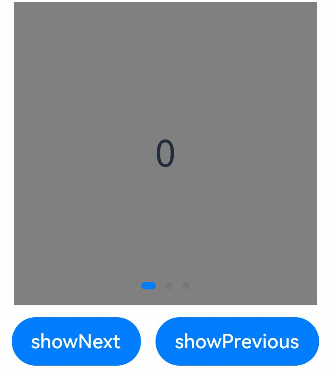
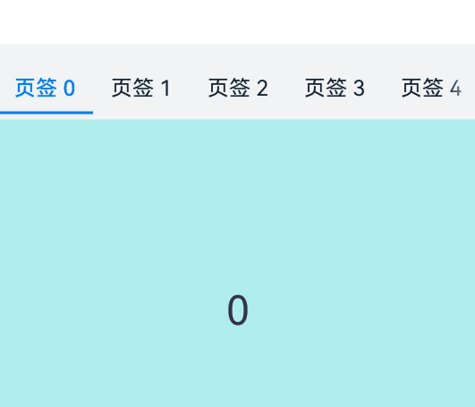

# 创建轮播 (Swiper)


[Swiper](../reference/apis-arkui/arkui-ts/ts-container-swiper.md)组件提供滑动轮播显示的能力。Swiper本身是一个容器组件，当设置了多个子组件后，可以对这些子组件进行轮播显示。通常，在一些应用首页显示推荐的内容时，需要用到轮播显示的能力。

针对复杂页面场景，可以使用 Swiper 组件的预加载机制，利用主线程的空闲时间来提前构建和布局绘制组件，优化滑动体验。<!--Del-->详细指导见[Swiper高性能开发指导](../performance/swiper_optimization.md)。<!--DelEnd-->


## 布局与约束

Swiper作为一个容器组件，如果设置了自身尺寸属性，则在轮播显示过程中均以该尺寸生效。如果自身尺寸属性未被设置，则分两种情况：如果设置了prevMargin或者nextMargin属性，则Swiper自身尺寸会跟随其父组件；如果未设置prevMargin或者nextMargin属性，则会自动根据子组件的大小设置自身的尺寸。


## 循环播放

通过loop属性控制是否循环播放，该属性默认值为true。

当loop为true时，在显示第一页或最后一页时，可以继续往前切换到前一页或者往后切换到后一页。如果loop为false，则在第一页或最后一页时，无法继续向前或者向后切换页面。

- loop为true

```ts
Swiper() {
  Text('0')
    .width('90%')
    .height('100%')
    .backgroundColor(Color.Gray)
    .textAlign(TextAlign.Center)
    .fontSize(30)

  Text('1')
    .width('90%')
    .height('100%')
    .backgroundColor(Color.Green)
    .textAlign(TextAlign.Center)
    .fontSize(30)

  Text('2')
    .width('90%')
    .height('100%')
    .backgroundColor(Color.Pink)
    .textAlign(TextAlign.Center)
    .fontSize(30)
}
.loop(true)
```


- loop为false

```ts
Swiper() {
  // ...
}
.loop(false)
```


## 自动轮播

Swiper通过设置autoPlay属性，控制是否自动轮播子组件。该属性默认值为false。

autoPlay为true时，会自动切换播放子组件，子组件与子组件之间的播放间隔通过interval属性设置。interval属性默认值为3000，单位毫秒。

```ts
Swiper() {
  // ...
}
.loop(true)
.autoPlay(true)
.interval(1000)
```


## 导航点样式

Swiper提供了默认的导航点样式和导航点箭头样式，导航点默认显示在Swiper下方居中位置，开发者也可以通过indicator属性自定义导航点的位置和样式，导航点箭头默认不显示。

通过indicator属性，开发者可以设置导航点相对于Swiper组件上下左右四个方位的位置，同时也可以设置每个导航点的尺寸、颜色、蒙层和被选中导航点的颜色。

- 导航点使用默认样式

```ts
Swiper() {
  Text('0')
    .width('90%')
    .height('100%')
    .backgroundColor(Color.Gray)
    .textAlign(TextAlign.Center)
    .fontSize(30)

  Text('1')
    .width('90%')
    .height('100%')
    .backgroundColor(Color.Green)
    .textAlign(TextAlign.Center)
    .fontSize(30)

  Text('2')
    .width('90%')
    .height('100%')
    .backgroundColor(Color.Pink)
    .textAlign(TextAlign.Center)
    .fontSize(30)
}
```


- 自定义导航点样式

导航点直径设为30vp，左边距为0，导航点颜色设为红色。

```ts
Swiper() {
  // ...
}
.indicator(
  Indicator.dot()
    .left(0)
    .itemWidth(15)
    .itemHeight(15)
    .selectedItemWidth(30)
    .selectedItemHeight(15)
    .color(Color.Red)
    .selectedColor(Color.Blue)
)
```


Swiper通过设置[displayArrow](../reference/apis-arkui/arkui-ts/ts-container-swiper.md#displayarrow10)属性，可以控制导航点箭头的大小、位置、颜色，底板的大小及颜色，以及鼠标悬停时是否显示箭头。

- 箭头使用默认样式

```ts
Swiper() {
  // ...
}
.displayArrow(true, false)
```


- 自定义箭头样式

箭头显示在组件两侧，大小为18vp，导航点箭头颜色设为蓝色。

```ts
Swiper() {
  // ...
}
.displayArrow({ 
  showBackground: true,
  isSidebarMiddle: true,
  backgroundSize: 24,
  backgroundColor: Color.White,
  arrowSize: 18,
  arrowColor: Color.Blue
  }, false)
```


## 页面切换方式

Swiper支持手指滑动、点击导航点和通过控制器三种方式切换页面，以下示例展示通过控制器切换页面的方法。

```ts
@Entry
@Component
struct SwiperDemo {
  private swiperBackgroundColors: Color[] = [Color.Blue, Color.Brown, Color.Gray, Color.Green, Color.Orange,
    Color.Pink, Color.Red, Color.Yellow];
  private swiperAnimationMode: (SwiperAnimationMode | boolean | undefined)[] = [undefined, true, false,
    SwiperAnimationMode.NO_ANIMATION, SwiperAnimationMode.DEFAULT_ANIMATION, SwiperAnimationMode.FAST_ANIMATION];
  private swiperController: SwiperController = new SwiperController();
  private animationModeIndex: number = 0;
  private animationMode: (SwiperAnimationMode | boolean | undefined) = undefined;
  @State animationModeStr: string = 'undefined';
  @State targetIndex: number = 0;

  aboutToAppear(): void {
    this.toSwiperAnimationModeStr();
  }

  build() {
    Column({ space: 5 }) {
      Swiper(this.swiperController) {
        ForEach(this.swiperBackgroundColors, (backgroundColor: Color, index: number) => {
          Text(index.toString())
            .width(250)
            .height(250)
            .backgroundColor(backgroundColor)
            .textAlign(TextAlign.Center)
            .fontSize(30)
        })
      }
      .indicator(true)

      Row({ space: 12 }) {
        Button('showNext')
          .onClick(() => {
            this.swiperController.showNext(); // 通过controller切换到后一页
          })
        Button('showPrevious')
          .onClick(() => {
            this.swiperController.showPrevious(); // 通过controller切换到前一页
          })
      }.margin(5)

      Row({ space: 12 }) {
        Text('Index:')
        Button(this.targetIndex.toString())
          .onClick(() => {
            this.targetIndex = (this.targetIndex + 1) % this.swiperBackgroundColors.length;
          })
      }.margin(5)
      Row({ space: 12 }) {
        Text('AnimationMode:')
        Button(this.animationModeStr)
          .onClick(() => {
            this.animationModeIndex = (this.animationModeIndex + 1) % this.swiperAnimationMode.length;
            this.toSwiperAnimationModeStr();
          })
      }.margin(5)

      Row({ space: 12 }) {
        Button('changeIndex(' + this.targetIndex + ', ' + this.animationModeStr + ')')
          .onClick(() => {
            this.swiperController.changeIndex(this.targetIndex, this.animationMode); // 通过controller切换到指定页
          })
      }.margin(5)
    }.width('100%')
    .margin({ top: 5 })
  }

  private toSwiperAnimationModeStr() {
    this.animationMode = this.swiperAnimationMode[this.animationModeIndex];
    if ((this.animationMode === true) || (this.animationMode === false)) {
      this.animationModeStr = '' + this.animationMode;
    } else if ((this.animationMode === SwiperAnimationMode.NO_ANIMATION) ||
      (this.animationMode === SwiperAnimationMode.DEFAULT_ANIMATION) ||
      (this.animationMode === SwiperAnimationMode.FAST_ANIMATION)) {
      this.animationModeStr = SwiperAnimationMode[this.animationMode];
    } else {
      this.animationModeStr = 'undefined';
    }
  }
}
```




## 轮播方向

Swiper支持水平和垂直方向上进行轮播，主要通过vertical属性控制。

当vertical为true时，表示在垂直方向上进行轮播；为false时，表示在水平方向上进行轮播。vertical默认值为false。


- 设置水平方向上轮播。

```ts
Swiper() {
  // ...
}
.indicator(true)
.vertical(false)
```


- 设置垂直方向轮播。

```ts
Swiper() {
  // ...
}
.indicator(true)
.vertical(true)
```


## 每页显示多个子页面

Swiper支持在一个页面内同时显示多个子组件，通过[displayCount](../reference/apis-arkui/arkui-ts/ts-container-swiper.md#displaycount8)属性设置。

```ts
Swiper() {
  Text('0')
    .width(250)
    .height(250)
    .backgroundColor(Color.Gray)
    .textAlign(TextAlign.Center)
    .fontSize(30)
  Text('1')
    .width(250)
    .height(250)
    .backgroundColor(Color.Green)
    .textAlign(TextAlign.Center)
    .fontSize(30)
  Text('2')
    .width(250)
    .height(250)
    .backgroundColor(Color.Pink)
    .textAlign(TextAlign.Center)
    .fontSize(30)
  Text('3')
    .width(250)
    .height(250)
    .backgroundColor(Color.Blue)
    .textAlign(TextAlign.Center)
    .fontSize(30)
}
.indicator(true)
.displayCount(2)
```


## 自定义切换动画

Swiper支持通过[customContentTransition](../reference/apis-arkui/arkui-ts/ts-container-swiper.md#customcontenttransition12)设置自定义切换动画，可以在回调中对视窗内所有页面逐帧设置透明度、缩放比例、位移、渲染层级等属性实现自定义切换动画。

```ts
@Entry
@Component
struct SwiperCustomAnimationExample {
  private DISPLAY_COUNT: number = 2
  private MIN_SCALE: number = 0.75

  @State backgroundColors: Color[] = [Color.Green, Color.Blue, Color.Yellow, Color.Pink, Color.Gray, Color.Orange]
  @State opacityList: number[] = []
  @State scaleList: number[] = []
  @State translateList: number[] = []
  @State zIndexList: number[] = []

  aboutToAppear(): void {
    for (let i = 0; i < this.backgroundColors.length; i++) {
      this.opacityList.push(1.0)
      this.scaleList.push(1.0)
      this.translateList.push(0.0)
      this.zIndexList.push(0)
    }
  }

  build() {
    Column() {
      Swiper() {
        ForEach(this.backgroundColors, (backgroundColor: Color, index: number) => {
          Text(index.toString()).width('100%').height('100%').fontSize(50).textAlign(TextAlign.Center)
            .backgroundColor(backgroundColor)
            .opacity(this.opacityList[index])
            .scale({ x: this.scaleList[index], y: this.scaleList[index] })
            .translate({ x: this.translateList[index] })
            .zIndex(this.zIndexList[index])
        })
      }
      .height(300)
      .indicator(false)
      .displayCount(this.DISPLAY_COUNT, true)
      .customContentTransition({
        timeout: 1000,
        transition: (proxy: SwiperContentTransitionProxy) => {
          if (proxy.position <= proxy.index % this.DISPLAY_COUNT || proxy.position >= this.DISPLAY_COUNT + proxy.index % this.DISPLAY_COUNT) {
            // 同组页面完全滑出视窗外时，重置属性值
            this.opacityList[proxy.index] = 1.0
            this.scaleList[proxy.index] = 1.0
            this.translateList[proxy.index] = 0.0
            this.zIndexList[proxy.index] = 0
          } else {
            // 同组页面未滑出视窗外时，对同组中左右两个页面，逐帧根据position修改属性值
            if (proxy.index % this.DISPLAY_COUNT === 0) {
              this.opacityList[proxy.index] = 1 - proxy.position / this.DISPLAY_COUNT
              this.scaleList[proxy.index] = this.MIN_SCALE + (1 - this.MIN_SCALE) * (1 - proxy.position / this.DISPLAY_COUNT)
              this.translateList[proxy.index] = - proxy.position * proxy.mainAxisLength + (1 - this.scaleList[proxy.index]) * proxy.mainAxisLength / 2.0
            } else {
              this.opacityList[proxy.index] = 1 - (proxy.position - 1) / this.DISPLAY_COUNT
              this.scaleList[proxy.index] = this.MIN_SCALE + (1 - this.MIN_SCALE) * (1 - (proxy.position - 1) / this.DISPLAY_COUNT)
              this.translateList[proxy.index] = - (proxy.position - 1) * proxy.mainAxisLength - (1 - this.scaleList[proxy.index]) * proxy.mainAxisLength / 2.0
            }
            this.zIndexList[proxy.index] = -1
          }
        }
      })
    }.width('100%')
  }
}
```


## Swiper与Tabs联动

Swiper选中的元素改变时，会通过onSelected回调事件，将元素的索引值index返回。通过调用tabsController.changeIndex(index)方法来实现Tabs页签的切换。

```ts
// xxx.ets
class MyDataSource implements IDataSource {
  private list: number[] = []

  constructor(list: number[]) {
    this.list = list
  }

  totalCount(): number {
    return this.list.length
  }

  getData(index: number): number {
    return this.list[index]
  }

  registerDataChangeListener(listener: DataChangeListener): void {
  }

  unregisterDataChangeListener() {
  }
}

@Entry
@Component
struct TabsSwiperExample {
  @State fontColor: string = '#182431'
  @State selectedFontColor: string = '#007DFF'
  @State currentIndex: number = 0
  private list: number[] = []
  private tabsController: TabsController = new TabsController()
  private swiperController: SwiperController = new SwiperController()
  private swiperData: MyDataSource = new MyDataSource([])

  aboutToAppear(): void {
    for (let i = 0; i <= 9; i++) {
      this.list.push(i);
    }
    this.swiperData = new MyDataSource(this.list)
  }

  @Builder tabBuilder(index: number, name: string) {
    Column() {
      Text(name)
        .fontColor(this.currentIndex === index ? this.selectedFontColor : this.fontColor)
        .fontSize(16)
        .fontWeight(this.currentIndex === index ? 500 : 400)
        .lineHeight(22)
        .margin({ top: 17, bottom: 7 })
      Divider()
        .strokeWidth(2)
        .color('#007DFF')
        .opacity(this.currentIndex === index ? 1 : 0)
    }.width('20%')
  }

  build() {
    Column() {
      Tabs({ barPosition: BarPosition.Start, controller: this.tabsController }) {
        ForEach(this.list, (index: number) =>{
          TabContent().tabBar(this.tabBuilder(index, '页签 ' + this.list[index]))
        })
      }
      .onTabBarClick((index: number) => {
        this.currentIndex = index
        this.swiperController.changeIndex(index, true)
      })
      .barMode(BarMode.Scrollable)
      .backgroundColor('#F1F3F5')
      .height(56)
      .width('100%')

      Swiper(this.swiperController) {
        LazyForEach(this.swiperData, (item: string) => {
          Text(item.toString())
            .onAppear(()=>{
              console.info('onAppear ' + item.toString())
            })
            .onDisAppear(()=>{
              console.info('onDisAppear ' + item.toString())
            })
            .width('100%')
            .height('40%')
            .backgroundColor(0xAFEEEE)
            .textAlign(TextAlign.Center)
            .fontSize(30)
        }, (item: string) => item)
      }
      .loop(false)
      .onSelected((index: number) => {
        console.info("onSelected:" + index)
        this.currentIndex = index;
        this.tabsController.changeIndex(index)
      })
    }
  }
}
```


## 设置圆点导航点间距

针对圆点导航点，可以通过DotIndicator的space属性来设置圆点导航点的间距。

```ts
Swiper() {
  // ...
}
.indicator(
  new DotIndicator()
    .space(LengthMetrics.vp(3))
)
```

## 导航点忽略组件大小

当导航点的bottom设为0之后，导航点的底部与Swiper的底部还会有一定间距。如果希望消除该间距，可通过调用bottom(bottom, ignoreSize)属性来进行设置。将ignoreSize 设置为true，即可忽略导航点组件大小，达到消除该间距的目的。

- 圆点导航点忽略组件大小。

```ts
Swiper() {
  // ...
}
.indicator(
  new DotIndicator()
    .bottom(LengthMetrics.vp(0), true)
)
```

- 数字导航点忽略组件大小。

```ts
Swiper() {
  // ...
}
.indicator(
  new DigitIndicator()
    .bottom(LengthMetrics.vp(0), true)
)
```

圆点导航点设置间距及忽略组件大小完整示列代码如下：

```ts
import { LengthMetrics } from '@kit.ArkUI'

// MyDataSource.ets
class MyDataSource implements IDataSource {
  private list: number[] = []

  constructor(list: number[]) {
    this.list = list
  }

  totalCount(): number {
    return this.list.length
  }

  getData(index: number): number {
    return this.list[index]
  }

  registerDataChangeListener(listener: DataChangeListener): void {
  }

  unregisterDataChangeListener() {
  }
}

// SwiperExample.ets
@Entry
@Component
struct SwiperExample {

  @State space: LengthMetrics = LengthMetrics.vp(0)
  @State spacePool: LengthMetrics[] = [LengthMetrics.vp(0), LengthMetrics.px(3), LengthMetrics.vp(10)]
  @State spaceIndex: number = 0

  @State ignoreSize: boolean = false
  @State ignoreSizePool: boolean[] = [false, true]
  @State ignoreSizeIndex: number = 0

  private swiperController1: SwiperController = new SwiperController()
  private data1: MyDataSource = new MyDataSource([])

  aboutToAppear(): void {
    let list1: number[] = []
    for (let i = 1; i <= 10; i++) {
      list1.push(i);
    }
    this.data1 = new MyDataSource(list1)
  }

  build() {
    Scroll() {
      Column({ space: 20 }) {
        Swiper(this.swiperController1) {
          LazyForEach(this.data1, (item: string) => {
            Text(item.toString())
              .width('90%')
              .height(120)
              .backgroundColor(0xAFEEEE)
              .textAlign(TextAlign.Center)
              .fontSize(30)
          }, (item: string) => item)
        }
        .indicator(new DotIndicator()
          .space(this.space)
          .bottom(LengthMetrics.vp(0), this.ignoreSize)
          .itemWidth(15)
          .itemHeight(15)
          .selectedItemWidth(15)
          .selectedItemHeight(15)
          .color(Color.Gray)
          .selectedColor(Color.Blue))
        .displayArrow({
          showBackground: true,
          isSidebarMiddle: true,
          backgroundSize: 24,
          backgroundColor: Color.White,
          arrowSize: 18,
          arrowColor: Color.Blue
        }, false)
        
        Column({ space: 4 }) {
          Button('spaceIndex:' + this.spaceIndex).onClick(() => {
            this.spaceIndex = (this.spaceIndex + 1) % this.spacePool.length;
            this.space = this.spacePool[this.spaceIndex];
          }).margin(10)

          Button('ignoreSizeIndex:' + this.ignoreSizeIndex).onClick(() => {
            this.ignoreSizeIndex = (this.ignoreSizeIndex + 1) % this.ignoreSizePool.length;
            this.ignoreSize = this.ignoreSizePool[this.ignoreSizeIndex];
          }).margin(10)
        }.margin(2)
      }.width('100%')
    }
  }
}
```


## 相关实例

针对Swiper组件开发，有以下相关实例可供参考：

- [电子相册（ArkTS）（API9）](https://gitee.com/openharmony/codelabs/tree/master/ETSUI/ElectronicAlbum)

- [Swiper的使用（ArkTS）（API9）](https://gitee.com/openharmony/codelabs/tree/master/ETSUI/SwiperArkTS)
<!--RP1--><!--RP1End-->