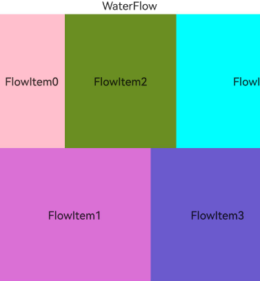
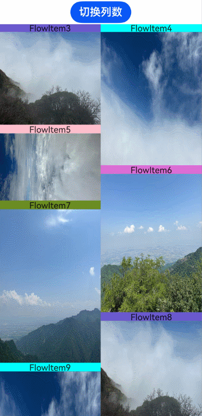

# 创建瀑布流（WaterFlow）

[瀑布流](../reference/apis-arkui/arkui-ts/ts-container-waterflow.md)常用于展示图片信息，尤其在购物和资讯类应用中。
ArkUI提供了WaterFlow容器组件，用于构建瀑布流布局。WaterFlow组件支持条件渲染、循环渲染和懒加载等方式生成子组件。

## 布局与约束

瀑布流支持横向和纵向布局。在纵向布局中，可以通过[columnsTemplate](../reference/apis-arkui/arkui-ts/ts-container-waterflow.md#columnstemplate)设置列数；在横向布局中，可以通过[rowsTemplate](../reference/apis-arkui/arkui-ts/ts-container-waterflow.md#rowstemplate)设置行数。

在瀑布流的纵向布局中，第一行的子节点按从左到右顺序排列，从第二行开始，每个子节点将放置在当前总高度最小的列。如果多个列的总高度相同，则按照从左到右的顺序填充。如下图：


在瀑布流的横向布局中，每个子节点都会放置在当前总宽度最小的行。若多行总宽度相同，则按照从上到下的顺序进行填充。



## 无限滚动

### 到达末尾时新增数据

瀑布流常用于无限滚动的信息流。可以在瀑布流组件到达末尾位置时触发的[onReachEnd](../reference/apis-arkui/arkui-ts/ts-container-waterflow.md#onreachend)事件回调中对[LazyForEach](../reference/apis-arkui/arkui-ts/ts-rendering-control-lazyforeach.md)增加新数据，并将footer做成正在加载新数据的样式（使用[LoadingProgress](../reference/apis-arkui/arkui-ts/ts-basic-components-loadingprogress.md)组件）。

```ts
  @Builder
  itemFoot() {
    Row() {
      LoadingProgress()
        .color(Color.Blue).height(50).aspectRatio(1).width('20%')
      Text(`正在加载`)
        .fontSize(20)
        .width('30%')
        .height(50)
        .align(Alignment.Center)
        .margin({ top: 2 })
    }.width('100%').justifyContent(FlexAlign.Center)
  }

  build() {
    Column({ space: 2 }) {
      WaterFlow({ footer: this.itemFoot(), layoutMode: WaterFlowLayoutMode.SLIDING_WINDOW }) {
        LazyForEach(this.dataSource, (item: number) => {
          FlowItem() {
            ReusableFlowItem({ item: item })
          }
          .width('100%')
          .aspectRatio(this.itemHeightArray[item % 100] / this.itemWidthArray[item%100])
          .backgroundColor(this.colors[item % 5])
        }, (item: string) => item)
      }
      .columnsTemplate('1fr '.repeat(this.columns))
      .backgroundColor(0xFAEEE0)
      .width('100%')
      .height('100%')
      .layoutWeight(1)
      // 触底加载数据
      .onReachEnd(() => {
        setTimeout(() => {
          this.dataSource.addNewItems();
        }, 1000);
      })
    }
  }

  // WaterFlowDataSource中增加在数据尾部增加count个元素的方法
  public addNewItems(count: number): void {
    let len = this.dataArray.length;
    for (let i = 0; i < count; i++) {
      this.dataArray.push(this.dataArray.length);
    }
    this.listeners.forEach(listener => {
      listener.onDatasetChange([{ type: DataOperationType.ADD, index: len, count: count }]);
    })
  }

```

在此处应通过在数据末尾添加元素的方式来新增数据，不可直接修改dataArray后通过LazyForEach的onDataReloaded()方法通知瀑布流重新加载数据。

由于在瀑布流布局中，各子节点的高度不一致，下面的节点位置依赖于上面的节点，所以重新加载所有数据会触发整个瀑布流重新计算布局，可能会导致卡顿。在数据末尾增加数据后，应使用`onDatasetChange([{ type: DataOperationType.ADD, index: len, count: count }])`通知，以使瀑布流能够识别新增数据并继续加载，同时避免对已有数据进行重复处理。


### 提前新增数据

虽然在onReachEnd()触发时加载数据可以实现无限加载，但在滑动到底部会出现明显的停顿。

为了实现更加流畅的无限滑动，需要调整增加新数据的时机。比如可以在LazyForEach还剩余若干个数据未遍历的情况下提前加载新数据。以下代码通过在WaterFlow的[onScrollIndex](../reference/apis-arkui/arkui-ts/ts-container-waterflow.md#onscrollindex11)中判断当前显示的最后一个子节点相对数据集终点的距离，并在合适时机提前加载新数据，实现了无停顿的无限滚动。

```ts
  build() {
    Column({ space: 2 }) {
      WaterFlow({ layoutMode: WaterFlowLayoutMode.SLIDING_WINDOW }) {
        LazyForEach(this.dataSource, (item: number) => {
          FlowItem() {
            ReusableFlowItem({ item: item })
          }
          .width('100%')
          .aspectRatio(this.itemHeightArray[item % 100] / this.itemWidthArray[item%100])
          .backgroundColor(this.colors[item % 5])
        }, (item: string) => item)
      }
      .columnsTemplate('1fr '.repeat(this.columns))
      .backgroundColor(0xFAEEE0)
      .width('100%')
      .height('100%')
      .layoutWeight(1)
      // 即将触底时提前增加数据
      .onScrollIndex((first: number, last: number) => {
        if (last + 20 >= this.dataSource.totalCount()) {
          setTimeout(() => {
            this.dataSource.addNewItems(100);
          }, 1000);
        }
      })
    }
  }
```


## 动态切换列数

通过动态调整瀑布流的列数，应用能够实现在列表模式与瀑布流模式间的切换，或适应屏幕宽度的变化。 若要动态设置列数，建议采用瀑布流的移动窗口布局模式，这可以实现更快速的列数转换。

```ts
// 通过状态变量设置列数，可以按需修改触发布局更新
@State columns: number = 2;

@Reusable
@Component
struct ReusableListItem {
  @State item: number = 0;

  aboutToReuse(params: Record<string, number>) {
    this.item = params.item;
  }

  build() {
    Row() {
      Image('res/waterFlow(' + this.item % 5 + ').JPG')
        .objectFit(ImageFit.Fill)
        .height(100)
        .aspectRatio(1)
      Text("N" + this.item).fontSize(12).height('16').layoutWeight(1).textAlign(TextAlign.Center)
    }
  }
}

  build() {
    Column({ space: 2 }) {
      Button('切换列数').fontSize(20).onClick(() => {
        if (this.columns === 2) {
          this.columns = 1;
        } else {
          this.columns = 2;
        }
      })
      WaterFlow({ layoutMode: WaterFlowLayoutMode.SLIDING_WINDOW }) {
        LazyForEach(this.dataSource, (item: number) => {
          FlowItem() {
            if (this.columns === 1) {
              ReusableListItem({ item: item })
            } else {
              ReusableFlowItem({ item: item })
            }
          }
          .width('100%')
          .aspectRatio(this.columns === 2 ? this.itemHeightArray[item % 100] / this.itemWidthArray[item % 100] : 0)
          .backgroundColor(this.colors[item % 5])
        }, (item: string) => item)
      }
      .columnsTemplate('1fr '.repeat(this.columns))
      .backgroundColor(0xFAEEE0)
      .width('100%')
      .height('100%')
      .layoutWeight(1)
      // 即将触底时提前增加数据
      .onScrollIndex((first: number, last: number) => {
        if (last + 20 >= this.dataSource.totalCount()) {
          setTimeout(() => {
            this.dataSource.addNewItems(100);
          }, 1000);
        }
      })
    }
  }
```



## 分组混合布局

许多应用界面在瀑布流上方包含其他内容，这类场景可通过在Scroll或List内部嵌套WaterFlow来实现。类似下图：


如果能够将不同部分的子节点整合到一个数据源中，那么通过设置 WaterFlowSections，可以在一个 WaterFlow 容器内实现混合布局。与嵌套滚动相比，这种方法可以简化滚动事件处理等应用逻辑。

每个瀑布流分组可以分别设置自己的列数、行间距、列间距、margin和子节点总数，如下代码可以实现上述效果：

```ts
@Entry
@Component
struct WaterFlowDemo {
  minSize: number = 80;
  maxSize: number = 180;
  colors: number[] = [0xFFC0CB, 0xDA70D6, 0x6B8E23, 0x6A5ACD, 0x00FFFF, 0x00FF7F];
  dataSource: WaterFlowDataSource = new WaterFlowDataSource(100);
  private itemWidthArray: number[] = [];
  private itemHeightArray: number[] = [];
  private gridItems: number[] = [];
  @State sections: WaterFlowSections = new WaterFlowSections();
  sectionMargin: Margin = {
    top: 10,
    left: 5,
    bottom: 10,
    right: 5
  };
  oneColumnSection: SectionOptions = {
    itemsCount: 1,
    crossCount: 1,
    columnsGap: 5,
    rowsGap: 10,
    margin: this.sectionMargin,
  };
  twoColumnSection: SectionOptions = {
    itemsCount: 98,
    crossCount: 2,
  };
  // 使用分组瀑布流时无法通过footer设置尾部组件，可以保留一个固定的分组作为footer
  lastSection: SectionOptions = {
    itemsCount: 1,
    crossCount: 1,
  };

  // 计算FlowItem宽/高
  getSize() {
    let ret = Math.floor(Math.random() * this.maxSize);
    return (ret > this.minSize ? ret : this.minSize);
  }

  // 设置FlowItem的宽/高数组
  setItemSizeArray() {
    for (let i = 0; i < 100; i++) {
      this.itemWidthArray.push(this.getSize());
      this.itemHeightArray.push(this.getSize());
    }
  }

  aboutToAppear() {
    this.setItemSizeArray();
    for (let i = 0; i < 15; ++i) {
      this.gridItems.push(i);
    }
    // 所有分组的itemCount之和需要和WaterFlow下数据源的子节点总数相等，否则无法正常布局
    let sectionOptions: SectionOptions[] = [this.oneColumnSection, this.twoColumnSection, this.lastSection];
    this.sections.splice(0, 0, sectionOptions);
  }

  build() {
    WaterFlow({ layoutMode: WaterFlowLayoutMode.SLIDING_WINDOW, sections: this.sections }) {
      LazyForEach(this.dataSource, (item: number) => {
        FlowItem() {
          if (item === 0) {
            Grid() {
              ForEach(this.gridItems, (day: number) => {
                GridItem() {
                  Text('GridItem').fontSize(14).height(16)
                }.backgroundColor(0xFFC0CB)
              }, (day: number) => day.toString())
            }
            .height('30%')
            .rowsGap(5)
            .columnsGap(5)
            .columnsTemplate('1fr '.repeat(5))
            .rowsTemplate('1fr '.repeat(3))
          } else {
            ReusableFlowItem({ item: item })
          }
        }
        .width('100%')
        .aspectRatio(item != 0 ? this.itemHeightArray[item % 100] / this.itemWidthArray[item % 100] : 0)
        .backgroundColor(item != 0 ? this.colors[item % 5] : Color.White)
      }, (item: string) => item)
    }
    .backgroundColor(0xFAEEE0)
    .height('100%')
    // 即将触底时提前增加数据
    .onScrollIndex((first: number, last: number) => {
      if (last + 20 >= this.dataSource.totalCount()) {
        setTimeout(() => {
          this.dataSource.addNewItems(100);
          // 增加数据后同步调整对应分组的itemCount
          this.twoColumnSection.itemsCount += 100;
          this.sections.update(1, this.twoColumnSection);
        }, 1000);
      }
    })
    .margin(10)
  }
}
```

>**说明：**
>
>使用分组混合布局时不支持单独设置footer，可以使用最后一个分组作为尾部组件。
>
>增加或删除数据后需要同步修改对应分组的itemCount。

## 相关实例

针对瀑布流开发，有以下实例可供参考：

[主页瀑布流实现](https://gitee.com/harmonyos-cases/cases/blob/master/CommonAppDevelopment/feature/functionalscenes/README.md)