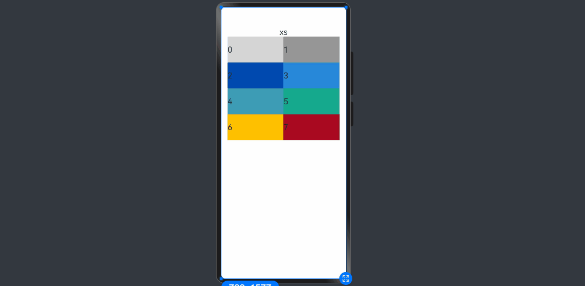
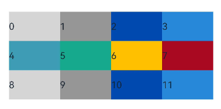
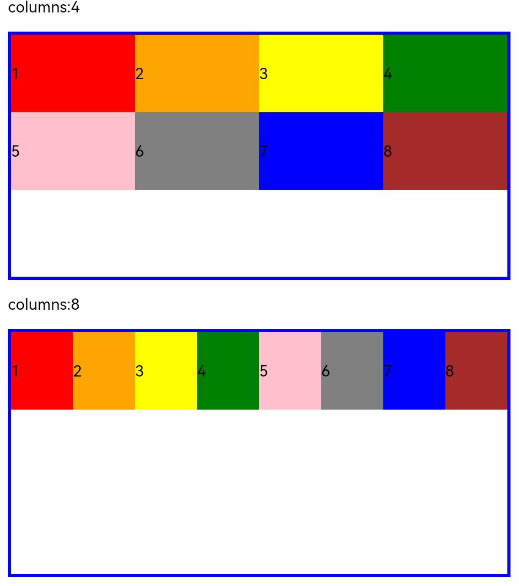
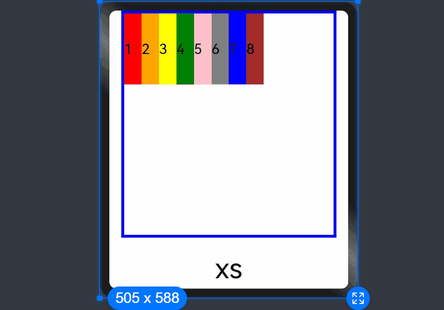
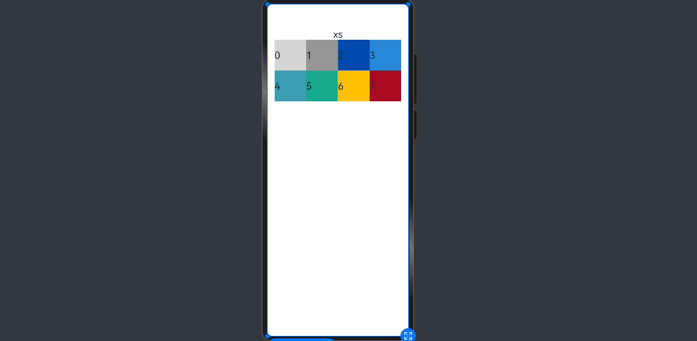
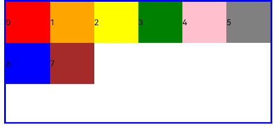
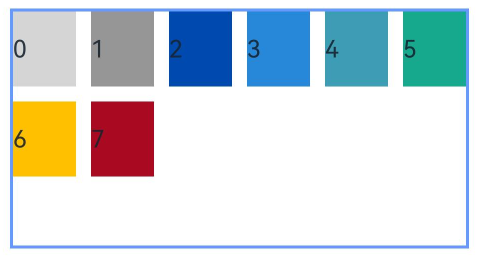
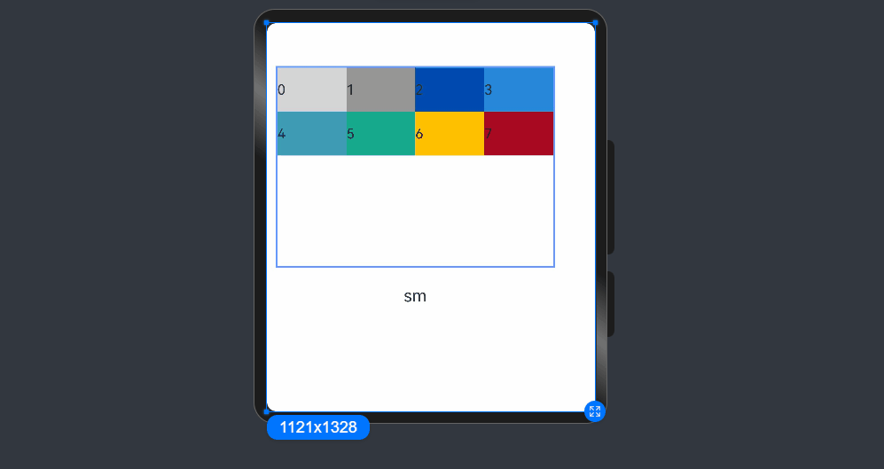
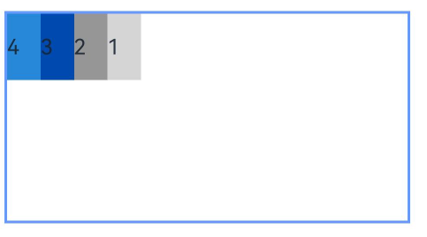

# 栅格布局 (GridRow/GridCol)


## 概述

栅格布局是一种通用的辅助定位工具，对移动设备的界面设计有较好的借鉴作用。主要优势包括：

1. 提供可循的规律：栅格布局可以为布局提供规律性的结构，解决多尺寸多设备的动态布局问题。通过将页面划分为等宽的列数和行数，可以方便地对页面元素进行定位和排版。

2. 统一的定位标注：栅格布局可以为系统提供一种统一的定位标注，保证不同设备上各个模块的布局一致性。这可以减少设计和开发的复杂度，提高工作效率。

3. 灵活的间距调整方法：栅格布局可以提供一种灵活的间距调整方法，满足特殊场景布局调整的需求。通过调整列与列之间和行与行之间的间距，可以控制整个页面的排版效果。

4. 自动换行和自适应：栅格布局可以完成一对多布局的自动换行和自适应。当页面元素的数量超出了一行或一列的容量时，他们会自动换到下一行或下一列，并且在不同的设备上自适应排版，使得页面布局更加灵活和适应性强。

[GridRow](../reference/apis-arkui/arkui-ts/ts-container-gridrow.md)为栅格容器组件，需与栅格子组件[GridCol](../reference/apis-arkui/arkui-ts/ts-container-gridcol.md)在栅格布局场景中联合使用。


## 栅格容器GridRow


### 栅格容器断点

栅格容器以设备的水平宽度（[屏幕密度像素值](../reference/apis-arkui/arkui-ts/ts-pixel-units.md)，单位vp）作为断点依据，定义设备的宽度类型，形成了一套断点规则。开发者可根据需求在不同的断点区间实现不同的页面布局效果。

栅格容器默认断点将设备宽度分为xs、sm、md、lg四类，尺寸范围如下：

| 断点名称 | 取值范围（vp）        | 设备描述      |
| ---- | --------------- | --------- |
| xs   | [0,&nbsp;320）   | 最小宽度类型设备。 |
| sm   | [320,&nbsp;600) | 小宽度类型设备。  |
| md   | [600,&nbsp;840) | 中等宽度类型设备。 |
| lg   | [840,&nbsp;+∞)  | 大宽度类型设备。  |

在GridRow栅格组件中，允许开发者使用[BreakPoints](../reference/apis-arkui/arkui-ts/ts-container-gridrow.md#breakpoints)自定义修改断点的取值范围，最多支持6个断点，除了默认的4个断点外，还可以启用xl和xxl断点，支持6种不同尺寸（xs，sm，md，lg，xl，xxl）设备的布局设置。

| 断点名称 | 设备描述      |
| ---- | --------- |
| xs   | 最小宽度类型设备。 |
| sm   | 小宽度类型设备。  |
| md   | 中等宽度类型设备。 |
| lg   | 大宽度类型设备。  |
| xl   | 特大宽度类型设备。 |
| xxl  | 超大宽度类型设备。 |

- 开发者可根据实际使用场景，通过一个单调递增数组设置断点位置。由于栅格容器默认支持4个断点，在不设置断点位置时，系统为默认断点配置的单调递增数组为["320vp", "600vp", "840vp"]。开发者使用[BreakPoints](../reference/apis-arkui/arkui-ts/ts-container-gridrow.md#breakpoints)最多可支持6个断点，因此此单调递增数组最大长度为5。

  假设传入的数组是[n0, n1, n2, n3, n4]，则各个断点取值如下：

  |断点|取值范围|
  |---|-----------|
  |xs |[0, n0)    |
  |sm |[n0, n1)   |
  |md |[n1, n2)   |
  |lg |[n2, n3)   |
  |xl |[n3, n4)   |
  |xxl|[n4, INF)  |

  ```ts
  breakpoints: {value: ['100vp', '200vp']} // 表示xs、sm、md共3个断点被使用，小于100vp为xs，100vp-200vp为sm，大于200vp为md。
  breakpoints: {value: ['320vp', '600vp']} // 表示xs、sm、md共3个断点被使用，小于320vp为xs，320vp-600vp为sm，大于600vp为md。
  breakpoints: {value: ['320vp', '600vp', '840vp', '1440vp']} // 表示xs、sm、md、lg、xl共5个断点被使用，小于320vp为xs，320vp-600vp为sm，  600vp-840vp为md，840vp-1440vp为lg，大于1440vp为xl。
  ```

- 栅格容器通过监听窗口或容器的尺寸变化进行断点，通过reference设置断点切换参考物。考虑到应用可能以非全屏窗口的形式显示，以应用窗口宽度为参照物更为通用。

  例如，通过断点设置将应用宽度分成6个区间，通过columns配置各断点下栅格容器的栅格列数。


  ```ts
  @State bgColors: ResourceColor[] =
      ['rgb(213,213,213)', 'rgb(150,150,150)', 'rgb(0,74,175)', 'rgb(39,135,217)', 'rgb(61,157,180)', 'rgb(23,169,141)',
        'rgb(255,192,0)', 'rgb(170,10,33)'];
  // ...
  GridRow({
    columns: {
              xs: 2, // 窗口宽度落入xs断点上，栅格容器分为2列。
              sm: 4, // 窗口宽度落入sm断点上，栅格容器分为4列。
              md: 8, // 窗口宽度落入md断点上，栅格容器分为8列。
              lg: 12, // 窗口宽度落入lg断点上，栅格容器分为12列。
              xl: 12, // 窗口宽度落入xl断点上，栅格容器分为12列。
              xxl: 12 // 窗口宽度落入xxl断点上，栅格容器分为12列。
    },
    breakpoints: {
      value: ['320vp', '600vp', '840vp', '1440vp', '1600vp'], // 表示在保留默认断点['320vp', '600vp', '840vp']的同时自定义增加'1440vp', '1600vp'的断点，实际开发中需要根据实际使用场景，合理设置断点值实现一次开发多端适配。
      reference: BreakpointsReference.WindowSize
    }
  }) {
    ForEach(this.bgColors, (color:ResourceColor, index?:number|undefined) => {
      GridCol({ span: 1 }) { // 所有子组件占一列。
        Row() {
          Text(`${index}`)
        }.width("100%").height('50vp')
      }.backgroundColor(color)
    })
  }                                    
  ```

  


### 布局的总列数

GridRow中通过columns设置栅格布局的总列数。

- API version 20之前，columns默认值为12，即在未设置columns时，任何断点下，栅格布局均被分成12列。
- API version 20及以后，columns默认值为{ xs: 2, sm: 4, md: 8, lg: 12, xl: 12, xxl: 12 }。


    ```ts
  @State bgColors: ResourceColor[] =
      ['rgb(213,213,213)', 'rgb(150,150,150)', 'rgb(0,74,175)', 'rgb(39,135,217)', 'rgb(61,157,180)', 'rgb(23,169,141)',
        'rgb(255,192,0)', 'rgb(170,10,33)', 'rgb(213,213,213)', 'rgb(150,150,150)', 'rgb(0,74,175)', 'rgb(39,135,217)'];
     // ...
    GridRow() {
      ForEach(this.bgColors, (item:ResourceColor, index?:number|undefined) => {
        GridCol({span: 1}) {
          Row() {
              Text(`${index}`)
          }.width('100%').height('50')
        }.backgroundColor(item)
      })
    }
    ```

    API version 20之前布局显示：

    
    
    API version 20及以后布局显示（以sm设备为例，默认栅格列数为4）：
    
    


columns支持number和[GridRowColumnOption](../reference/apis-arkui/arkui-ts/ts-container-gridrow.md#gridrowcolumnoption)两种类型, 可按两种方式设置栅格布局的总列数。
- 当columns类型为number时，栅格布局在任何尺寸设备下都被分为同一列数。下面分别设置栅格布局列数为4和8，子元素占一列，效果如下：

  ```ts
  @State bgColors: ResourceColor[] =
      ['rgb(213,213,213)', 'rgb(150,150,150)', 'rgb(0,74,175)', 'rgb(39,135,217)', 'rgb(61,157,180)', 'rgb(23,169,141)',
        'rgb(255,192,0)', 'rgb(170,10,33)'];
  @State currentBp: string = 'unknown';
  // ...
  Row() {
    GridRow({ columns: 4 }) {
      ForEach(this.bgColors, (item: ResourceColor, index?: number | undefined) => {
        GridCol({ span: 1 }) {
          Row() {
            Text(`${index}`)
          }.width('100%').height('50')
        }.backgroundColor(item)
      })
    }
    .width('100%').height('100%')
  }
  .height(160)
  .border({ color: 'rgb(39,135,217)', width: 2 })
  .width('90%')

  Row() {
    GridRow({ columns: 8 }) {
      ForEach(this.bgColors, (item: ResourceColor, index?: number | undefined) => {
        GridCol({ span: 1 }) {
          Row() {
            Text(`${index}`)
          }.width('100%').height('50')
        }.backgroundColor(item)
      })
    }
    .width('100%').height('100%')
  }
  .height(160)
  .border({ color: 'rgb(39,135,217)', width: 2 })
  .width('90%')
  ```

    

- 当columns类型为[GridRowColumnOption](../reference/apis-arkui/arkui-ts/ts-container-gridrow.md#gridrowcolumnoption)时，支持下面6种不同尺寸（xs，sm，md，lg，xl，xxl）设备的栅格列数设置，不同尺寸的设备支持配置不同的栅格列数。

  ```ts
  @State bgColors: ResourceColor[] =
      ['rgb(213,213,213)', 'rgb(150,150,150)', 'rgb(0,74,175)', 'rgb(39,135,217)', 'rgb(61,157,180)', 'rgb(23,169,141)',
        'rgb(255,192,0)', 'rgb(170,10,33)'];
  GridRow({
    columns: { sm: 4, md: 8 },
    breakpoints: {
      value: ['320vp', '600vp', '840vp', '1440vp', '1600vp'] // 表示在保留默认断点['320vp', '600vp', '840vp']的同时自定义增加'1440vp', '1600vp'的断点，实际开发中需要根据实际使用场景，合理设置断点值实现一次开发多端适配。
    }
  }) {
    ForEach(this.bgColors, (item: ResourceColor, index?: number | undefined) => {
      GridCol({ span: 1 }) {
        Row() {
          Text(`${index}`)
        }.width('100%').height('50')
      }.backgroundColor(item)
    })
  }
  .height(200)
  .border({ color: 'rgb(39,135,217)', width: 2 })
  ```
    API version 20之前布局显示（xs设备未配置栅格列数，取默认列数12）：

    

    API version 20及以后布局显示（xs设备继承sm设备栅格列数）：

    

  仅部分设置sm、md的栅格列数，未配置的xs、lg、xl、xxl设备根据[栅格列数补全](../reference/apis-arkui/arkui-ts/ts-container-gridrow.md#gridrowcolumnoption)取默认值。


### 排列方向

栅格布局中，可以通过设置GridRow的direction属性来指定栅格子组件在栅格容器中的排列方向。该属性可以设置为GridRowDirection.Row（从左往右排列）或GridRowDirection.RowReverse（从右往左排列），以满足不同的布局需求。通过合理的direction属性设置，可以使得页面布局更加灵活和符合设计要求。

- 子组件默认从左往右排列。


    ```ts
    GridRow({ direction: GridRowDirection.Row }){ /* ... */ }
    ```

    

- 子组件从右往左排列。


    ```ts
    GridRow({ direction: GridRowDirection.RowReverse }){ /* ... */ }
    ```

    


### 子组件间距

GridRow中通过gutter属性设置子元素在水平和垂直方向的间距。

- 当gutter类型为number时，同时设置栅格子组件间水平和垂直方向边距且相等。下例中，设置子组件水平与垂直方向距离相邻元素的间距为10。


    ```ts
    GridRow({ gutter: 10 }){ /* ... */ }
    ```

    

- 当gutter类型为GutterOption时，单独设置栅格子组件水平垂直边距，x属性为水平方向间距，y为垂直方向间距。


    ```ts
    GridRow({ gutter: { x: 20, y: 50 } }){ /* ... */ }
    ```

    


## 子组件GridCol

GridCol组件作为GridRow组件的子组件，通过给GridCol传参或者设置属性两种方式，设置span（占用列数），offset（偏移列数），order（元素序号）的值。

- 设置span。


    ```ts
  let Gspan:Record<string,number> = { 'xs': 1, 'sm': 2, 'md': 3, 'lg': 4 }
  GridCol({ span: 2 }){}
  GridCol({ span: { xs: 1, sm: 2, md: 3, lg: 4 } }){}
  GridCol(){}.span(2)
  GridCol(){}.span(Gspan)
    ```

- 设置offset。


    ```ts
  let Goffset:Record<string,number> = { 'xs': 1, 'sm': 2, 'md': 3, 'lg': 4 }
  GridCol({ offset: 2, span: 1 }){}
  GridCol({ offset: { xs: 2, sm: 2, md: 2, lg: 2 }, span: 1 }){}
  GridCol({ span: 1 }){}.offset(Goffset) 
    ```

- 设置order。


    ```ts
  let Gorder:Record<string,number> = { 'xs': 1, 'sm': 2, 'md': 3, 'lg': 4 }
  GridCol({ order: 2, span: 1 }){}
  GridCol({ order: { xs: 1, sm: 2, md: 3, lg: 4 }, span: 1 }){}
  GridCol({ span: 1 }){}.order(2)
  GridCol({ span: 1 }){}.order(Gorder)
    ```


### span

子组件占栅格布局的列数，决定了子组件的宽度。默认值为1。

span支持number和[GridColColumnOption](../reference/apis-arkui/arkui-ts/ts-container-gridcol.md#gridcolcolumnoption)两种类型, 可按两种方式设置栅格子组件占栅格容器的列数。
- 当span类型为number时，子组件在所有尺寸设备下占用的列数相同。


    ```ts
  @State bgColors: ResourceColor[] =
      ['rgb(213,213,213)', 'rgb(150,150,150)', 'rgb(0,74,175)', 'rgb(39,135,217)', 'rgb(61,157,180)', 'rgb(23,169,141)',
        'rgb(255,192,0)', 'rgb(170,10,33)'];
    // ...
    GridRow({ columns: 8 }) {
      ForEach(this.bgColors, (color:ResourceColor, index?:number|undefined) => {
        GridCol({ span: 2 }) {      
          Row() {
            Text(`${index}`)
          }.width('100%').height('50vp')          
        }
        .backgroundColor(color)
      })
    }                
    ```

    

- 当span类型为GridColColumnOption时，支持6种不同尺寸（xs，sm，md，lg，xl，xxl）设备中子组件所占列数设置，不同尺寸的设备下子组件支持配置不同列数。若仅部分设置sm、md的列数，未配置的xs、lg、xl、xxl设备根据[列数补全](../reference/apis-arkui/arkui-ts/ts-container-gridcol.md#gridcolcolumnoption)取默认值。


    ```ts
  @State bgColors: ResourceColor[] =
      ['rgb(213,213,213)', 'rgb(150,150,150)', 'rgb(0,74,175)', 'rgb(39,135,217)', 'rgb(61,157,180)', 'rgb(23,169,141)',
        'rgb(255,192,0)', 'rgb(170,10,33)'];
    // ...
    GridRow({ columns: 8 }) {
      ForEach(this.bgColors, (color:ResourceColor, index?:number|undefined) => {
        GridCol({ span: { xs: 1, sm: 2, md: 3, lg: 4 } }) {      
          Row() {
            Text(`${index}`)
          }.width('100%').height('50vp')          
        }
        .backgroundColor(color)
      })
    }                
    ```

    


### offset

栅格子组件相对于前一个子组件的偏移列数，默认为0。

- 当offset类型为number时，子组件偏移相同列数。


    ```ts
  @State bgColors: ResourceColor[] =
      ['rgb(213,213,213)', 'rgb(150,150,150)', 'rgb(0,74,175)', 'rgb(39,135,217)', 'rgb(61,157,180)', 'rgb(23,169,141)',
        'rgb(255,192,0)', 'rgb(170,10,33)'];
    // ...
    GridRow() {
      ForEach(this.bgColors, (color:ResourceColor, index?:number|undefined) => {
        GridCol({ offset: 2, span: 1 }) {     
          Row() {
            Text('' + index)
          }.width('100%').height('50vp')          
        }
        .backgroundColor(color)
      })
    }                
    ```

    

  栅格分成12列，每一个子组件占1列，偏移2列，每个子组件及间距共占3列，1行放4个子组件。

- 当offset类型为GridColColumnOption时，支持6种不同尺寸（xs，sm，md，lg，xl，xxl）设备中子组件所占列数设置，各个尺寸下数值可不同。


    ```ts
  @State bgColors: ResourceColor[] =
      ['rgb(213,213,213)', 'rgb(150,150,150)', 'rgb(0,74,175)', 'rgb(39,135,217)', 'rgb(61,157,180)', 'rgb(23,169,141)',
        'rgb(255,192,0)', 'rgb(170,10,33)'];
    // ...
  
    GridRow({ columns: 12 }) {
      ForEach(this.bgColors, (color: ResourceColor, index?: number | undefined) => {
        GridCol({ offset: { xs: 1, sm: 2, md: 3, lg: 4 }, span: 1 }) {
          Row() {
            Text('' + index)
          }.width('100%').height('50vp')
        }
        .backgroundColor(color)
      })
    }
    .height(200)
    .border({ color: 'rgb(39,135,217)', width: 2 })          
    ```

    


### order

栅格子组件的序号，决定子组件排列次序。当子组件不设置order或者设置相同的order, 子组件按照代码顺序展示。当子组件设置不同的order时，order较小的组件在前，较大的在后。

当子组件部分设置order，部分不设置order时，未设置order的子组件依次排序靠前，设置了order的子组件按照数值从小到大排列。

- 当order类型为number时，子组件在任何尺寸下排序次序一致。


    ```ts
  GridRow({ columns: 12 }) {
    GridCol({ order: 4, span: 1 }) {
      Row() {
        Text('1')
      }.width('100%').height('50vp')
    }.backgroundColor('rgb(213,213,213)')
    GridCol({ order: 3, span: 1 }) {
      Row() {
        Text('2')
      }.width('100%').height('50vp')
    }.backgroundColor('rgb(150,150,150)')
    GridCol({ order: 2, span: 1 }) {
      Row() {
        Text('3')
      }.width('100%').height('50vp')
    }.backgroundColor('rgb(0,74,175)')
    GridCol({ order: 1, span: 1 }) {
      Row() {
        Text('4')
      }.width('100%').height('50vp')
    }.backgroundColor('rgb(39,135,217)')
  }
    ```

    

- 当order类型为GridColColumnOption时，支持6种不同尺寸（xs，sm，md，lg，xl，xxl）设备中子组件排序次序设置。在xs设备中，子组件排列顺序为1234；sm为2341，md为3412，lg为2431。


    ```ts
    GridRow({ columns: 12 }) {
      GridCol({ order: { xs:1, sm:5, md:3, lg:7}, span: 1 }) {
        Row() {
          Text('1')
        }.width('100%').height('50vp')
      }.backgroundColor(Color.Red)
      GridCol({ order: { xs:2, sm:2, md:6, lg:1}, span:1 }) {
        Row() {
          Text('2')
        }.width('100%').height('50vp')
      }.backgroundColor(Color.Orange)
      GridCol({ order: { xs:3, sm:3, md:1, lg:6}, span:1 }) {
        Row() {
          Text('3')
        }.width('100%').height('50vp')
      }.backgroundColor(Color.Yellow)
      GridCol({ order: { xs:4, sm:4, md:2, lg:5}, span:1 }) {
        Row() {
          Text('4')
        }.width('100%').height('50vp')
      }.backgroundColor(Color.Green)
    }
    ```

    


## 栅格组件的嵌套使用

栅格组件也可以嵌套使用，完成一些复杂的布局。

以下示例中，栅格把整个空间分为12份。第一层GridRow嵌套GridCol，分为中间大区域以及“footer”区域。第二层GridRow嵌套GridCol，分为“left”和“right”区域。子组件空间按照上一层父组件的空间划分，粉色的区域是屏幕空间的12列，绿色和蓝色的区域是父组件GridCol的12列，依次进行空间的划分。

```ts
@Entry
@Component
struct GridRowExample {
  build() {
    GridRow({ columns: 12 }) {
      GridCol({ span: 12 }) {
        GridRow({ columns: 12 }) {
          GridCol({ span: 2 }) {
            Row() {
              Text('left').fontSize(24)
            }
            .justifyContent(FlexAlign.Center)
            .height('90%')
          }.backgroundColor('#ff41dbaa')

          GridCol({ span: 10 }) {
            Row() {
              Text('right').fontSize(24)
            }
            .justifyContent(FlexAlign.Center)
            .height('90%')
          }.backgroundColor('#ff4168db')
        }
        .backgroundColor('#19000000')
      }

      GridCol({ span: 12 }) {
        Row() {
          Text('footer').width('100%').textAlign(TextAlign.Center)
        }.width('100%').height('10%').backgroundColor(Color.Pink)
      }
    }.width('100%').height(300)
  }
}
```


综上所述，栅格组件提供了丰富的自定义能力，功能非常灵活和强大。只需要明确栅格在不同断点下的Columns、Margin、Gutter及span等参数，即可确定最终布局，无需关心具体的设备类型及设备状态（如横竖屏）等。
