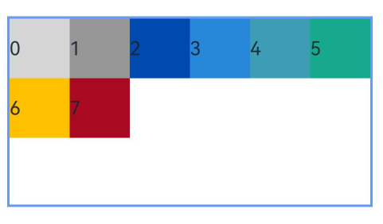
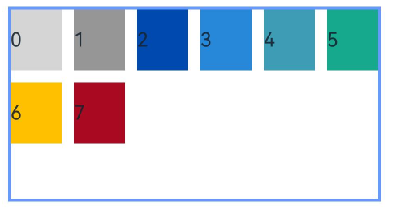
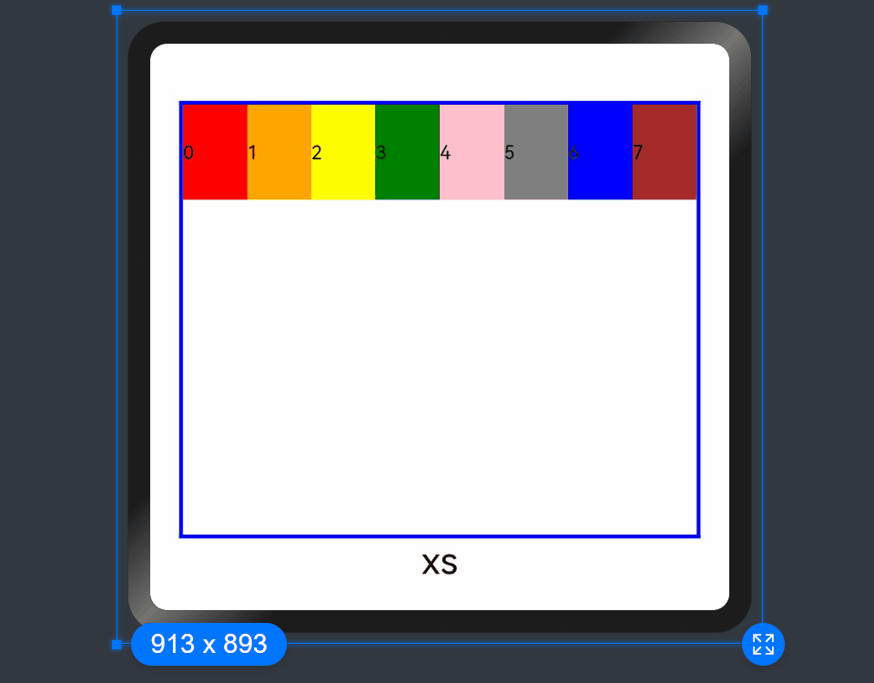

# 栅格布局 (GridRow/GridCol)
<!--Kit: ArkUI-->
<!--Subsystem: ArkUI-->
<!--Owner: @zju_ljz-->
<!--Designer: @lanshouren-->
<!--Tester: @liuli0427-->
<!--Adviser: @Brilliantry_Rui-->


## 概述

栅格布局是一种通用的辅助定位工具，对移动设备的界面设计有较好的借鉴作用。主要优势包括：

1. 提供可循的规律：栅格布局可以为布局提供规律性的结构，解决多尺寸多设备的动态布局问题。通过将页面划分为等宽的列数和行数，可以方便地对页面元素进行定位和排版。

2. 统一的定位标注：栅格布局可以为系统提供一种统一的定位标注，保证不同设备上各个模块的布局一致性。这可以减少设计和开发的复杂度，提高工作效率。

3. 灵活的间距调整方法：栅格布局可以提供一种灵活的间距调整方法，满足特殊场景布局调整的需求。通过调整列与列之间和行与行之间的间距，可以控制整个页面的排版效果。

4. 自动换行和自适应：栅格布局可以完成一对多布局的自动换行和自适应。当页面元素的数量超出了一行或一列的容量时，他们会自动换到下一行或下一列，并且在不同的设备上自适应排版，使得页面布局更加灵活和适应性强。

[GridRow](../reference/apis-arkui/arkui-ts/ts-container-gridrow.md)为栅格容器组件，需与栅格子组件[GridCol](../reference/apis-arkui/arkui-ts/ts-container-gridcol.md)在栅格布局场景中联合使用。


## 栅格容器GridRow


### 栅格容器断点

栅格容器以设备的水平宽度（[像素单位](../reference/apis-arkui/arkui-ts/ts-pixel-units.md)，单位vp）作为断点依据，定义设备的宽度类型，形成了一套断点规则。开发者可根据需求在不同的断点区间实现不同的页面布局效果。

栅格容器默认断点将设备宽度分为xs、sm、md、lg四类，尺寸范围如下：

| 断点名称 | 取值范围（vp）        | 设备描述      |
| ---- | --------------- | --------- |
| xs   | [0,&nbsp;320）   | 最小宽度类型设备。 |
| sm   | [320,&nbsp;600) | 小宽度类型设备。  |
| md   | [600,&nbsp;840) | 中等宽度类型设备。 |
| lg   | [840,&nbsp;+∞)  | 大宽度类型设备。  |

在GridRow栅格组件中，允许开发者使用[BreakPoints](../reference/apis-arkui/arkui-ts/ts-container-gridrow.md#breakpoints)自定义修改断点的取值范围，最多支持6个断点，除了默认的4个断点外，还可以启用xl和xxl断点，支持6种不同尺寸（xs，sm，md，lg，xl，xxl）设备的布局设置。

| 断点名称 | 设备描述      |
| ---- | --------- |
| xs   | 最小宽度类型设备。 |
| sm   | 小宽度类型设备。  |
| md   | 中等宽度类型设备。 |
| lg   | 大宽度类型设备。  |
| xl   | 特大宽度类型设备。 |
| xxl  | 超大宽度类型设备。 |

- 开发者可根据实际使用场景，通过一个单调递增数组设置断点位置。由于栅格容器默认支持4个断点，在不设置断点位置时，系统为默认断点配置的单调递增数组为["320vp", "600vp", "840vp"]。开发者使用[BreakPoints](../reference/apis-arkui/arkui-ts/ts-container-gridrow.md#breakpoints)最多可支持6个断点，因此此单调递增数组最大长度为5。

  假设传入的数组是[n0, n1, n2, n3, n4]，则各个断点取值如下：

  |断点|取值范围|
  |---|-----------|
  |xs |[0, n0)    |
  |sm |[n0, n1)   |
  |md |[n1, n2)   |
  |lg |[n2, n3)   |
  |xl |[n3, n4)   |
  |xxl|[n4, INF)  |

  ```ts
  breakpoints: {value: ['100vp', '200vp']} // 表示xs、sm、md共3个断点被使用，小于100vp为xs，100vp-200vp为sm，大于200vp为md。
  breakpoints: {value: ['320vp', '600vp']} // 表示xs、sm、md共3个断点被使用，小于320vp为xs，320vp-600vp为sm，大于600vp为md。
  breakpoints: {value: ['320vp', '600vp', '840vp', '1440vp']} // 表示xs、sm、md、lg、xl共5个断点被使用，小于320vp为xs，320vp-600vp为sm，  600vp-840vp为md，840vp-1440vp为lg，大于1440vp为xl。
  ```

- 栅格容器通过监听窗口或容器的尺寸变化进行断点，通过[reference](../reference/apis-arkui/arkui-ts/ts-container-gridrow.md#breakpoints)设置断点切换参考物。考虑到应用可能以非全屏窗口的形式显示，以应用窗口宽度为参照物更为通用。

  例如，通过断点设置将应用宽度分成6个区间，通过[columns](../reference/apis-arkui/arkui-ts/ts-container-gridrow.md#gridrowoptions对象说明)配置各断点下栅格容器的栅格列数。


  <!-- @[GridLayoutReference_start](https://gitcode.com/openharmony/applications_app_samples/blob/master/code/DocsSample/ArkUISample/MultipleLayoutProject/entry/src/main/ets/pages/gridlayout/GridLayoutReference.ets) -->
  
  ``` TypeScript
  @Entry
  @Component
  struct WindowRefGridLayout {
    @State currentBp: string = 'unknown'
    @State bgColors: ResourceColor[] =
      ['rgb(213,213,213)', 'rgb(150,150,150)', 'rgb(0,74,175)', 'rgb(39,135,217)', 'rgb(61,157,180)', 'rgb(23,169,141)',
        'rgb(255,192,0)', 'rgb(170,10,33)'];

    build() {
      Column({ space: 6 }) {
        Text(this.currentBp)

        GridRow({
          columns: {
            xs: 2, // 窗口宽度落入xs断点上，栅格容器分为2列。
            sm: 4, // 窗口宽度落入sm断点上，栅格容器分为4列。
            md: 8, // 窗口宽度落入md断点上，栅格容器分为8列。
            lg: 12, // 窗口宽度落入lg断点上，栅格容器分为12列。
            xl: 12, // 窗口宽度落入xl断点上，栅格容器分为12列。
            xxl: 12 // 窗口宽度落入xxl断点上，栅格容器分为12列。
          },
          breakpoints: {
            value: ['320vp', '600vp', '840vp', '1440vp', '1600vp'], // 表示在保留默认断点['320vp', '600vp', '840vp']的同时自定义增加'1440vp', '1600vp'的断点，实际开发中需要根据实际使用场景，合理设置断点值实现一次开发多端适配。
            reference: BreakpointsReference.WindowSize
          }
        }) {
          ForEach(this.bgColors, (color: ResourceColor, index?: number | undefined) => {
            GridCol({ span: 1 }) { // 所有子组件占一列。
              Row() {
                Text(`${index}`)
              }.width('100%').height('50vp')
            }.backgroundColor(color)
          })
        }
        .height(200)
        .border({ color: 'rgb(39,135,217)', width: 2 })
        .onBreakpointChange((breakPoint) => {
          this.currentBp = breakPoint
        })
      }
    }
  }
  ```

  


### 布局的总列数

GridRow中通过columns设置栅格布局的总列数。

- API version 20之前，columns默认值为12，即在未设置columns时，任何断点下，栅格布局均被分成12列。
- API version 20及以后，columns默认值为{ xs: 2, sm: 4, md: 8, lg: 12, xl: 12, xxl: 12 }。


  <!-- @[GridLayoutColumns_start](https://gitcode.com/openharmony/applications_app_samples/blob/master/code/DocsSample/ArkUISample/MultipleLayoutProject/entry/src/main/ets/pages/gridlayout/GridLayoutColumns.ets) -->
  
  ``` TypeScript
  // xxx.ets
  @Entry
  @Component
  struct GridColumnsWithDefaults {
    @State bgColors: ResourceColor[] =
      ['rgb(213,213,213)', 'rgb(150,150,150)', 'rgb(0,74,175)', 'rgb(39,135,217)', 'rgb(61,157,180)', 'rgb(23,169,141)',
        'rgb(255,192,0)', 'rgb(170,10,33)', 'rgb(213,213,213)', 'rgb(150,150,150)', 'rgb(0,74,175)', 'rgb(39,135,217)'];
  
    build() {
      GridRow() {
        ForEach(this.bgColors, (item: ResourceColor, index?: number | undefined) => {
          GridCol({ span: 1 }) {
            Row() {
              Text(`${index}`)
            }.width('100%').height('50')
          }.backgroundColor(item)
        })
      }
    }
  }
  ```

    API version 20之前布局显示：

    
    
    API version 20及以后布局显示（以sm设备为例，默认栅格列数为4）：
    
    


columns支持number和[GridRowColumnOption](../reference/apis-arkui/arkui-ts/ts-container-gridrow.md#gridrowcolumnoption)两种类型，可按两种方式设置栅格布局的总列数。
- 当columns类型为number时，栅格布局在任何尺寸设备下都被分为同一列数。下面分别设置栅格布局列数为4和8，子元素占一列，效果如下：

  <!-- @[GridLayoutColumnsToFour_start](https://gitcode.com/openharmony/applications_app_samples/blob/master/code/DocsSample/ArkUISample/MultipleLayoutProject/entry/src/main/ets/pages/gridlayout/GridLayoutColumnsToFour.ets) -->
  
  ``` TypeScript
  // xxx.ets
  @Entry
  @Component
  struct FixedFourColumnGrid {
    @State bgColors: ResourceColor[] =
      ['rgb(213,213,213)', 'rgb(150,150,150)', 'rgb(0,74,175)', 'rgb(39,135,217)', 'rgb(61,157,180)', 'rgb(23,169,141)',
        'rgb(255,192,0)', 'rgb(170,10,33)'];

    build() {
      Column({ space: 6 }) {
        Text('columns：4').alignSelf(ItemAlign.Start)

        Row() {
          GridRow({ columns: 4 }) {
            ForEach(this.bgColors, (item: ResourceColor, index?: number | undefined) => {
              GridCol({ span: 1 }) {
                Row() {
                  Text(`${index}`)
                }.width('100%').height('50')
              }.backgroundColor(item)
            })
          }
          .width('100%').height('100%')
        }
        .height(160)
        .border({ color: 'rgb(39,135,217)', width: 2 })
        .width('90%')
      }
    }
  }
  ```

  <!-- @[GridLayoutColumnsToEight_start](https://gitcode.com/openharmony/applications_app_samples/blob/master/code/DocsSample/ArkUISample/MultipleLayoutProject/entry/src/main/ets/pages/gridlayout/GridLayoutColumnsToEight.ets) -->
  
  ``` TypeScript
  // xxx.ets
  @Entry
  @Component
  struct FixedEightColumnGrid {
    @State bgColors: ResourceColor[] =
      ['rgb(213,213,213)', 'rgb(150,150,150)', 'rgb(0,74,175)', 'rgb(39,135,217)', 'rgb(61,157,180)', 'rgb(23,169,141)',
        'rgb(255,192,0)', 'rgb(170,10,33)'];

    build() {
      Column({ space: 6 }) {
        Text('columns：8').alignSelf(ItemAlign.Start)

        Row() {
          GridRow({ columns: 8 }) {
            ForEach(this.bgColors, (item: ResourceColor, index?: number | undefined) => {
              GridCol({ span: 1 }) {
                Row() {
                  Text(`${index}`)
                }.width('100%').height('50')
              }.backgroundColor(item)
            })
          }
          .width('100%').height('100%')
        }
        .height(160)
        .border({ color: 'rgb(39,135,217)', width: 2 })
        .width('90%')
      }
    }
  }
  ```

    

- 当columns类型为[GridRowColumnOption](../reference/apis-arkui/arkui-ts/ts-container-gridrow.md#gridrowcolumnoption)时，支持下面6种不同尺寸（xs，sm，md，lg，xl，xxl）设备的栅格列数设置，不同尺寸的设备支持配置不同的栅格列数。

  <!-- @[GridLayoutColumnOption_start](https://gitcode.com/openharmony/applications_app_samples/blob/master/code/DocsSample/ArkUISample/MultipleLayoutProject/entry/src/main/ets/pages/gridlayout/GridLayoutColumnOption.ets) -->
  
  ``` TypeScript
  @Entry
  @Component
  struct GridRowColumnOptionLayout {
    @State bgColors: ResourceColor[] =
      ['rgb(213,213,213)', 'rgb(150,150,150)', 'rgb(0,74,175)', 'rgb(39,135,217)', 'rgb(61,157,180)', 'rgb(23,169,141)',
        'rgb(255,192,0)', 'rgb(170,10,33)'];
  
    build() {
      GridRow({
        columns: { sm: 4, md: 8 },
        breakpoints: {
          value: ['320vp', '600vp', '840vp', '1440vp', '1600vp'] // 表示在保留默认断点['320vp', '600vp', '840vp']的同时自定义增加'1440vp', '1600vp'的断点，实际开发中需要根据实际使用场景，合理设置断点值实现一次开发多端适配。
        }
      }) {
        ForEach(this.bgColors, (item: ResourceColor, index?: number | undefined) => {
          GridCol({ span: 1 }) {
            Row() {
              Text(`${index}`)
            }.width('100%').height('50')
          }.backgroundColor(item)
        })
      }
      .height(200)
      .border({ color: 'rgb(39,135,217)', width: 2 })
    }
  }
  ```

    API version 20之前布局显示（xs设备未配置栅格列数，取默认列数12）：

    

    API version 20及以后布局显示（xs设备继承sm设备栅格列数）：

    

  仅部分设置sm、md的栅格列数，未配置的xs、lg、xl、xxl设备根据栅格列数补全（见[GridRowColumnOption](../reference/apis-arkui/arkui-ts/ts-container-gridrow.md#gridrowcolumnoption)）取默认值。


### 排列方向

栅格布局中，可以通过设置GridRow的[direction](../reference/apis-arkui/arkui-ts/ts-container-gridrow.md#gridrowoptions对象说明)属性来指定栅格子组件在栅格容器中的排列方向。该属性可以设置为[GridRowDirection](../reference/apis-arkui/arkui-ts/ts-container-gridrow.md#gridrowdirection枚举说明).Row（从左往右排列）或[GridRowDirection](../reference/apis-arkui/arkui-ts/ts-container-gridrow.md#gridrowdirection枚举说明).RowReverse（从右往左排列），以满足不同的布局需求。通过合理的direction属性设置，可以使得页面布局更加灵活和符合设计要求。

- 子组件默认从左往右排列。


    <!-- @[GridLayoutDirectionRow_start](https://gitcode.com/openharmony/applications_app_samples/blob/master/code/DocsSample/ArkUISample/MultipleLayoutProject/entry/src/main/ets/pages/gridlayout/GridLayoutDirectionRow.ets) -->
    
    ``` TypeScript
    GridRow({ direction: GridRowDirection.Row }) { /* ... */ }
    ```

    

- 子组件从右往左排列。


    <!-- @[GridLayoutDirectionRowReverse_start](https://gitcode.com/openharmony/applications_app_samples/blob/master/code/DocsSample/ArkUISample/MultipleLayoutProject/entry/src/main/ets/pages/gridlayout/GridLayoutDirectionRowReverse.ets) -->
    
    ``` TypeScript
    GridRow({ direction: GridRowDirection.RowReverse }) { /* ... */ }
    ```

    


### 子组件间距

GridRow中通过[gutter](../reference/apis-arkui/arkui-ts/ts-container-gridrow.md#gridrowoptions对象说明)属性设置子元素在水平和垂直方向的间距。

- 当gutter类型为number时，同时设置栅格子组件间水平和垂直方向边距且相等。下例中，设置子组件水平与垂直方向距离相邻元素的间距为10。


    <!-- @[GridLayoutGutterToNumber_start](https://gitcode.com/openharmony/applications_app_samples/blob/master/code/DocsSample/ArkUISample/MultipleLayoutProject/entry/src/main/ets/pages/gridlayout/GridLayoutGutterToNumber.ets) -->
    
    ``` TypeScript
    GridRow({ gutter: 10 }) { /* ... */ }
    ```

    

- 当gutter类型为[GutterOption](../reference/apis-arkui/arkui-ts/ts-container-gridrow.md#gutteroption)时，单独设置栅格子组件水平垂直边距，x属性为水平方向间距，y为垂直方向间距。


    <!-- @[GridLayoutGutterOption_start](https://gitcode.com/openharmony/applications_app_samples/blob/master/code/DocsSample/ArkUISample/MultipleLayoutProject/entry/src/main/ets/pages/gridlayout/GridLayoutGutterOption.ets) -->
    
    ``` TypeScript
    GridRow({ gutter: { x: 20, y: 50 } }) { /* ... */ }
    ```

    


## 子组件GridCol

[GridCol](../reference/apis-arkui/arkui-ts/ts-container-gridcol.md)组件作为[GridRow](../reference/apis-arkui/arkui-ts/ts-container-gridrow.md)组件的子组件，通过给GridCol传参或者设置属性两种方式，设置[span](../reference/apis-arkui/arkui-ts/ts-container-gridcol.md#gridcoloptions对象说明)（占用列数），[offset](../reference/apis-arkui/arkui-ts/ts-container-gridcol.md#gridcoloptions对象说明)（偏移列数），[order](../reference/apis-arkui/arkui-ts/ts-container-gridcol.md#gridcoloptions对象说明)（元素序号）的值。

- 设置span。


    <!-- @[GridColSpan_start](https://gitcode.com/openharmony/applications_app_samples/blob/master/code/DocsSample/ArkUISample/MultipleLayoutProject/entry/src/main/ets/pages/gridlayout/GridColSpan.ets) -->
    
    ``` TypeScript
    let gSpan:Record<string,number> = { 'xs': 1, 'sm': 2, 'md': 3, 'lg': 4 }
    ```

    <!-- @[GridColSpan1_start](https://gitcode.com/openharmony/applications_app_samples/blob/master/code/DocsSample/ArkUISample/MultipleLayoutProject/entry/src/main/ets/pages/gridlayout/GridColSpan.ets) -->
    
    ``` TypeScript
    GridCol({ span: 2 }){}
    GridCol({ span: { xs: 1, sm: 2, md: 3, lg: 4 } }){}
    GridCol(){}.span(2)
    GridCol(){}.span(gSpan)
    ```

- 设置offset。


    <!-- @[GridColOffset_start](https://gitcode.com/openharmony/applications_app_samples/blob/master/code/DocsSample/ArkUISample/MultipleLayoutProject/entry/src/main/ets/pages/gridlayout/GridColOffset.ets) -->
    
    ``` TypeScript
    let gOffset:Record<string,number> = { 'xs': 1, 'sm': 2, 'md': 3, 'lg': 4 }
    ```

    <!-- @[GridColOffset1_start](https://gitcode.com/openharmony/applications_app_samples/blob/master/code/DocsSample/ArkUISample/MultipleLayoutProject/entry/src/main/ets/pages/gridlayout/GridColOffset.ets) -->
    
    ``` TypeScript
    GridCol({ offset: 2, span: 1 }){}
    GridCol({ offset: { xs: 2, sm: 2, md: 2, lg: 2 }, span: 1 }){}
    GridCol({ span: 1 }){}.offset(gOffset)
    ```

- 设置order。


    <!-- @[GridColOrder_start](https://gitcode.com/openharmony/applications_app_samples/blob/master/code/DocsSample/ArkUISample/MultipleLayoutProject/entry/src/main/ets/pages/gridlayout/GridColOrder.ets) -->
    
    ``` TypeScript
    let gOrder:Record<string,number> = { 'xs': 1, 'sm': 2, 'md': 3, 'lg': 4 }
    ```

    <!-- @[GridColOrder1_start](https://gitcode.com/openharmony/applications_app_samples/blob/master/code/DocsSample/ArkUISample/MultipleLayoutProject/entry/src/main/ets/pages/gridlayout/GridColOrder.ets) -->
    
    ``` TypeScript
    GridCol({ order: 2, span: 1 }){}
    GridCol({ order: { xs: 1, sm: 2, md: 3, lg: 4 }, span: 1 }){}
    GridCol({ span: 1 }){}.order(2)
    GridCol({ span: 1 }){}.order(gOrder)
    ```


### span

子组件占栅格布局的列数，决定了子组件的宽度。默认值为1。

span支持number和[GridColColumnOption](../reference/apis-arkui/arkui-ts/ts-container-gridcol.md#gridcolcolumnoption)两种类型，可按两种方式设置栅格子组件占栅格容器的列数。
- 当span类型为number时，子组件在所有尺寸设备下占用的列数相同。


    <!-- @[GridColSpanToNumber_start](https://gitcode.com/openharmony/applications_app_samples/blob/master/code/DocsSample/ArkUISample/MultipleLayoutProject/entry/src/main/ets/pages/gridlayout/GridColSpanToNumber.ets) -->
    
    ``` TypeScript
    // xxx.ets
    @Entry
    @Component
    struct SpanNumberExample {
      @State bgColors: ResourceColor[] =
        ['rgb(213,213,213)', 'rgb(150,150,150)', 'rgb(0,74,175)', 'rgb(39,135,217)', 'rgb(61,157,180)', 'rgb(23,169,141)',
          'rgb(255,192,0)', 'rgb(170,10,33)'];

      build() {
        GridRow({ columns: 8 }) {
          ForEach(this.bgColors, (color: ResourceColor, index?: number | undefined) => {
            GridCol({ span: 2 }) {
              Row() {
                Text(`${index}`)
              }.width('100%').height('50vp')
            }
            .backgroundColor(color)
          })
        }
        .border({ color: 'rgb(39,135,217)', width: 2 })
        .height('150vp')
      }
    }
    ```

    

- 当span类型为GridColColumnOption时，支持6种不同尺寸（xs，sm，md，lg，xl，xxl）设备中子组件所占列数设置，不同尺寸的设备下子组件支持配置不同列数。若仅部分设置sm、md的列数，未配置的xs、lg、xl、xxl设备根据列数补全（见[GridColColumnOption](../reference/apis-arkui/arkui-ts/ts-container-gridcol.md#gridcolcolumnoption)）取默认值。


    <!-- @[GridColSpanToOption_start](https://gitcode.com/openharmony/applications_app_samples/blob/master/code/DocsSample/ArkUISample/MultipleLayoutProject/entry/src/main/ets/pages/gridlayout/GridColSpanToOption.ets) -->
    
    ``` TypeScript
    @Entry
    @Component
    struct SpanColumnOptionExample {
      @State currentBp: string = 'unknown'
      @State bgColors: ResourceColor[] =
        ['rgb(213,213,213)', 'rgb(150,150,150)', 'rgb(0,74,175)', 'rgb(39,135,217)', 'rgb(61,157,180)', 'rgb(23,169,141)',
          'rgb(255,192,0)', 'rgb(170,10,33)'];

      build() {
        Column({ space: 6 }) {
          GridRow({ columns: 8 }) {
            ForEach(this.bgColors, (color: ResourceColor, index?: number | undefined) => {
              GridCol({
                span: {
                  xs: 1,
                  sm: 2,
                  md: 3,
                  lg: 4
                }
              }) {
                Row() {
                  Text(`${index}`)
                }.width('100%').height('50vp')
              }
              .backgroundColor(color)
            })
          }
          .border({ color: 'rgb(39,135,217)', width: 2 })
          .height('150vp')
          .onBreakpointChange((breakPoint) => {
            this.currentBp = breakPoint
          })

          Text(this.currentBp)
        }
      }
    }
    ```

    


### offset

栅格子组件相对于前一个子组件的偏移列数，默认为0。

- 当offset类型为number时，子组件偏移相同列数。


    <!-- @[GridColOffsetToNumber_start](https://gitcode.com/openharmony/applications_app_samples/blob/master/code/DocsSample/ArkUISample/MultipleLayoutProject/entry/src/main/ets/pages/gridlayout/GridColOffsetToNumber.ets) -->
    
    ``` TypeScript
    @Entry
    @Component
    struct OffsetNumberExample {
      @State bgColors: ResourceColor[] =
        ['rgb(213,213,213)', 'rgb(150,150,150)', 'rgb(0,74,175)', 'rgb(39,135,217)', 'rgb(61,157,180)', 'rgb(23,169,141)',
          'rgb(255,192,0)', 'rgb(170,10,33)'];

      build() {
        Column() {
          GridRow({ columns: 12 }) {
            ForEach(this.bgColors, (color: ResourceColor, index?: number | undefined) => {
              GridCol({ offset: 2, span: 1 }) {
                Row() {
                  Text('' + index)
                }.width('100%').height('50vp')
              }
              .backgroundColor(color)
            })
          }

          Blank().width('100%').height(150)
        }.border({ color: 'rgb(39,135,217)', width: 2 })
      }
    }
    ```

    

  在lg及以上尺寸的设备上，栅格分成12列，每一个子组件占1列，偏移2列，每个子组件及间距共占3列，1行放4个子组件。

- 当offset类型为GridColColumnOption时，支持6种不同尺寸（xs，sm，md，lg，xl，xxl）设备中子组件所占列数设置，各个尺寸下数值可不同。


    <!-- @[GridColOffsetToOption_start](https://gitcode.com/openharmony/applications_app_samples/blob/master/code/DocsSample/ArkUISample/MultipleLayoutProject/entry/src/main/ets/pages/gridlayout/GridColOffsetToOption.ets) -->
    
    ``` TypeScript
    @Entry
    @Component
    struct OffsetColumnOptionExample {
      @State currentBp: string = 'unknown'
      @State bgColors: ResourceColor[] =
        ['rgb(213,213,213)', 'rgb(150,150,150)', 'rgb(0,74,175)', 'rgb(39,135,217)', 'rgb(61,157,180)', 'rgb(23,169,141)',
          'rgb(255,192,0)', 'rgb(170,10,33)'];

      build() {
        Column({ space: 6 }) {
          GridRow({ columns: 12 }) {
            ForEach(this.bgColors, (color: ResourceColor, index?: number | undefined) => {
              GridCol({
                offset: {
                  xs: 1,
                  sm: 2,
                  md: 3,
                  lg: 4
                },
                span: 1
              }) {
                Row() {
                  Text('' + index)
                }.width('100%').height('50vp')
              }
              .backgroundColor(color)
            })
          }
          .height(200)
          .border({ color: 'rgb(39,135,217)', width: 2 })
          .onBreakpointChange((breakPoint) => {
            this.currentBp = breakPoint
          })

          Text(this.currentBp)
        }
      }
    }
    ```

    


### order

栅格子组件的序号，决定子组件排列次序。当子组件不设置order或者设置相同的order，子组件按照代码顺序展示。当子组件设置不同的order时，order较小的组件在前，较大的在后。

当子组件部分设置order，部分不设置order时，未设置order的子组件依次排序靠前，设置了order的子组件按照数值从小到大排列。

- 当order类型为number时，子组件在任何尺寸下排序次序一致。


    <!-- @[GridColOrderToNumber_start](https://gitcode.com/openharmony/applications_app_samples/blob/master/code/DocsSample/ArkUISample/MultipleLayoutProject/entry/src/main/ets/pages/gridlayout/GridColOrderToNumber.ets) -->
    
    ``` TypeScript
    GridRow({ columns: 12 }) {
      GridCol({ order: 4, span: 1 }) {
        Row() {
          Text('1')
        }.width('100%').height('50vp')
      }.backgroundColor('rgb(213,213,213)')

      GridCol({ order: 3, span: 1 }) {
        Row() {
          Text('2')
        }.width('100%').height('50vp')
      }.backgroundColor('rgb(150,150,150)')

      GridCol({ order: 2, span: 1 }) {
        Row() {
          Text('3')
        }.width('100%').height('50vp')
      }.backgroundColor('rgb(0,74,175)')

      GridCol({ order: 1, span: 1 }) {
        Row() {
          Text('4')
        }.width('100%').height('50vp')
      }.backgroundColor('rgb(39,135,217)')
    }.border({ width: 1, color: 'rgb(39,135,217)' }).height('200vp')
    ```

    

- 当order类型为GridColColumnOption时，支持6种不同尺寸（xs，sm，md，lg，xl，xxl）设备中子组件排序次序设置。在xs设备中，子组件排列顺序为1234；sm为2341，md为3412，lg为2431。


    <!-- @[GridColOrderToOption_start](https://gitcode.com/openharmony/applications_app_samples/blob/master/code/DocsSample/ArkUISample/MultipleLayoutProject/entry/src/main/ets/pages/gridlayout/GridColOrderToOption.ets) -->
    
    ``` TypeScript
    @Entry
    @Component
    struct OrderColumnOptionExample {
      @State currentBp: string = 'unknown'
    
      build() {
        Column({ space: 5 }) {
          GridRow({ columns: 12 }) {
            GridCol({
              order: { xs: 1, sm: 5, md: 3, lg: 7 }, span: 1 }) {
              Row() {
                Text('1')
              }.width('100%').height('50vp')
            }.backgroundColor('rgb(213,213,213)')
    
            GridCol({
              order: { xs: 2, sm: 2, md: 6, lg: 1 }, span: 1 }) {
              Row() {
                Text('2')
              }.width('100%').height('50vp')
            }.backgroundColor('rgb(150,150,150)')
    
            GridCol({ order: { xs: 3, sm: 3, md: 1, lg: 6 }, span: 1 }) {
              Row() {
                Text('3')
              }.width('100%').height('50vp')
            }.backgroundColor('rgb(0,74,175)')
    
            GridCol({ order: { xs: 4, sm: 4, md: 2, lg: 5 }, span: 1 }) {
              Row() {
                Text('4')
              }.width('100%').height('50vp')
            }.backgroundColor('rgb(39,135,217)')
          }.border({ width: 1, color: 'rgb(39,135,217)' }).height('200vp').onBreakpointChange((breakpoint) => {
            this.currentBp = breakpoint
          })
    
          Text(this.currentBp)
        }
      }
    }
    ```

    


## 栅格组件的嵌套使用

栅格组件也可以嵌套使用，完成一些复杂的布局。

以下示例中，栅格把整个空间分为12份。第一层GridRow嵌套GridCol，分为中间大区域以及“footer”区域。第二层GridRow嵌套GridCol，分为“left”和“right”区域。子组件空间按照上一层父组件的空间划分，粉色的区域是屏幕空间的12列，绿色和蓝色的区域是父组件GridCol的12列，依次进行空间的划分。

<!-- @[GridRowExample_start](https://gitcode.com/openharmony/applications_app_samples/blob/master/code/DocsSample/ArkUISample/MultipleLayoutProject/entry/src/main/ets/pages/gridlayout/GridRowExample.ets) -->

``` TypeScript
@Entry
@Component
struct GridRowExample {
  build() {
    GridRow({ columns: 12 }) {
      GridCol({ span: 12 }) {
        GridRow({ columns: 12 }) {
          GridCol({ span: 2 }) {
            Row() {
              Text('left').fontSize(24)
            }
            .justifyContent(FlexAlign.Center)
            .height('90%')
          }.backgroundColor('#ff41dbaa')

          GridCol({ span: 10 }) {
            Row() {
              Text('right').fontSize(24)
            }
            .justifyContent(FlexAlign.Center)
            .height('90%')
          }.backgroundColor('#ff4168db')
        }
        .backgroundColor('#19000000')
      }

      GridCol({ span: 12 }) {
        Row() {
          Text('footer').width('100%').textAlign(TextAlign.Center)
        }.width('100%').height('10%').backgroundColor(Color.Pink)
      }
    }.width('100%').height(300)
  }
}
```


综上所述，栅格组件提供了丰富的自定义能力，功能非常灵活和强大。只需要明确栅格在不同断点下的[columns](../reference/apis-arkui/arkui-ts/ts-container-gridrow.md#gridrowoptions对象说明)、[margin](../reference/apis-arkui/arkui-ts/ts-universal-attributes-size.md#margin)、[gutter](../reference/apis-arkui/arkui-ts/ts-container-gridrow.md#gridrowoptions对象说明)及[span](../reference/apis-arkui/arkui-ts/ts-container-gridcol.md#gridcoloptions对象说明)等参数，即可确定最终布局，无需关心具体的设备类型及设备状态（如横竖屏）等。
