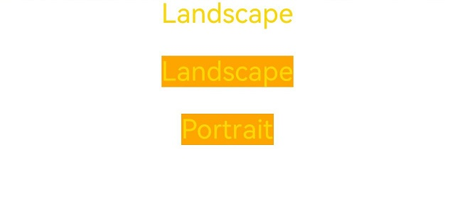

# 媒体查询 (@ohos.mediaquery)


## 概述

[媒体查询](../reference/apis-arkui/js-apis-mediaquery.md)作为响应式设计的核心，在移动设备上应用十分广泛。媒体查询可根据不同设备类型或同设备不同状态修改应用的样式。媒体查询常用于下面两种场景：

1. 针对设备和应用的属性信息（比如显示区域、深浅色、分辨率），设计出相匹配的布局。

2. 当屏幕发生动态改变时（比如分屏、横竖屏切换），同步更新应用的页面布局。


## 引入与使用流程

媒体查询通过mediaquery模块接口，设置查询条件并绑定回调函数，任一[媒体特征](#媒体特征media-feature)改变时，均会触发回调函数，返回匹配结果，根据返回值更改页面布局或者实现业务逻辑，实现页面的响应式设计。具体步骤如下：

首先导入媒体查询模块。


```ts
import { mediaquery } from '@kit.ArkUI';
```

通过matchMediaSync接口设置媒体查询条件，保存返回的条件监听句柄listener。例如监听横屏事件：


```ts
let listener: mediaquery.MediaQueryListener = this.getUIContext().getMediaQuery().matchMediaSync('(orientation: landscape)');
```

给条件监听句柄listener绑定回调函数onPortrait，当listener检测设备状态变化时执行回调函数。在回调函数内，根据不同设备状态更改页面布局或者实现业务逻辑。


```ts
onPortrait(mediaQueryResult: mediaquery.MediaQueryResult) {
  if (mediaQueryResult.matches as boolean) {
    // do something here
  } else {
    // do something here
  }
}

listener.on('change', onPortrait);
```


## 媒体查询条件

媒体查询条件由媒体类型、逻辑操作符、媒体特征组成，其中媒体类型可省略，逻辑操作符用于连接不同媒体类型与媒体特征，其中，媒体特征要使用“()”包裹且可以有多个。


### 语法规则

语法规则包括[媒体类型（media-type）](#媒体类型media-type)、[媒体逻辑操作（media-logic-operations）](#媒体逻辑操作media-logic-operations)和[媒体特征（media-feature）](#媒体特征media-feature)。


```ts
[media-type] [media-logic-operations] [(media-feature)]
```

例如：

- screen and (round-screen: true) ：表示当设备屏幕是圆形时条件成立。

- (max-height: 800px) ：表示当高度小于等于800px时条件成立。

- (height &lt;= 800px) ：表示当高度小于等于800px时条件成立。

- screen and (device-type: tv) or (resolution &lt; 2) ：表示包含多个媒体特征的多条件复杂语句查询，当设备类型为tv或设备分辨率小于2时条件成立。

- (dark-mode: true) ：表示当系统为深色模式时成立。


### 媒体类型（media-type）
查询条件未写媒体类型时，默认为screen。媒体类型必须写在查询条件开头。

| **类型** | **说明**         |
| ------ | -------------- |
| screen | 按屏幕相关参数进行媒体查询。 |


### 媒体逻辑操作（media-logic-operations）

媒体逻辑操作符：and、or、not、only用于构成复杂媒体查询，也可以通过comma（, ）将其组合起来，详细解释说明如下表。

  **表1** 媒体逻辑操作符

| 类型             | 说明                                                         |
| ---------------- | ------------------------------------------------------------ |
| and              | 将多个媒体特征（Media&nbsp;Feature）以“与”的方式连接成一个媒体查询，只有当所有媒体特征都为true，查询条件成立。另外，它还可以将媒体类型和媒体功能结合起来。例如：screen&nbsp;and&nbsp;(device-type:&nbsp;wearable)&nbsp;and&nbsp;(max-height:&nbsp;600px)&nbsp;表示当设备类型是智能穿戴且应用的最大高度小于等于600个像素单位时成立。 |
| or               | 将多个媒体特征以“或”的方式连接成一个媒体查询，如果存在结果为true的媒体特征，则查询条件成立。例如：screen&nbsp;and&nbsp;(max-height:&nbsp;1000px)&nbsp;or&nbsp;(round-screen:&nbsp;true)&nbsp;表示当应用高度小于等于1000个像素单位或者设备屏幕是圆形时，条件成立。 |
| not              | not操作符必须搭配screen使用，取反媒体查询结果，媒体查询结果不成立时返回true，否则返回false。例如：not&nbsp;screen&nbsp;and&nbsp;(min-height:&nbsp;50px)&nbsp;and&nbsp;(max-height:&nbsp;600px)&nbsp;表示当应用高度小于50个像素单位或者大于600个像素单位时成立。 |
| only             | only操作符必须搭配screen使用, 当前效果与单独使用screen相同。例如：only&nbsp;screen&nbsp;and&nbsp;(height&nbsp;&lt;=&nbsp;50)&nbsp;。|
| comma（,&nbsp;） | 将多个媒体特征以“或”的方式连接成一个媒体查询，如果存在结果为true的媒体特征，则查询条件成立。其效果等同于or运算符。例如：screen&nbsp;and&nbsp;(min-height:&nbsp;1000px),&nbsp;(round-screen:&nbsp;true)&nbsp;表示当应用高度大于等于1000个像素单位或者设备屏幕是圆形时，条件成立。 |

媒体范围操作符包括&lt;=，&gt;=，&lt;，&gt;，详细解释说明如下表。

  **表2** 媒体逻辑范围操作符

| 类型    | 说明                                       |
| ----- | ---------------------------------------- |
| &lt;= | 小于等于，例如：screen&nbsp;and&nbsp;(height&nbsp;&lt;=&nbsp;50)。 |
| &gt;= | 大于等于，例如：screen&nbsp;and&nbsp;(height&nbsp;&gt;=&nbsp;600)。 |
| &lt;  | 小于，例如：screen&nbsp;and&nbsp;(height&nbsp;&lt;&nbsp;50)。 |
| &gt;  | 大于，例如：screen&nbsp;and&nbsp;(height&nbsp;&gt;&nbsp;600)。 |


### 媒体特征（media-feature）

媒体特征包括应用显示区域的宽高、设备分辨率以及设备的宽高等属性，详细说明如下表。

  **表3** 媒体特征说明表

比较height、width等宽高尺寸时，支持vp和px单位，无单位默认为px。

| 类型                | 说明                                       |
| ----------------- | ---------------------------------------- |
| height            | 应用页面可绘制区域的高度。                            |
| min-height        | 应用页面可绘制区域的最小高度。                          |
| max-height        | 应用页面可绘制区域的最大高度。                          |
| width             | 应用页面可绘制区域的宽度。                            |
| min-width         | 应用页面可绘制区域的最小宽度。                          |
| max-width         | 应用页面可绘制区域的最大宽度。                          |
| resolution        | 设备的分辨率，支持dpi，dppx和dpcm单位。其中：<br/>-&nbsp;dpi表示每英寸中物理像素个数，1dpi&nbsp;≈&nbsp;0.39dpcm；<br/>-&nbsp;dpcm表示每厘米上的物理像素个数，1dpcm&nbsp;≈&nbsp;2.54dpi；<br/>-&nbsp;dppx表示每个px中的物理像素数（此单位按96px&nbsp;=&nbsp;1英寸为基准，与页面中的px单位计算方式不同），1dppx&nbsp;=&nbsp;96dpi。 |
| min-resolution    | 设备的最小分辨率。                                |
| max-resolution    | 设备的最大分辨率。                                |
| orientation       | 屏幕的方向。<br/>可选值：<br/>-&nbsp;&nbsp;orientation:&nbsp;&nbsp;portrait（设备竖屏）；<br/>-&nbsp;&nbsp;orientation:&nbsp;&nbsp;landscape（设备横屏）。 |
| device-height     | 设备的高度。                                   |
| min-device-height | 设备的最小高度。                                 |
| max-device-height | 设备的最大高度。                                 |
| device-width      | 设备的宽度。当前仅在应用初始化时保存一次，不会随设备宽度变化实时更新，例如折叠屏的折叠展开场景。                                   |
| device-type       | 设备的类型。<br/>可选值：default、phone、tablet、tv、car、wearable、2in1。          |
| min-device-width  | 设备的最小宽度。                                 |
| max-device-width  | 设备的最大宽度。                                 |
| round-screen      | 屏幕类型，圆形屏幕为true，非圆形屏幕为false。              |
| dark-mode         | 系统当前的深浅模式。可选值：true、false。 <br/> 深色模式为true，浅色模式为false。          |

>**说明：** 
>
>目前在卡片中使用媒体查询，只支持height、width。

## 场景示例

下例中使用媒体查询，实现屏幕横竖屏切换时，给页面文本应用添加不同的内容和样式。

Stage模型下的示例：


```ts
<!--deprecated_code_no_check-->
import { mediaquery, window } from '@kit.ArkUI';
import { common } from '@kit.AbilityKit';

@Entry
@Component
struct MediaQueryExample {
  @State color: string = '#DB7093';
  @State text: string = 'Portrait';
  // 当设备横屏时条件成立
  listener:mediaquery.MediaQueryListener = this.getUIContext().getMediaQuery().matchMediaSync('(orientation: landscape)');

  // 当满足媒体查询条件时，触发回调
  onPortrait(mediaQueryResult:mediaquery.MediaQueryResult) {
    if (mediaQueryResult.matches as boolean) { // 若设备为横屏状态，更改相应的页面布局
      this.color = '#FFD700';
      this.text = 'Landscape';
    } else {
      this.color = '#DB7093';
      this.text = 'Portrait';
    }
  }

  aboutToAppear() {
    // 绑定当前应用实例
    // 绑定回调函数
    this.listener.on('change', (mediaQueryResult: mediaquery.MediaQueryResult) => {
      this.onPortrait(mediaQueryResult)
    });
  }

  aboutToDisappear() {
    // 解绑listener中注册的回调函数
    this.listener.off('change');
  }

  // 改变设备横竖屏状态函数
  private changeOrientation(isLandscape: boolean) {
    // 获取UIAbility实例的上下文信息
    let context:common.UIAbilityContext = this.getUIContext().getHostContext() as common.UIAbilityContext;
    // 调用该接口手动改变设备横竖屏状态
    window.getLastWindow(context).then((lastWindow) => {
      lastWindow.setPreferredOrientation(isLandscape ? window.Orientation.LANDSCAPE : window.Orientation.PORTRAIT)
    });
  }

  build() {
    Column({ space: 50 }) {
      Text(this.text).fontSize(50).fontColor(this.color)
      Text('Landscape').fontSize(50).fontColor(this.color).backgroundColor(Color.Orange)
        .onClick(() => {
          this.changeOrientation(true);
        })
      Text('Portrait').fontSize(50).fontColor(this.color).backgroundColor(Color.Orange)
        .onClick(() => {
          this.changeOrientation(false);
        })
    }
    .width('100%').height('100%')
  }
}
```

FA模型下的示例：


```ts
<!--deprecated_code_no_check-->
import { mediaquery } from '@kit.ArkUI';
import { featureAbility } from '@kit.AbilityKit';

@Entry
@Component
struct MediaQueryExample {
  @State color: string = '#DB7093';
  @State text: string = 'Portrait';
  listener:mediaquery.MediaQueryListener = mediaquery.matchMediaSync('(orientation: landscape)'); // 当设备横屏时条件成立

  onPortrait(mediaQueryResult:mediaquery.MediaQueryResult) { // 当满足媒体查询条件时，触发回调
    if (mediaQueryResult.matches as boolean) { // 若设备为横屏状态，更改相应的页面布局
      this.color = '#FFD700';
      this.text = 'Landscape';
    } else {
      this.color = '#DB7093';
      this.text = 'Portrait';
    }
  }

  aboutToAppear() {
    // 绑定当前应用实例
    this.listener.on('change', (mediaQueryResult:mediaquery.MediaQueryResult) => { this.onPortrait(mediaQueryResult) }); //绑定回调函数
  }

  aboutToDisappear() {
    // 解绑listener中注册的回调函数
    this.listener.off('change');
  }

  build() {
    Column({ space: 50 }) {
      Text(this.text).fontSize(50).fontColor(this.color)
      Text('Landscape').fontSize(50).fontColor(this.color).backgroundColor(Color.Orange)
        .onClick(() => {
          let context = featureAbility.getContext();
          context.setDisplayOrientation(0); //调用该接口手动改变设备横竖屏状态
        })
      Text('Portrait').fontSize(50).fontColor(this.color).backgroundColor(Color.Orange)
        .onClick(() => {
          let context = featureAbility.getContext();
          context.setDisplayOrientation(1); //调用该接口手动改变设备横竖屏状态
        })
    }
    .width('100%').height('100%')
  }
}
```

  **图1** 竖屏  


  **图2** 横屏  



## 相关实例

针对媒体查询开发，有以下相关实例可供参考：

- [横竖屏切换（ArkTS）（API9）](https://gitee.com/openharmony/applications_app_samples/tree/master/code/UI/ArkTsComponentCollection/MediaQuery)
