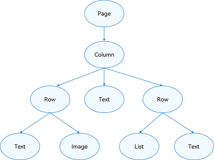
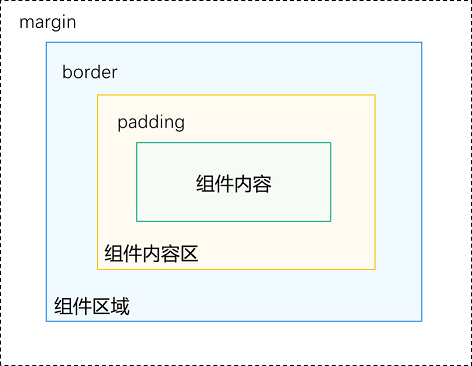

# 布局概述

组件按照布局的要求依次排列，构成应用的页面。在声明式UI中，所有的页面都是由自定义组件构成，开发者可以根据自己的需求，选择合适的布局进行页面开发。

布局指用特定的组件或者属性来管理用户页面所放置UI组件的大小和位置。在实际的开发过程中，需要遵守以下流程保证整体的布局效果：

- 确定页面的布局结构。

- 分析页面中的元素构成。

- 选用适合的布局容器组件或属性控制页面中各个元素的位置和大小。

## 布局结构

布局通常为分层结构，一个常见的页面结构如下所示：

  **图1** 常见页面结构图  

为实现上述效果，开发者需要在页面中声明对应的元素。其中，Page表示页面的根节点，Column/Row等元素为系统组件。针对不同的页面结构，ArkUI提供了不同的布局组件来帮助开发者实现对应布局的效果，例如Row用于实现线性布局。

## 布局元素的组成

布局相关的容器组件可形成对应的布局效果。

  **图2** 布局元素组成图  

- 组件区域（蓝区方块）：组件区域表示组件的大小，[width](../reference/apis-arkui/arkui-ts/ts-universal-attributes-size.md#width)、[height](../reference/apis-arkui/arkui-ts/ts-universal-attributes-size.md#height)属性用于设置组件区域的大小。

- 组件内容区（黄色方块）：组件内容区大小为组件区域大小减去组件的[border](../reference/apis-arkui/arkui-ts/ts-universal-attributes-border.md#border)值，组件内容区大小会作为组件内容（或者子组件）进行大小测算时的布局测算限制。

- 组件内容（绿色方块）：组件内容本身占用的大小，比如文本内容占用的大小。组件内容和组件内容区不一定匹配，比如设置了固定的width和height，此时组件内容的大小就是设置的width和height减去padding和border值，但文本内容则是通过文本布局引擎测算后得到的大小，可能出现文本真实大小小于设置的组件内容区大小。当组件内容和组件内容区大小不一致时，[align](../reference/apis-arkui/arkui-ts/ts-universal-attributes-location.md#align)属性生效，定义组件内容在组件内容区的对齐方式，如居中对齐。

- 组件布局边界（虚线部分）：组件通过[margin](../reference/apis-arkui/arkui-ts/ts-universal-attributes-size.md#margin)属性设置外边距时，组件布局边界就是组件区域加上margin的大小。

## 如何选择布局

声明式UI提供了以下10种常见布局，开发者可根据实际应用场景选择合适的布局进行页面开发。

| 布局                                                         | 应用场景                                                     |
| ------------------------------------------------------------ | ------------------------------------------------------------ |
| [线性布局](arkts-layout-development-linear.md)（Row、Column） | 如果布局内子元素超过1个时，且能够以某种方式线性排列时优先考虑此布局。 |
| [层叠布局](arkts-layout-development-stack-layout.md)（Stack） | 组件需要有堆叠效果时优先考虑此布局。层叠布局的堆叠效果不会占用或影响其他同容器内子组件的布局空间。例如[Panel](../reference/apis-arkui/arkui-ts/ts-container-panel.md)作为子组件弹出时将其他组件覆盖更为合理，则优先考虑在外层使用堆叠布局。 |
| [弹性布局](arkts-layout-development-flex-layout.md)（Flex）  | 弹性布局是与线性布局类似的布局方式。区别在于弹性布局默认能够使子组件压缩或拉伸。在子组件需要计算拉伸或压缩比例时优先使用此布局，可使得多个容器内子组件能有更好的视觉上的填充效果。 |
| [相对布局](arkts-layout-development-relative-layout.md)（RelativeContainer） | 相对布局是在二维空间中的布局方式，不需要遵循线性布局的规则，布局方式更为自由。通过在子组件上设置锚点规则（AlignRules）使子组件能够将自己在横轴、纵轴中的位置与容器或容器内其他子组件的位置对齐。设置的锚点规则可以天然支持子元素压缩、拉伸、堆叠或形成多行效果。在页面元素分布复杂或通过线性布局会使容器嵌套层数过深时推荐使用。 |
| [栅格布局](arkts-layout-development-grid-layout.md)（GridRow、GridCol） | 栅格是多设备场景下通用的辅助定位工具，可将空间分割为有规律的栅格。栅格不同于网格布局固定的空间划分，可以实现不同设备下不同的布局，空间划分更随心所欲，从而显著降低适配不同屏幕尺寸的设计及开发成本，使得整体设计和开发流程更有秩序和节奏感，同时也保证多设备上应用显示的协调性和一致性，提升用户体验。推荐内容相同但布局不同时使用。 |
| [媒体查询](arkts-layout-development-media-query.md)（\@ohos.mediaquery） | 媒体查询可根据不同设备类型或同设备不同状态修改应用的样式。例如根据设备和应用的不同属性信息设计不同的布局，以及屏幕发生动态改变时更新应用的页面布局。 |
| [列表](arkts-layout-development-create-list.md)（List）      | 使用列表可以高效地显示结构化、可滚动的信息。在ArkUI中，列表具有垂直和水平布局能力和自适应交叉轴方向上排列个数的布局能力，超出屏幕时可以滚动。列表适合用于呈现同类数据类型或数据类型集，例如图片和文本。 |
| [弧形列表](arkts-layout-development-create-arclist.md)（ArcList）      | 使用弧形列表能够高效地展示结构化、可滚动的信息。在ArkUI中，弧形列表仅支持垂直布局，当内容超出屏幕范围时可实现滚动。弧形列表适用于展示同类数据类型或数据集合，例如图片和文本。 |
| [网格](arkts-layout-development-create-grid.md)（Grid）      | 网格布局具有较强的页面均分能力、子元素占比控制能力。网格布局可以控制元素所占的网格数量、设置子元素横跨几行或者几列，当网格容器尺寸发生变化时，所有子元素以及间距等比例调整。推荐在需要按照固定比例或者均匀分配空间的布局场景下使用，例如计算器、相册、日历等。 |
| [瀑布流](arkts-layout-development-create-waterflow.md)（WaterFlow）      | 瀑布流布局是多列等宽不等高的布局方式，视觉呈现如瀑布般错落有致。推荐在需要错落排列到场景使用，如图片/视频展示，商品推荐等。 |
| [轮播](arkts-layout-development-create-looping.md)（Swiper） | 轮播组件通常用于实现广告轮播、图片预览等。       |
| [弧形轮播](arkts-layout-development-arcswiper.md)（ArcSwiper） | 弧形轮播组件通常用于实现圆形屏幕设备上的广告轮播、图片预览等。       |
| [选项卡](arkts-navigation-tabs.md)（Tabs） | 选项卡可以在一个页面内快速实现视图内容的切换，一方面提升查找信息的效率，另一方面精简用户单次获取到的信息量。       |

## 布局位置

position、offset等属性影响了布局容器相对于自身或其他组件的位置。

| 定位能力 | 使用场景                                                     | 实现方式                                                     |
| -------- | ------------------------------------------------------------ | ------------------------------------------------------------ |
| 绝对定位 | 对于不同尺寸的设备，使用绝对定位的适应性会比较差，在屏幕的适配上有缺陷。 | 使用[position](../reference/apis-arkui/arkui-ts/ts-universal-attributes-location.md#position)实现绝对定位，设置元素左上角相对于父容器左上角偏移位置。在布局容器中，设置该属性不影响父容器布局，仅在绘制时进行位置调整。 |
| 相对定位 | 相对定位不脱离文档流，即原位置依然保留，不影响元素本身的特性，仅相对于原位置进行偏移。 | 使用[offset](../reference/apis-arkui/arkui-ts/ts-universal-attributes-location.md#offset)可以实现相对定位，设置元素相对于自身的偏移量。设置该属性，不影响父容器布局，仅在绘制时进行位置调整。 |

## 对子元素的约束

* 拉伸：容器组件尺寸发生变化时，增加或减小的空间全部分配给容器组件内指定区域。

  [flexGrow](../reference/apis-arkui/arkui-ts/ts-universal-attributes-flex-layout.md#flexgrow)和[flexShrink](../reference/apis-arkui/arkui-ts/ts-universal-attributes-flex-layout.md#flexshrink)属性：
  1. flexGrow基于父容器的剩余空间分配来控制组件拉伸。
  2. flexShrink设置父容器的压缩尺寸来控制组件压缩。

* 缩放：子组件的宽高按照预设的比例，随容器组件发生变化，且变化过程中子组件的宽高比不变。

  [aspectRatio](../reference/apis-arkui/arkui-ts/ts-universal-attributes-layout-constraints.md#aspectratio)属性指定当前组件的宽高比来控制缩放，公式为：aspectRatio=width/height。

* 占比：子组件的宽高按照预设的比例，随祖先容器组件发生变化。

  基于通用属性的两种实现方式：
  1. 子组件的宽高设置为百分比。

      | 父组件与祖先组件宽高设置情况 | 子组件百分比 |
      |---|---|
      | 父组件设置宽或高 & 祖先组件未指定父组件宽或高 | 参考父组件的宽高 |
      | 父组件设置宽或高 & 祖先组件指定父组件宽或高 | 参考祖先组件指定的父组件宽高 |
      | 父组件未设置宽或高 & 祖先组件指定父组件宽或高 | 参考祖先组件指定的父组件宽高 |
      | 父组件未设置宽或高 & 祖先组件未指定父组件宽或高 | 参考父组件的百分比参照。由于父组件未指定宽高，该百分比参照传递自祖先组件 |
  2. [layoutWeight](../reference/apis-arkui/arkui-ts/ts-universal-attributes-size.md#layoutweight)属性，使得子元素自适应占满剩余空间。

* 隐藏：隐藏能力是指容器组件内的子组件，按照其预设的显示优先级，随容器组件尺寸变化显示或隐藏，其中相同显示优先级的子组件同时显示或隐藏。

  通过[displayPriority](../reference/apis-arkui/arkui-ts/ts-universal-attributes-layout-constraints.md#displaypriority)属性来控制组件的显示和隐藏。

## 相关实例

针对布局开发，有以下相关实例可供参考：

- [页面布局和连接（ArkTS）（API9）](https://gitee.com/openharmony/applications_app_samples/tree/master/code/UI/ArkTsComponentCollection/DefiningPageLayoutAndConnection)

- [ArkUI常用布局容器对齐方式（ArkTS）（API9）](https://gitee.com/openharmony/codelabs/tree/master/ETSUI/OHLayoutAlign)

- [常用组件与布局（ArkTS）（API9）](https://gitee.com/openharmony/codelabs/tree/master/ETSUI/ArkTSComponents)