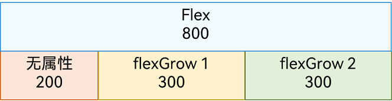
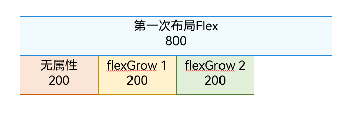
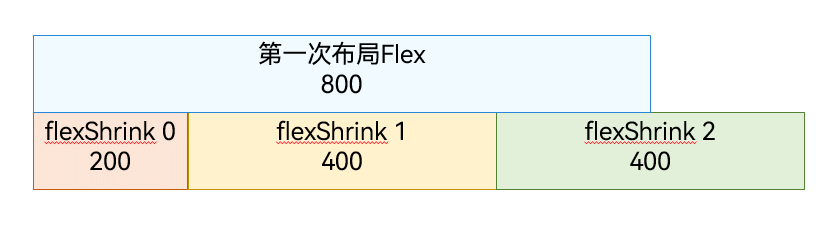
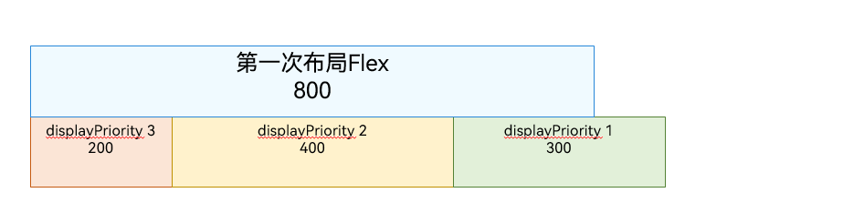

# 改善布局性能

Flex为采用弹性布局的容器。容器内部的所有子元素，会自动参与弹性布局。子元素默认沿主轴排列，子元素在主轴方向的尺寸称为主轴尺寸。

在单行布局场景下，子组件的主轴尺寸长度和可能存在不等于容器主轴尺寸长度的情况，部分子组件会被布局两次来填充容器，即需要二次布局，导致布局效率下降。

## 场景一

所有子组件未设置DisplayPriority属性（或DisplayPriority设置为默认值1）和LayoutWeight属性（或LayoutWeight设置为默认值0）时，所有子组件先按序布局一次。

- 第一次布局子组件主轴尺寸长度总和等于容器主轴尺寸长度，不需要二次布局。

  

- 第一次布局子组件主轴尺寸长度总和小于容器主轴尺寸长度，且包含设置有效的flexGrow属性的子组件，设置有效的flexGrow属性的子组件会触发二次布局，拉伸布局填满容器。

  

- 第一次布局子组件主轴尺寸长度总和大于容器主轴尺寸长度，且包含设置有效的flexShrink属性（flex子组件默认值为1，为有效值）的子组件，设置有效的flexShrink属性的子组件会触发二次布局，压缩布局填满容器。
  

## 场景二

子组件存在设置DisplayPriority属性，不存在设置LayoutWeight属性。

根据DisplayPriority从大到小顺序，布局每组同DisplayPriority值的子组件，直到子组件主轴尺寸长度总和最大且不超过容器主轴尺寸长度，舍弃未布局的低优先级DisplayPriority（可能存在一组临界DisplayPriority值的子组件布局但未使用的情况）。

- 第一次布局子组件主轴尺寸长度总和等于容器主轴尺寸长度，不需要二次布局。
  

- 第一次布局子组件主轴尺寸长度总和小于容器主轴尺寸长度，且包含设置有效的flexGrow属性的子组件，设置有效的flexGrow属性的子组件会触发二次布局，拉伸布局填满容器。
  

## 场景三

子组件中存在设置LayoutWeight属性。

根据DisplayPriority从大到小顺序，布局每组DisplayPriority值相同且不设置LayoutWeight属性的子组件，直到子组件主轴尺寸长度总和最大且不超过容器主轴尺寸长度，舍弃未布局的低优先级DisplayPriority，可能存在一组临界DisplayPriority值的子组件布局但未使用的情况。

剩余空间按设置LayoutWeight属性的子组件的LayoutWeight比例填满容器。

- 两次遍历都只布局一次组件，不会触发二次布局。
  

## 如何优化Flex的布局性能

- 使用Column/Row代替Flex。

- 大小不需要变更的子组件主动设置flexShrink属性值为0。

- 优先使用LayoutWeight属性替代flexGrow属性和flexShrink属性。

- 子组件主轴长度分配设置为最常用场景的布局结果，使子组件主轴长度总和等于Flex容器主轴长度。
