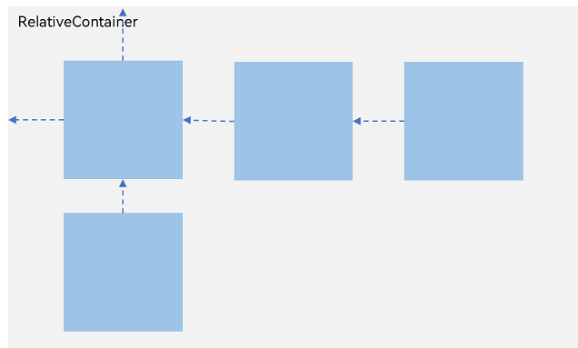
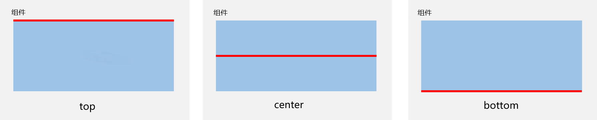
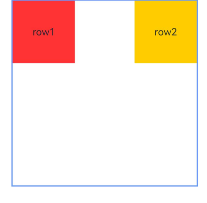
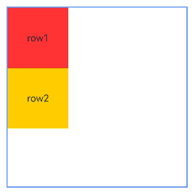
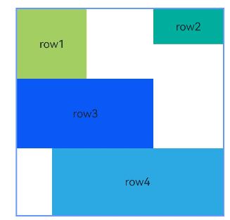
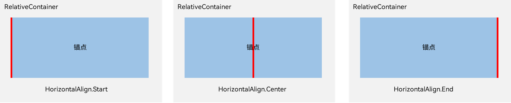
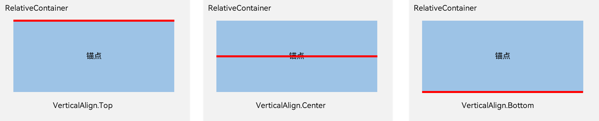
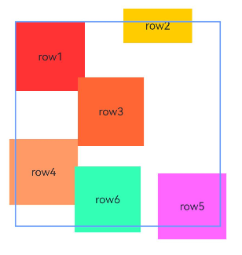
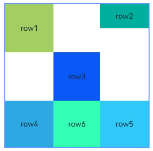
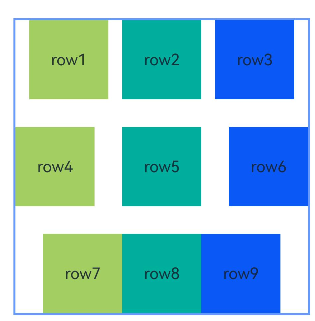

# 相对布局 (RelativeContainer)
<!--Kit: ArkUI-->
<!--Subsystem: ArkUI-->
<!--Owner: @fenglinbailu-->
<!--Designer: @lanshouren-->
<!--Tester: @liuli0427-->
<!--Adviser: @HelloCrease-->


## 概述

在应用的开发过程中，经常需要设计复杂界面，此时涉及到多个相同或不同组件之间的嵌套。如果布局组件嵌套深度过深，或者嵌套组件数过多，会带来额外的开销。如果在布局的方式上进行优化，就可以有效的提升性能，减少时间开销。<!--Del-->请参考[优化布局时间](../performance/reduce-view-nesting-levels.md#优化布局时间)了解RelativeContainer相对于List，在布局时间上的性能提升。<!--DelEnd-->

RelativeContainer是一种采用相对布局的容器，支持容器内部的子元素设置相对位置关系，适用于处理界面复杂的场景，对多个子元素进行对齐和排列。子元素可以指定兄弟元素或父容器作为锚点，基于锚点进行相对位置布局。在使用锚点时，需注意子元素的相对位置关系，以避免出现错位或遮挡的情况。下图展示了一个 RelativeContainer的概念图，图中的虚线表示位置的依赖关系。


  **图1** 相对布局示意图  




子元素并不完全是上图中的依赖关系。比如，Item4可以以Item2为依赖锚点，也可以以RelativeContainer父容器为依赖锚点。


## 基本概念

- 参考边界：设置当前组件的哪个边界对齐到锚点。

- 锚点：通过锚点设置当前元素基于哪个元素确定位置。

- 对齐方式：通过对齐方式，设置当前元素是基于锚点的上中下对齐，还是基于锚点的左中右对齐。


## 设置依赖关系

### 设置参考边界

设置当前组件的哪个边界对齐到锚点。容器内子组件的参考边界区分水平方向和垂直方向。
* 在水平方向上，可以按照起始（left）、居中（middle）或尾端（right）的组件边界与锚点对齐。当设置三个边界时，仅起始（left）和居中（middle）的边界设置生效。

* 在垂直方向上，可以设置组件边界与锚点对齐，具体包括顶部（top）、居中（center）和底部（bottom）。当设置三个边界时，仅顶部（top）和居中（center）生效。


### 设置锚点

锚点设置涉及子元素相对于其父元素或兄弟元素的位置依赖关系。具体而言，子元素可以将其位置锚定到相对布局容器（RelativeContainer）、辅助线（guideline）、屏障（barrier）或其他子元素上。

为了准确定义锚点，RelativeContainer的子元素必须拥有唯一的组件标识（id），用于指定锚点信息。父元素RelativeContainer的标识默认为“\_\_container\_\_”，其他子元素的组件标识（id）则通过[id](../reference/apis-arkui/arkui-ts/ts-universal-attributes-component-id.md#id)属性设置。

> **说明：**
>
> * 未设置组件标识（id）的组件虽可显示，但无法被其他组件引用为锚点。相对布局容器会为其拼接组件标识，但组件标识（id）的规律无法被应用感知。辅助线（guideline）与屏障（barrier）的组件标识（id）需确保唯一，避免与任何组件冲突。若有重复，遵循组件 > guideline > barrier 的优先级。
> * 组件间设置锚点时应避免形成依赖循环（组件之间设置链除外），依赖循环将导致子组件缺乏定位基准，最终无法绘制。

- RelativeContainer父组件为锚点，__container__代表父容器的组件标识（id）。

  ```ts
  let AlignRus: Record<string, Record<string, string | VerticalAlign | HorizontalAlign>> = {
    'top': { 'anchor': '__container__', 'align': VerticalAlign.Top },
    'left': { 'anchor': '__container__', 'align': HorizontalAlign.Start }
  }
  let AlignRue: Record<string, Record<string, string | VerticalAlign | HorizontalAlign>> = {
    'top': { 'anchor': '__container__', 'align': VerticalAlign.Top },
    'right': { 'anchor': '__container__', 'align': HorizontalAlign.End }
  }
  let Mleft: Record<string, number> = { 'left': 20 }
  let BWC: Record<string, number | string> = { 'width': 2, 'color': '#6699FF' }
  
  @Entry
  @Component
  struct Index {
    build() {
      RelativeContainer() {
        Row() {
          Text('row1')
        }
        .justifyContent(FlexAlign.Center)
        .width(100)
        .height(100)
        .backgroundColor('#a3cf62')
        .alignRules(AlignRus)
        .id("row1")
  
        Row() {
          Text('row2')
        }
        .justifyContent(FlexAlign.Center)
        .width(100)
        .height(100)
        .backgroundColor('#00ae9d')
        .alignRules(AlignRue)
        .id("row2")
      }.width(300).height(300)
      .margin(Mleft)
      .border(BWC)
    }
  }
  ```

  

- 以兄弟元素为锚点。

  ```ts
  let AlignRus: Record<string, Record<string, string | VerticalAlign | HorizontalAlign>> = {
    'top': { 'anchor': '__container__', 'align': VerticalAlign.Top },
    'left': { 'anchor': '__container__', 'align': HorizontalAlign.Start }
  }
  let RelConB: Record<string, Record<string, string | VerticalAlign | HorizontalAlign>> = {
    'top': { 'anchor': 'row1', 'align': VerticalAlign.Bottom },
    'left': { 'anchor': 'row1', 'align': HorizontalAlign.Start }
  }
  let Mleft: Record<string, number> = { 'left': 20 }
  let BWC: Record<string, number | string> = { 'width': 2, 'color': '#6699FF' }
  
  @Entry
  @Component
  struct Index {
    build() {
      RelativeContainer() {
        Row() {
          Text('row1')
        }
        .justifyContent(FlexAlign.Center)
        .width(100)
        .height(100)
        .backgroundColor('#00ae9d')
        .alignRules(AlignRus)
        .id("row1")
  
        Row() {
          Text('row2')
        }
        .justifyContent(FlexAlign.Center)
        .width(100)
        .height(100)
        .backgroundColor('#a3cf62')
        .alignRules(RelConB)
        .id("row2")
      }.width(300).height(300)
      .margin(Mleft)
      .border(BWC)
    }
  }
  ```

  

- 子组件锚点可以任意选择，但需注意不要相互依赖。

  ```ts
  @Entry
  @Component
  struct Index {
    build() {
      Row() {
        RelativeContainer() {
          Row(){Text('row1')}.justifyContent(FlexAlign.Center).width(100).height(100)
          .backgroundColor('#a3cf62')
          .alignRules({
            top: {anchor: "__container__", align: VerticalAlign.Top},
            left: {anchor: "__container__", align: HorizontalAlign.Start}
          })
          .id("row1")

          Row(){Text('row2')}.justifyContent(FlexAlign.Center).width(100)
          .backgroundColor('#00ae9d')
          .alignRules({
            top: {anchor: "__container__", align: VerticalAlign.Top},
            right: {anchor: "__container__", align: HorizontalAlign.End},
            bottom: {anchor: "row1", align: VerticalAlign.Center},
          })
          .id("row2")

          Row(){Text('row3')}.justifyContent(FlexAlign.Center).height(100)
          .backgroundColor('#0a59f7')
          .alignRules({
            top: {anchor: "row1", align: VerticalAlign.Bottom},
            left: {anchor: "row1", align: HorizontalAlign.Start},
            right: {anchor: "row2", align: HorizontalAlign.Start}
          })
          .id("row3")

          Row(){Text('row4')}.justifyContent(FlexAlign.Center)
          .backgroundColor('#2ca9e0')
          .alignRules({
            top: {anchor: "row3", align: VerticalAlign.Bottom},
            left: {anchor: "row1", align: HorizontalAlign.Center},
            right: {anchor: "row2", align: HorizontalAlign.End},
            bottom: {anchor: "__container__", align: VerticalAlign.Bottom}
          })
          .id("row4")
        }
        .width(300).height(300)
        .margin({left: 50})
        .border({width:2, color: "#6699FF"})
      }
      .height('100%')
    }
  }
  ```
  

### 设置相对于锚点的对齐位置

设置了锚点之后，可以通过[alignRules](../reference/apis-arkui/arkui-ts/ts-universal-attributes-location.md#alignrules9)属性的align设置相对于锚点的对齐位置。

在水平方向上，对齐位置可以设置为HorizontalAlign.Start、HorizontalAlign.Center、HorizontalAlign.End。



在垂直方向上，对齐位置可以设置为VerticalAlign.Top、VerticalAlign.Center、VerticalAlign.Bottom。



### 子组件位置偏移

子组件经过相对位置对齐后，可能尚未达到目标位置。开发者可根据需要设置额外偏移（offset）。当使用offset调整位置的组件作为锚点时，对齐位置为设置offset之前的位置。从API Version 11开始，新增了[bias](../reference/apis-arkui/arkui-ts/ts-types.md#bias对象说明)对象，建议API Version 11及以后的版本使用bias来设置额外偏移。使用bias的示例可以参考[示例4（设置偏移）](../reference/apis-arkui/arkui-ts/ts-container-relativecontainer.md#示例4设置偏移)。

  ```ts
@Entry
@Component
struct Index {
  build() {
    Row() {
      RelativeContainer() {
        Row() {
          Text('row1')
        }
        .justifyContent(FlexAlign.Center)
        .width(100)
        .height(100)
        .backgroundColor('#a3cf62')
        .alignRules({
          top: { anchor: "__container__", align: VerticalAlign.Top },
          left: { anchor: "__container__", align: HorizontalAlign.Start }
        })
        .id("row1")

        Row() {
          Text('row2')
        }
        .justifyContent(FlexAlign.Center)
        .width(100)
        .backgroundColor('#00ae9d')
        .alignRules({
          top: { anchor: "__container__", align: VerticalAlign.Top },
          right: { anchor: "__container__", align: HorizontalAlign.End },
          bottom: { anchor: "row1", align: VerticalAlign.Center },
        })
        .offset({
          x: -40,
          y: -20
        })
        .id("row2")

        Row() {
          Text('row3')
        }
        .justifyContent(FlexAlign.Center)
        .height(100)
        .backgroundColor('#0a59f7')
        .alignRules({
          top: { anchor: "row1", align: VerticalAlign.Bottom },
          left: { anchor: "row1", align: HorizontalAlign.End },
          right: { anchor: "row2", align: HorizontalAlign.Start }
        })
        .offset({
          x: -10,
          y: -20
        })
        .id("row3")

        Row() {
          Text('row4')
        }
        .justifyContent(FlexAlign.Center)
        .backgroundColor('#2ca9e0')
        .alignRules({
          top: { anchor: "row3", align: VerticalAlign.Bottom },
          bottom: { anchor: "__container__", align: VerticalAlign.Bottom },
          left: { anchor: "__container__", align: HorizontalAlign.Start },
          right: { anchor: "row1", align: HorizontalAlign.End }
        })
        .offset({
          x: -10,
          y: -30
        })
        .id("row4")

        Row() {
          Text('row5')
        }
        .justifyContent(FlexAlign.Center)
        .backgroundColor('#30c9f7')
        .alignRules({
          top: { anchor: "row3", align: VerticalAlign.Bottom },
          bottom: { anchor: "__container__", align: VerticalAlign.Bottom },
          left: { anchor: "row2", align: HorizontalAlign.Start },
          right: { anchor: "row2", align: HorizontalAlign.End }
        })
        .offset({
          x: 10,
          y: 20
        })
        .id("row5")

        Row() {
          Text('row6')
        }
        .justifyContent(FlexAlign.Center)
        .backgroundColor('#ff33ffb5')
        .alignRules({
          top: { anchor: "row3", align: VerticalAlign.Bottom },
          bottom: { anchor: "row4", align: VerticalAlign.Bottom },
          left: { anchor: "row3", align: HorizontalAlign.Start },
          right: { anchor: "row3", align: HorizontalAlign.End }
        })
        .offset({
          x: -15,
          y: 10
        })
        .backgroundImagePosition(Alignment.Bottom)
        .backgroundImageSize(ImageSize.Cover)
        .id("row6")
      }
      .width(300).height(300)
      .margin({ left: 50 })
      .border({ width: 2, color: "#6699FF" })
    }
    .height('100%')
  }
}
  ```
  

## 多种组件的对齐布局

Row、Column、Flex、Stack等多种布局组件，可按照RelativeContainer组件规则进行对齐排布。

  ```ts
@Entry
@Component
struct Index {
  @State value: number = 0

  build() {
    Row() {

      RelativeContainer() {
        Row()
          .width(100)
          .height(100)
          .backgroundColor('#a3cf62')
          .alignRules({
            top: { anchor: "__container__", align: VerticalAlign.Top },
            left: { anchor: "__container__", align: HorizontalAlign.Start }
          })
          .id("row1")

        Column()
          .width('50%')
          .height(30)
          .backgroundColor('#00ae9d')
          .alignRules({
            top: { anchor: "__container__", align: VerticalAlign.Top },
            left: { anchor: "__container__", align: HorizontalAlign.Center }
          })
          .id("row2")

        Flex({ direction: FlexDirection.Row }) {
          Text('1').width('20%').height(50).backgroundColor('#0a59f7')
          Text('2').width('20%').height(50).backgroundColor('#2ca9e0')
          Text('3').width('20%').height(50).backgroundColor('#0a59f7')
          Text('4').width('20%').height(50).backgroundColor('#2ca9e0')
        }
        .padding(10)
        .backgroundColor('#30c9f7')
        .alignRules({
          top: { anchor: "row2", align: VerticalAlign.Bottom },
          left: { anchor: "__container__", align: HorizontalAlign.Start },
          bottom: { anchor: "__container__", align: VerticalAlign.Center },
          right: { anchor: "row2", align: HorizontalAlign.Center }
        })
        .id("row3")

        Stack({ alignContent: Alignment.Bottom }) {
          Text('First child, show in bottom').width('90%').height('100%').backgroundColor('#a3cf62').align(Alignment.Top)
          Text('Second child, show in top').width('70%').height('60%').backgroundColor('#00ae9d').align(Alignment.Top)
        }
        .margin({ top: 5 })
        .alignRules({
          top: { anchor: "row3", align: VerticalAlign.Bottom },
          left: { anchor: "__container__", align: HorizontalAlign.Start },
          bottom: { anchor: "__container__", align: VerticalAlign.Bottom },
          right: { anchor: "row3", align: HorizontalAlign.End }
        })
        .id("row4")

      }
      .width(300).height(300)
      .margin({ left: 50 })
      .border({ width: 2, color: "#6699FF" })
    }
    .height('100%')
  }
}
  ```
  

## 组件尺寸

当同时存在前端页面设置的子组件尺寸和相对布局规则时，子组件的绘制尺寸依据约束规则确定。从API Version 11开始，此规则有所变化，子组件自身设置的尺寸优先级高于相对布局规则中的对齐锚点尺寸。因此，若要使子组件与锚点严格对齐，应仅使用alignRules，避免使用[尺寸设置](../reference/apis-arkui/arkui-ts/ts-universal-attributes-size.md)。

> **说明：**
>
> * 根据约束条件和子组件自身的size属性无法确定子组件的大小，此时，不绘制该子组件。
> * 在同一方向上设置两个或更多锚点时，若这些锚点的位置顺序有误，该子组件将被视为大小为0而不予绘制。
```ts
@Entry
@Component
struct Index {
  build() {
    Row() {
      RelativeContainer() {
        Row() {
          Text('row1')
        }
        .justifyContent(FlexAlign.Center)
        .width(100)
        .height(100)
        .backgroundColor('#a3cf62')
        .alignRules({
          top: { anchor: "__container__", align: VerticalAlign.Top },
          left: { anchor: "__container__", align: HorizontalAlign.Start }
        })
        .id("row1")

        Row() {
          Text('row2')
        }
        .justifyContent(FlexAlign.Center)
        .width(100)
        .backgroundColor('#00ae9d')
        .alignRules({
          top: { anchor: "__container__", align: VerticalAlign.Top },
          right: { anchor: "__container__", align: HorizontalAlign.End },
          bottom: { anchor: "row1", align: VerticalAlign.Center },
        })
        .id("row2")

        Row() {
          Text('row3')
        }
        .justifyContent(FlexAlign.Center)
        .height(100)
        .backgroundColor('#0a59f7')
        .alignRules({
          top: { anchor: "row1", align: VerticalAlign.Bottom },
          left: { anchor: "row1", align: HorizontalAlign.End },
          right: { anchor: "row2", align: HorizontalAlign.Start }
        })
        .id("row3")

        Row() {
          Text('row4')
        }.justifyContent(FlexAlign.Center)
        .backgroundColor('#2ca9e0')
        .alignRules({
          top: { anchor: "row3", align: VerticalAlign.Bottom },
          bottom: { anchor: "__container__", align: VerticalAlign.Bottom },
          left: { anchor: "__container__", align: HorizontalAlign.Start },
          right: { anchor: "row1", align: HorizontalAlign.End }
        })
        .id("row4")

        Row() {
          Text('row5')
        }.justifyContent(FlexAlign.Center)
        .backgroundColor('#30c9f7')
        .alignRules({
          top: { anchor: "row3", align: VerticalAlign.Bottom },
          bottom: { anchor: "__container__", align: VerticalAlign.Bottom },
          left: { anchor: "row2", align: HorizontalAlign.Start },
          right: { anchor: "row2", align: HorizontalAlign.End }
        })
        .id("row5")

        Row() {
          Text('row6')
        }
        .justifyContent(FlexAlign.Center)
        .backgroundColor('#ff33ffb5')
        .alignRules({
          top: { anchor: "row3", align: VerticalAlign.Bottom },
          bottom: { anchor: "row4", align: VerticalAlign.Bottom },
          left: { anchor: "row3", align: HorizontalAlign.Start },
          right: { anchor: "row3", align: HorizontalAlign.End }
        })
        .id("row6")
        .backgroundImagePosition(Alignment.Bottom)
        .backgroundImageSize(ImageSize.Cover)
      }
      .width(300).height(300)
      .margin({ left: 50 })
      .border({ width: 2, color: "#6699FF" })
    }
    .height('100%')
  }
}
```
  


## 多个组件形成链

链的形成依赖于组件之间的关联关系。以组件A和组件B构成的最简水平链为例，其依赖关系为：锚点1 <-- 组件A <---> 组件B --> 锚点2，即A具有left锚点，B具有right锚点，同时A的right锚点与B的HorizontalAlign.Start对齐，B的left锚点与A的HorizontalAlign.End对齐。
* 链的方向和格式在链头组件的[chainMode](../reference/apis-arkui/arkui-ts/ts-universal-attributes-location.md#chainmode12)接口中声明；链内元素的bias属性全部失效，链头元素的bias属性作为整个链的bias生效。链头是指在满足成链规则时链的第一个组件（在水平方向上，从左边开始，镜像语言中从右边开始；在垂直方向上，从上边开始）。
* 如果链内所有元素的size超出链的锚点约束，超出部分将被均匀分配到链的两侧。在[PACKED](../reference/apis-arkui/arkui-ts/ts-universal-attributes-location.md#chainstyle12)链中，可以通过[bias](../reference/apis-arkui/arkui-ts/ts-types.md#bias对象说明)设置超出部分的分布。


```ts
@Entry
@Component
struct Index {
  build() {
    Row() {
      RelativeContainer() {
        Row() {
          Text('row1')
        }
        .justifyContent(FlexAlign.Center)
        .width(80)
        .height(80)
        .backgroundColor('#a3cf62')
        .alignRules({
          left: { anchor: "__container__", align: HorizontalAlign.Start },
          right: { anchor: "row2", align: HorizontalAlign.Start },
          top: { anchor: "__container__", align: VerticalAlign.Top }
        })
        .id("row1")
        .chainMode(Axis.Horizontal, ChainStyle.SPREAD)

        Row() {
          Text('row2')
        }
        .justifyContent(FlexAlign.Center)
        .width(80)
        .height(80)
        .backgroundColor('#00ae9d')
        .alignRules({
          left: { anchor: "row1", align: HorizontalAlign.End },
          right: { anchor: "row3", align: HorizontalAlign.Start },
          top: { anchor: "row1", align: VerticalAlign.Top }
        })
        .id("row2")

        Row() {
          Text('row3')
        }
        .justifyContent(FlexAlign.Center)
        .width(80)
        .height(80)
        .backgroundColor('#0a59f7')
        .alignRules({
          left: { anchor: "row2", align: HorizontalAlign.End },
          right: { anchor: "__container__", align: HorizontalAlign.End },
          top: { anchor: "row1", align: VerticalAlign.Top }
        })
        .id("row3")

        Row() {
          Text('row4')
        }
        .justifyContent(FlexAlign.Center)
        .width(80)
        .height(80)
        .backgroundColor('#a3cf62')
        .alignRules({
          left: { anchor: "__container__", align: HorizontalAlign.Start },
          right: { anchor: "row5", align: HorizontalAlign.Start },
          center: { anchor: "__container__", align: VerticalAlign.Center }
        })
        .id("row4")
        .chainMode(Axis.Horizontal, ChainStyle.SPREAD_INSIDE)

        Row() {
          Text('row5')
        }
        .justifyContent(FlexAlign.Center)
        .width(80)
        .height(80)
        .backgroundColor('#00ae9d')
        .alignRules({
          left: { anchor: "row4", align: HorizontalAlign.End },
          right: { anchor: "row6", align: HorizontalAlign.Start },
          top: { anchor: "row4", align: VerticalAlign.Top }
        })
        .id("row5")

        Row() {
          Text('row6')
        }
        .justifyContent(FlexAlign.Center)
        .width(80)
        .height(80)
        .backgroundColor('#0a59f7')
        .alignRules({
          left: { anchor: "row5", align: HorizontalAlign.End },
          right: { anchor: "__container__", align: HorizontalAlign.End },
          top: { anchor: "row4", align: VerticalAlign.Top }
        })
        .id("row6")

        Row() {
          Text('row7')
        }
        .justifyContent(FlexAlign.Center)
        .width(80)
        .height(80)
        .backgroundColor('#a3cf62')
        .alignRules({
          left: { anchor: "__container__", align: HorizontalAlign.Start },
          right: { anchor: "row8", align: HorizontalAlign.Start },
          bottom: { anchor: "__container__", align: VerticalAlign.Bottom }
        })
        .id("row7")
        .chainMode(Axis.Horizontal, ChainStyle.PACKED)

        Row() {
          Text('row8')
        }
        .justifyContent(FlexAlign.Center)
        .width(80)
        .height(80)
        .backgroundColor('#00ae9d')
        .alignRules({
          left: { anchor: "row7", align: HorizontalAlign.End },
          right: { anchor: "row9", align: HorizontalAlign.Start },
          top: { anchor: "row7", align: VerticalAlign.Top }
        })
        .id("row8")

        Row() {
          Text('row9')
        }
        .justifyContent(FlexAlign.Center)
        .width(80)
        .height(80)
        .backgroundColor('#0a59f7')
        .alignRules({
          left: { anchor: "row8", align: HorizontalAlign.End },
          right: { anchor: "__container__", align: HorizontalAlign.End },
          top: { anchor: "row7", align: VerticalAlign.Top }
        })
        .id("row9")
      }
      .width(300).height(300)
      .margin({ left: 50 })
      .border({ width: 2, color: "#6699FF" })
    }
    .height('100%')
  }
}
```
