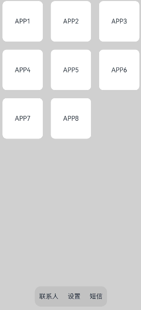

# 层叠布局（Stack）


## 概述

层叠布局（StackLayout）用于在屏幕上预留一块区域来显示组件中的元素，提供元素可以重叠的布局。层叠布局通过[Stack](https://docs.openharmony.cn/pages/v3.2Beta/zh-cn/application-dev/reference/arkui-ts/ts-container-stack.md/)容器组件实现位置的固定定位与层叠，容器中的子元素（子组件）依次入栈，后一个子元素覆盖前一个子元素，子元素可以叠加，也可以设置位置。

层叠布局具有较强的页面层叠、位置定位能力，其使用场景有广告、卡片层叠效果等。

如图1，Stack作为容器，容器内的子元素（子组件）的顺序为Item1-&gt;Item2-&gt;Item3。


  **图1** 层叠布局  


## 开发布局

Stack组件为容器组件，容器内可包含各种子组件。其中的子组件根据自己的大小默认进行居中堆叠。子元素被约束在Stack下，进行自己的样式定义以及排列。


```ts
Column(){
  Stack({ }) {
    Column(){}.width('90%').height('100%').backgroundColor('#ff58b87c')
    Text('text').width('60%').height('60%').backgroundColor('#ffc3f6aa')
    Button('button').width('30%').height('30%').backgroundColor('#ff8ff3eb').fontColor('#000')
  }.width('100%').height(150).margin({ top: 50 })
}
```


## 对齐方式

Stack组件通过[alignContent参数](../reference/arkui-ts/ts-appendix-enums.md#alignment)实现位置的相对移动。如图2所示，支持九种对齐方式。

  **图2** Stack容器内元素的对齐方式  


## Z序控制

Stack容器中兄弟组件显示层级关系可以通过[Z序控制](../reference/arkui-ts/ts-universal-attributes-z-order.md)的zIndex属性改变。zIndex值越大，显示层级越高，即zIndex值大的组件会覆盖在zIndex值小的组件上方。

  在层叠布局中，如果后面子元素尺寸大于前面子元素尺寸，则前面子元素完全隐藏。

```ts
Stack({ alignContent: Alignment.BottomStart }) {
  Column() {
    Text('Stack子元素1').textAlign(TextAlign.End).fontSize(20)
  }.width(100).height(100).backgroundColor(0xffd306)

  Column() {
    Text('Stack子元素2').fontSize(20)
  }.width(150).height(150).backgroundColor(Color.Pink)

  Column() {
    Text('Stack子元素3').fontSize(20)
  }.width(200).height(200).backgroundColor(Color.Grey)
}.margin({ top: 100 }).width(350).height(350).backgroundColor(0xe0e0e0)
```


下图中，最后的子元素3的尺寸大于前面的所有子元素，所以，前面两个元素完全隐藏。改变子元素1，子元素2的zIndex属性后，可以将元素展示出来。


```ts
Stack({ alignContent: Alignment.BottomStart }) {
  Column() {
    Text('Stack子元素1').fontSize(20)
  }.width(100).height(100).backgroundColor(0xffd306).zIndex(2)

  Column() {
    Text('Stack子元素2').fontSize(20)
  }.width(150).height(150).backgroundColor(Color.Pink).zIndex(1)

  Column() {
    Text('Stack子元素3').fontSize(20)
  }.width(200).height(200).backgroundColor(Color.Grey)
}.margin({ top: 100 }).width(350).height(350).backgroundColor(0xe0e0e0)
```


## 场景示例

使用层叠布局快速搭建页面显示模型。


```ts
@Entry
@Component
struct StackSample {
  private arr: string[] = ['APP1', 'APP2', 'APP3', 'APP4', 'APP5', 'APP6', 'APP7', 'APP8'];

  build() {
    Stack({ alignContent: Alignment.Bottom }) {
      Flex({ wrap: FlexWrap.Wrap }) {
        ForEach(this.arr, (item) => {
          Text(item)
            .width(100)
            .height(100)
            .fontSize(16)
            .margin(10)
            .textAlign(TextAlign.Center)
            .borderRadius(10)
            .backgroundColor(0xFFFFFF)
        }, item => item)
      }.width('100%').height('100%')

      Flex({ justifyContent: FlexAlign.SpaceAround, alignItems: ItemAlign.Center }) {
        Text('联系人').fontSize(16)
        Text('设置').fontSize(16)
        Text('短信').fontSize(16)
      }
      .width('50%')
      .height(50)
      .backgroundColor('#16302e2e')
      .margin({ bottom: 15 })
      .borderRadius(15)
    }.width('100%').height('100%').backgroundColor('#CFD0CF')
  }
}
```



