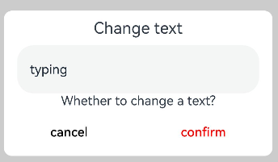
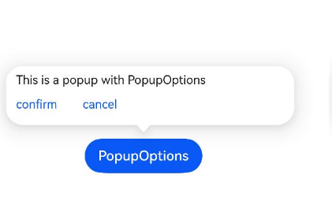
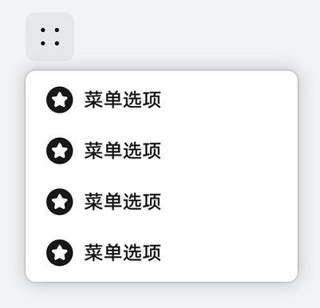
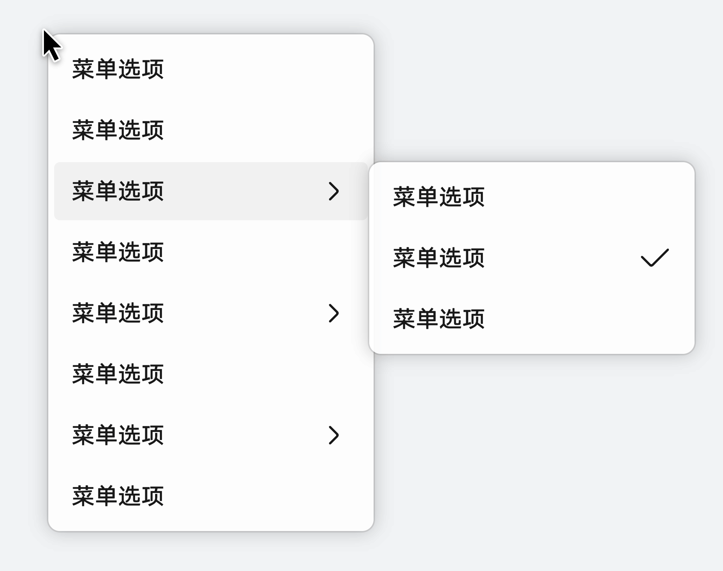
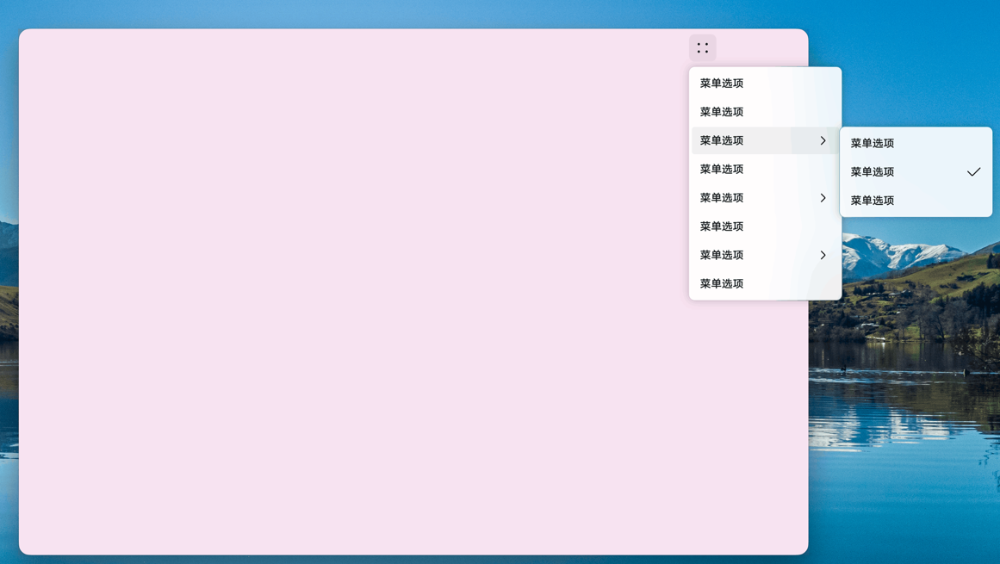

# 模态弹窗 (ModalDialog)

## 概述

模态（Modal）是UI组件或视图的一种状态。其在消失之前，用户只能对处于模态的组件或视图进行响应，不能操作其他非模态的组件或视图，干扰性比较强。

ArkUI中可通过使用[AlertDialog](../reference/apis-arkui/arkui-ts/ts-methods-alert-dialog-box.md)、[CustomDialog](../reference/apis-arkui/arkui-ts/ts-methods-custom-dialog-box.md)、[ActionSheet](../reference/apis-arkui/arkui-ts/ts-methods-action-sheet.md)、[Popup](../reference/apis-arkui/arkui-ts/ts-universal-attributes-popup.md)、[Menu](../reference/apis-arkui/arkui-ts/ts-basic-components-menu.md)、[ContextMenu](../reference/apis-arkui/arkui-ts/ts-methods-menu.md)等组件实现模态类弹窗能力。

| 名称                                 | 使用场景                                                     |
| ------------------------------------ | ------------------------------------------------------------ |
| AlertDialog | 通常用来展示用户当前需要或必须关注的信息或操作。如用户操作一个敏感行为时响应一个二次确认的弹窗。 |
| ActionSheet | 当需要用户关注或确认的信息存在列表选择时使用。 |
| CustomDialog | 当用户需要自定义弹窗内的组件和内容时使用。 |
| Popup                                | 用于为指定的组件做信息提示。如点击一个问号图标弹出一段气泡提示。          |
| Menu/ContextMenu                     | 用于给指定的组件绑定用户可执行的操作，如长按图标展示操作选项等。       |

> **说明：** 
>
> - 本指导介绍模态弹窗，开发者可通过配置参数（例如：CustomDialog的isModal）调整弹窗为非模态弹窗，从而满足不同的使用场景。
>
> - 移动设备中，子窗模式的弹窗当前无法超出主窗口。
>
> - 多个弹窗组件先后弹出时，后弹出的组件的层级高于先弹出的层级，退出时按照层级从高到低的顺序逐次退出。

## 使用全局弹窗

全局弹窗不与任何组件绑定，一般用于针对用户触发的操作进行必要提示时使用。ArkUI当前提供了定制和自定义两类弹窗组件。

定制：AlertDialog、ActionSheet、promptAction.showDialog、promptAction.showActionMenu。开发者可使用此类组件，指定需要显示的文本内容和按钮操作即可完成简单的交互效果。

自定义：CustomDialog、promptAction.openCustomDialog。开发者需要根据场景传入自定义组件填充在弹窗中实现自定义的弹窗内容。

下面以AlertDialog、ActionSheet 和 CustomDialog 为例说明相应的弹窗效果与使用方法。

- **AlertDialog：** 警告弹窗，需要向用户提问或得到用户的许可。
  - 警告弹窗用来提示重要信息，但会中断当前任务，尽量提供必要的信息和有用的操作。
  - 避免仅使用警告弹窗提供信息，用户不喜欢被信息丰富但不可操作的警告打断。
  - 必选内容包含：标题、可选信息文本、最多3个按钮。
  - 可选内容包含：输入框、icon、checkBox和HelpButton。
  
  
  
  ```ts
  @Entry
  @Component
  struct AlertDialogExample {
    build() {
      Column({ space: 5 }) {
        Button('two button dialog')
          .onClick(() => {
            AlertDialog.show(
              {
                title: 'title',
                subtitle: 'subtitle',
                message: 'text',
                autoCancel: true,
                alignment: DialogAlignment.Bottom,
                gridCount: 4,
                offset: { dx: 0, dy: -20 },
                primaryButton: {
                  value: 'cancel',
                  action: () => {
                    console.info('Callback when the first button is clicked')
                  }
                },
                secondaryButton: {
                  enabled: true,
                  defaultFocus: true,
                  style: DialogButtonStyle.HIGHLIGHT,
                  value: 'ok',
                  action: () => {
                    console.info('Callback when the second button is clicked')
                  }
                }
              }
            )
          }).backgroundColor(0x317aff)
      }.width('100%').margin({ top: 5 })
    }
  }
  ```
  
- **ActionSheet：** 列表选择弹窗。

  适合展示多个操作项，尤其是除了操作列表以外没有其他的展示内容。

  


  ```ts
  @Entry
  @Component
  struct ActionSheetExample {
    build() {
      Flex({ direction: FlexDirection.Column, alignItems: ItemAlign.Center, justifyContent: FlexAlign.Center }) {
        Button('Click to Show ActionSheet')
          .onClick(() => {
            ActionSheet.show({
              title: 'ActionSheet title',
              subtitle: 'ActionSheet subtitle',
              message: 'message',
              autoCancel: true,
              confirm: {
                defaultFocus: true,
                value: 'Confirm button',
                action: () => {
                  console.log('Get Alert Dialog handled')
                }
              },
              alignment: DialogAlignment.Bottom,
              offset: { dx: 0, dy: -10 },
              sheets: [
                {
                  title: 'apples',
                  action: () => {
                    console.log('apples')
                  }
                },
                {
                  title: 'bananas',
                  action: () => {
                    console.log('bananas')
                  }
                },
                {
                  title: 'pears',
                  action: () => {
                    console.log('pears')
                  }
                }
              ]
            })
          })
      }.width('100%')
      .height('100%')
    }
  }
  ```

- **CustomDialog：**  自定义弹窗。

  当开发者需要自定义弹窗的内容和样式时，可选择CustomDialog。更建议使用[promptAction.openCustomDialog](../reference/apis-arkui/js-apis-promptAction.md#promptactionopencustomdialog11)。

  

  ```ts
  // xxx.ets
  @CustomDialog
  @Component
  struct CustomDialogExample {
    @Link textValue: string
    @Link inputValue: string
    controller?: CustomDialogController
    cancel: () => void = () => {
    }
    confirm: () => void = () => {
    }
  
    build() {
      Column() {
        Text('Change text').fontSize(20).margin({ top: 10, bottom: 10 })
        TextInput({ placeholder: '', text: this.textValue }).height(60).width('90%')
          .onChange((value: string) => {
            this.textValue = value
          })
        Text('Whether to change a text?').fontSize(16).margin({ bottom: 10 })
        Flex({ justifyContent: FlexAlign.SpaceAround }) {
          Button('cancel')
            .onClick(() => {
              if (this.controller != undefined) {
                this.controller.close()
                this.cancel()
              }
            }).backgroundColor(0xffffff).fontColor(Color.Black)
          Button('confirm')
            .onClick(() => {
              if (this.controller != undefined) {
                this.inputValue = this.textValue
                this.controller.close()
                this.confirm()
              }
            }).backgroundColor(0xffffff).fontColor(Color.Red)
        }.margin({ bottom: 10 })
      }.borderRadius(10)
    }
  }
  
  @Entry
  @Component
  struct CustomDialogUser {
    @State textValue: string = ''
    @State inputValue: string = 'click me'
    dialogController: CustomDialogController | null = new CustomDialogController({
      builder: CustomDialogExample({
        cancel: () => {
          this.onCancel()
        },
        confirm: () => {
          this.onAccept()
        },
        textValue: $textValue,
        inputValue: $inputValue
      }),
      cancel: this.exitApp,
      autoCancel: true,
      onWillDismiss: (dismissDialogAction: DismissDialogAction) => {
        console.info("reason=" + JSON.stringify(dismissDialogAction.reason))
        console.log("dialog onWillDismiss")
        if (dismissDialogAction.reason == DismissReason.PRESS_BACK) {
          dismissDialogAction.dismiss()
        }
        if (dismissDialogAction.reason == DismissReason.TOUCH_OUTSIDE) {
          dismissDialogAction.dismiss()
        }
      },
      alignment: DialogAlignment.Bottom,
      offset: { dx: 0, dy: -20 },
      gridCount: 4,
      customStyle: false,
      cornerRadius: 10,
    })
  
    // 在自定义组件即将析构销毁时将dialogController置空
    aboutToDisappear() {
      this.dialogController = null // 将dialogController置空
    }
  
    onCancel() {
      console.info('Callback when the first button is clicked')
    }
  
    onAccept() {
      console.info('Callback when the second button is clicked')
    }
  
    exitApp() {
      console.info('Click the callback in the blank area')
    }
  
    build() {
      Column() {
        Button(this.inputValue)
          .onClick(() => {
            if (this.dialogController != null) {
              this.dialogController.open()
            }
          }).backgroundColor(0x317aff)
      }.width('100%').margin({ top: 5 })
    }
  }
  ```

## 使用气泡Popup

当点击目标组件或交互区时，弹出内容在其他内容之上，可使用Popup来指示当前功能如何操作。



```ts
@Entry
@Component
struct PopupExample {
  @State handlePopup: boolean = false

  build() {
    Flex({ direction: FlexDirection.Column }) {
      // PopupOptions 类型设置弹框内容
      Button('PopupOptions')
        .onClick(() => {
          this.handlePopup = !this.handlePopup
        })
        .bindPopup(this.handlePopup, {
          message: 'This is a popup with PopupOptions',
          placementOnTop: true,
          showInSubWindow: false,
          primaryButton: {
            value: 'confirm',
            action: () => {
              this.handlePopup = !this.handlePopup
              console.info('confirm Button click')
            }
          },
          // 第二个按钮
          secondaryButton: {
            value: 'cancel',
            action: () => {
              this.handlePopup = !this.handlePopup
              console.info('cancel Button click')
            }
          },
          onStateChange: (e) => {
            console.info(JSON.stringify(e.isVisible))
            if (!e.isVisible) {
              this.handlePopup = false
            }
          }
        })
        .position({ x: 100, y: 150 })
    }.width('100%').padding({ top: 5 })
  }
}
```

## 使用菜单Menu

很多时候需要通过交互弹出一些菜单选项，用于用户操作。此时可通过Menu和MenuItem组件组合成需要弹出的菜单选项内容，然后借助bindMenu和bindContextMenu方法将菜单和组件绑定。

| 方法名                   | 使用场景                   |
| -------------------------- | -------------------------- |
| bindMenu | 无需预览图场景，需要在非子窗场景显示。 |
| bindContextMenu | 需要预览图场景使用，只能在子窗中显示。 |

- **bindMenu**：一种临时性弹出组件，用于展示用户可执行的操作。

  | 一级Menu                   | 多级Menu                   |
  | -------------------------- | -------------------------- |
  |  |  |
  
	```ts
  @Entry
	@Component
	struct Index {
	  @State select: boolean = true
	
	  @Builder
	  MyMenu() {
	    Menu() {
	      MenuItem({ content: "菜单选项" })
	      MenuItem({ content: "菜单选项" })
	      MenuItem({ content: "菜单选项" })
	      MenuItem({ content: "菜单选项" })
	    }
	  }
	
	  build() {
	    Row() {
	      Column() {
	        Text('click to show menu')
	          .fontSize(50)
	          .fontWeight(FontWeight.Bold)
	      }
	      .bindMenu(this.MyMenu)
	      .width('100%')
	    }
	    .height('100%')
	  }
	}
	```


- **bindContextMenu：** 内容包括菜单、预览图、蒙层，通常在长按桌面图标时使用。

  | 相对父组件区域弹出                | 相对点击位置弹出                  |
  | --------------------------------- | --------------------------------- |
  |  |  |

  ```ts
  @Entry
  @Component
  struct Index {
    @State select: boolean = true
  
    @Builder
    MyMenu(){
      Menu() {
        MenuItem({ content: "菜单选项" })
        MenuItem({ content: "菜单选项" })
        MenuItem({ content: "菜单选项" })
        MenuItem({ content: "菜单选项" })
      }
    }
  
    build() {
      Row() {
        Column() {
          Text('click to show menu')
            .fontSize(50)
            .fontWeight(FontWeight.Bold)
        }
        .bindContextMenu(this.MyMenu, ResponseType.LongPress,{
          placement: Placement.Left,
          preview: MenuPreviewMode.IMAGE
        })
        .width('100%')
      }
      .height('100%')
    }
  }
  ```


## 超出应用界面

在2in1设备上，使用模态类弹窗时，会出现超出主窗口显示的场景，如下图所示。



开发者可通过[支持子窗口](#支持子窗口)和[默认子窗口](#默认子窗口)实现超出应用界面效果。

### 支持子窗口

自定义弹窗（CustomDialog）、警告弹窗（AlertDialog）、列表选择弹窗（ActionSheet）、气泡提示（Popup）可通过showInSubWindow，设置弹窗或气泡在子窗口中，从而实现超出主窗口的显示效果。

```ts
// xxx.ets	
@CustomDialog
struct CustomDialogExample {
  controller?: CustomDialogController
  cancel: () => void = () => {
  }
  confirm: () => void = () => {
  }
  build() {
    Column() {
      Text('可展示在主窗口外的弹窗')
        .fontSize(30)
        .height(100)
      Button('点我关闭弹窗')
        .onClick(() => {
          if (this.controller != undefined) {
            this.controller.close()
          }
        })
        .margin(20)
    }
  }
}
@Entry
@Component
struct CustomDialogUser {
  dialogController: CustomDialogController | null = new CustomDialogController({
    builder: CustomDialogExample({
      cancel: ()=> { this.onCancel() },
      confirm: ()=> { this.onAccept() }
    }),
    cancel: this.existApp,
    autoCancel: true,
    alignment: DialogAlignment.Center,
    offset: { dx: 0, dy: -20 },
    gridCount: 4,
    showInSubWindow: true,
    isModal: true,
    customStyle: false,
    cornerRadius: 10,
  })
  // 在自定义组件即将析构销毁时将dialogController置空
  aboutToDisappear() {
    this.dialogController = null // 将dialogController置空
  }

  onCancel() {
    console.info('Callback when the first button is clicked')
  }

  onAccept() {
    console.info('Callback when the second button is clicked')
  }

  existApp() {
    console.info('Click the callback in the blank area')
  }

  build() {
    Column() {
      Button('click me')
        .onClick(() => {
          if (this.dialogController != null) {
            this.dialogController.open()
          }
        }).backgroundColor(0x317aff)
    }.width('100%').margin({ top: 5 })
  }
}
```

### 默认子窗口

可使用 bindContextMenu为组件绑定菜单，触发方式为长按或者右键点击，弹出菜单项需要自定义。

```ts
@Entry
@Component
struct ContextMenuExample {
  @Builder MenuBuilder() {
    Flex({ direction: FlexDirection.Column, justifyContent: FlexAlign.Center, alignItems: ItemAlign.Center }) {
      Text('Test menu item 1')
        .fontSize(20)
        .width(100)
        .height(50)
        .textAlign(TextAlign.Center)
      Divider().height(10)
      Text('Test menu item 2')
        .fontSize(20)
        .width(100)
        .height(50)
        .textAlign(TextAlign.Center)
    }.width(100)
  }

  build() {
    Column() {
      Text('LongPress for menu')
    }
    .width('100%')
    .margin({ top: 5 })
    .bindContextMenu(this.MenuBuilder, ResponseType.LongPress)
  }
}
```

