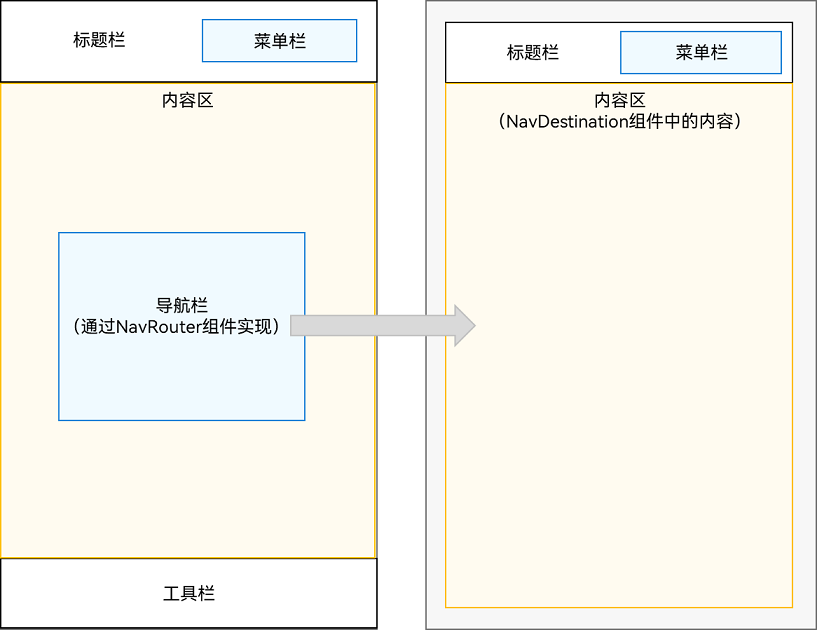
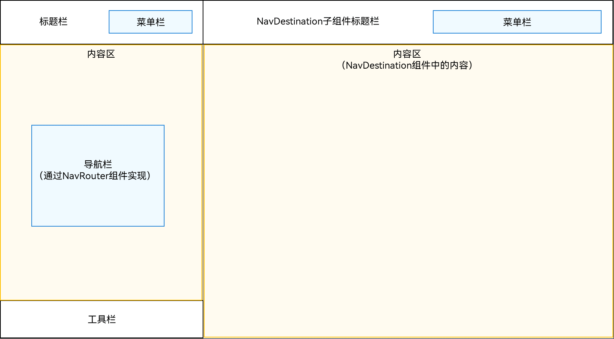
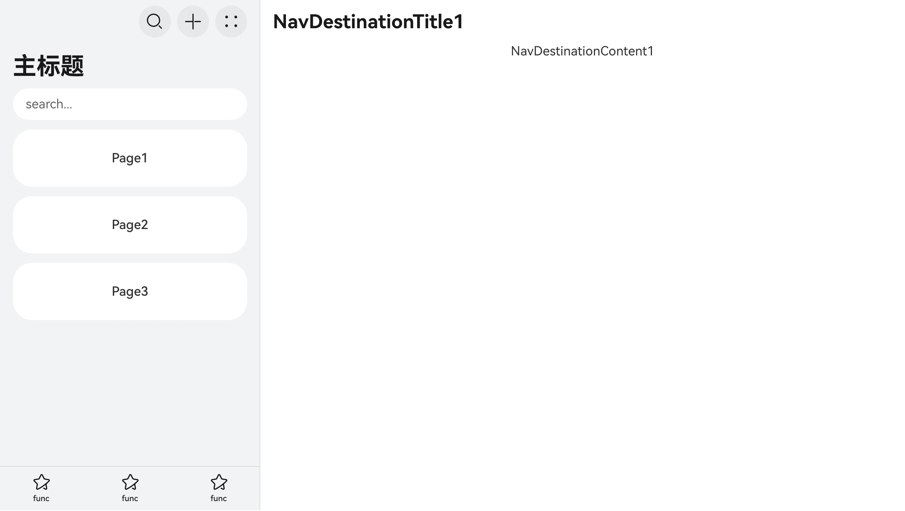
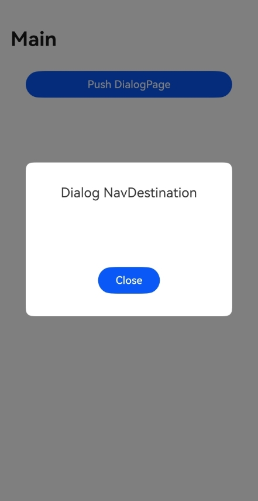
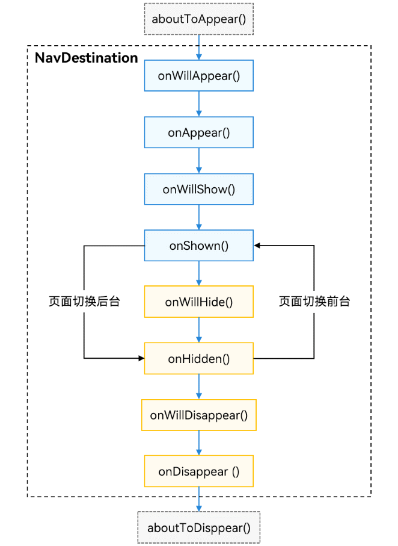

# 组件导航 (Navigation)(推荐)

组件导航（Navigation）主要用于实现页面间以及组件内部的页面跳转，支持在不同组件间传递跳转参数，提供灵活的跳转栈操作，从而更便捷地实现对不同页面的访问和复用。本文将从组件导航（Navigation）的显示模式、路由操作、子页面管理、跨包跳转以及跳转动效等几个方面进行详细介绍。

[Navigation](../reference/apis-arkui/arkui-ts/ts-basic-components-navigation.md)是路由导航的根视图容器，一般作为页面（@Entry）的根容器，包括单栏（Stack）、分栏（Split）和自适应（Auto）三种显示模式。Navigation组件适用于模块内和跨模块的路由切换，通过组件级路由能力实现更加自然流畅的转场体验，并提供多种标题栏样式来呈现更好的标题和内容联动效果。一次开发，多端部署场景下，Navigation组件能够自动适配窗口显示大小，在窗口较大的场景下自动切换分栏展示效果。

Navigation组件主要包含​导航页和子页。导航页由标题栏（包含菜单栏）、内容区和工具栏组成，可以通过[hideNavBar](../reference/apis-arkui/arkui-ts/ts-basic-components-navigation.md#hidenavbar9)属性进行隐藏，导航页不存在页面栈中，与子页，以及子页之间可以通过路由操作进行切换。

在API version 9上，Navigation需要配合[NavRouter](../reference/apis-arkui/arkui-ts/ts-basic-components-navrouter.md)组件实现页面路由。从API version 10开始，更推荐使用[NavPathStack](../reference/apis-arkui/arkui-ts/ts-basic-components-navigation.md#navpathstack10)实现页面路由。


## 设置页面显示模式

Navigation组件通过mode属性设置页面的显示模式。

- 自适应模式

  Navigation组件默认为自适应模式，此时mode属性为NavigationMode.Auto。自适应模式下，当页面宽度大于等于一定阈值( API version 9及以前：520vp，API version 10及以后：600vp )时，Navigation组件采用分栏模式，反之采用单栏模式。


  ```
  Navigation() {
    // ...
  }
  .mode(NavigationMode.Auto)
  ```

- 单页面模式

  单页面模式适用于窄屏设备，发生路由跳转时，整个页面都会被替换。

    **图1** 单页面布局示意图  

  

  将mode属性设置为NavigationMode.Stack，Navigation组件即可设置为单页面显示模式。


  ```ts
  Navigation() {
    // ...
  }
  .mode(NavigationMode.Stack)
  ```

  

- 分栏模式

  分栏模式适用于宽屏设备，分为左右两部分，发生路由跳转时，只有右边子页会被替换。

  **图2** 分栏布局示意图

  

  将mode属性设置为NavigationMode.Split，Navigation组件即可设置为分栏显示模式。


  ```ts
  @Entry
  @Component
  struct NavigationExample {
    @State TooTmp: ToolbarItem = {
      'value': "func", 'icon': "./image/ic_public_highlights.svg", 'action': () => {
      }
    }
    @Provide('pageInfos') pageInfos: NavPathStack = new NavPathStack()
    private arr: number[] = [1, 2, 3];

    @Builder
    PageMap(name: string) {
      if (name === "NavDestinationTitle1") {
        pageOneTmp();
      } else if (name === "NavDestinationTitle2") {
        pageTwoTmp();
      } else if (name === "NavDestinationTitle3") {
        pageThreeTmp();
      }
    }

    build() {
      Column() {
        Navigation(this.pageInfos) {
          TextInput({ placeholder: 'search...' })
            .width("90%")
            .height(40)
            .backgroundColor('#FFFFFF')

          List({ space: 12 }) {
            ForEach(this.arr, (item: number) => {
              ListItem() {
                Text("Page" + item)
                  .width("100%")
                  .height(72)
                  .backgroundColor('#FFFFFF')
                  .borderRadius(24)
                  .fontSize(16)
                  .fontWeight(500)
                  .textAlign(TextAlign.Center)
                  .onClick(() => {
                    this.pageInfos.pushPath({ name: "NavDestinationTitle" + item });
                  })
              }
            }, (item: number) => item.toString())
          }
          .width("90%")
          .margin({ top: 12 })
        }
        .title("主标题")
        .mode(NavigationMode.Split)
        .navDestination(this.PageMap)
        .menus([
          {
            value: "", icon: "./image/ic_public_search.svg", action: () => {
            }
          },
          {
            value: "", icon: "./image/ic_public_add.svg", action: () => {
            }
          },
          {
            value: "", icon: "./image/ic_public_add.svg", action: () => {
            }
          },
          {
            value: "", icon: "./image/ic_public_add.svg", action: () => {
            }
          },
          {
            value: "", icon: "./image/ic_public_add.svg", action: () => {
            }
          }
        ])
        .toolbarConfiguration([this.TooTmp, this.TooTmp, this.TooTmp])
      }
      .height('100%')
      .width('100%')
      .backgroundColor('#F1F3F5')
    }
  }

  // PageOne.ets
  @Component
  export struct pageOneTmp {
    @Consume('pageInfos') pageInfos: NavPathStack;

    build() {
      NavDestination() {
        Column() {
          Text("NavDestinationContent1")
        }.width('100%').height('100%')
      }.title("NavDestinationTitle1")
      .onBackPressed(() => {
        const popDestinationInfo = this.pageInfos.pop(); // 弹出路由栈栈顶元素
        console.log('pop' + '返回值' + JSON.stringify(popDestinationInfo));
        return true;
      })
    }
  }

  // PageTwo.ets
  @Component
  export struct pageTwoTmp {
    @Consume('pageInfos') pageInfos: NavPathStack;

    build() {
      NavDestination() {
        Column() {
          Text("NavDestinationContent2")
        }.width('100%').height('100%')
      }.title("NavDestinationTitle2")
      .onBackPressed(() => {
        const popDestinationInfo = this.pageInfos.pop(); // 弹出路由栈栈顶元素
        console.log('pop' + '返回值' + JSON.stringify(popDestinationInfo));
        return true;
      })
    }
  }

  // PageThree.ets
  @Component
  export struct pageThreeTmp {
    @Consume('pageInfos') pageInfos: NavPathStack;

    build() {
      NavDestination() {
        Column() {
          Text("NavDestinationContent3")
        }.width('100%').height('100%')
      }.title("NavDestinationTitle3")
      .onBackPressed(() => {
        const popDestinationInfo = this.pageInfos.pop(); // 弹出路由栈栈顶元素
        console.log('pop' + '返回值' + JSON.stringify(popDestinationInfo));
        return true;
      })
    }
  }
  ```

  


## 设置标题栏模式

标题栏在界面顶部，用于呈现界面名称和操作入口，Navigation组件通过titleMode属性设置标题栏模式。

> **说明：**
> Navigation或NavDestination未设置主副标题并且没有返回键时，不显示标题栏。

- Mini模式

  普通型标题栏，用于一级页面不需要突出标题的场景。

  **图3** Mini模式标题栏  

  


  ```ts
  Navigation() {
    // ...
  }
  .titleMode(NavigationTitleMode.Mini)
  ```


- Full模式

  强调型标题栏，用于一级页面需要突出标题的场景。

    **图4** Full模式标题栏  

  


  ```ts
  Navigation() {
    // ...
  }
  .titleMode(NavigationTitleMode.Full)
  ```


## 设置菜单栏

菜单栏位于Navigation组件的右上角，开发者可以通过menus属性进行设置。menus支持Array&lt;[NavigationMenuItem](../reference/apis-arkui/arkui-ts/ts-basic-components-navigation.md#navigationmenuitem)&gt;和[CustomBuilder](../reference/apis-arkui/arkui-ts/ts-types.md#custombuilder8)两种参数类型。使用Array&lt;NavigationMenuItem&gt;类型时，竖屏最多支持显示3个图标，横屏最多支持显示5个图标，多余的图标会被放入自动生成的更多图标。

**图5** 设置了3个图标的菜单栏  


```ts
let TooTmp: NavigationMenuItem = {'value': "", 'icon': "./image/ic_public_highlights.svg", 'action': ()=> {}}
Navigation() {
  // ...
}
.menus([TooTmp,
  TooTmp,
  TooTmp])
```

图片也可以引用resources中的资源。

```ts
let TooTmp: NavigationMenuItem = {'value': "", 'icon': "resources/base/media/ic_public_highlights.svg", 'action': ()=> {}}
Navigation() {
  // ...
}
.menus([TooTmp,
  TooTmp,
  TooTmp])
```

**图6** 设置了4个图标的菜单栏  


```ts
let TooTmp: NavigationMenuItem = {'value': "", 'icon': "./image/ic_public_highlights.svg", 'action': ()=> {}}
Navigation() {
  // ...
}
// 竖屏最多支持显示3个图标，多余的图标会被放入自动生成的更多图标。
.menus([TooTmp,
  TooTmp,
  TooTmp,
  TooTmp])
```


## 设置工具栏

工具栏位于Navigation组件的底部，开发者可以通过[toolbarConfiguration](../reference/apis-arkui/arkui-ts/ts-basic-components-navigation.md#toolbarconfiguration10)属性进行设置。


  **图7** 工具栏  


```ts
let TooTmp: ToolbarItem = {'value': "func", 'icon': "./image/ic_public_highlights.svg", 'action': ()=> {}};
let TooBar: ToolbarItem[] = [TooTmp,TooTmp,TooTmp];
Navigation() {
  // ...
}
.toolbarConfiguration(TooBar)
```

## 路由操作

Navigation路由相关的操作都是基于页面栈[NavPathStack](../reference/apis-arkui/arkui-ts/ts-basic-components-navigation.md#navpathstack10)提供的方法进行，每个Navigation都需要创建并传入一个NavPathStack对象，用于管理页面。主要涉及页面跳转、页面返回、页面替换、页面删除、参数获取、路由拦截等功能。

从API version 12开始，页面栈允许被继承。开发者可以在派生类中自定义属性和方法，也可以重写父类的方法。派生类对象可以替代基类NavPathStack对象使用。具体示例代码参见：[页面栈继承示例代码](../reference/apis-arkui/arkui-ts/ts-basic-components-navigation.md#示例10定义路由栈派生类)。

> **说明：**
>
> 1.不建议开发者通过监听生命周期的方式管理自己的页面栈。
>
> 2.在应用处于后台状态下，调用NavPathStack的栈操作方法，会在应用再次回到前台状态时触发刷新。

```ts
@Entry
@Component
struct Index {
  // 创建一个页面栈对象并传入Navigation
  pageStack: NavPathStack = new NavPathStack();

  build() {
    Navigation(this.pageStack) {
    }
    .title('Main')
  }
}
```

### 页面跳转

NavPathStack通过Push相关的接口去实现页面跳转的功能，主要分为以下三类：

1. 普通跳转，通过页面的name去跳转，并可以携带param。

    ```ts
    this.pageStack.pushPath({ name: "PageOne", param: "PageOne Param" });
    this.pageStack.pushPathByName("PageOne", "PageOne Param");
    ```

2. 带返回回调的跳转，跳转时添加onPop回调，能在页面出栈时获取返回信息，并进行处理。

    ```ts
    this.pageStack.pushPathByName('PageOne', "PageOne Param", (popInfo) => {
      console.log('Pop page name is: ' + popInfo.info.name + ', result: ' + JSON.stringify(popInfo.result));
    });
    ```

3. 带错误码的跳转，跳转结束会触发异步回调，返回错误码信息。

    ```ts
    this.pageStack.pushDestination({name: "PageOne", param: "PageOne Param"})
      .catch((error: BusinessError) => {
        console.error(`Push destination failed, error code = ${error.code}, error.message = ${error.message}.`);
      }).then(() => {
        console.info('Push destination succeed.');
      });
    this.pageStack.pushDestinationByName("PageOne", "PageOne Param")
      .catch((error: BusinessError) => {
        console.error(`Push destination failed, error code = ${error.code}, error.message = ${error.message}.`);
      }).then(() => {
        console.info('Push destination succeed.');
      });
    ```

### 页面返回

NavPathStack通过Pop相关接口去实现页面返回功能。

```ts
// 返回到上一页
this.pageStack.pop();
// 返回到上一个PageOne页面
this.pageStack.popToName("PageOne");
// 返回到索引为1的页面
this.pageStack.popToIndex(1);
// 返回到根首页（清除栈中所有页面）
this.pageStack.clear();
```

### 页面替换

NavPathStack通过Replace相关接口去实现页面替换功能。

```ts
// 将栈顶页面替换为PageOne
this.pageStack.replacePath({ name: "PageOne", param: "PageOne Param" });
this.pageStack.replacePathByName("PageOne", "PageOne Param");
// 带错误码的替换，跳转结束会触发异步回调，返回错误码信息
this.pageStack.replaceDestination({name: "PageOne", param: "PageOne Param"})
  .catch((error: BusinessError) => {
    console.error(`Replace destination failed, error code = ${error.code}, error.message = ${error.message}.`);
  }).then(() => {
    console.info('Replace destination succeed.');
  })
```

### 页面删除

NavPathStack通过Remove相关接口去实现删除页面栈中特定页面的功能。

```ts
// 删除栈中name为PageOne的所有页面
this.pageStack.removeByName("PageOne");
// 删除指定索引的页面
this.pageStack.removeByIndexes([1, 3, 5]);
// 删除指定id的页面
this.pageStack.removeByNavDestinationId("1");
```

### 移动页面

NavPathStack通过Move相关接口去实现移动页面栈中特定页面到栈顶的功能。

```ts
// 移动栈中name为PageOne的页面到栈顶
this.pageStack.moveToTop("PageOne");
// 移动栈中索引为1的页面到栈顶
this.pageStack.moveIndexToTop(1);
```

### 参数获取

NavPathStack通过Get相关接口去获取页面的一些参数。

```ts
// 获取栈中所有页面name集合
this.pageStack.getAllPathName();
// 获取索引为1的页面参数
this.pageStack.getParamByIndex(1);
// 获取PageOne页面的参数
this.pageStack.getParamByName("PageOne");
// 获取PageOne页面的索引集合
this.pageStack.getIndexByName("PageOne");
```

### 路由拦截

NavPathStack提供了[setInterception](../reference/apis-arkui/arkui-ts/ts-basic-components-navigation.md#setinterception12)方法，用于设置Navigation页面跳转拦截回调。该方法需要传入一个NavigationInterception对象，该对象包含三个回调函数：

| 名称       | 描述                                                 |
| ------------ | ------------------------------------------------------ |
| willShow   | 页面跳转前回调，允许操作栈，在当前跳转生效。       |
| didShow    | 页面跳转后回调，在该回调中操作栈会在下一次跳转生效。 |
| modeChange | Navigation单双栏显示状态发生变更时触发该回调。  |

> **说明：**
>
> 无论是哪个回调，在进入回调时页面栈都已经发生了变化。

开发者可以在willShow回调中通过修改路由栈来实现路由拦截重定向的能力。

```ts
this.pageStack.setInterception({
  willShow: (from: NavDestinationContext | "navBar", to: NavDestinationContext | "navBar",
    operation: NavigationOperation, animated: boolean) => {
    if (typeof to === "string") {
      console.log("target page is navigation home page.");
      return;
    }
    // 将跳转到PageTwo的路由重定向到PageOne
    let target: NavDestinationContext = to as NavDestinationContext;
    if (target.pathInfo.name === 'PageTwo') {
      target.pathStack.pop();
      target.pathStack.pushPathByName('PageOne', null);
    }
  }
})
```

### 单例跳转

通过设置[LaunchMode](../reference/apis-arkui/arkui-ts/ts-basic-components-navigation.md#launchmode12枚举说明)为LaunchMode.MOVE_TO_TOP_SINGLETON或LaunchMode.POP_TO_SINGLETON，可以实现Navigation路由栈的单实例跳转。单实例跳转的规则如下：

1. 当指定为LaunchMode.MOVE_TO_TOP_SINGLETON时，系统会从栈底到栈顶查找具有指定名称的NavDestination。找到后，该页面将被移动到栈顶（replace操作会用指定的NavDestination替换当前栈顶）。
2. 若指定为LaunchMode.POP_TO_SINGLETON，系统同样会从栈底到栈顶查找具有指定名称的NavDestination。找到后，便会移除该NavDestination上方的所有页面（replace操作会用指定的NavDestination替换当前栈顶）。

当栈中存在的NavDestination页面通过单实例方式移动到栈顶时，将触发[onNewParam](../reference/apis-arkui/arkui-ts/ts-basic-components-navdestination.md#onnewparam19)回调。

有关单实例路由栈操作的示例代码，可以参考[Navigation单例跳转示例](../reference/apis-arkui/arkui-ts/ts-basic-components-navigation.md#示例2使用路由栈方法)。

## 子页面

[NavDestination](../reference/apis-arkui/arkui-ts/ts-basic-components-navdestination.md)是Navigation子页面的根容器，用于承载子页面的一些特殊属性以及生命周期等。NavDestination可以设置独立的标题栏和菜单栏等属性，使用方法与Navigation相同。NavDestination也可以通过mode属性设置不同的显示类型，用于满足不同页面的诉求。

### 页面显示类型

- 标准类型

  NavDestination组件默认为标准类型，此时mode属性为NavDestinationMode.STANDARD。标准类型的NavDestination的生命周期跟随其在NavPathStack页面栈中的位置变化而改变。

- 弹窗类型
  
  NavDestination设置mode为NavDestinationMode.DIALOG弹窗类型，此时整个NavDestination默认透明显示。弹窗类型的NavDestination显示和消失时不会影响下层标准类型的NavDestination的显示和生命周期，两者可以同时显示。
  
  ```ts
  // Dialog NavDestination
  @Entry
  @Component
   struct Index {
     @Provide('NavPathStack') pageStack: NavPathStack = new NavPathStack();
  
     @Builder
     PagesMap(name: string) {
       if (name == 'DialogPage') {
         DialogPage();
       }
     }
  
     build() {
       Navigation(this.pageStack) {
         Button('Push DialogPage')
           .margin(20)
           .width('80%')
           .onClick(() => {
             this.pageStack.pushPathByName('DialogPage', '');
           })
       }
       .mode(NavigationMode.Stack)
       .title('Main')
       .navDestination(this.PagesMap)
     }
   }
  
   @Component
   export struct DialogPage {
     @Consume('NavPathStack') pageStack: NavPathStack;
  
     build() {
       NavDestination() {
         Stack({ alignContent: Alignment.Center }) {
           Column() {
             Text("Dialog NavDestination")
               .fontSize(20)
               .margin({ bottom: 100 })
             Button("Close").onClick(() => {
               this.pageStack.pop();
             }).width('30%')
           }
           .justifyContent(FlexAlign.Center)
           .backgroundColor(Color.White)
           .borderRadius(10)
           .height('30%')
           .width('80%')
         }.height("100%").width('100%')
       }
       .backgroundColor('rgba(0,0,0,0.5)')
       .hideTitleBar(true)
       .mode(NavDestinationMode.DIALOG)
     }
   }
  ```
  

### 页面生命周期

Navigation作为路由容器，其生命周期承载在NavDestination组件上，以组件事件的形式开放。

其生命周期大致可分为三类，自定义组件生命周期、通用组件生命周期和自有生命周期。其中，[aboutToAppear](../reference/apis-arkui/arkui-ts/ts-custom-component-lifecycle.md#abouttoappear)和[aboutToDisappear](../reference/apis-arkui/arkui-ts/ts-custom-component-lifecycle.md#abouttodisappear)是自定义组件的生命周期(NavDestination外层包含的自定义组件)，[OnAppear](../reference/apis-arkui/arkui-ts/ts-universal-events-show-hide.md#onappear)和[OnDisappear](../reference/apis-arkui/arkui-ts/ts-universal-events-show-hide.md#ondisappear)是组件的通用生命周期。剩下的生命周期为NavDestination独有。

生命周期时序如下图所示：



- **aboutToAppear**：在创建自定义组件后，执行其build()函数之前执行（NavDestination创建之前），允许在该方法中改变状态变量，更改将在后续执行build()函数中生效。
- **onWillAppear**：NavDestination创建后，挂载到组件树之前执行，在该方法中更改状态变量会在当前帧显示生效。
- **onAppear**：通用生命周期事件，NavDestination组件挂载到组件树时执行。
- **onWillShow**：NavDestination组件布局显示之前执行，此时页面不可见（应用切换到前台不会触发）。
- **onShown**：NavDestination组件布局显示之后执行，此时页面已完成布局。
- **onActive**：NavDestination处于激活态（处于栈顶可操作，且上层无特殊组件遮挡）触发。
- **onWillHide**：NavDestination组件触发隐藏之前执行（应用切换到后台不会触发）。
- **onInactive**：NavDestination组件处于非激活态（处于非栈顶不可操作，或处于栈顶时上层有特殊组件遮挡）触发。
- **onHidden**：NavDestination组件触发隐藏后执行（非栈顶页面push进栈，栈顶页面pop出栈或应用切换到后台）。
- **onWillDisappear**：NavDestination组件即将销毁之前执行，如果有转场动画，会在动画前触发（栈顶页面pop出栈）。
- **onDisappear**：通用生命周期事件，NavDestination组件从组件树上卸载销毁时执行。
- **aboutToDisappear**：自定义组件析构销毁之前执行，不允许在该方法中改变状态变量。

### 页面监听和查询

为了方便组件跟页面解耦，在NavDestination子页面内部的自定义组件可以通过全局方法监听或查询到页面的一些状态信息。

- 页面信息查询

  自定义组件提供[queryNavDestinationInfo](../reference/apis-arkui/arkui-ts/ts-custom-component-api.md#querynavdestinationinfo)方法，可以在NavDestination内部查询到当前所属页面的信息，返回值为[NavDestinationInfo](../reference/apis-arkui/js-apis-arkui-observer.md#navdestinationinfo)，若查询不到则返回undefined。
  
  ```ts
   import { uiObserver } from '@kit.ArkUI';
  
   // NavDestination内的自定义组件
   @Component
   struct MyComponent {
     navDesInfo: uiObserver.NavDestinationInfo | undefined;
  
     aboutToAppear(): void {
       this.navDesInfo = this.queryNavDestinationInfo();
     }
  
     build() {
         Column() {
           Text("所属页面Name: " + this.navDesInfo?.name)
         }.width('100%').height('100%')
     }
   }
  ```
- 页面状态监听
  
  通过[observer.on('navDestinationUpdate')](../reference/apis-arkui/js-apis-arkui-observer.md#observeronnavdestinationupdate)提供的注册接口可以注册NavDestination生命周期变化的监听，使用方式如下：
  
  ```ts
  uiObserver.on('navDestinationUpdate', (info) => {
       console.info('NavDestination state update', JSON.stringify(info));
   });
  ```
  
  也可以注册页面切换的状态回调，能在页面发生路由切换的时候拿到对应的页面信息[NavDestinationSwitchInfo](..//reference/apis-arkui/js-apis-arkui-observer.md#navdestinationswitchinfo12)，并且提供了UIAbilityContext和UIContext不同范围的监听：
  
  ```ts
   // 在UIAbility中使用
   import { UIContext, uiObserver } from '@kit.ArkUI';
  
   // callBackFunc 是开发者定义的监听回调函数
   function callBackFunc(info: uiObserver.NavDestinationSwitchInfo) {}
   uiObserver.on('navDestinationSwitch', this.context, callBackFunc);
  
   // 可以通过窗口的getUIContext()方法获取对应的UIContent
   uiContext: UIContext | null = null;
   uiObserver.on('navDestinationSwitch', this.uiContext, callBackFunc);
  ```

## 页面转场

Navigation默认提供了页面切换的转场动画，通过页面栈操作时，会触发不同的转场效果（API version 13之前，Dialog类型的页面默认无转场动画。从API version13开始，Dialog类型的页面支持系统转场动画。），Navigation也提供了关闭系统转场、自定义转场以及共享元素转场的能力。

### 关闭转场

- 全局关闭
  
  Navigation通过NavPathStack中提供的[disableAnimation](../reference/apis-arkui/arkui-ts/ts-basic-components-navigation.md#disableanimation11)方法可以在当前Navigation中关闭或打开所有转场动画。
  ```ts
  pageStack: NavPathStack = new NavPathStack();
  
  aboutToAppear(): void {
    this.pageStack.disableAnimation(true);
  }
  ```
- 单次关闭
  
  NavPathStack中提供的Push、Pop、Replace等接口中可以设置animated参数，默认为true表示有转场动画，需要单次关闭转场动画可以置为false，不影响下次转场动画。
  ```ts
  pageStack: NavPathStack = new NavPathStack();
  
  this.pageStack.pushPath({ name: "PageOne" }, false);
  this.pageStack.pop(false);
  ```

### 自定义转场

- Navigation自定义转场

  Navigation自定义转场动画能力通过[customNavContentTransition](../reference/apis-arkui/arkui-ts/ts-basic-components-navigation.md#customnavcontenttransition11)事件提供，可以通过以下三步定义自定义转场动画：

  1. 构建一个自定义转场动画工具类CustomNavigationUtils，通过一个Map管理各页面的自定义动画对象CustomTransition。页面在创建时注册其自定义转场动画对象，在销毁时取消注册。
  2. 实现一个转场协议对象[NavigationAnimatedTransition](../reference/apis-arkui/arkui-ts/ts-basic-components-navigation.md#navigationanimatedtransition11)。其中，timeout属性表示转场结束的超时时间，默认为1000ms，transition属性为自定义的转场动画方法。开发者需在此实现自己的转场动画逻辑，系统在转场开始时会调用此方法，onTransitionEnd为转场结束时的回调。
  3. 调用customNavContentTransition方法并返回实现的转场协议对象，若返回undefined，则使用系统默认转场。

  具体示例代码可参考[Navigation自定义转场示例](../reference/apis-arkui/arkui-ts/ts-basic-components-navigation.md#示例3设置可交互转场动画)。

- NavDestination自定义转场

  NavDestination支持自定义转场动画，通过设置[customTransition](../reference/apis-arkui/arkui-ts/ts-basic-components-navdestination.md#customtransition15)属性即可实现单个页面的自定义转场效果。要实现这一功能，需完成以下步骤：

  1. 实现[NavDestination的转场代理](../reference/apis-arkui/arkui-ts/ts-basic-components-navdestination.md#navdestinationtransitiondelegate15)，针对不同的堆栈操作类型返回自定义的转场协议对象[NavDestinationTransition](../reference/apis-arkui/arkui-ts/ts-basic-components-navdestination.md#navdestinationtransition15)。其中，event是必填参数，需在此处编写自定义转场动画的逻辑；而onTransitionEnd、duration、curve与delay为可选参数，分别对应动画结束后的回调、动画持续时间、动画曲线类型与开始前的延时。若在转场代理中返回多个转场协议对象，这些动画效果将逐层叠加。
  2. 通过调用NavDestination组件的customTransition属性，并传入上述实现的转场代理，完成自定义转场的设置。

  具体示例代码可以参考[NavDestination自定义转场示例](../reference/apis-arkui/arkui-ts/ts-basic-components-navdestination.md#示例2设置navdestination自定义转场)。

### 共享元素转场

NavDestination之间切换时可以通过[geometryTransition](../reference/apis-arkui/arkui-ts/ts-transition-animation-geometrytransition.md#geometrytransition)实现共享元素转场。配置了共享元素转场的页面同时需要关闭系统默认的转场动画。
1. 为需要实现共享元素转场的组件添加geometryTransition属性，id参数必须在两个NavDestination之间保持一致。

    ```ts
    // 起始页配置共享元素id
    NavDestination() {
      Column() {
        // ...
        Image($r('app.media.startIcon'))
        .geometryTransition('sharedId')
        .width(100)
        .height(100)
      }
    }
    .title('FromPage')

    // 目的页配置共享元素id
    NavDestination() {
      Column() {
        // ...
        Image($r('app.media.startIcon'))
        .geometryTransition('sharedId')
        .width(200)
        .height(200)
      }
    }
    .title('ToPage')
    ```

2. 将页面路由的操作，放到animateTo动画闭包中，配置对应的动画参数以及关闭系统默认的转场。

    ```ts
    NavDestination() {
      Column() {
        Button('跳转目的页')
        .width('80%')
        .height(40)
        .margin(20)
        .onClick(() => {
            this.getUIContext()?.animateTo({ duration: 1000 }, () => {
              this.pageStack.pushPath({ name: 'ToPage' }, false)
            });
        })
      }
    }
    .title('FromPage')
    ```

## 跨包动态路由

通过静态import页面再进行路由跳转的方式会造成不同模块之间的依赖耦合，以及首页加载时间长等问题。

动态路由设计的初衷旨在解决多个模块（HAR/HSP）能够复用相同的业务逻辑，实现各业务模块间的解耦，同时支持路由功能的扩展与整合。

**动态路由的优势：**

- 路由定义除了跳转的URL以外，可以丰富的配置扩展信息，如横竖屏默认模式，是否需要鉴权等等，做路由跳转时统一处理。
- 给每个路由页面设置一个名字，按照名称进行跳转而不是文件路径。
- 页面的加载可以使用动态import（按需加载），防止首个页面加载大量代码导致卡顿。

动态路由提供[系统路由表](#系统路由表)和[自定义路由表](#自定义路由表)两种实现方式。

- 系统路由表相对自定义路由表，使用更简单，只需要添加对应页面跳转配置项，即可实现页面跳转。

- 自定义路由表使用起来更复杂，但是可以根据应用业务进行定制处理。

支持自定义路由表和系统路由表混用。

### 系统路由表

系统路由表是动态路由的一种实现方式。从API version 12开始，Navigation支持使用系统路由表的方式进行动态路由。各业务模块（[HSP](../quick-start/in-app-hsp.md)/[HAR](../quick-start/har-package.md)）中需要独立配置route_map.json文件，在触发路由跳转时，应用只需要通过NavPathStack提供的路由方法，传入需要路由的页面配置名称，此时系统会自动完成路由模块的动态加载、页面组件构建，并完成路由跳转，从而实现了开发层面的模块解耦。系统路由表支持模拟器但不支持预览器。其主要步骤如下：

1. 在跳转目标模块的配置文件module.json5添加路由表配置：
   
   ```json
     {
       "module" : {
         "routerMap": "$profile:route_map"
       }
     }
   ```
2. 添加完路由配置文件地址后，需要在工程resources/base/profile中创建route_map.json文件。添加如下配置信息：
   
   ```json
     {
       "routerMap": [
         {
           "name": "PageOne",
           "pageSourceFile": "src/main/ets/pages/PageOne.ets",
           "buildFunction": "PageOneBuilder",
           "data": {
             "description" : "this is PageOne"
           }
         }
       ]
     }
   ```

    配置说明如下：

   | 配置项 | 说明 |
   |---|---|
   | name | 跳转页面名称。|
   | pageSourceFile | 跳转目标页在包内的路径，相对src目录的相对路径。|
   | buildFunction | 跳转目标页的入口函数名称，必须以@Builder修饰。 |
   | data | 应用自定义字段。可以通过配置项读取接口getConfigInRouteMap获取。|

3. 在跳转目标页面中，需要配置入口Builder函数，函数名称需要和route_map.json配置文件中的buildFunction保持一致，否则在编译时会报错。
   
   ```ts
     // 跳转页面入口函数
     @Builder
     export function PageOneBuilder() {
       PageOne();
     }
   
     @Component
     struct PageOne {
       pathStack: NavPathStack = new NavPathStack();
   
       build() {
         NavDestination() {
         }
         .title('PageOne')
         .onReady((context: NavDestinationContext) => {
            this.pathStack = context.pathStack;
         })
       }
     }
   ```
4. 通过pushPathByName等路由接口进行页面跳转。(注意：此时Navigation中可以不用配置navDestination属性。)
   
   ```ts
     @Entry
     @Component
     struct Index {
       pageStack : NavPathStack = new NavPathStack();
   
       build() {
         Navigation(this.pageStack){
         }.onAppear(() => {
           this.pageStack.pushPathByName("PageOne", null, false);
         })
         .hideNavBar(true)
       }
     }
   ```

### 自定义路由表

自定义路由表是动态路由的一种实现方式。开发者可以通过自定义路由表的方式来实现跨包动态路由，具体实现方法请参考<!--RP1-->[Navigation自定义动态路由](https://gitee.com/openharmony/applications_app_samples/tree/master/code/BasicFeature/ApplicationModels/DynamicRouter)<!--RP1End--> 示例。

**实现方案：**

1. 定义页面跳转配置项。
   - 使用资源文件进行定义，通过资源管理[@ohos.resourceManager](../reference/apis-localization-kit/js-apis-resource-manager.md)在运行时对资源文件解析。
   - 在ets文件中配置路由加载配置项，一般包括路由页面名称（即pushPath等接口中页面的别名），文件所在模块名称（hsp/har的模块名），加载页面在模块内的路径（相对src目录的路径）。
2. 加载目标跳转页面，通过[动态import](../arkts-utils/arkts-dynamic-import.md)将跳转目标页面所在的模块在运行时加载，在模块加载完成后，调用模块中的方法，通过import在模块的方法中加载模块中显示的目标页面，并返回页面加载完成后定义的Builder函数。
3. 触发页面跳转，在Navigation的[navDestination](../reference/apis-arkui/arkui-ts/ts-basic-components-navigation.md#navdestination10)属性执行步骤2中加载的Builder函数，即可跳转到目标页面。
<!--RP2--><!--RP2End-->