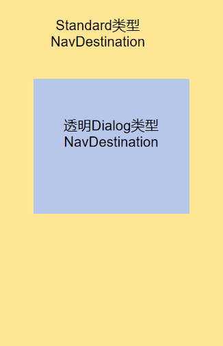

# Navigation

[Navigation](../reference/apis-arkui/arkui-ts/ts-basic-components-navigation.md)组件一般作为页面的根容器，包括单页面、分栏和自适应三种显示模式。Navigation组件适用于模块内页面切换，[一次开发，多端部署](../key-features/multi-device-app-dev/introduction.md)场景。通过组件级路由能力实现更加自然流畅的转场体验，并提供多种标题栏样式来呈现更好的标题和内容联动效果。[一次开发，多端部署](../key-features/multi-device-app-dev/introduction.md)场景下，Navigation组件能够自动适配窗口显示大小，在窗口较大的场景下自动切换分栏展示效果。

推荐使用Navigation路由栈[NavPathStack](../reference/apis-arkui/arkui-ts/ts-basic-components-navigation.md#navpathstack10)控制页面跳转，当前NavRouter作为Navigation子组件进行页面跳转的方式不做推荐。Navigation跳转子组件为[NavDestination](../reference/apis-arkui/arkui-ts/ts-basic-components-navdestination.md),NavDestination组件单独使用则不具备页面跳转能力。


## 设置页面显示模式

Navigation组件通过mode属性设置页面的显示模式。

- 自适应模式

  Navigation组件默认为自适应模式，此时mode属性为NavigationMode.Auto。自适应模式下，当设备宽度大于520vp时，Navigation组件采用分栏模式，反之采用单页面模式。


  ```
  Navigation() {
    ...
  }
  .mode(NavigationMode.Auto)
  ```

- 单页面模式

    **图1** 单页面布局示意图  

  

  将mode属性设置为NavigationMode.Stack，Navigation组件即可设置为单页面显示模式。


  ```ts
  Navigation() {
    ...
  }
  .mode(NavigationMode.Stack)
  ```

  

- 分栏模式

  **图2** 分栏布局示意图

  

  将mode属性设置为NavigationMode.Split，Navigation组件即可设置为分栏显示模式。


  ```ts
  @Entry
  @Component
  struct NavigationExample {
    @State TooTmp: ToolbarItem = {'value': "func", 'icon': "./image/ic_public_highlights.svg", 'action': ()=> {}}
    private arr: number[] = [1, 2, 3];
  
    build() {
      Column() {
        Navigation() {
          TextInput({ placeholder: 'search...' })
            .width("90%")
            .height(40)
            .backgroundColor('#FFFFFF')
  
          List({ space: 12 }) {
            ForEach(this.arr, (item:string) => {
              ListItem() {
                NavRouter() {
                  Text("NavRouter" + item)
                    .width("100%")
                    .height(72)
                    .backgroundColor('#FFFFFF')
                    .borderRadius(24)
                    .fontSize(16)
                    .fontWeight(500)
                    .textAlign(TextAlign.Center)
                  NavDestination() {
                    Text("NavDestinationContent" + item)
                  }
                  .title("NavDestinationTitle" + item)
                }
              }
            }, (item:string):string => item)
          }
          .width("90%")
          .margin({ top: 12 })
        }
        .title("主标题")
        .mode(NavigationMode.Split)
        .menus([
          {value: "", icon: "./image/ic_public_search.svg", action: ()=> {}},
          {value: "", icon: "./image/ic_public_add.svg", action: ()=> {}},
          {value: "", icon: "./image/ic_public_add.svg", action: ()=> {}},
          {value: "", icon: "./image/ic_public_add.svg", action: ()=> {}},
          {value: "", icon: "./image/ic_public_add.svg", action: ()=> {}}
        ])
        .toolbarConfiguration([this.TooTmp, this.TooTmp, this.TooTmp])
      }
      .height('100%')
      .width('100%')
      .backgroundColor('#F1F3F5')
    }
  }
  ```

  


## 设置标题栏模式

标题栏在界面顶部，用于呈现界面名称和操作入口，Navigation组件通过titleMode属性设置标题栏模式。

- Mini模式
  普通型标题栏，用于一级页面不需要突出标题的场景。

  **图3** Mini模式标题栏  

  


  ```ts
  Navigation() {
    ...
  }
  .titleMode(NavigationTitleMode.Mini)
  ```


- Full模式
  强调型标题栏，用于一级页面需要突出标题的场景。

    **图4** Full模式标题栏  

  


  ```ts
  Navigation() {
    ...
  }
  .titleMode(NavigationTitleMode.Full)
  ```


## 设置菜单栏

菜单栏位于Navigation组件的右上角，开发者可以通过menus属性进行设置。menus支持Array&lt;[NavigationMenuItem](../reference/apis-arkui/arkui-ts/ts-basic-components-navigation.md#navigationmenuitem类型说明)&gt;和CustomBuilder两种参数类型。使用Array&lt;NavigationMenuItem&gt;类型时，竖屏最多支持显示3个图标，横屏最多支持显示5个图标，多余的图标会被放入自动生成的更多图标。

**图5** 设置了3个图标的菜单栏  


```ts
let TooTmp: NavigationMenuItem = {'value': "", 'icon': "./image/ic_public_highlights.svg", 'action': ()=> {}}
Navigation() {
  ...
}
.menus([TooTmp,
  TooTmp,
  TooTmp])
```

图片也可以引用resources中的资源。

```ts
let TooTmp: NavigationMenuItem = {'value': "", 'icon': "resources/base/media/ic_public_highlights.svg", 'action': ()=> {}}
Navigation() {
  ...
}
.menus([TooTmp,
  TooTmp,
  TooTmp])
```

**图6** 设置了4个图标的菜单栏  


```ts
let TooTmp: NavigationMenuItem = {'value': "", 'icon': "./image/ic_public_highlights.svg", 'action': ()=> {}}
Navigation() {
  ...
}
.menus([TooTmp,
  TooTmp,
  TooTmp,
  TooTmp])
```


## 设置工具栏

工具栏位于Navigation组件的底部，开发者可以通过toolbarConfiguration属性进行设置。


  **图7** 工具栏  


```ts
let TooTmp: ToolbarItem = {'value': "func", 'icon': "./image/ic_public_highlights.svg", 'action': ()=> {}}
let TooBar: ToolbarItem[] = [TooTmp,TooTmp,TooTmp]
Navigation() {
  ...
}
.toolbarConfiguration(TooBar)
```

## 设置子页面的类型

NavDestination作为子页面的根容器，用于显示Navigation的内容区，其mode属性可以设置子页面的类型。

- 标准类型

  NavDestination组件默认为标准类型，此时mode属性为NavDestinationMode.STANDARD。标准类型NavDestination的生命周期跟随NavPathStack栈中标准Destination变化而改变。

- 弹窗类型

  **图8** 弹窗类型的页面示意图

  

  将mode属性设置为NavDestinationMode.DIALOG，此时NavDestination组件是弹窗类型，整个组件透明。通过给组件添加背景等，实现想要的弹窗效果。

  ```ts
  // Index.ets
  @Component
  struct Page01 {

    @Consume('pageInfos') pageInfos: NavPathStack;

    build() {
      NavDestination() {
        Button('push Page01')
          .width('80%')
          .onClick(() => {
            this.pageInfos.pushPathByName('Page01', '');
          })
          .margin({top: 10, bottom: 10})
        Button('push Dialog01')
          .width('80%')
          .onClick(() => {
            this.pageInfos.pushPathByName('Dialog01', '');
          })
          .margin({top: 10, bottom: 10})
      }
      .title('Page01')
    }
  }

  @Component
  struct Dialog01 {

    @Consume('pageInfos') pageInfos: NavPathStack;

    build() {
      NavDestination() {
        Stack() {
          Column()
            .width('100%')
            .height('100%')
            .backgroundColor(Color.Gray)
            .opacity(0.1)
            .onClick(() => {
              this.pageInfos.pop();
            })
          // Add controls for business processing
          Column() {
            Text('Dialog01')
              .fontSize(30)
              .fontWeight(2)
            Button('push Page01')
              .width('80%')
              .onClick(() => {
                this.pageInfos.pushPathByName('Page01', '');
              })
              .margin({top: 10, bottom: 10})
            Button('push Dialog01')
              .width('80%')
              .onClick(() => {
                this.pageInfos.pushPathByName('Dialog01', '');
              })
              .margin({top: 10, bottom: 10})
            Button('pop')
              .width('80%')
              .onClick(() => {
                this.pageInfos.pop();
              })
              .margin({top: 10, bottom: 10})
          }
          .padding(10)
          .width(250)
          .backgroundColor(Color.White)
          .borderRadius(10)
        }
      }
      .hideTitleBar(true)
      // Set the mode property of this NavDestination to DIALOG
      .mode(NavDestinationMode.DIALOG)
    }
  }

  @Entry
  @Component
  struct Index {
    @Provide('NavPathStack') pageInfos: NavPathStack = new NavPathStack()
    isLogin: boolean = false;

    @Builder
    PagesMap(name: string) {
      if (name == 'Page01') {
        Page01()
      } else if (name == 'Dialog01') {
        Dialog01()
      }
    }

    build() {
      Navigation(this.pageInfos) {
        Button('push Page01')
          .width('80%')
          .onClick(() => {
            this.pageInfos.pushPathByName('Page01', '');
          })
      }
      .mode(NavigationMode.Stack)
      .titleMode(NavigationTitleMode.Mini)
      .title('主页')
      .navDestination(this.PagesMap)
    }
  }
  ```

  

## 使用系统路由表

针对通过Navigation的navDestination属性配置页面跳转的方式。跳转到其他模块(hsp/har)的页面中，首先需要将跳转目标模块依赖项配置到主工程的module.json5文件中，然后将跳转目标页面通过import的方式导入。这种方式容易造成不同模块依赖耦合的问题，以及首页加载时间长的问题。使用系统路由表的方式，可以不用配置不同跳转模块间的依赖，并且当发生页面跳转时，未跳转页面不会加载，已经加载过的页面不会再次加载。

1. 在跳转目标模块的配置文件module.json5添加路由表配置：

    ```json
      {
        "module" : {
          "routerMap": "$profile:route_map"
        }
      }
    ```

2. 添加完路由配置文件地址后，需要在工程resources/base/profile中创建route_map.json文件。文件内容如下所示：

    ```json
      {
        "routerMap": [
          {
            "name": "PageOne",
            "pageSourceFile": "src/main/ets/pages/PageOne.ets",
            "buildFunction": "PageOneBuilder",
            "data": {
              "description" : "this is PageOne"
            }
          }
        ]
      }
    ```

    | 配置项 | 说明 |
    |---|---|
    | name | 跳转页面名称。|
    | pageSourceFile | 跳转目标页在包内的路径，相对src目录的相 对路径。|
    | buildFunction | 跳转目标页的入口函数名称，必须以@Builder修饰。 |
    | data | 应用自定义字段。可以通过配置项读取接口getConfigInRouteMap获取。|

3. 在跳转目标页面中，需要配置入口Builder函数，函数名称需要和router_map.json配置文件中的buildFunction保持一致，否则在编译时会报错。通过pushPathByName(name, param)等接口进行页面跳转，入口Builder函数会将跳转参数name,param作为执行函数入参。

    ```ts
      // 跳转页面入口函数
      @Builder
      export function PageOneBuilder(name: string,param: Object) {
        PageOne({name: string, pram: param})
      }

      @Component
      struct PageOne {
        name: string = "";
        param: Object;
        build() {
          NavDestination() {}
        }
      }
    ```

应用通过调用pushDestinationByName等方式，可以获取跳转目标页面的错误信息。

## 自定义路由表跳转

1. 定义配置路由加载项，在加载项中配置对应加载项的页面名称，模块名称和模块路径。

    ```ts
      class RouteItem {
        name: string;
        pageModule: string;
        pagePath: string;
      }
    ```

2. 也可以将上述配置项配置在资源文件中，通过资源管理[@ohos.resourceManager](../reference/apis-localization-kit/js-apis-resource-manager.md)将文件读取后解析出对应字段。

3. 将路由表中的页面配置到Navigation定义页所在工程的依赖配置文件oh_packages.json5中。

    ```json
      {
        "dependency": {
          "dynamicRouter": "file:../dynamicRouter", // 外部依赖配置项
          ...
        }
      }
    ```

4. 将路由表中的依赖动态加载的文件配置到oh-packages.json中，可以参考如下配置：

    ```json
      {
        "buildOption": {
          "sourceOption": {
            "dynamicImport": [
              './PageOne', // 本包的文件路径
              "dynamicRouter" // 跨包的名称
            ]
          }
        }
      }
    ```

5. 提供路由管理类，注册WrapBuilder方法。

    ```ts
      registerRouteMap(name: string, builder: WrapperBuilder<[object]>)
      {
        DynamicRouter.builderMap.set(name, builder);
      }

      async push(info: RouterInfo, param?: string)
      {
        try {
          let result = await import(info.moduleName);
          result.harInit(info.pageName);
          DynamicRouter.getNavPathStack().pushPathByName(info.name);
        } catch(err) {
          logger.error(LOGGER_TAG, err);
        }
      }
    ```

6. 针对跳转目标页面，需要调用注册函数将页面注册到页面跳转列表中。

    ```ts
      @Builder
      export function getVibrateEffectView() {
        VibrateEffectView()
      }

      DynamicRouter.registerRouterMap(RouterInfo.VIBRATE_EFFECT, wrapBuilder(getVibrateEffectView));
    ```

## 相关实例
自定义路由表开发可以参考如下示例Sample：

- [动态路由 (ArkTS) (Full SDK) API(12) ](https://gitee.com/openharmony/applications_app_samples/tree/master/code/BasicFeature/ApplicationModels/DynamicRouter)