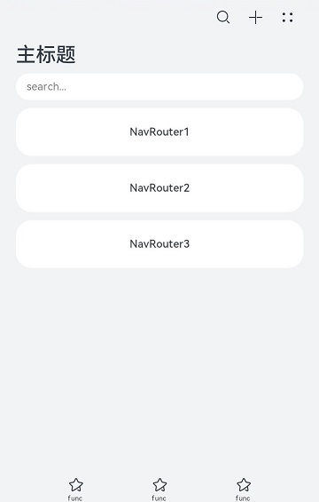
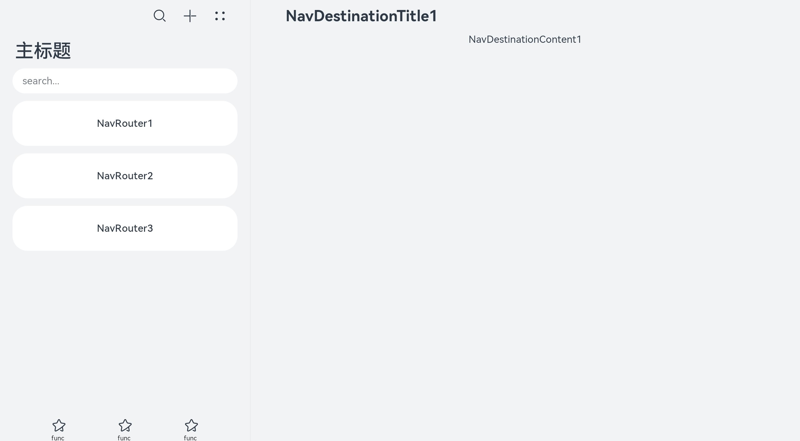

# Navigation


[Navigation](../reference/arkui-ts/ts-basic-components-navigation.md)组件一般作为页面的根容器，包括单页面、分栏和自适应三种显示模式。同时，Navigation提供了属性来设置页面的标题栏、工具栏、导航栏等。


Navigation组件的页面包含主页和内容页。主页由标题栏、内容区和工具栏组成，可在内容区中使用[NavRouter](../reference/arkui-ts/ts-basic-components-navrouter.md)子组件实现导航栏功能。内容页主要显示[NavDestination](../reference/arkui-ts/ts-basic-components-navdestination.md)子组件中的内容。


NavRouter是和Navigation搭配使用的特殊子组件，默认提供点击响应处理，不需要开发者自定义点击事件逻辑。NavRouter有且仅有两个根节点，第二个根节点是NavDestination。NavDestination是和NavRouter搭配使用的特殊子组件，用于显示Navigation组件的内容页。当开发者点击NavRouter组件时，会跳转到对应的NavDestination内容区。


## 设置页面显示模式

Navigation组件通过mode属性设置页面的显示模式。

- 自适应模式

  Navigation组件默认为自适应模式，此时mode属性为NavigationMode.Auto。自适应模式下，当设备宽度大于520vp时，Navigation组件采用分栏模式，反之采用单页面模式。


  ```
  Navigation() {
    ...
  }
  .mode(NavigationMode.Auto)
  ```

- 单页面模式

    **图1** 单页面布局示意图  

  

  将mode属性设置为NavigationMode.Stack，Navigation组件即可设置为单页面显示模式。


  ```ts
  Navigation() {
    ...
  }
  .mode(NavigationMode.Stack)
  ```

  

- 分栏模式

  **图2** 分栏布局示意图

  

  将mode属性设置为NavigationMode.Split，Navigation组件即可设置为分栏显示模式。


  ```ts
  @Entry
  @Component
  struct NavigationExample {
    private arr: number[] = [1, 2, 3];
  
    build() {
      Column() {
        Navigation() {
          TextInput({ placeholder: 'search...' })
            .width("90%")
            .height(40)
            .backgroundColor('#FFFFFF')
  
          List({ space: 12 }) {
            ForEach(this.arr, (item) => {
              ListItem() {
                NavRouter() {
                  Text("NavRouter" + item)
                    .width("100%")
                    .height(72)
                    .backgroundColor('#FFFFFF')
                    .borderRadius(24)
                    .fontSize(16)
                    .fontWeight(500)
                    .textAlign(TextAlign.Center)
                  NavDestination() {
                    Text("NavDestinationContent" + item)
                  }
                  .title("NavDestinationTitle" + item)
                }
              }
            }, item => item)
          }
          .width("90%")
          .margin({ top: 12 })
        }
        .title("主标题")
        .mode(NavigationMode.Split)
        .menus([
          {value: "", icon: "./image/ic_public_search.svg", action: ()=> {}},
          {value: "", icon: "./image/ic_public_add.svg", action: ()=> {}},
          {value: "", icon: "./image/ic_public_add.svg", action: ()=> {}},
          {value: "", icon: "./image/ic_public_add.svg", action: ()=> {}},
          {value: "", icon: "./image/ic_public_add.svg", action: ()=> {}}
        ])
        .toolBar({items: [
          {value: "func", icon: "./image/ic_public_highlights.svg", action: ()=> {}},
          {value: "func", icon: "./image/ic_public_highlights.svg", action: ()=> {}},
          {value: "func", icon: "./image/ic_public_highlights.svg", action: ()=> {}}
        ]})
      }
      .height('100%')
      .width('100%')
      .backgroundColor('#F1F3F5')
    }
  }
  ```

  


## 设置标题栏模式

标题栏在界面顶部，用于呈现界面名称和操作入口，Navigation组件通过titleMode属性设置标题栏模式。

- Mini模式
  普通型标题栏，用于一级页面不需要突出标题的场景。

  **图3** Mini模式标题栏  

  


  ```ts
  Navigation() {
    ...
  }
  .titleMode(NavigationTitleMode.Mini)
  ```


- Full模式
  强调型标题栏，用于一级页面需要突出标题的场景。

    **图4** Full模式标题栏  

  


  ```ts
  Navigation() {
    ...
  }
  .titleMode(NavigationTitleMode.Full)
  ```


## 设置菜单栏

菜单栏位于Navigation组件的右上角，开发者可以通过menus属性进行设置。menus支持Array&lt;[NavigationMenuItem](../reference/arkui-ts/ts-basic-components-navigation.md#navigationmenuitem%E7%B1%BB%E5%9E%8B%E8%AF%B4%E6%98%8E)&gt;和CustomBuilder两种参数类型。使用Array&lt;NavigationMenuItem&gt;类型时，竖屏最多支持显示3个图标，横屏最多支持显示5个图标，多余的图标会被放入自动生成的更多图标。

**图5** 设置了3个图标的菜单栏  


```ts
Navigation() {
  ...
}
.menus([{value: "", icon: "./image/ic_public_search.svg", action: ()=>{}},
        {value: "", icon: "./image/ic_public_add.svg", action: ()=>{}},
        {value: "", icon: "./image/ic_public_add.svg", action: ()=>{}}])
```

**图6** 设置了4个图标的菜单栏  


```ts
Navigation() {
  ...
}
.menus([{value: "", icon: "./image/ic_public_search.svg", action: ()=>{}},
        {value: "", icon: "./image/ic_public_add.svg", action: ()=>{}},
        {value: "", icon: "./image/ic_public_add.svg", action: ()=>{}},
        {value: "", icon: "./image/ic_public_add.svg", action: ()=>{}}])
```


## 设置工具栏

工具栏位于Navigation组件的底部，开发者可以通过toolBar属性进行设置。


  **图7** 工具栏  


```ts
Navigation() {
  ...
}
.toolBar({items:[
        {value: "func", icon: "./image/ic_public_highlights.svg", action: ()=>{}},
        {value: "func", icon: "./image/ic_public_highlights.svg", action: ()=>{}},
        {value: "func", icon: "./image/ic_public_highlights.svg", action: ()=>{}}]})
```
