# 选项卡 (Tabs)
<!--Kit: ArkUI-->
<!--Subsystem: ArkUI-->
<!--Owner: @CCFFWW-->
<!--Designer: @CCFFWW-->
<!--Tester: @lxl007-->
<!--Adviser: @HelloCrease-->


当页面信息较多时，为了让用户能够聚焦于当前显示的内容，需要对页面内容进行分类，提高页面空间利用率。[Tabs](../reference/apis-arkui/arkui-ts/ts-container-tabs.md)组件可以在一个页面内快速实现视图内容的切换，一方面提升查找信息的效率，另一方面精简用户单次获取到的信息量。


## 基本布局

  Tabs组件的页面组成包含两个部分，分别是TabContent和TabBar。TabContent是内容页，TabBar是导航页签栏，页面结构如下图所示，根据不同的导航类型，布局会有区别，可以分为底部导航、顶部导航、侧边导航，其导航栏分别位于底部、顶部和侧边。

  **图1** Tabs组件布局示意图  

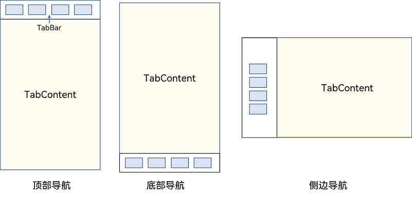


>**说明：**
>
> - TabContent组件不支持设置通用宽度属性，其宽度默认撑满Tabs父组件。
>
> - TabContent组件不支持设置通用高度属性，其高度由Tabs父组件高度与TabBar组件高度决定。


Tabs使用花括号包裹TabContent，如图2，其中TabContent显示相应的内容页。


  **图2** Tabs与TabContent使用  


每一个TabContent对应的内容需要有一个页签，可以通过TabContent的tabBar属性进行配置。在如下TabContent组件上设置tabBar属性，可以设置其对应页签中的内容，tabBar作为内容的页签。

```ts
 TabContent() {
   Text('首页的内容').fontSize(30)
 }
.tabBar('首页')
```


设置多个内容时，需在Tabs内按照顺序放置。

```ts
Tabs() {
  TabContent() {
    Text('首页的内容').fontSize(30)
  }
  .tabBar('首页')

  TabContent() {
    Text('推荐的内容').fontSize(30)
  }
  .tabBar('推荐')

  TabContent() {
    Text('发现的内容').fontSize(30)
  }
  .tabBar('发现')
  
  TabContent() {
    Text('我的内容').fontSize(30)
  }
  .tabBar("我的")
}
```


## 底部导航

底部导航是应用中最常见的一种导航方式。底部导航位于应用一级页面的底部，用户打开应用，能够分清整个应用的功能分类，以及页签对应的内容，并且其位于底部更加方便用户单手操作。底部导航一般作为应用的主导航形式存在，其作用是将用户关心的内容按照功能进行分类，迎合用户使用习惯，方便在不同模块间的内容切换。


  **图3** 底部导航栏  

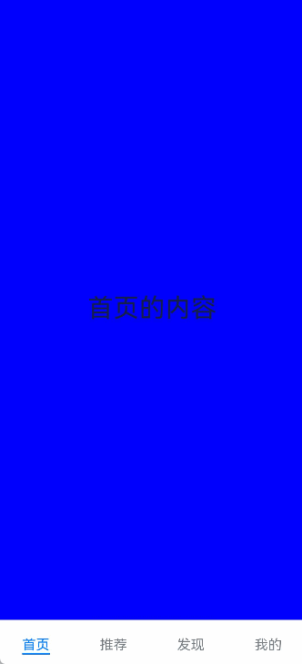


导航栏位置使用Tabs的barPosition参数进行设置。默认情况下，导航栏位于顶部，此时，barPosition为BarPosition.Start。设置为底部导航时，需要将barPosition设置为BarPosition.End。


```ts
Tabs({ barPosition: BarPosition.End }) {
  // TabContent的内容：首页、发现、推荐、我的
  // ...
}
```

底部导航栏可通过设置TabContent的[BottomTabBarStyle](../reference/apis-arkui/arkui-ts/ts-container-tabcontent.md#bottomtabbarstyle9)来实现底部页签样式，详细示例请参考：[示例9（设置底部页签使用symbol图标）](../reference/apis-arkui/arkui-ts/ts-container-tabcontent.md#示例9设置底部页签使用symbol图标)。


## 顶部导航

当内容分类较多，用户对不同内容的浏览概率相差不大，需要经常快速切换时，一般采用顶部导航模式进行设计，作为对底部导航内容的进一步划分，常见一些资讯类应用对内容的分类为关注、视频、数码，或者主题应用中对主题进行进一步划分为图片、视频、字体等。

  **图4** 顶部导航栏  

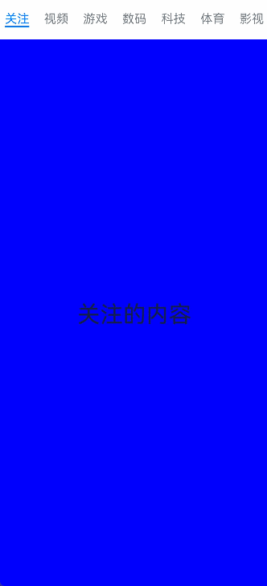


```ts
Tabs({ barPosition: BarPosition.Start }) {
  // TabContent的内容:关注、视频、游戏、数码、科技、体育、影视
  // ...
}
```


## 侧边导航

侧边导航是应用较为少见的一种导航模式，更多适用于横屏界面，用于对应用进行导航操作，由于用户的视觉习惯是从左到右，侧边导航栏默认为左侧侧边栏。


  **图5** 侧边导航栏  

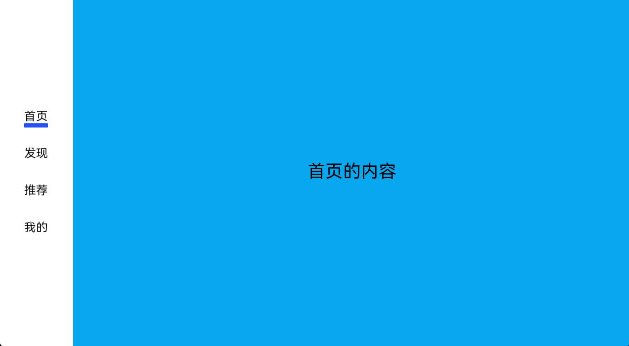


实现侧边导航栏需要将Tabs的vertical属性设置为true，vertical默认值为false，表明内容页和导航栏垂直方向排列。


```ts
Tabs({ barPosition: BarPosition.Start }) {
  // TabContent的内容:首页、发现、推荐、我的
  // ...
}
.vertical(true)
.barWidth(100)
.barHeight(200)
```


>**说明：**
>
> - vertical为false时，tabbar的宽度默认为撑满屏幕的宽度，需要设置barWidth为合适值。
>
> - vertical为true时，tabbar的高度默认为实际内容的高度，需要设置barHeight为合适值。


## 限制导航栏的滑动切换

  默认情况下，导航栏都支持滑动切换，在一些内容信息量需要进行多级分类的页面，如支持底部导航+顶部导航组合的情况下，底部导航栏的滑动效果与顶部导航出现冲突，此时需要限制底部导航的滑动，避免引起不好的用户体验。
  
  **图6** 限制底部导航栏滑动  

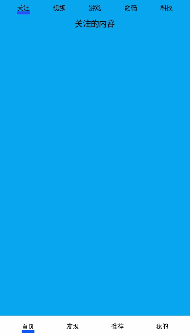


控制滑动切换的属性为scrollable，默认值为true，表示可以滑动，若要限制滑动切换页签则需要设置为false。

```ts
Tabs({ barPosition: BarPosition.End }) {
  TabContent(){
    Column(){
      Tabs(){
        // 顶部导航栏内容
        // ...
      }
    }
    .backgroundColor('#ff08a8f1')
    .width('100%')
  }
  .tabBar('首页')

  // 其他TabContent内容：发现、推荐、我的
  // ...
}
.scrollable(false)
```


## 固定导航栏

当内容分类较为固定且不具有拓展性时，例如底部导航内容分类一般固定，分类数量一般在3-5个，此时使用固定导航栏。固定导航栏不可滚动，无法被拖拽滚动，内容均分tabBar的宽度。


  **图7** 固定导航栏 


Tabs的barMode属性用于控制导航栏是否可以滚动，默认值为BarMode.Fixed。

```ts
Tabs({ barPosition: BarPosition.End }) {
  // TabContent的内容：首页、发现、推荐、我的
  // ...
}
.barMode(BarMode.Fixed)
```


## 滚动导航栏

滚动导航栏可以用于顶部导航栏或者侧边导航栏的设置，内容分类较多，屏幕宽度无法容纳所有分类页签的情况下，需要使用可滚动的导航栏，支持用户点击和滑动来加载隐藏的页签内容。


  **图8** 可滚动导航栏  

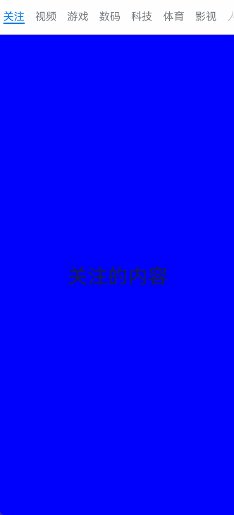


滚动导航栏需要设置Tabs组件的barMode属性，默认值为BarMode.Fixed表示为固定导航栏，BarMode.Scrollable表示可滚动导航栏。

```ts
Tabs({ barPosition: BarPosition.Start }) {
  // TabContent的内容：关注、视频、游戏、数码、科技、体育、影视、人文、艺术、自然、军事
  // ...
}
.barMode(BarMode.Scrollable)
```


## 自定义导航栏

对于底部导航栏，一般作为应用主页面功能区分，为了更好的用户体验，会组合文字以及对应语义图标表示页签内容，这种情况下，需要自定义导航页签的样式。


  **图9** 自定义导航栏  

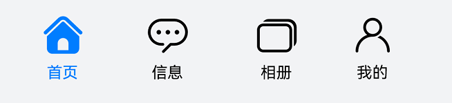


系统默认情况下采用了下划线标志当前活跃的页签，而自定义导航栏需要自行实现相应的样式，用于区分当前活跃页签和未活跃页签。


设置自定义导航栏需要使用tabBar的参数，以其支持的CustomBuilder的方式传入自定义的函数组件样式。例如这里声明tabBuilder的自定义函数组件，传入参数包括页签文字title，对应位置index，以及选中状态和未选中状态的图片资源。通过当前活跃的currentIndex和页签对应的targetIndex匹配与否，决定UI显示的样式。

```ts
@State currentIndex: number = 0;

@Builder tabBuilder(title: string, targetIndex: number, selectedImg: Resource, normalImg: Resource) {
  Column() {
    Image(this.currentIndex === targetIndex ? selectedImg : normalImg)
      .size({ width: 25, height: 25 })
    Text(title)
      .fontColor(this.currentIndex === targetIndex ? '#1698CE' : '#6B6B6B')
  }
  .width('100%')
  .height(50)
  .justifyContent(FlexAlign.Center)
}
```


在TabContent对应tabBar属性中传入自定义函数组件，并传递相应的参数。

```ts
TabContent() {
  Column(){
    Text('我的内容')  
  }
  .width('100%')
  .height('100%')
  .backgroundColor('#007DFF')
}
.tabBar(this.tabBuilder('我的', 0, $r('app.media.mine_selected'), $r('app.media.mine_normal')))
```


## 切换至指定页签

在不使用自定义导航栏时，默认的Tabs会实现切换逻辑。在使用了自定义导航栏后，默认的Tabs仅实现滑动内容页和点击页签时内容页的切换逻辑，页签切换逻辑需要自行实现。即用户滑动内容页和点击页签时，页签栏需要同步切换至内容页对应的页签。


  **图10** 内容页和页签不联动  

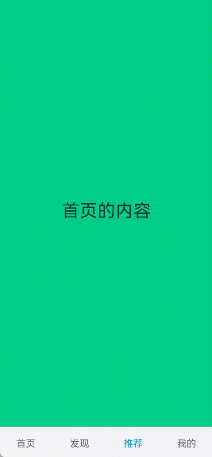

此时需要使用Tabs提供的onSelected事件方法，监听索引index的变化，并将选中元素的index值传递给selectIndex，实现页签的切换。

```ts
@Entry
@Component
struct TabsExample1 {
  @State selectIndex: number = 0;
  @Builder tabBuilder(title: string, targetIndex: number) {
    Column() {
      Text(title)
        .fontColor(this.selectIndex === targetIndex ? '#1698CE' : '#6B6B6B')
    }
  }

  build() {
    Column() {
      Tabs({ barPosition: BarPosition.End }) {
        TabContent() {
          Text("首页内容").width('100%').height('100%').backgroundColor('rgb(213,213,213)')
            .fontSize(40).fontColor(Color.Black).textAlign(TextAlign.Center)
        }.tabBar(this.tabBuilder('首页', 0))

        TabContent() {
          Text("发现内容").width('100%').height('100%').backgroundColor('rgb(112,112,112)')
            .fontSize(40).fontColor(Color.Black).textAlign(TextAlign.Center)
        }.tabBar(this.tabBuilder('发现', 1))

        TabContent() {
          Text("推荐内容").width('100%').height('100%').backgroundColor('rgb(39,135,217)')
            .fontSize(40).fontColor(Color.Black).textAlign(TextAlign.Center)
        }.tabBar(this.tabBuilder('推荐', 2))

        TabContent() {
          Text("我的内容").width('100%').height('100%').backgroundColor('rgb(0,74,175)')
            .fontSize(40).fontColor(Color.Black).textAlign(TextAlign.Center)
        }.tabBar(this.tabBuilder('我的', 3))
      }
      .animationDuration(0)
      .backgroundColor('#F1F3F5')
      .onSelected((index: number) => {
        this.selectIndex = index;
      })
    }.width('100%')
  }
}
```
  **图11** 内容页和页签联动  

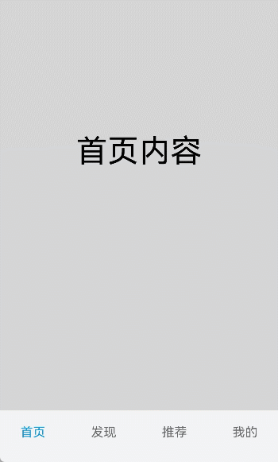

若希望不滑动内容页和点击页签也能实现内容页和页签的切换，可以将currentIndex传给Tabs的index参数，通过改变currentIndex来实现跳转至指定索引值对应的TabContent内容。也可以使用TabsController，TabsController是Tabs组件的控制器，用于控制Tabs组件进行内容页切换。通过TabsController的changeIndex方法来实现跳转至指定索引值对应的TabContent内容。
```ts
@State currentIndex: number = 2;
@State currentAnimationMode: AnimationMode = AnimationMode.CONTENT_FIRST;
private controller: TabsController = new TabsController();

Tabs({ barPosition: BarPosition.End, index: this.currentIndex, controller: this.controller }) {
  // ...
}
.height(600)
.animationMode(this.currentAnimationMode)
.onChange((index: number) => {
   this.currentIndex = index;
})

Button('动态修改AnimationMode').width('50%').margin({ top: 1 }).height(25)
  .onClick(()=>{
    if (this.currentAnimationMode === AnimationMode.CONTENT_FIRST) {
      this.currentAnimationMode = AnimationMode.ACTION_FIRST;
    } else if (this.currentAnimationMode === AnimationMode.ACTION_FIRST) {
      this.currentAnimationMode = AnimationMode.NO_ANIMATION;
    } else if (this.currentAnimationMode === AnimationMode.NO_ANIMATION) {
      this.currentAnimationMode = AnimationMode.CONTENT_FIRST_WITH_JUMP;
    } else if (this.currentAnimationMode === AnimationMode.CONTENT_FIRST_WITH_JUMP) {
      this.currentAnimationMode = AnimationMode.ACTION_FIRST_WITH_JUMP;
    } else if (this.currentAnimationMode === AnimationMode.ACTION_FIRST_WITH_JUMP) {
      this.currentAnimationMode = AnimationMode.CONTENT_FIRST;
    }
})

Button('动态修改index').width('50%').margin({ top: 20 })
  .onClick(()=>{
    this.currentIndex = (this.currentIndex + 1) % 4;
})

Button('changeIndex').width('50%').margin({ top: 20 })
  .onClick(()=>{
    let index = (this.currentIndex + 1) % 4;
    this.controller.changeIndex(index);
})
```
  
  **图12** 切换指定页签    

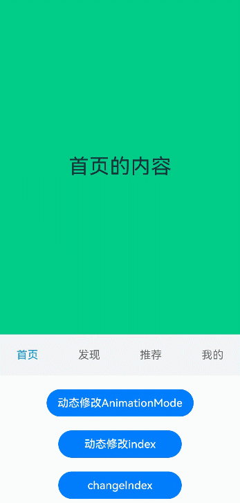

开发者可以通过Tabs组件的onContentWillChange接口，设置自定义拦截回调函数。拦截回调函数在下一个页面即将展示时被调用，如果回调返回true，新页面可以展示；如果回调返回false，新页面不会展示，仍显示原来页面。
  
```ts
Tabs({ barPosition: BarPosition.End, controller: this.controller, index: this.currentIndex }) {
  // ...
  }
  .onContentWillChange((currentIndex, comingIndex) => {
    if (comingIndex == 2) {
      return false;
    }
    return true;
  })
```
  **图13** 支持开发者自定义页面切换拦截事件 


<!--Del-->
## 支持适老化

在适老化大字体场景下，底部页签提供大字体弹窗显示内容。当组件识别到大字体时，基于设置的文字和图标等内容，构建长按提示弹窗。当用户长按弹窗后，滑动到下一个页签位置时，使用新页签的弹窗提示内容替换上一个页签提示内容，抬手关闭弹窗并切换到对应TabContent内容页。

>  **说明：** 
>
> 弹窗只适用于底部页签BottomTabBarStyle。

**图14** 在适老化场景下通过长按底部页签显示适老化弹窗。

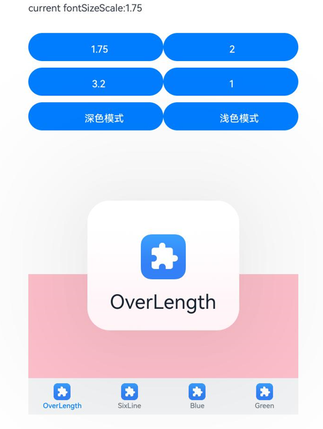

```ts
import { abilityManager, Configuration } from '@kit.AbilityKit';
import { BusinessError } from '@kit.BasicServicesKit';
import { uiAppearance } from '@kit.ArkUI';

@Entry
@Component
struct Demo {
  @State fontColor: string = '#182431';
  @State selectedFontColor: string = '#007DFF';
  @State currentIndex: number = 0;
  @State currentFontSizeScale: string = '';
  @State showBuilderTab: boolean = false;
  @State fontSize: number = 15;
  private darkModeKey: string[] = Object.keys(uiAppearance.DarkMode).filter(
    key => typeof uiAppearance.DarkMode[key] === 'number');

  async setFontScale(scale: number): Promise<void> {
    let configInit: Configuration = {
      fontSizeScale: scale,
    };
    abilityManager.updateConfiguration(configInit, (err: BusinessError) => {
      if (err) {
        console.error(`updateConfiguration fail, err: ${JSON.stringify(err)}`);
        this.getUIContext().getPromptAction().showToast({ message: `scale:${scale}, err:${JSON.stringify(err)}` });
      } else {
        this.currentFontSizeScale = String(scale);
        if (scale > 1) {
          this.fontSize = 8;
        } else {
          this.fontSize = 15;
        }
        console.log('updateConfiguration success.');
        this.getUIContext().getPromptAction().showToast({ message: `scale:${scale}, updateConfiguration success.` });
      }
    });
  }

  darkMode(isDarkMode: boolean): void {
    let mode: uiAppearance.DarkMode = uiAppearance.DarkMode.ALWAYS_LIGHT;
    if (isDarkMode) {
      mode = uiAppearance.DarkMode.ALWAYS_DARK;
    }
    if (mode == uiAppearance.getDarkMode()) {
      console.info(`TitleDarkMode Set ${this.darkModeKey[mode]} successfully.`);
      return;
    }
    try {
      uiAppearance.setDarkMode(mode).then(() => {
        console.info(`TitleDarkMode Set ${this.darkModeKey[mode]} successfully.`);
      }).catch((error: Error) => {
        console.error(`TitleDarkMode Set ${this.darkModeKey[mode]} failed, ${error.message}`);
      });
    } catch (error) {
      let message = (error as BusinessError).message;
      console.error(`TitleDarkMode Set dark-mode failed, ${message}`);
    }
  }

  build() {
    Column() {
      Column() {
        Row() {
          Text(`current fontSizeScale:${this.currentFontSizeScale}`)
            .margin({ top: 5, bottom: 5 })
            .fontSize(this.fontSize)
        }

        Row() {
          Button('1.75')
            .margin({ top: 5, bottom: 5 })
            .fontSize(this.fontSize)
            .width('40%')
            .onClick(async () => {
              await this.setFontScale(1.75);
            })
          Button('2')
            .margin({ top: 5, bottom: 5 })
            .fontSize(this.fontSize)
            .width('40%')
            .onClick(async () => {
              await this.setFontScale(2);
            })
        }.margin({ top: 25 })

        Row() {
          Button('3.2')
            .margin({ top: 5, bottom: 5 })
            .fontSize(this.fontSize)
            .width('40%')
            .onClick(async () => {
              await this.setFontScale(3.2);
            })
          Button('1')
            .margin({ top: 5, bottom: 5 })
            .fontSize(this.fontSize)
            .width('40%')
            .onClick(async () => {
              await this.setFontScale(1);
            })
        }

        Row() {
          Button('深色模式')
            .margin({ top: 5, bottom: 5 })
            .fontSize(this.fontSize)
            .width('40%')
            .onClick(async () => {
              this.darkMode(true);
            })
          Button('浅色模式')
            .margin({ top: 5, bottom: 5 })
            .fontSize(this.fontSize)
            .width('40%')
            .onClick(async () => {
              this.darkMode(false);
            })
        }
      }.alignItems(HorizontalAlign.Start)

      Column() {
        Tabs({ barPosition: BarPosition.End }) {
          TabContent() {
            Column().width('100%').height('100%').backgroundColor(Color.Pink)
          }.tabBar(new BottomTabBarStyle($r('sys.media.ohos_app_icon'), 'OverLength'))
          TabContent() {
            Column().width('100%').height('100%').backgroundColor(Color.Yellow)
          }.tabBar(new BottomTabBarStyle($r('sys.media.ohos_app_icon'), 'SixLine'))
          TabContent() {
            Column().width('100%').height('100%').backgroundColor(Color.Blue)
          }.tabBar(new BottomTabBarStyle($r('sys.media.ohos_app_icon'), 'Blue'))
          TabContent() {
            Column().width('100%').height('100%').backgroundColor(Color.Green)
          }.tabBar(new BottomTabBarStyle($r('sys.media.ohos_app_icon'), 'Green'))
        }
        .vertical(false)
        .scrollable(true)
        .barMode(BarMode.Fixed)
        .onChange((index: number) => {
          console.info(index.toString());
        })
        .width('100%')
        .backgroundColor(0xF1F3F5)
      }.width('80%').height(200)
      .margin({ top: 200 })
    }.width('100%')
  }
}
```
<!--DelEnd-->

## 控制页面缓存数

从API version 19开始，开发者可以通过[cachedMaxCount](../reference/apis-arkui/arkui-ts/ts-container-tabs.md#cachedmaxcount19)接口，设置子组件的最大缓存个数和缓存模式。默认情况下Tabs创建时会一次性预加载所有TabContent，而且已加载的页面不会释放，可能会带来性能内存问题。此时可以设置[cachedMaxCount](../reference/apis-arkui/arkui-ts/ts-container-tabs.md#cachedmaxcount19)属性控制缓存的页面数量，设置此属性后不会进行页面预加载，使用懒加载机制(仅切换到页面时才加载)，当切换页面时根据所设置的[TabsCacheMode](../reference/apis-arkui/arkui-ts/ts-container-tabs.md#tabscachemode19枚举说明)决定保留缓存或者释放页面。

>  **说明：** 
>
> 1.TabsCacheMode枚举值为CACHE_BOTH_SIDE时，缓存当前显示的子组件和其两侧的子组件。
>
> 2.TabsCacheMode枚举值为CACHE_LATEST_SWITCHED时，缓存当前显示的子组件和最近切换过的子组件。
>
> 3.存在翻页动画时，从页面1直接切换到页面3，翻页动画会包含页面2，页面2也会被加载，如果此时页面2不在缓存范围内，页面切换完成后会立马释放。

**图15** 在页面缓存场景下通过点击yellow按键切换界面。

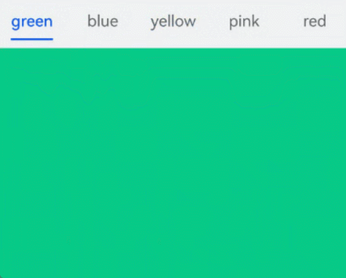
```ts
@Entry
@Component
struct TabsExample {
  build() {
    Tabs() {
      TabContent() {
        MyComponent({ color: '#00CB87' })
      }.tabBar(SubTabBarStyle.of('green'))

      TabContent() {
        MyComponent({ color: '#007DFF' })
      }.tabBar(SubTabBarStyle.of('blue'))

      TabContent() {
        MyComponent({ color: '#FFBF00' })
      }.tabBar(SubTabBarStyle.of('yellow'))

      TabContent() {
        MyComponent({ color: '#E67C92' })
      }.tabBar(SubTabBarStyle.of('pink'))

      TabContent() {
        MyComponent({ color: '#FF0000' })
      }.tabBar(SubTabBarStyle.of('red'))
    }
    .width(360)
    .height(296)
    .backgroundColor('#F1F3F5')
    .cachedMaxCount(1, TabsCacheMode.CACHE_BOTH_SIDE)
  }
}

@Component
struct MyComponent {
  private color: string = '';

  aboutToAppear(): void {
    console.info('aboutToAppear backgroundColor:' + this.color);
  }

  aboutToDisappear(): void {
    console.info('aboutToDisappear backgroundColor:' + this.color);
  }

  build() {
    Column()
      .width('100%')
      .height('100%')
      .backgroundColor(this.color)
  }
}
```
基于以上示例代码为例，不同场景下的缓存策略如下：

1. 如图16所示，使用默认翻页动画，CACHE_BOTH_SIDE模式，n设置为2，点击TabBar切换到yellow页，TabContent1~3被缓存。再切换到red页，TabContenet1~2释放，TabContent3~5被缓存。

**图16** 默认翻页动画，CACHE_BOTH_SIDE模式示意图

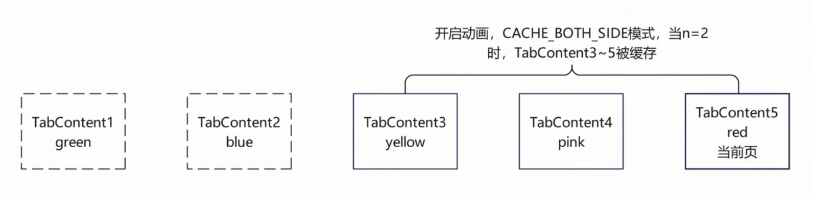

2. 如图17所示，使用默认翻页动画，CACHE_LATEST_SWITCHED模式，n设置为2，点击TabBar切换到yellow页，TabContent1、3被缓存，TabContenet2释放。再切换到red页，TabContent1、3、5被缓存，TabContenet4释放。

**图17** 默认翻页动画，CACHE_LATEST_SWITCHED模式示意图

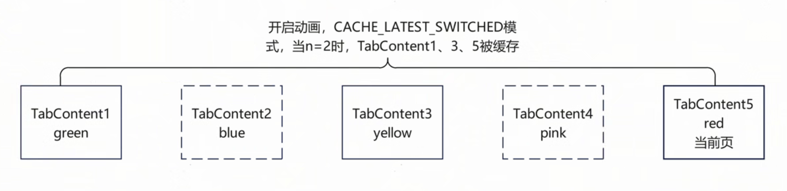

3. 如图18所示，关闭翻页动画，CACHE_BOTH_SIDE模式，n设置为2，点击TabBar切换到yellow页，TabContent1、3被缓存。再切换到red页，TabContent3、5被缓存，TabContent1释放。

**图18** 关闭翻页动画，CACHE_BOTH_SIDE模式示意图

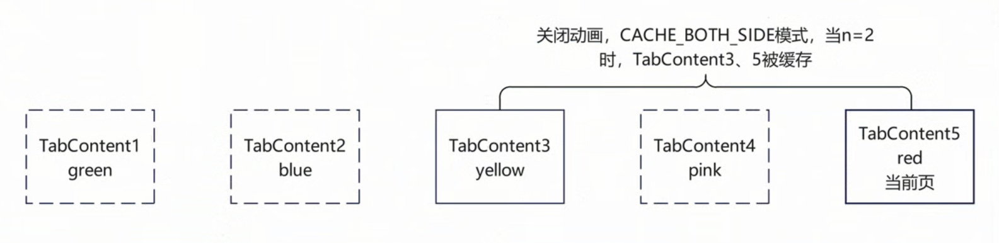

4. 如图19所示，关闭翻页动画，CACHE_LATEST_SWITCHED模式，n设置为2，点击TabBar切换到yellow页，TabContent1、3被缓存。再切换到red页，TabContent1、3、5被缓存。

**图19** 关闭翻页动画，CACHE_LATEST_SWITCHED模式示意图

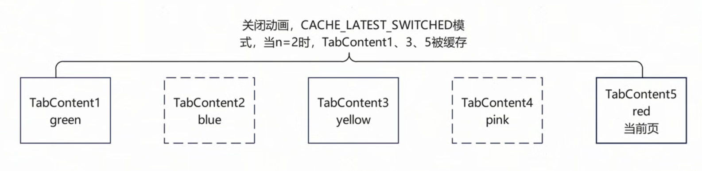

## 相关实例

如需详细了解Tabs的更多实现，请参考以下示例：

- [常用组件与布局](https://gitcode.com/openharmony/codelabs/tree/master/ETSUI/ArkTSComponents)
<!--RP1--><!--RP1End-->