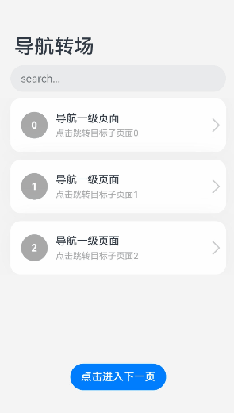

# 导航转场


导航转场是页面的路由转场方式，也就是一个界面消失，另外一个界面出现的动画效果。导航转场的动画效果是系统定义的，开发者不能修改。


导航转场推荐使用[Navigation](../reference/arkui-ts/ts-basic-components-navigation.md)组件实现，可搭配[NavRouter](../reference/arkui-ts/ts-basic-components-navrouter.md)组件和[NavDestination](../reference/arkui-ts/ts-basic-components-navdestination.md)组件实现导航功能。


完整的代码示例和效果如下。


```ts
@Component
export struct MyFirstIndex {
  @Consume('pathInfos') pathInfos: NavPathStack
  name: string = ''
  @State value: string = ''

  build() {
    NavDestination() {
      Column() {
        Blank()
        Text('通过点击NavRouter区域进入导航目标页面' + this.value)
          .fontStyle(FontStyle.Italic)
          .lineHeight(35)
          .fontSize(25)
          .fontColor(Color.Black)
          .textAlign(TextAlign.Center)
          .letterSpacing(5)
          .textShadow({ radius: 2, offsetX: 4, offsetY: 4, color: 0x909399 })
          .padding({ left: 30, right: 30 })

        Blank()

        Button('返回上级页面')
          .backgroundColor(Color.Black)
          .onClick(() => {
            this.pathInfos.pop()
          })
        Blank()
      }
      .size({ width: '100%', height: '100%' })
    }.title(this.name + '二级页面')
  }
}

@Component
export struct MySecondIndex {
  @Consume('pathInfos') pathInfos: NavPathStack;
  name: String = '';
  @State value: String = ''

  build() {
    NavDestination() {
      Column() {
        Blank()
        Text('通过更新路由栈数据对象进入导航目标界面' + this.value)
          .fontStyle(FontStyle.Italic)
          .lineHeight(35)
          .fontSize(25)
          .fontColor(Color.Black)
          .textAlign(TextAlign.Center)
          .letterSpacing(5)
          .textShadow({ radius: 2, offsetX: 4, offsetY: 4, color: 0x909399 })
          .padding({ left: 30, right: 30 })

        Blank()

        Button('返回上级页面')
          .backgroundColor(Color.Black)
          .onClick(() => {
            this.pathInfos.pop()
          })
        Blank()
      }
      .size({ width: '100%', height: '100%' })
    }.title(this.name + '二级页面')
  }
}

@Entry
@Component
struct NavigationDemo {
  @Provide('pathInfos') pathInfos: NavPathStack = new NavPathStack()
  private listArray: Array<Number> = [0, 1, 2]

  @Builder NavPathStack() {
    Column() {
      Text('menu')
        .fontColor('#182431')
        .fontSize(14)
        .lineHeight(19)
        .opacity(0.4)
        .margin({ top: 30 })
    }
    .alignItems(HorizontalAlign.Start)
  }

  // Navigation的navDestination属性方法设置的构造函数，在路由栈变化时触发该构建数创建新的路由页面
  @Builder myRouter(name: string, param: string) {
    if (name == '方式一进入') {
      MyFirstIndex({ name: name, value: param })
    }
    if (name == '方式二进入') {
      MySecondIndex({ name: name, value: param })
    }
  }

  build() {
    Column() {
      Navigation(this.pathInfos) {
        TextInput({ placeholder: 'search...' })
          .width('90%')
          .height(40)
          .margin({ bottom: 10 })

        // 通过List定义导航的一级界面
        List({ space: 12, initialIndex: 0 }) {
          ForEach(this.listArray, (item : string) => {
            ListItem() {
              // 通过NavDestination定义导航目标界面，界面之间通过组件间的状态变量或者普通变量传递参数
              // NavRouter点击之后会传递name和param参数给Navigation的navDestination属性方法设置的builder函数(myRouter)
              NavRouter({ name: '方式一进入', param: '' + item }) {
                Row() {
                  Row() {
                    Text('' + item)
                      .fontColor(Color.White)
                      .fontSize(15)
                      .fontWeight(FontWeight.Bold)
                  }
                  .width(40)
                  .height(40)
                  .backgroundColor('#a8a8a8')
                  .margin({ right: 12 })
                  .borderRadius(20)
                  .justifyContent(FlexAlign.Center)

                  Column() {
                    Text('导航一级页面')
                      .fontSize(16)
                      .lineHeight(21)
                      .fontWeight(FontWeight.Medium)
                    Text('点击跳转目标子页面' + item)
                      .fontSize(13)
                      .lineHeight(21)
                      .fontColor('#a8a8a8')
                  }
                  .alignItems(HorizontalAlign.Start)

                  Blank()

                  Row()
                    .width(15)
                    .height(15)
                    .margin({ right: 12 })
                    .border({
                      width: { top: 2, right: 2 },
                      color: 0xcccccc
                    })
                    .rotate({ angle: 45 })
                }
                .borderRadius(15)
                .shadow({ radius: 100, color: '#ededed' })
                .width('90%')
                .alignItems(VerticalAlign.Center)
                .padding({ left: 16, top: 12, bottom: 12 })
                .height(80)
                .backgroundColor(Color.White)
              }
            }
            .width('100%')
          }, (item : string) : string => item)
        }
        .listDirection(Axis.Vertical)
        .edgeEffect(EdgeEffect.Spring)
        .sticky(StickyStyle.Header)
        .chainAnimation(false)
        .width('100%')

        Column()
          .height('20%')

        Button('点击进入下一页')
          .onClick(() => {
            // 通过操作绑定的路由栈数据对象触发Navigation更新,基于pathInfos数据变化场景触发navDestination属性方法构建新页面
            this.pathInfos.pushPathByName('方式二进入', 4)
          })
      }
      .navDestination(this.myRouter)
      .width('100%')
      .mode(NavigationMode.Auto)
      .title('导航转场') // 设置标题文字
    }
    .size({ width: '100%', height: '100%' })
    .backgroundColor(0xf4f4f5)
  }
}
```




