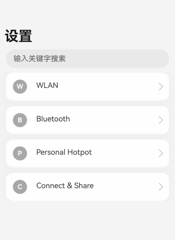

# 导航转场


导航转场是页面的路由转场方式，也就是一个界面消失，另外一个界面出现的动画效果。开发者也可以自定义导航转场的动画效果，具体请参考Navigation[示例3](../reference/apis-arkui/arkui-ts/ts-basic-components-navigation.md#示例3设置可交互转场动画)。


导航转场推荐使用[Navigation](../reference/apis-arkui/arkui-ts/ts-basic-components-navigation.md)组件实现，可搭配[NavDestination](../reference/apis-arkui/arkui-ts/ts-basic-components-navdestination.md)组件实现导航功能。


完整的代码示例和效果如下。

## 创建导航页
实现步骤为：

1.使用Navigation创建导航主页，并创建路由栈NavPathStack以此来实现不同页面之间的跳转。

2.在Navigation中增加List组件，来定义导航主页中不同的一级界面。

3.在List内的组件添加onClick方法，并在其中使用路由栈NavPathStack的pushPathByName方法，使组件可以在点击之后从当前页面跳转到输入参数name在路由表内对应的页面。
```ts
//Index.ets
@Entry
@Component
struct NavigationDemo {
  @Provide('pathInfos') pathInfos: NavPathStack = new NavPathStack();
  private listArray: Array<string> = ['WLAN', 'Bluetooth', 'Personal Hotspot', 'Connect & Share'];

  build() {
    Column() {
      Navigation(this.pathInfos) {
        TextInput({ placeholder: '输入关键字搜索' })
          .width('90%')
          .height(40)
          .margin({ bottom: 10 })

        // 通过List定义导航的一级界面
        List({ space: 12, initialIndex: 0 }) {
          ForEach(this.listArray, (item: string) => {
            ListItem() {
              Row() {
                Row() {
                  Text(`${item.slice(0, 1)}`)
                    .fontColor(Color.White)
                    .fontSize(14)
                    .fontWeight(FontWeight.Bold)
                }
                .width(30)
                .height(30)
                .backgroundColor('#a8a8a8')
                .margin({ right: 20 })
                .borderRadius(20)
                .justifyContent(FlexAlign.Center)

                Column() {
                  Text(item)
                    .fontSize(16)
                    .margin({ bottom: 5 })
                }
                .alignItems(HorizontalAlign.Start)

                Blank()

                Row()
                  .width(12)
                  .height(12)
                  .margin({ right: 15 })
                  .border({
                    width: { top: 2, right: 2 },
                    color: 0xcccccc
                  })
                  .rotate({ angle: 45 })
              }
              .borderRadius(15)
              .shadow({ radius: 100, color: '#ededed' })
              .width('90%')
              .alignItems(VerticalAlign.Center)
              .padding({ left: 15, top: 15, bottom: 15 })
              .backgroundColor(Color.White)
            }
            .width('100%')
            .onClick(() => {
              this.pathInfos.pushPathByName(`${item}`, '详情页面参数'); // 将name指定的NaviDestination页面信息入栈,传递的参数为param
            })
          }, (item: string): string => item)
        }
        .listDirection(Axis.Vertical)
        .edgeEffect(EdgeEffect.Spring)
        .sticky(StickyStyle.Header)
        .chainAnimation(false)
        .width('100%')
      }
      .width('100%')
      .mode(NavigationMode.Auto)
      .title('设置') // 设置标题文字
    }
    .size({ width: '100%', height: '100%' })
    .backgroundColor(0xf4f4f5)
  }
}
```
## 创建导航子页
导航子页1实现步骤为：

1.使用NavDestination，来创建导航子页CommonPage。

2.创建路由栈NavPathStack并在onReady时进行初始化，获取当前所在的页面栈，以此来实现不同页面之间的跳转。

3.在子页面内的组件添加onClick，并在其中使用路由栈NavPathStack的pop方法，使组件可以在点击之后弹出路由栈栈顶元素实现页面的返回。
```ts
//PageOne.ets

@Builder
export function MyCommonPageBuilder(name: string, param: string) {
  MyCommonPage({ name: name, value: param });
}

@Component
export struct MyCommonPage {
  pathInfos: NavPathStack = new NavPathStack();
  name: String = '';
  @State value: String = '';

  build() {
    NavDestination() {
      Column() {
        Text(`${this.name}设置页面`)
          .width('100%')
          .fontSize(20)
          .fontColor(0x333333)
          .textAlign(TextAlign.Center)
          .textShadow({
            radius: 2,
            offsetX: 4,
            offsetY: 4,
            color: 0x909399
          })
          .padding({ top: 30 })
        Text(`${JSON.stringify(this.value)}`)
          .width('100%')
          .fontSize(18)
          .fontColor(0x666666)
          .textAlign(TextAlign.Center)
          .padding({ top: 45 })
        Button('返回')
          .width('50%')
          .height(40)
          .margin({ top: 50 })
          .onClick(() => {
            //弹出路由栈栈顶元素，返回上个页面
            this.pathInfos.pop();
          })
      }
      .size({ width: '100%', height: '100%' })
    }.title(`${this.name}`)
    .onReady((ctx: NavDestinationContext) => {
      // NavDestinationContext获取当前所在的页面栈
      this.pathInfos = ctx.pathStack;
    }) 

  }
}


```
导航子页2实现步骤为：

1.使用NavDestination，来创建导航子页SharePage。

2.创建路由栈NavPathStack并在onReady时进行初始化，获取当前所在的页面栈，以此来实现不同页面之间的跳转。

3.在子页面内的组件添加onClick，并在其中使用路由栈NavPathStack的pushPathByName方法，使组件可以在点击之后从当前页面跳转到输入参数name在路由表内对应的页面。
```ts
//PageTwo.ets
@Builder
export function MySharePageBuilder(name: string) {
  MySharePage({ name: name });
}

@Component
export struct MySharePage {
  pathInfos: NavPathStack = new NavPathStack();
  name: String = '';
  private listArray: Array<string> = ['Projection', 'Print', 'VPN', 'Private DNS', 'NFC'];

  build() {
    NavDestination() {
      Column() {
        List({ space: 12, initialIndex: 0 }) {
          ForEach(this.listArray, (item: string) => {
            ListItem() {
              Row() {
                Row() {
                  Text(`${item.slice(0, 1)}`)
                    .fontColor(Color.White)
                    .fontSize(14)
                    .fontWeight(FontWeight.Bold)
                }
                .width(30)
                .height(30)
                .backgroundColor('#a8a8a8')
                .margin({ right: 20 })
                .borderRadius(20)
                .justifyContent(FlexAlign.Center)

                Column() {
                  Text(item)
                    .fontSize(16)
                    .margin({ bottom: 5 })
                }
                .alignItems(HorizontalAlign.Start)

                Blank()

                Row()
                  .width(12)
                  .height(12)
                  .margin({ right: 15 })
                  .border({
                    width: { top: 2, right: 2 },
                    color: 0xcccccc
                  })
                  .rotate({ angle: 45 })
              }
              .borderRadius(15)
              .shadow({ radius: 100, color: '#ededed' })
              .width('90%')
              .alignItems(VerticalAlign.Center)
              .padding({ left: 15, top: 15, bottom: 15 })
              .backgroundColor(Color.White)
            }
            .width('100%')
            .onClick(() => {
              this.pathInfos.pushPathByName(`${item}`, '页面设置参数');
            })
          }, (item: string): string => item)
        }
        .listDirection(Axis.Vertical)
        .edgeEffect(EdgeEffect.Spring)
        .sticky(StickyStyle.Header)
        .width('100%')
      }
      .size({ width: '100%', height: '100%' })
    }.title(`${this.name}`)
    .onReady((ctx: NavDestinationContext) => {
      // NavDestinationContext获取当前所在的页面栈
      this.pathInfos = ctx.pathStack;
    }) 
  }
}
```
## 创建路由跳转
实现步骤为：

1.工程配置文件module.json5中配置 {"routerMap": "$profile:route_map"}。

2.route_map.json中配置全局路由表，路由栈NavPathStack可根据路由表中的name将对应页面信息入栈。
```ts
{
  "routerMap" : [
    {
      "name" : "WLAN",
      "pageSourceFile"  : "src/main/ets/pages/PageOne.ets",
      "buildFunction" : "MyCommonPageBuilder"
    },
    {
      "name" : "Bluetooth",
      "pageSourceFile"  : "src/main/ets/pages/PageOne.ets",
      "buildFunction" : "MyCommonPageBuilder"
    },
    {
      "name" : "Personal Hotspot",
      "pageSourceFile"  : "src/main/ets/pages/PageOne.ets",
      "buildFunction" : "MyCommonPageBuilder"
    },
    {
      "name" : "Connect & Share",
      "pageSourceFile"  : "src/main/ets/pages/PageTwo.ets",
      "buildFunction" : "MySharePageBuilder"
    },
    {
      "name" : "Projection",
      "pageSourceFile"  : "src/main/ets/pages/PageOne.ets",
      "buildFunction" : "MyCommonPageBuilder"
    },
    {
      "name" : "Print",
      "pageSourceFile"  : "src/main/ets/pages/PageOne.ets",
      "buildFunction" : "MyCommonPageBuilder"
    },
    {
      "name" : "VPN",
      "pageSourceFile"  : "src/main/ets/pages/PageOne.ets",
      "buildFunction" : "MyCommonPageBuilder"
    },
    {
      "name" : "Private DNS",
      "pageSourceFile"  : "src/main/ets/pages/PageOne.ets",
      "buildFunction" : "MyCommonPageBuilder"
    },
    {
      "name" : "NFC",
      "pageSourceFile"  : "src/main/ets/pages/PageOne.ets",
      "buildFunction" : "MyCommonPageBuilder"
    }
  ]
}
```

